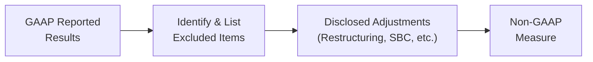

## 6.4 Interpreting Non-GAAP Reporting with Professional Skepticism

Non-GAAP measures have become increasingly commonplace in corporate reporting, offering management the opportunity to present financial performance through customized metrics that differ from traditional Generally Accepted Accounting Principles (GAAP). While non-GAAP measures can provide meaningful insights into underlying business operations, they also come with inherent risks of manipulation and inconsistency. This section explores how to interpret non-GAAP reporting through a lens of professional skepticism, ensuring that you, as an analyst or future CPA, can discern genuine performance enhancements from exaggerated or misleading presentations.

### Overview and Importance of Non-GAAP Measures

Non-GAAP measures are performance metrics that companies disclose voluntarily to supplement their GAAP financial statements. They are also referred to as “alternative performance measures” and can include metrics like Adjusted EBITDA, Free Cash Flow, Core Earnings, and many more. These measures can:

• Provide useful insights into underlying operational data.  
• Strip out one-time or nonrecurring charges to show a “normalized” performance.  
• Help analysts focus on certain aspects of the business, such as cash flow or operational profitability.

However, the flexibility afforded by non-GAAP measures also introduces challenges. When management has significant discretion over adjustments—like removing stock-based compensation, restructuring charges, and merger-related costs—users of financial statements must remain vigilant, questioning how and why these items are excluded or recalculated. If scrutinized incorrectly, non-GAAP measures can warp the perception of a company’s financial health and mislead stakeholders.

### Key Differences Between GAAP and Non-GAAP

Unlike GAAP metrics, which follow authoritative accounting principles outlined by standard setters (such as the Financial Accounting Standards Board, or FASB), non-GAAP measures have no single set of established rules. This absence of standardized guidelines reveals two major differences:

• Definition Flexibility: Companies can define their own adjustments, leading to methods that vary widely across the same industry or even within the same company over time.  
• Disclosure Practices: GAAP-based statements are required to adhere to uniform presentation standards, but non-GAAP disclosures are often scattered across investor presentations, press releases, or MD&A (Management Discussion & Analysis) sections.

Because of these differences, the Securities and Exchange Commission (SEC) and other regulators monitor companies’ non-GAAP reporting closely to ensure disclosures are not intentionally misleading. As such, it is critical that non-GAAP measures be clearly reconciled to GAAP in footnotes or supplementary disclosures, allowing users to see precisely how the company arrived at its adjusted figure.

### Common Non-GAAP Measures

Various non-GAAP measures have gained popularity. Here are a few of the most frequently encountered:

• EBITDA and Adjusted EBITDA: Earnings before interest, taxes, depreciation, and amortization. Adjusted EBITDA may also exclude stock-based compensation, impairments, or restructuring charges.  
• Free Cash Flow (FCF): Cash flow from operations minus capital expenditures, often indicating the business’s ability to generate cash.  
• Core Earnings or Adjusted Income: GAAP Net Income adjusted for one-time, unusual, or nonoperational items such as acquisitions or discontinued operations costs.  
• Non-GAAP Gross Margins: GAAP gross margins adjusted for non-cash compensation or intangible amortization.

Each of these metrics can serve different analytical functions. EBITDA is popular for measuring a company’s operational performance free from capital structure influences, while free cash flow may illuminate how much cash is left for dividends, share repurchases, or strategic investments. 

### Potential Manipulations and Red Flags

While non-GAAP measures can clarify certain performance aspects, they are also susceptible to manipulation. Professional skepticism requires vigilance in identifying red flags and patterns that may signal inaccuracies or intentional smoothing of results:

• Inconsistent Adjustments: If a company classifies an expense as “one-time” or “nonrecurring” every single year, it raises questions about why that expense keeps emerging. Are these truly sporadic events or part of the normal course of business?  
• Omission of Recurring Costs: Excluding recurring expenses such as leases, rent, or certain stock-based compensation can inflate profits unfairly and present a misleading picture of the company’s true operational costs.  
• Lack of Transparency: Some firms may bundle many expenses under broad labels—“Restructuring Charges,” “Extraordinary Items,” or “Special Items”—without detailed disclosures of the nature or magnitude of each.  
• Frequent Changes in Definitions: Abrupt changes in the way management defines or calculates a non-GAAP metric from one period to another can obscure meaning, potentially confusing readers about real trends in performance.  
• Operating vs. Non-Operating Components: Management may selectively remove or add certain non-operating items, such as certain gains or losses from affiliates, to arrive at a more “favorable” outcome.

Thoroughly comparing the non-GAAP measure to its GAAP equivalent is crucial for detecting any material inconsistencies. By reconciling line items from both sets of figures, analysts can pinpoint sources of divergence and ask pointed follow-up questions.

### Applying Professional Skepticism

Professional skepticism entails an alert and questioning mind—both trusting but verifying. When evaluating non-GAAP measures:

• Scrutinize Reconciliations: Always look for a clear, numerical reconciliation from GAAP measures to non-GAAP metrics. This should be disclosed within earnings press releases, SEC filings, or investor presentations.  
• Investigate Exclusions: Ask whether key items excluded in the non-GAAP measure are truly one-time or of an infrequent nature. Consider historical frequencies of similar events.  
• Analyze Trends Over Time: Evaluate whether the adjustments consistently inflate performance in each period. If so, consider the possibility of management bias or opportunistic reporting.  
• Compare with Peer Disclosures: Where possible, compare your target company’s non-GAAP measures and exclusion types to those of its industry peers. Outlier adjustments could signal irregular or aggressive practices.  
• Factor in Materiality: Some adjustments may be large enough to sway investment or lending decisions. Do not disregard them as immaterial until you have carefully analyzed their financial impact.

Ultimately, professional skepticism involves combining your existing knowledge of the company’s business model, your understanding of regulatory guidance, and your familiarity with the industry’s typical reporting patterns.

### Diagram: Flow of Adjustments from GAAP to Non-GAAP

Below is a simple diagram illustrating how companies transform GAAP results into non-GAAP measures:

In Figure 6.4.1, adjustments might include removing stock-based compensation (SBC), amortization of intangible assets, or nonrecurring restructuring charges. The final non-GAAP figure (D) can offer new insights but should always be referenced back to the original GAAP measure (A) to ensure completeness and reliability.

### Real-World Case Study

A software company announces its quarterly results highlighting “Adjusted EBITDA” that excludes all stock-based compensation. The rationale is that stock-based compensation is a non-cash expense not representative of operational performance. However, this company issues significant equity awards each year as part of its employee compensation strategy. From a purely GAAP standpoint, stock-based compensation is a recurring, material cost that could dilute existing shareholders over time.

By excluding these recurring stock award costs from its Adjusted EBITDA, the company’s profitability is significantly enhanced on paper. A skeptical analyst will:

• Review total stock-based compensation as a percentage of revenue.  
• Compare with historical trends and competitors’ disclosures.  
• Evaluate whether the exclusion is genuinely “nonrecurring.”  

If those costs appear to be part of the company’s normal compensation structure, labeling them as “nonrecurring” or “nonoperational” is questionable. Accordingly, the analyst might highlight GAAP results and consider adjusting any valuation models to incorporate stock-based compensation instead of ignoring it.

### Data Analytics in Non-GAAP Evaluation

Modern technology and analytics platforms can bolster your professional skepticism. By leveraging data analytics:

• Automate Comparison: Extract non-GAAP reconciliations across multiple periods or multiple filings to see how a company’s adjustments have evolved.  
• Benchmark Industry Averages: Compare the percentage of adjustments for one firm against peers to spot outliers in recognized trends.  
• Flag Repeated “Nonrecurring” Items: Use text-analysis tools to spot repeated mention of the same type of “one-time” expenses in consecutive annual or quarterly reports.

Data analytics tools can thus reduce the time needed to identify potential manipulations, leaving analysts more time to investigate the root causes.

### Best Practices for Critical Analysis

To effectively interpret non-GAAP metrics and maintain a high level of professional skepticism:

• Read the Earnings Release and Footnotes: Companies typically provide tabular presentations reconciling net income or other GAAP measures with their chosen non-GAAP metrics. Examine each line item carefully.  
• Identify Patterns: Look for recurring items that are consistently excluded from one period to the next.  
• Explore Qualitative Disclosures: Study the narrative in the MD&A or press release for management’s explanation behind each adjustment, verifying that it aligns with prior statements.  
• Understand Timing of Events: Large acquisitions, legal settlements, or restructuring plans often take multiple quarters to wrap up, so a single exclusion might not capture the entire cost.  
• Leverage Industry Knowledge: Use your awareness of normal business operations within the sector to differentiate plausible exclusions from questionable ones.

### Common Pitfalls for Analysts

Despite the guidelines above, there are typical pitfalls that may trap even seasoned professionals:

• Over-Reliance on Adjusted Figures: Failing to examine the GAAP baseline could lead to overestimating performance.  
• Incomplete Reconciliation: Missing or partial disclosures of how management arrived at its adjusted metric reduce transparency and hamper thorough analysis.  
• Lack of Back-Testing: Not comparing previous periods’ definitions of non-GAAP metrics to the current period’s definitions can hide changes in methodology.  
• Normalizing Non-Recurring Items Repeatedly: Analysts often accept management’s narrative about “one-time” charges without verifying if the same type of charge recurs regularly.

Recognizing these pitfalls can help you stay vigilant and maintain the objectivity necessary to interpret non-GAAP measures effectively.

### Broader Regulatory Perspective

Regulators acknowledge the potential benefit of non-GAAP measures but caution companies to avoid confusing or misleading presentations. The SEC’s Regulation G requires companies disseminating non-GAAP figures to include:

• An equal or greater prominence of the comparable GAAP measures.  
• A clear reconciliation showing how the non-GAAP number was derived.  
• A presentation that avoids giving undue emphasis or labeling on the adjusted figure over its GAAP counterpart.

Failing to follow these guidelines can result in regulatory scrutiny, enforcement actions, and damage to a company’s reputation. CPAs who provide assurance or review these statements must remain mindful of these rules, given their role in ensuring the reliability and integrity of financial reporting.

### Additional Case Example: Pharmaceutical Industry

Consider a pharmaceutical company launching a new product line. Its non-GAAP net income excludes ongoing research and development (R&D) costs tied to multiple pipeline projects, arguing that these costs do not relate directly to the revenue generated by its launched products. Over time, however, the company continues to exclude R&D in subsequent quarters as it claims “development is not central to mature product profits.”

A thorough evaluation reveals that ongoing R&D is fundamental to the core strategy of any pharmaceutical firm seeking new drug approvals and expansions of product indications. Analysts raising professional skepticism question whether the cost truly belongs outside the scope of operating performance. If the result is that these exclusions artificially inflate operating margins, investors might be overly optimistic about profitability.

### Leveraging Insight from Other Chapters

For a more holistic view of how non-GAAP measures fit into the broader financial picture, it is beneficial to:

• Recall ratio analysis from Chapter 4 to see if non-GAAP metrics significantly alter leverage or liquidity ratios.  
• Revisit the Balanced Scorecard concepts in Chapter 6.1 to assess whether the selected non-GAAP measure aligns with performance measures.  
• Refer to Chapter 7 for budgeting and forecasting contexts, especially if non-GAAP measures influence internal budgets or external projections.  
• Stay aligned with the ethical and risk assessment techniques from Chapter 8 to evaluate how non-GAAP disclosures could affect stakeholders’ risk perceptions.

### Conclusion

Interpreting non-GAAP reporting demands a balance between openness to management’s unique perspective on business performance and the professional skepticism necessary to detect potential bias or manipulation. By investigating reconciling items diligently, comparing disclosures to industry norms, and paying close attention to recurring or inconsistent adjustments, analysts and aspiring CPAs can form a well-rounded view of a company’s true financial health. Non-GAAP measures are powerful supplements to GAAP results—if they are used transparently and ethically.

---

## Non-GAAP Financial Measures: Your Professional Skepticism Quiz



### Which of the following best describes a potential risk when companies use non-GAAP measures?
- [ ] They discuss their core operations.
- [x] They might exclude genuine recurring costs, misrepresenting true performance.
- [ ] They help analysts compare financials across diverse industries.
- [ ] They provide secret data only to government agencies.

> **Explanation:** A primary concern with non-GAAP metrics is that companies might deem certain recurring costs as “nonrecurring,” potentially overstating their underlying performance.

### What is the main purpose of reconciling GAAP figures to non-GAAP results?
- [ ] To reduce the volume of footnotes in the financial statements.
- [x] To show exactly how and why adjustments have been made, ensuring transparency.
- [ ] To eliminate the need for GAAP reporting altogether.
- [ ] To comply with tax regulations and improve cash flow.

> **Explanation:** A proper reconciliation allows users to understand the specific adjustments management made and to gauge whether they are reasonable.

### Why might repeated “one-time” charges be a red flag?
- [ ] They are allowed only once per fiscal year under GAAP.
- [ ] They do not affect either GAAP or non-GAAP numbers.
- [x] They indicate an expense is not truly infrequent and could be overstating future earnings.
- [ ] They are phased out by IFRS Standards.

> **Explanation:** If “one-time” charges become annual occurrences, then characterizing them as nonrecurring misrepresents ongoing costs.

### How can data analytics help in evaluating non-GAAP metrics?
- [x] By automating the identification of repeated adjustments and spotting trends across periods.
- [ ] By hiding adjustments in pivot tables for easier reporting.
- [ ] By eliminating the need to review narratives in footnotes.
- [ ] By converting adjusted earnings to IFRS metrics automatically.

> **Explanation:** Automated text and numerical analysis can reveal persistent expenses that are repeatedly labeled as one-time, among other insights.

### Which of the following is a best practice when analyzing non-GAAP measures?
- [ ] Accept them at face value if the CFO vouches for accuracy.
- [ ] Focus on the largest items only, ignoring smaller adjustments.
- [x] Examine footnotes and compare each adjusting item to the prior periods.
- [ ] Assume that all non-GAAP measures comply fully with SEC requirements.

> **Explanation:** Analyzing footnotes in detail and comparing them across periods is essential for spotting patterns and inconsistent treatment.

### What is the significance of SEC Regulation G in the context of non-GAAP measures?
- [ ] It bans all forms of non-GAAP endorsements by auditors.
- [ ] It allows companies to omit GAAP results if they choose.
- [ ] It requires a third-party audit of non-GAAP measures.
- [x] It mandates equal or greater prominence of GAAP measures and clear reconciliations for non-GAAP disclosures.

> **Explanation:** Regulation G ensures that non-GAAP disclosures do not overshadow or confuse GAAP metrics.

### Why might a company’s changing definition of its non-GAAP measure warrant additional scrutiny?
- [ ] Because the FASB demands a new metric every quarter.
- [ ] Because improving market conditions invalidate prior definitions.
- [ ] Because IFRS guidelines demand constant redefinition.
- [x] Because inconsistent definitions may hide unfavorable trends or inflate performance metrics.

> **Explanation:** If definitions change frequently, it may be more difficult to compare results over time, raising skepticism about the intent behind the changes.

### Which of the following is an example of a questionable practice in non-GAAP reporting?
- [ ] Excluding a rare legal settlement to show core operations.
- [ ] Providing a detailed reconciliation of net income to adjusted EBITDA.
- [x] Excluding recurring software subscription costs and describing them as "nonrecurring."
- [ ] Labeling intangible amortization as a non-cash charge in an investor presentation.

> **Explanation:** While labeling strictly nonrecurring events or non-cash charges can be justifiable, repeatedly excluding subscription or core operational expenses is often misleading.

### How can industry benchmarking aid in evaluating non-GAAP measures?
- [x] It helps identify whether a company’s adjustments are unusual compared to its peers.
- [ ] It ensures that all companies have the same GAAP measures.
- [ ] It invalidates the use of GAAP entirely.
- [ ] It removes the need for any further reconciliations.

> **Explanation:** Benchmarking non-GAAP disclosures against peer companies can reveal outliers and indicate potential manipulation or aggressive reporting.

### Non-GAAP measures must not:
- [x] Be given more prominence than comparable GAAP measures under SEC rules.
- [ ] Use footnotes to reconcile adjustments.
- [ ] Include supplementary detail about business segments.
- [ ] Appear in investor materials or presentations.

> **Explanation:** Under SEC guidance, the GAAP figures should remain predominant, ensuring that investors are not misled into prioritizing the company’s adjusted performance metrics over GAAP-responsible reporting.



---

## For Additional Practice and Deeper Preparation

### [Business Analysis and Reporting (BAR) CPA Mock Exams](https://www.udemy.com/course/bar-cpa-mock-exams/?referralCode=ADBE2E84BEE9CB6243CA)

**Business Analysis and Reporting (BAR) CPA Mocks:** 6 Full (1,500 Qs), Harder Than Real! In-Depth & Clear. Crush With Confidence!

- Tackle full-length mock exams designed to mirror real BAR questions.  
- Refine your exam-day strategies with detailed, step-by-step solutions for every scenario.  
- Explore in-depth rationales that reinforce higher-level concepts, giving you an edge on test day.  
- Boost confidence and minimize anxiety by mastering every corner of the BAR blueprint.  
- Perfect for those seeking exceptionally hard mocks and real-world readiness.

_Disclaimer: This course is not endorsed by or affiliated with the AICPA, NASBA, or any official CPA Examination authority. All content is for educational and preparatory purposes only._
