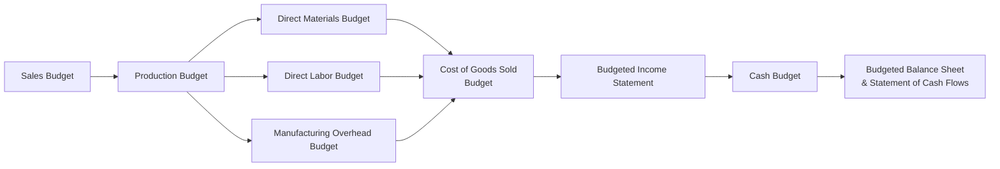

## 7.1 Master Budgeting (Sales, Production, Cash, etc.)

Master budgeting is the comprehensive process of mapping out an organization’s financial plans for a given period—often a fiscal year—by integrating numerous sub-budgets, including sales, production, direct materials, direct labor, overhead, selling and administrative expenses, and ultimately culminating in projected financial statements and a cash budget. This cohesive set of budgets serves multiple functions: it guides goal setting, resource allocation, performance evaluation, and strategic decision-making. Alongside forecasting methods highlighted in Chapter 7’s later sections, a well-prepared master budget provides the financial architecture from which companies plan future operations. 

In this section, we explore the building blocks of a master budget, walk through its logic step by step, and clarify how each component connects to the next. Given the critical role of budgeting in business analysis, every financial professional—particularly aspiring CPAs sitting for the BAR section of the exam—must grasp how master budgets are created, interpreted, and leveraged for decision-making. For more on essential cost classifications and variance analysis, see Chapter 5.1 and 5.3.

---

### Importance of the Master Budget

A master budget:

• Aligns strategic objectives with detailed operational targets.  
• Ensures consistency between different business functions, such as sales, production, and finance.  
• Acts as a roadmap for managing resources, setting targets, and detecting early deviations from plan.  
• Aids in performance measurement, revealing the causes of favorable or unfavorable variances.  

Whether you are a small startup or a multinational enterprise, the master budget structure remains foundational. Industry-specific peculiarities and scale may vary, but the underlying philosophy—planning your finances and controlling operations—remains constant.

---

### Key Components of a Master Budget

Despite variations in form and naming conventions across industries, most master budgets follow a similar structure. Here is an overview of the main components you will encounter:

• Sales Budget  
• Production (or Purchases) Budget  
• Direct Materials Budget  
• Direct Labor Budget  
• Manufacturing Overhead/Operating Expenses Budget  
• Budgeted Cost of Goods Sold (COGS)  
• Budgeted Income Statement  
• Cash Budget  
• Budgeted Balance Sheet  
• Budgeted Statement of Cash Flows (in some cases)

Each sub-budget feeds into the next, much like streams merging to form a river. The Sales Budget is typically the first, as anticipated sales volumes and revenues drive critical operational requirements for production, materials, labor, and overhead.

Below is a Mermaid diagram showing how various sub-budgets flow into each other to form the master budget. Notice how the Sales Budget at one end influences the final financial statements on the other.

---

### Building Each Sub-Budget

#### Sales Budget

The Sales Budget is the starting point of most master budgets. Accurate sales forecasts ensure that your subsequent budgets—particularly those concerning production and expenses—are realistic. Sales forecasting itself can leverage historical data, market research, and predictive analytics (Chapter 3 offers a deeper look at data analytics tools).

• Formula:  
  Total Budgeted Sales = Expected Sales Volume × Unit Selling Price  

• Common Pitfalls:  
  – Overly optimistic or pessimistic estimates can distort production costs and inventory requirements.  
  – Failing to consider seasonal fluctuations might produce inaccurate monthly or quarterly forecasts.  

#### Production Budget

For manufacturers, the Production Budget defines the quantity of units that must be produced to meet sales demand and maintain desired inventory levels. It typically follows a simple structure:

  
(1) Units Required for Sales  
+ (2) Desired Ending Inventory of Finished Goods  
= (3) Total Finished Goods Required  
– (4) Beginning Inventory of Finished Goods  
= (5) Units to Produce  

A similar approach applies to retail or wholesale companies, but they often use a Purchases Budget instead, focusing on how many units must be purchased from suppliers rather than produced.

#### Direct Materials Budget

The Direct Materials Budget outlines how much raw material must be acquired to support the planned production. Typically, it involves:

  
(1) Production in Units × Raw Material Needed per Unit  
= Total Raw Material Required  
+ Desired Ending Raw Material Inventory  
– Beginning Raw Material Inventory  
= Raw Material to Purchase  

Errors in calculating direct materials can lead to shortages or excess buildup of inventory—both of which increase costs and logistical complications. 

#### Direct Labor Budget

Direct Labor Budgets determine the total labor hours needed—based on the production budget—and multiply those hours by the labor cost per hour. This helps ensure appropriate staffing levels and cost containment. 

  
(1) Units to Produce × Direct Labor Hours per Unit × Hourly Wage Rate  
= Total Direct Labor Cost  

If labor is particularly specialized, the budgeting process must factor in training, overtime, or other labor constraints. 

#### Manufacturing Overhead (MOH) Budget

The Manufacturing Overhead Budget captures all production costs other than direct materials and direct labor. This could include:

• Indirect materials  
• Indirect labor (e.g., factory supervisors’ salaries)  
• Utilities and factory rent  
• Depreciation on manufacturing equipment  
• Maintenance and repairs  

Manufacturing overhead is often separated into variable (driven by activity levels) and fixed components (incurred regardless of output). Understanding each overhead category is critical to ensure accurate product costing and margin analysis.

#### Selling and Administrative Expenses Budget

While manufacturing overhead focuses on factory-related costs, Selling and Administrative (S&A) costs reflect broader operational expenses:

• Salaries for office and sales staff  
• Advertising and marketing  
• Office rent, utilities, and other administrative overhead  
• Technology-related costs (software, hardware, etc.)  
• Miscellaneous expenses (insurance, travel, etc.)  

Separating variable and fixed S&A costs can improve the reliability of forecasting, facilitate better cost control, and help in margin analysis.

#### Budgeted Cost of Goods Sold (COGS)

Once you have established the Production Budget, Direct Materials Budget, Direct Labor Budget, and Manufacturing Overhead Budget, it becomes possible to estimate your Cost of Goods Manufactured (COGM) and Cost of Goods Sold:

  
(1) Beginning Finished Goods Inventory  
+ Cost of Goods Manufactured (Direct Materials + Direct Labor + Overhead)  
= Cost of Goods Available for Sale  
– Ending Finished Goods Inventory  
= Cost of Goods Sold  

Accurately estimating COGS is essential for your Budgeted Income Statement, influencing gross margins and net profitability targets.

#### Budgeted Income Statement

The Budgeted Income Statement brings together forecasted revenues and expenses to project net income. A simplified representation is:

  
Sales  
– Cost of Goods Sold  
= Gross Margin  
– Selling & Administrative Expenses  
= Operating Income  
– Non-Operating Items (e.g., interest expense)  
= Net Income  

In KaTeX, you might express Operating Income as:


\text{Operating Income} = \text{Sales} - \text{Cost of Goods Sold} - \text{Operating Expenses}


The Budgeted Income Statement is critical for evaluating expected profitability—an essential measure for shareholders, creditors, and management alike.

#### Cash Budget

The Cash Budget ensures adequate liquidity to meet operational needs, capital investments, and financing obligations. Generally, a Cash Budget has three main sections:

• Cash Receipts (from sales, collections on accounts receivable, etc.)  
• Cash Disbursements (payments to suppliers, labor, overhead, operating expenses, capital expenditures)  
• Financing (borrowings or repayments of debt, interest payments)  

A shortfall in cash can lead to critical liquidity problems, whereas excessive cash on hand might indicate opportunities for investment or debt reduction. Proper planning of cash flows is fundamental to ongoing solvency.

#### Budgeted Balance Sheet and Statement of Cash Flows

Lastly, companies prepare a Budgeted Balance Sheet and, at times, a Budgeted Statement of Cash Flows. The Balance Sheet estimates year-end levels of assets, liabilities, and owners’ equity after factoring in all the projected transactions. The Statement of Cash Flows organizes cash flows by operating, investing, and financing activities, thereby revealing the “how” and “why” behind the changes in cash projected in the Cash Budget.

---

### Small Numeric Example: Alpha Manufacturing

To illustrate the process, consider Alpha Manufacturing, a small hypothetical producer of handheld gadgets:

• Forecasted Sales for Q1: 1,000 units at $50 per unit  
• Forecasted Sales for Q2: 1,200 units at $50 per unit  

Alpha wants to maintain a Finished Goods Inventory at the end of each quarter equal to 20% of the following quarter’s sales. Beginning Finished Goods Inventory for Q1 is 150 units. Each gadget requires 2 units of a specific raw material, purchased at $5 per unit. Alpha wants to maintain enough raw materials on hand at the end of each quarter to cover 25% of the following quarter’s production needs. Beginning raw material inventory is 400 units.

Direct labor costs are $10 per labor hour, and each gadget requires 0.5 labor hours to produce. Manufacturing Overhead includes a fixed component of $10,000 per quarter plus a variable component of $3 per unit produced. Selling and Administrative costs amount to $4 per unit sold, plus a quarterly fixed fee of $2,000.

Below, we walk step by step through the first quarter’s sub-budgets.

#### Sales Budget (Q1)

Units Sold in Q1 = 1,000  
Selling Price per Unit = $50  

Total Sales Revenue = 1,000 × $50 = $50,000  

#### Production Budget (Q1)

Desired Ending Finished Goods Inventory for Q1 is based on 20% of Q2’s forecast (1,200 units).  

Desired Ending FG Inventory (Q1) = 1,200 × 20% = 240 units  

Total Units Required = Units Sold (Q1) + Desired Ending FG Inventory (Q1)  
= 1,000 + 240 = 1,240 units  

Beginning FG Inventory (Q1) = 150 units  

Units to Produce (Q1) = Total Units Required – Beginning FG Inventory  
= 1,240 – 150 = 1,090 units  

#### Direct Materials Budget (Q1)

Raw Material Required: Each gadget requires 2 raw material units. For 1,090 gadgets, total raw material needed is:

Total Raw Material Needed = 1,090 × 2 = 2,180 units  

Desired Ending Raw Material Inventory for Q1 is 25% of Q2’s production needs. First, we need Q2’s production needs:  

Q2’s Desired Ending FG Inventory (based on Q3’s hypothetical forecast, or continuing the pattern) is not provided, but for simplicity, let’s assume Q2 also produces 1,200 units for its sales and any additional inventory policy.  

Desired Ending Raw Material Inventory (Q1) = 25% of (Q2 Production × 2 units/gadget)  
= 25% of (1,200 × 2)  
= 25% of 2,400 = 600 units  

Beginning Raw Material Inventory (Q1) = 400 units  

Raw Material to Purchase (Q1) = (Total Raw Material Needed + Desired Ending RM Inventory) – Beginning RM Inventory  
= (2,180 + 600) – 400 = 2,380 units  

At a cost of $5/unit:  

Purchase Cost = 2,380 × $5 = $11,900  

#### Direct Labor Budget (Q1)

Each gadget requires 0.5 labor hours. Planned production: 1,090 gadgets in Q1.  

Total Labor Hours = 1,090 × 0.5 = 545 hours  
Direct Labor Cost per Hour = $10  

Total Direct Labor Cost = 545 × $10 = $5,450  

#### Manufacturing Overhead Budget (Q1)

Variable MOH per Gadget = $3  
Fixed MOH per Quarter = $10,000  

Total Variable MOH = 1,090 × $3 = $3,270  

Total MOH = Fixed MOH + Variable MOH = $10,000 + $3,270 = $13,270  

#### Selling and Administrative Budget (Q1)

Variable S&A per Unit Sold = $4  
Fixed S&A = $2,000  

Units Sold in Q1 = 1,000  

Variable S&A = 1,000 × $4 = $4,000  

Total S&A = Fixed S&A + Variable S&A = $2,000 + $4,000 = $6,000  

#### Budgeted Income Statement (Q1)

• Sales (1,000 units × $50) = $50,000  
• Cost of Goods Sold:  
  – Direct Materials: 2 units × $5 × 1,000 units sold (this is approximate for the goods sold portion, though a portion of production might remain in inventory, but for simplicity we assume all produced are sold in Q1 or minimal difference)  
  – Direct Labor: 0.5 hours × $10 × 1,000 units sold  
  – MOH allocated to the units sold  

(Note that in a more refined approach, you would use beginning and ending finished goods to find COGS precisely. For brevity, assume no leftover from the newly produced goods at quarter-end, or that overhead is allocated uniformly.)

Approximate Cost of Goods Sold:

• Direct Materials = $5 × 2 × 1,000 = $10,000  
• Direct Labor = 0.5 × $10 × 1,000 = $5,000  
• MOH = Some portion of $13,270 allocated to the units sold. If 1,090 units were produced, the per-unit overhead is $13,270 ÷ 1,090 ≈ $12.18 per unit. For 1,000 sold units, that is 1,000 × $12.18 = $12,180.  

Total COGS ≈ $10,000 + $5,000 + $12,180 = $27,180  

Gross Margin = $50,000 – $27,180 = $22,820  

Less S&A = $6,000  

Operating Income ≈ $16,820  

Interest and taxes would be subtracted afterward if relevant.

#### Cash Budget (Q1)

• Cash Receipts: Assume 100% of Q1 sales is collected in Q1 → $50,000. (In reality, you might have AR aging schedules and partial collections in subsequent quarters.)  
• Cash Disbursements:  
  – Raw Materials Purchases = $11,900  
  – Direct Labor = $5,450  
  – MOH (excluding noncash items like depreciation if they exist) = For instance, $3,270 variable portion plus the cash portion of fixed overhead. Let’s assume $8,000 out of $10,000 is cash. Total ≈ $11,270.  
  – S&A = $6,000 (fixed + variable)  
• Net Cash from Operations = $50,000 – ( $11,900 + $5,450 + $11,270 + $6,000 ) = $50,000 – $34,620 = $15,380  

If Alpha decides to repay debt or invest surplus, it would appear under the Financing section of the Cash Budget.

---

### Common Pitfalls, Best Practices, and Strategies

**Pitfalls**  
• Inaccurate or incomplete data inputs: Overstated or understated demand can lead to suboptimal inventories.  
• Lack of cross-functional alignment: The sales team projects unrealistic sales growth, but the production team fails to adjust capacity.  
• Neglecting seasonality or cyclical changes: Straight-line approximations of demand and cost patterns can lead to major variances.  
• Inadequate review of historical variances: By ignoring past budget deviations, organizations repeat the same forecasting errors.

**Best Practices**  
• Foster collaboration: Involve all relevant departments (sales, production, finance, HR, etc.) in the budgeting process to ensure alignment.  
• Use data analytics: Incorporate the data analytics insights from Chapter 3.1 to refine sales forecasting and detect anomalies.  
• Plan for contingencies: Build in conservative assumptions or create multiple scenarios (see Chapter 7.3) to handle demand spikes or unexpected cost increases.  
• Maintain rolling forecasts: Revisit and update budgets periodically to respond quickly to market shifts.

**Strategies**  
• Emphasize continuous improvement: Compare budgeted vs. actual results systematically to improve forecasting models.  
• Align metrics and incentives: Tie performance metrics to budget targets in a way that encourages collaboration rather than sandbagging.  
• Document assumptions thoroughly: Clear documentation of assumptions about sales growth, cost escalations, and other factors ensures consistency and accountability.

---

### Real-World Applications

• Scenario Planning in Tech Startups: Rapidly evolving sales cycles and uncertain R&D expenses require flexible, iterative budgeting.  
• Seasonal Retailers: Holiday-oriented retailers rely heavily on monthly or even weekly budgeting to manage inventory peaks.  
• Manufacturing Conglomerates: Large manufacturers often integrate complex BOM (Bill of Materials) data into direct materials and overhead budgets, leveraging advanced ERP software for real-time updates.  
• Government and Nonprofits: While profit is not the primary motive, the underlying budgeting concepts apply, especially for ensuring efficient resource allocation and service delivery.

---

### References for Further Study

• Horngren, C. T., Datar, S. M., & Rajan, M. V. (2020). Cost Accounting: A Managerial Emphasis.  
• Kaplan, R. S., & Norton, D. P. (1996). The Balanced Scorecard: Translating Strategy Into Action.  
• Online Tutorials on Excel-Based Budgeting Templates and ERP Systems (e.g., SAP, Oracle).  

For technology-driven methods and bridging the gap between data analytics and budgeting, refer to Chapter 3: Data and Analytics. You may also want to fine-tune your approach by exploring advanced variance analysis methods as discussed in Chapter 5.3.

---

## Master Budgeting Essentials: Test Your Knowledge



### A company's master budget process usually begins with which sub-budget?

- [x] Sales budget
- [ ] Production budget
- [ ] Direct materials budget
- [ ] Cash budget

> **Explanation:** The sales budget typically initiates the entire budgeting cycle by setting the volume and revenue targets for the organization. This information guides production schedules, materials purchasing, and subsequent budgets.

### Which of the following formulas correctly represents total units to be produced in a Production Budget?

- [x] (Budgeted Sales + Desired Ending Inventory) – Beginning Inventory
- [ ] Budgeted Sales × Unit Selling Price – Fixed Costs
- [ ] (Direct Materials + Direct Labor) – Overhead Costs
- [ ] Total Units Sold ÷ Desired Ending Inventory

> **Explanation:** The Production Budget dictates how many units must be produced by adding budgeted sales and desired ending finished goods inventory, then subtracting beginning inventory.

### In a Direct Materials Budget, how is the raw material to be purchased calculated?

- [x] (Raw Material Needed for Production + Desired Ending Raw Material Inventory) – Beginning Raw Material Inventory
- [ ] (Raw Material Needed for Production – Beginning Finished Goods Inventory) + Desired Ending Finished Goods Inventory
- [ ] (Sales + Production Budget) × Price per Unit of Raw Material
- [ ] Fixed Direct Materials per Quarter × Unit Selling Price

> **Explanation:** The standard formula for raw material requirements is what material production requires plus what you want left over at period-end, minus what you already have on hand.

### Which component of the master budget ensures an organization can meet its financial obligations when they come due?

- [x] Cash Budget
- [ ] Income Statement
- [ ] Sales Budget
- [ ] Overhead Budget

> **Explanation:** The Cash Budget focuses explicitly on the timing and sufficiency of cash inflows and outflows, ensuring the organization maintains adequate liquidity.

### Total overhead costs are commonly classified into which major categories?

- [x] Variable and fixed expenses
- [ ] Direct and indirect expenses
- [x] Variable and step-variable expenses
- [ ] Controllable and uncontrollable expenses

> **Explanation:** Overhead often includes both variable and fixed elements. Some industries also consider step-variable costs, where costs remain fixed over certain ranges but then jump to the next level, hence the mention of step-variable expenses.

### You have determined that total unit sales for a quarter will be 5,000 units. Each unit requires two direct labor hours at a rate of $12 per hour. If you plan to produce 5,200 units, what is your total direct labor cost?

- [x] 5,200 × 2 × $12 = $124,800
- [ ] 5,000 × 2 × $12 = $120,000
- [ ] 5,200 ÷ 2 × $12 = $31,200
- [ ] 5,200 × $24 = $124,800

> **Explanation:** The total direct labor cost equals the number of units to produce multiplied by the direct labor hours required per unit and the labor cost per hour. Here, 5,200 units × 2 hours × $12/hour.

### A budgeted income statement commonly includes which of the following elements?

- [x] Sales and cost of goods sold
- [ ] Only non-operating revenues
- [x] Operating expenses
- [ ] Cash shortages and overages

> **Explanation:** The budgeted income statement generally shows sales, cost of goods sold, operating expenses, and net income. Non-operating items like interest expense or revenue might also appear, but cash shortages/overages typically show up in the Cash Budget or the Statement of Cash Flows.

### Which of the following best describes a “desired ending inventory” in the Production Budget?

- [x] The amount of finished goods that management wants on hand at the end of the period
- [ ] The excess of cost of goods sold over total sales revenue
- [ ] The difference between actual and budgeted production
- [ ] The difference between variable and fixed overhead

> **Explanation:** In the Production Budget, management plans for a specific ending balance of finished goods to meet future sales requirements or any strategic inventory policy, often expressed as a percentage of next period’s sales.

### If a retailer lacks the capacity to manufacture goods, which budget often replaces the Production Budget in their master budget?

- [x] Purchases Budget
- [ ] Capital Expenditure Budget
- [ ] Research & Development Budget
- [ ] Segment Reporting Budget

> **Explanation:** Retailers do not produce goods but instead buy them from suppliers. Therefore, they prepare a Purchases Budget to ensure they have enough inventory to meet sales projections.

### True or False: A master budget typically includes both the Budgeted Income Statement and the Budgeted Balance Sheet.

- [x] True
- [ ] False

> **Explanation:** A master budget includes major projected financial statements, most notably the Budgeted Income Statement and the Budgeted Balance Sheet, ensuring a comprehensive view of the organization’s future financial position.



---

## For Additional Practice and Deeper Preparation

### [Business Analysis and Reporting (BAR) CPA Mock Exams](https://www.udemy.com/course/bar-cpa-mock-exams/?referralCode=ADBE2E84BEE9CB6243CA)

**Business Analysis and Reporting (BAR) CPA Mocks:** 6 Full (1,500 Qs), Harder Than Real! In-Depth & Clear. Crush With Confidence!

- Tackle full-length mock exams designed to mirror real BAR questions.  
- Refine your exam-day strategies with detailed, step-by-step solutions for every scenario.  
- Explore in-depth rationales that reinforce higher-level concepts, giving you an edge on test day.  
- Boost confidence and minimize anxiety by mastering every corner of the BAR blueprint.  
- Perfect for those seeking exceptionally hard mocks and real-world readiness.

_Disclaimer: This course is not endorsed by or affiliated with the AICPA, NASBA, or any official CPA Examination authority. All content is for educational and preparatory purposes only._
