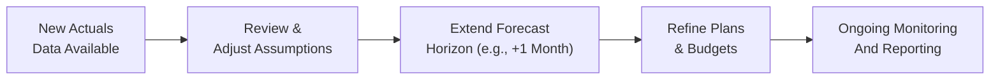
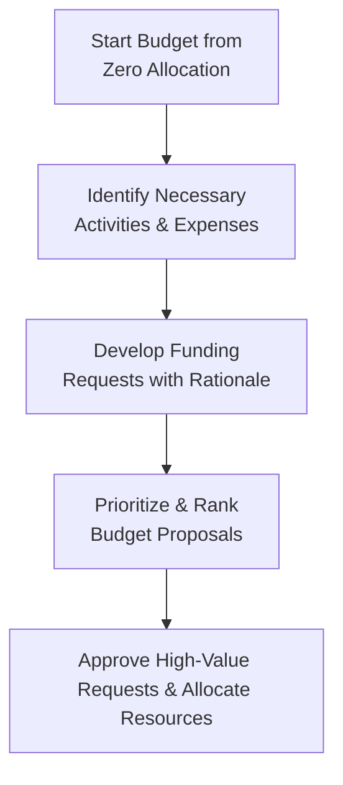

## 7.2 Rolling Forecasts and Zero-Based Budgeting

In today’s rapidly changing economic climate, the ability to adapt financial plans swiftly can offer organizations a vital competitive edge. Rolling forecasts and zero-based budgeting (ZBB) are two popular methods that enable companies to respond more dynamically to shifts in market conditions, internal operations, and strategic priorities. This section explores both methods in depth, offering practical insights, illustrative examples, and implementation strategies for CPA candidates and professionals eager to enhance their budgeting and forecasting toolkit.

Continuing from Chapter 7.1 (Master Budgeting), where we examined traditional, static budgeting approaches, here we delve deeper into flexible and iterative budgeting techniques. We will discuss when each approach is more appropriate, highlight specific tactics, and expose the common pitfalls and best practices. Readers of all levels—whether seasoned practitioners or students new to advanced budgeting concepts—will benefit from this holistic view of rolling forecasts and zero-based budgeting.

--------------------------------------------------------------------------------

### Rolling Forecasts: An Overview

A rolling forecast is a process by which an organization revisits and updates its budget or forecast at regular intervals (e.g., monthly or quarterly), extending the planning horizon each time. Rather than ending the forecast at the current fiscal year, the organization consistently looks ahead for the next 12, 18, or 24 months. This approach addresses one of the most significant limitations of a static budget: it often becomes outdated quickly if market conditions or strategic directions change.

Rolling forecasts are especially relevant in industries with rapid product cycles, high volatility, or strong seasonal variations. For instance, technology companies might use rolling forecasts to anticipate changes in product demand soon after quarterly earnings results, adjusting their assumptions for new product lines and R&D spending.

#### Key Advantages of Rolling Forecasts

• Continuous Adaptation: By updating assumptions regularly, the company remains responsive to changes in sales trends, inflationary pressures, or shifting consumer preferences.  
• Improved Accuracy over Time: Each new forecast incorporates the latest actual data, refining future projections and reducing forecast errors.  
• Better Alignment with Strategy: As each forecast iteration is reviewed, leadership can align resource allocation with evolving strategic objectives.  
• Enhanced Communication: Frequent updates foster ongoing dialogues among departments, ensuring that financial goals stay aligned with operational realities.

#### Rolling Forecast Process Flow

Below is a simple representation of the rolling forecast process. Each cycle revisits assumptions, incorporates updated actuals, and extends the forecast horizon to maintain a forward-looking vision.  

1. A["New Actuals  Data Available"]  
   The organization gathers updated financial data, key performance indicators (KPIs), and non-financial metrics (like customer retention rates or operational throughput) from the most recent period.

2. B["Review &  Adjust Assumptions"]  
   Senior management and financial analysts re-examine assumptions regarding growth rates, cost drivers, pricing, and market conditions, updating them to reflect the new data insights.

3. C["Extend Forecast  Horizon (e.g., +1 Month)"]  
   If the company is using a 12-month rolling forecast, after the old month drops off, an additional month is added, keeping the plan’s time window constant.

4. D["Refine Plans  & Budgets"]  
   Department heads work collaboratively to align their budgets with the revised forecasts. Expenditures may be reduced in slowing areas or increased where growth is accelerating.

5. E["Ongoing Monitoring  And Reporting"]  
   Throughout the remainder of the period, progress is tracked. Any major deviations trigger prompt corrective actions or further revisions to the forecast.

--------------------------------------------------------------------------------

### Practical Example of a Rolling Forecast

Imagine a rapidly growing software-as-a-service (SaaS) company that sells subscription-based solutions. Initially, the firm relies on an annual static budget set in January. By April, the marketplace evolves with new competitors; demand forecasts increase due to an unexpected surge in remote work, leading management to re-evaluate their revenue and R&D budget assumptions.

• In April, the company collects its Q1 actuals, noting a 10% higher sales growth than expected.  
• If using rolling forecasts, they incorporate this new data into their revenue projections for the subsequent months and extend the forecast window through the following April.  
• Product development budgets may be increased to support new subscriber features.  
• Marketing efforts could be re-allocated from less effective channels to more promising ones.  

Six months later, if a competitive threat emerges or the global economic environment changes (e.g., currency fluctuations or supply chain disruptions), the company updates its forecast again based on Q2 or Q3 results. This ongoing update cycle significantly enhances the relevance of financial projections compared to one static annual budget.

--------------------------------------------------------------------------------

### Best Practices for Rolling Forecasts

• Frequency of Updates: Most organizations update forecasts monthly or quarterly. The optimal frequency balances effort with agility. Overly frequent updates (e.g., weekly) can lead to “forecast fatigue.”  
• Data Integrity: As discussed in Chapter 3 (Data and Analytics), reliable and current data is pivotal. Automated data collection and integration systems can enhance accuracy and reduce manual work.  
• Cross-Functional Collaboration: Align departmental forecasts with corporate strategic objectives. Encourage open channels of communication to validate assumptions and capture new information.  
• Risk Management: Incorporate multiple scenarios (see Chapter 7.3 on Sensitivity Analysis and Scenario Planning) to account for macroeconomic, industry, and operational uncertainties, ensuring resiliency in the forecasts.

--------------------------------------------------------------------------------

### Common Pitfalls in Rolling Forecasts

• Over-Reliance on Short-Term Trends: Relying too heavily on recent data can cause overreactions to short-term fluctuations.  
• Insufficient Granularity: A rolling forecast might be too high-level if teams skip monitoring crucial cost drivers or revenue streams.  
• Siloed Updates: If departmental inputs remain uncoordinated, the forecast may become fragmented, causing internal inconsistencies.  
• Excessive Complexity: Too many metrics can make the process unwieldy. Establish key performance indicators strategically rather than measuring everything.

--------------------------------------------------------------------------------

### Zero-Based Budgeting (ZBB): An Overview

Zero-based budgeting is a method that starts the budgeting process from scratch each period—without any assumption that previous expenses or budget figures are automatically warranted. Every expense must be justified, demonstrating a clear link to organizational objectives. While incremental budgeting takes last period’s budget as a baseline (then adjusts upward or downward), ZBB resets all budgets to zero and requires managers to formally request funding based on necessity, efficiency, and alignment with company strategy.

ZBB’s roots date back to the 1970s, pioneered by large organizations and even adapted in government contexts. However, it has gained renewed momentum in recent years as companies seek to eliminate “budgetary slack,” control costs, and cultivate a mindset of continuous improvement.

#### Key Advantages of Zero-Based Budgeting

• Cost Discipline: ZBB forces each department to defend its spending, often uncovering redundant or low-value activities left unchallenged under incremental models.  
• Resource Realignment: Linking every requested dollar to strategic objectives allows organizations to prioritize high-impact projects.  
• Transparent Justification: ZBB’s thorough documentation can be beneficial if external auditors or regulators require clarity on expense allocations.  
• Cultural Shift: The rigorous approach demands a mindset focused on efficiency. Managers become more conscious of each expense and its business rationale.

--------------------------------------------------------------------------------

### Zero-Based Budgeting Process Flow

A typical ZBB process compels each department or function to start from zero, build up justifications for expenses, and undergo a review and approval cycle. Below is a high-level illustration:

1. A["Start Budget from  Zero Allocation"]  
   Every department assumes zero funding initially, eliminating any assumptions of historical budgets.

2. B["Identify Necessary  Activities & Expenses"]  
   Teams brainstorm all essential tasks and the costs required to sustain or improve operations, focusing on how each aligns with broader corporate strategy.

3. C["Develop Funding  Requests with Rationale"]  
   Proposals detail the expected return on investment (ROI), strategic benefit, and operational necessity for each expense line item.

4. D["Prioritize & Rank  Budget Proposals"]  
   Senior management or budget committees score proposals based on importance, strategic alignment, and expected outcomes.

5. E["Approve High-Value  Requests & Allocate Resources"]  
   Only the most compelling proposals receive funding, enabling cost optimization and alignment with top corporate objectives.

--------------------------------------------------------------------------------

### Practical Example of Zero-Based Budgeting

Consider a manufacturing firm with historically high overhead costs related to warehousing, distribution logistics, and administrative overhead. Using a traditional incremental budget, each department’s budget from the previous year is generally accepted, and only incremental changes are made.

In a zero-based budgeting approach:

• Each department must detail every expense line item: labor costs, equipment leases, materials, etc.  
• The warehousing team might question whether maintaining multiple storage facilities remains essential, prompting a comparative analysis of alternative vendors or consolidated facilities.  
• Administrative teams may combine responsibilities or shift tasks to reduce headcount or technology redundancies.  
• Only those requests demonstrating clear necessity and strategic alignment—like an IT upgrade that delivers cost savings or compliance benefits—receive approval.  

This process often uncovers hidden inefficiencies. For example, a manufacturing support team responsible for internal quality checks might find it more cost-effective to automate certain processes if that reduces the reliance on external inspectors.

--------------------------------------------------------------------------------

### Best Practices for Zero-Based Budgeting

• Comprehensive Training: Educate all involved teams to articulate and defend their budget requests effectively.  
• Integrated Data Analysis: Using analytics tools (see Chapter 3.1 on data analytics) can help measure ROI and cost-benefit justifications more accurately.  
• Balance Rigor with Feasibility: Overly detailed line-item reviews can slow the entire budgeting cycle. Finding a sweet spot in detail level is essential.  
• Technology Utilization: Specialized budgeting software can handle ZBB’s complexity, facilitating item-by-item review while integrating past spending patterns for reference.

--------------------------------------------------------------------------------

### Common Pitfalls in Zero-Based Budgeting

• Excessive Time and Resource Consumption: Building a budget from zero can be labor-intensive, especially for large, complex organizations.  
• Risk of Short-Term Cost Cutting: Overemphasis on immediate cost reductions can starve projects with long-term strategic importance.  
• Potential for Demoralization: Managers may become frustrated if they constantly have to justify even minimal expenditures.  
• Lack of Executive Buy-In: If upper management is not genuinely committed, ZBB can devolve into a symbolic exercise, undermining credibility and benefits.

--------------------------------------------------------------------------------

### Rolling Forecasts vs. Zero-Based Budgeting: A Comparative View

Selecting between rolling forecasts and zero-based budgeting depends on several factors, including organizational culture, growth stage, industry volatility, and strategic priorities. In many cases, organizations do not have to choose exclusively but can adopt hybrid strategies. For instance, a company may use rolling forecasts to stay agile in revenue and profit projections while simultaneously employing zero-based budgeting techniques year-over-year to ensure tight cost management.

| Factor                      | Rolling Forecasts                           | Zero-Based Budgeting                              |
|-----------------------------|----------------------------------------------|---------------------------------------------------|
| Primary Focus               | Dynamic adaptation to updated actuals       | Intensive cost validation from a zero baseline    |
| Frequency of Review         | Regular (monthly or quarterly)             | Annual or Bi-Annual (sometimes more frequent)     |
| Resource Intensity          | Moderate (continuous updates)              | High (significant effort to re-justify expenses)  |
| Strategic Alignment         | Re-aligns forecasts with current realities | Ensures every expense is necessary and strategic  |
| Best Used When...           | The business environment changes rapidly   | Cost discipline and efficiency are top priorities |

• Environment Volatility: Rolling forecasts shine when external or internal conditions are fluid.  
• Cost Control: ZBB offers superior visibility into cost drivers and ensures expenditures remain tied to organizational priorities.  
• Resource Availability: Rolling forecasts can be updated by a dedicated finance team; ZBB can demand a broad organizational commitment.  

--------------------------------------------------------------------------------

### Implementation Considerations for CPA Candidates

1. **Technology and Data Requirements**: For both rolling forecasts and ZBB, robust data analytics and forecasting tools are invaluable. Cloud-based platforms (Chapter 3.3) and robotic process automation (RPA) can streamline repetitive tasks, freeing finance teams to focus on high-value analysis.  
2. **Cross-Functional Input**: In Chapter 2.3 (Business Processes and Transaction Cycles), we highlighted the importance of integrated data. Accurate budgeting demands insight from multiple departments, ensuring that cost drivers and revenue factors are not overlooked.  
3. **Scenario Analysis**: Linking rolling forecasts or ZBB to scenario modeling (Chapter 7.3) prepares organizations to handle best- and worst-case conditions, improving risk management capabilities.  
4. **Professional Skepticism**: Whether drafting a rolling forecast or conducting ZBB, remain alert for inflated requests or overly optimistic assumptions. CPA candidates should hone their analytical and communication skills to challenge questionable inputs.

--------------------------------------------------------------------------------

### Recommended Strategies for Success

• **Start Small**: If your organization is new to rolling forecasts or ZBB, pilot smaller departments or cost centers first. Iron out process kinks and gather feedback before expanding.  
• **Link to Long-Term Planning**: Rolling forecasts should feed into strategic roadmaps, ensuring near-term agility complements long-term goals. ZBB requires alignment with the corporate mission to maintain focus on truly essential expenditures.  
• **Reward Transparency**: Encourage department managers to highlight potential savings or efficiency gains. Recognize and compensate teams that successfully implement cost reductions consistent with business strategy.  
• **Leverage Data Visualization Tools**: Dynamic dashboards and real-time analytics can provide at-a-glance updates on forecast accuracy or budget utilization, simplifying the re-forecasting and zero-based justification cycles.

--------------------------------------------------------------------------------

### Conclusion

Rolling forecasts and zero-based budgeting represent powerful yet distinct approaches to budgeting and financial planning, each addressing the shortcomings often found in traditional static budgets. Rolling forecasts excel at maintaining agility and ensuring financial projections remain relevant throughout the year. In contrast, zero-based budgeting excels at rooting out inefficiencies and rigorously justifying every expense. Understanding their core principles, advantages, potential pitfalls, and best-fit scenarios empowers finance professionals to choose the methodology—or a hybrid of both—that best suits an organization’s objectives, risk appetite, and operational realities.

CPA candidates preparing for the Business Analysis and Reporting (BAR) section can anticipate questions regarding the strategic rationale for each approach and how to implement them effectively. Mastering these concepts will not only support exam success but also equip you with valuable tools to drive sustainable financial performance and strategic growth within any organization.

--------------------------------------------------------------------------------

## Rolling Forecasts and Zero-Based Budgeting Mastery Quiz



### According to the section, which of the following best describes a rolling forecast?

- [ ] A one-time static budget established at the beginning of the year.  
- [x] A budget updated periodically, extending the forecast window continually.  
- [ ] A budget where each department starts from zero every period.  
- [ ] A budget method exclusively used in public sector accounting.  

> **Explanation:** A rolling forecast continuously updates and extends its time frame, reflecting new data and market trends.

### Which is a standout benefit of zero-based budgeting (ZBB)?

- [ ] Reducing the financial planning cycle from quarterly to monthly.  
- [x] Identifying and eliminating unnecessary expenses by starting from a baseline of zero.  
- [ ] Guaranteeing unlimited spending in high-growth areas without departmental constraints.  
- [ ] Removing the need for detailed managerial justifications.  

> **Explanation:** ZBB begins each departmental budget at zero, requiring all expenses to be justified, which helps uncover redundant costs.

### In a rolling forecast environment, which best practice is typically recommended?

- [x] Updating forecasts at regular intervals (e.g., monthly or quarterly) to incorporate new data.  
- [ ] Conducting a budget review once per fiscal year and ignoring mid-year fluctuations.  
- [ ] Requiring all managers to eliminate 10% of their expenses each cycle.  
- [ ] Keeping the original budget static even if market conditions drastically change.  

> **Explanation:** Regular updates make rolling forecasts agile and responsive to current realities.

### One significant drawback of zero-based budgeting is:

- [ ] It tends to increase hidden costs.  
- [ ] It automatically uses last year’s budget as a baseline.  
- [x] It can be time-consuming and labor-intensive to justify each cost.  
- [ ] It cannot help in eliminating organizational inefficiencies.  

> **Explanation:** ZBB requires each expense be reconsidered and justified, which often demands extensive time and resources.

### A hybrid budgeting approach might involve:

- [x] Using rolling forecasts for revenue projections and applying ZBB principles to cost control.  
- [ ] Avoiding both rolling forecasts and ZBB altogether.  
- [x] Applying ZBB to certain cost centers while relying on incremental budgeting in others.  
- [ ] Prohibiting scenario analyses for cost management.  

> **Explanation:** Many organizations find value in mixing the dynamic insight from rolling forecasts with the cost discipline of ZBB, or applying ZBB selectively.

### How does rolling forecasting improve strategic alignment?

- [x] By continuously revising assumptions and re-aligning budgets with evolving organizational goals.  
- [ ] Through a one-time annual adjustment that accounts for inflation.  
- [ ] By outlawing departmental budget requests.  
- [ ] By minimizing communication between finance and operational units.  

> **Explanation:** Frequent reviews during rolling forecasts ensure budgets and strategic goals remain synchronized.

### Which scenario best illustrates when rolling forecasts are especially advantageous?

- [x] A tech startup experiencing constant changes in market demand and product features.  
- [ ] A non-profit operating under a fixed grant with predictable cash inflows.  
- [x] A stable manufacturing business with minimal fluctuations in output demand.  
- [ ] A hedge fund that invests only in government securities.  

> **Explanation:** Rapidly changing environments—like tech startups—reap great benefits from rolling forecasts due to their dynamic nature.

### What is a common pitfall of a poorly executed rolling forecast process?

- [ ] It consistently reduces forecast accuracy.  
- [ ] It removes the ability to track any past data.  
- [x] It may focus heavily on short-term data, leading to overreactions to minor fluctuations.  
- [ ] It eliminates collaboration between functional areas.  

> **Explanation:** Overemphasizing near-term variances can undermine strategic objectives, making the firm reactive instead of proactive.

### Which statement most accurately compares rolling forecasts to zero-based budgeting?

- [x] Rolling forecasts update financial projections periodically, whereas zero-based budgeting re-justifies each cost from scratch.  
- [ ] Rolling forecasts require no data updates, whereas zero-based budgeting updates monthly.  
- [ ] Rolling forecasts only apply to fixed costs, whereas zero-based budgeting applies to variable costs.  
- [ ] Rolling forecasts mandate arbitrary budget reductions, whereas zero-based budgeting is always incremental.  

> **Explanation:** Rolling forecasts extend and update the budgeting horizon, while zero-based budgeting reevaluates all expenses each cycle.

### A zero-based budgeting mindset especially emphasizes:

- [x] Justifying each expense to align with strategic priorities.  
- [ ] Maintaining last year’s budget allocations.  
- [ ] Spending as much as possible to exhaust the budget.  
- [ ] Avoiding justification for small recurring purchases.  

> **Explanation:** Zero-based budgeting requires every department to demonstrate the necessity and strategic relevance of its expenses.



--------------------------------------------------------------------------------

## For Additional Practice and Deeper Preparation

### [Business Analysis and Reporting (BAR) CPA Mock Exams](https://www.udemy.com/course/bar-cpa-mock-exams/?referralCode=ADBE2E84BEE9CB6243CA)  

**Business Analysis and Reporting (BAR) CPA Mocks:** 6 Full (1,500 Qs), Harder Than Real! In-Depth & Clear. Crush With Confidence! 

- Tackle full-length mock exams designed to mirror real BAR questions.  
- Refine your exam-day strategies with detailed, step-by-step solutions for every scenario.  
- Explore in-depth rationales that reinforce higher-level concepts, giving you an edge on test day.  
- Boost confidence and minimize anxiety by mastering every corner of the BAR blueprint.  
- Perfect for those seeking exceptionally hard mocks and real-world readiness.  

_Disclaimer: This course is not endorsed by or affiliated with the AICPA, NASBA, or any official CPA Examination authority. All content is for educational and preparatory purposes only._
