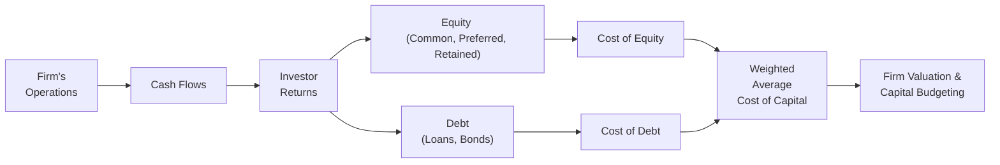

## 8.1 Capital Structure and Cost of Capital

Capital structure, in broad terms, refers to the way a company finances its overall operations and growth through a combination of debt, equity, and other securities. An optimal capital structure aims to balance the trade-offs between the use of debt, which is generally more cost-effective but increases financial risk, and equity, which is less risky but typically more expensive. Understanding how capital structure influences a firm’s overall cost of capital is paramount for effective business analysis and prospective decision-making. This section delves deeply into these core concepts, building upon risk assessment principles as outlined in this chapter, and connects with earlier topics in Business Analysis (see Chapter 4 on Financial Statement Analysis).

--------------------------------------------------------------------------------
### The Importance of Capital Structure
A firm’s capital structure exerts a profound impact on its financial health and strategic capabilities. The proportions of debt and equity can affect:

• Financial Flexibility: Firms with too much debt may find it burdensome to secure additional financing.  
• Risk Profile: Higher debt amplifies the firm’s leverage, heightening both the potential returns to equity holders and the probability of financial distress.  
• Return on Equity: By leveraging debt wisely, a firm can increase shareholder returns when the business is performing well. However, higher leverage can magnify losses when revenues decline.  
• Weighted Average Cost of Capital (WACC): A well-structured blend of financing sources helps minimize the company’s overall cost of capital, thus maximizing value.

Before examining how cost of capital is computed and the nuances of Weighted Average Cost of Capital (WACC), let us review key components of a firm’s capital structure.

--------------------------------------------------------------------------------
### Components of Capital Structure
1. **Equity Financing**  
   • **Common Stock**: Represents ownership in the company. Issuing additional common shares can dilute existing shareholders but does not require mandatory interest or principal payments.  
   • **Preferred Stock**: A hybrid security that typically pays a fixed dividend. While it ranks before common stock in claims on earnings and assets, it is still riskier than debt from an investor’s perspective.  
   • **Retained Earnings**: Profits not distributed to shareholders but reinvested in the business. Retained earnings are an internal source of equity financing.

2. **Debt Financing**  
   • **Long-Term Bonds**: A formal contract to borrow money with fixed or variable interest rates. Principal repayment is generally due at maturity.  
   • **Loans and Credit Facilities**: Borrowings from banks or other financial institutions, often with covenants and conditions to mitigate lender risk.  
   • **Short-Term Debt (Commercial Paper, Lines of Credit)**: Used for immediate, short-term funding needs. Typically easier to renew or roll over but can be subject to market volatility.

3. **Hybrid Securities**  
   • **Convertible Bonds**: Debt instruments that can convert into a specified number of shares of common stock.  
   • **Mezzanine Financing**: Entails characteristics of both debt and equity, often used in leveraged buyouts or expansions.

The choice among these different financing vehicles depends on interest rates, equity market valuations, tax considerations, and a firm’s broader strategic objectives.

--------------------------------------------------------------------------------
### Financial Risk and Operating Risk
Capital structure decisions intertwine with financial and operating risks:

• **Operating Risk** sources from fluctuations in business operations—variations in sales volumes, production costs, and general economic conditions.  
• **Financial Risk** increases as a company takes on more debt. When debt levels are high, fixed interest obligations amplify the impact of business downturns on the company’s bottom line.

Financial risk is often measured by metrics like the debt-to-equity ratio, interest coverage ratio, or debt-to-EBITDA ratio, which provide insight into how well the firm can meet its debt obligations.

--------------------------------------------------------------------------------
### Understanding Weighted Average Cost of Capital (WACC)
The Weighted Average Cost of Capital (WACC) represents the average rate of return a firm must provide to its security holders to finance its assets. In simpler terms, WACC measures the firm’s expected rate of return from the capital markets (both debt and equity) while adjusting for the relative weights of each component in the capital structure.

Mathematically, WACC is calculated as follows:

$$
\text{WACC} 
= \left(\frac{E}{V}\right) R_e 
+ \left(\frac{D}{V}\right) R_d (1 - T)
$$

Where:  
• \\( E \\) = Market value of equity  
• \\( D \\) = Market value of debt  
• \\( V = E + D \\) = Total value of capital (excluding other minor securities)  
• \\( R_e \\) = Cost of equity  
• \\( R_d \\) = Cost of debt  
• \\( T \\) = Corporate tax rate  

By weighing the cost of each source of capital—debt and equity—proportionally, WACC indicates the required return on the firm’s entire asset base.

--------------------------------------------------------------------------------
### Cost of Equity
Cost of equity (\\( R_e \\)) is the return expected by shareholders. While there are multiple models to estimate the cost of equity, the Capital Asset Pricing Model (CAPM) remains the most prominent for public companies:

$$
R_e = R_f + \beta (R_m - R_f)
$$

Where:  
• \\( R_f \\) = Risk-free rate (e.g., yield on U.S. Treasury securities)  
• \\( \beta \\) = Beta coefficient, measuring the volatility of the company’s stock relative to the market  
• \\( R_m \\) = Expected return on the market portfolio  
• \\( (R_m - R_f) \\) = Market risk premium  

For non-public firms, cost of equity can be approximated using industry betas, historical returns of comparable entities, or other empirical methods (e.g., the build-up method).

--------------------------------------------------------------------------------
### Cost of Debt
Cost of debt (\\( R_d \\)) is simpler to estimate, as it is typically anchored to the yield on the firm’s existing debt instruments or market-based interest rates:

• **Yield to Maturity (YTM)** on existing bonds may be used to approximate the market-required return.  
• **Interest Rates on New Debt** can also serve as a proxy if the firm refinances in current market conditions.  
• Adjust for **Tax Shield**: Since interest on debt is tax-deductible, the effective cost is \\( R_d (1 - T) \\).

--------------------------------------------------------------------------------
### Capital Structure and WACC: A Delicate Balance
Balancing debt and equity is a key strategic decision because:

1. **Debt Advantages**:  
   • Interest expense is tax-deductible, reducing after-tax cost.  
   • Cost of debt is usually lower than cost of equity.  

2. **Debt Disadvantages**:  
   • Fixed interest obligations elevate financial distress risk.  
   • Restrictive covenants may limit operational flexibility.  

3. **Equity Advantages**:  
   • No mandatory fixed payments.  
   • Less financial risk relative to debt-financed structures.  

4. **Equity Disadvantages**:  
   • Higher cost relative to debt, especially for riskier companies.  
   • Potential dilution of control and ownership if new shares are issued.

Striking an optimal mix for capital structure is often depicted as a trade-off between the benefits of debt’s tax shield and the increasing risk (and potential cost) of financial distress as leverage grows.

--------------------------------------------------------------------------------
### Example: Capital Structure Impact on WACC
Imagine a midsize manufacturing firm, Jackson Industries, with the following capital structure:

• Total equity (\\( E \\)) = \$80 million  
• Total debt (\\( D \\)) = \$20 million  
• Corporate tax rate (\\( T \\)) = 25%

The firm’s cost of equity (\\( R_e \\)) is 12%, while its average interest rate on debt (\\( R_d \\)) is 6%.  

First, calculate the total value (\\( V \\)) of all capital:  

V = E + D = \$80 \text{ million} + \$20 \text{ million} = \$100 \text{ million}


WACC is computed as:  

\text{WACC} 
= \left(\frac{80}{100}\right)(0.12) + \left(\frac{20}{100}\right)(0.06)(1 - 0.25)



= 0.8 \times 0.12 + 0.2 \times 0.06 \times 0.75



= 0.096 + 0.009
= 0.105 \, (10.5\%)


In contrast, if Jackson Industries decided to increase leverage by issuing \$20 million in new debt to buy back equity (bringing debt to \$40 million and reducing equity to \$60 million at hypothetical market valuations), the new capital structure might look like:

• Total equity (\\( E \\)) = \$60 million  
• Total debt (\\( D \\)) = \$40 million  
• \\( V \\) = \$100 million  

Assume cost of equity rises to 14% due to higher perceived risk, and cost of debt remains at 6%. The WACC now becomes:


\text{WACC} 
= \left(\frac{60}{100}\right)(0.14) + \left(\frac{40}{100}\right)(0.06)(1 - 0.25)



= 0.6 \times 0.14 + 0.4 \times 0.06 \times 0.75



= 0.084 + 0.018
= 0.102 \, (10.2\%)


While WACC decreased slightly from 10.5% to 10.2%, the firm assumes a higher risk of financial distress given the larger debt load. If market conditions worsen, cost of debt could surge, and equity costs might rise further, offsetting any immediate benefits of higher leverage.

--------------------------------------------------------------------------------
### Visualizing Capital Structure Decisions

Below is a simple Mermaid flowchart illustrating the basic components that feed into WACC and how those elements interact with business operations:

• **Firm’s Operations (A)** generate cash flows (B).  
• **Cash flows** are distributed to investors in the form of interest (to debt) and dividends (to equity holders) or reinvested in the business.  
• **Investor Returns (C)** come from these cash flows and define cost of equity (F) and cost of debt (G).  
• **Weighted Average Cost of Capital (H)** then guides firm valuation and capital budgeting decisions (I).

--------------------------------------------------------------------------------
### Case Study: Technology Startup vs. Established Manufacturer
Two companies with contrasting business profiles illustrate how different capital structures fit varying risk tolerances:

1. **Fast-Growing Tech Startup**  
   • Typically relies on venture capital or equity financing to preserve cash and maintain flexibility.  
   • Initial revenues may be volatile, making fixed debt payments risky.  
   • Retained earnings might be minimal in early stages; external equity is key.  
   • Cost of capital can be high due to perceived market risk, but heavy debt loads are often avoided.

2. **Established Industrial Manufacturer**  
   • Generates stable cash flows, allowing for higher levels of debt.  
   • Can secure long-term bonds or bank loans at lower interest rates.  
   • Enjoys predictable revenue, which lowers the likelihood of financial distress.  
   • A balanced or even debt-heavy structure may minimize WACC if carefully managed.

By examining these varied profiles, analysts gain appreciation for how capital structure choices align with risk tolerance, growth prospects, and market conditions.

--------------------------------------------------------------------------------
### Best Practices for Managing Capital Structure
• **Regularly Review Market Conditions**: As interest rates and equity valuations shift, capital structure targets may require revisiting.  
• **Leverage Stress Testing**: Assess how changes in operating income, interest rates, and market conditions impact the ability to service debt.  
• **Maintain Sufficient Liquidity**: A cushion of cash or committed lines of credit ensures resilience in economically volatile times.  
• **Communicate with Stakeholders**: Transparent discussions about capital structure decisions help reassure creditors, investors, and rating agencies.  
• **Align with Long-Term Strategy**: Corporate objectives—whether rapid growth, stability, or building brand equity—influence the ideal leverage ratio.

--------------------------------------------------------------------------------
### Common Pitfalls
1. **Overestimating Stability**: Firms might take on excessive debt in stable economic conditions, only to face liquidity crises when downturns hit.  
2. **Ignoring Off-Balance-Sheet Financing**: Certain leases or special purpose entities may create hidden leverage not captured by simple debt-to-equity measures (see Chapter 16 on Leases).  
3. **Misjudging Cost of Equity**: Failing to factor in changing market perceptions, especially for highly volatile or cyclical sectors.  
4. **Static vs. Dynamic**: Capital structure should be treated as dynamic, adapting to internal corporate developments and shifting external market forces.

--------------------------------------------------------------------------------
### References and Further Reading
For deeper insights into capital structure theory, cost of capital estimation, and applications in valuation, consider:  
• Brealey, Myers, and Allen, “Principles of Corporate Finance.”  
• Damodaran, A., “Damodaran on Valuation.”  
• AICPA resources on financial management and corporate finance at [https://www.aicpa.org](https://www.aicpa.org).  
• Chapter 5 (Managerial and Cost Accounting Essentials) and Chapter 9 (Valuation Techniques and Investment Decisions) for complementary discussions in this text.

--------------------------------------------------------------------------------
## Mastering Capital Structure and Cost of Capital: A Comprehensive Quiz



### Which of the following best describes a firm’s capital structure?
- [x] The combination of debt and equity financing a firm uses.
- [ ] The allocation of cash across different operational units.
- [ ] The organizational chart of upper-level management.
- [ ] The marketing strategy and advertising budget.

> **Explanation:** Capital structure refers to how a firm finances its assets through debt, equity, or hybrid instruments.

### Why does an increased amount of debt in a company’s capital structure typically elevate financial risk?
- [x] Because higher fixed interest costs increase the risk of financial distress if cash flows decline.
- [ ] Because equity holders usually demand fewer dividends when debt is high.
- [ ] Because government regulations prohibit firms from issuing additional bonds.
- [ ] Because it boosts the risk of default only for short-term loans.

> **Explanation:** More debt raises the possibility that the company may be unable to meet its interest and principal obligations in unfavorable market conditions.

### In WACC, which cost is adjusted for corporate taxes?
- [ ] Cost of equity.
- [x] Cost of debt.
- [ ] Cost of retained earnings.
- [ ] Cost of dividends.

> **Explanation:** Interest on debt is tax-deductible, so the after-tax cost of debt is used in WACC calculations.

### According to the CAPM, the cost of equity is determined by:
- [x] The risk-free rate plus beta multiplied by the market risk premium.
- [ ] The prime rate plus bond yield spread.
- [ ] The ratio of debt to equity times the weighted average return.
- [ ] The yield on the firm’s outstanding bonds minus taxes.

> **Explanation:** CAPM indicates that \\( R_e = R_f + \beta (R_m - R_f) \\).

### A firm considering an increase in debt financing at favorable interest rates might expect:
- [x] A potential reduction in WACC, but elevated financial risk.
- [ ] No change in WACC or financial risk.
- [x] A decrease in WACC and zero operating risk.
- [ ] A guaranteed increase in overall returns with no downside.

> **Explanation:** Additional debt can lower WACC if the cost of debt is below the cost of equity, but it elevates financial risk.

### What is the main advantage of using equity financing rather than debt?
- [x] Less financial risk due to no mandatory interest payments.
- [ ] Guaranteed stock price appreciation.
- [ ] Increased leverage in economic downturns.
- [ ] Mandatory repayment of principal at maturity.

> **Explanation:** Equity financing, unlike debt, does not obligate the firm to periodic interest or principal repayments.

### Which of the following factors typically causes a company’s cost of equity to rise?
- [x] An increase in the firm’s leverage ratios.
- [ ] A decrease in the company’s operating risk.
- [x] Lower volatility in the overall market.
- [ ] A drop in the risk-free rate.

> **Explanation:** More financial risk or volatility often leads investors to demand higher returns on equity.

### If a company has a beta of 1.5, a risk-free rate of 3%, and a market return of 8%, its cost of equity (using CAPM) is:
- [x] 10.5%
- [ ] 13.5%
- [ ] 6%
- [ ] 8%

> **Explanation:** Applying CAPM: 3% + 1.5 × (8% - 3%) = 3% + 1.5 × 5% = 3% + 7.5% = 10.5%.

### Which is an example of a hybrid security in a capital structure?
- [ ] Treasury bond
- [x] Convertible bond
- [ ] Common stock
- [ ] Ordinary bond with no equity warrant

> **Explanation:** Convertible bonds can be converted into equity, thus exhibiting both debt and equity characteristics.

### A higher D/E ratio causing interest coverage to decline is a sign:
- [x] True
- [ ] False

> **Explanation:** Interest coverage decreases as more debt is added and the firm’s interest expense grows, reducing the margin for servicing fixed charges.



--------------------------------------------------------------------------------
## For Additional Practice and Deeper Preparation

### [Business Analysis and Reporting (BAR) CPA Mock Exams](https://www.udemy.com/course/bar-cpa-mock-exams/?referralCode=ADBE2E84BEE9CB6243CA)

**Business Analysis and Reporting (BAR) CPA Mocks:** 6 Full (1,500 Qs), Harder Than Real! In-Depth & Clear. Crush With Confidence!

- Tackle full-length mock exams designed to mirror real BAR questions.  
- Refine your exam-day strategies with detailed, step-by-step solutions for every scenario.  
- Explore in-depth rationales that reinforce higher-level concepts, giving you an edge on test day.  
- Boost confidence and minimize anxiety by mastering every corner of the BAR blueprint.  
- Perfect for those seeking exceptionally hard mocks and real-world readiness.  

_Disclaimer: This course is not endorsed by or affiliated with the AICPA, NASBA, or any official CPA Examination authority. All content is for educational and preparatory purposes only._
