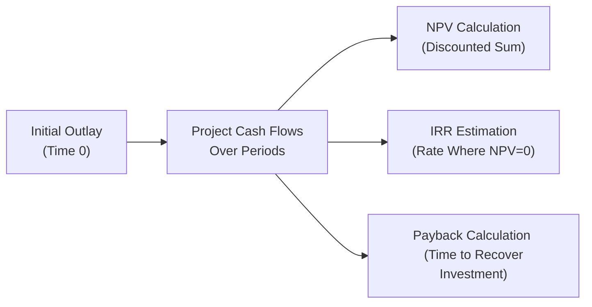

## 8.2 Capital Budgeting Tools (NPV, IRR, Payback)

Capital budgeting represents one of the most critical aspects of corporate finance and business analysis. Whether you are advising clients, evaluating an internal project proposal, or preparing for your CPA Exam, mastering the core tools—Net Present Value (NPV), Internal Rate of Return (IRR), and Payback Period—is essential. These metrics provide a framework for comparing different projects and ensuring company resources are invested wisely to generate positive returns.

Below, we will explore the conceptual foundations, mathematical formulations, step-by-step instructions, and common pitfalls for each of these metrics. By the end, you will be well-equipped to select and apply the most appropriate capital budgeting methods for a variety of business scenarios. We also discuss connections to other chapters in this guide, such as Chapter 7 on Forecasting (which is crucial for generating projected cash flows) and Chapter 9 on Valuation Techniques (which often integrates with or builds upon the capital budgeting approaches).

--------------------------------------------------------------------------------
  
## Overview of Capital Budgeting

Capital budgeting involves the process of planning and managing a firm’s long-term investments. Key decisions typically revolve around:
• Estimating relevant cash flows.  
• Assessing the risk profile of the project.  
• Comparing potential returns against the cost of capital.  

While modern organizations may incorporate strategic and non-financial measures (covered in Chapter 6: Non-Financial and Non-GAAP Measures) and advanced data analytics (Chapter 3: Data and Analytics), foundational skills in NPV, IRR, and Payback Period remain essential for the CPA candidate.

--------------------------------------------------------------------------------

## Understanding the Inputs: Cash Flows and the Cost of Capital

Before discussing specific tools, it is crucial to understand the inputs that drive them:

1. Projected Cash Flows  
   These include initial investments, incremental operating cash flows (data that may come from budgets, as detailed in Chapter 7: Budgeting and Forecasting), changes in working capital, and salvage values if any. Ensuring that you classify and forecast these correctly is one of the biggest challenges in capital budgeting.

2. Cost of Capital (Discount Rate)  
   The discount rate should reflect the organization’s required rate of return, often the Weighted Average Cost of Capital (WACC). Misclassifying the cost of equity, using the wrong debt cost, or overlooking capital structure changes can lead to inaccurate discount rates.  

3. Timing of Cash Flows  
   Projects usually involve an up-front outflow followed by a series of inflows in subsequent periods. Keeping track of the exact timing (year-end, mid-year, or monthly) can significantly affect the outcomes of NPV and IRR calculations.

4. Tax Implications  
   Depreciation, investment credits, and other tax factors can alter effective cash flows. Make sure to incorporate relevant tax considerations if applicable.

These inputs provide the foundation for evaluating long-term projects using NPV, IRR, and Payback Period.

--------------------------------------------------------------------------------

## Net Present Value (NPV)

Net Present Value (NPV) is often considered the most theoretically sound capital budgeting technique because it captures the time value of money, uses the organization’s cost of capital (or hurdle rate), and represents the expected increase (or decrease) in shareholder wealth. NPV is calculated as the sum of the present values of all cash inflows and outflows associated with the project.

### Formula

Using KaTeX for clarity, the NPV of a project with an initial investment \\( C_0 \\) (often a negative value since it is a cash outflow) and subsequent cash inflows \\( C_t \\) at the end of t-th year, discounted at a rate \\( r \\), can be written as:


\text{NPV} = -C_0 + \sum_{t=1}^{n} \frac{C_t}{(1 + r)^t}


Where:
- \\( C_0 \\) = Initial cost of the project (cash outflow).
- \\( C_t \\) = Net cash inflow expected at the end of year t.
- \\( r \\) = Discount rate, often WACC or a project-specific hurdle rate.
- \\( n \\) = Number of periods the project will generate cash flows.

### Step-by-Step Computation

1. **Identify Cash Flows and Timeline**  
   Gather all the project’s relevant cash flows. This typically includes the initial outlay (purchase price of machinery, installation costs, working capital requirements), annual operating cash inflows, and any terminal/salvage value at the end of the project.

2. **Select an Appropriate Discount Rate**  
   Use the firm’s cost of capital, or a rate that reflects the project’s individual risk. Reference Chapter 8.1 (Capital Structure and Cost of Capital) for guidance.  

3. **Discount Each Cash Flow**  
   Discount each future cash flow to the present using \\((1+r)^t\\).  

4. **Sum the Discounted Cash Flows**  
   Add (in the case of inflows) or subtract (in the case of outflows) each present value to arrive at the project’s NPV.  

5. **Interpret the Result**  
   - An NPV > 0 indicates that the project is expected to generate value above the cost of the resources used.  
   - An NPV < 0 suggests the project’s returns are insufficient relative to the cost of capital.  
   - An NPV = 0 implies the project’s returns are exactly at the cost of capital.  

### Practical Example

Suppose a company invests \$500,000 in new equipment that will generate cash inflows of \$150,000 per year for five years. The company’s required rate of return (discount rate) is 8%. We ignore taxes for simplicity.

1. **Initial Outflow**: \\( C_0 = \$500{,}000\\)  
2. **Annual Inflows**: \\( C_1 = C_2 = C_3 = C_4 = C_5 = \$150{,}000\\)  
3. **NPV**:  
   
   \text{NPV} = -500{,}000 + \sum_{t=1}^{5} \frac{150{,}000}{(1 + 0.08)^t}
   

   If you compute the discounted values and sum them, you get an approximate value. Assume the result is \$22,168 (approx.). Since the NPV is positive, this implies the project should be accepted if that is the company’s only basis for decision.

### Common Pitfalls

- **Incorrect Estimate of Discount Rate**: Using a discount rate that does not reflect the firm’s risk leads to misleading NPVs.  
- **Ignoring Changes in Working Capital**: Omitting working capital inflows or outflows can understate or overstate NPV.  
- **Misidentifying the Project Lifespan**: Cutting off cash flows too early or ignoring salvage value can skew the results.  
- **Exam Mistakes**: On the CPA Exam, pay particular attention to precision when discounting each cash flow and be mindful of the difference between pre-tax and after-tax cash flows.

--------------------------------------------------------------------------------

## Internal Rate of Return (IRR)

The Internal Rate of Return (IRR) is defined as the discount rate (r) at which the project’s NPV equals zero. In other words, it is the break-even discount rate (or required rate of return) for the project.

### Formula

Mathematically, the IRR is the rate \\( r \\) that solves the following equation:


-C_0 + \sum_{t=1}^{n} \frac{C_t}{(1 + r)^t} = 0


Solving this equation explicitly can be challenging. Most professionals and CPA examers rely on financial calculators or spreadsheet functions (e.g., IRR in Excel) to approximate the rate. Conceptually, if the IRR is higher than the firm’s cost of capital, the project should be accepted.

### Step-by-Step Computation

1. **List All Cash Flows**  
   Similar to the NPV approach, identify the initial outlay and all subsequent inflows and outflows.

2. **Use a Trial-and-Error or Spreadsheet Method**  
   - **Trial-and-Error Method**: Start with a guess for r, compute the NPV. If it’s positive, increase r; if it’s negative, lower r. Repeat until NPV is close to zero.  
   - **Spreadsheet/Calculator**: Use built-in IRR functions that automate iteration.  

3. **Compare IRR to Required Rate**  
   - If IRR > required rate (cost of capital), the project is acceptable.  
   - If IRR < required rate, reject the project.  

### Practical Example

Revisiting the earlier \$500,000 investment with annual inflows of \$150,000 for five years, you might use an Excel IRR function, “=IRR(…)”, to find that the IRR is approximately 10.7%. Since 10.7% > 8% (the cost of capital), it reaffirms that this project is likely worthwhile.

### Common Pitfalls

- **Multiple IRRs**: Projects with unconventional cash flows (where outflows and inflows alternate multiple times) can generate more than one IRR. In such cases, it may be more reliable to rely on NPV or the Modified Internal Rate of Return (MIRR).  
- **Assumption of Reinvestment at IRR**: IRR assumes intermediate cash flows can be reinvested at the IRR itself, which may not be realistic. NPV uses the cost of capital as the reinvestment rate, which is often more accurate.  
- **Exam Trick**: In exam scenarios, if an IRR question has non-normal cash flows or a highly unusual distribution of inflows and outflows, remain alert to the possibility of multiple IRRs or no IRR.  

--------------------------------------------------------------------------------

## Payback Period

The Payback Period is the length of time required to recover the initial cost of an investment. While it is a simpler metric that does not explicitly consider the time value of money (except when one uses the “discounted payback” variant), it is often used as a quick measure of liquidity risk and project risk.

### Standard Payback Period

1. **Cumulative Cash Flows**  
   Tally the cumulative cash inflows over time, starting from the initial outlay.  
2. **Identify the Break-Even Point**  
   The payback period is when the cumulative sum of inflows equals the initial investment.  

For example, if an initial \$500,000 investment yields \$100,000 each year, the payback period is precisely 5 years (\$500,000 / \$100,000). However, real projects often have irregular cash flows, in which case:


\text{Payback Period} = A + \frac{\text{Unrecovered Balance at A}}{\text{Cash Flow in the Next Period}}

Where \\( A \\) is the last period with a negative cumulative balance.

### Discounted Payback Period

The discounted payback variant addresses the time value of money by discounting each cash flow at the discount rate before computing the cumulative balance. This approach is more accurate but slightly more complex:

1. **Discount the Cash Inflows**  
   
   \text{Discounted Cash Flow at year } t = \frac{C_t}{(1 + r)^t}
   
2. **Compute the Cumulative Sum**  
   Add each discounted inflow to a running total.  
3. **Identify the Point of Recovery**  
   The discounted payback period is the number of years it takes for this cumulative total to become zero or positive.

### Common Pitfalls

- **Ignoring Time Value of Money** (standard payback)  
- **Arbitrary Cutoff**: Choosing an “acceptable” payback threshold may ignore large inflows after the cutoff period.  
- **Misinterpretation**: A short payback period doesn’t necessarily mean the project has an attractive overall return.  

### Example for Discounted Payback

Continuing the same \$500,000 project with five annual inflows of \$150,000, discounted at 8%:  
• Year 1 discounted inflow: \\(\frac{150,000}{1.08} \approx \$138,889\\)  
• Year 2 discounted inflow: \\(\frac{150,000}{1.08^2} \approx \$128,587\\)  
• … and so on.  

Tally these discounted amounts cumulatively until the total equals \$500,000. You will find the discounted payback period is typically longer than the standard payback period.

--------------------------------------------------------------------------------

## Visualizing the Relationship Among NPV, IRR, and Payback

Below is a simple Mermaid diagram illustrating how each metric fits into the timeline of project evaluation:

• NPV focuses on the overall net benefit considering the time value of money.  
• IRR identifies the rate at which your project value breaks even.  
• Payback Period reveals how quickly your investment cost is recouped.

--------------------------------------------------------------------------------

## Integrating Risk Analysis: Scenario and Sensitivity

For the CPA Exam, and especially in practice, it is wise to acknowledge that discount rates and projected cash flows are subject to risk. Chapter 8.4 (Market Influences) and Chapter 8.3 (COSO ERM Overview) both address risk assessment perspectives that can impact project viability. Key approaches include:

• **Scenario Analysis**: Vary assumptions related to economic conditions (inflation, demand, commodity prices) and see how NPV, IRR, and Payback change.  
• **Sensitivity Analysis**: Tweak one variable at a time—like the discount rate, sales volume, or cost of raw materials—to observe the resulting impact on NPV or IRR.

--------------------------------------------------------------------------------

## Exam-Oriented Best Practices and Typical Pitfalls

1. **Use Proper Discount Rate**  
   Many exam questions will prompt you with a specific required rate of return or cost of capital. Watch for details like after-tax cost of debt versus before-tax, or a special risk premium for certain project types.

2. **Account for Non-Level Cash Flows**  
   Pay attention if inflows are not annual or if they vary significantly by period. This commonly appears as an exam twist.

3. **Beware of Terminal Value**  
   Sometimes, a significant portion of a project’s value is realized through the salvage of assets or a final lump-sum payment.

4. **Check for Complex Cash Flow Patterns**  
   Projects with negative outflows reappearing in later years can result in multiple IRRs or ambiguous payback periods.  

5. **NPV vs. IRR Conflict**  
   In cases where discount rates are not constant, or multiple projects have different durations and sizes, NPV is often the more dependable metric. Recognize exam questions that highlight scenario differences, leading to conflicting acceptance decisions when using IRR vs. NPV.

6. **Don’t Overlook Qualitative Factors**  
   While not tested directly in the numeric sense, remember that Chapter 6 highlights non-financial metrics (e.g., environmental impact, brand reputation). The exam may require a short discussion of such intangible factors.

--------------------------------------------------------------------------------

## References for Further Exploration

• Brealey, R. A., Myers, S. C., & Allen, F. (2020). Principles of Corporate Finance.  
• Ross, S. A., Westerfield, R., & Jaffe, J. (2021). Corporate Finance.  
• Chapter 8.1 of this Guide for cost of capital and capital structure insights.  
• Chapter 9.1 of this Guide for other valuation approaches and advanced modeling techniques.

--------------------------------------------------------------------------------

## Capital Budgeting Quiz: NPV, IRR, and Payback Mastery



### Which statement best describes the Net Present Value (NPV) approach? 
- [x] It discounts future cash flows at a chosen rate and sums them to determine project worth. 
- [ ] It calculates the exact breakeven interest rate for a project. 
- [ ] It measures how quickly the upfront investment is recovered without time value considerations.
- [ ] It measures the reinvestment rate required to bring NPV to zero. 

> **Explanation:** NPV explicitly discounts each future cash flow using the hurdle rate—often the WACC—and sums these present values to determine the project’s net value addition.

### What does the Internal Rate of Return (IRR) represent for a project?
- [x] The discount rate that sets the project’s NPV to zero.
- [ ] The time it takes for the project’s net cash inflows to equal the initial outlay.
- [x] The project’s annual growth rate in capital if reinvestment at IRR is assumed.
- [ ] The simple average of annual returns from the project cash flows.

> **Explanation:** IRR is the rate at which the present value of inflows equals the present value of outflows (NPV=0). It also assumes reinvestment of cash flows at that IRR, though that assumption can be unrealistic.

### Which of the following is a major limitation of the standard (non-discounted) payback period?
- [x] It ignores the time value of money.
- [ ] It overemphasizes long-term cash flows.
- [ ] It cannot handle multiple projects simultaneously.
- [ ] It only considers after-tax cash flows.

> **Explanation:** The standard payback period focuses solely on the breakeven time for the initial investment, disregarding that a dollar today is worth more than a dollar tomorrow, thus ignoring the time value of money.

### Which of the following can lead to multiple IRRs in a project analysis?
- [x] Non-conventional cash flows, where sign changes occur multiple times.
- [ ] Constant, level inflows during each period.
- [ ] A project with a single initial outlay followed by inflows only.
- [ ] The presence of salvage value at the end of the project.

> **Explanation:** Non-conventional cash flows (where outflows appear after a period of inflows) can cause the NPV function to intersect the x-axis more than once, leading to multiple IRRs.

### Regarding IRR and NPV, which statement is most accurate?
- [x] NPV is generally preferred for mutually exclusive projects, especially when the cost of capital is not constant.
- [ ] IRR always provides the same acceptance decision as NPV regardless of conditions.
- [x] NPV is unaffected by the selection of a discount rate, while IRR depends on it.
- [ ] IRR is more robust than NPV in all scenarios.

> **Explanation:** When choosing between mutually exclusive projects, NPV can be more reliable, particularly if the cost of capital deviates from assumptions used in IRR calculation or if projects differ in scale and timing.

### Which one of the following is a pitfall of using IRR for decision-making?
- [x] It assumes reinvestment of cash flows at the IRR, which may be unrealistic.
- [ ] It fully ignores the time value of money.
- [ ] It only calculates the breakeven period in terms of time.
- [ ] It does not require trial-and-error computations.

> **Explanation:** IRR’s built-in assumption is that each interim cash flow is reinvested at the IRR, which may not be a realistic reinvestment rate in actual market conditions.

### What differentiates the discounted payback period from the standard payback period?
- [x] The discounted payback incorporates the time value of money by discounting cash flows. 
- [ ] The discounted payback excludes salvage values from the calculation.
- [x] The discounted payback period is always shorter than the standard payback. 
- [ ] The discounted payback only applies to non-conventional cash flow projects.

> **Explanation:** The discounted payback method discounts each cash flow before computing the recovery time. This generally extends the payback period, not shortens it, compared to the standard method.

### A project with a positive NPV but an IRR lower than the firm’s required rate indicates:
- [x] A miscalculation or that the project’s assumptions are inconsistent. 
- [ ] The project is definitely acceptable because NPV > 0.
- [ ] The firm’s discount rate is set incorrectly.
- [ ] The project has an infinite IRR. 

> **Explanation:** If a project truly has a positive NPV at the enterprise’s cost of capital, the IRR should exceed (or at least match) that discount rate. An IRR below the discount rate despite a positive NPV signals an analytical or computational anomaly.

### Which best reflects a correct understanding of the time value of money in capital budgeting?
- [x] One dollar received today is worth more than one dollar received in the future.
- [ ] One dollar received in the future is not measurable today.
- [ ] The time value of money only applies to intangible benefits.
- [ ] Cash flows must only be discounted if the project risk is zero.

> **Explanation:** The time value of money concept states that a dollar received today can be reinvested to yield more in the future, which is why discounting future cash flows is vital in capital budgeting.

### In the context of capital budgeting, which statement is true?
- [x] True
- [ ] False

> **Explanation:** Payback Period alone cannot capture the total profitability of a project; it only gauges how quickly the investment is recovered.



--------------------------------------------------------------------------------

## For Additional Practice and Deeper Preparation

### [Business Analysis and Reporting (BAR) CPA Mock Exams](https://www.udemy.com/course/bar-cpa-mock-exams/?referralCode=ADBE2E84BEE9CB6243CA)

**Business Analysis and Reporting (BAR) CPA Mocks:** 6 Full (1,500 Qs), Harder Than Real! In-Depth & Clear. Crush With Confidence!

- Tackle full-length mock exams designed to mirror real BAR questions.  
- Refine your exam-day strategies with detailed, step-by-step solutions for every scenario.  
- Explore in-depth rationales that reinforce higher-level concepts, giving you an edge on test day.  
- Boost confidence and minimize anxiety by mastering every corner of the BAR blueprint.  
- Perfect for those seeking exceptionally hard mocks and real-world readiness.

_Disclaimer: This course is not endorsed by or affiliated with the AICPA, NASBA, or any official CPA Examination authority. All content is for educational and preparatory purposes only._
