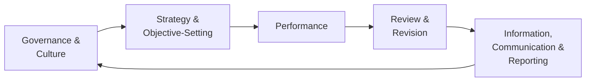
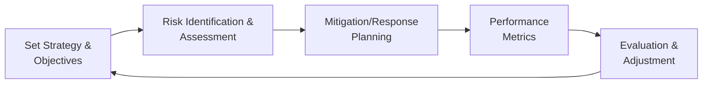

## 8.3 COSO ERM Overview for Business Analysis

Enterprise Risk Management (ERM) is a structured approach used by organizations to identify, assess, manage, and monitor risks that could impact their strategic and operational objectives. By integrating ERM practices into the broader business analysis framework, organizations can equip themselves with the ability to predict and respond to internal and external uncertainties. One of the most widely recognized and adopted ERM frameworks is the COSO ERM framework (Committee of Sponsoring Organizations of the Treadway Commission). This section provides an in-depth overview of COSO ERM, especially how it integrates with strategic planning and performance measurement.

In today’s dynamic business environment, effective risk assessment is no longer a siloed finance or compliance exercise. It is deeply intertwined with corporate goals, capital allocation decisions, resource planning, and performance metrics. This chapter will explore the central concepts of COSO ERM, its key components, and its usefulness in shaping strategic initiatives and ongoing performance evaluation.

-------------------------------------------------------------------------------

### Understanding the COSO ERM Framework

The COSO ERM framework has evolved over time to offer a holistic approach to organizational risk management. Its design focuses on embedding risk thinking in every organizational layer—from board-level governance to day-to-day operational actions. The latest iteration, titled “Enterprise Risk Management—Integrating with Strategy and Performance,” emphasizes the importance of aligning risk considerations with how organizations create, preserve, and realize value.

#### Core Principles of COSO ERM

1. Governance & Culture  
   • Ensures organizations set the right tone at the top.  
   • Establishes ethical behavior, fostering a culture that nurtures risk awareness and responsibility.

2. Strategy & Objective-Setting  
   • Helps embed risk management within the strategic-planning process.  
   • Considers the organization’s risk appetite and tolerance while setting business objectives.

3. Performance  
   • Facilitates the identification and assessment of risks that could hamper strategy execution.  
   • Encourages decision-making that weighs both opportunity and risk.

4. Review & Revision  
   • Involves a continuous monitoring process.  
   • Assesses the effectiveness of risk responses and modifies them as needed.

5. Information, Communication & Reporting  
   • Ensures reliable data reaches the right people.  
   • Promotes transparency and internal reporting around risk issues.

Below is a simplified mermaid diagram that illustrates the broad flow of COSO ERM components:

As shown, the COSO ERM framework forms a continuous cycle. It encourages robust feedback loops so that as organizations refine or shift strategies or experience new risks, they can respond with agility.

-------------------------------------------------------------------------------

### Strategic Planning and Its Link to ERM

A key aspect of effective ERM is adherence to an organization’s strategy and objectives. Strategy, in this context, is not simply about setting lofty ambitions, but rather understanding the potential risks and rewards of chosen directions. When management defines strategic objectives, it usually has a broad vision for the organization’s future. However, these objectives can only be met if leaders integrate risk considerations at each step. This is where the COSO ERM framework functions as a critical overlay.

#### Incorporating Risk Appetite and Risk Tolerance

• Risk Appetite: In strategic planning, it is essential that a company formally articulates the types and amount of risk it is willing to take on in pursuit of its objectives. Risk appetite is typically influenced by industry norms, regulatory requirements, shareholder expectations, and the company’s own past experiences.  
• Risk Tolerance: Risk tolerance translates the high-level risk appetite into specific measures or thresholds. For instance, a company may have a “medium” risk appetite for investing in new technologies but may fix a tolerance limit of no more than 10% of its total capital allocation to uncertain ventures.

#### Strategy Alignment through Multiple Perspectives

Organizations will sometimes articulate their strategies through multiple lenses: growth, diversification, innovation, and operational excellence. Each lens provides opportunities but also introduces risks. Under the COSO ERM framework, management can systematically identify whether each strategic objective is in line with the enterprise’s risk posture. For instance, a manufacturing conglomerate might see growth potential in emerging markets but must also weigh the challenges posed by currency fluctuations, trade barriers, political risk, or inadequate infrastructure.

#### Tools for Risk-Aligned Strategic Planning

• SWOT Analysis (Strengths, Weaknesses, Opportunities, Threats) with a COSO Focus: Incorporate risk identification into each dimension of SWOT to ensure that weaknesses and threats are adequately measured.  
• Scenario Planning: Evaluate multiple potential future states (optimistic, moderate, pessimistic) to confirm that chosen strategies can stand up to various external conditions, such as macroeconomic shifts or global supply chain disruptions.  
• Risk Heat Maps: Visualize which elements of strategy might be most at risk and use color-coded or numeric scales to assess the magnitude and likelihood of impacts. Cross-reference Chapter 7, “Budgeting and Forecasting,” for additional analytical tools like sensitivity analysis.

-------------------------------------------------------------------------------

### Performance Measurement through an ERM Lens

Once strategic objectives have been established, organizations look to gauge progress through performance metrics. The COSO ERM framework underscores the importance of calibrating performance measurement with risk considerations to ensure that managers are not incentivized purely on short-term gains that amplify risk exposures.

#### Linking KPIs to Risk Management

By integrating risk and performance measurement, organizations can design Key Performance Indicators (KPIs) that reflect not only sales growth or market share but also resilience and sustainability. For example, an energy company might focus on health, safety, and environmental metrics in addition to profit or EBITDA measures to ensure that its pursuit of revenue does not create undue environmental or safety risks. See Chapter 6, “Non-Financial and Non-GAAP Measures,” for deeper exploration of these metrics.

#### Balancing Financial and Non-Financial Measures

Balanced scorecards often include both financial and operational metrics (such as employee engagement, customer satisfaction, and environmental stewardship). Under ERM, these metrics gain even greater importance because they signal areas of risk that might not surface in purely financial statements. If non-financial metrics drop precipitously, it may be an early warning of burgeoning risk exposures hidden within operations.

#### Performance Evaluation and Risk Responses

Risk responses (avoidance, reduction, sharing, acceptance) chosen during the ERM process need to be tracked. By establishing metrics that identify whether chosen responses are achieving their intended effect, management can refine its approaches to risk mitigation. Performance measurement thus becomes both a diagnostic and a feedback mechanism as part of the ERM’s “Review & Revision” process.

-------------------------------------------------------------------------------

### COSO ERM Components in Action: A Practical Example

Consider a mid-sized technology firm launching a new cloud-based application for small businesses. Below is a hypothetical scenario illustrating how each COSO ERM component ties into business analysis:

1. Governance & Culture  
   • The board and C-suite define an ethical policy that ties employee incentives to customer data protection.  
   • Training programs are introduced to foster a risk-conscious culture, emphasizing privacy and cybersecurity.

2. Strategy & Objective-Setting  
   • Executive leadership sets a strategic objective to capture 10% of the small-business market within 12 months.  
   • They confirm that the risk appetite allows moderate investment in R&D for emerging solutions and moderate brand exposure in new markets.  
   • Risk tolerances are drafted, specifying acceptable cost overruns and potential regulatory compliance exposures.

3. Performance  
   • Management identifies key risks: data breaches, inability to scale the cloud infrastructure, competitive pressure from established players, regulatory scrutiny in new jurisdictions.  
   • They perform a risk assessment using scenario analysis (e.g., drop in demand, data breach incident).  
   • Mitigation plans for each risk are established, including cybersecurity insurance, vendor due diligence, and platform stress testing.

4. Review & Revision  
   • The risk mitigation plans, along with capital expenditures, are reviewed monthly.  
   • The firm revises its marketing campaign upon learning of new competitive entrants, adjusting risk responses around product pricing and brand positioning.

5. Information, Communication & Reporting  
   • The executive committee receives periodic dashboards that display the performance of the new product, highlighting metrics like user growth and any emerging compliance concerns.  
   • The board is updated quarterly on how risk management activities are aligning with the strategic objectives.

In this scenario, ERM is not a separate discipline but closely intertwined with the firm’s day-to-day and strategic decision-making processes.

-------------------------------------------------------------------------------

### Diagram: COSO ERM Integration with Strategic Performance

Below is a high-level diagram capturing how COSO ERM interfaces with strategic planning and performance measurement:

This loop depicts the continuous interaction of strategic objectives, risk assessment, and performance measurement—all core tenets of COSO ERM.

-------------------------------------------------------------------------------

### Implementation Considerations and Challenges

#### Cross-Functional Collaboration

ERM often spans multiple functional areas, from finance and operations to IT and marketing. Ensuring that each function communicates effectively requires a transparent governance structure and regular cross-functional meetings. Cross-collaboration ensures risk insights are comprehensive and not isolated within a single department.

#### Data Quality and Analysis

To succeed in implementing COSO ERM, high-quality data is crucial. Poor data leads to inaccurate risk quantification and incomplete performance evaluations. Companies should invest in data governance, advanced analytics, and tools that integrate diverse data sets. Refer to Chapter 3, “Data and Analytics,” for a deep dive into how data integrity can be preserved and leveraged for informed risk assessments.

#### Aligning Roles and Responsibilities

Clear guidelines for roles and responsibilities are vital for a successful ERM program. Senior management should champion ERM priorities, individual departments should own their respective risks, and internal audit or an equivalent oversight function should evaluate ERM’s effectiveness. If roles are poorly defined, accountability lapses can occur, undercutting the organization’s risk-aware culture.

#### Continuous Evolution

COSO ERM is not a static framework. Markets, regulations, and technologies evolve over time, forcing organizations to adapt their risk management approaches continuously. For instance, the rise in artificial intelligence or big data analytics may introduce new ethical and regulatory risks that organizations must evaluate. This demands a living ERM approach that regularly updates risk registers, appetite statements, and performance measures to stay aligned with changing contexts.

-------------------------------------------------------------------------------

### Best Practices for Effective ERM Integration

• Cultivate a Culture of Open Communication: Employees at all levels should feel comfortable escalating potential issues or emerging risks without fear of reprisal.  
• Align Risk Appetite with Corporate Strategy: Periodically revisit and refine your organization’s risk appetite to ensure it remains in sync with your overall objectives and current market conditions.  
• Leverage Scenario and Sensitivity Analysis: Use scenario planning and sensitivity tests to stress-test strategic assumptions and uncover vulnerabilities.  
• Link Performance Incentives to Risk Management: Rewarding managers solely on short-term financial gains can encourage risk-taking behaviors. Incorporate risk-based metrics into compensation and promotion decisions.  
• Educate and Train Stakeholders: Regular workshops and training sessions help employees understand their role in risk management and how their decisions affect enterprise-wide objectives.

-------------------------------------------------------------------------------

### Common Pitfalls to Avoid

• Overemphasis on Compliance: Focusing exclusively on regulation or checklist-based compliance may miss strategic and operational risks.  
• Poor Integration with Strategy: Failing to embed ERM into strategic planning can leave the organization with a fragmented view of risk.  
• Lack of Data Governance: Inaccurate or incomplete data can undermine even the most sophisticated ERM frameworks.  
• Underestimating Operational Risks: Organizations often center on financial risks while ignoring potential disruptions in supply chain, technology infrastructure, or human capital.  
• Insufficient Oversight: Weak governance structures can result in inadequate risk monitoring or incomplete follow-through on necessary corrective actions.

-------------------------------------------------------------------------------

### References and Further Reading

• COSO (2017). “Enterprise Risk Management—Integrating with Strategy and Performance.”  
• IMA (Institute of Management Accountants) journals on emerging issues in risk management.  
• Chapter 3, “Data and Analytics,” in this guide for data governance and analytical best practices.  
• Chapter 7, “Budgeting and Forecasting,” and Chapter 8, “Risk Assessment and Prospective Analysis,” for scenario and sensitivity analyses.  
• Chapter 6, “Non-Financial and Non-GAAP Measures,” for balancing financial and operational metrics.  

For additional resources on the latest pronouncements and their implications on enterprise risk, you can also consult the AICPA’s website or the SEC’s guidance on risk disclosures for public companies.

-------------------------------------------------------------------------------

## COSO ERM Quiz: Strengthen Your Risk Management Insights



### Which of the following best describes how COSO ERM integrates with an organization’s strategy?

- [ ] It only focuses on regulatory compliance.  
- [x] It aligns risk appetite and strategic objectives to create value.  
- [ ] It prioritizes operational aspects over strategic concerns.  
- [ ] It replaces the need for financial analysis altogether.  

> **Explanation:** COSO ERM emphasizes aligning risk appetite with strategic goals, ensuring that risk management supports and enhances organizational value creation.

### In the COSO ERM components, what is the primary focus of "Governance & Culture"?

- [x] Setting the tone at the top and establishing ethical values.  
- [ ] Executing day-to-day operations.  
- [ ] Generating revenues through new marketing channels.  
- [ ] Calculating Earnings Per Share (EPS) for investors.  

> **Explanation:** Governance & Culture is about leadership setting the example and driving ethical behavior and risk awareness across the organization.

### Which statement is true about the role of risk appetite in strategic planning?

- [x] It represents the level and types of risk an organization is willing to accept to achieve objectives.  
- [ ] It is a fixed, unchanging threshold determined by external regulators.  
- [ ] It only matters for financial institutions with strict compliance demands.  
- [ ] It varies daily based on an individual manager’s personal preferences.  

> **Explanation:** Risk appetite is a formal articulation of the overall level of risk an organization is prepared to undertake in pursuit of objectives. It is typically set by leadership and adjusted when key strategic directions shift.

### Performance measurement in ERM should:

- [ ] Ignore non-financial metrics.  
- [ ] Base all corporate bonuses solely on revenue growth.  
- [x] Integrate both financial and non-financial measures to account for a wider array of risks.  
- [ ] Remain independent from strategy formulation.  

> **Explanation:** Integrating financial and non-financial measures helps ensure that risk exposures are monitored holistically and aligned with the organization’s strategic goals.

### Which of the following describes a balanced approach to ERM reporting?

- [ ] Relying solely on external audits to assure risk management.  
- [x] Providing regular dashboards and reports to the right people with relevant risk data.  
- [ ] Keeping risk assessments confidential to senior leadership only.  
- [ ] Eliminating discussions about risk tolerances to avoid negative perceptions.  

> **Explanation:** Timely reporting ensures decision-makers have the requisite information to effectively manage and respond to risks. Transparency with relevant stakeholders is essential.

### In the COSO ERM model, which component emphasizes tracking the effectiveness of risk responses over time?

- [ ] Strategy & Objective-Setting  
- [ ] Governance & Culture  
- [x] Review & Revision  
- [ ] Performance  

> **Explanation:** The Review & Revision component focuses on the ongoing evaluation of risk responses, identifying areas where modifications are needed.

### How does scenario planning contribute to an effective ERM framework?

- [x] It tests strategic decisions against various possible future states.  
- [ ] It replaces the need for budgeting and forecasting.  
- [x] It helps reveal vulnerabilities in strategy based on different assumptions.  
- [ ] It is only relevant for financial analysts.  

> **Explanation:** Scenario planning allows organizations to stress-test strategies against different possible outcomes, exposing hidden risks and validating the sustainability of chosen paths.

### One common pitfall when integrating ERM with strategy is:

- [x] Failing to embed risk considerations into the strategic decision process.  
- [ ] Using both qualitative and quantitative risk measures.  
- [ ] Providing risk information to the board.  
- [ ] Setting risk tolerances for new ventures.  

> **Explanation:** If ERM remains siloed as a compliance function, key strategic decisions may overlook critical risk perspectives, leading to misaligned objectives and potential failures.

### Why is a cross-functional approach important in COSO ERM?

- [x] It ensures that risk identification and assessment incorporate multiple perspectives within the organization.  
- [ ] It relies on one department to handle all aspects of risk.  
- [ ] It reduces the need for corporate-wide policies.  
- [ ] It is mandated solely by legislative requirements.  

> **Explanation:** A cross-functional approach provides a more holistic view of risks, eliminating blind spots that might arise if only one area manages the process.

### ERM should be viewed as a:

- [x] Continuous, iterative process that aligns risks with strategic objectives.  
- [ ] One-time annual checklist activity conducted by the board.  
- [ ] Speculative tool used to justify unmeasured risk-taking.  
- [ ] Narrow compliance and auditing exercise.  

> **Explanation:** COSO ERM is a dynamic cycle that continuously adapts as strategies and external environments evolve. It goes beyond compliance to support long-term value creation.



-------------------------------------------------------------------------------

## For Additional Practice and Deeper Preparation

### [Business Analysis and Reporting (BAR) CPA Mock Exams](https://www.udemy.com/course/bar-cpa-mock-exams/?referralCode=ADBE2E84BEE9CB6243CA)  

**Business Analysis and Reporting (BAR) CPA Mocks:** 6 Full (1,500 Qs), Harder Than Real! In-Depth & Clear. Crush With Confidence!

- Tackle full-length mock exams designed to mirror real BAR questions.  
- Refine your exam-day strategies with detailed, step-by-step solutions for every scenario.  
- Explore in-depth rationales that reinforce higher-level concepts, giving you an edge on test day.  
- Boost confidence and minimize anxiety by mastering every corner of the BAR blueprint.  
- Perfect for those seeking exceptionally hard mocks and real-world readiness.

_Disclaimer: This course is not endorsed by or affiliated with the AICPA, NASBA, or any official CPA Examination authority. All content is for educational and preparatory purposes only._
