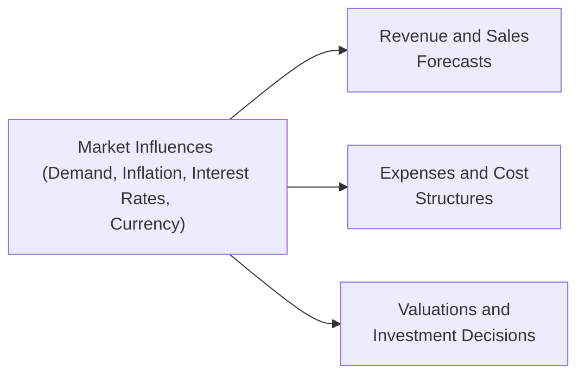

## 8.4 Market Influences (Demand, Inflation, Interest Rates, Currency)

Modern organizations operate within a dynamic environment where multiple market factors can significantly affect their performance and valuation. For the CPA candidate approaching the Business Analysis and Reporting (BAR) section, grasping how these factors influence day-to-day operations and long-term strategy is essential. Upholding an awareness of external conditions—patterns in demand, trends in inflation, shifts in interest rates, and fluctuations in currency markets—is crucial for accurate forecasting, valuation, and effective risk management.

This section explores how each of these four external forces can shift revenues, expenses, and valuations. Complementing the discussions on capital structure (Chapter 8.1), capital budgeting (Chapter 8.2), and prospective analysis (Chapter 8.3), we will delve deeply into how sudden or gradual changes in macroeconomic conditions can alter financial outcomes. By understanding correlations and interactions among these factors, you will be better equipped to provide meaningful insights and recommendations for clients or employers.

---------------------------------------
### Understanding the Importance of Market Influences
Market influences do not operate in isolation; they often intersect and compound in complex ways. For instance, a company facing falling consumer demand might also grapple with increased raw material costs due to inflation, compounded by rising interest rates that elevate the cost of financing. Small changes in currency exchange rates can further amplify or mitigate these effects. In alignment with the prospective analysis approach discussed in Chapter 8, risk assessment must incorporate a holistic view of these external variables. 

Below is a high-level visualization of how market influences can cascade through an organization:

In the next sections, we will examine each of the core market influences—demand, inflation, interest rates, and currency—in detail, highlighting real-world examples and best practices for integrating these insights into business decision-making.  

---------------------------------------
### Demand
Demand represents the willingness and ability of consumers (or businesses) to purchase products or services at various price points. As discussed in Chapter 7’s coverage on forecasting and budgeting, accurate demand forecasts drive production planning, labor allocation, and strategic investment decisions. Underestimating demand may result in stock-outs or lost sales, while overestimating it leads to excess inventory and resource underutilization.

#### Factors Affecting Demand
• Economic Growth: National or regional economic growth can elevate consumer confidence, fueling purchasing power and sales volumes. Conversely, recessions can diminish business and consumer spending.  
• Demographics and Consumer Preferences: Population shifts, generational buying habits, and cultural trends can propel or inhibit demand for certain products or services.  
• Competitive Landscape: New entrants, technological disruptions, or product substitutes can diminish existing demand. Conversely, a rise in complementary products may boost your sales.  
• Seasonal Cycles: Many industries, from retail to agriculture, experience seasonal demand fluctuations. Understanding these cyclical patterns is crucial for accurate budgeting.  

#### Impact of Changing Demand on Revenues and Costs
• Revenues: Demand directly influences sales volumes and pricing power. During high-demand periods, firms may increase prices or reduce discounts, elevating profit margins. During low-demand periods, competitive pressures often lead to price cuts or promotional activities to stimulate sales, eroding margins.  
• Expenses: Shifts in demand can alter raw material needs, requiring flexible supply chain management to avoid overstocking or stock-outs. Additionally, capacity-related costs (like factory overhead or labor) can change dramatically if demand is under- or over-estimated.  

##### Practical Example – Technology Product Launch
Consider a software company launching a new subscription-based app. If market research projects high demand, the company may ramp up server capacity and customer support staff. Should launch-period demand be weaker than expected, the company faces surplus infrastructure and labor expenses that undermine profitability. Conversely, if demand exceeds expectations and the firm fails to scale effectively, it risks frustrated customers due to server downtime—or leaves revenue on the table if it cannot meet the user interest quickly enough.

---------------------------------------
### Inflation
Inflation is the general rise in prices over time, leading to a decrease in purchasing power. It typically affects both raw material costs and operating expenses. Inflation rates vary by country and industry. For instance, healthcare and education might experience different inflation trends than consumer electronics.  

#### Types of Inflation
• Demand-Pull Inflation: Develops when demand outstrips supply. Companies often find themselves able to pass along higher costs to consumers without a significant drop in sales volumes.  
• Cost-Push Inflation: Occurs when rising production costs (e.g., energy, labor) drive up prices. Firms with robust pricing power may still pass these costs on to consumers; others may struggle to maintain margins.  

#### Influence on Financial Statements
• Revenues: During moderate demand-pull inflation, revenues can rise, sometimes inflating sales figures without necessarily impacting real growth. It becomes important to distinguish nominal growth from real growth.  
• Expenses: Inflation escalates input costs—direct materials, energy, wages. If revenues do not rise proportionately, gross margin and net income shrink. Budgeting under inflationary conditions (refer to Chapter 7) demands continuous recalibration of cost assumptions.  
• Valuations: Inflation influences the projected cash flows used in valuation models, as outlined in Chapter 9.1 on discounted cash flow (DCF). Higher inflation may lead to higher discount rates, reducing net present values (NPVs).  

##### Practical Example – Restaurants and Food Cost Inflation
A family-owned restaurant might face a sudden spike in the cost of fresh produce due to global supply disruptions. Although the restaurant can pass some of these costs to customers through menu price increases, it must balance profitability with customer loyalty. In an environment of strong competition, excessively high prices could drive patrons elsewhere, reducing overall revenue.  

---------------------------------------
### Interest Rates
Interest rates are pivotal in determining borrowing costs, investment returns, and discount rates for future cash flow. A thorough knowledge of interest rate dynamics is essential for capital budgeting decisions (Chapter 8.2), as even modest upward ticks in interest rates can significantly transform project feasibility.

#### Key Considerations
• Monetary Policy: Central banks (e.g., Federal Reserve in the U.S.) adjust benchmark interest rates to manage inflation and stimulate or slow economic growth.  
• Corporate Borrowing Costs: The cost of debt financing, whether for short-term working capital lines or long-term bonds, escalates when rates climb. Firms with high leverage face amplified interest expenses, reducing earnings.  
• Impact on Investments: As interest rates rise, alternative investments (e.g., bonds) become more attractive relative to riskier equities. Equities can face downward pressure if investors migrate to fixed income markets seeking more stable returns.  

#### Effect on Business Decisions
• Capital Structure Choices: Companies typically balance debt with equity to minimize their weighted average cost of capital (WACC). Rising interest rates push up the cost of debt, potentially triggering a shift toward equity financing or retentions of internal cash flows.  
• Project Feasibility: A higher discount rate can cause promising long-term projects to appear less attractive, dampening private-sector investment.  
• Liquidity Management: Businesses in variable-rate debt arrangements (e.g., certain lines of credit) should rigorously track real-time interest costs to avoid unexpected expenses that disrupt budgets.  

##### Practical Example – Real Estate Development
A real estate development firm might plan a new mixed-use building. If interest rates climb dramatically during the construction phase, the firm faces elevated mortgage or financing costs. Rent projections must also be reevaluated because prospective tenants might be sensitive to higher occupancy costs resulting from property owners passing along interest expense. This interconnected spiral underscores how interest rates can reshape both the developer’s financing strategy and the project’s long-term viability.

---------------------------------------
### Currency
Currency fluctuations can significantly affect the financial statements of companies that import or export goods, operate subsidiaries abroad, or transact in foreign currencies. Topic 14.3 in this guide provides a detailed look at foreign currency translation and remeasurement, but in this section, we focus on the broader economic and risk assessment perspective.

#### Primary Currency Risks
• Transaction Risk: The risk that currency exchange rate movements will affect the cost or revenue of specific transactions.  
• Translation Risk: The risk arising from consolidating financial statements of subsidiaries that operate in different currencies. Exchange rate fluctuations may produce gains or losses in consolidated income.  
• Economic Risk: Long-term changes in currency values can reduce a company’s competitive edge in foreign markets. Even if a short-term hedge is in place, persistent shifts in exchange rates can necessitate relocating production or pivoting the supply chain.  

#### Effect on Revenues, Expenses, and Valuations
• Revenues: Exporters benefit from a weaker home currency, as their products become relatively cheaper in foreign markets. Conversely, a stronger home currency can dampen export competitiveness.  
• Expenses: Firms that import raw materials or products face higher costs when their home currency weakens. Hedging strategies, such as forward contracts and currency swaps (see Chapter 15 on Derivatives), can mitigate the impact, but unhedged positions remain vulnerable to rapid exchange rate shifts.  
• Valuations: When performing DCF analyses for multinational operations, CPAs must incorporate currency forecasts into discount rates, cash flow translation methods, and growth assumptions. A significant currency swing can greatly influence the overall valuation proposition.  

##### Practical Example – Automobile Manufacturer
Imagine a global automobile manufacturer headquartered in a country whose currency has recently strengthened against major foreign markets. Vehicles become more expensive overseas, pressuring sales volumes and margins. Although the manufacturer may partially offset losses by procuring certain components in cheaper foreign currencies (due to the home currency’s strength), the net impact on profitability and competitiveness can still be significant.  

---------------------------------------
### Integrating Multiple Market Influences into Analysis
Businesses rarely grapple with one macroeconomic issue in isolation. Instead, a combination of demand fluctuations, inflationary pressures, interest rate changes, and currency risks converge, often amplifying or offsetting one another. An integrated approach to financial analysis and risk assessment, as introduced in Chapter 8, requires the CPA to:

• Perform sensitivity analysis under multiple scenarios.  
• Incorporate leading indicators (e.g., consumer confidence indices, producer price indices, interest rate forecasts).  
• Collaborate with cross-functional teams, such as operations and treasury, to align hedging and capital structure strategies.  
• Use robust forecasting and analytic tools (see Chapter 3 on Data and Analytics) to model dynamic interactions among variables.

#### Example – Manufacturing Company Facing Compound Pressures
A U.S.-based electronics manufacturer exports globally. It:
1. Experiences strong demand in emerging markets (boosting revenue).  
2. Battles rising inflation in key supplier markets (increasing component costs).  
3. Encounters higher domestic interest rates that raise the cost of financing expansions.  
4. Sees currency volatility in Europe, where a key trading partner’s currency weakens unexpectedly.  

All four elements intertwine. Although strong demand in emerging markets could drive top-line growth, the net outcome is tempered by inflated production costs, higher financing costs, and currency swings. Effective budgeting and forecasting require scenario planning to see how each factor might play out.  

---------------------------------------
### Best Practices and Common Pitfalls
#### Best Practices
• Stay Informed: Keep abreast of macroeconomic developments through economic forecasts, central bank reports, and international trade news.  
• Scenario Planning: Use robust “what-if” analysis to prepare for shifts in any or all these external factors. This is essential for capital investment decisions, as taught in Chapter 9.  
• Leverage Technology: Advanced data analytics tools (Chapter 3) can refine forecasting by incorporating real-time and historical data to model the impact of changing economic indicators.  
• Hedge Strategically: Where possible, hedge currency and interest rate risks. Take advantage of forward contracts, swaps, or options to mitigate the volatility of certain exposures.  

#### Common Pitfalls
• Overreliance on Single Forecast: Relying on a single “most likely” scenario can create blind spots for less probable but highly impactful outcomes.  
• Neglecting Lag Effects: Inflation, interest rates, and currency shifts often manifest over time. A short-term focus can overlook delayed repercussions on revenue and cost structures.  
• Underestimating the Correlation Between Factors: For instance, a spike in inflation may prompt central banks to raise interest rates. This chain reaction requires integrated risk analysis.  
• Misapplication of Hedging Instruments: Hedging product structures must be carefully designed to align with underlying exposures; otherwise, a company can inadvertently introduce further risk.  

---------------------------------------
### Practical Illustrations and Case Studies
Below are two short case studies demonstrating how market influences impact financial outcomes.

#### Case Study 1: Software-as-a-Service Company
A U.S.-based SaaS provider expands to Europe, pricing services in euros. Initially, strong demand from European clients brightens revenue prospects. However, a sharp appreciation of the U.S. dollar versus the euro drastically cuts the dollar value of inbound revenue. Simultaneously, the company faces rising inflation in its home market, pressuring payroll budgets. Alongside these developments, the Federal Reserve raises interest rates, making short-term financing costlier. Altogether, the SaaS firm must lower overhead expenses, explore currency hedges, and reassess its capital structure to maintain profitability.

#### Case Study 2: Agricultural Exporter
Consider a grain-exporting firm in Argentina dealing with high inflation. Although the firm benefits from a weaker home currency that makes exports more attractive to foreign buyers, the domestic inflation environment raises costs (e.g., labor, utilities, raw inputs for farming). If global grain demand softens, the firm’s revenue advantage from a devalued currency may dissipate quickly. Concurrently, rising global interest rates affect the firm’s borrowing for expanding farmland operations. This multifaceted situation demands that management engage in robust budgeting, scenario testing, and flexible contract negotiations.

---------------------------------------
### References for Further Exploration
• Federal Reserve Economic Data (FRED), https://fred.stlouisfed.org/  
• Bank for International Settlements (BIS), https://www.bis.org/  
• International Monetary Fund (IMF) Reports, https://www.imf.org/  
• Chapter 8.1, 8.2, 8.3 for deeper exploration of capital structure and capital budgeting  
• Chapter 14.3 for foreign currency translation and remeasurement  
• Chapter 15 for advanced hedging and derivatives  
• Chapter 3 for data analytics approaches to forecasting and scenario modeling  

---------------------------------------
### Conclusion
Demand, inflation, interest rates, and currency conditions are pivotal external factors shaping nearly every facet of a company’s financial performance. By comprehensively interpreting market indicators and incorporating these elements into prospective analyses, the CPA candidate—and future practitioner—can provide strategic guidance that helps organizations remain resilient and agile. Whether conducting valuation studies, preparing budgets, or recommending risk management strategies, a nuanced grasp of these macro-level forces will fortify your professional judgment and enhance the quality of your advisory services.

Mastering the interplay between these market influences provides a robust foundation for success in the CPA Exam’s BAR section, ensuring that you are well-prepared to advise stakeholders, develop strategic insights, and navigate complex economic landscapes.

---------------------------------------

## Test Your Knowledge: Market Influences and Business Forecasting



### External market forces can directly impact a company’s revenue. Which of the following is considered a primary driver of demand?
- [ ] The company’s internal audit protocol
- [x] Consumer preferences and trends
- [ ] Management’s choice of depreciation method
- [ ] Regular data backups and IT maintenance

> **Explanation:** Demand fluctuations are often driven by external consumer preferences, economic growth, and cultural trends. Internal audit protocols, depreciation methods, and IT maintenance do not directly drive market demand.

### What typically occurs when inflation rises faster than a company’s ability to adjust product prices?
- [ ] Revenues increase exponentially
- [ ] The company’s net income remains unaffected
- [x] Profit margins shrink
- [ ] The company’s interest expense decreases

> **Explanation:** If inflation pushes up costs of goods and services and the company cannot raise its selling prices quickly, profit margins will shrink. Revenues may rise nominally, but real profitability becomes stressed.

### A higher interest rate environment often leads to:
- [x] Increased borrowing costs for businesses
- [ ] Lower bond yields across the board
- [x] Changes in capital project feasibility
- [ ] Guaranteed higher profits

> **Explanation:** Rising interest rates increase the cost of borrowing. This can cause firms to re-evaluate ongoing and proposed capital projects, which may no longer meet required rates of return. Profits are not automatically guaranteed to be higher in a high-interest-rate environment; in fact, higher interest expenses usually reduce net income.

### Which of the following best describes economic (operating) exposure to currency risk?
- [x] Exposure arising from the impact of currency fluctuations on long-term competitive positioning
- [ ] Risk solely from converting foreign subsidiary financial statements into the parent company’s currency
- [ ] Forecast inaccuracies within a static budget
- [ ] A guarantee that a forward contract will eliminate all currency risk

> **Explanation:** Economic exposure relates to the long-term effect of currency shifts on a company’s competitiveness, costs, and market share. It extends beyond just accounting translations or single transactions.

### Under a demand-pull inflation scenario:
- [x] Aggregate demand outpaces supply
- [ ] Taxes always decrease
- [x] Prices tend to rise
- [ ] Central banks have no influence

> **Explanation:** Demand-pull inflation occurs when overall demand for goods and services exceeds supply, driving prices up. Central banks often respond by adjusting interest rates.

### Which of the following is a common pitfall when analyzing market influences?
- [x] Relying on only a single scenario forecast
- [ ] Incorporating sensitivity analyses
- [ ] Reviewing multiple economic indicators
- [ ] Hedging major currency exposures

> **Explanation:** Over-reliance on a single scenario forecast can lead to unpleasant surprises if real conditions diverge significantly from the assumptions. Best practice involves running multiple scenarios.

### Rising interest rates can lead a heavily indebted company to:
- [x] Face higher costs of capital
- [ ] Enjoy an immediate boost in profitability
- [x] Rebalance toward more equity financing
- [ ] Reduce principal repayment obligations

> **Explanation:** When interest rates rise, companies with significant debt likely face higher interest costs. This scenario may force them to issue more equity or use retained earnings to fund operations instead of taking on additional debt.

### A software company operating across several continents unexpectedly sees its home currency strengthen. Which is the most likely direct outcome?
- [x] Foreign currency revenues translate into fewer home currency units
- [ ] A guaranteed rise in reported profit margins
- [ ] Minimal effects on financials
- [ ] No changes to competitiveness abroad

> **Explanation:** A stronger home currency means that earnings collected in foreign currencies will convert into fewer home currency units, potentially reducing top-line revenue and profitability upon consolidation.

### If a local currency weakens, how can it impact an importer of raw materials?
- [x] Increase the cost of buying imported goods
- [ ] Reduce the cost of buying imported goods
- [ ] Eliminate translation risk
- [ ] Have no effect on operating margins

> **Explanation:** A weaker local currency means the company needs to spend more in local currency to purchase the same amount of foreign goods, generally increasing the cost of goods sold and impacting margins.

### A higher discount rate in a DCF model typically leads to:
- [x] Lower net present values
- [ ] Higher net present values

> **Explanation:** The net present value of future cash flows decreases as the discount rate rises, making projects less attractive.



---------------------------------------

## For Additional Practice and Deeper Preparation

### [Business Analysis and Reporting (BAR) CPA Mock Exams](https://www.udemy.com/course/bar-cpa-mock-exams/?referralCode=ADBE2E84BEE9CB6243CA)  

**Business Analysis and Reporting (BAR) CPA Mocks:** 6 Full (1,500 Qs), Harder Than Real! In-Depth & Clear. Crush With Confidence!

- Tackle full-length mock exams designed to mirror real BAR questions.  
- Refine your exam-day strategies with detailed, step-by-step solutions for every scenario.  
- Explore in-depth rationales that reinforce higher-level concepts, giving you an edge on test day.  
- Boost confidence and minimize anxiety by mastering every corner of the BAR blueprint.  
- Perfect for those seeking exceptionally hard mocks and real-world readiness.

_Disclaimer: This course is not endorsed by or affiliated with the AICPA, NASBA, or any official CPA Examination authority. All content is for educational and preparatory purposes only._
