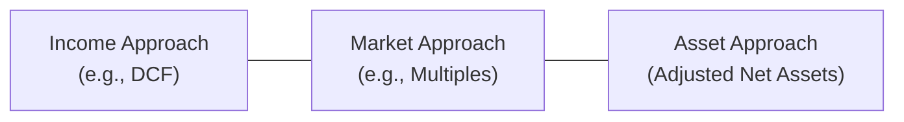
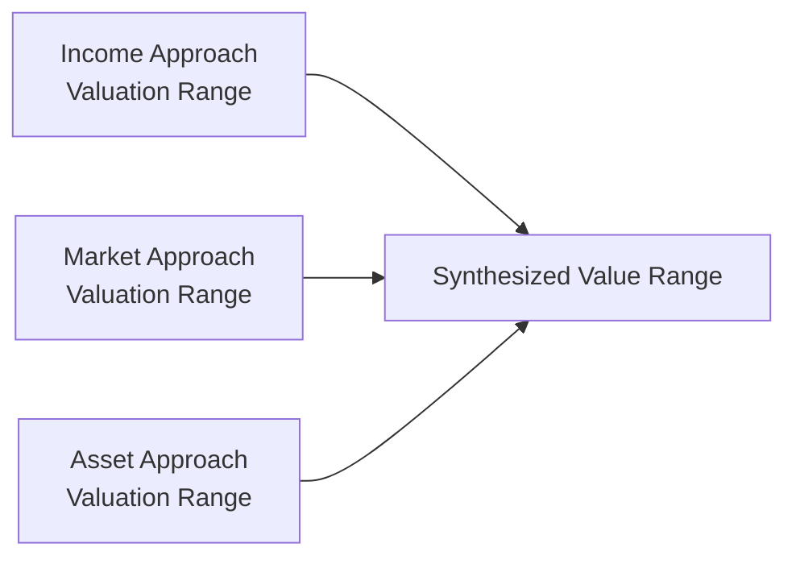

## 9.1 Valuation Approaches (Income, Market, Asset)

Valuation plays a critical role in corporate finance, mergers and acquisitions, financial reporting (including impairment testing), and a broad range of business analysis scenarios. As a CPA candidate or practicing accountant, understanding the three primary valuation approaches is essential for informed decision-making and accurate financial reporting. This section explores the Income, Market, and Asset approaches in detail, discussing how each method works, when it is most appropriate, and how to apply it in real-world settings. It is a direct complement to other chapters in this book, such as Chapter 10 (Indefinite-Lived Intangible Assets and Goodwill), Chapter 9.2 (Mergers, Acquisitions, and Divestitures Considerations), and Chapter 23 (Emerging Issues in Accounting and Analysis), which frequently reference valuation concepts.

---

### Overview of the Three Approaches

Although valuation engagements can vary widely, most methods can be organized into three main categories:

• The Income Approach focuses on an entity’s expected future earnings or cash flow, discounted to present value.  
• The Market Approach bases value on comparable transactions or public-company trading multiples.  
• The Asset Approach (or Cost Approach) looks at the fair value of a company’s net assets, often adjusted for intangible considerations.  

Below is a broad conceptual diagram illustrating how these three approaches relate to each other:

Each approach can be refined into multiple specific methods. Understanding which approach or combination of approaches to use hinges on the company’s stage of development, reliability of financial forecasts, availability of market comparables, and the nature of the assets in question. In many valuation engagements, analysts utilize a “triangulation” method by reviewing estimates from all three approaches and synthesizing a final figure that best reflects the entity’s fair value.

---

### The Income Approach

The Income Approach is often regarded as one of the most theoretically sound valuation methods because it directly considers the future economic benefits expected to be derived from ownership. At its core, it equates the present value of future cash flows to the company’s intrinsic value.

#### Core Principles

1. Future Cash Flow Projection: Determine the cash flows (e.g., free cash flows to the firm or to equity) expected to be generated in future periods.  
2. Discount Rate (WACC or Required Rate of Return): Identify a rate that reflects the time value of money and the risk associated with the expected cash flows.  
3. Terminal Value (TV): Account for value beyond the explicit forecast period (often 5 to 10 years).  
4. Present Value Calculation: Convert all forecasted cash flows (and the terminal value) into today’s dollars.  

The Income Approach is especially favored when:

• The subject entity’s projected earnings or free cash flow patterns are reliable.  
• The business is a going concern with stable or predictable performance.  
• No reliable market price or direct comparable companies are readily available.  

#### Discounted Cash Flow (DCF) Method

1. Project Sales, Costs, and Operating Cash Flows  
   - Start by projecting revenue based on growth assumptions that align with historical performance, market trends, and realistic expansion plans.  
   - Deduct cost of goods sold (COGS), operating expenses, and capital expenditures (CapEx).  
   - Consider changes in working capital.  

2. Compute Free Cash Flows  
   - Free Cash Flow to Firm (FCFF) = EBIT × (1 – Tax Rate) + Depreciation & Amortization – Capital Expenditures – Changes in Working Capital  
   - Free Cash Flow to Equity (FCFE) = FCFF – Interest Expense × (1 – Tax Rate) + Net Borrowings (when needed for financing).  

3. Determine the Appropriate Discount Rate  
   - For FCFF, often use Weighted Average Cost of Capital (WACC).  
   - For FCFE, typically use the Cost of Equity (e.g., via the Capital Asset Pricing Model, or CAPM).  

4. Calculate Terminal Value  
   - The **Gordon Growth Model** approach:  
     
     Terminal Value (TV) = (FCF in Final Projection Year × (1 + g)) ÷ (r – g)  
     
     where g is the stable perpetual growth rate, and r is the discount rate.  
   - The **Exit Multiple** approach:  
     
     Assume a value based on multiples of operating metrics (e.g., EBITDA) at the end of the forecasted period.  

5. Sum the Present Values  
   - Sum up the present value of free cash flows for the forecast period plus the present value of the terminal value.  

#### Sample Calculation

Let’s assume a four-year projection of annual free cash flows, followed by a terminal value:

• Year 1 FCFF: $3 million  
• Year 2 FCFF: $4 million  
• Year 3 FCFF: $5 million  
• Year 4 FCFF: $6 million  
• Perpetual growth rate (g): 3%  
• WACC (r): 10%  

Terminal Value in Year 4 using the Gordon Growth Model:  

Terminal Value = (Year 5 FCFF) ÷ (r – g)  
= ($6 million × (1 + 0.03)) ÷ (0.10 – 0.03)  
= ($6 million × 1.03) ÷ 0.07  
= $6.18 million ÷ 0.07  
= $88.3 million (approx.)  

Then, discount each FCFF and the terminal value to the present at 10%:

PV(Year 1) = $3 million ÷ (1 + 0.10)^1  
PV(Year 2) = $4 million ÷ (1 + 0.10)^2  
PV(Year 3) = $5 million ÷ (1 + 0.10)^3  
PV(Year 4) = $6 million ÷ (1 + 0.10)^4  
PV(Terminal Value) = $88.3 million ÷ (1 + 0.10)^4  

Sum these present values to obtain the total equity value under the Income Approach. In real-world scenarios, one must refine these projections and discount rates to reflect the specific country, industry, and firm risk profile.

---

### The Market Approach

The Market Approach values a business or asset by examining observable market data. It answers the question: “What are investors currently willing to pay for similar assets or companies in the market?” Essentially, if a comparable company trades for 8× EBITDA, and your company’s annual EBITDA is $10 million, a quick “apples-to-apples” approach suggests a market value of $80 million.

#### Core Methods

• Guideline Public Company (GPC) Method  
• Guideline Transaction (M&A) Method  

#### Key Steps in The Market Approach

1. Identify Comparables  
   - Locate public companies or recent transactions closely matching the subject. “Closely” often refers to size, industry, growth trajectory, geographic focus, capital structure, profitability, and risk profile.  

2. Select Multiples  
   - Common multiples include:  
     - Price/Earnings (P/E)  
     - Enterprise Value/EBITDA  
     - Enterprise Value/Sales  
   - Less common, though useful in niche scenarios: Price/Book (P/B), Price/Tangible Book, or Price/Cash Flow.  

3. Adjust Multiples if Needed  
   - Apply a size premium or discount if your subject is significantly larger or smaller than the comparable set.  
   - Adjust for differences in capital structure.  
   - Reflect intangible factors: brand strength, data capabilities, or management expertise.  

4. Apply the Multiple to the Subject Company’s Metrics  
   - Subject’s EBITDA × Selected EBITDA multiple = Indicated enterprise value.  
   - Subject’s net income × Selected P/E multiple = Indicated equity value.  

5. Fine-Tuning Adjustments  
   - Non-operating assets (like excess cash or investment securities) require separate valuations, added or subtracted as needed.  
   - Debt must also be netted out to move from enterprise value to equity value.  

#### Simple Example

Imagine a software services firm that generated $5 million in EBITDA last year. You identify three guideline public companies with EV/EBITDA multiples of 8.0×, 8.2×, and 7.5×, and you determine an appropriate multiple for your firm is roughly 8× after adjustments.

• Enterprise Value = $5 million × 8.0 = $40 million  
• Less: Net Debt = $5 million  
• Implied Equity Value = $35 million  

This figure may be compared against results from an Income or Asset Approach to hone in on a range of values.

#### When Market Approach Shines

• There is a robust, reliable set of comparable publicly traded companies or transactions.  
• The subject company is not overly unique, meaning standard multiples can provide a meaningful benchmark.  
• Market data (like transaction values or public-company trading prices) closely reflect the underlying fair value environment.  

---

### The Asset Approach

The Asset Approach, often referred to as the Cost Approach, calculates a company’s value by adjusting the fair values of its total assets and liabilities. In the simplest form, it considers the company’s “net asset value” from a market-value perspective rather than purely from accounting book values. This approach can be subdivided into specific methods, such as the **Adjusted Book Value Method** and the **Liquidation Value Method**.

#### Common Situations for Using the Asset Approach

• Holding Companies: Firms primarily holding real estate or other investments that can be straightforwardly revalued to market.  
• Financially Distressed or Non-Operating Entities: When the going-concern assumption is questionable, and liquidation value becomes central.  
• Early-Stage IP-Driven Firms: If intangible assets can be measured reliably (e.g., patents, prototypes, code repositories), an intangible asset valuation may be added to tangible asset valuation.  

#### Key Steps

1. Identify All Assets and Liabilities  
   - Tangible Assets: Land, buildings, equipment, inventory.  
   - Intangible Assets: Patents, trademarks, brand recognition (see Chapter 10 for goodwill considerations).  
   - Liabilities: Short- and long-term debt, off-balance-sheet obligations if they exist.  

2. Revalue Assets and Liabilities to Fair Value  
   - Land and buildings appraised at current market value.  
   - Equipment valued at either replacement cost or scrap value (depending on the state of the business).  
   - Intangible assets may require specialized appraisal (trademarks, software code, in-process R&D).  

3. Subtract the Fair Value of Liabilities from the Fair Value of Assets  
   - The resulting figure is the adjusted net asset value.  

4. Consider Liquidation vs. Going Concern  
   - **Liquidation Value**: Focuses on the net cash proceeds if the company were sold in pieces with no continuing operations.  
   - **Replacement Cost**: Considers how much it would cost to replicate the business’s assets from scratch.  

#### Sample Calculation

Assume your subject company has a book value of $10 million in assets and $4 million in liabilities, resulting in a net book value of $6 million. Upon revaluation, you find:

• Real estate is currently worth $3 million more than its book value.  
• Machinery, fully depreciated in the books, still has a salvage value of $1 million.  
• Patents are estimated at $2 million (not recorded on the balance sheet).  
• Liabilities remain fairly stated at $4 million.  

So, fair value of assets = $10 million + $3 million (real estate) + $1 million (machinery salvage) + $2 million (patents) = $16 million. Liabilities remain at $4 million. Therefore, the adjusted net asset value is $12 million ($16 million – $4 million). That suggests a base equity value of $12 million using the Asset Approach.

---

### Choosing the Appropriate Approach

The ideal approach or combination of approaches for a valuation engagement depends on factors such as reliability of financial projections (see Chapter 7: Budgeting and Forecasting), industry comparability (Chapter 4: Benchmarking and Industry Comparisons), presence of intangible assets (Chapter 10: Indefinite-Lived Intangible Assets and Goodwill), and capital structure decisions (Chapter 8: Capital Structure and Cost of Capital). Here are some common guiding principles:

• **Income Approach**: Appropriate when stable or predictable cash flows exist, and you can credibly project future performance over a reasonable horizon.  
• **Market Approach**: Useful when comparables are readily available and the subject does not deviate sharply from industry norms.  
• **Asset Approach**: Relevant for non-operating or asset-intensive entities where the fair value of net assets provides a direct measure of the company’s worth.  

In many practical valuations, especially in M&A or private equity contexts, analysts often use two, if not all three, approaches to gain confidence and determine a credible range. External factors—such as cyclical market conditions or intangible-heavy business models—may weigh heavily in the final choice.

---

### Practical Insights and Pitfalls

1. **Double Counting Intangibles**: If applying the Market Approach and intangible values are already “priced in” to multiples, revaluing them separately under an Asset Approach can lead to overstatement.  
2. **Overlooking Off-Balance-Sheet Liabilities**: For instance, operating leases (now addressed under ASC 842 or IFRS 16, but historically off-balance sheet), environmental liabilities, or litigation contingencies may drastically alter net asset calculations.  
3. **Mismatch Between Forecasts and Discount Rates**: Projections under the Income Approach often reflect certain economic assumptions. Make sure the discount rate properly accounts for these assumptions.  
4. **Benchmark Limitations**: The lack of truly comparable “guideline” companies in specialized or emerging industries can undermine the reliability of the Market Approach.  
5. **Management Bias**: Overly optimistic forecasts can inflate valuations under the Income Approach. A healthy skepticism, as discussed in Chapter 6 (Evaluating Non-GAAP Measures with Professional Skepticism), is critical.  

---

### Best Practices for Each Approach

• **Income Approach**  
  - Rigorously document and defend your discount rate selection.  
  - Use scenario analysis to gauge valuation sensitivity to changes in growth rates, profit margins, and capital expenditures.  
  - Tie your projections to market-based assumptions (like industry growth, raw material cost trends, or new product rollouts).  

• **Market Approach**  
  - Scrutinize each comparable’s size, growth rate, and profitability.  
  - Make representation adjustments for capital structure fluctuations, ensuring consistency in metrics (e.g., always use enterprise value to EBITDA).  
  - Consider forward multiples if the subject’s near-future earnings differ significantly from the trailing 12 months.  

• **Asset Approach**  
  - Update or validate appraisals for tangible assets; ensure intangible assets are segregated for separate valuation if needed.  
  - Use recognized valuation specialists when intangible assets represent a significant portion of value.  
  - Pay attention to potential tax consequences (e.g., capital gains on real estate revaluation).  

---

### Visualizing a Combined Approach

In real-world engagements, analysts typically produce a range of values derived from each method. Mergers and acquisitions, especially when synergy (Chapter 9.4: Synergy Assessments) is a factor, may adopt the Income Approach as the “primary driver” but adjust up or down based on Market Approach “sanity checks” and Asset Approach “floor values.”

Below is a basic summation of how one might combine information from all three approaches:

In practice, you may weight each approach based on the quality of the data. For instance, if you have a high degree of confidence in future cash flows or the entity has stable fundamentals, the Income Approach may receive a higher weighting than the other methods.

---

### References for Further Exploration

• Pratt, Shannon P., “Valuing a Business: The Analysis and Appraisal of Closely Held Companies,” McGraw-Hill.  
• Damodaran, Aswath, “Damodaran on Valuation,” John Wiley & Sons, for deeper insights into DCF modeling and cost of capital.  
• AICPA’s “Statement on Standards for Valuation Services No. 1” for key standards of practice in valuation engagements.  
• Chapter 4 (Financial Statement Analysis), Chapter 10 (Indefinite-Lived Intangible Assets and Goodwill), and Chapter 23 (Emerging Issues in Accounting and Analysis) in this guide for related discussions.  

This concludes our comprehensive look at the three principal valuation approaches. In the following sections, we will delve further into specific transaction structures, synergy assessments, and advanced modeling techniques that build upon these foundational methods.

---

## Master Your Valuation Approaches: A CPA Exam-Style Quiz



### A company with reliable projected cash flows and limited availability of comparable public firms is best valued using:
- [x] The Income Approach
- [ ] The Market Approach
- [ ] The Asset Approach
- [ ] The Guideline Transaction Method

> **Explanation:** When reliable forward-looking financial data are available but direct market comparables are scarce, the discounted cash flow (Income Approach) is typically most appropriate.

### When using the Market Approach, which of the following is a common adjustment?
- [x] Applying a size premium or discount based on the subject’s relative scale
- [ ] Randomly adjusting historical transaction multiples
- [x] Eliminating outlier multiples if they do not reflect the subject’s scope and operations
- [ ] Using future forecast multiples only if they are higher

> **Explanation:** Two key adjustments are size premiums/discounts and the elimination of outlier multiples. Analysts should ensure that the selected multiple set truly represents companies comparable to the subject.

### The Gordon Growth Model calculates terminal value by:
- [x] Dividing the next period’s cash flow by the difference between the discount rate and the growth rate
- [ ] Multiplying the next period’s cash flow by the growth rate
- [ ] Subtracting depreciation from free cash flow
- [ ] Adding the subsequent five years of cash flows to the discount rate

> **Explanation:** The standard formula for the Gordon Growth Model’s terminal value is (FCF × (1+g)) ÷ (r – g), where g is perpetual growth and r is the discount rate.

### In the Asset Approach, which factor often requires a specialist’s input first?
- [x] Fair value of intangible assets
- [ ] Book value of tangible assets
- [ ] Calculation of depreciation expense
- [ ] Historical distribution of retained earnings

> **Explanation:** Intangible assets (such as proprietary technology, trademarks, or patents) can be complex to value and typically require specialized appraisals to ensure accuracy.

### Which of the following is typically a multiplier in the Market Approach?
- [x] EV/EBITDA
- [ ] Free Cash Flow – WACC
- [x] Price/Earnings (P/E)
- [ ] Depreciation/Amortization (D/A)

> **Explanation:** Market multiples commonly include EV/EBITDA and Price/Earnings ratios. Other multiples, like EV/Sales, may also be used depending on the industry.

### When calculating a Discounted Cash Flow (DCF), the Weighted Average Cost of Capital (WACC) is used to discount:
- [x] Free Cash Flow to the Firm
- [ ] Free Cash Flow to Equity only
- [ ] Levered Cash Flow
- [ ] Dividends only

> **Explanation:** WACC is used to discount free cash flow to the firm (FCFF). If using free cash flow to equity (FCFE), the appropriate discount rate would generally be the cost of equity.

### Valuation engagements should consider off-balance-sheet liabilities because:
- [x] They can significantly reduce the value of a firm’s net assets
- [ ] They are never reflected in the income statement
- [x] They inflate operating margins
- [ ] Auditors ignore them

> **Explanation:** Off-balance-sheet liabilities, such as certain lease obligations or contingencies, can reduce a firm’s net asset position and thus must be analyzed carefully for a complete financial picture.

### Which condition might prompt you to rely heavily on the Asset Approach?
- [x] The company is liquidating or is a holding entity with few operations
- [ ] The business has significant intangible assets that cannot be appraised
- [ ] The business is growing rapidly and has many public comparables
- [ ] Management’s cash flow projections are very reliable

> **Explanation:** The Asset Approach is well-suited for businesses whose value is mostly in tangible assets or for those in liquidation, where the going-concern assumption does not hold.

### A flipped scenario: You have a high-growth firm with negative earnings but robust intangible resources. The best initial approach is:
- [x] The Income Approach using projected free cash flows
- [ ] The Market Approach using P/E multiples
- [ ] The Asset Approach using book values
- [ ] The Asset Approach ignoring intangible assets

> **Explanation:** High-growth companies often have negative current earnings, making P/E multiples uninformative. A DCF with reliable future revenue projections, accounting for intangible-driven prospects, is frequently most appropriate.

### Fair Market Value is defined as the price:
- [x] At which a willing buyer and willing seller would transact, neither under compulsion
- [ ] Dictated by the government for tax purposes
- [ ] Selected arbitrarily by management
- [ ] That must exceed book value of the entity

> **Explanation:** Fair market value represents the price that a hypothetical willing buyer and seller, both with reasonable knowledge of relevant facts, would agree upon, without any undue pressure to transact.



---

## For Additional Practice and Deeper Preparation

### [Business Analysis and Reporting (BAR) CPA Mock Exams](https://www.udemy.com/course/bar-cpa-mock-exams/?referralCode=ADBE2E84BEE9CB6243CA)

**Business Analysis and Reporting (BAR) CPA Mocks:** 6 Full (1,500 Qs), Harder Than Real! In-Depth & Clear. Crush With Confidence!

- Tackle full-length mock exams designed to mirror real BAR questions.  
- Refine your exam-day strategies with detailed, step-by-step solutions for every scenario.  
- Explore in-depth rationales that reinforce higher-level concepts, giving you an edge on test day.  
- Boost confidence and minimize anxiety by mastering every corner of the BAR blueprint.  
- Perfect for those seeking exceptionally hard mocks and real-world readiness.  

_Disclaimer: This course is not endorsed by or affiliated with the AICPA, NASBA, or any official CPA Examination authority. All content is for educational and preparatory purposes only._
