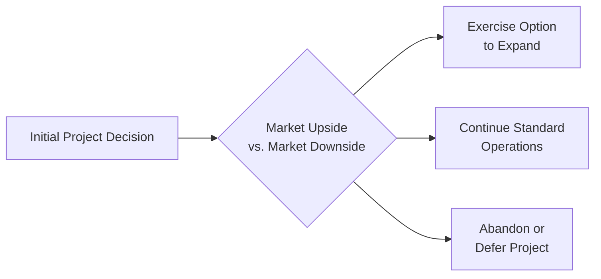

## 9.3 Real Option Valuation and Complex Modeling

Real option valuation (ROV) is a powerful framework that goes beyond traditional discounted cash flow (DCF) analysis by recognizing the value of managerial flexibility in uncertain business environments. When organizations face investment decisions—for example, whether to expand, defer, contract, or abandon a project—conventional net present value (NPV) techniques often fall short of capturing the value that strategic choices can add. Real options are rooted in financial option theory (e.g., the Black-Scholes model) but applied to “real,” tangible or intangible business projects rather than stock or commodity options. 

This section offers a high-level overview of real option valuation fundamentals and introduces readers to the advanced modeling approaches that underpin ROV, including the binomial-lattice approach, Monte Carlo simulation, and other hybrid or proprietary methods used in complex business analysis. We will cover:

• The conceptual underpinnings of real options  
• Different types of real options (expansion, contraction, deferment, abandonment, etc.)  
• Challenges in applying real option valuation in practice  
• Advanced modeling techniques and case examples for practical implementation  

The goal is to provide CPA candidates and finance professionals with frameworks that address the subtleties of dynamic and uncertain business scenarios and the potential for adjusted strategic decision-making.

---

### Understanding Real Options

Real options confer the right—but not the obligation—to undertake certain actions in the future. These actions might be an expansion, waiting for new information, contracting scope, or abandoning a project altogether. This approach contrasts with traditional capital budgeting methodologies, which often implicitly assume passive management. In reality, managers can and do respond to unfolding events, making decisions at multiple stages of a project’s life. Real option valuation attempts to measure that flexibility.

#### Why Traditional NPV May Fall Short

The standard NPV method calculates a project’s value by discounting future expected cash flows to the present, subtracting the initial investment, then determining whether the result is positive or negative. While NPV is a crucial first step, it lacks any formal mechanism to incorporate managerial decisions under uncertainty. For instance, if a project’s prospects deteriorate significantly, managers might cut losses and abandon it. On the other hand, if opportunities become more lucrative, they may scale operations. Traditional NPV might fail to account for these critical choices, overlooking the valuable optionalities that arise out of real business scenarios.

#### Key Features of Real Option Valuation

• Incorporates Future Flexibility: Recognizes that a project’s net present value can grow if the firm exercises certain strategic decisions.  
• Explicitly Models Uncertainty: Reflects that investment outcomes are subject to both market and firm-specific risks, which evolve over time.  
• Adaptable to Multi-Stage Projects: Splits the life of a project into phases, each associated with its own decision node—similar to staged financing in venture capital.  
• Aligns with Financial Option Pricing Concepts: Uses similar mathematical foundations to those found in derivative pricing models.  

---

### Types of Real Options

Real options can arise in many different contexts:

• Option to Defer (Timing Option): Managers can wait for additional information before committing investment resources.  
• Option to Expand or Scale Up (Growth Option): If market conditions are favorable, the company can invest more capital to enlarge capacity or product lines.  
• Option to Contract or Scale Down: If business conditions weaken, managers can scale down operations to reduce costs.  
• Option to Abandon: Exiting a failing project can limit losses.  
• Option to Switch: Switching between different outputs or inputs can enhance efficiency if market conditions change (common in manufacturing processes).  

Each of these options adds strategic value to the project beyond what a simple static NPV model would capture.

---

### Real Option Valuation vs. Traditional DCF

Real option valuation extends traditional DCF by recognizing that decision-making is dynamic. Under DCF, if you expect a stream of cash flows over several years, you discount them to the present using one discount rate—often the weighted average cost of capital (WACC)—and sum them up. However, in real option valuation:

1. The project’s cash flows are not fixed. They evolve based on continuously changing economic factors.  
2. Decision-makers can respond to new information about costs, technology, regulation, or demand.  
3. The volatility of future cash flows becomes a key driver of value since higher uncertainty increases the value of having an “option” to change course.  

In essence, real option valuation can be thought of as a dynamic approach that leverages the mathematics of financial option pricing (e.g., Black-Scholes, binomial trees, Monte Carlo methods) but applies them to real corporate investments rather than financial securities.

---

### Conceptual Approach to Real Option Valuation

The fundamental logic revolves around identifying uncertain variables, mapping out scenarios, and assigning probabilities to each scenario. Managers can then incorporate the possibility of adjusting strategy—whether that means investing more, scaling down, or abandoning. 

Below is a simplified view of how real options can be represented in a decision tree:

- A["Initial Project Decision"]: This node represents the choice to initiate the project under baseline assumptions.  
- B{"Market Upside   vs. Market Downside"}: Demonstrates that at a later review point, outcomes could be significantly better or worse than initially expected.  
- C["Exercise Option   to Expand"]: If the market is up, the company invests further to capitalize on favorable conditions.  
- D["Continue Standard   Operations"]: If the conditions meet expectations, the project continues without major alteration.  
- E["Abandon or   Defer Project"]: If the market is down or relevant uncertainties change the risk-reward profile, the firm can cut losses or wait for more clarity.

---

### Common Valuation Methods

Real option valuation borrows from finance theory. The primary techniques are:

#### 1. Binomial Lattice or Tree Approach

A binomial model steps through time in discrete intervals, with each step showing an “up” or “down” movement in the underlying project value or relevant state variable (e.g., commodity prices, market demand). The lattice approach maps out all possible paths, calculates the value of the option at the terminal nodes, and then works backward to discount and determine the option value at earlier nodes.

For instance, using a one-period binomial model for an expansion option, the approach might look like this:

• Let the current project value be V₀.  
• After one year, the project could either go up to Vᵤ or down to V_d with certain probabilities p and (1−p).  
• The expansion option is exercised if the project’s upside scenario materializes. 

##### Simplified Binomial Option Example

Suppose:  
• V₀ = 100 million  
• After one period, upside Vᵤ = 130 million, downside V_d = 70 million  
• Risk-neutral probability p = 0.55 (derived from no-arbitrage principles)  
• The expansion option cost is 20 million, which can be spent after one year if Vᵤ occurs, yielding a new payoff at that node.  

You would discount these expected payoffs back to the present using a risk-free or appropriate discount rate. The binomial model is flexible for multi-period scenarios, with each period capturing a new up/down node.

#### 2. Black-Scholes Model

Originally designed for pricing financial options on stocks, the Black-Scholes equation can be adapted to value certain real options under specific assumptions (e.g., continuous, lognormal price processes, no dividends, and cost-of-carry approximations). Real assets often do not conform perfectly to these assumptions, so adjustments or approximations are frequently required.

The Black-Scholes formula for a European call option is:


C = S_0 \Phi(d_1) - K e^{-rT} \Phi(d_2)


Where:
• \\( S_0 \\) is the current underlying price (project value).  
• \\( K \\) is the strike (investment cost).  
• \\( \Phi \\) is the cumulative distribution function for a standard normal distribution.  
• \\( d_1 = \frac{\ln\left(\frac{S_0}{K}\right) + \left(r + \frac{\sigma^2}{2}\right)T}{\sigma\sqrt{T}} \\)  
• \\( d_2 = d_1 - \sigma \sqrt{T} \\)  
• \\( r \\) is the risk-free rate.  
• \\( T \\) is time to expiration.  
• \\( \sigma \\) is the volatility of the underlying’s returns.  

Adapting the above for real asset scenarios often involves substituting the adjusted carrying cost or convenience yield, and interpreting volatility as the volatility of project value or relevant cash flow drivers.

#### 3. Monte Carlo Simulation

Monte Carlo methods involve simulating the underlying variables (price, demand, cost swings, etc.) hundreds or thousands of times using random draws from specified probability distributions. For each simulation run:

1. Generate a path for the underlying variable (e.g., price) over time.  
2. At each decision node, apply the logic: “Should we exercise the option or wait?”  
3. Accumulate payoffs and discount them to the present value.  

Averaging the results across the large number of runs provides an estimate of the option value. Monte Carlo simulation is particularly useful for more complicated or path-dependent options (e.g., an option to abandon if the project hits certain negative cash flow thresholds).

---

### Practical Example: The Option to Expand

Consider a manufacturing firm evaluating a new product line. The firm can start with a small pilot plant that costs $50 million. If, after three years, market conditions are favorable (a probability the firm estimates at 40%), the company can expand by investing an additional $25 million, potentially doubling output and revenue.

Under a simple DCF approach, the firm might conclude that the overall NPV is slightly negative—solely based on an initial forecast of moderate demand. However, real option valuation might reveal that the potential upside outweighs the downside because if demand remains moderate or lower, the firm loses only the initial investment. If demand is significantly higher, the firm captures a large payoff from expansion. This “asymmetry” created by the optionality could turn the project from an NPV near zero or negative into a valuable strategic move.

---

### Complex Modeling in Real Options

Real options often require more complex modeling than standard finance because the underlying asset may not be traded on a liquid market (e.g., specialized technology, intangible assets, or R&D). Key complexities include:

• Estimating Volatility: Determining the volatility parameter (σ) can be tricky if no market proxy exists. Analysts might use historical internal project data or comparable company volatility as proxies.  
• Multi-Factor Uncertainty: Commodity prices, foreign exchange rates, operational costs, and regulatory changes might simultaneously affect project value. Multi-factor models and correlated simulations may be required.  
• Path-Dependence: Some options have value contingent upon a sequence of events (e.g., partial expansions leading to a final mega-expansion). In such cases, Monte Carlo or advanced lattice trees are necessary.  
• Interdependent Options: Several real options may exist for a single project (e.g., both expansion and abandonment). Modeling their interplay often complicates analysis.  

#### Integrating Various Methods

In practice, analysts frequently combine aspects of binomial-lattice methods, Monte Carlo simulation, and proprietary or scenario-based approaches to handle multi-factor and multi-stage nuance. For instance, an approach might start with a binomial tree for commodity price uncertainty but incorporate a Monte Carlo simulation for project-specific demand or cost drivers. 

---

### Best Practices for Real Option Analysis

• Identify Project Uncertainties Early: Pinpoint where managerial flexibility can meaningfully alter risk-reward outcomes.  
• Use Scenario Planning: Combine real option valuation with scenario-based thinking to ensure consistent assumptions across the business.  
• Start with a Base NPV: A standard DCF baseline helps anchor your real option premium (i.e., how much extra value the option confers).  
• Conduct Sensitivity Analysis: Vary key assumptions (e.g., volatility, discount rates, expansion cost) to see how the valuation changes.  
• Document Assumptions Clearly: Real options are more assumption-intensive than standard DCF. Keep clear records of key inputs.  
• Revisit and Update: Real options valuation isn’t static. As new information arises, revisit the analysis to refine your results.  

---

### Common Pitfalls and Challenges

1. Overestimating Volatility: An inflated volatility estimate can drastically increase the calculated option value, so being realistic is critical.  
2. Ignoring Correlation Between Variables: If multiple factors drive project value, ignoring their correlations might yield misleading results.  
3. Implementing Without Sound Theory: Inconsistent usage of discount rates or “blended” methodologies can produce unreliable outcomes.  
4. Undervaluing Managerial Constraints: While real options stress flexibility, not every firm has the operational or strategic capacity to pivot instantly; constraints on managerial action can limit real option value.  
5. Neglecting Competitive Dynamics: In real-world markets, competitors might also hold similar real options, affecting the ultimate payoff.  

---

### Case Study: Oil and Gas Exploration

One classic setting for real option valuation is in oil and gas exploration. Suppose a company obtains rights to a drilling area. The firm can sink an exploratory well, at a cost of $5 million, to gauge viability. If the well shows promise, the firm can develop the field at a much larger investment. If results are poor, it can walk away. This two-stage approach is a real option to expand:

1. Invest $5 million for exploration.  
2. If positive results, invest $50 million to develop production facilities.  

A binomial-lattice or Monte Carlo approach would account for future oil price volatility, drilling success rates, reservoir size, extraction costs, and the possibility that the firm may cease operations if certain revenue thresholds are not met.

---

### Diagrams and Modeling Structures

Analysts often construct multi-layered diagrams to illustrate possible paths and decisions. For example, a binomial-lattice layout might show multiple up/down movements of oil prices, while a separate sub-branch outlines whether the firm has exercised the option to expand drilling. Combining the two paths can quickly become complex, which underscores the importance of robust modeling software or spreadsheets designed for these analyses.

---

### Challenges in CPA Practice

From a CPA perspective, real option valuation may interact with financial statement recognition and disclosures. Although GAAP and IFRS do not explicitly require separate recognition of real option value (except in specialized circumstances like IFRS for related intangible assets), the analysis can be pivotal for:

• Asset Impairment Decisions: Real option insights can influence fair value estimates or impairment models, especially for intangible assets or goodwill.  
• Mergers & Acquisitions: Understanding real option value helps in negotiations, synergy calculations, and intangible asset valuations.  
• Risk Disclosures: Enhanced MD&A disclosures may involve discussing strategic flexibility.  

When preparing or auditing financial statements, CPAs should remain cautious. The real option approach is often used internally for strategic decisions, but it can also feed external reporting estimates (e.g., measurement of intangible assets, self-constructed assets, or contingent liabilities). A rigorous, well-documented approach is vital for defending any valuations that incorporate a real options viewpoint.

---

### Summary and Key Takeaways

Real option valuation represents an evolution in corporate finance, capturing the strategic dimension of decision-making under uncertainty. Its principles are rooted in longstanding option pricing methods—particularly binomial-lattice, Black-Scholes, and Monte Carlo simulation—yet tailored to real business assets. While more intricate and assumption-driven than standard DCF, real options often yield more accurate valuations by acknowledging that managers can adapt over the life of a project.

By blending quantitative rigor with qualitative business judgments, real options can help businesses seize upside opportunities while limiting downside risks. Candidates preparing for the BAR section of the CPA Exam should possess a conceptual understanding of real option methodologies, know how to identify areas in which these valuations might be most useful, and recognize common pitfalls.

---

### References & Further Exploration

• Copeland, T., & Antikarov, V. (2003). Real Options: A Practitioner’s Guide.  
• Trigeorgis, L. (1998). Real Options: Managerial Flexibility and Strategy in Resource Allocation.  
• Damodaran, A. (2012). Investment Valuation: Tools and Techniques for Determining the Value of Any Asset.  
• Mun, J. (2006). Real Options Analysis: Tools and Techniques for Valuing Strategic Investments and Decisions.  
• CFA Institute – “Real Options in Practice” Webinars.  

---

## Mastering Real Option Valuation: Top BAR-Ready Quiz



### Real options primarily differ from traditional net present value (NPV) approaches by:
- [x] Capturing the value of managerial flexibility under uncertainty.
- [ ] Recognizing only historical costs in project assessments.
- [ ] Eliminating risk factors through hedging strategies.
- [ ] Always producing a lower valuation than static DCF methods.

> **Explanation:** Real options incorporate the ability to adjust project decisions based on evolving conditions, an aspect not typically captured by a static, traditional NPV analysis.

### Which method applies discrete up/down movements to model possible future values at each time step?
- [x] Binomial-lattice approach
- [ ] Linear regression approach
- [ ] Payback period method
- [ ] Realistic synergy analysis

> **Explanation:** The binomial-lattice (or binomial-tree) approach is built on discrete periods, each with an “up” or “down” movement, allowing managers to value the option at each node.

### Which of the following statements about the Black-Scholes model is correct?
- [x] It was originally designed for pricing stock options but can be adapted for certain real option valuations.
- [ ] It requires a multiperiod lattice with changing volatility.
- [ ] It is a purely qualitative tool used for managerial decision-making without numerical outputs.
- [ ] It strictly prohibits evaluating any intangible assets.

> **Explanation:** The Black-Scholes model was developed for stock options but its conceptual underpinnings can be adjusted and applied to real options, though various assumptions must be adapted.

### In real option valuation, volatility (σ) represents:
- [x] The standard deviation of the underlying project’s value over time.
- [ ] A fixed risk premium set by regulators.
- [ ] A parameter that must always be zero for expansions.
- [ ] A function that must remain constant regardless of external factors.

> **Explanation:** Volatility in real options is typically the measure of how much the underlying project value (e.g., expected cash flows) can vary. Higher volatility often increases the worth of the option.

### Which of the following is an example of an “option to abandon” scenario?
- [x] Stopping a product line and selling off related assets if losses exceed a certain threshold.
- [ ] Proceeding with an expansion as soon as NPV is positive.
- [x] Switching to a less costly supplier mid-project.
- [ ] None of the above.

> **Explanation:** An option to abandon allows managers to cease operations and possibly recoup salvage value if the project’s performance falls below acceptable levels. Switching suppliers is partly a separate “option to switch” concept.

### Multi-factor modeling in real option analysis is crucial because:
- [x] Multiple uncertainties—like commodity prices and regulatory changes—can simultaneously affect a project’s cash flows.
- [ ] It ensures real options never yield a negative NPV.
- [ ] It automatically resets all parameters weekly.
- [ ] It simplifies the overall model to a single dimension.

> **Explanation:** Multi-factor modeling recognizes that diverse variables (e.g., demand, input costs, exchange rates) can correlate and affect the project’s outcomes, adding complexity to the valuation.

### A Monte Carlo simulation differs from a binomial-lattice model because:
- [x] It relies on random sampling across many possible scenarios to estimate the distribution of outcomes.
- [ ] It uses only one path for each simulation run.
- [x] It assumes zero variability in input parameters over time.
- [ ] It is less flexible for handling path dependencies.

> **Explanation:** Monte Carlo simulation generates a large number of random pathways for underlying variables, testing outcomes at each path and thus accommodating various forms of path-dependence and uncertainty.

### A key pitfall when performing real option valuation is:
- [x] Overestimating volatility and inflating the option value.
- [ ] Relying on sensitivity analyses to cross-check results.
- [ ] Using binomial-lattice or Monte Carlo methods to value complex projects.
- [ ] Keeping meticulous records of assumptions.

> **Explanation:** Overestimating volatility can significantly inflate the computed value, leading to overly optimistic decision-making.

### Which of the following best describes the benefit of a preliminary DCF calculation before proceeding with real option modeling?
- [x] DCF provides a baseline or “plain vanilla” valuation to which real option premiums can be compared.
- [ ] DCF automatically captures all strategic flexibilities.
- [ ] DCF only focuses on intangible asset values.
- [ ] DCF incorporates volatility more effectively than real option models.

> **Explanation:** A standard DCF calculation offers a baseline that helps analysts identify the additional value introduced by real option premiums and clarifies how much flexibility is worth.

### A firm can reduce exposure to downside risks while preserving upside potential by:
- [x] Leveraging real options such as abandonment, deferment, and expansion.
- [ ] Committing to a large fixed-capacity investment from the start.
- [ ] Avoiding scenario analysis or sensitivity testing.
- [ ] Eliminating managerial decision checkpoints.

> **Explanation:** Real options provide levers for risk management (e.g., abandonment) and opportunity capture (e.g., expansion), greatly enhancing the risk-return profile.



---

## For Additional Practice and Deeper Preparation

### [Business Analysis and Reporting (BAR) CPA Mock Exams](https://www.udemy.com/course/bar-cpa-mock-exams/?referralCode=ADBE2E84BEE9CB6243CA)

**Business Analysis and Reporting (BAR) CPA Mocks:** 6 Full (1,500 Qs), Harder Than Real! In-Depth & Clear. Crush With Confidence!  

- Tackle full-length mock exams designed to mirror real BAR questions.  
- Refine your exam-day strategies with detailed, step-by-step solutions for every scenario.  
- Explore in-depth rationales that reinforce higher-level concepts, giving you an edge on test day.  
- Boost confidence and minimize anxiety by mastering every corner of the BAR blueprint.  
- Perfect for those seeking exceptionally hard mocks and real-world readiness.  

_Disclaimer: This course is not endorsed by or affiliated with the AICPA, NASBA, or any official CPA Examination authority. All content is for educational and preparatory purposes only._
