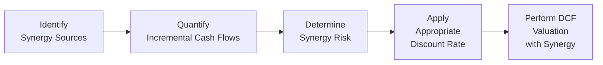
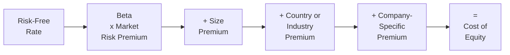

## 9.4 Discount Rates, Premiums, and Synergy Assessments

Valuation is not a one-size-fits-all exercise. Central to estimating an investment’s attractiveness is the discount rate used to determine the present value of future cash flows. In tandem, analysts often incorporate premiums to account for specific risks and incorporate synergy estimates—particularly in mergers, acquisitions, or strategic alliances—to capture additional benefits or cost savings. This section explores how to adjust discount rates for risk premiums and synergy estimates, offering practical techniques and best practices.

### Importance of Discount Rates, Premiums, and Synergies

A discount rate reflects the required rate of return that investors or stakeholders expect, given the level of risk in the underlying cash flows. Premiums (e.g., size premiums, industry risk premiums, country risk premiums) may be layered on top of a base discount rate to capture additional, often idiosyncratic, uncertainties. Synergy assessments, in contrast, address the wealth-creating potential of combining two businesses or forging strategic partnerships. Whether it is cost reduction from shared facilities or revenue enhancement via cross-selling, synergies can significantly impact valuation.

This section builds on concepts introduced in Chapter 9 (Valuation Techniques and Investment Decisions) and connects to the broader risk assessment principles reviewed in Chapter 8 (Risk Assessment and Prospective Analysis). You will learn:

• How to calculate and apply the Weighted Average Cost of Capital (WACC).  
• How to incorporate risk premiums into your discount rate.  
• Techniques to identify and measure different types of synergy.  
• Strategies and methods to integrate synergy estimates into valuations.  

### Components of the Discount Rate

A discount rate may represent the cost of equity, the cost of debt, or a blend of both. Most frequently, analysts use the WACC for enterprise-level valuations. WACC is covered in detail in Section 8.1. Here’s a succinct review:

Let E = market value of the firm’s equity  
Let D = market value of the firm’s debt  
Let V = E + D (total firm value)  
Let Rₑ = cost of equity  
Let R_d = cost of debt  
Let T = marginal tax rate  

The WACC is:


\text{WACC} = \frac{E}{V} \times R_e + \frac{D}{V} \times R_d \times (1 - T)


#### Cost of Equity: CAPM and Beyond

A common approach to estimate the cost of equity is the Capital Asset Pricing Model (CAPM):


R_e = R_f + \beta \times (R_m - R_f) + \text{additional premiums}


where:

• R_f = risk-free rate (e.g., yields on U.S. Treasury securities).  
• R_m = expected return on the overall market (often proxied by a broad equity index).  
• (R_m - R_f) = market risk premium.  
• β = beta, a measure of the stock’s volatility relative to the market.  
• additional premiums = size premium, country risk premium, or other adjustments for unique factors.

Other methods of calculating cost of equity exist, such as the Dividend Discount Model (DDM). However, CAPM-based approaches remain popular due to their broad acceptance and relatively straightforward application.

#### Cost of Debt

Cost of debt is typically the firm’s yield on its interest-bearing obligations, adjusted for the tax benefit of interest deductibility in many jurisdictions. More complicated calculations may apply if a company’s debt is structured, has subordinated tranches, or is subject to covenant risks.

### Risk Premium Adjustments

Real-world valuations often require adjusting the discount rate to reflect extra layers of uncertainty that may not be fully captured by beta or the standard CAPM-based approach. Below are common forms of risk premium adjustments.

#### Size Premium

Empirical evidence suggests that smaller firms tend to have risk-return parameters different from larger, more established firms. A small-company premium (sometimes called a size premium) can be added to CAPM-based estimates of required returns to account for the incremental risk.

#### Country Risk Premium

When valuing cross-border investments, a country-specific risk premium can compensate for political, economic, and currency instability. If you are valuing an investment in an emerging market with uncertain policy changes or higher inflation, you may add a premium that recognizes this elevated risk.

#### Industry Risk Premium

Beyond systemic market risk, certain industries may face unique disruptions—from technology changes, regulatory shifts, or cyclical demand patterns. An industry-specific premium can capture these idiosyncratic risk elements.

#### Company-Specific Premium

If a firm’s financial statements (Chap. 4) reveal disproportionate exposure to operational or financial risk, or if the firm has historically unstable earnings and volatile cash flows, a specific premium can be added to its cost of equity. This premium is often somewhat subjective and must be supported by consistent, transparent analysis.

### Synergy Assessments: Concept and Categories

Synergy refers to the incremental value realized when two entities or strategic initiatives join forces. It is a cornerstone in merger analyses (Chap. 9.1), but it also applies to licensing agreements, joint ventures, strategic alliances, or expansions that leverage existing resources. Broadly, synergy falls into these categories:

• Cost Synergy: Achieved through shared services, economies of scale, procurement power, or overhead consolidation.  
• Revenue Synergy: Derived from cross-selling, entering new markets with strategic channels, or leveraging brand loyalty across new product lines.  
• Intangible Synergy: Realized through combined intellectual property, brand amplification, or integrated technologies that cannot be easily measured but have tangible impacts on growth and profit.  

In many valuations, synergy is modeled as incremental cash flow rather than a direct discount rate adjustment. However, synergy can also carry additional risk—meaning you might adjust the discount rate to account for synergy realization uncertainty.

### Quantifying Synergy and Incorporating It into Valuation

1) Identify the Sources of Synergy  
   Conduct a detailed analysis to understand how synergy will be derived, whether by cost reduction (e.g., duplication of marketing resources) or by revenue growth (e.g., cross-selling).

2) Forecast Incremental Cash Flows  
   Project the additional incomes, cost savings, or intangible benefits (like brand expansion) over a forecast horizon. Be realistic about ramp-up periods and synergy dis-synergies (i.e., disruptions that lower short-term performance).

3) Assign a Synergy Risk Factor  
   Evaluate how certain or uncertain the synergy is. The more intangible or less proven the synergy, the higher the risk premium or discount rate you may consider applying to just those incremental flows.

4) Adjust the Discount Rate or Model Synergy Separately  
   You can integrate synergy in two main ways:  
   • Increase or decrease the discount rate if synergy is more or less risky than the core business.  
   • Or retain your baseline discount rate for stable operations and assign a “risk premium” or “probability factor” for synergy-based cash flows.  

5) Perform Sensitivity and Scenario Analyses  
   Evaluate how changes in synergy assumptions impact valuation outcomes. If synergy is large, small deviations can significantly change your final numbers.

Below is a simple conceptual diagram using Mermaid.js to illustrate synergy integration into a Discounted Cash Flow (DCF) analysis.

### Adjusting Discount Rates for Synergy

As noted, synergy adjustments can appear in either cash flows, discount rates, or both. The critical distinction is how you perceive the underlying risk:

• If synergy flows carry a higher risk than the main business, you might apply a higher discount rate to synergy-related cash flows or incorporate an additional synergy risk premium.  
• If synergy is relatively certain—for example, the cost synergy from consolidating administrative offices—this might not justify a separate discount rate. Instead, the synergy can be added to the base free cash flows at the existing WACC.  

You can also combine the two approaches by applying a probability factor to synergy flows. For instance, if synergy realization is 80% likely, you may multiply synergy cash flows by 0.80 to reflect partial success.

### Practical Example: Synergy Valuation in an M&A Context

ABC Corporation is considering acquiring XYZ Inc. The M&A team projects that within two years of closing, ABC can reduce overlapping distribution channels and achieve annual cost savings of \$10 million. They also foresee expanding into untapped regions, generating \$5 million in new annual revenues by Year 3.

Baseline Assumptions:  
• ABC’s WACC (unadjusted) = 8%.  
• Synergy cost-savings carry moderate risk—only a 70% chance of capturing the full amount.  
• Revenue synergy is more uncertain—estimated 40% chance of achieving the \$5 million in incremental revenue.  
• Combined operations expected to last for 10 years with a terminal value approach in Year 10.

Cost-Savings Synergy Analysis:  
• Annual synergy = \$10 million × 0.70 = \$7 million (expected value).  
• Discount rate for synergy remains 8% because ABC management has high confidence in cost-saving initiatives.

Revenue Synergy Analysis:  
• Annual synergy = \$5 million × 0.40 = \$2 million (expected value).  
• Risk is higher for revenue synergy, so ABC adds a 2% premium (based on historical data for product expansions) above the 8% baseline. The synergy discount rate for incremental revenue = 10%.

You now have two sets of synergy cash flows discounted at two different rates or a single synergy cash flow set discounted at a weighted synergy discount rate. Then you add these synergy-based valuations to the baseline DCF of XYZ’s standalone valuation. This approach offers a more nuanced and transparent perspective on synergy’s risk and reward profile.

### Premium Pitfalls and Mitigating Strategies

• Double Counting: Be mindful not to double count synergy if you have already factored synergy estimates into the discount rate and the cash flows themselves.  
• Excessive Subjectivity: Overly subjective premiums or synergy assumptions can lead to inflated valuations that are not grounded in data.  
• Ignoring Time to Realize Synergy: Many synergies—especially intangible or cross-selling-based—take time before they materialize. Incorrectly front-loading synergy can grossly overestimate value.  
• Regulatory or Structural Hurdles: Some cost synergies may be blocked by labor laws, union contracts, or stricter regulations (see Chapter 14 for how regulatory nuances can affect post-acquisition structures).

**Best Practice**: Align synergy premiums with the probability of achieving those synergies and the timeline over which they will manifest. Use sensitivity analysis for synergy realization rates; small changes can produce drastic swings in net present value.

### Diagram: Risk Premium Layers on the Discount Rate

Below is a simplified diagram illustrating how different layers of risk premiums may be added to a base discount rate:

In synergy contexts, you could add a “+ Synergy Risk Premium” block to reflect any specialized metric for synergy realization uncertainty. Alternatively, synergy remains in the cash flow side if you do not believe it warrants a separate discount rate modification.

### Case Study: Technology Integration for Enhanced Synergy

Imagine two software companies merging for advanced data analytics capabilities (see Chapter 3 for an overview of data analytics tools). The expected synergy centers on using the combined platform to up-sell a data analytics module to existing clients, planning a 30% cross-selling success rate.

• Base discount rate for the technology sector: 9%.  
• Additional synergy risk premium: 3%, due to uncertain integration challenges.  
• Combined synergy discount rate: 12%.  
• Synergy is forecasted at \$3 million annually, with a 50% probability in the initial ramp-up years.  

Over time, if the new integrated module proves successful, synergy risk may decline. You can then adjust synergy’s discount rate or reclassify synergy as a stable revenue stream. This dynamic approach ensures your valuation remains realistic across different phases of synergy realization.

### Strategies to Overcome Common Challenges

• Establish Clear Milestones: Break synergy into measurable components (e.g., cost synergy delivered by Q2, revenue synergy from new product lines by Q4).  
• Keep Market Comparables in Mind: If your synergy assumptions deviate substantially from comparable mergers or industry benchmarks, document and justify those deviations.  
• Iterate with Scenario Planning: Model multiple synergy scenarios—best, moderate, worst—using different discount rates or synergy probabilities for each scenario.  
• Collaborate with Cross-Functional Teams: Consult operations, HR, legal, and IT teams to refine synergy assumptions. A synergy may look promising in a spreadsheet but be impossible to achieve in the real world if departments clash or if regulatory constraints intervene.

### Putting It All Together

Discount rates and risk premiums encapsulate perceived uncertainties, while synergy represents potential added value from strategic tie-ups or integrations. By carefully mapping synergy risk to either cash flows or discount rates (or both), you can avoid inflating valuations or overlooking crucial revenue and cost benefits.

• If synergy is easy to document and relatively certain, add synergy to baseline cash flows with the regular WACC.  
• If synergy is speculative, assign a higher discount rate or a probability weighting.  
• Use scenario and sensitivity analyses to capture synergy’s wide range of potential outcomes.  

The key is consistency: you want synergy assumptions and risk premiums to align with the underlying fundamentals of the investment or acquisition, ensuring that valuations remain simultaneously robust and transparent.

-----

## Quiz: Discount Rates, Premiums, and Synergy Assessments



### Which of the following best describes a risk premium in valuation?

- [ ] A mandatory regulatory fee added to the discount rate.  
- [x] An incremental rate added to compensate for additional uncertainty beyond the base expected return.  
- [ ] A boost to cash flows from an acquired company’s existing revenue.  
- [ ] A markup that always remains constant across industries.  

> **Explanation:** A risk premium is an additional yield required by investors to compensate for uncertainties beyond the baseline risk-free rate and market risk.

### A small-company premium in valuation is often added due to:

- [ ] Higher liquidity and stable operating conditions.  
- [x] Higher volatility and larger operational uncertainties faced by smaller firms.  
- [ ] Government regulations requiring a specific risk adjustment.  
- [ ] Harmonization of tax rates across jurisdictions.  

> **Explanation:** Empirical evidence shows smaller entities typically exhibit greater volatility and face higher financing and operational risks, justifying an added premium in cost of equity estimates.

### Which synergy type specifically focuses on leveraging combined intellectual property or brand reputation?

- [ ] Cost synergy.  
- [ ] Revenue synergy.  
- [x] Intangible synergy.  
- [ ] Procurement synergy.  

> **Explanation:** Intangible synergy centers on aspects such as brand equity, IP, and technological know-how, which are often challenging to measure but can significantly impact performance.

### What is the primary function of the Weighted Average Cost of Capital (WACC)?

- [x] It blends the cost of equity and cost of debt to reflect a firm’s overall required return.  
- [ ] It sums total cash flows without discounting.  
- [ ] It focuses solely on the company’s equity financing.  
- [ ] It measures historical operating costs for budgeting.  

> **Explanation:** The WACC represents the average rate that a company is expected to pay to all its security holders, blending the cost of equity and after-tax cost of debt.

### When synergy carries substantially higher risk than the base business model, which is a common approach?

- [x] Apply a higher discount rate or probability factor to synergy cash flows.  
- [ ] Base synergy’s discount rate solely on the risk-free rate.  
- [x] Include synergy at a 100% realization rate in the first year.  
- [ ] Omit synergy from the valuation to remain conservative.  

> **Explanation:** When synergy forecasts are uncertain, a higher discount rate (or assigning probabilities) captures the additional risk of failing to realize those benefits.

### An example of a country risk premium would be:

- [x] Adding 2% to the discount rate of a project located in a politically unstable region.  
- [ ] Subtracting currency exchange benefits from synergy estimates.  
- [ ] Using the same risk-free rate for all countries.  
- [ ] Applying the CAPM model without modifications.  

> **Explanation:** Country risk premiums compensate for local instabilities and macroeconomic pressures not found in more stable markets, often incorporated as an add-on to the standard discount rate.

### Why is synergy frequently modeled as incremental cash flow rather than just lowered discount rates?

- [ ] Because synergy benefits are always certain.  
- [x] It is usually easier to track specific revenue or cost reductions as separate, incremental items.  
- [ ] Because synergy never affects a firm’s capital structure.  
- [ ] Because synergy is unrelated to valuation.  

> **Explanation:** To maintain transparency, incremental cash flows linked to synergies are often isolated in valuation models, allowing more precise tracking and separate risk analysis.

### Which of the following best describes a scenario approach to synergy valuation?

- [x] Creating multiple cases (best, expected, worst) with different synergy assumptions.  
- [ ] Ignoring synergy until after the merger is complete.  
- [ ] Using only a single synergy forecast to simplify the process.  
- [ ] Always requiring synergy to be discounted at a corporate average rate.  

> **Explanation:** Scenario approaches evaluate various outcomes, acknowledging that synergy realization often spans a range of possibilities, each with different cash flow expectations.

### When integrating synergy into your valuation, double counting refers to:

- [ ] Adding synergy to the cost of debt.  
- [ ] Subtracting synergy from net working capital.  
- [x] Including synergy benefits in both the discount rate adjustments and incremental cash flows simultaneously.  
- [ ] Considering intangible benefits as intangible costs.  

> **Explanation:** Double counting typically occurs if synergy yields are reflected in both an increased discount rate and the cash flows themselves, leading to over- or under-valuation.

### True or False: Synergy realization is always immediate and does not require any ramp-up period.

- [x] True  
- [ ] False  

> **Explanation:** This is a trick statement. The correct choice here should be False because synergy can take time to materialize. Therefore, the statement as written is incorrect—and marking it True demonstrates you’ve spotted the oversimplification.  



-----

## For Additional Practice and Deeper Preparation

### [Business Analysis and Reporting (BAR) CPA Mock Exams](https://www.udemy.com/course/bar-cpa-mock-exams/?referralCode=ADBE2E84BEE9CB6243CA)

**Business Analysis and Reporting (BAR) CPA Mocks:** 6 Full (1,500 Qs), Harder Than Real! In-Depth & Clear. Crush With Confidence!

- Tackle full-length mock exams designed to mirror real BAR questions.  
- Refine your exam-day strategies with detailed, step-by-step solutions for every scenario.  
- Explore in-depth rationales that reinforce higher-level concepts, giving you an edge on test day.  
- Boost confidence and minimize anxiety by mastering every corner of the BAR blueprint.  
- Perfect for those seeking exceptionally hard mocks and real-world readiness.

_Disclaimer: This course is not endorsed by or affiliated with the AICPA, NASBA, or any official CPA Examination authority. All content is for educational and preparatory purposes only._
