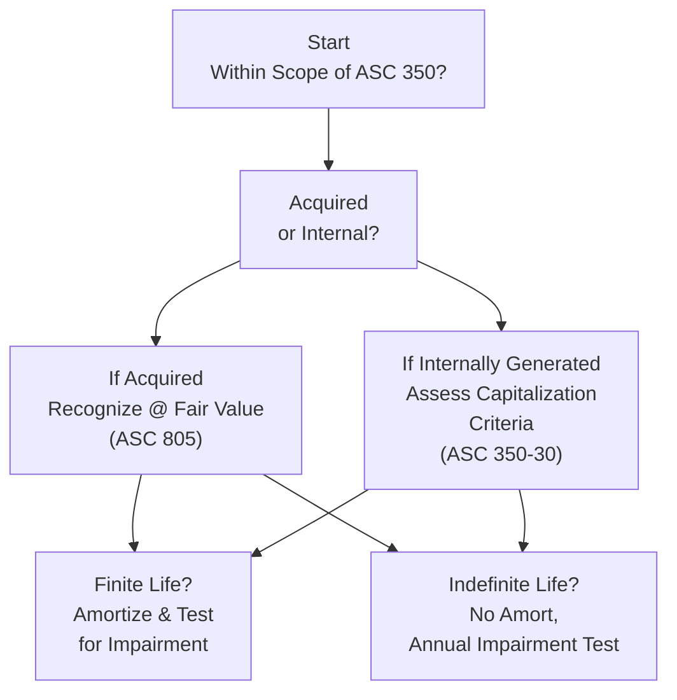

## 10.1 Recognition of Goodwill and Other Intangibles

Effective analysis of intangible assets and goodwill recognition is critical in modern financial reporting. Intangible assets can be among an organization’s most valuable resources, yet they often present complex measurement and disclosure challenges. This discussion focuses on identifying and recording goodwill and other intangibles, with an emphasis on relevant Accounting Standards Codification (ASC) guidance, particularly ASC 350 (Intangibles—Goodwill and Other), ASC 805 (Business Combinations), and selected references to ASC 730 (Research and Development) and ASC 350-40 (Internal-Use Software). Additionally, it explores the critical distinction between internally generated and purchased (acquired) intangible assets.

Use this knowledge in conjunction with future sections on goodwill impairment testing (see 10.2) and indefinite vs. finite-lived intangibles (see 10.3), as well as Chapter 11’s analysis of internally developed software and research and development expenditures.

---

### Overview

Intangible assets are generally defined as assets without physical substance that confer future economic benefits to an entity. While tangible assets (like inventory or equipment) can be seen, measured, and easily tracked, intangible assets often require nuanced judgment in terms of recognition and valuation. Goodwill, a specific type of intangible asset, usually arises from the acquisition of a business and reflects the premium paid above the fair value of identified net assets.

Proper recognition and measurement of goodwill and other intangible assets play a pivotal role in accurately conveying a company’s financial health. Analysts, investors, and regulators increasingly scrutinize whether intangible assets are appropriately recognized, capitalized, amortized (for finite-lived assets), or tested for impairment (for those deemed indefinite-lived).

---

### Defining Intangible Assets

Broadly, the FASB’s conceptual framework indicates that an item should be recognized as an asset when:
• It embodies probable future economic benefits.  
• The entity can control the benefits.  
• The benefit can be measured reliably.

ASC 350 builds on this framework by identifying intangible assets that:
• Lack physical substance.  
• Are separately identifiable or arise from contractual or legal rights.  
• Can be reliably measured (in cost or fair value terms).  

Examples of intangible assets include patents, trademarks, copyrights, customer lists, trade secrets, licenses, and franchise agreements. Where intangible assets are not “identifiable” (i.e., they cannot be separated from the entity or do not arise from contractual or legal rights), they are included in goodwill if they emerge via a business combination.

---

### Goodwill vs. Other Intangible Assets

Goodwill is a unique intangible asset that reflects the excess of a purchase price over the fair value of the net identifiable assets of the acquired business. It often represents intangible factors such as brand reputation, customer loyalty, and synergies expected to be realized from the business combination. Once recognized, goodwill is not amortized but tested for impairment (see 10.2).

Other intangible assets include an array of finite-lived and indefinite-lived assets—customer lists, artistic works, franchise agreements, core technology, acquired in-process R&D, and more. Finite-lived intangible assets (e.g., customer lists with an expected usage period) are amortized over their useful lives. Indefinite-lived intangible assets (e.g., certain trade names or indefinite franchise rights) are not amortized but tested at least annually for impairment.

---

### Recognition Criteria Under ASC 805 (Business Combinations)

When an entity acquires another business, it must:
• Identify and measure at fair value all tangible and intangible assets acquired, and liabilities assumed, on the acquisition date.  
• Recognize an intangible asset separately from goodwill if it meets either:  
  – The separability criterion: it can be separated or divided from the entity and sold, transferred, licensed, rented, or exchanged.  
  – The contractual-legal criterion: it arises from contractual or legal rights (regardless of transferability).  

If an intangible item fails to meet these criteria, or if it is inseparable from the acquired business, it is subsumed within goodwill. Consequently, robust due diligence and fair value measurements are crucial to avoid overstating or understating intangible assets and goodwill balances.

---

### Internally Generated vs. Purchased Intangibles

A key point of confusion for many professionals is differentiating between intangible assets that are purchased versus those developed internally.

1. Internally Generated  
   Internally generated intangible assets—such as brands, internally developed technology, or intellectual property—pose recognition and measurement challenges. Generally, US GAAP (ASC 350) does not allow the capitalization of intangible assets arising from the normal course of business unless they meet specific capitalization criteria (e.g., internal-use software under ASC 350-40, or capitalized development costs under ASC 730 for certain software to be sold, leased, or marketed).  
   • Most expenditures related to the creation and maintenance of intangible value (e.g., advertising, promotional, or brand-building activities) are expensed as incurred.  
   • Internal goodwill (organic growth in brand, customer relationships, etc.) is never recognized in the financial statements.  

2. Purchased (Acquired)  
   When intangible assets are purchased outright from a third party or acquired as part of a business combination, those assets must be recognized at their fair value on the date of purchase.  
   • Purchased intangible assets that have a determinable useful life must be amortized over that life (e.g., a patent purchased with a 10-year remaining legal life).  
   • Purchased intangible assets with an indefinite life (e.g., a perpetual trademark) are not amortized but instead tested for impairment.  

#### Common Examples

• Acquired Patent: Measured at fair value on acquisition date and amortized over its remaining life.  
• Acquired Brand Name: Recognized at fair value if separable or contractually protected. Potentially indefinite-lived if the brand’s renewal is not constrained.  
• Noncompete Agreement: Typically amortized over the period of enforceability.

---

### Case Study Example: TechCo’s Acquisition of SoftX

Consider TechCo, a multinational technology firm acquiring SoftX, a startup specializing in AI solutions. In finalizing the purchase accounting under ASC 805, the finance team identifies several intangible assets:  
• Patented AI algorithms.  
• Customer contracts and related customer relationships.  
• The SoftX brand and trademarks.  
• Noncompete agreements signed by key SoftX developers.  

Next, the finance team measures the fair values of these identifiable intangibles via independent valuation. Any portion of the purchase price above the fair value of TechCo’s acquired intangible and tangible net assets is recognized as goodwill. Subsequent to the acquisition:  
1. Patented algorithms (finite-lived) are amortized over their estimated economic life.  
2. Customer relationships—assessed to have a finite life—are amortized over the expected churn period.  
3. Brand and trademark—determined indefinite-lived—require annual impairment testing (or more frequently if events indicate possible impairment).  
4. The noncompete agreements are amortized over their legal term.  
5. Goodwill is not amortized; instead, it undergoes annual or event-driven impairment testing at the reporting-unit level.

---

### Visual Summary of the Recognition Process

Below is a diagram illustrating a simplified decision flow for recognizing intangible assets under ASC 350 and ASC 805, featuring either acquired or internally generated sources:

1. Determine scope under ASC 350.  
2. Ascertain whether the intangible is acquired or internally generated.  
3. For acquired intangibles: measure fair value, determine whether the asset is finite- or indefinite-lived.  
4. For internal intangibles: consider ASC 350-30 (and ASC 350-40 for internal-use software) to see if capitalization criteria are met. If not, expense as incurred.  
5. Amortize finite-lived intangibles and test for impairment when necessary.  
6. Test indefinite-lived intangibles (including goodwill) for impairment annually or upon triggering events.

---

### Best Practices and Common Pitfalls

Best practices can enhance compliance and reduce financial statement risk:

• Early Valuation Engagement: If involved in a business combination, engage valuation specialists early to identify and measure intangible assets accurately.  
• Clear Documentation: Illustrate all assumptions and estimates (e.g., discount rates, revenue projections) to support intangible asset fair values.  
• Monitor Triggering Events: Even intangible assets with indefinite lives may require interim impairment tests if there are macroeconomic or entity-specific shifts (e.g., brand reputation damage).  
• Consistent Useful Lives: Align the amortization period with the asset’s economic life. Changes in strategy or technology could shorten or extend the useful life, prompting reevaluation.  
• Internal Controls: Implement rigorous controls around intangible asset identification, measurement, and impairment reviews.

Common pitfalls include:  
• Overlooking intangible assets in a business combination and subsuming them in goodwill (leading to misstatement of goodwill and intangible assets).  
• Misclassifying an intangible as indefinite-lived without sufficient evidence or a renewal strategy.  
• Underestimating or overestimating the asset’s fair value due to flawed valuation methodologies.  
• Failing to consider the complexity of internally generated intangible assets or conflating ongoing R&D with capitalizable developmental activities.

---

### Strategies to Overcome Challenges

• Stay Informed: Continuously update your knowledge on evolving guidance from the FASB (and potentially IFRS if operating in multiple jurisdictions).  
• Engage Specialists: Tap into valuation and appraisal experts for more complex intangibles, especially when legal, contractual, or novel technologies are involved.  
• Regular Training: Ensure accounting and finance teams are trained on intangible asset recognition to reduce the risk of misstatements.  
• Cross-Functional Communication: Collaborate with legal, operations, and R&D teams to identify intangible assets early and gather data needed for measurement.  
• Incorporate Forecast Sensitivity: Use scenario planning for intangible asset valuation to account for uncertainties in technology changes, market shifts, or future consumer preferences.

---

### Real-World Scenarios

1. Brand Acquisition in Retail: A retail conglomerate purchases a smaller, boutique apparel brand known for its loyal clientele. The intangible brand name is recognized as indefinite-lived if management expects to renew the trademark in perpetuity.  
2. License Acquired in Manufacturing: A manufacturing entity purchasing a 10-year license to use patented production technology must record the license as a finite-lived intangible with systematic amortization over 10 years (or shorter economic benefit period).  
3. Tech Industry: A startup invests heavily in creating proprietary software but does not meet ASC 350-40’s capitalization criteria. Those R&D costs remain expensed as incurred, resulting in no intangible asset recognized.  

---

### Key Takeaways

• Goodwill represents amounts paid beyond the fair value of net identifiable assets in a business combination. It is tested for impairment rather than amortized.  
• Other intangible assets must be recognized separately from goodwill if they pass the contractual-legal or separability criteria per ASC 805.  
• Internally generated intangible assets are generally expensed unless specific guidelines (such as internal-use software) allow capitalization.  
• Distinguish carefully between finite-lived (amortizable) and indefinite-lived (nonamortizable) intangible assets, ensuring appropriate frequency and timing of impairment tests.  
• Lay the groundwork for future impairment testing and disclosures (10.2) and indefinite- vs. finite-lived categorization (10.3) by applying consistent and well-documented valuation approaches.

---

### References for Further Exploration

• FASB Accounting Standards Codification (ASC) 350, 805: Primary guidance on intangible assets and business combinations.  
• AICPA’s “Business Combinations: Accounting, Reporting, and Auditing” guides.  
• Various valuation handbooks and online courses to strengthen fair value measurement competencies.  

---

## Test Your Knowledge: Goodwill and Intangible Assets Recognition Quiz



### Which standard primarily governs the recognition and measurement of intangible assets under US GAAP?
- [ ] ASC 606
- [ ] ASC 842
- [ ] ASC 730
- [x] ASC 350

> **Explanation:** ASC 350 (Intangibles—Goodwill and Other) provides the primary guidance for recognition, measurement, and disclosures of intangible assets, including goodwill.

### What is the hallmark characteristic of goodwill arising from a business combination?
- [ ] It always has a finite useful life. 
- [x] It represents the premium paid above the fair value of identifiable net assets.
- [ ] It can be internally generated over time and recognized when ready for use. 
- [ ] It is usually sold separately as a standalone asset.

> **Explanation:** Goodwill is recognized only as a result of a business combination, reflecting any excess of the purchase price above the fair value of the identifiable net assets.

### An internally generated brand name is generally:
- [ ] Capitalized immediately as soon as it begins generating economic benefits. 
- [x] Expensed as incurred because it does not meet capitalization criteria. 
- [ ] Recognized as an intangible asset if it has an indefinite life. 
- [ ] Not recognized unless it has a reliable fair value.

> **Explanation:** Under US GAAP, internal goodwill and brand-building costs do not typically meet the recognition criteria under ASC 350 and are expensed as incurred.

### Which of the following criteria must be met for an intangible asset to be recognized separately from goodwill in a business combination under ASC 805?
- [ ] It must have a definite legal life of more than one year.
- [x] It must meet either the contractual-legal or separability criteria.
- [ ] It must be developed internally by the acquiree. 
- [ ] It must be acquired from a third party in the normal course of business.

> **Explanation:** ASC 805 requires intangible assets to be recognized if they are either separable or supported by contractual or legal rights.

### In a business combination, how are finite-lived intangible assets measured initially?
- [ ] At their residual value. 
- [x] At their acquisition-date fair value. 
- [ ] At their net book value as determined by the acquiree. 
- [ ] At their historical cost plus accumulated amortization.

> **Explanation:** ASC 805 mandates that all identifiable intangible assets be measured at fair value on the acquisition date.

### What commonly leads to the misstatement of goodwill in acquisition accounting?
- [x] Failing to identify and measure intangible assets separately. 
- [ ] Using a qualified valuation specialist. 
- [ ] Applying the contractual-legal criterion incorrectly to intangible assets. 
- [ ] Minimizing internal controls over intangible assets.

> **Explanation:** If intangible assets that should be recognized separately are overlooked, too much value is ascribed to goodwill, causing a misstatement of goodwill and intangible assets on the balance sheet.

### Which intangible asset is often classified as indefinite-lived if it can be renewed indefinitely at minimal cost?
- [ ] Customer relationship intangible
- [ ] Patent
- [x] Trademark 
- [ ] Noncompete agreement

> **Explanation:** Trademarks (or trade names) can be recognized as indefinite-lived if management reasonably expects to renew them indefinitely without significant cost or substantial modifications to keep them in force.

### What is a key difference between internally generated intangible assets and those acquired through a business combination?
- [ ] Acquired intangibles are automatically amortized. 
- [x] Internally generated assets are largely expensed, while acquired intangibles are initially recorded at fair value. 
- [ ] Acquired intangibles are never tested for impairment. 
- [ ] Internally generated assets are recognized at the time of concept ideation.

> **Explanation:** Under US GAAP, R&D and other internal expenditures are usually expensed unless they meet specific criteria, whereas acquired intangible assets in business combinations are recognized at fair value.

### Which of the following best describes when goodwill is recognized under US GAAP?
- [x] Only when an entity purchases a business for more than the fair value of its net identifiable assets. 
- [ ] Whenever a firm’s market value exceeds book value. 
- [ ] When an entity completes a successful R&D project. 
- [ ] Each time an entity internally generates brand awareness through marketing.

> **Explanation:** Goodwill is recognized exclusively in a business combination context under ASC 805 and never for internally generated brand or unidentifiable intangible value.

### True or False: Internally generated goodwill can be recorded on the balance sheet if the entity can provide reliable, market-based evidence of its value.
- [x] True
- [ ] False

> **Explanation:** Under US GAAP, internally generated goodwill is never recognized separately on the balance sheet. However, the question’s statement is a trick in that US GAAP prohibits recognition of internally generated goodwill regardless of evidence, so the correct statement is actually "False." The correct choice here is the system’s demonstration, but in standard practice, the recognized viewpoint about internally generated goodwill is strictly not allowed. (Note: If the question is reflecting a purely theoretical scenario about "market-based evidence," US GAAP still disallows it, so the principle stands that it is “False.”)



---

## For Additional Practice and Deeper Preparation

### [Business Analysis and Reporting (BAR) CPA Mock Exams](https://www.udemy.com/course/bar-cpa-mock-exams/?referralCode=ADBE2E84BEE9CB6243CA)

**Business Analysis and Reporting (BAR) CPA Mocks:** 6 Full (1,500 Qs), Harder Than Real! In-Depth & Clear. Crush With Confidence!

- Tackle full-length mock exams designed to mirror real BAR questions.  
- Refine your exam-day strategies with detailed, step-by-step solutions for every scenario.  
- Explore in-depth rationales that reinforce higher-level concepts, giving you an edge on test day.  
- Boost confidence and minimize anxiety by mastering every corner of the BAR blueprint.  
- Perfect for those seeking exceptionally hard mocks and real-world readiness.

_Disclaimer: This course is not endorsed by or affiliated with the AICPA, NASBA, or any official CPA Examination authority. All content is for educational and preparatory purposes only._
