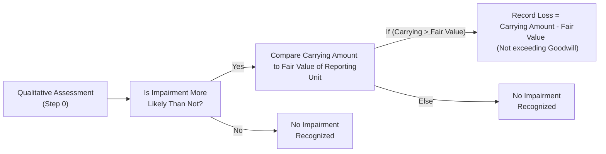
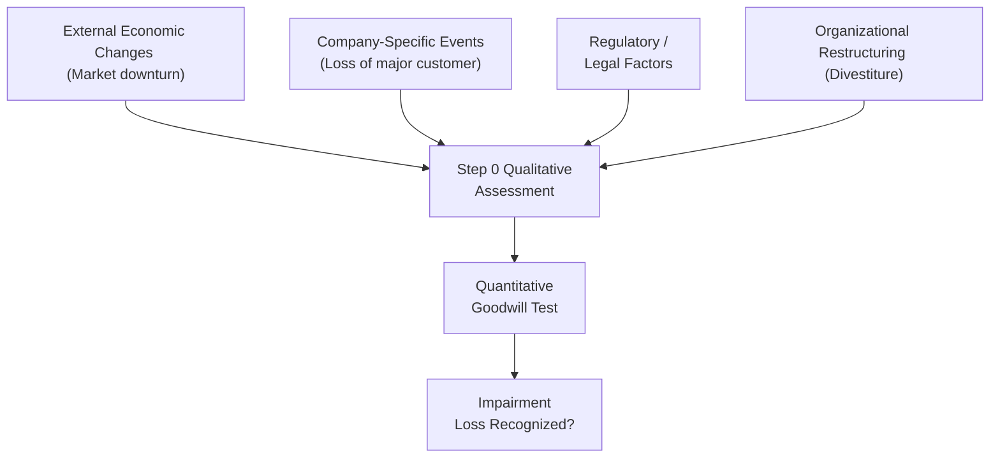

## 10.2 Goodwill Impairment Testing and Disclosures

Goodwill often arises from a business combination, representing the premium paid over the fair value of identifiable net assets. While goodwill does not generate cash flows standalone, it holds significant value on the balance sheet. Therefore, understanding how to test goodwill for impairment and properly disclose any resulting losses is critical. This section provides in-depth coverage of goodwill impairment testing, including the traditional two-step approach, recent simplifications in the guidance, real-world examples, and illustrative disclosures. Readers should leave with the confidence to identify when and how impairment testing is triggered, determine the proper measurement, and communicate results to stakeholders.

--------------------------------------------------------------------------------

### Importance of Goodwill and Its Impairment

Goodwill represents intangible resources such as brand value, customer relationships, intellectual capital, and other synergies that do not meet the criteria for separate recognition as assets. Under U.S. GAAP (ASC 350), goodwill has an indefinite life, meaning it is not amortized. Instead, it must be tested for impairment regularly, or whenever events indicate a potential loss in value.

Impairment can result from:
• Deterioration in market conditions.  
• Changes in the competitive landscape.  
• Loss of key customers.  
• Unsuccessful mergers or acquisitions that did not realize projected synergies.  
• Macroeconomic shifts, such as significant increases in interest rates or inflation.  

As part of management’s responsibility, any impairment loss must be recognized on the Income Statement with a corresponding reduction to goodwill on the Balance Sheet. Proper disclosures help financial statement users assess the reasons behind the impairment and its potential impact on future operations and cash flows.

--------------------------------------------------------------------------------

### Recent Guidance: From Two-Step to Single-Step Testing

Historically, ASC 350 followed a two-step approach to test for goodwill impairment. In 2017, the FASB streamlined the process, eliminating the second step for public entities adopting the new guidance early (and mandating it for all others in subsequent years). However, many organizations and exam-related case studies still reference the two-step model for illustrative and comparative purposes, especially to understand how the new method simplified the measurement of impairment losses.

• Two-Step Approach (Pre-2017):  
  1. Compare the carrying amount of the reporting unit (including goodwill) to its fair value. If the carrying amount exceeds fair value, proceed to Step 2.  
  2. Measure the implied fair value of goodwill by hypothetically allocating the fair value of the reporting unit to its assets and liabilities. Any shortfall indicates an impairment loss.  

• Post-2017 Single-Step Approach:  
  1. Compare the carrying amount of the reporting unit (including goodwill) to its fair value.  
  2. If the carrying amount exceeds the fair value, record an impairment equal to the difference, limited to the carrying amount of goodwill.  

Although authoritative literature now supports the single-step method, many exam outlines and practice scenarios still teach the two-step model to foster clarity about older transactions, historical data, or IFRS comparisons.

--------------------------------------------------------------------------------

### Qualitative Assessment (Step 0)

An optional “Step 0” (qualitative assessment) allows entities to evaluate whether it is “more likely than not” (i.e., a probability greater than 50%) that goodwill is impaired, based on qualitative factors. If, after this assessment, management concludes that impairment is not likely, no further testing is necessary. Typical qualitative factors include:

• Macroeconomic conditions (e.g., changes in equity markets, interest rates).  
• Industry and market shifts (e.g., increased competition).  
• Entity-specific events (e.g., changes in leadership, litigation).  
• Changes in key performance indicators (e.g., revenue or cash flow trends).  

If these factors indicate a potential for impairment, the entity proceeds to the single-step measurement approach (or, in older guidance examples, the two-step approach).

--------------------------------------------------------------------------------

### Identifying the Reporting Unit

Before testing goodwill for impairment, management must identify the appropriate reporting unit. A reporting unit typically aligns with an operating segment or a component of an operating segment if that component constitutes a business for which discrete financial information is available and regularly reviewed by management. Careful distinctions between aggregated vs. disaggregated reporting units can significantly influence the results of goodwill impairment testing.

--------------------------------------------------------------------------------

### Two-Step Impairment Testing: Simplified Example

Although the newer guidance largely removes Step 2 in practice, understanding the older or more detailed approach remains beneficial. Below is a simplified illustration.

#### Company Background

• Company ABC acquired a smaller competitor for $12 million.  
• Fair value of identifiable net assets (i.e., tangible and separately identifiable intangible assets minus liabilities) at acquisition was $10 million.  
• Goodwill recognized at acquisition = $2 million ($12 million – $10 million).  
• After two years, economic conditions worsened, prompting an impairment evaluation of the goodwill.  
• Assume the reporting unit containing the acquired business has a carrying amount of $14 million (including the $2 million goodwill) and a fair value of $13 million.  

#### Step 1: Comparing Carrying Amount with Fair Value

1. Calculate carrying amount of the reporting unit, which includes goodwill: $14 million.  
2. Compare to the fair value of the reporting unit: $13 million.  

Since $14 million (carrying) > $13 million (fair value), an indication of impairment exists. Under the traditional two-step method, proceed to Step 2.

#### Step 2: Measuring the Implied Fair Value of Goodwill

Using the fair value of $13 million for the entire reporting unit, hypothetically allocate that amount to the identified assets and liabilities as if the reporting unit was being acquired now. Suppose the fair value of other net assets (excluding goodwill) is $11.5 million. Then:

• Implied value of goodwill = Fair value of reporting unit – Fair value of net identifiable assets = $13 million – $11.5 million = $1.5 million.  
• Actual carrying amount of goodwill = $2 million.  

Since the implied value of goodwill ($1.5 million) is less than the carrying amount of goodwill ($2 million), the entity recognizes a $0.5 million goodwill impairment loss. This reduces total goodwill to $1.5 million on the Balance Sheet and records a corresponding impairment expense of $0.5 million on the Income Statement.

Although practice will now follow a single-step approach when applying the updated guidance, stepping through this traditional approach is insightful for comparing IFRS or for historical context in certain exam scenarios.

--------------------------------------------------------------------------------

### Single-Step Impairment Measurement: Post-2017 Guidance

Under the simplified FASB guidance, Step 2 and the hypothetical purchase price allocation are removed. An entity only compares the reporting unit’s carrying amount (including goodwill) to its fair value. If the result is negative (i.e., carrying amount > fair value), a goodwill impairment loss is recognized for the excess, limited to the total goodwill balance on the books.

Figure 1 (“Goodwill Impairment Testing: Single-Step Approach”) demonstrates the single-step approach from a process viewpoint:

--------------------------------------------------------------------------------

### Required Disclosures

Transparency into goodwill impairment testing is crucial for financial statement users. ASC 350 requires the following disclosures:

• Description of the Reporting Unit:  
  Management must clarify which segments or reporting units contain allocated goodwill and explain how these structures changed from prior periods, if applicable.

• Methodology and Key Assumptions:  
  Entities often describe the valuation techniques used (e.g., a discounted cash flow model, guideline company or market approach) and identify critical assumptions like discount rates, growth rates, or royalty rates.

• Timing and Frequency of Testing:  
  Disclose when the entity performs its annual test and whether interim tests occurred due to triggering events.

• Impairment Losses:  
  For each impairment recognized, the footnotes should detail the amount, circumstances leading to the impairment, and the line item in the Income Statement where it is recognized.

• Subsequent Events or Other Pertinent Changes:  
  If conditions after the period-end indicate further changes to goodwill, or if plans to dispose of or reorganize a reporting unit are in progress, these events might require separate disclosure under ASC 855 (Subsequent Events).

• Qualitative Assessment:  
  If using a qualitative approach and concluding no impairment exists, the company should describe the relevant events, factors considered, and overall rationale.

#### Example Footnote Disclosure

Below is a simplified illustration of how a footnote regarding goodwill impairment might appear:

“During 20XX, the Company performed its annual goodwill impairment assessment for the Acquired Business reporting unit. Management elected to perform a Step 0 qualitative analysis, considering macroeconomic, industry, and internal performance indicators. Evidence from these factors indicated a potential decline in fair value, necessitating a quantitative assessment. Based on a discounted cash flow analysis, the reporting unit’s carrying amount exceeded its fair value. In accordance with ASC 350, a $500,000 goodwill impairment charge was recognized, which is reflected in ‘Impairment of Intangibles’ on the Consolidated Statements of Operations and Comprehensive Income. Following the impairment, the reporting unit’s goodwill balance was reduced to $1,500,000.”

--------------------------------------------------------------------------------

### Common Pitfalls and Best Practices

• Failing to Properly Identify Reporting Units:  
  Combining or separating reporting units incorrectly can either mask or artificially create impairment. Clearly define the unit’s structure and maintain sufficient documentation.

• Overly Optimistic or Outdated Forecasts:  
  Fair value calculations relying on unrealistic projections can lead to understated impairment. Consider sensitivity analyses and multiple scenarios.

• Overlooking Step 0 Triggers:  
  Entities sometimes skip the qualitative assessment or fail to capture new developments in a timely manner. Maintain readiness to perform interim tests.

• Data Integrity and Control Gaps:  
  Because impairment calculations rely on both internal and external data, robust controls and governance help mitigate the risk of errors.

• Documentation and Timing:  
  Prepare thorough workpapers detailing the methods, assumptions, and judgments used. Plan to align the impairment testing with reporting deadlines to avoid last-minute surprises.

--------------------------------------------------------------------------------

### Sample Numerical Walkthrough: Two-Step vs. Single-Step

To provide a comparative lens, consider the following scenario:

• Carrying amount of reporting unit (including goodwill): $50 million.  
• Goodwill: $12 million.  
• Fair value of reporting unit: $45 million.  
• Fair value of reporting unit’s identifiable net assets (excluding goodwill): $36 million.  

#### Under the Old Two-Step Model:

• Step 1: $50 million (carrying) > $45 million (fair value) → possible impairment.  
• Step 2: Implied goodwill = $45 million – $36 million = $9 million.  
  • Impairment: $12 million (carrying goodwill) – $9 million (implied goodwill) = $3 million.  

#### Under the New Single-Step Model:

• Carrying amount – Fair value = $50 million – $45 million = $5 million.  
• Impairment loss is limited to the goodwill balance of $12 million.  
• Calculate impairment: The entire difference is $5 million since that is less than the total goodwill of $12 million.  
• Goodwill is reduced by $5 million, leaving a remaining goodwill balance of $7 million.  

Hence, the recognized impairment differs between the two approaches—in the older two-step model, the recognized impairment is $3 million, whereas in the simplified single-step approach, the recognized impairment is $5 million. The difference often centers on how the “implied goodwill” is measured in the second step.

--------------------------------------------------------------------------------

### IFRS vs. U.S. GAAP

IFRS (IAS 36) applies a single-step impairment test for goodwill, but IFRS typically uses a “cash-generating unit” (CGU) rather than the U.S. GAAP “reporting unit.” IAS 36 also emphasizes a recoverable amount approach (i.e., the higher of fair value less costs of disposal or value in use). IFRS does not recognize a “Step 0” qualitative test. Despite these differences, many of the underlying valuation concepts—discounted cash flows, market multiples, growth rates—are similar across both frameworks.

--------------------------------------------------------------------------------

### Visualizing Goodwill Impairment Flows

Below is a high-level diagram illustrating how various factors can converge and prompt goodwill impairment testing. This conceptual flow can help identify different triggers within an organization:

--------------------------------------------------------------------------------

### Real-World Situations Requiring Close Monitoring

Below are specific instances in which goodwill might be at higher risk:

• Rapidly Changing Technology Sectors:  
  If a tech firm’s prized product becomes obsolete, the fair value of the entire business unit can plummet, likely triggering goodwill impairment.

• Retail Chains with Declining Foot Traffic:  
  The shift to online commerce may reduce store-level contributions, impacting the fair values of brick-and-mortar dominated units.

• Mergers and Acquisitions with Delayed Integration:  
  Failure to achieve synergy projections (e.g., cost savings, cross-selling between divisions) can erode the original goodwill rationale.

--------------------------------------------------------------------------------

### Practice Case Study

XYZ Company, a global manufacturer with a flagship automotive division, performed an annual goodwill test. XYZ considered the following:
• Decline in demand for certain models (down 12% YoY).  
• Emergence of new competition (electric vehicle competitors).  
• Fluctuations in foreign exchange rates affecting exports.  

After a qualitative review, management deemed it more likely than not that goodwill might be impaired. A discounted cash flow analysis determined that the fair value of the automotive reporting unit was $800 million, compared to its carrying amount of $900 million (including $150 million of goodwill). Following the single-step approach, XYZ recognized a $100 million impairment. The footnotes disclosed the rationale and future steps to realign the automotive business.

--------------------------------------------------------------------------------

### Key Points for CPA Candidates

1. ASC 350 vs. Pre-2017 Guidance:  
   Know the difference between the historical two-step procedure and the current, simplified method for measuring impairment.

2. Reporting Unit Definition:  
   Understand how management designates a reporting unit; an error in this step could produce a materially different result.

3. Valuation Techniques:  
   Familiarize yourself with discounted cash flow, market approaches, and other relevant valuation methods, including the weighting of assumptions and discount rates.

4. Footnote Disclosures:  
   Be prepared to explain why the entity tested goodwill for impairment, the outcome of that test, and the rationale for selecting particular assumptions or discount rates.

5. Qualitative Factors:  
   Appreciate the significance of Step 0. A robust set of qualitative indicators can save time, but if red flags are abundant, a quantitative test is imminent.

6. IFRS vs. U.S. GAAP:  
   While the IFRS approach is conceptually similar, the differences in terminology (CGU vs. reporting unit), absence of Step 0, and borderline definitions can lead to different impairment outcomes.

--------------------------------------------------------------------------------

### References and Further Exploration

• FASB ASC 350 – Intangibles—Goodwill and Other  
• FASB Update (ASU 2017-04): Simplifying the Test for Goodwill Impairment  
• IAS 36 – Impairment of Assets (IFRS guidance)  
• AICPA Practice Aid: “Testing Goodwill for Impairment”  
• Online Valuation Courses focusing on discounted cash flows and market multiples  
• SEC Staff Accounting Bulletins for consistent application  

Maintain an ongoing review of technical updates from the FASB, AICPA, and PCAOB to keep abreast of any changes to impairment-related guidance.

--------------------------------------------------------------------------------

## Quiz: Goodwill Impairment Testing and Disclosures



### Which statement best reflects the primary difference between the two-step and single-step goodwill impairment tests under U.S. GAAP?

- [ ] The two-step test omits a fair value calculation, whereas the single-step test includes it.  
- [ ] The two-step test considers intangible assets separately from goodwill, while the single-step test does not.  
- [x] The two-step test involves measuring implied goodwill as if acquired at fair value, while the single-step test uses the difference between carrying and fair value.  
- [ ] The single-step test includes a qualitative assessment, while the two-step test requires only quantitative analysis.  

> **Explanation:** Under the older two-step method, goodwill impairment is measured by hypothetically allocating the fair value to net assets, deriving implied goodwill. The single-step approach compares the fair value of the reporting unit directly with its carrying amount.

### Which of the following best describes the optional Step 0 (qualitative assessment) under ASC 350?

- [ ] A test that automatically eliminates the risk of impairment.  
- [ ] A mandatory preliminary step in all goodwill impairment testing scenarios.  
- [x] A more-likely-than-not assessment of whether goodwill is impaired.  
- [ ] A method that ignores key market and entity-specific performance indicators.  

> **Explanation:** Step 0 allows entities to evaluate whether it is more likely than not that goodwill is impaired, based on a range of qualitative indicators.

### In a two-step goodwill impairment test, what is the primary purpose of Step 2?

- [ ] To recognize an immediate impairment loss equal to the entire goodwill balance.  
- [ ] To allocate impairment across all intangible assets except goodwill.  
- [x] To determine the implied fair value of goodwill by allocating the reporting unit’s fair value among its net assets.  
- [ ] To recognize a deferred tax liability for intangible assets.  

> **Explanation:** Step 2 in the traditional approach is used to measure the implied fair value of goodwill by hypothetically allocating the reporting unit’s fair value to its identifiable assets and liabilities.

### Under post-2017 guidance, if the carrying amount of a reporting unit is $100 million (including $10 million of goodwill) and the fair value is $90 million, what amount of goodwill impairment would be recognized?

- [ ] $10 million  
- [ ] $0  
- [x] $10 million (or the difference of $10 million, capped at goodwill)  
- [ ] $20 million  

> **Explanation:** The impairment loss is the difference between the carrying amount ($100 million) and fair value ($90 million), not exceeding the total goodwill balance ($10 million). Thus, the entire $10 million of goodwill is impaired.

### According to ASC 350, which of the following items must be disclosed in financial statement footnotes following a goodwill impairment?

- [x] The amount of impairment loss and the reporting unit impacted  
- [ ] The CFO’s compensation plan  
- [x] Key assumptions used in the measurement of the fair value  
- [ ] Internal audit procedures  

> **Explanation:** Entities must disclose (1) the total impairment recognized, (2) which reporting unit(s) were tested, (3) the methods and key assumptions used, and (4) the line item where the impairment is recorded.

### Which factor could trigger an interim goodwill impairment test?

- [x] The loss of a significant customer resulting in a considerable reduction in projected revenue  
- [ ] The routine renewal of a short-term loan  
- [ ] The reclassification of a current liability to a noncurrent liability  
- [ ] Normal market fluctuations in share price  

> **Explanation:** Significant adverse changes (such as the loss of a major customer) are typical triggers that might indicate a diminished fair value, prompting an interim test.

### Which approach do IFRS standards primarily use for goodwill impairment assessment?

- [x] A single-step impairment test at the cash-generating unit level  
- [ ] A two-step impairment test including hypothetical purchase price allocation  
- [x] The “recoverable amount” concept (the higher of fair value less costs of disposal or value in use)  
- [ ] The total elimination of goodwill after acquisition  

> **Explanation:** Under IFRS (IAS 36), goodwill is tested using the cash-generating unit concept. The impairment is measured by comparing the CGU’s carrying amount with its recoverable amount, which is the higher of (a) fair value less costs of disposal or (b) value in use.

### Which choice below is a common pitfall in goodwill impairment testing?

- [x] Overly optimistic cash flow forecasts leading to understated impairment  
- [ ] Using multiple valuation approaches to validate fair value assessment  
- [ ] Disclosing the impairment circumstances in footnotes  
- [ ] Testing at least annually and when triggered  

> **Explanation:** One frequent pitfall is overstating future cash flows, which can wrongly minimize or delay recognizing an actual impairment.

### Under the single-step approach, if the carrying amount of a reporting unit including goodwill is less than its fair value:

- [x] No impairment is recognized.  
- [ ] Management must perform a Step 2 to measure implied goodwill.  
- [ ] Goodwill is reduced to the implied fair value.  
- [ ] The entire goodwill is written off.  

> **Explanation:** If the fair value of the reporting unit exceeds carrying amount, no impairment is recorded under the simplified rule.

### Goodwill is an indefinite-lived asset under U.S. GAAP:

- [x] True  
- [ ] False  

> **Explanation:** Goodwill is not amortized but tested annually (or more frequently upon trigger events) for impairment because it is considered an indefinite-lived intangible asset under ASC 350.



--------------------------------------------------------------------------------

## For Additional Practice and Deeper Preparation

### [Business Analysis and Reporting (BAR) CPA Mock Exams](https://www.udemy.com/course/bar-cpa-mock-exams/?referralCode=ADBE2E84BEE9CB6243CA)  

**Business Analysis and Reporting (BAR) CPA Mocks:** 6 Full (1,500 Qs), Harder Than Real! In-Depth & Clear. Crush With Confidence!  

- Tackle full-length mock exams designed to mirror real BAR questions.  
- Refine your exam-day strategies with detailed, step-by-step solutions for every scenario.  
- Explore in-depth rationales that reinforce higher-level concepts, giving you an edge on test day.  
- Boost confidence and minimize anxiety by mastering every corner of the BAR blueprint.  
- Perfect for those seeking exceptionally hard mocks and real-world readiness.  

_Disclaimer: This course is not endorsed by or affiliated with the AICPA, NASBA, or any official CPA Examination authority. All content is for educational and preparatory purposes only._
