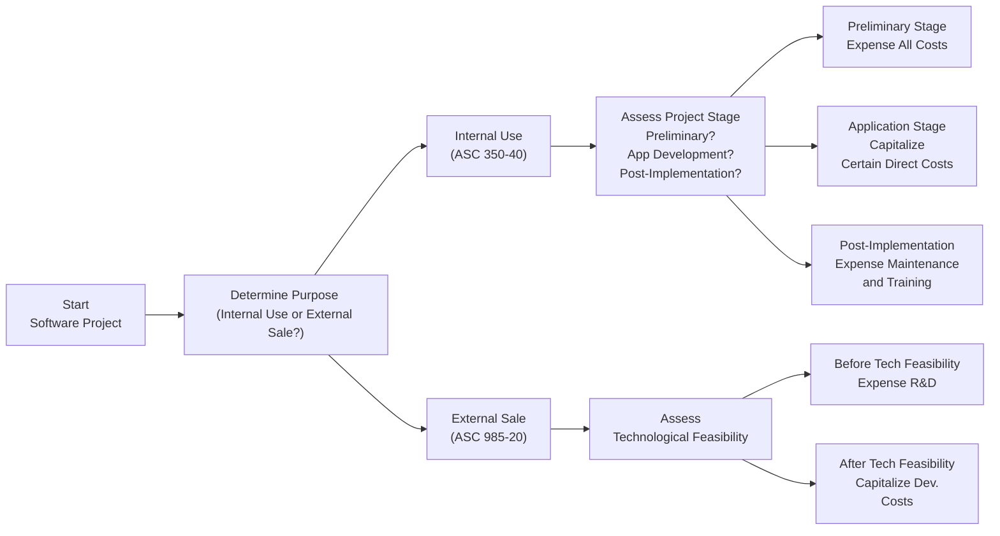

## 11.1 Capitalization Rules: Internal-Use vs. External Sale

Software development is among the most critical tasks organizations undertake. Whether software is expected to be used internally or marketed to external customers significantly affects the accounting treatment of costs incurred. In this section, we examine the capitalizable vs. non-capitalizable phases of software development, referencing U.S. GAAP guidance—principally ASC 350-40 (Internal-Use Software) and ASC 985-20 (Software to Be Sold, Leased, or Marketed). We will also provide vignettes demonstrating both correct and incorrect application of these rules, highlight best practices, and explore common pitfalls that arise when distinguishing between internal-use and externally marketed software.

--------------------------------------------------------------------------------
  
### Overview and Key Distinctions

The primary difference between internal-use software and software intended for external sale rests with the project’s purpose:

• **Internal-Use Software:** Developed solely to meet the entity’s internal operational needs. Costs capitalize under ASC 350-40 once certain milestones—particularly entering the application development stage—are met.

• **Software for External Sale:** Created with the intention of selling or leasing to external customers, subject to capitalization after “technological feasibility” is established under ASC 985-20.

Such distinctions can become blurred if an organization develops software initially for internal use and later decides to license it to third parties. Careful analysis is needed to determine the correct point in time, and under which guidance, capitalization should begin (or transfer from one guidance standard to another).

--------------------------------------------------------------------------------

### Accounting Guidance: Internal-Use Software (ASC 350-40)

GAAP for internally developed software follows three primary phases:

1. **Preliminary Project Stage (Planning/Feasibility):**  
   - Costs such as evaluating alternatives, conceptual formulation, or vendor selection are typically expensed as incurred.  
   - No capitalization is allowed because the software’s functionality and feasibility are not yet confirmed.

2. **Application Development Stage:**  
   - Once the organization decides to move forward and begins designing, coding, installing (or customizing off-the-shelf) software, many costs are capitalized.  
   - Capitalizable items may include direct costs of materials and services (e.g., third-party programmer fees, software licenses), payroll costs for employees directly involved in coding/testing, and interest costs on significant borrowings.  
   - General and administrative costs (not directly related to the project) remain expensed.

3. **Post-Implementation (Operation) Stage:**  
   - Any training, data conversion, and routine maintenance costs after the software is substantially complete are expensed.  
   - Upgrades or enhancements that result in additional functionality may also be capitalized if they meet certain criteria, but bug fixes or routine maintenance remain expensed.

#### Amortization and Subsequent Measurement  

For internal-use software, once the application is placed in service, the capitalized costs are typically amortized over the software’s useful life using a method that reflects the pattern of benefits (commonly straight-line).

--------------------------------------------------------------------------------

### Accounting Guidance: Software for External Sale (ASC 985-20)

When developing software intended for sale, lease, or marketing to external customers, the key milestone is **technological feasibility**. Under ASC 985-20:

1. **Expenses Before Technological Feasibility:**  
   - All costs incurred to establish the idea, design, and initial feasibility (research stage) are expensed.  
   - This treatment parallels R&D for intangible assets: If there is still doubt that the software can perform as intended, costs remain in the expense category.

2. **Capitalization After Technological Feasibility:**  
   - Once the software has reached technological feasibility—no significant risks or uncertainties remain regarding successful commercialization—subsequent coding, testing, and related costs are capitalized.  
   - Technological feasibility typically aligns with the completion of a working model or detailed program design that satisfies the specified requirements.

3. **Released Product Phase:**  
   - Once available for general release, additional ongoing costs (e.g., routine updates, marketing) are usually expensed.  
   - Major enhancements that extend or significantly improve the function may be capitalized if they meet feasibility criteria separately.

4. **Amortization Approach:**  
   - Capitalized software costs for external sale are amortized based on the ratio of current revenue to total anticipated revenue (the “revenue method”) or on a straight-line basis over the product’s estimated life, whichever results in the higher amortization expense for the period.

--------------------------------------------------------------------------------

### Vignettes: Illustrating Correct vs. Incorrect Capitalization

1. **Correct Capitalization – Internal Use**  
   - Company A designs a new internal CRM system. During the preliminary project stage, they spend USD 20,000 on consultant fees to evaluate software solutions and vendor options. These are expensed.  
   - After deciding to develop in-house, Company A hires programmers (employees) to code and test. The salaries of these programmers total USD 50,000. Because they are directly involved in application development, these salaries from the application stage are capitalized.  
   - Following “go-live,” the organization spends USD 5,000 training employees to use the new CRM. These costs are expensed.

2. **Incorrect Capitalization – Internal Use**  
   - Company B immediately capitalizes vendor selection costs and initial feasibility analysis for an HR payroll system upgrade, treating them as application development costs. This is incorrect; feasibility-stage costs should be expensed.  
   - They also continue capitalizing routine maintenance fees post-implementation. This is incorrect; routine maintenance costs must be expensed.

3. **Correct Capitalization – External Sale**  
   - Company C builds a smartphone application for sale to the public. They record all initial design and feasibility study costs as R&D expense.  
   - Upon completing a working prototype that meets specified performance criteria (technological feasibility), they begin capitalizing subsequent development costs for additional features and refinements before launch.  
   - Once the app launches, all post-launch bug fixes and minor updates are again expensed unless they add new, substantial functionality.

4. **Incorrect Capitalization – External Sale**  
   - Company D capitalizes all software costs prematurely, assuming immediate feasibility from the project’s inception. However, they have no functional prototype or proven technology to justify the feasibility milestone. In a future audit, the initial R&D costs are reclassified to expense.

--------------------------------------------------------------------------------

### Practical Diagram: Internal vs. External Capitalization Flow

Below is a flowchart to visualize the key decision points when determining how and when to capitalize software development costs:

--------------------------------------------------------------------------------

### Best Practices and Common Pitfalls

• **Maintain Detailed Project Documentation:**  
  - Maintain precise time records that differentiate preliminary activity from application development.  
  - Track the milestone date of technological feasibility for external software, or the shift from feasibility to development for internal use.

• **Identify Mixed-Use Scenarios Early:**  
  - If software initially developed for internal purposes is later sold to external customers, or vice versa, the transition requires careful accounting. Converting from ASC 350-40 to ASC 985-20 (or reversing) can be challenging; ensure you fully document the date of change in intention.

• **Assess Upgrades vs. Maintenance:**  
  - Enhancements that add genuinely new features or functionality may qualify for capitalization. Pure maintenance or bug fixes fall under operating expenses.

• **Perform Frequent Impairment Assessments:**  
  - Software may become obsolete quickly. Monitor sales forecasts or usage patterns to ensure the carrying amount remains recoverable.

• **Collaborate with IT Teams:**  
  - Software development is highly technical. Accounting and IT teams should collaborate to pinpoint the correct classification and the relevant milestones.

--------------------------------------------------------------------------------

### Short Case Example: Mixed-Use Software

Imagine a retail chain, RetailTech Inc., that develops a point-of-sale (POS) software for in-house operations. Initially accounted for as internal-use software under ASC 350-40, the POS application is capitalized after the feasibility phase. Eighteen months later, RetailTech sees market demand for the software. They start customizing the system for external sale. At this juncture, new development aimed at external licensing should follow ASC 985-20, capitalizing costs only after the software’s external feasibility is proven. Costs incurred before that pivot remain under ASC 350-40. Properly documenting the timeline of decision changes is essential to avoid misstatements.

--------------------------------------------------------------------------------

### Real-World Applications

• **FinTech Startups:** Commonly develop advanced software primarily for external sale. Periodic “beta versions” might house partial functionality. The concept of “beta launch” could coincide with a form of technological feasibility, but a thorough analysis—outlined in the project documentation—is required before capitalizing costs.

• **Healthcare Systems:** Often build or expand patient information portals for internal records while simultaneously seeking to commercialize these portals for other providers. Timely reclassification is crucial when shifting from internal to external orientation.

• **Manufacturing Firms:** Develop cost-accounting modules for internal use, discovering new markets among suppliers. The layered approach to capitalization means a portion of costs might remain under internal use guidance while new features or modifications shift under external sale guidelines.

--------------------------------------------------------------------------------

### References for Further Exploration

• **FASB ASC 350-40:** Internal-Use Software  
• **FASB ASC 985-20:** Software to Be Sold, Leased, or Marketed  
• **Chapter 11.2** of this text: Differentiating Research from Development and Technological Feasibility.  
• **IAS 38 (IFRS):** If international standards apply, intangible assets guidance may have slightly different recognition thresholds.  
• **Chapter 12.1** of this text: Understanding related revenue recognition issues for software licenses and SaaS.  

--------------------------------------------------------------------------------

## Test Your Knowledge: Capitalization of Internal-Use vs. External Sale Software



### When should costs for internal-use software generally be capitalized under ASC 350-40?

- [ ] During the preliminary project stage when evaluating different software vendors.
- [x] In the application development stage after management authorizes the project and feasibility is confirmed. 
- [ ] Immediately after software is placed into service. 
- [ ] Only after post-implementation training begins.

> **Explanation:** Under ASC 350-40, internal-use software costs are capitalized when the project is in the application development stage—i.e., coding, testing, and direct production activities—once preliminary feasibility has been established.

### What is the key milestone for capitalization when developing software for sale to external customers?

- [ ] The date developers start coding. 
- [ ] The time the project budget is approved by the board. 
- [x] The point at which technological feasibility is established. 
- [ ] After the first customer license agreement is signed.

> **Explanation:** ASC 985-20 specifies that external software costs are capitalized once technological feasibility—a working model or substantially complete design—is achieved.

### Which of the following is capitalized for internal-use software according to U.S. GAAP?

- [x] Compensation for employees directly engaged in coding during application development. 
- [ ] Routine maintenance costs after “go-live.” 
- [ ] Vendor selection expenses in the preliminary stage. 
- [ ] Training costs for end-users in the post-implementation stage.

> **Explanation:** Under internal-use guidelines, only direct coding and testing costs during the application development phase are eligible for capitalization. Maintenance, training, and vendor evaluation remain expensed.

### Under ASC 985-20, how are software costs before technological feasibility established treated?

- [ ] Always capitalized under R&D asset classification. 
- [x] Expensed as research and development. 
- [ ] Deferred until product launch. 
- [ ] Taken straight to intangible assets on the balance sheet.

> **Explanation:** ASC 985-20 requires all software costs before the establishment of technological feasibility to be treated as R&D expense.

### Which scenario best illustrates a proper application of software capitalization rules?

- [x] A company capitalizes direct coding costs after technological feasibility for externally sold software but expenses bug fixes post-launch. 
- [ ] A company expenses all software-related costs regardless of project stage. 
- [x] A company expenses preliminary costs but capitalizes application development costs for internal-use software. 
- [ ] A company capitalizes training costs to integrate a new internal software system.

> **Explanation:** Any costs prior to feasibility (external) or prior to application development stage (internal) are expensed, while direct development costs after these points are capitalized.

### Which statement about post-implementation costs is correct?

- [x] Routine maintenance costs should be expensed as incurred. 
- [ ] Bug fixes are capitalized as additional intangible assets. 
- [ ] Employee training is capitalized if it improves system usage. 
- [ ] Post-implementation costs are always capitalizable for external software.

> **Explanation:** Routine maintenance, bug fixes, and training costs—whether for internal-use or external software—are generally expensed.

### If software initially developed as internal-use is later modified for external sale, which guidance applies?

- [x] ASC 350-40 applies prior to the date of reclassification; ASC 985-20 applies after the decision to market externally. 
- [ ] All costs should be retroactively restated under ASC 985-20. 
- [x] The entire project is capitalized upon project inception. 
- [ ] Only IFRS guidance is followed from that point on.

> **Explanation:** Mixed-use software projects require careful delineation of costs before and after the decision to sell externally. The cost guidance shifts from internal-use (ASC 350-40) to external (ASC 985-20) as of the reclassification date.

### Which item is a pitfall in software development capitalization?

- [x] Capitalizing vendor selection costs that occur in the preliminary stage. 
- [ ] Amortizing the software after it is placed in service. 
- [ ] Differentiating between maintenance and enhancements. 
- [ ] Tracking salaries for direct developers.

> **Explanation:** A common mistake involves capitalizing preliminary costs (vendor selection, feasibility analysis). They should be expensed.

### In which stage of internal-use software do most capitalizable costs occur?

- [ ] Preliminary stage. 
- [x] Application development stage. 
- [ ] Post-implementation stage. 
- [ ] Software retirement stage.

> **Explanation:** Under ASC 350-40, organizations capitalize eligible direct costs during the application development stage (coding, testing, etc.), but not before or after.

### True or False: Under ASC 985-20, the revenue method of amortization compares current revenue from a software product to its anticipated total revenue to determine the appropriate amortization for the period.

- [x] True
- [ ] False

> **Explanation:** The revenue method of amortization under ASC 985-20 uses the current period’s revenue in proportion to expected total product revenue to ensure a rational and systematic allocation of capitalized software costs.



--------------------------------------------------------------------------------

## For Additional Practice and Deeper Preparation

### [Business Analysis and Reporting (BAR) CPA Mock Exams](https://www.udemy.com/course/bar-cpa-mock-exams/?referralCode=ADBE2E84BEE9CB6243CA)  

**Business Analysis and Reporting (BAR) CPA Mocks:** 6 Full (1,500 Qs), Harder Than Real! In-Depth & Clear. Crush With Confidence!

- Tackle full-length mock exams designed to mirror real BAR questions.  
- Refine your exam-day strategies with detailed, step-by-step solutions for every scenario.  
- Explore in-depth rationales that reinforce higher-level concepts, giving you an edge on test day.  
- Boost confidence and minimize anxiety by mastering every corner of the BAR blueprint.  
- Perfect for those seeking exceptionally hard mocks and real-world readiness.  

_Disclaimer: This course is not endorsed by or affiliated with the AICPA, NASBA, or any official CPA Examination authority. All content is for educational and preparatory purposes only._
