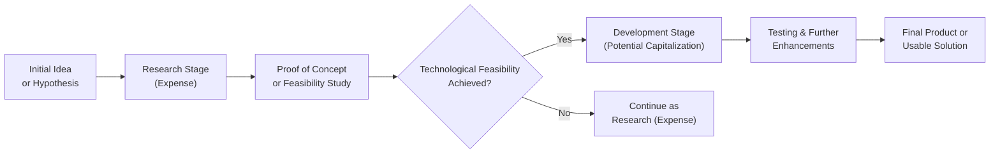
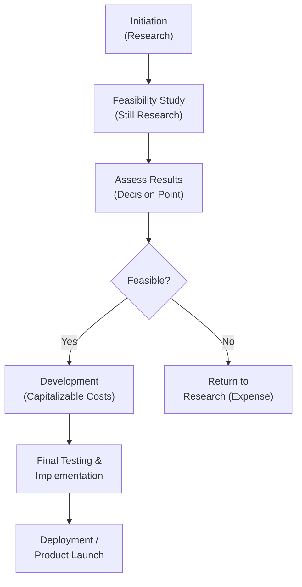

## 11.2 Differentiating Research from Development

This section explores the critical distinction between “research” and “development” as it pertains to internally developed software (and broader R&D initiatives). Properly classifying these activities ensures accurate financial reporting and compliance with standards. We will cover key definitions, analyze relevant accounting guidelines, highlight feasibility study phases, and present practical examples and best practices. The ability to distinguish research from development is essential for reliable financial measurement, capitalization decisions, and transparent stakeholder reporting.

### Overview and Importance
Research and development (R&D) costs typically represent significant investments in innovation and product growth. However, not all R&D expenditures are treated equally under U.S. Generally Accepted Accounting Principles (GAAP) or International Financial Reporting Standards (IFRS). Whether an outlay is expensed immediately or capitalized can dramatically affect a company’s income statement, balance sheet, and overall financial performance. Consequently, accounting professionals must thoroughly understand these distinctions:
• Research is generally aimed at discovering new knowledge without direct commercial viability—at least not yet.  
• Development involves forming or enhancing products or processes based on that knowledge, often with reasonable assurance of future economic benefit or technological feasibility.

### Key Definitions
Under both U.S. GAAP and IFRS, R&D is segregated into two key phases:

• Research: Involves original and planned investigation undertaken with the prospect of gaining new scientific or technical knowledge and understanding. For software, this might include brainstorming new designs, forming theoretical algorithms, or exploring entirely new approaches without yet proving their feasibility.  
• Development: Involves the application of research findings or knowledge to a plan or design for the production of new or substantially improved products, processes, or systems. During development, entities typically are more certain of the project’s feasibility and future benefits.  

In the context of software, ASC 985-20 (Software to Be Sold, Leased, or Marketed) and ASC 350-40 (Software Developed or Obtained for Internal Use) under U.S. GAAP offer specific guidance on the phases at which cost capitalization may begin. IFRS standards, notably IAS 38 (Intangible Assets), distinguish research from development in a similar manner.

### Determining the Boundaries
Multiple factors help in establishing when research activities end and development activities begin:

• Technological Feasibility: Commonly defined under U.S. GAAP (ASC 985-20) as the point when an entity completes detailed program design or a working model that demonstrates the software’s function.  
• Commercial Viability: Often relevant under IFRS. For instance, IAS 38 requires that the entity demonstrate both an intention and ability to complete the intangible asset so that it will be available for use or sale, and the means to use or sell the intangible asset.  
• Economic Viability: The organization must be able to show that it can generate probable future economic benefits through the product’s eventual sale or internal use.

A critical challenge is often deciding when certain intellectual breakthroughs, prototypes, or feasibility studies transition from mere investigative efforts (research) to more assured development phases.

### Flowchart for Classifying Research vs. Development

Below is a conceptual Mermaid.js flowchart offering a simplified, high-level approach to R&D classification. Keep in mind that real-world scenarios can be more complex, involving iterative loops between research and development.

• If the technical feasibility at decision node D is not yet reached, costs remain in research (typically expensed).  
• Once a project meets feasibility criteria, future costs may qualify as development (potentially capitalized).  

### Feasibility Studies and Prototypes
Feasibility studies and prototypes often represent transitional phases in which companies explore whether the underlying technology can realistically produce the desired outcome. Failure or success at these stages determines the cost treatment moving forward:

• Feasibility Studies: Activities centered on proving key concepts, evaluating the complexity of the underlying technology, or investigating whether an idea is technologically or commercially realistic. Since they often still involve foundational exploration, these efforts are typically classified under research (and thus expensed).  
• Prototypes: Physical or digital representations providing tangible evidence of a product’s viability. The transition to prototype development can mark the shift from research to development if the prototype confirms commercial and technological feasibility.

#### Practical Example: Feasibility Study Costs
Imagine a software firm investigating quantum-computing algorithms for data encryption solutions. While exploring mathematical models or quantum mechanics theories, all incurred costs are classified as research. These efforts remain speculative, and there is no guarantee of tangible, marketable products. If the feasibility study is inconclusive, all associated costs stay expensed. However, if the feasibility study yields strong evidence that the algorithms can be scaled for commercial applications, the team may then move forward into development.

#### Practical Example: Prototype Costs
Consider a robotics startup building a specialized mechanical arm to perform micro-surgeries. Once it has developed a working prototype that demonstrates the arm’s ability to achieve the required precision, it might transition from research to development. At that point, if the criteria under ASC 350-40 or IAS 38 are met, incremental prototype refinement costs may be capitalized.

### Accounting Treatment Under U.S. GAAP
Under U.S. GAAP, costs typically remain expensed until the point of technological feasibility. After feasibility is established:
• Additional coding, testing, and costs to refine the product’s design may be capitalized.  
• Once the product is ready for release, subsequent costs may revert to expense unless they are further enhancements meeting capitalization criteria.

From an internal-use software perspective (ASC 350-40):
• Preliminary project stage costs: Expensed as incurred (akin to research).  
• Application development stage costs (after project has a clear path to completion and feasibility is established): Capitalized.  
• Post-implementation or operational stage costs: Expensed.  

### Accounting Treatment Under IFRS
IAS 38 offers a narrower path to capitalization but uses similar logic:
• Research: Always expensed. An entity cannot demonstrate the future economic benefit at this stage with sufficient certainty.  
• Development: Potentially capitalized if six key conditions are met, including the technical feasibility of finishing the intangible asset, the ability to use or sell it, and the demonstration of probable future economic benefits.  

Note that IFRS-based companies often need meticulous documentation of the decision process that moves a product from research to development.

### Real-World Case Study: Cloud-Based Data Analytics Company
A large data analytics provider embarks on an R&D initiative aimed at leveraging artificial intelligence (AI) for real-time predictive modeling. The team runs thousands of simulated data sets during a six-month research phase, evaluating dozens of AI frameworks. All simulation costs, researchers’ salaries, computing resources, and overhead are expensed.  

At the end of six months, they pinpoint a stable, proof-of-concept AI model that meets performance standards. During a management review, they conclude the project can be completed and will be used internally to revolutionize the company’s analytics offering. They now enter the development phase, capitalizing further design and coding costs per ASC 350-40. This approach leads to accurate reflection of the intangible asset’s value on the balance sheet while continuing to expense any R&D efforts unrelated to the verified feasible solution.

### Best Practices for Classification
• Maintain Clear Documentation: Track each project’s stage and maintain evidence that supports when feasibility is reached, including technical memos, project milestone records, or management sign-offs.  
• Collaborate with Engineering Teams: Accounting professionals should coordinate with engineers or development teams to verify the creation and testing of prototypes, feasibility checkpoints, and readiness for commercialization.  
• Regularly Review Projects: Many R&D efforts evolve over time. Conduct periodic reviews to reclassify expenses into development once new evidence emerges or to revert to research if feasibility is questioned.  
• Align with Internal Controls: Incorporate well-defined processes in the company’s internal controls environment, especially for technology-driven projects spanning multiple accounting periods.

### Common Pitfalls and Challenges
• Premature Capitalization: Capitalizing costs when the product or technology is not truly feasible poses a risk of overstated assets.  
• Delayed Recognition of Feasibility: Hesitating to classify certain projects as development can lead to excessive expensing and an understated asset base.  
• Mixing Research and Development Costs: Failing to carefully track or allocate direct and indirect costs can lead to financial statement misstatements.  
• Lack of Documentation: Without proper records of feasibility studies, management sign-offs, and testing results, auditors or regulators may disallow capitalized costs.

### Practical Table: Research vs. Development Costs
Below is a simple illustrative table comparing typical costs faced by a software entity at different project stages:

| Activity                                           | Classification Under GAAP             | Classification Under IFRS                     |
|----------------------------------------------------|---------------------------------------|-----------------------------------------------|
| Evaluating multiple algorithms without proof        | Research Expense                       | Research Expense                              |
| Constructing a proof-of-concept prototype          | Generally still Research Expense       | Research Expense                              |
| Creating a functional, tested prototype            | May signal start of Development Phase  | Potentially switch to Development if criteria are met |
| Improving product post-feasibility                 | Capitalize if meets GAAP thresholds    | Capitalize if six IAS 38 conditions are met   |
| Bug fixes and minor enhancements after sale/launch | Expense (maintenance)                  | Expense (maintenance)                         |

### Frequently Asked Considerations
• Overlapping Phases: In practice, R&D activities may not be strictly sequential. Parts of a project are in research while other parts are in development, necessitating careful cost segmentation.  
• Re-Research After Feasibility: Sometimes technical or commercial obstacles cause a project to revert to a research phase. Costs after that revert to being expensed, unless and until feasibility is once again established.

### Additional Accountability and Cross-Reference
For more details on intangible assets and capitalization considerations, see Chapter 10: Indefinite-Lived Intangible Assets and Goodwill. Chapter 11.1 provides an overview of capitalization rules regarding internally developed software for external sale or internal use. Additionally, Chapter 25: Practical Insights and Implementation suggests strategies for documentation and collaboration with IT to ensure robust compliance.

### Visual Diagram Explanation
To illustrate how an entity might track shifts between research and development over time, consider the following timeline and movement:

The moment “Feasibility?” is confirmed “Yes,” the nature of costs fundamentally alters from research-based expense to development-based capitalization, provided the relevant accounting guidelines are satisfied.

### Concluding Thoughts
Distinguishing between research and development is among the most nuanced tasks in accounting for innovation and software-related costs. By understanding the key definitions, documenting milestones and prototypes, and rigorously applying U.S. GAAP or IFRS guidelines, companies can present R&D activities with integrity and consistency. The implications on a company’s balance sheet, income statement, and financial ratios highlight the importance of diligent classification.

Accurate R&D classification has become even more critical with the accelerating pace of technology-driven endeavors. Whether implementing advanced AI solutions, building next-generation cloud services, or simply crafting improved internal processes, the interplay between research and development classification shapes both financial reporting outcomes and strategic decision-making.

---

## Test Your Knowledge: R&D Cost Classification and Accounting Quiz



### Research and development costs typically differ in that:
- [x] Research is generally aimed at discovering new knowledge, while development applies that knowledge to create viable products or processes.
- [ ] Research is always capitalized, whereas development is always expensed.
- [ ] Both research and development can be immediately capitalized once a budget is approved.
- [ ] Neither research nor development can ever be capitalized.

> **Explanation:** Research activities focus on new knowledge acquisition and are usually expensed. Development emerges when a technological or commercial feasibility is established, potentially qualifying for capitalization if criteria are met.

### When does technological feasibility typically occur for software developed for sale under U.S. GAAP?
- [ ] After the software has generated revenue.
- [x] After a working model or detailed program design is established.
- [ ] As soon as the organization allocates budget to the project.
- [ ] Once the product is launched to the public.

> **Explanation:** Under ASC 985-20, technological feasibility is established upon completion of a detailed program design or the existence of a working model that demonstrates the software’s functionality.

### Which of the following IFRS standards provides guidance on differentiating research from development?
- [ ] IAS 16
- [ ] IFRS 7
- [x] IAS 38
- [ ] IFRS 9

> **Explanation:** IAS 38 (Intangible Assets) outlines the requirements for differentiating research from development and determining when and how intangible assets can be capitalized.

### Which cost is most likely to remain in the research phase?
- [x] Investigating multiple alternative designs with no proof of concept.
- [ ] Enhancing an already developed software module.
- [ ] Fixing post-deployment bugs in commercial software.
- [ ] Incurring hosting costs following product release.

> **Explanation:** Activities that lack definitive proof of concept and demonstrate no plausible future economic benefits are considered research and thus expensed.

### A company has developed a prototype that demonstrates its new AI software working successfully. According to most accounting standards, costs incurred after achieving feasibility to further refine the solution are:
- [x] Potentially capitalized if development criteria are met
- [ ] Always expensed
- [x] Potentially capitalized under IFRS if six specific conditions are satisfied
- [ ] Recognized as a liability until the product is launched

> **Explanation:** Both U.S. GAAP (ASC 350-40, 985-20) and IFRS (IAS 38) allow capitalization after feasibility is demonstrated, assuming additional criteria related to completion and future economic benefits are also met.

### Which statement best describes accounting treatment under U.S. GAAP for internal-use software during the application development stage?
- [x] Typically capitalize direct costs for coding and testing once feasibility is confirmed.
- [ ] All costs must be expensed until the software is deployed to end users.
- [ ] All application development costs are shown as intangible assets indefinitely.
- [ ] Only wages related to managerial oversight are capitalized.

> **Explanation:** ASC 350-40 states that once feasibility and intention to use the software are clear, costs directly linked to application development (coding, testing, etc.) can be capitalized.

### What generally occurs if a project reverts to more fundamental explorations after initially achieving feasibility?
- [x] It may revert to research classification and subsequent costs are expensed.
- [ ] All previously capitalized amounts must be immediately written off.
- [x] It can remain in development as long as some feasibility has been established in the past.
- [ ] No further expenses are recognized because it was already in development classification.

> **Explanation:** If software modifications lead to a step back into conceptual or feasibility-based trials, costs incurred for those renewed explorations may need to be classified as research (expensed), because feasibility is no longer certain for the new direction.

### Which best practice helps ensure proper classification of R&D costs?
- [x] Maintaining thorough project documentation, including milestones and feasibility proofs.
- [ ] Classifying all technology-related costs as development.
- [ ] Capitalizing any expense that appears to further the project timeline.
- [ ] Storing cost records separately, away from engineering data.

> **Explanation:** Proper documentation of milestones and feasibility proofs is critical. It clarifies the transition point from research to development and supports audit requirements.

### In IFRS, which costs are never capitalized as part of development?
- [x] Costs incurred solely in pursuit of new scientific knowledge with no commercial proof of concept.
- [ ] Costs incurred post-feasibility to enhance the software design.
- [ ] Testing and refinement activities after meeting commercialization criteria.
- [ ] Costs directly attributable to producing probable future economic benefits.

> **Explanation:** IFRS generally requires expensing pure research costs, as there is no demonstrable future economic benefit at that stage.

### Once a product is launched publicly, the ongoing customization costs are typically:
- [x] True
- [ ] False

> **Explanation:** Once a product is released or integrated into use, further customizations often fall under maintenance, which is recognized as an expense.  



---

## For Additional Practice and Deeper Preparation

### [Business Analysis and Reporting (BAR) CPA Mock Exams](https://www.udemy.com/course/bar-cpa-mock-exams/?referralCode=ADBE2E84BEE9CB6243CA)

**Business Analysis and Reporting (BAR) CPA Mocks:** 6 Full (1,500 Qs), Harder Than Real! In-Depth & Clear. Crush With Confidence!

- Tackle full-length mock exams designed to mirror real BAR questions.  
- Refine your exam-day strategies with detailed, step-by-step solutions for every scenario.  
- Explore in-depth rationales that reinforce higher-level concepts, giving you an edge on test day.  
- Boost confidence and minimize anxiety by mastering every corner of the BAR blueprint.  
- Perfect for those seeking exceptionally hard mocks and real-world readiness.

_Disclaimer: This course is not endorsed by or affiliated with the AICPA, NASBA, or any official CPA Examination authority. All content is for educational and preparatory purposes only._
