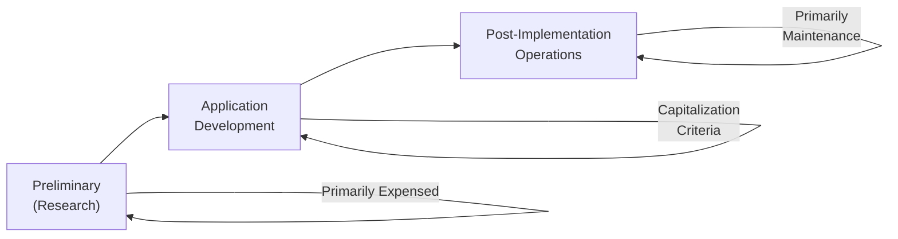

## 11.4 Common Classification Errors

In the realm of internally developed software and research & development (R&D), classification errors often arise when organizations fail to correctly category costs. Some costs should be capitalized, others expensed, and still others partly capitalized under very specific rules. These mistakes can lead to misstated financial statements, confusion for stakeholders, and non-compliance with U.S. GAAP. This section highlights the most common classification errors, provides guidance on how to avoid them, and references other chapters in this book for deeper exploration.

Accounting for internally developed software and R&D expenditures requires careful navigation through several layers of guidance, most notably ASC 350-40 for internal-use software, ASC 985-20 for software to be sold, leased, or otherwise marketed, and ASC 730 for general R&D guidelines. Because of these overlapping areas, practitioners must be vigilant about distinguishing between research activities, development activities, and enhancements to existing software products. By clearly demarcating these phases—and by timing the capitalization correctly—entities can dodge the most frequent pitfalls.

This section builds upon earlier parts of Chapter 11:
• Chapter 11.1 (Capitalization Rules: Internal-Use vs. External Sale)  
• Chapter 11.2 (Differentiating Research from Development)  
• Chapter 11.3 (Amortization and Technological Feasibility)  

These chapters provide foundational details about what costs qualify for capitalization. Here, the focus is on how classification errors occur in practice and how to prevent them.

---

### The Significance of Proper Classification

Proper classification underpins accurate financial reporting. When errors occur, they can misrepresent a company’s net income, operating results, and overall financial health. Some of the more detrimental consequences include:

• Overstated or understated intangible assets on the balance sheet  
• Misinformed investors, analysts, and managers  
• Potential regulatory scrutiny or restatements if errors are material  

An entity’s technology development strategies are rarely linear, further complicating the classification process. Activities might shift rapidly from a conceptual approach (research) to a definable software product (development). Misclassifying costs along these shifts is one of the leading causes of missed or erroneous expense/capitalization breakpoints.

---

### Common Themes in Classification Errors

While each situation is unique, several recurring themes emerge when classifying internally developed software costs and R&D:

• Confusion between research vs. application development  
• Inconsistent treatment of third-party versus in-house labor  
• Capitalizing costs prior to establishing technological feasibility  
• Neglecting to reclassify from research to development once criteria are met  
• Misidentifying routine maintenance as a capitalizable enhancement  
• Combining software for sale to external parties with software intended for internal use  

The following sections offer practical insights and examples for each major classification stage—Preliminary Project Stage, Application Development Stage, and Post-Implementation Stage—along with how R&D classification often gets entangled in each stage, leading to errors.

---

### Classification Errors in the Preliminary Project Stage

The Preliminary Project Stage often involves brainstorming, evaluating alternative solutions, and determining whether a project is technically feasible. ASC 350-40 mandates expensing all costs incurred in this phase for internal-use software, as no software asset yet exists to reliably measure or recognize.

A common error is capitalizing costs related to research activity well before establishing that the project will, in fact, move forward with a defined, feasible software solution.

• Error Example:  
  A technology startup invests heavily in exploring potential blockchain-based payment solutions. The staff logs many hours designing prototypes and evaluating vendor software. The company prematurely capitalizes these costs, believing they relate to “software building activities.” In reality, these are still conceptual exploration tasks that must be expensed as research.

• Correct Approach:  
  Only once the entity decides on a specific software solution and demonstrates technical feasibility do the activities shift into the Application Development Stage, at which point certain costs can be capitalized.  

**Rule of Thumb:** All research-related tasks, including specification reviews and feasibility studies, are expensed until a formal plan and feasibility are established.

---

### Classification Errors in the Application Development Stage

Once the Application Development Stage kicks off—often marked by the entity’s commitment to develop a specific software solution—certain direct costs can be capitalized under ASC 350-40. These costs might include coding, testing, and integrating new modules. Yet errors often occur when companies fail to properly separate:

• Enhancements vs. Maintenance  
• Internal Technical Feasibility vs. Market Readiness  
• Software for Internal Use vs. External Sale  

1) **Enhancements vs. Maintenance**  
   Many organizations mistakenly capitalize the routine updates or bug fixes that fall under maintenance expenses. True enhancements that add significant new functionality or expand the software’s capabilities can be capitalized if they meet specific criteria. Repetitive updates that simply correct defects or maintain existing performance should be expensed.

2) **Software for Internal Use vs. External Sale**  
   If the software under development is intended for internal use only, classification follows ASC 350-40. If it is intended for external sale, potentially as a commercial product or license, follow ASC 985-20. Confusion arises when the entity changes its intent midway, or when a portion is used internally and another portion is sold.

3) **Timing of Technological Feasibility**  
   Under ASC 985-20 (software for sale), costs incurred after achieving technological feasibility but before commercial release can be capitalized. However, many incorrectly start capitalizing once a prototype is operational, even though feasibility may not yet be fully established.  

**Example of a Mid-Project Classification Slip**:  
A mid-sized IT firm begins building an enterprise-level payroll system for in-house use. Halfway through development, the leadership decides to license the software externally based on early successes. The team fails to switch from ASC 350-40 to ASC 985-20 guidance for subsequent development costs. This introduces classification errors related to how—and when—costs should have been capitalized post-feasibility.

---

### Classification Errors in the Post-Implementation Stage

In the Post-Implementation Stage, the software has been placed into service for internal or external use, and the focus typically shifts to ongoing support, training, and routine administrative activities.

Common classification pitfalls include:

• **Incorrectly Capitalizing Maintenance:** Entities sometimes continue to capitalize costs associated with diagnosing minor defects or adapting the software due to environmental changes (e.g., server migrations or OS updates). These maintenance adjustments maintain the asset but do not enhance its functionality, so they should be expensed.

• **Overcapitalizing “Enhancements”**: Large-scale modifications that introduce truly new features can be capitalized, provided they meet the criteria for new functionality and future economic benefit. Commonly, organizations overcapitalize minor changes disguised as “enhancements.”

• **Failure to Adjust Useful Life**: If additional modules significantly extend the system’s functionality and usage horizon, the entity should consider revising the software’s remaining useful life, which impacts the annual amortization. Leaving the service life unchanged can cause misclassification of depreciation/amortization expense.

---

### Software Classification Flow: Overview Diagram

Below is a simplified flowchart illustrating the typical stages of internal-use software classification. Note the shift from expensing to capitalizing once the project moves beyond research activities to a defined application development phase.

In this diagram:  
• Activities in the “Preliminary (Research)” stage are generally expensed.  
• Activities in the “Application Development” stage can be capitalized if specific criteria (ASC 350-40 for internal-use) or (ASC 985-20 for external sale) are met.  
• Activities in the “Post-Implementation Operations” stage mostly revert to expense classification unless an activity truly qualifies as an enhancement.

---

### Tangible vs. Intangible Asset Classification Errors

Although most software expenditures relate to intangible assets, certain allocations may require classification as tangible assets when dealing with hardware components or specialized IT infrastructure (e.g., servers dedicated solely to the development environment). A common mistake is lumping both intangible and tangible expenditures into a single intangible asset line item, ignoring that tangible overhead or specialized hardware may merit separate classification and accounting treatment.  

**Example**:  
An organization purchases a high-performance server primarily to run advanced simulations and compilers during the development stage. The hardware cost should be capitalized as a tangible asset (like Property, Plant, and Equipment) and depreciated accordingly, not as an intangible software cost. Maintenance for this hardware belongs to typical PP&E maintenance expense.  

---

### Research vs. Development Costs: A Quick Recap

As covered in Chapter 11.2, R&D classification can be subtle. Development costs can be capitalized only if they meet all necessary recognition criteria, including:  
• Proof of future economic benefits  
• The entity’s ability to complete and use or sell the asset  
• Demonstration of technological feasibility (for software to be sold)  

**Frequent Mistakes**  
• Capitalizing research stage costs: “We have a partial product design, so let’s capitalize now.”  
• Failing to reclassify to development costs once the project is determined to be feasible.  
• Stretching the concept of “feasibility” to justify early capitalization.  

Ensuring that the line between research and development is drawn carefully can prevent a cascade of classification errors down the line.

---

### Real-World Example: Overcapitalization in a Healthcare App

Consider a mid-sized healthcare provider that seeks to develop an in-house patient scheduling system. During the first five months, the IT team explores multiple coding frameworks, tries out various third-party libraries, and experiments with database structures—these are purely conceptual activities. Eager to demonstrate intangible asset growth, the company begins capitalizing these exploration costs under “Software Development” on the balance sheet.

Eventually, the company identifies a suitable platform and commits to building out the product. The environment transitions to actual development tasks—coding the front-end interface, building the database schema, and stress-testing the application. While these later costs can indeed be capitalized under ASC 350-40 for internal-use software, the earlier conceptual expenditures belonged fully in the income statement as an R&D expense.

When auditors review the process, they discover that tens of thousands of dollars incorrectly remained on the balance sheet for the preliminary research stage. The company is forced to restate prior periods, resulting in embarrassment, reputational damage, and potential regulatory scrutiny if the error were material enough.

**Key Takeaway**: Recognize that not all “app building” efforts qualify as development costs. Distinguish clearly between a purely exploratory or pilot phase and the formal application development phase.

---

### Strategies to Avoid Common Errors

• **Set Clear Policies**: Develop internal guidelines that delineate each project phase. Outline which costs are expensed vs. capitalized.  
• **Use Formal Checklists**: Before capitalizing any cost, verify it meets the mandatory criteria. For instance, has the project advanced beyond conceptual design?  
• **Centralize Oversight**: Have a dedicated financial review committee (accounting + IT experts) regularly monitor software projects’ status and associated costs.  
• **Train Cross-Functional Teams**: Educate project managers and IT staff on the basic accounting thresholds. Many classification errors occur when non-finance personnel misunderstand capitalization triggers.  
• **Document Thoroughly**: Maintain a robust audit trail. Record the rationale for classifying each cost component. This is crucial for internal audits and external reviews.  
• **Reassess at Major Milestones**: Transitions between project phases (e.g., from research to development to post-implementation) are prime areas for classification updates.  

---

### Illustrative Table of Costs and Their Usual Classification

Below is a high-level reference of typical cost types and how they are generally classified for internal-use software:

| Cost Type                              | Common Classification        | Notes                                              |
|---------------------------------------|------------------------------|----------------------------------------------------|
| Feasibility Studies, Proof of Concept | Expensed (Research)         | Stage 1 (Preliminary Project Stage)               |
| Coding/Integration (Once Feasible)    | Capitalized (Dev. Stage)    | ASC 350-40 once formal direction is set            |
| Third-Party Consultant (Dev. Stage)   | Capitalized (If in Dev.)    | Must be directly related to software creation      |
| Maintenance, Minor Fixes              | Expensed (Post-Implementation) | Routine bug fixes, day-to-day maintenance         |
| Additional Modules (Enhancements)     | Capitalized (If adds functionality) | Must increase functionality or capacity           |
| End-User Training                     | Expensed (Post-Implementation) | Training fees rarely qualify for capitalization   |
| Server Hardware for Dev. Environment  | Capitalized (PP&E)          | Treated as a tangible asset; not intangible        |
| Ongoing Hosting Costs                 | Expensed                    | Typically operating expense                        |

---

### Best Practices for R&D Softwares

1. **Segment R&D Budgets**: Separating R&D budgets by project stage (research vs. development) helps ensure correct treatment.  
2. **Timely Reassessments**: The project might flip from research to development earlier or later than expected—always recalibrate once new information surfaces.  
3. **Consider Disposal or Impairment**: Not all development projects succeed. Once a project is abandoned or no longer meets capitalization requirements, reclass or impair promptly.  

---

### Point of Intersection with Other Chapters

• **Chapter 10 (Indefinite-Lived Intangible Assets and Goodwill)**  
  While software is generally finite-lived (and thereby amortized), indefinite-lived intangible assets require a different approach to impairment. Make sure not to confuse software classification with indefinite-life intangible assets.  

• **Chapter 12 (Revenue Recognition)**  
  R&D classification can relate to contracts that involve deliverables like software licenses. Under ASC 606, you may need to parse out performance obligations to address any prepayment or recognized revenue from partially developed software.  

• **Chapter 14 (Business Combinations, Consolidations, and Foreign Operations)**  
  Classification errors multiply during acquisitions when an acquirer records intangible assets at fair value. Properly identify which intangible assets relate to in-process R&D, which is typically recognized as an asset subject to certain impairment requirements, versus intangible assets subject to amortization.  

---

### Conclusion

Common classification errors in internally developed software and R&D can be mitigated by consistently applying ASC 350-40, ASC 985-20, and ASC 730, and by closely monitoring project stages. Practitioners should understand how to differentiate research from development, identify truly capitalizable upgrades, and properly treat maintenance costs. By establishing internal controls, providing robust training, and documenting project milestones, organizations can avoid restatements, maintain investor confidence, and comply with GAAP.

Below, you can test your grasp of these classification errors through an interactive quiz. Afterward, explore additional resources to strengthen your BAR exam preparation.

---

## Common Classification Errors in Software & R&D: Test Your CPA Knowledge



### A company begins exploring different database structures. They have not determined the final approach or feasibility. Which statement is correct about classifying these costs?

- [ ] Capitalize because these activities are part of building the software.
- [ ] Split costs between intangibles and PP&E.
- [x] Expense because these exploratory activities are in the research stage.
- [ ] Classify as indefinite-lived intangible assets.

> **Explanation:** During the initial or preliminary (research) stage, companies have not determined the final feasible approach. Costs are generally expensed until a decision and feasibility have been established.

### A firm’s management decides mid-project to license its in-development software externally. How should future costs be treated?

- [x] Switch guidance from ASC 350-40 to ASC 985-20 for subsequent development costs.
- [ ] Continue using ASC 350-40 for the remainder of the project.
- [ ] Immediately expense all costs since the project changed scope.
- [ ] Classify all costs as indefinite-lived because external licensing signals indefinite utility.

> **Explanation:** Once the company changes its intent to sell software externally, it must apply ASC 985-20 for cost capitalization and subsequent accounting. Past costs remain under ASC 350-40, but future costs need re-evaluation.

### Which type of cost is most commonly expensed in the Application Development Stage for internal-use software?

- [ ] Coding and testing directly related to a determined solution.
- [x] Minor bug fixes and routine maintenance costs.
- [ ] Development labor for new modules.
- [ ] Internal direct labor after feasibility is established.

> **Explanation:** Although coding and testing may be capitalized once feasibility is established, minor bug fixes and routine maintenance during or after implementation are generally expensed.

### Which scenario is often misclassified as a capitalizable enhancement?

- [x] Fixing recurring system bugs that maintain existing functionality.
- [ ] Adding a new feature that expands the software’s capabilities.
- [ ] Developing robust data analytics modules.
- [ ] Integrating external services that create new system functionalities.

> **Explanation:** Fixing bugs or addressing day-to-day maintenance issues should be expensed. Real enhancements that expand capabilities may be eligible for capitalization.

### In accordance with ASC 350-40, which statement is true for internally developed software once substantial testing has completed?

- [x] Post-implementation costs typically switch to operating expense unless they add significant functionality.
- [ ] All future costs are automatically capitalized until the software is replaced.
- [x] Training and user support costs are also capitalized if they involve employees.
- [ ] The software is treated as an indefinite-lived intangible.

> **Explanation:** Generally, once the software is in use, costs become operating expenses unless they represent a significant enhancement. Training and user support typically do not meet capitalization requirements.

### Which best describes an error related to incorrect useful life adjustments?

- [x] Failure to modify amortization periods after major additions extend life.
- [ ] Reclassifying R&D costs to a shorter depreciable life.
- [ ] Considering intangible assets as indefinite-lived for all software.
- [ ] Using the straight-line method instead of accelerated amortization.

> **Explanation:** If the software’s life is effectively extended by major enhancements, the entity should adjust the amortization schedule accordingly. Not doing so leads to misclassification and inaccurate expense recognition.

### A company purchases a dedicated server for software development testing. How is this typically classified?

- [x] As a tangible asset under PP&E, separate from software intangible.
- [ ] As intangible software costs.
- [x] As indefinite-lived intangible since it supports multiple projects.
- [ ] Expensed immediately under R&D.

> **Explanation:** Physical servers or hardware should be recorded as tangible PP&E, subject to depreciation, rather than as intangible software costs.

### Under ASC 985-20, capitalization generally starts once what major milestone is achieved?

- [x] Technological feasibility is established.
- [ ] Preliminary project plans are initiated.
- [ ] The software is in use for internal operations.
- [ ] A minimum of 30% of the code is complete.

> **Explanation:** For software to be sold or licensed to external parties, costs are capitalized after technological feasibility is proven.

### What is a common misstep in treating externally contracted consultants during the software’s Application Development Stage?

- [x] Expensing their fees even though they code essential components post-feasibility.
- [ ] Capitalizing all fees from day one of the project.
- [ ] Classifying the activity as R&D once software is already near completion.
- [ ] Treating them as indefinite-lived intangible assets because knowledge transfer is indefinite.

> **Explanation:** Consultants who work on direct software build tasks during the Application Development Stage can often be capitalized. Expensing them outright is a common classification error.

### Capitalizing research-stage costs in software development is:

- [x] True
- [ ] False

> **Explanation:** This statement is false, but if you select it as “True,” it highlights the common misconception. Research-stage costs should be expensed until feasibility is established.



---

## For Additional Practice and Deeper Preparation

### [Business Analysis and Reporting (BAR) CPA Mock Exams](https://www.udemy.com/course/bar-cpa-mock-exams/?referralCode=ADBE2E84BEE9CB6243CA)

**Business Analysis and Reporting (BAR) CPA Mocks:** 6 Full (1,500 Qs), Harder Than Real! In-Depth & Clear. Crush With Confidence!  

- Tackle full-length mock exams designed to mirror real BAR questions.  
- Refine your exam-day strategies with detailed, step-by-step solutions for every scenario.  
- Explore in-depth rationales that reinforce higher-level concepts, giving you an edge on test day.  
- Boost confidence and minimize anxiety by mastering every corner of the BAR blueprint.  
- Perfect for those seeking exceptionally hard mocks and real-world readiness.  

_Disclaimer: This course is not endorsed by or affiliated with the AICPA, NASBA, or any official CPA Examination authority. All content is for educational and preparatory purposes only._
