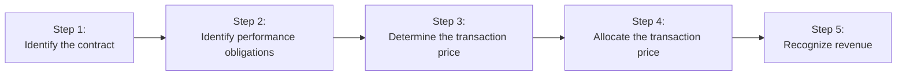
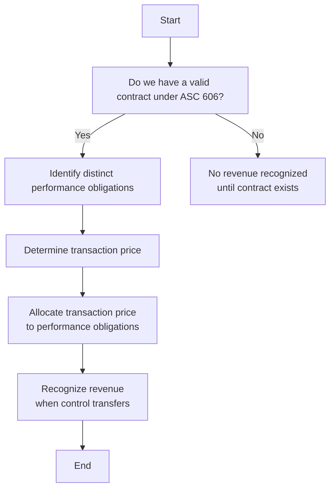

## 12.1 Five-Step Model (ASC 606) Overview

This section offers a comprehensive view of the Five-Step Model for revenue recognition under ASC 606. Established jointly by the Financial Accounting Standards Board (FASB) and the International Accounting Standards Board (IASB), these guidelines redefined how companies recognize revenue from contracts with customers. While ASC 606 applies under U.S. GAAP, it largely aligns with IFRS 15, creating consistency across global financial reporting. 

The core principle of ASC 606 is straightforward:
“An entity should recognize revenue by depicting the transfer of promised goods or services to customers in an amount that reflects the consideration the entity expects to be entitled to in exchange for those goods or services.”

This principle is operationalized through the Five-Step Model:
1. Identify the contract(s) with a customer.  
2. Identify the performance obligations (promises) in the contract.  
3. Determine the transaction price.  
4. Allocate the transaction price to the performance obligations in the contract.  
5. Recognize revenue when (or as) the entity satisfies a performance obligation.  

Each of these steps builds upon the last, ensuring that revenue is allocated to each performance obligation based on its relative value and recognized only when (or as) control transfers to the customer.

Below, we walk through the five steps in detail. To illustrate a cohesive numeric example, we will consider the following simple scenario that follows a typical software-and-service arrangement:

• TechPro Corp signs a contract with a customer to license a unique software platform, provide installation services, and one year of technical support.  
• The total contract price is $100,000.  
• The software installation is expected to take two weeks, and the software license provides immediate functionality once installation is complete.  
• The technical support (maintenance) is provided over 12 months.  
• The customer will pay $20,000 upfront and $80,000 upon completion of installation, with no additional payments for support services.  

Keep this example in mind as we break down each step, illustrating how TechPro Corp would determine when and how much revenue to recognize.

---

### Overview Diagram

Below is a Mermaid diagram to visualize the sequence of the five steps:

Use this visual to map out each phase and ensure you haven’t missed any critical considerations.

---

### Step 1: Identify the Contract with a Customer

A contract creates enforceable rights and obligations. Under ASC 606, a contract (written, verbal, or implied) must meet all of the following criteria:

• The parties have approved the contract and are committed to performing their respective obligations.  
• Each party’s rights regarding the goods or services to be transferred can be identified.  
• The payment terms for the goods or services can be identified.  
• The contract has commercial substance (i.e., the risk, timing, or amount of the entity’s future cash flows is expected to change as a result of the contract).  
• It is probable the entity will collect substantially all of the consideration to which it will be entitled in exchange for the goods or services promised.

#### Numeric Case Application (TechPro Corp Example)
TechPro signs a legally binding agreement with the customer specifying the software license, installation services, and support. Both parties agree on the $100,000 total contract value and the associated timing of payments. The contract has commercial substance (TechPro will receive cash in exchange for software and services) and it is probable that TechPro will collect the $100,000 since the customer has a solid credit rating. Thus, the contract meets the Step 1 criteria.

#### Best Practices and Pitfalls
• Ensure the contract terms are explicit to avoid ambiguity and potential disputes.  
• Consider whether variable pricing structures, contract modifications, or side agreements might affect the arrangement.  
• Remember that multiple agreements with the same customer could be combined if they are entered into near the same time and satisfy certain conditions (e.g., they form a single commercial objective).  

---

### Step 2: Identify the Performance Obligations in the Contract

A performance obligation is a promise in the contract to transfer a distinct good or service to the customer. “Distinct” typically means it can stand alone (or together with other readily available resources) and is separately identifiable from other promises in the contract.

Common distinctions include:  
• Goods that can be sold on their own (e.g., software licenses).  
• Services that customers can benefit from independently or together with other readily available resources.  

#### Numeric Case Application (TechPro Corp Example)
In our scenario, there appear to be three promises (potential performance obligations):  
1. The software license.  
2. The installation services.  
3. The one-year technical support.  

We next evaluate if each of these promises is separately identifiable and distinct:  
• Software License: Provides the customer with a functional tool that can be used on its own after installation.  
• Installation Services: Although required for initial activation, the installation has a standalone value only if it’s deemed not highly interdependent with the license. Normally, if the customer could contract out installation to a third party or otherwise use the software on its own, this would be a distinct service.  
• Technical Support: Ongoing maintenance services are distinct from the software itself, as they are provided over time and not necessary for the software to function.  

Given these considerations, TechPro concludes that all three promises are indeed distinct performance obligations.

#### Best Practices and Pitfalls
• Carefully analyze bundled items (e.g., “free” maintenance or “free” upgrades). These might be implicit promises and qualify as additional performance obligations.  
• Be thorough when deciding whether a promise is “distinct.” If the goods or services are highly interdependent or integrated, they might have to be combined into a single performance obligation.  

---

### Step 3: Determine the Transaction Price

The transaction price is the total amount of consideration (payment) the entity expects to be entitled to in exchange for satisfying the performance obligations. This step can be straightforward if the price is fixed and payable in cash. However, complexities may arise from elements such as:

• Variable consideration (rebates, discounts, incentive payments).  
• Non-cash considerations (customer-provided assets).  
• Significant financing components (when payment timing significantly differs from delivery timing).  
• Consideration payable to the customer (e.g., coupons or vouchers).  

At this step, be explicit about identifying the fixed versus variable portions and adjust for expected outcomes or constraints.

#### Numeric Case Application (TechPro Corp Example)
The agreed-upon contract price is $100,000. There are no performance bonuses, rebates, or other forms of variable payment. Payment terms involve $20,000 upfront and $80,000 upon installation completion. Because the payment schedule is relatively short and does not include an interest component, there is no significant financing component. Therefore, the total transaction price is $100,000.

#### Best Practices and Pitfalls
• Watch for any price protection, rebates, or variable fees, as these must be estimated using either the expected value method or the most likely amount method.  
• Calculate any implied financing if there’s a long delay between when goods or services are transferred and when payment is due.  
• Reassess the transaction price if the contract is modified or if variable consideration changes.  

---

### Step 4: Allocate the Transaction Price to the Performance Obligations

If multiple performance obligations exist, the total transaction price should be allocated to each obligation based on the “standalone selling price” (SSP) of each distinct good or service at contract inception.  
• If the SSP is observable (e.g., selling price in a regular transaction), use that price.  
• If the SSP is not directly observable, estimate it using an appropriate method (e.g., cost plus a margin approach, adjusted market assessment approach, or residual approach).

#### Numeric Case Application (TechPro Corp Example)

TechPro looks at historical data and market conditions to ascertain the following standalone selling prices:  
• Software License: $75,000  
• Installation: $10,000  
• One-Year Technical Support: $15,000  

Thus, the sum of the SSPs is $100,000, which conveniently matches the total transaction price. Allocation is straightforward in this example:

1. Software License → $75,000  
2. Installation → $10,000  
3. Technical Support → $15,000  

Because the SSPs exactly match the total contract price, no further complexity arises from discount allocation or a residual approach. If the sum of the SSPs had been, say, $110,000, then TechPro would have to allocate the $100,000 proportionally according to the relative standalone prices.

#### Best Practices and Pitfalls
• Use consistent, documented methods to determine SSP.  
• Complexities arise when significant discounts exist. You must allocate rebates or discounts proportionally unless certain performance obligations can be proven to receive specific discounts.  
• In step 4, do not prematurely recognize revenue; you are only assigning values. Recognition happens in step 5.  

---

### Step 5: Recognize Revenue When (or As) the Entity Satisfies a Performance Obligation

The final step involves recognizing revenue when control of the goods or services is transferred to the customer. “Control” refers to the ability to direct the use and obtain substantially all the remaining benefits from the good or service. This can occur over time or at a point in time.

• Over Time: Revenue is recognized proportionally if one of the following criteria is met:  
  1. The customer simultaneously receives and consumes the benefits of the entity’s performance.  
  2. The entity’s performance creates or enhances an asset that the customer controls as it is created or enhanced.  
  3. The asset the entity is creating has no alternative use to the entity, and the entity has an enforceable right to payment for performance completed to date.  

• Point in Time: If none of the above criteria for “over time” are met, revenue should be recognized at the point in time when control is transferred to the customer (e.g., upon delivery).

#### Numeric Case Application (TechPro Corp Example)

1. **Software License**:  
   TechPro will generally recognize revenue at the point in time when control of the software transfers (which, in this case, is likely upon completion of installation and the customer’s ability to use the software). Since the entity is delivering a fully functional license, revenue of $75,000 is recognized once the license is installed and operational.

2. **Installation Services**:  
   Installation is a short-term project. Under ASC 606, if the installation does not meet the “over time” criteria (i.e., it’s not consumed simultaneously by the customer, nor is it creating an asset that the customer controls as TechPro works), revenue is recognized upon completion (point in time). In a typical scenario, prerogative might be to recognize this revenue when TechPro has completed the task and the customer has a usable product. Revenue of $10,000 is recognized once installation is finished and accepted.

3. **Technical Support (Maintenance)**:  
   This is a service that is consumed over a 12-month period. The benefits of the support service are consumed by the customer over time (simultaneous consumption). Therefore, TechPro recognizes $15,000 evenly (or on a straight-line basis, unless usage patterns suggest otherwise) over that one-year period.

In summary, as each performance obligation is satisfied, TechPro recognizes revenue. Point-in-time recognition applies to the software license and installation, while over-time recognition applies to support services.

#### Best Practices and Pitfalls
• Evaluate whether performance obligations are met over time—particularly relevant in construction, software subscriptions, or ongoing professional services.  
• Use appropriate methods to measure progress over time (e.g., output methods like units produced or input methods like labor hours incurred).  
• Disclose judgments and estimates made in determining how control transfers.  

---

## Expanded Illustrations and Practical Considerations

1. **Variable Consideration Example**  
   Suppose TechPro had included a performance bonus if installation is completed within a week. In that situation, management would estimate the likely amount of that bonus (using the expected value or most likely amount method) and include it in the transaction price if it’s probable that a significant reversal of cumulative revenue will not occur.

2. **Standalone Selling Price Estimation**  
   If TechPro had insufficient historical data, it might apply a cost-plus-margin approach. For instance, if installation costs TechPro $7,000 and they expect a typical 30% margin, the approximate SSP could be $9,100. The rest of the revenue would be allocated accordingly.

3. **Multiple Contracts**  
   ASC 606 allows combining contracts if they are entered around the same time with the same customer, especially if they have interdependent pricing. For instance, if the customer signed two deals on the same day for different modules of the same software system under a single negotiation process, it might be more appropriate to treat them as one contract for revenue purposes.

4. **Modifications**  
   If, six months later, TechPro modifies the contract to add a second year of technical support, the company must assess whether the addition is a separate contract (if the price reflects SSP) or whether it modifies the existing contract.

---

## Diagrams and Visual Aids

Below is an additional diagram illustrating how each step in the Five-Step Model corresponds to questions and decisions that must be made. This high-level “decision tree” can help you visualize a typical approach to ASC 606 compliance.

---

## Common Challenges and Insights

• **Judgment**: ASC 606 places considerable emphasis on estimates and managerial judgment, especially around standalone selling prices and variable consideration.  
• **Control vs. Risks and Rewards**: Although “risks and rewards” was a key concept of previous GAAP, ASC 606 focuses on the transfer of control. This shift can cause changes in the timing of revenue recognition.  
• **Licenses and Intellectual Property**: Entities need to determine if licenses are recognized at a point in time (right to use) or over time (right to access).  
• **Disclosures**: Extensive quantitative and qualitative disclosures are required, including significant judgments made, the nature of performance obligations, and how the entity determines SSP.  

---

## References for Further Exploration

1. FASB Accounting Standards Codification (ASC) 606 – Revenue from Contracts with Customers.  
2. EY, “Financial Reporting Developments: Revenue from Contracts with Customers.”  
3. Deloitte, “A Roadmap to Applying the New Revenue Recognition Standard.”  
4. KPMG, “Revenue Issues In-Depth.”  

These references provide deeper insights and multiple examples of applying key concepts to industry-specific transactions.

---

## Quiz: Master the Five-Step ASC 606 Revenue Model



### Which of the following is the first step in applying the ASC 606 framework?  
- [ ] Determine the transaction price  
- [x] Identify the contract with a customer  
- [ ] Identify the performance obligations  
- [ ] Recognize revenue when control transfers  

> **Explanation:** The Five-Step Model requires you to first confirm that a valid contract exists under ASC 606. Without a valid contract, revenue cannot be recognized.

### What must an entity confirm when identifying performance obligations?  
- [x] That each promised good or service is distinct  
- [ ] That payment terms are fair and equitable  
- [x] That promised goods or services are separately identifiable  
- [ ] That standalone selling prices are easily observable  

> **Explanation:** Step 2 requires the entity to identify each promise to transfer goods or services and to evaluate whether each is distinct (i.e., separately identifiable and capable of benefitting the customer).

### Which of the following factors can cause complexity in determining the transaction price?  
- [x] Significant financing components  
- [ ] Standard warranties only  
- [ ] Normal shipping fees  
- [x] Variable consideration  

> **Explanation:** Variable consideration includes rebates, discounts, bonuses—any payment that can fluctuate. Significant financing components also create complexity when payment timelines span a considerable period.

### How should the transaction price be allocated if there are multiple performance obligations in a contract?  
- [x] In proportion to their respective standalone selling prices  
- [ ] Equally among all performance obligations  
- [ ] Fully to the obligation performed first  
- [ ] Determined purely by management judgment without any reference to SSP  

> **Explanation:** The standard requires allocation of the transaction price to each performance obligation based on relative standalone selling prices at contract inception.

### When is an entity required to recognize revenue over time?  
- [x] When the service is consumed simultaneously by the customer  
- [ ] When the performance obligation involves a physical product  
- [x] When the entity’s performance creates an asset controlled by the customer  
- [ ] When the product is shipped internationally  

> **Explanation:** Revenue is recognized over time if the customer receives and consumes benefits as the entity performs, if the customer controls the asset, or if the asset has no alternative use and the entity has an enforceable right to payment.

### In the TechPro Corp example, how is the one-year technical support primarily recognized?  
- [x] Over time, typically on a straight-line basis  
- [ ] As soon as the installation is complete  
- [ ] Only once all support tickets are closed  
- [ ] Half at the beginning, half at year-end  

> **Explanation:** Support services meet the criterion for over-time recognition because the customer receives and consumes the benefits continuously across the support period.

### Which method is commonly used for estimating variable consideration?  
- [x] Expected value method  
- [ ] Book value method  
- [x] Most likely amount method  
- [ ] Depreciation method  

> **Explanation:** ASC 606 allows for the expected value method or the most likely amount method to measure variable consideration, depending on which approach better predicts the amount to which the entity will be entitled.

### If the contract is modified to add additional goods at their standalone selling price (SSP), how should the entity account for that modification?  
- [x] As a separate contract  
- [ ] As a combined contract automatically  
- [ ] By ignoring the modification  
- [ ] By allocating leftover revenue  

> **Explanation:** Under ASC 606, if additional goods or services are distinct and priced at their SSP, the modification is treated as a new, separate contract.

### What is the essential meaning of “control” under ASC 606?  
- [x] The ability to direct the use of, and obtain substantially all the remaining benefits from, the asset  
- [ ] Sole reliance on the risks and rewards approach  
- [ ] Government-required licensure  
- [ ] The presence of a purchase order  

> **Explanation:** Control focuses on the customer’s ability to deploy the resource or direct its usage and benefits. This is a key departure from prior GAAP that focused on risks and rewards.

### Under ASC 606, a license to intellectual property is likely recognized at a point in time if it provides the customer with the right:  
- [x] To use the IP as it exists at the time of transfer  
- [ ] To continuously access the IP and receive future updates  
- [ ] To fully refund the entire purchase price under any condition  
- [ ] To pay in multiple installments  

> **Explanation:** A “right to use” license is recognized at the point the license is made available, whereas a “right to access” license is recognized over time since the customer continuously benefits from ongoing updates or changes.



---

## For Additional Practice and Deeper Preparation

### [Business Analysis and Reporting (BAR) CPA Mock Exams](https://www.udemy.com/course/bar-cpa-mock-exams/?referralCode=ADBE2E84BEE9CB6243CA)

**Business Analysis and Reporting (BAR) CPA Mocks:** 6 Full (1,500 Qs), Harder Than Real! In-Depth & Clear. Crush With Confidence!

- Tackle full-length mock exams designed to mirror real BAR questions.  
- Refine your exam-day strategies with detailed, step-by-step solutions for every scenario.  
- Explore in-depth rationales that reinforce higher-level concepts, giving you an edge on test day.  
- Boost confidence and minimize anxiety by mastering every corner of the BAR blueprint.  
- Perfect for those seeking exceptionally hard mocks and real-world readiness.

_Disclaimer: This course is not endorsed by or affiliated with the AICPA, NASBA, or any official CPA Examination authority. All content is for educational and preparatory purposes only._
