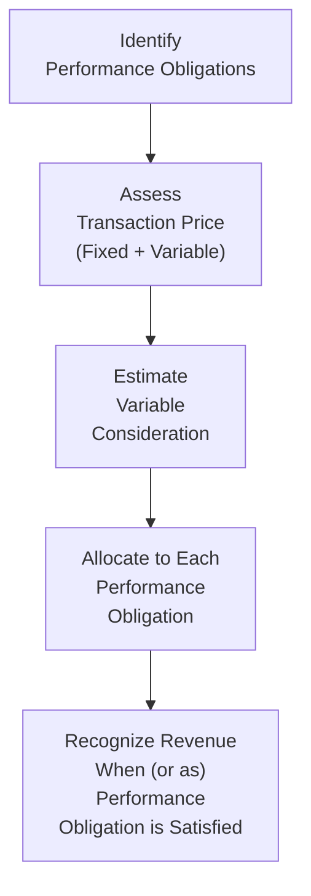

## 12.2 Multiple Performance Obligations and Variable Considerations

In Chapter 12.1, we introduced the Five-Step Model under ASC 606 and IFRS 15 for revenue recognition, providing a high-level overview of each stage. Now, we turn our attention to two of the more complex aspects of these revenue standards: identifying multiple performance obligations and handling variable considerations. These topics are crucial for accurate and transparent financial reporting, as they help ensure that entities fairly reflect the economic reality of their revenue-generating activities.

This section will guide you through the intricacies of recognizing and measuring multiple performance obligations in a single contract, allocating the transaction price, and accounting for various forms of variable or contingent pricing. By the end, you will have a solid command of the key accounting judgments and techniques associated with these steps, reinforced by illustrative examples, diagrams, and best practices.

--------------------------------------------------------------------------------

### Overview of Multiple Performance Obligations

Under ASC 606 (and IFRS 15), one of the earliest and most critical judgments in the revenue recognition process is identifying whether the goods or services promised in a contract are distinct and separable. Each distinct good or service, or bundle of goods and services, becomes its own “performance obligation.” 

1. A good or service is considered distinct if:
   - The customer can benefit from it either on its own or together with other readily available resources.
   - It is separately identifiable in the context of the contract.

2. If goods or services are not distinct, they are combined with other promised goods or services until a distinct bundle is formed. 

#### Key Steps in Identifying Multiple Performance Obligations

• Evaluate the nature of the promised goods or services.  
• Determine if the item is capable of being distinct (i.e., can customers use it on its own or with readily available resources?).  
• Assess if the promise to transfer a good or service is separately identifiable from other promises.  

##### Practical Example: Software and Support Services  
Many software vendors sell licenses to their platform along with annual support or upgrade services. Under ASC 606, the software license and the support services each have their own value to the customer. If they meet the distinct criteria, they should be accounted for as separate performance obligations.

--------------------------------------------------------------------------------

### Allocating the Transaction Price

Once the performance obligations are identified, the transaction price must be allocated to each performance obligation in proportion to the standalone selling prices (SSP) of the promised goods or services. This step is crucial because it determines how much revenue is recognized when (or as) each obligation is satisfied.

#### Standalone Selling Price (SSP)
• The price at which an entity would sell a promised good or service separately to a customer.  
• If the good/service is not sold separately in practice, the entity must estimate what the standalone price would be using observable inputs or other appropriate methods.  

##### Common Methods to Estimate SSP
• Adjusted market assessment approach  
• Expected cost plus a margin approach  
• Residual approach (only permissible under specific conditions, such as when the selling price is highly variable or uncertain)

#### Example: Bundled Contract with Different Goods

Imagine a contract that includes:
1) A hardware component (distinct)  
2) Installation services for that hardware (distinct)  
3) A 12-month maintenance plan (distinct)

Total contract price: $10,000

Let us assume:  
• The hardware’s SSP is $6,000  
• The installation service’s SSP is $1,500  
• The 12-month maintenance plan’s SSP is $3,000  

Sum of SSPs = $6,000 + $1,500 + $3,000 = $10,500  

Since the total contractual transaction price of $10,000 is less than the sum of the SSPs ($10,500), each performance obligation is allocated a proportion of the $10,000. Specifically:  

• Hardware allocated price: $10,000 × ($6,000 / $10,500) = $5,714  
• Installation allocated price: $10,000 × ($1,500 / $10,500) = $1,429  
• Maintenance allocated price: $10,000 × ($3,000 / $10,500) = $2,857  

Revenue is recognized for each performance obligation separately based on the timing of transfer (upon delivery or over time, depending on the nature of the obligation).

--------------------------------------------------------------------------------

### Introduction to Variable Consideration

Variable consideration arises when the promised amount of consideration in a contract is not fixed but depends on future events or outcomes—like discounts, incentives, refunds, rebates, performance bonuses, penalties, and more. Under ASC 606, variable consideration must be estimated and reflected in the transaction price, subject to a constraint to avoid overstating revenue.

#### Two Methods for Estimating Variable Consideration
1. **Expected Value Method**: Appropriate when there are multiple possible outcomes, and the entity has relevant experience to estimate probabilities.  
2. **Most-Likely-Amount Method**: Used when the contract has only two possible outcomes (e.g., an entity is either entitled to a bonus or not).

#### Constraining Estimates of Variable Consideration
Entities are required to include variable consideration in the transaction price only to the extent that it is probable that a significant reversal of the recognized cumulative revenue will not occur. Judgment is critical, and it often requires an evaluation of historical data, market conditions, and contract-specific conditions.

--------------------------------------------------------------------------------

### Variable Pricing Scenarios

Below are some common types of variable pricing scenarios you may encounter:

• **Sales-Based or Usage-Based Royalties**: Common in licensing arrangements. Revenue is recognized only when the subsequent sale or usage occurs (or the performance obligation has been satisfied).  

• **Volume Rebates**: Discounts given based on cumulative purchase levels. These can create variability in the total consideration to be received under a contract.  

• **Performance Bonuses and Penalties**: Typically found in construction or service contracts, where additions or deductions to the transaction price depend on meeting specified milestones or deadlines.  

• **Refund Provisions for Product Returns**: Under ASC 606, the vendor recognizes revenue net of estimated returns and recognizes a liability for expected refunds.

--------------------------------------------------------------------------------

### Putting It All Together: Multiple Performance Obligations with Variable Consideration

When a contract involves both multiple performance obligations and variable consideration, an entity must carefully estimate the total transaction price (including any variable portion) and then allocate that price to each performance obligation. The allocation must consider the standalone selling price of each distinct good or service, and the estimated variable amounts must be assigned using methods that faithfully reflect the relative value contributed.

#### Example: Manufacturing Company with Volume Rebates and Bundled Products

A manufacturing company enters a 12-month contract to sell specialized parts (Product A) and assembly services (Service B) at a total contract price of $50,000. However, the agreement includes a volume rebate if the customer purchases more than 1,000 units in the year, reducing the contract price by 5%.

1. **Identify distinct performance obligations**:  
   - Product A is a distinct good.  
   - Assembly service (Service B) is separately identifiable.  

2. **Estimate variable consideration**:  
   - Assume historical sales data indicates there is a 70% chance the customer will exceed the requisite volume for the rebate, resulting in a purchase discount. The manufacturer uses the Expected Value Method, considering all likely volumes.  

3. **Allocate transaction price**:  
   - Determine the standalone selling prices of each obligation.  
   - Adjust the total transaction price (i.e., including the expected rebate impact).  
   - Allocate the final transaction price proportionally to Product A and Service B.  

4. **Recognize revenue**:  
   - As each distinct performance obligation is satisfied—upon delivery of Product A or over time as assembly services are performed—the company recognizes revenue based on the allocated amount.  
   - The final amount recognized may be adjusted if the actual rebate deviates from the estimate, subject to the constraint guidelines to avoid significant revenue reversal.

--------------------------------------------------------------------------------

### Diagram: The Process of Handling Multiple POs and Variable Considerations

Below is a simplified flow diagram illustrating a typical approach for identifying performance obligations and estimating variable consideration:

Explanation:
• Step A determines whether there are multiple distinct performance obligations.  
• Step B identifies and sums all fixed and variable components of the transaction price.  
• Step C requires applying either the expected value or most-likely-amount method, considering the constraint.  
• Step D allocates the transaction price based on SSP.  
• Step E recognizes revenue appropriately over time or at a point in time.

--------------------------------------------------------------------------------

### Best Practices and Common Pitfalls

Professional judgment is integral when applying ASC 606/IFRS 15 to multiple performance obligations and variable pricing. Below are recommended strategies and frequent challenges:

#### Best Practices
• **Robust Documentation**  
  - Maintain clear records of how you determine distinct goods or services.  
  - Document all assumptions and models used to estimate variable consideration.

• **Regular Reassessments**  
  - Continually update variable consideration estimates with actual experience. If reality diverges significantly from initial assumptions, revise estimates.  

• **Cross-Functional Collaboration**  
  - Work closely with sales, legal, procurement, and operations teams to identify all potential sources of variability and to capture accurate, up-to-date market data for SSP estimates.

• **Scenario Testing**  
  - Perform sensitivity analyses to understand how changes in your assumptions about volume rebates, returns, or performance incentives could affect recognized revenue.

#### Common Pitfalls
• **Overlooking Implicit Obligations**: Contracts might contain promised goods or services not explicitly stated as performance obligations. Evaluate carefully for implied or optional goods.  
• **Insufficient Constraint Analysis**: A hasty or overly aggressive assumption can lead to revenue reversals later.  
• **Incorrect Allocation**: Failing to use fair and systematic methods for estimating SSP can cause distortions in revenue timing.  
• **Ignorance of Standalone Value**: Underestimating or disregarding the significance of each deliverable’s standalone value.  

--------------------------------------------------------------------------------

### Advanced Considerations

#### Allocation of Discounts and Variable Consideration to Specific Performance Obligations
In certain arrangements, the discount or variable element may be specifically tied to only one or a subset of the performance obligations, rather than evenly or proportionally allocated across all performance obligations. Under ASC 606, an entity can allocate variable consideration entirely to one performance obligation if (1) the terms of the variable payment relate specifically to satisfying that performance obligation, and (2) allocating it to the particular performance obligation faithfully depicts the consideration it expects to receive in exchange for transferring the promised goods or services.

#### Long-Term Contracts and Time Value of Money
For extended contracts, consider whether there is a significant financing component (e.g., with multi-year payment terms). Entities are often required to account for the time value of money within the transaction price if payment timing and performance obligation satisfaction differ significantly.

#### IFRS 15 vs. ASC 606
While IFRS 15 is largely converged with ASC 606, minor differences can arise, such as guidance clarifications for licensing, noncash consideration, and practical expedients. However, the fundamental concepts for multiple performance obligations and variable consideration remain consistent across both frameworks.

--------------------------------------------------------------------------------

### Practical Insights for Exam Preparation

• **Holistic Approach**: Link your understanding of multiple performance obligations to the Five-Step Model (see Chapter 12.1). Step 2 (Identify performance obligations) and Step 4 (Allocate transaction price) are where most complexities arise.  
• **Focus on the Constraint**: The “constraint” for variable consideration is pivotal. Expect exam questions testing your ability to identify circumstances that require adjusting estimated variable amounts to avoid revenue reversals.  
• **Case Study Emphasis**: Be prepared to apply the framework to real-world scenarios—especially those involving bundled products, loyalty programs, rebates, and milestone-based arrangements.  
• **Cross-Reference**: Revisiting budgeting, forecasting, and financial statement analysis (see Chapters 7 and 4), you will gain broader insights into how estimates of variable revenues can affect an entity’s internal financial metrics like sales forecasts, cash budgets, and ratio analysis.  

--------------------------------------------------------------------------------

### Illustrative Mini-Case Study

Let’s analyze a scenario combining multiple performance obligations and variable consideration to see the end-to-end process:

Scenario:  
• A software-as-a-service (SaaS) provider sells an annual subscription for $30,000 and provides on-site training for $5,000.  
• The provider also agrees to give a 10% discount if the customer renews for a second year before the current year ends and meets certain usage criteria.  

Steps:
1. **Identify Performance Obligations**:  
   - SaaS subscription is distinct as an ongoing service.  
   - Training is also distinct, providing stand-alone value to the customer.  

2. **Estimate Variable Consideration**:  
   - Assume a 60% chance the discount will apply.  
   - Using the most-likely-amount method, the entity decides to include $3,000 (an anticipated 10% discount on the $30,000 renewal) in the total transaction price for the year. Because the training is fixed at $5,000, total potential revenue for year one is $35,000 plus an anticipated discount allocated to the second subscription.  

3. **Allocate Transaction Price**:  
   - The entity determines that the discount is only related to the subscription (not the training). If it meets the criteria, that discount is allocated entirely to subscription revenue.  

4. **Constrain if Necessary**:  
   - If it is probable that the discount will not cause a significant reversal of revenue, it can be recognized. Otherwise, it is excluded (or partially excluded) until the usage criteria become more certain.  

5. **Revenue Recognition**:  
   - Revenue for the subscription is recognized over time (e.g., monthly).  
   - Training revenue is recognized on completion of the training service.  

This mini-case demonstrates how multiple performance obligations (subscription + training) interact with variable consideration (renewal discount). Properly applying the five-step model ensures faithful presentation of revenue.

--------------------------------------------------------------------------------

### Additional References and Resources

• FASB ASC 606 – Revenue from Contracts with Customers.  
• IFRS 15 – Revenue from Contracts with Customers.  
• AICPA Audit and Accounting Guide: Revenue Recognition.  
• Chapter 12.1 of this guide for the comprehensive five-step overview.  

For deeper insight and examples, consider exploring professional publications, such as the AICPA’s “Revenue Recognition: Audit and Accounting Guide,” or attending specialized webinars focusing on unique industry applications of multiple performance obligations and variable consideration.

--------------------------------------------------------------------------------

## Test Your Knowledge: ASC 606 Multiple Performance Obligations & Variable Consideration



### When identifying multiple performance obligations, one of the primary questions is:
- [x] Whether the good or service is distinct within the context of the contract.
- [ ] Whether the contract has a future renewal option.
- [ ] Whether accounting guidance on leases applies instead.
- [ ] Whether the customer can receive any discount.

> **Explanation:** Under ASC 606 (Step 2), you must determine if the promised goods or services are distinct. If so, each distinct item becomes a separate performance obligation.

### Which of the following best describes the most-likely-amount method for variable consideration?
- [ ] A method used only when there are multiple possible outcomes.  
- [x] A method used when there are just two possible outcomes for the contingency.  
- [ ] A method reserved exclusively for noncash consideration.  
- [ ] A method replaced by the expected value approach in all cases.  

> **Explanation:** The most-likely-amount method is appropriate when an entity expects one of two possible outcomes (e.g., receiving a bonus or not).  

### Why must variable consideration be constrained in ASC 606?
- [x] To avoid a significant reversal of previously recognized revenue.  
- [ ] To maintain consistent gross margins.  
- [ ] To ensure all variable elements are removed until the contract completes.  
- [ ] To conform with IFRS 16.  

> **Explanation:** The constraint rule requires that an entity only include amounts of variable consideration that will probably not result in a significant revenue reversal if estimates change.

### Which of the following is NOT a valid method for estimating a standalone selling price (SSP)?
- [ ] Adjusted market assessment approach.  
- [ ] Expected cost plus a margin approach.  
- [ ] Residual approach (if certain criteria are met).  
- [x] Time-based approach using interest amortization.  

> **Explanation:** SSP estimates are typically made using observable market data, expected cost plus margin, or the residual approach. A time-based interest amortization approach does not apply to SSP.

### In allocating a discount specifically to one performance obligation, which condition must be met?
- [x] The discount must be related solely to that performance obligation.  
- [ ] The discounted price must be approved by the CFO.  
- [x] The allocation must faithfully depict what the entity expects to receive in exchange for that obligation.  
- [ ] The discount must be immaterial relative to the total contract value.  

> **Explanation:** ASC 606 permits allocating a discount entirely to a single performance obligation if (1) the discount is specifically tied to that obligation, and (2) allocating the entire discount to that obligation reflects its true value.

### A contract includes a bonus of $10,000 if the project completes before a certain deadline. Estimating this using the Expected Value Method would:
- [x] Consider the probability of meeting the deadline and multiply by $10,000.  
- [ ] Immediately recognize the bonus in full at contract inception.  
- [ ] Defer the bonus until the project is complete.  
- [ ] Exclude the bonus unless completion is guaranteed.  

> **Explanation:** Under the Expected Value Method, you multiply the amount of consideration ($10,000) by the estimated probability of receiving it, subject to the constraint on variable consideration.

### Which of the following is a key challenge when determining whether a product or service is distinct?
- [x] Evaluating whether it has standalone value for the customer.  
- [ ] Determining tax implications of the product.  
- [x] Ensuring it is considered a separate transaction for jurisdictional oversight.  
- [ ] Using only historical sales data without context.  

> **Explanation:** To be distinct, the good or service must either be used on its own or with readily available resources and be separately identifiable. While taxes and regulatory considerations matter, they do not typically define “distinct.”

### A volume rebate that is likely to be achieved during the contract term can be estimated by:
- [x] Using historical experience and the Expected Value or Most-Likely-Amount Method, then applying a constraint.  
- [ ] Deferring all rebate calculations until the end of the contract.  
- [ ] Recognizing the rebate upfront in full.  
- [ ] Ignoring the rebate because it’s contingent.  

> **Explanation:** ASC 606 requires entities to include expected rebates in the transaction price (unless constrained). Historical experience and any relevant data guide either the expected value or most-likely-amount approach.

### When allocating the transaction price to multiple performance obligations:
- [x] Each performance obligation receives an amount based on its relative standalone selling price.  
- [ ] The total price is divided equally among the obligations, regardless of SSP.  
- [ ] Allocation is only necessary if the contract price exceeds $10,000.  
- [ ] Allocation is not required if the contract includes a discount.  

> **Explanation:** The cornerstone of ASC 606’s Step 4 is that the transaction price must be allocated proportionally to each obligation’s SSP.

### Revenue recognized using variable consideration is considered correct if:
- [x] True
- [ ] False

> **Explanation:** Under ASC 606, including variable consideration in the transaction price is correct, provided the estimate is reliable and does not create a significant risk of reversal.



--------------------------------------------------------------------------------

## For Additional Practice and Deeper Preparation

### [Business Analysis and Reporting (BAR) CPA Mock Exams](https://www.udemy.com/course/bar-cpa-mock-exams/?referralCode=ADBE2E84BEE9CB6243CA)

**Business Analysis and Reporting (BAR) CPA Mocks:** 6 Full (1,500 Qs), Harder Than Real! In-Depth & Clear. Crush With Confidence!

- Tackle full-length mock exams designed to mirror real BAR questions.  
- Refine your exam-day strategies with detailed, step-by-step solutions for every scenario.  
- Explore in-depth rationales that reinforce higher-level concepts, giving you an edge on test day.  
- Boost confidence and minimize anxiety by mastering every corner of the BAR blueprint.  
- Perfect for those seeking exceptionally hard mocks and real-world readiness.

_Disclaimer: This course is not endorsed by or affiliated with the AICPA, NASBA, or any official CPA Examination authority. All content is for educational and preparatory purposes only._
