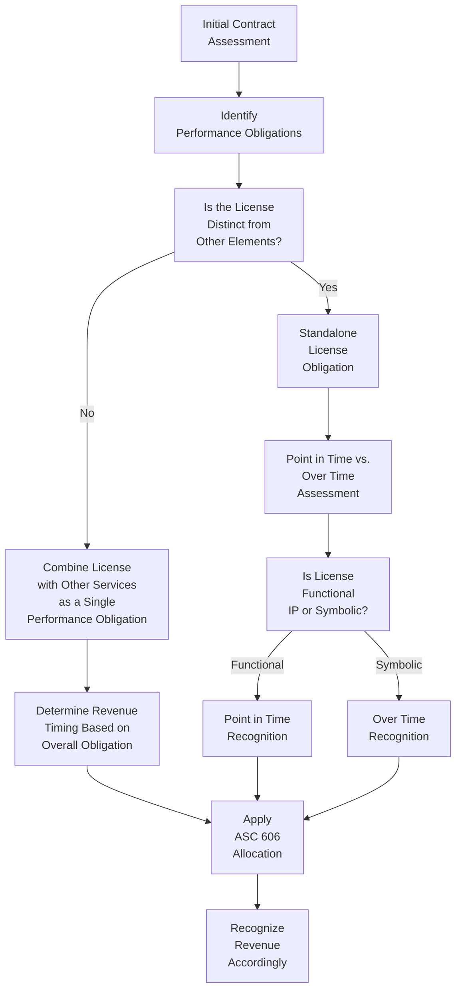
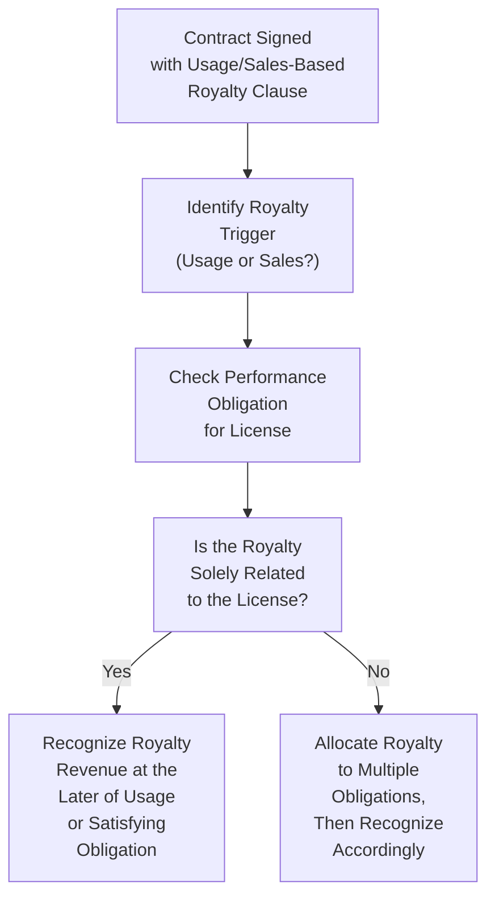

## 12.3 Licenses, Royalties, and Software/SaaS Arrangements

Revenue recognition for software licenses, intellectual property rights, and Software-as-a-Service (SaaS) arrangements can be significantly more complex than for traditional product or service-based revenues. As technology evolves and companies continue to create novel revenue models (e.g., subscription-based or usage-based), the need for a nuanced understanding of accounting rules becomes paramount. This section explores how to apply ASC 606 (Revenue from Contracts with Customers) and related guidance to licenses, royalties, and SaaS.

In this discussion, we will:
• Review the different types of license arrangements and royalty methods.  
• Explore the timing of revenue recognition under usage-based or sales-based royalties.  
• Delve into subscription-based models, including cloud or SaaS offerings.  
• Examine decision trees that help determine how to account for more complex software and intellectual property (IP) arrangements.  
• Highlight common pitfalls, best practices, and real-world examples.  

Readers may wish to revisit Section 12.1 Five-Step Model (ASC 606) and Section 12.2 Multiple Performance Obligations and Variable Considerations for foundational concepts around identifying the contract, distinct performance obligations, and determining transaction price.

--------------------------------------------------------------------------------

### Overview and the Five-Step Model Refresher

Under ASC 606, all revenue recognition stems from the five-step model:

1. Identify the contract(s) with a customer.  
2. Identify the performance obligations in the contract.  
3. Determine the transaction price.  
4. Allocate the transaction price to the performance obligations in the contract.  
5. Recognize revenue when (or as) the entity satisfies a performance obligation.

Licenses and royalties pose unique challenges for each step, particularly around identifying whether the license is distinct, determining transaction price for variable consideration (e.g., royalty related to usage or sales volume), and timing the recognition. For software and SaaS, you must also carefully assess whether the arrangement includes the right to use software (which is often recognized at a point in time) or the right to access software (which is recognized over time).

--------------------------------------------------------------------------------

### Types of Licenses

Broadly, a “license” under ASC 606 grants the customer a right to use or access an entity’s IP. In the context of software, technology, or media, IP can be licensed in various forms:

• Software License (Right to Use): Often a point-in-time recognition if the customer can substantially utilize the software as delivered.  
• SaaS or Cloud Services (Right to Access): Usually recognized over time because the customer accesses the software on an ongoing basis rather than taking possession.  
• Content or Media License: May involve variable payments or tiered royalty plans based on usage.  
• Patents and Trademarks: Typically recognized at a point in time unless the arrangement grants ongoing access or includes ongoing support/services.  

The nature of the promises in the contract drives whether revenue is recognized at a point in time or over time. ASC 606 also provides guidance on whether the license is distinct from other promised goods or services (see Section 12.2 for more on identifying multiple performance obligations).

--------------------------------------------------------------------------------

### Usage-Based and Sales-Based Royalties

One of the more intricate considerations in licensing agreements is variable consideration dependent on usage or sales volumes. Under ASC 606, usage-based or sales-based royalties must be recognized at the later of:
• When the subsequent sales or usage occurs; or  
• When the performance obligation to which the royalty relates is satisfied (or partially satisfied).

For example, a music streaming platform might pay an artist (or record label) a percentage of revenue based on the number of streams. ASC 606 directs that revenue for such variable consideration (the royalty) cannot be recognized until these streams actually occur and the performance obligation is satisfied.

#### Practical Example of Usage-Based Royalty
Imagine a software startup licensing its product to a manufacturing company, which pays a royalty of $0.05 per widget produced using the software. Under usage-based royalty rules, each month’s usage is accounted for after the widgets are produced, and the performance obligation (the right to use the software) is satisfied or being continuously satisfied. The licensor recognizes revenue once the widget production data becomes available and is verifiable.

--------------------------------------------------------------------------------

### Software Licensing vs. SaaS: Key Distinctions

Before diving deeper, it is critical to distinguish between “right to use” software licenses and “right to access” (SaaS) arrangements:

• Right to Use (Recognize at a Point in Time): In these licenses, the customer obtains a functional IP at contract inception. The software can operate without ongoing updates from the vendor. Revenue is generally recognized when control transfers—often at delivery.  
• Right to Access (Recognize Over Time): SaaS is essentially providing continuous access to the vendor’s software in a hosted environment (e.g., cloud subscription). The performance obligation is typically satisfied over time as the customer receives and consumes the benefits throughout the subscription period.

In practice, many technology contracts include hybrids of the two, such as perpetual licenses coupled with ongoing support or updates. Applying the five-step model carefully to unbundle performance obligations is paramount.

--------------------------------------------------------------------------------

### Decision Trees for Timing of Revenue Recognition

Complex agreements often require a structured approach to determine when and how much revenue to recognize. Below are two decision trees that illustrate a simplified approach to analyzing licensing arrangements, including usage-based and SaaS scenarios.

#### Decision Tree A: Licensing Arrangements

Explanation of Key Steps:
1. Determine whether there are other services bundled with the license (e.g., implementation, ongoing updates).  
2. If the license cannot function independently without these services, combine them as a single performance obligation.  
3. If the license is distinct (functional IP), revenue is often recognized at a point in time when control transfers. If symbolic (requires or benefits from ongoing updates, branding, or support), recognize over time.  
4. Allocate transaction price if there are multiple performance obligations.  

#### Decision Tree B: Usage-Based or Sales-Based Royalties

Explanation of Key Steps:
1. Confirm that the royalty payment indeed depends on future usage or sales.  
2. Verify if the royalty is tied exclusively to the IP license or if it spans multiple performance obligations.  
3. Recognize revenue for the usage-based royalty consistent with ASC 606’s requirement—at the later of usage occurrence or satisfaction of the performance obligation.

--------------------------------------------------------------------------------

### Recognizing Revenue for SaaS or Cloud-Based Services

When an arrangement provides ongoing access to a vendor’s hosted environment—often referred to as Software-as-a-Service (SaaS)—the customer does not typically gain possession of the software. Instead, the customer receives continuous access and benefits over the contract term. As a result:

• Revenue is recognized ratably, usually on a straight-line basis, or in proportion to benefits consumed if they can be reliably measured.  
• The performance obligation is satisfied over time since the customer simultaneously receives and consumes the benefits of the service.  
• Implementation, data migration, or integration services may be distinct or not, requiring separate evaluation.

#### Practical Example of SaaS Subscription  
A human resources (HR) technology company offers a three-year SaaS subscription to a mid-size organization, including initial setup and integration services. The question is whether the setup and integration services are distinct. If they are distinct, revenue from those services may be recognized once rendered. The ongoing SaaS subscription is recognized monthly over the subscription period.

--------------------------------------------------------------------------------

### Common Pitfalls and Challenges

1. Failing to Identify All Performance Obligations: Some companies lump together licensing, implementation, training, and maintenance services into one revenue stream, potentially misrepresenting the timing of each.  
2. Misclassifying a License as Functional vs. Symbolic: Errors here can lead to either premature or delayed revenue recognition.  
3. Handling Upfront Fees and Renewal Options Incorrectly: In software and SaaS contracts, companies often receive significant upfront fees or offer discounted renewal options, both of which may require deferral and step-by-step recognition.  
4. Inaccurate Assessment of Variable Consideration: Overlooking the constraints on variable consideration can lead to overstated or understated revenue.  
5. IFRS 15 Differences: While ASC 606 and IFRS 15 are largely converged, some differences exist in areas like intangible assets, principal vs. agent determinations, and certain licensure terms. International filers should pay close attention to IFRS 15’s guidance.

--------------------------------------------------------------------------------

### Case Study: Hybrid License and SaaS Model

#### Background  
A technology firm offers a three-year subscription to its accounting software. Under this contract, the customer:  
• Downloads a copy of the software for on-premise use (a perpetual license).  
• Receives periodic software updates (hosted in the cloud, so that the customer’s software interacts with the vendor’s platform).  
• Has the right to access the vendor’s proprietary AI analysis feature, which is cloud-based and updated continuously.  

#### Performance Obligations  
1. Perpetual Software License: The customer receives a functional IP at contract inception.  
2. Continuous AI Analysis Updates: Provided in the cloud environment, recognized over time.  
3. Periodic Software Updates: Could be combined with AI updates if they are not distinct in nature, or recognized separately if they are distinct.  

#### Allocation and Timing  
• The perpetual license portion is recognized at a point in time (delivery date) if the software is functional at that moment.  
• The AI analysis and updates are recognized over time as they are provided.  
• If the contract includes variable fees based on the volume of data analyzed by the AI, that portion is recognized under the usage-based royalty model.

This hybrid arrangement requires careful scoping and allocation of the transaction price among the license and the ongoing services. The compliance team must periodically verify usage data to record any variable revenue from data volume.

--------------------------------------------------------------------------------

### Best Practices and Implementation Tips

• Thoroughly Document Each Contract Clause: In tech and licensing agreements, small contract details can dramatically change the revenue recognition pattern.  
• Collaborate with Legal and Sales: Ensure that the legal wording around software usage and updates is clear about the nature of the services offered.  
• Leverage Historical Data for Variable Consideration: To estimate usage or sales-based royalty payments, companies may rely on historical trends, while applying the constraint on variable consideration to avoid revenue overstatement.  
• Review VSOE, BESP, or SSP: Under ASC 606, the concept of Vendor-Specific Objective Evidence (VSOE) from older guidance becomes the Standalone Selling Price (SSP). Timely updates to pricing data help avoid misallocation.  
• Monitor Renewal and Termination Clauses: Some software or SaaS contracts include options to renew, or they automatically transition to a month-by-month arrangement. Evaluate how those changes affect the performance obligations.  

--------------------------------------------------------------------------------

### IFRS Considerations

IFRS 15 is largely aligned with ASC 606 but can introduce nuances in areas such as:
• Control vs. Risks and Rewards: IFRS historically emphasized “risks and rewards” as an indicator of transfer of control.  
• Collectability Threshold: Both standards have requirements, though IFRS 15 may emphasize that the contract must be “probable” to collect.  
• Licenses of Intellectual Property: IFRS uses similar functional vs. symbolic distinctions but pay attention to local interpretations and IFRIC updates.

When operating globally, ensure that any differences in judgment or interpretation under IFRS 15 are documented in the company’s policy manuals and shared with cross-border teams.

--------------------------------------------------------------------------------

### References and Further Exploration

• FASB Accounting Standards Codification (ASC) 606, Revenue from Contracts with Customers  
• IFRS 15, Revenue from Contracts with Customers  
• AICPA Audit and Accounting Guide: Revenue Recognition  
• “Revenue Recognition: Licensing and Rights to Use IP,” Journal of Accountancy  
• The American Institute of CPAs (AICPA): Resources on Software Revenue Recognition  
• Online Courses:  
  – [LinkedIn Learning’s ASC 606 Masterclass](https://www.linkedin.com/learning/)  
  – [Coursera: IFRS 15 for Global Enterprises](https://www.coursera.org/)  

--------------------------------------------------------------------------------

## Quiz: Licenses and SaaS Revenue Recognition



### Which key factor differentiates a “right to use” software license from a “right to access” SaaS offering under ASC 606?

- [x] Whether the customer receives a deliverable that can function independently without ongoing updates
- [ ] The dollar amount of the contract
- [ ] The number of users licensed
- [ ] Whether the contract is signed digitally or on paper

> **Explanation:** A “right to use” license typically grants the customer control at a point in time without requiring ongoing updates. A “right to access” arrangement (like SaaS) involves continuous updates or hosting, so revenue is recognized over time.

### Which of the following best describes usage-based royalties under ASC 606?

- [x] Revenue is recognized at the later of the usage occurrence or satisfaction of the related performance obligation.
- [ ] Revenue is recognized immediately upon contract signing.
- [ ] Revenue must be deferred until all performance obligations are satisfied in full.
- [ ] Revenue is recognized on a straight-line basis over the contractual term.

> **Explanation:** ASC 606 stipulates that usage-based royalty revenue is recognized when the usage event occurs (e.g., number of units sold or hours used) and once any associated performance obligation is satisfied.

### If a software arrangement includes a perpetual software license and ongoing software updates that are essential for functionality, how might the performance obligations be treated?

- [x] The license and updates might be combined into a single performance obligation if they are not separately distinct.
- [ ] The license can always be separated from any update services.
- [ ] The updates do not qualify as performance obligations under ASC 606.
- [ ] The license and updates should never be combined under any circumstances.

> **Explanation:** If the updates are essential to the software’s functionality and cannot be used stand-alone, they may be bundled with the perpetual license into a single performance obligation.

### When is it appropriate to recognize revenue for a functional intellectual property (IP) license?

- [x] At the point in time when control of the IP transfers to the customer
- [ ] On a recurring monthly basis
- [ ] Only upon final acceptance by the customer’s legal counsel
- [ ] At contract inception, regardless of delivery

> **Explanation:** For functional IP, recognition occurs at the point in time the customer obtains control, typically when the product or software is delivered and can be immediately used.

### Which of the following is a common pitfall when recognizing revenue for software licenses?

- [x] Failing to accurately separate distinct performance obligations (e.g., license vs. support)
- [ ] Carefully documenting each service line item
- [x] Not applying any constraints to variable consideration
- [ ] Using a robust method to estimate standalone selling prices

> **Explanation:** Common pitfalls include not separating out distinct performance obligations and not applying constraints properly to variable consideration, leading to incorrect revenue recognition.

### In a SaaS model, what is typically the most accurate way to recognize the subscription fee?

- [x] Ratably over the subscription period, provided the benefits are consumed evenly
- [ ] Immediately upon signing of the subscription agreement
- [ ] Once half the time period has elapsed
- [ ] In full, only at contract expiration

> **Explanation:** Because SaaS is a continuous service, a straight-line approach over the subscription period is generally appropriate, recognizing revenue as the customer receives ongoing benefit.

### Under ASC 606, when is it permissible to recognize a sales-based royalty on a licensed IP?

- [x] At the later of the sales-based event or when the performance obligation is satisfied
- [ ] Immediately at contract inception
- [x] Upon receipt of customer’s purchase order
- [ ] In a lump sum at the end of the contract

> **Explanation:** For sales-based royalties, revenue is recognized at the later of the period in which the sales occur or the satisfaction (or partial satisfaction) of the associated performance obligation in the license arrangement.

### Which step should be taken first when determining the timing of revenue recognition for a hybrid software and SaaS contract?

- [x] Identify and separate performance obligations within the contract
- [ ] Immediately allocate the contract price
- [ ] Calculate the usage-based royalties
- [ ] Recognize revenue on the earliest possible date

> **Explanation:** The first step is to identify distinct performance obligations. This determines whether multiple obligations should be recognized separately (and possibly at different times).

### Which of the following statements best describes the concept of the “constraint on variable consideration” in ASC 606?

- [x] An entity must include variable consideration in the transaction price only to the extent it is probable that a significant reversal of revenue will not occur.
- [ ] All variable consideration must be included in full regardless of uncertainty.
- [ ] Variable consideration is recognized only if the contract is greater than one year.
- [ ] The entity cannot record any variable revenue until the end of the contract term.

> **Explanation:** ASC 606 states that variable consideration should be constrained to the amount for which it is probable that a significant revenue reversal will not occur upon resolution of the uncertainty.

### A license arrangement is deemed “symbolic” when:

- [x] The IP provides value to the customer only in conjunction with the entity’s ongoing or future activities
- [ ] The IP is functional and downloadable yet has limited features
- [ ] The entity and customer mutually own the IP
- [ ] The IP is provided as open-source

> **Explanation:** Symbolic IP depends on the licensor’s ongoing or future activities (e.g., brand support, continuous updates) for its utility. Therefore, revenue is recognized over time rather than at a point in time.



--------------------------------------------------------------------------------

## For Additional Practice and Deeper Preparation

### [Business Analysis and Reporting (BAR) CPA Mock Exams](https://www.udemy.com/course/bar-cpa-mock-exams/?referralCode=ADBE2E84BEE9CB6243CA)

**Business Analysis and Reporting (BAR) CPA Mocks:** 6 Full (1,500 Qs), Harder Than Real! In-Depth & Clear. Crush With Confidence!

- Tackle full-length mock exams designed to mirror real BAR questions.  
- Refine your exam-day strategies with detailed, step-by-step solutions for every scenario.  
- Explore in-depth rationales that reinforce higher-level concepts, giving you an edge on test day.  
- Boost confidence and minimize anxiety by mastering every corner of the BAR blueprint.  
- Perfect for those seeking exceptionally hard mocks and real-world readiness.  

_Disclaimer: This course is not endorsed by or affiliated with the AICPA, NASBA, or any official CPA Examination authority. All content is for educational and preparatory purposes only._
