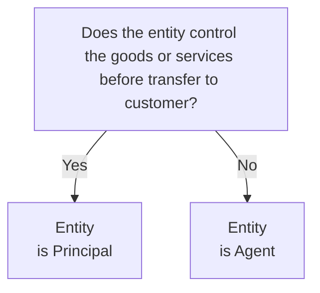
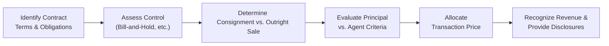

## 12.4 Advanced Scenarios and Disclosures

Revenue recognition under ASC 606 often extends well beyond the basic five-step model outlined in Section 12.1. Certain industries and transactions require advanced treatment and nuanced consideration of facts and circumstances. This section delves into complex areas such as bill-and-hold arrangements, consignment sales, and principal-versus-agent considerations. We also explore the related disclosure requirements that ensure transparent, consistent, and faithful representation of financial statements. By thoroughly understanding these advanced topics, you will be better equipped to identify relevant performance obligations, allocate revenue appropriately, and present disclosures in a way that aligns with both ASC 606 and broader industry best practices.

This chapter builds upon Sections 12.1–12.3, where we covered the five-step revenue recognition model and multiple performance obligation scenarios. Here, we expand our toolkit, discussing the intricacies and pitfalls unique to specialized transactions. We also consider how companies present and disclose these complex arrangements, so that internal and external stakeholders receive the most accurate information possible.

---
  
## Overview of Advanced Scenarios

Below, we examine three major categories of advanced scenarios:
• Bill-and-hold: Revenue recognized before physical delivery under strict criteria.  
• Consignment: The transfer of goods to an intermediary for eventual sale to an end customer.  
• Principal vs. Agent: Determining whether the entity controls the goods or services prior to transfer.

Each scenario introduces its own complexities and significant judgments. ASC 606 demands robust documentation of management’s assumptions and analysis, including the reasoning behind revenue recognition timing.

---
  
## Bill-and-Hold Arrangements

Bill-and-hold arrangements occur when an entity bills a customer for goods or materials yet retains physical possession on the customer’s behalf. These scenarios commonly arise in the manufacturing and distribution industries—particularly where the customer lacks immediate warehouse capacity or requests deferred shipment. Under ASC 606, the criteria to recognize revenue on bill-and-hold transactions are stringent:

1. The reason for the bill-and-hold arrangement must be substantive.  
2. The product must be identified separately as belonging to the customer.  
3. The product must be ready for physical transfer at any time.  
4. The entity cannot use the product or direct it to another customer.

If these conditions are met, control of the product effectively transfers to the customer, allowing revenue recognition. Otherwise, recognition should be deferred until actual transfer occurs.

### Practical Example - Bill-and-Hold
Suppose Greenfield Machinery sells large industrial generators to a customer who requests delayed shipment due to a facility upgrade that won’t be completed for three months. Greenfield and the customer sign a contract indicating that the generators are segregated, the manufacturing is complete, and the customer has legal title. Greenfield cannot redirect these items to other buyers. Greenfield also documents the substantive reason (unfinished facility) for the arrangement. Here, Greenfield may recognize revenue under a bill-and-hold arrangement once the performance obligations are satisfied (generators are complete and identified for the customer), assuming all other criteria are met.

#### Challenges & Pitfalls
• Failing to properly segregate inventory or continuing to use it for other purposes.  
• Not having a substantive business reason for the arrangement, thus risking early revenue recognition.  
• Inadequate documentation, leading to audit scrutiny and possible restatements.

---
  
## Consignment Arrangements

Under a consignment arrangement, an entity (consignor) transfers goods to another party (consignee), who will then sell the goods to an end customer. The consignee does not assume the usual risks and obligations of ownership; rather, the consignor remains the owner of the goods until a sale to an end customer occurs.

### Criteria for Consignment Accounting
ASC 606 provides specific guidance for consignment arrangements. Generally, these are the key indicators that a transaction is a consignment:
1. The product is controlled by the entity (consignor) until a specified event occurs (e.g., sale to a third party).  
2. The consignor can require the return or transfer of the product to another party.  
3. The consignee does not have an unconditional obligation to pay for the products (unless they are sold to a third party).

Revenue for a consignor is typically recognized upon “sale” to the end customer, when control of the product is transferred to that third party. Prior to that transfer, the consignor continues to carry the goods as inventory on its own balance sheet.

### Practical Example - Consignment
Firebrand Clothing ships 500 premium jackets to a boutique retailer, Harper’s Apparel, on a consignment basis. Harper’s Apparel does not pay Firebrand until the jackets are sold, nor does Harper’s Apparel assume the risk if the jackets remain unsold. Firebrand retains legal title to the jackets, and after 120 days, any unsold items are either returned to Firebrand or shipped to a different retailer. Firebrand will not recognize revenue until Harper’s Apparel sells the jackets to end customers. At that point, Firebrand derecognizes its inventory (the sold jackets) and records revenue based on the consignment arrangement.

#### Common Pitfalls
• Mistakenly recognizing revenue when goods first arrive at the consignee’s location, rather than waiting until end-customer sale.  
• Inadequate tracking of returned goods or goods reallocated to another consignment channel.  
• Misclassifying transactions as outright sales rather than consignment if certain performance obligations have yet to be fulfilled.

---
  
## Principal vs. Agent Considerations

The principal-versus-agent assessment under ASC 606 requires an entity to determine whether it has control of the underlying goods or services before transferring them to the customer. If the entity is acting as a principal, it records revenue at the gross amount. If it is acting as an agent, it records only the net fee or commission.

### Key Factors in Assessing Principal vs. Agent
1. **Control**: Does the entity control the goods or services before they are transferred to the customer?  
2. **Inventory Risk**: Does the entity bear inventory risk before or after the goods have been transferred to the customer?  
3. **Pricing Discretion**: Does the entity have the discretion to set the price for the goods or services?  
4. **Primary Responsibility**: Does the entity have the primary responsibility to provide the specified goods or services, or to remedy defects or issues?

If an entity satisfies these factors, it is typically deemed a principal. Otherwise, it acts as an agent, recognizing only its fee or commission as revenue.

### Practical Example - Rental Car Marketplace
Imagine a company called SpeedyRide, which operates a digital platform connecting vehicle owners with renters. Owners list their vehicles at rates they choose, while SpeedyRide only facilitates the platform and collects a fee. SpeedyRide does not take possession or control of the vehicles. Also, owners bare all risks concerning damages and maintenance. SpeedyRide’s involvement largely consists of matchmaking and providing an interface for payments. Under ASC 606, SpeedyRide is an agent because it does not control the vehicles before they are transferred to the renter. Hence, it recognizes only its service fee.

By contrast, if SpeedyRide purchased or leased vehicles from owners and then rented them out to customers at rates SpeedyRide sets, bearing the risks of ownership, SpeedyRide would likely be considered the principal, collecting gross revenue from the transactions.

---
  
## Flowcharts for Illustrating Complex Scenarios

Below is a Mermaid diagram depicting a hypothetical decision flow when determining whether an arrangement is principal or agent. 

Use this simple framework as a starting point, but remember to consider relevant details like who bears inventory risk, price-setting authority, and primary responsibility for meeting the performance obligation.

---
  
## Disclosures Under ASC 606

Whether dealing with bill-and-hold, consignment, or principal vs. agent scenarios, disclosures provide necessary transparency into the nature, amount, timing, and uncertainty of revenue and cash flows arising from contracts with customers. Key disclosure items include:

1. **Disaggregation of Revenue:** Companies must disclose how they categorize revenue recognized during the period, including geographical regions, product lines, contract types, and other meaningful breakdowns.  
2. **Performance Obligations:** Descriptions of performance obligations, when they are typically satisfied, and significant payment terms.  
3. **Significant Judgments:** Entities must describe judgments used in applying ASC 606, particularly those that significantly affect the determination of the transaction price and the allocation of that price to performance obligations.  
4. **Contract Balances:** The opening and closing balances of contract assets and liabilities, and how revenue recognized relates to changes in these balances.  
5. **Remaining Performance Obligations (Backlog):** A quantitative or qualitative explanation of the amounts allocated to remaining performance obligations and when they are expected to be recognized as revenue.  
6. **Cost to Obtain or Fulfill a Contract:** If an entity has capitalized certain contract acquisition or fulfillment costs, it should provide details on the nature of these costs and subsequent amortization.

For advanced scenarios, additional disclosures may be required or strongly encouraged:

• **Bill-and-Hold**: Management’s justification for using bill-and-hold, an explanation of why control is transferred to the customer, and any additional contractual arrangements (e.g., insurance coverage or ownership risk retention).  
• **Consignment**: A description of consignment arrangements, including the approximate amount of inventory on consignment at the end of the reporting period, and the terms under which unsold goods are returned to the consignor.  
• **Principal vs. Agent**: The judgments around whether the entity is acting as an agent or a principal, including the specific criteria leading to that conclusion.

---
  
## Additional Complexity: Multiple Performance Obligations

Advanced scenarios sometimes include multiple performance obligations. For example, a consignment arrangement could also include embedded services, such as marketing or packaging. In such cases, entities should:

1. Identify all distinct performance obligations.  
2. Allocate the transaction price to each performance obligation based on standalone selling prices.  
3. Recognize revenue when (or as) each performance obligation is satisfied.

A typical formula for allocating transaction prices when there are multiple performance obligations is:

$$
\text{Allocated Price for Obligation}_i 
= \left(\frac{\text{Standalone Selling Price}_i}{\sum_{j=1}^{n} \text{Standalone Selling Price}_j}\right)
\times \text{Transaction Price}
$$

---
  
## Real-World Illustration: Combining Bill-and-Hold with Principal vs. Agent

Consider a technology distributor, FutureTek, that orders high-demand electronics from a manufacturer and “holds” the items in FutureTek’s warehouse under a bill-and-hold arrangement requested by a retail chain (RetailCo). RetailCo has already paid for the electronics in anticipation of a big promotional event. FutureTek also enters into an agreement to use a third-party logistics company (LogiPlus), which physically ships the electronics to various RetailCo locations upon request.

Now, questions arise:
1. **Is FutureTek a principal or an agent?**  
   - FutureTek purchased the electronics from the manufacturer, so it bears inventory risk (unless the contract says otherwise).  
   - FutureTek sets the resale pricing to RetailCo, which suggests control over the product.  

2. **Does the arrangement meet bill-and-hold criteria?**  
   - RetailCo has a legitimate business reason (awaiting promotional timing).  
   - The electronics are separately identified in FutureTek’s warehouse and are not sold to other customers.  
   - FutureTek does not have the ability to redirect these items. RetailCo has legal title.  

In this scenario, as soon as all the bill-and-hold criteria are met, FutureTek can recognize revenue, provided it is determined to be the principal and responsible for fulfilling the performance obligation. FutureTek would also detail in disclosures the nature of its principal relationship, including its inventory risk and how it justifies recognizing revenue under a bill-and-hold arrangement prior to physical shipment.

---
  
## Best Practices and Recommendations

1. **Document Thoroughly**: Develop comprehensive policies explaining the rationale for advanced scenarios like bill-and-hold. Maintain robust documentation for each contract.  
2. **Evaluate Legal Title and Risk Transfer**: Legal title transfer alone does not guarantee revenue recognition, but it is a strong indicator if accompanied by transfer of control.  
3. **Monitor Practical Expedients**: ASC 606 allows certain practical expedients, but ensure their usage is clearly disclosed if adopted (e.g., for shipping and handling).  
4. **Consult Industry-Specific Guidance**: Several industries (e.g., software, real estate, entertainment) have specialized practices that interpret bill-and-hold or consignment under the lens of existing industry conventions.  
5. **Communicate Clearly with Stakeholders**: CFOs, auditors, controllers, and operational managers must be aligned on the contract terms, particularly regarding inventory risk, shipping arrangements, and the nature of control.

---
  
## Mermaid Diagram: High-Level Contract Review Process

Below is another Mermaid flowchart illustrating a high-level revenue recognition review process for advanced scenarios (bill-and-hold, consignment, principal vs. agent). This helps guide practitioners in deciding how to apply ASC 606:

---
  
## Common Pitfalls and Challenges

1. **Incorrect Timing of Revenue Recognition**: Either too early or too late due to misapplication of bill-and-hold or consignment rules.  
2. **Insufficient Evidence of Control Transfer**: Incomplete documentation that fails to prove the customer has control (and risks and rewards), leading to possible restatement.  
3. **Overlooking Changes in Facts and Circumstances**: Consignment or principal-agent conclusions might evolve over the life cycle of a contract. Failing to reassess can lead to material misstatements.  
4. **Inadequate Disclosures**: Summarized or generic disclosures that fail to address the specifics of bill-and-hold, consignment, or principal-versus-agent determinations.

---
  
## Case Study: Integrated Bill-and-Hold with Consignment Elements

Imagine a large wholesale electronics producer, PhotonTech, that enters into an agreement with a single retailer, GigaMart, and an online sales channel, eBuy. PhotonTech’s arrangement with GigaMart states that:

• PhotonTech will manufacture and set aside 10,000 smartphones under a bill-and-hold arrangement for three months, after which GigaMart will take possession.  
• If, after three months, the smartphones are not fully sold at GigaMart’s stores, PhotonTech reserves the right to transfer remaining unsold inventory to its own distribution channels or to another retailer.  

At the same time, PhotonTech’s contract with eBuy states that eBuy will list the smartphones on its platform, while PhotonTech retains ownership, sets the sales price, and takes responsibility for handling returns. Here, the first contract implies a bill-and-hold scenario with GigaMart. However, if PhotonTech can recall the goods and direct them to eBuy, the arrangement may also have consignment features. PhotonTech must carefully assess:

1. Whether it truly transferred control to GigaMart initially (bill-and-hold) or if it is maintaining control (consignment).  
2. The triggers for revenue recognition if GigaMart transitions from a buyer to a consignee.  
3. Disclosure of these layered relationships and management’s judgments.

Such multifaceted scenarios underscore the complexity in applying ASC 606. For exam preparation, candidates should practice identifying these nuanced contract features early to determine whether a transaction is a true sale with the right to return (subject to variable consideration), consignment, or something else.

---
  
## References and Further Reading

• ASC 606, Revenue from Contracts with Customers (FASB Codification Topic 606)  
• AICPA Audit and Accounting Guide: Revenue Recognition  
• IFRS 15, Revenue from Contracts with Customers (for contrast with U.S. GAAP)  
• FASB website: [https://www.fasb.org](https://www.fasb.org)  
• SEC Staff Accounting Bulletin: Topic 13, Revenue Recognition (legacy guidance with helpful historical context)

Equipment leasing, construction projects, and software licenses often have unique permutations of the advanced issues discussed here. Refer to industry-specific guidance if you operate in or audit those sectors.

---

## Sharpen Your Knowledge: Advanced Revenue Recognition Scenarios Quiz



### Which of the following is a core requirement for recognizing revenue in a bill-and-hold arrangement under ASC 606?

- [x] The product is separately identified as belonging to the customer and is ready for physical transfer any time.
- [ ] The seller must agree to purchase the product back at a later date.
- [ ] The customer must deposit at least 50% of the contract price.
- [ ] The seller can substitute similar items at its own discretion.

> **Explanation:** In a bill-and-hold arrangement, the product must be completed, set aside for the customer, and available for immediate delivery. Substituting products or using them for alternative purposes could prevent revenue recognition.

### In a consignment arrangement, revenue is typically recognized by the consignor:

- [ ] When the goods are shipped to the consignee.
- [ ] When the consignee acknowledges receipt of the goods.
- [x] When the end customer buys the goods from the consignee.
- [ ] When the consignor records a receivable for the goods.

> **Explanation:** Under consignment, the consignor retains control of the goods until the end customer’s purchase. This is the point at which the performance obligation is satisfied.

### Which factor most strongly suggests an entity is acting as a principal rather than an agent?

- [x] The entity has control of the goods before transferring them to the customer.
- [ ] The entity is an online marketplace that only sets payment terms but not product pricing.
- [ ] The entity collects a fixed percentage commission for each transaction.
- [ ] The entity never has inventory risk.

> **Explanation:** A critical factor for principal classification is whether the entity controls the goods or services before transferring them to the customer. Control typically implies inventory risk and discretion over pricing.

### An example of a substantive reason for requesting a bill-and-hold arrangement is:

- [ ] The customer wants to keep its reported inventory lower for credit purposes.
- [x] The customer’s warehouse is under renovation and cannot store products yet.
- [ ] The seller does not have enough shipping boxes.
- [ ] The seller wants to expedite revenue recognition.

> **Explanation:** ASC 606 requires a legitimate business purpose for bill-and-hold. A temporary or physical constraint (such as an unavailable warehouse) supports a real business reason.

### When determining whether an arrangement is a consignment, all of the following are typical indicators except:

- [x] The buyer pays cash upfront before the product ships.
- [ ] The consignee does not have an unconditional obligation to pay for the product.
- [x] The consignor can require return of unsold products.
- [ ] The consignor controls the products until sold to a third party.

> **Explanation:** If the buyer is truly paying upfront and accepting risks, that is more akin to an outright sale, not consignment. Consignees typically only pay the consignor after a successful sale to a third party.

### In principal vs. agent evaluations, how does the ability to set pricing influence the conclusion?

- [x] Having full or substantial discretion over pricing strongly indicates a principal role.
- [ ] Pricing discretion does not matter under ASC 606.
- [ ] Setting price always makes an entity an agent.
- [ ] Pricing discretion is relevant only if goods are intangible.

> **Explanation:** ASC 606 notes that pricing discretion is a hallmark of control; the more pricing control an entity has, the more it points to principal classification.

### If a retailer requests that products remain in the seller’s facility, but the arrangement fails one of the bill-and-hold criteria, the correct treatment for revenue is:

- [x] Defer recognition until control transfers by another acceptable method (e.g., physical delivery).
- [ ] Recognize revenue immediately because the contract has been signed.
- [ ] Recognize partial revenue equal to production costs.
- [ ] Recognize revenue over time based on the pass of control at the retailer’s request.

> **Explanation:** If a bill-and-hold arrangement does not meet ASC 606 requirements, revenue must be deferred until another indicator of control transfer exists (e.g., physical delivery).

### For consignment arrangements, which of the following best describes how inventory is reported?

- [x] It generally remains on the consignor’s balance sheet until sold to a third party.
- [ ] It switches to the consignee’s balance sheet as soon as items are shipped.
- [ ] The consignee typically capitalizes it as work-in-process.
- [ ] No entity reports it as inventory because it is unowned property.

> **Explanation:** In consignment, goods remain the property of the consignor until sold to an end customer. The consignee never actually owns the inventory.

### Under principal vs. agent analysis, if an entity is deemed an agent, how should revenue be recorded?

- [x] The entity should record revenue at the net amount (its agent fee or commission).
- [ ] The entity should record revenue gross for the entire transaction price.
- [ ] The entity must recognize no revenue until the principal is paid.
- [ ] The entity applies the cost recovery method until all fees are collected.

> **Explanation:** Agents record revenue net of amounts owed to the principal, reflecting only their fee or commission for facilitation.

### True or False: A seller can only recognize revenue in a bill-and-hold scenario if the product is separately identified for a specific customer’s future delivery.

- [x] True
- [ ] False

> **Explanation:** If a seller can freely substitute identical products intended for other buyers, control may not have transferred to the customer, inhibiting immediate revenue recognition in a bill-and-hold scenario.



---

## For Additional Practice and Deeper Preparation

### [Business Analysis and Reporting (BAR) CPA Mock Exams](https://www.udemy.com/course/bar-cpa-mock-exams/?referralCode=ADBE2E84BEE9CB6243CA)  

**Business Analysis and Reporting (BAR) CPA Mocks:** 6 Full (1,500 Qs), Harder Than Real! In-Depth & Clear. Crush With Confidence!

- Tackle full-length mock exams designed to mirror real BAR questions.  
- Refine your exam-day strategies with detailed, step-by-step solutions for every scenario.  
- Explore in-depth rationales that reinforce higher-level concepts, giving you an edge on test day.  
- Boost confidence and minimize anxiety by mastering every corner of the BAR blueprint.  
- Perfect for those seeking exceptionally hard mocks and real-world readiness.  

_Disclaimer: This course is not endorsed by or affiliated with the AICPA, NASBA, or any official CPA Examination authority. All content is for educational and preparatory purposes only._
