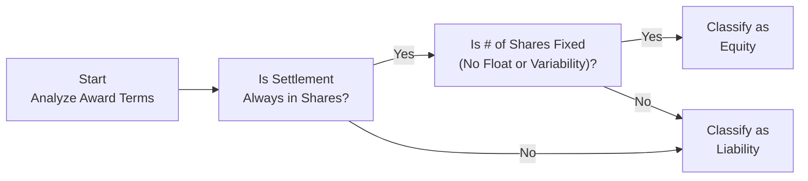

## 13.1 Equity vs. Liability Awards

Stock-based compensation plans are a vital tool for organizations seeking to align employee interests with shareholder value. However, determining whether these awards should be classified as equity or liability instruments can be challenging. Such classification directly affects how these awards are measured, how they appear on the balance sheet, and how they ultimately impact net income and equity obligations. In this section, we will explore the criteria that govern the classification, provide real-world illustrations, and outline best practices and pitfalls to avoid. Understanding these fundamentals is crucial not only for passing the BAR Examination but also for ensuring accurate financial reporting and robust decision-making in practice.

-------------------------------------------------------------------------
  
### Overview and Key Differences

Equity-classified awards boost an entity’s overall equity balance and usually do not generate cash payments to employees once the awards vest (except for minimal tax withholding in certain scenarios). By contrast, liability-classified awards can require future cash settlements or return of assets, creating an ongoing obligation on the entity’s balance sheet. Because liability awards can significantly affect a company’s cash flows, it is critical for accountants and financial analysts to properly identify the triggers and handle the accounting.

Under U.S. GAAP (particularly ASC 718, Compensation—Stock Compensation), certain conditions and features of an award dictate whether it is treated as equity or a liability. While the broad conceptual framework for classification remains consistent across awards, some nuances may arise due to vesting conditions, performance targets, and settlement alternatives. IFRS (IFRS 2, Share-based Payment) follows a similar approach but contains important differences, which are addressed more thoroughly in Chapter 23 (Emerging Issues in Accounting and Analysis) when comparing IFRS vs. U.S. GAAP.

-------------------------------------------------------------------------
  
### Key Classification Criteria

Three major considerations guide the classification of stock-based awards:

1. **Settlement Features**  
   - If an award **must** be settled in a variable number of shares or in cash, it generally meets the definition of a liability.  
   - If an award can be settled in a fixed number of shares, and the entity always has the option to deliver shares (rather than cash), it likely meets the definition of an equity instrument.

2. **Monetary Conditions**  
   - If an award’s value is tied to a market measure (e.g., share price) in a way that results in an obligation to pay, it can create a liability.  
   - Conversely, if there is no explicit or implicit obligation to pay in cash, the award is more likely to be classified as equity.

3. **Contingencies and Redemption Features**  
   - If a financial instrument can be redeemed at the holder’s discretion, or if it includes conditional redemption features (such as a guaranteed return on investment) that obligate the issuer to deliver cash, it may be treated as a liability.  
   - Equity instruments typically have no redemption feature (other than broad corporate events such as liquidation, which do not trigger reclassification).

When analyzing these factors, companies must consider both explicit contractual provisions and implicit or indirect obligations. In some cases, laws and regulations may create implicit obligations. For more details on how legal or regulatory constraints affect classification, see Chapter 17 (Public Company Reporting Essentials) regarding certain SEC rules on settlement alternatives.

-------------------------------------------------------------------------
  
### Equity Awards in Practice

Equity awards, such as stock options or restricted stock units (RSUs) settled solely in shares, are classified as equity instruments. This classification is appropriate when:

• The number of shares to be issued is fixed and determinable at grant date.  
• There is minimal or no ability on the part of the recipient to demand a cash settlement.  
• The issuing entity retains the right to deliver shares upon settlement and does not have an obligation to use cash.  

Once an award is determined to be equity-classified, the fair value is measured at the grant date and generally **not** remeasured subsequently for changes in fair value. Any recognized compensation cost is a direct increase in **additional paid-in capital (APIC)** within shareholders’ equity.

#### Example: Plain-Vanilla Stock Option
ABC Corporation grants a stock option to an employee that vests over three years, allowing the employee to buy 1,000 shares of ABC’s stock at a fixed exercise price of $50 per share. The option has no redemption feature, no guaranteed cash settlement, and can only be settled by issuing shares. Under these conditions:  
- The option is equity-classified.  
- ABC measures the fair value at the grant date using an option-pricing model (e.g., Black-Scholes).  
- ABC records compensation expense over the vesting period, with a corresponding increase in equity (in APIC).

-------------------------------------------------------------------------
  
### Liability Awards in Practice

If an award can be or must be ultimately settled in cash (or another form of asset), or if there is a variation in the expected number of shares to be delivered that cannot be determined at the grant date, the award often meets the definition of a liability.

Under U.S. GAAP, liability-classified awards are generally remeasured to fair value at each reporting date until settlement, with changes in fair value recognized in **compensation expense** (net income). Because of this ongoing remeasurement, liability awards can introduce heightened volatility into an entity’s financial statements.

#### Example: Cash-Settled Stock Appreciation Rights (SARs)
XYZ Corporation grants SARs to employees, enabling them to receive in cash the excess of the market price of XYZ’s stock on the exercise date over the exercise price established at grant date. Since settlement is in cash, the award is liability-classified. For each reporting period:  
- XYZ must remeasure the fair value of the SAR liability based on the current stock price.  
- Any change in this fair value, whether gain or loss, affects net income in that period.  

-------------------------------------------------------------------------
  
### Deciding Between Equity vs. Liability Classification

Because the classification drives the accounting treatment—particularly the timing and measurement of compensation cost—it is vital that organizations understand the triggers. Below is a simplified decision-making flowchart, illustrating the classification approach. Note that real-world scenarios can be more complex and may require detailed reading of contractual clauses and authoritative literature.

Explanation of Flowchart:
• **Step A**: Assess whether the award terms specify share settlement, cash settlement, or provide a choice.  
• **Step B**: If settlement is always in shares, you proceed to check whether the number of shares is *fixed and determinable.*  
• **Step C**: If the number of shares is truly fixed, the award is typically equity-classified. When variability is introduced (e.g., stock price performance conditions that require more shares to be issued or reduce the number of shares), liability classification may become necessary.  
• **Step D**: If settlement can or must be in cash, if the number of shares is not fixed, or if other triggers indicate a mandatory cash redemption, liability classification applies.  
• **Step E**: If the conditions for equity classification are conclusively met, the instrument remains in this classification for the rest of its life unless a subsequent modification triggers reclassification.

-------------------------------------------------------------------------
  
### Common Triggers Leading to Liability Classification

Even when an award is intended to be an equity instrument, certain triggers can tilt it toward liability classification. Watch out for:

• **Contingent Cash Settlement Provisions**  
  If an award has a provision that states, “In the event of a change in control, stock options will be redeemed for $X per share,” the employee has an enforceable claim for cash, classifying the award as a liability (at least beyond the equity portion).  

• **Reload Features**  
  If the plan is designed so that exercised options automatically generate new options under certain conditions, the complexity may affect classification if the number of shares to be issued becomes indefinite.  

• **Put or Call Rights**  
  If holders (employees) can “put” their shares back to the company for a compensatory price, or if the company is obligated to purchase the shares from employees in certain scenarios, classification as a liability is strongly signaled.  

• **Performance or Market Conditions**  
  When performance or market conditions create variability in the amount of stock or cash delivered, or the possibility that the company will need to pay cash instead of shares, liability accounting might be triggered.  

• **Indexing and Embedded Derivatives**  
  If the award’s value is indexed to a factor other than the company’s own stock (for instance, referencing a basket of competitor stocks or a broader market index), it may be treated as a derivative liability.

-------------------------------------------------------------------------
  
### Changes and Reclassifications

While equity awards are generally measured once at grant date and not remeasured thereafter, liability awards require continuous remeasurement until settlement. However, changes in classification can occur if certain modifications happen.

#### Modifications
When the terms of an award are modified, companies must reassess classification. For example, if a plan initially provided for share settlement but is modified to allow for cash settlement, reclassification from equity to liability is typically required, and the liability is measured at fair value as of the date of the modification. Subsequent changes in fair value flow through the income statement.

#### Vesting vs. Non-Vesting
Unvested awards and modifications to vesting schedules can trigger fresh classification judgements. For more insights on how vesting conditions (performance, service, and market-based) are accounted for, see Section 13.3 (Vesting Conditions, Performance Features, and Forfeitures).

-------------------------------------------------------------------------
  
### Balance Sheet Implications

• **Equity Instruments**  
  – Increase in **Additional Paid-In Capital (APIC)** and potentially **Common Stock** (upon exercise or issuance).  
  – No liability recognized for potential cash outflow, unless certain tax withholding or early-exercise features exist.  

• **Liability Instruments**  
  – Recognized as a **liability** in the balance sheet (often in the “Other Liabilities” or “Accrued Compensation” section).  
  – Must be fair valued at each period-end, causing **volatility** in reported net income.  
  – Potentially significant effect on financial ratios such as debt-to-equity and current ratio.  

From an investor’s standpoint, liabilities signal legal or constructive obligations, whereas equity indicates ownership interest. Overstating or understating liabilities by misclassifying awards can mislead stakeholders about the economic obligations faced by the enterprise. Maintaining classification accuracy is thus a cornerstone of transparent financial reporting.

-------------------------------------------------------------------------
  
### Income Statement Effects

• **Equity-Classified Awards**  
  – Compensation cost is generally **locked in** at the grant date fair value and recognized **ratably** over the requisite service period.  
  – Future fluctuations in the share price do not impact recognized expense once the value is set.  

• **Liability-Classified Awards**  
  – Compensation expense is **remeasured** at each reporting date, reflecting the updated fair value of the liability.  
  – Can introduce **significant volatility** to the income statement, especially for entities with large volumes of stock payable awards.  

In practice, organizations must maintain robust internal controls to ensure that remeasurements for liability awards are accurate and that modifications or changes in settlement options are promptly captured.

-------------------------------------------------------------------------
  
### Cash Flow Considerations

Equity awards typically do not involve direct outlays of cash by the company (beyond minimal payroll tax withholding). Liability awards, on the other hand, may require substantial future cash payments. This distinction can be material for budgeting and liquidity planning, particularly for growing companies that rely heavily on share-based compensation to conserve precious cash resources.

-------------------------------------------------------------------------
  
### Real-World Case Study: ABC Tech, Inc.

**Scenario**  
ABC Tech, Inc. grants both restricted stock units (RSUs) that settle in shares and stock appreciation rights (SARs) with cash settlement features. Initially, all employees choose the RSUs, resulting in equity classification. Over time, ABC Tech drastically grows, and employees start preferring liquidity. The company modifies a portion of RSUs to permit optional cash settlement.  

**Outcome**  
• **Pre-Modification**: The RSUs were recognized as equity awards at grant date fair value. Compensation expense was recognized over the vesting period.  
• **Post-Modification**: The awards must now be remeasured in each reporting period because employees can elect to receive cash. This triggers liability classification. ABC Tech recognizes a liability on its balance sheet equal to the fair value of those awards at period-end.  
• **Financial Impact**: Because ABC Tech’s share price soared, the liability for outstanding SARs and converted RSUs significantly increases each quarter. As a result, the company’s net income experiences greater volatility due to repeated upward revisions in the liability.  

**Lessons Learned**  
1. Even if an award starts as equity-classified, modifications can force reclassification to liability.  
2. The volatility of stock prices influences net income significantly once awards are designated as liabilities.  
3. Thorough documentation of changes in award terms is crucial for accurate and timely reclassification.

-------------------------------------------------------------------------
  
### Best Practices and Common Pitfalls

Below are selected best practices, along with some pitfalls to avoid, helping you navigate classification complexities:

**Best Practices**  
• **Document Every Clause**: Keep a repository of key provisions for each award type, including redemption features, performance conditions, and settlement alternatives.  
• **Stay Current with Accounting Standards**: Updates to ASC 718 or relevant SEC guidance can change classification approaches. Regularly review the FASB’s Accounting Standards Codification for newly issued amendments.  
• **Maintain Clear Communication**: Coordinate with HR, legal, and treasury departments to ensure that all parties understand the settlement terms, potential modifications, and timing.  
• **Periodic Training**: Because remeasurement for liability awards recurs quarterly (for public companies) or annually at minimum, train your accounting staff on how to properly mark the liability to market.  

**Pitfalls**  
• **Overlooking Implicit Cash Rights**: Some awards may have indirect or implied features (like the company’s established practice of buying back shares) that turn otherwise equity-classified instruments into liabilities.  
• **Ignoring Market Volatility**: Liability awards can introduce substantial net income swings, which can catch unprepared managers or analysts off guard.  
• **Miscommunication**: HR teams might promise employees certain features or cash settlement options without informing Finance, leading to incorrect initial classification.  
• **Non-Compliance with Disclosure Requirements**: Both ASC 718 and SEC Regulations S-X and S-K require detailed explanatory footnotes about share-based payments and classification. Missing these disclosures can trigger headaches during audits.

-------------------------------------------------------------------------
  
### Cross-Reference to Other Sections

• **Section 13.2 (Measurement at Grant Date and Subsequent Changes)**: Offers deeper guidance on valuing stock-based compensation, including calculation of fair values for equity vs. liability awards.  
• **Section 13.3 (Vesting Conditions, Performance Features, and Forfeitures)**: Describes how vesting triggers, performance conditions, and forfeiture rates interact with classification.  
• **Section 9.4 (Discount Rates, Premiums, and Synergy Assessments)**: Even though primarily about valuation in M&A, the discussion on discount rates can inform fair value measurement for liability awards.  
• **Chapter 23 (Emerging Issues in Accounting and Analysis)**: Compares IFRS 2 and ASC 718, addresses new trends in crypto-linked compensation, and highlights potential classification nuances for such instruments.

-------------------------------------------------------------------------
  
### Summary and Takeaways

Navigating the classification of stock-based awards as equity or liability is integral to achieving clarity in financial reporting. The classification has ripple effects on the balance sheet, income statement, and cash flow statement. Equity awards provide less volatility but come with a fixed accounting cost recognized over time. Liability awards, though potentially providing employees with more liquidity, can cause greater volatility in reported earnings and impact an entity’s liquidity planning.

Mastering the triggers and decision trees between equity vs. liability classification is essential for success in the BAR Examination. Moreover, real-world practitioners must communicate effectively across HR, treasury, legal, and finance teams to avoid classification errors. As share-based compensation structures become more intricate—through performance conditions, contingent features, or embedded derivatives—the risk of misclassification escalates. By adhering to the framework described in U.S. GAAP (ASC 718), using robust internal controls, and remaining alert to modifications, professionals can effectively manage and report on stock-based compensation arrangements.

-------------------------------------------------------------------------
  
## Master Your Knowledge: Equity vs. Liability Awards Quiz



### How do awards classified as equity typically impact the balance sheet over time?

- [x] They increase additional paid-in capital and are not remeasured after grant date.
- [ ] They are recognized as a liability and remeasured at each reporting period.
- [ ] They create retained earnings liabilities before vesting.
- [ ] They result in the issuance of convertible debt instruments for the employer.

> **Explanation:** Equity awards are measured once at the grant date and the compensation cost recognized goes straight to equity (often in APIC). They are not remeasured in subsequent periods.

### Which statement accurately describes liability-classified awards?

- [x] They are remeasured at fair value at each reporting date, impacting net income with any changes.
- [ ] They never require periodic remeasurement once the award is granted.
- [x] They reduce volatility in the financial statements by fixing compensation costs upfront.
- [ ] They are recorded in equity after vesting is complete.

> **Explanation:** Liability-classified awards are remeasured at each reporting date to account for changes in fair value. This typically increases volatility in net income, not decreases it. The correct answer is the one indicating remeasurement; any statement about reducing volatility is incorrect.

### What is a key indicator that a stock-based compensation award should be classified as a liability rather than equity?

- [ ] It has a fixed exercise price and vests over time.
- [x] It can be or must be settled in cash at the choice of the award holder.
- [ ] It is granted below market value at grant date.
- [ ] It has a short vesting schedule.

> **Explanation:** Cash settlement or mandatory redemption features signal that an award should be accounted for as a liability because it creates an obligation for the company to provide assets (cash) instead of shares.

### If a company modifies an equity award to allow employees to demand immediate cash payment, how is the award classified afterward?

- [x] It becomes a liability-classified award going forward.
- [ ] It remains equity-classified because it was equity at grant date.
- [ ] It is immediately forfeited.
- [ ] It becomes a complex equity instrument requiring no further judgment.

> **Explanation:** Once modifications allow for cash settlement, the award meets the definition of a liability—an actual or constructive obligation for the company to deliver cash.

### Which of the following best describes a common downfall when classifying stock-based compensation awards?

- [x] Overlooking implied redemption features that transform an equity award into a liability.
- [ ] Double-counting equity compensation in earnings per share calculations.
- [x] Treating all performance-based awards as liabilities automatically, without further analysis.
- [ ] Classifying every award as equity for simplicity.

> **Explanation:** Two typical errors are ignoring implied or subtle contractual redemption features and misclassifying performance-based conditions without examining how the settlement alternatives affect classification.

### Under U.S. GAAP, the fair value of an equity-classified award is typically measured:

- [x] At the grant date only, not subsequently remeasured.
- [ ] Every reporting period until settlement.
- [ ] Upon vesting only, then derecognized.
- [ ] Concurrently at grant date and vesting date with a possible reclassification at settlement.

> **Explanation:** Equity-classified awards are measured at the grant date and recognized over the vesting period, with no subsequent fair value remeasurements under U.S. GAAP.

### Which of the following circumstances often triggers liability classification?

- [x] The award includes a contractual obligation to repurchase shares at a set price.
- [ ] The award automatically expires if the company’s stock price remains below strike price.
- [x] The award arrangement does not reference any form of redemption rights or cash settlements.
- [ ] The award is a plain-vanilla stock option with only an equity settlement feature.

> **Explanation:** An obligation to repurchase shares at a set price is a classic hallmark of a liability. If the settlement method can be cash or if there is an enforceable repurchase right, the award generally requires liability treatment.

### How do liability awards generally affect a company’s reported income volatility compared to equity awards?

- [x] They increase volatility because they must be remeasured at each reporting date.
- [ ] They reduce volatility as they maintain fixed value from inception.
- [ ] They are less transparent than equity awards but do not affect volatility.
- [ ] They have no effect on the income statement.

> **Explanation:** Liability awards typically increase volatility in net income due to remeasurement at each reporting date.

### What might cause an equity-classified award to be reclassified to liability at a later date?

- [x] A modification that introduces a cash settlement option.
- [ ] A decline in the company’s stock price below a certain threshold.
- [ ] The award completes its vesting period.
- [ ] A change in the CFO’s approach to interpretation of accounting standards.

> **Explanation:** The creation of a cash settlement feature or similar obligation triggers a reclassification, if it was not originally accounted for as a liability.

### A company has awarded SARs that are settled only in shares. True or False: These SARs are likely to be accounted for as equity awards.

- [x] True
- [ ] False

> **Explanation:** Stock Appreciation Rights (SARs) that are settled exclusively in shares (no cash alternative) generally qualify as equity-classified instruments under ASC 718.



-------------------------------------------------------------------------
  
## For Additional Practice and Deeper Preparation

### [Business Analysis and Reporting (BAR) CPA Mock Exams](https://www.udemy.com/course/bar-cpa-mock-exams/?referralCode=ADBE2E84BEE9CB6243CA)  

**Business Analysis and Reporting (BAR) CPA Mocks:** 6 Full (1,500 Qs), Harder Than Real! In-Depth & Clear. Crush With Confidence!  

- Tackle full-length mock exams designed to mirror real BAR questions.  
- Refine your exam-day strategies with detailed, step-by-step solutions for every scenario.  
- Explore in-depth rationales that reinforce higher-level concepts, giving you an edge on test day.  
- Boost confidence and minimize anxiety by mastering every corner of the BAR blueprint.  
- Perfect for those seeking exceptionally hard mocks and real-world readiness.  

_Disclaimer: This course is not endorsed by or affiliated with the AICPA, NASBA, or any official CPA Examination authority. All content is for educational and preparatory purposes only._
