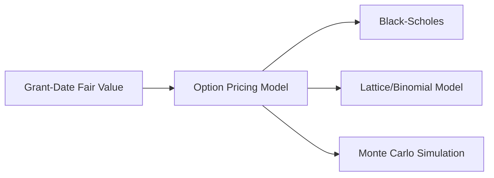
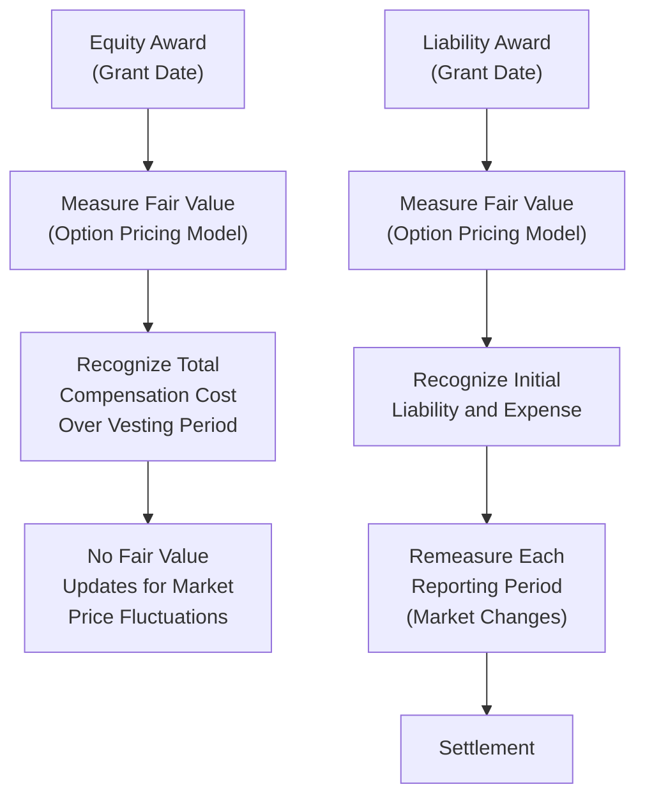

## 13.2 Measurement at Grant Date and Subsequent Changes

Stock-based compensation can be one of the most complex topics in technical accounting and financial reporting. Accountants and finance professionals must not only understand the classification of awards (equity vs. liability) but also the appropriate timing and mechanisms for measuring and recognizing compensation cost. Under U.S. GAAP (primarily ASC 718), determining the fair value at the grant date and recognizing how subsequent changes affect that valuation is central to compliance and transparency.

This section builds on concepts introduced in 13.1 (Equity vs. Liability Awards) and sets the stage for deeper explorations into vesting conditions (13.3) and illustrative journal entries (13.4). Our journey begins by examining the grant-date measurement principle and explores how changes in fair value, market conditions, and performance conditions influence subsequent periods.

--------------------------------------------------------------------------------

## Overview of Grant-Date Fair Value

In the United States, ASC 718, Compensation—Stock Compensation, mandates that entities measure share-based payment awards at fair value on the grant date. This fair value is the basis for measuring total compensation expense, which is then recognized over the requisite service period (typically equal to or aligned with the vesting period).

When the award is classified as equity, the total compensation cost is “locked in” at the grant date (subject to certain modifications, forfeitures, or performance condition adjustments). However, for liability-classified awards, the fair value is remeasured at each reporting date until the award is settled, causing potential fluctuations in reported compensation expense.

### Key Objectives

• Determine the fair value of stock-based awards at the grant date.  
• Understand how subsequent events (e.g., changes in market prices, performance conditions, or employee status) alter or do not alter initial measurement.  
• Apply appropriate valuation models and inputs that comply with U.S. GAAP and, where relevant, IFRS.  
• Analyze the impact of modifications, cancellations, or settlements after grant date.

--------------------------------------------------------------------------------

## Valuation Models for Stock-Based Compensation

Measuring fair value for stock-based awards can be done using various option-pricing models. The most common include:

• Black-Scholes-Merton (commonly called the Black-Scholes model).  
• Binomial (or Lattice) models.  
• Monte Carlo simulation.  

Each model attempts to capture the intrinsic value and time value of the options or other equity instruments by incorporating assumptions around stock price volatility, expected term, risk-free interest rate, expected dividends, and other factors.

Below is a simple Mermaid diagram summarizing major approaches to measuring fair value at grant date:

Each approach aims to derive a value that reflects how much the award is worth if granted to an external party in an arm’s-length transaction.

### Black-Scholes Model

The Black-Scholes model (also known as the Black-Scholes-Merton model) is one of the most prevalent and straightforward methods. It requires the following inputs:

1. Current stock price (S).  
2. Exercise (strike) price (K).  
3. Expected volatility of the underlying stock (σ).  
4. Risk-free interest rate (r).  
5. Time to expiration or expected term (t).  
6. Expected dividend yield (if relevant).

Below is a sample table illustrating typical inputs for a Black-Scholes calculation:

| Input                      | Description                                                           |
|----------------------------|-----------------------------------------------------------------------|
| Stock Price (S)            | Current market price of the underlying share                          |
| Strike Price (K)           | Exercise price of the option                                          |
| Expected Term (t)          | Estimated period over which the option will be exercised              |
| Volatility (σ)             | Annualized standard deviation of stock returns                        |
| Risk-Free Rate (r)         | Return on default-free securities over the expected option life       |
| Dividend Yield             | Expected annual dividend as a percentage of the stock price           |

In financial statements, the formula for a Black-Scholes option can be presented with more detail, but the essential concept is that the model calculates a per-option fair value. That value is multiplied by the number of options granted to determine the total compensation cost at grant date.

### Binomial (Lattice) Model

A binomial or lattice model simulates discrete time intervals and captures the fact that employees might exercise the options at various points in the future, rather than only at the end of their contractual life. Whereas Black-Scholes assumes a single expected term, the binomial model provides a “tree” structure of possible stock prices over time and can factor in early exercise behavior or forfeitures along the way.

### Monte Carlo Simulation

Monte Carlo simulation is a flexible approach that runs thousands (or millions) of random trials to model potential future stock price movements, volatility, and dividend payments. This method is especially useful for awards that have market-based vesting conditions (e.g., conditions tied to total shareholder return relative to peers). Monte Carlo helps capture complex features like path dependency in the stock price.

---

## Initial Measurement at the Grant Date

### Measurement Focus

When an equity-classified award is granted, the fair value at that point in time is used to “lock in” the total compensation cost (subject to modifications or certain performance-based triggers). GAAP guides us to incorporate any market conditions (e.g., share-price performance targets) into the valuation, but not service or performance conditions that are not deemed probable at grant date—or that might be canceled if conditions are not met. These conditions often affect the expected term or the probability of vesting, leading to subtle but important adjustments in the model.

### Grant Date Definition

A crucial step is identifying the specific grant date. Under ASC 718, the grant date occurs when:

• The employer and employee reach a mutual understanding of the key terms and conditions of the share-based payment arrangement.  
• The employer is contingently obligated to issue equity instruments or transfer assets if the employee fulfills any necessary vesting conditions.  
• The employee begins to benefit from, or be adversely affected by, subsequent changes in the entity’s stock price.

If an award is approved but still subject to final negotiation or the employee can choose to reject it, the grant date may not have occurred. Timing is critical, as the measurement date and final recognized fair value will directly affect expense.

---

## Subsequent Changes and Their Impact

### Overview of Subsequent Measurement

Once an entity has established the grant-date fair value for equity-classified awards, that amount generally remains fixed. Compensation expense based on that initial fair value is recognized over the vesting period, adjusted only if the award is forfeited or never vests. Otherwise, changes in the market price of the company’s stock after the grant date do not usually affect the recognized compensation cost for an equity-classified award.

However, for liability-classified awards, the fair value is remeasured at each balance sheet date until settlement. This means higher volatility in compensation cost recognized from period to period, as changes in fair value directly flow into the income statement.

### Modification Accounting

Modification of stock-based compensation arrangements can trigger a recalculation of fair value if the change is beneficial to the employee compared to the original terms. Examples include lowering the strike price (repricing) if the stock price falls below original levels.

• If the revised award has a higher fair value than the original, the incremental amount is recognized over the award’s remaining service period.  
• If the modification reduces the fair value or changes vesting requirements, the minimum recognized compensation cost still remains at least the original grant-date fair value, unless the award is forfeited.

For a deeper discussion of modifications and reclassifications, see Section 13.3 (Vesting Conditions, Performance Features, and Forfeitures) and Section 13.4 (Illustrations and Journal Entries).

### Reclassification from Equity to Liability (or Vice Versa)

Certain awards initially deemed equity-classified may require reclassification to liability if, for example, a contingent cash settlement feature is triggered. When such reclassification occurs, the award is remeasured at fair value on the reclassification date, and any difference from its carrying value is recognized through earnings. Going forward, liability classification rules apply, requiring continuous fair value adjustments.

In contrast, reclassification from a liability award to equity can freeze the award’s fair value at the date of reclassification, with that amount becoming the basis for subsequent expense recognition.

---

## Typical Journal Entries and the Expense Recognition Flow

While illustrative journal entries and example accounting for specific types of awards are discussed in detail in Section 13.4, here is a simplified view of how an equity-classified stock option might progress from the grant date through vesting:

1. Grant Date:  
   Dr. Deferred Compensation (Equity)  
   Cr. Paid-in Capital – Stock Options

   (No immediate expense if the award is not fully vested upon grant, unless immediate vesting is stipulated.)

2. Each Reporting Period until Vesting:  
   Dr. Compensation Expense  
   Cr. Deferred Compensation (Equity)

   (Costs are recognized ratably, or according to the vesting schedule, to align with the employee’s service period.)

3. Exercise and Issuance of Shares:  
   Dr. Cash (exercise price times number of shares exercised)  
   Dr. Paid-in Capital – Stock Options  
   Cr. Common Stock (at par value)  
   Cr. Additional Paid-in Capital

   (Reflecting the closing of the stock options account and issuance of shares.)

For liability-classified awards, the credit side (or debit, if reducing a liability) hits a liability account rather than equity, and the fair value is remeasured up or down every period.

---

## Practical Examples and Case Scenarios

### Example 1: Startup Stock Options – Equity Classification

Imagine a startup, ABC Inc., granting 10,000 stock options to a key employee. The options have an exercise price equal to the current stock price ($10 per share), a term of 10 years, an expected vesting period of 4 years, and no anticipated dividends over that period.

Using the Black-Scholes model, the fair value per option (based on a volatility assumption of 40%, a risk-free rate of 3%, and an expected term of 6 years—a typical assumption that employees might exercise midway) is estimated at $3.00 per option. The total grant-date fair value is thus $30,000 (10,000 × $3.00).

• Over the 4-year vesting period, ABC Inc. will recognize $7,500 of compensation expense per year ($30,000 / 4).  
• The fair value changes in ABC Inc.’s stock after the grant date do not affect the total compensation cost since the award is classified as equity.

### Example 2: Market Condition with Monte Carlo Simulation

XYZ Corp. grants 5,000 performance-based stock units that vest only if the company’s total shareholder return (TSR) outperforms a peer group index over the next three years. Because the TSR is a market condition, it must be factored into the fair value measure at grant (per ASC 718). Monte Carlo simulations are used to estimate that each performance-based unit has a fair value of $25. The total grant-date fair value is $125,000 (5,000 × $25).

• XYZ Corp. will record comp expense based on the initial fair value, allocated over the 3-year derived service period. If employees leave early and forfeit their awards, the company can reverse unrecognized compensation cost.  
• The actual TSR performance does not revalue the award once granted; instead, the probability of meeting the market condition is baked into the original Monte Carlo result.

### Example 3: Liability-Classified Phantom Shares

LMN Co. grants 3,000 phantom shares settled in cash based on the company’s share price on vesting date (3 years from now). Because the employee will receive cash, not shares, the arrangement is liability-classified. The fair value at grant is $40 per phantom share, for a total of $120,000. Over time, the company must remeasure that liability:

• At grant, $120,000 is recognized as a liability over 3 years.  
• Each reporting period, LMN revalues the phantom shares. If the price rises to $45, the new total liability is $135,000. Any increase in liability from $120,000 to $135,000 is recognized as additional compensation cost over the period since the last measurement date.  
• If the price falls to $35, the total liability is $105,000, decreasing recognized expense in that period (or reversing previously recognized amounts).

---

## Common Pitfalls and Best Practices

### Pitfalls

1. Misidentifying the Grant Date:  
   Failing to identify the correct date can lead to significant errors in valuation and expense recognition.

2. Incorrect Volatility Assumptions:  
   Especially for private entities with limited stock price history. Over- or underestimating volatility can distort fair value.

3. Overlooked Service and Performance Conditions:  
   Not properly adjusting for probability of vesting or conditions that trigger non-vesting can yield incorrect expense.

4. Reclassification Oversights:  
   Missing triggers that require a move from equity to liability classification (or vice versa) can deeply affect financial statements.

5. Non-Uniform Assumptions for Large Grants:  
   Each separate grant should be evaluated individually, rather than “averaging” assumptions across multiple grants with different terms.

### Best Practices

1. Document Valuation Models Thoroughly:  
   Retain assumptions, data sources, and calculations to support an external audit or regulatory review.

2. Employ a Consistent Approach for All Grants:  
   While simplifying assumptions might differ based on type of award, aim for consistency year over year to enhance comparability.

3. Revisit Key Inputs Periodically:  
   Even though equity awards are measured at grant date, new information can help refine future grants and forecasting.

4. Communicate with Legal and HR:  
   Confirm that the terms of grants, modifications, or terminations are consistent across departments to establish proper accounting treatment.

---

## Diagram: Measurement and Subsequent Changes Flow

The diagram below offers a high-level glance at how stock-based compensation is measured at the grant date and then flows through potential subsequent changes.

- For equity awards: Once you measure fair value at grant date, that becomes the reference point for recognizing periodic expenses.  
- For liability awards: Fair value is updated at each reporting period, so an ongoing remeasurement process is required.

---

## IFRS vs. U.S. GAAP Overview

While this supplemental guide focuses on U.S. GAAP requirements, it is worth noting broad similarities under IFRS 2, Share-Based Payment. Both sets of standards generally require measuring share-based payments at fair value at the grant date. The chief difference often arises in how some performance conditions are classified and certain intricacies around when remeasurement is required. For international filers or foreign private issuers, consulting IFRS 2 and reconciling it with local GAAP is crucial.

---

## References and Further Reading

• ASC 718—Compensation—Stock Compensation (FASB Accounting Standards Codification).  
• IFRS 2—Share-Based Payment (International Accounting Standards Board).  
• AICPA Publications on Stock Compensation: Offers practical guidance and illustrative examples.  
• Section 13.1 (Equity vs. Liability Awards) for classification rules and examples.  
• Section 13.3 (Vesting Conditions, Performance Features, and Forfeitures) for complexity in vesting.  
• Section 13.4 (Illustrations and Journal Entries) for step-by-step accounting entries.

---

## Conclusion

Measuring stock-based compensation at the grant date is a cornerstone of financial integrity and transparency. By employing option-pricing models such as Black-Scholes, binomial models, or Monte Carlo simulations, organizations can best approximate the fair value of employee awards. The classification of awards—equity or liability—remains a critical determinant of whether those amounts float with market changes or remain fixed throughout the vesting period. 

With careful attention to documentation, assumptions, classification, and modification scenarios, accounting professionals can ensure that these powerful compensation tools are appropriately reflected in the entity’s financial statements. In the chapters that follow, we will extend these principles to address vesting conditions (13.3) and walk through comprehensive journal entries (13.4).

--------------------------------------------------------------------------------

## Master Your Expertise Through Practice

• Ensure your valuation assumptions are well-researched and defendable.  
• Keep your eyes open for reclassification triggers.  
• Update or remeasure liability-classified awards each reporting period.  
• Align with other corporate functions (HR, legal, etc.) to maintain accurate reporting.

A deep understanding of the relationships between measurement at grant date, subsequent accounting, and classification can help you not only excel in the CPA Exam but also add value in any organizational finance role.

--------------------------------------------------------------------------------

## Quiz: Stock-Based Compensation: Measurement at Grant Date and Beyond



### When measuring equity-classified stock options at grant date, which statement is true regarding subsequent changes in the stock’s market price?

- [x] Subsequent increases or decreases in the stock price generally do not affect equity-classified compensation cost.  
- [ ] The fair value must be updated at the end of each quarter.  
- [ ] Changes in stock price always trigger a modification.  
- [ ] The stock price alone determines final compensation expense.  

> **Explanation:** For equity-classified awards, compensation cost is locked in at the grant date under ASC 718. Subsequent stock price changes do not alter the total recognized expense unless the award is modified or forfeited.

### Which model frequently is used to value options with market-based performance conditions (e.g., TSR targets)?

- [ ] Black-Scholes only  
- [ ] Binomial tree only  
- [x] Monte Carlo simulation  
- [ ] Discounted cash flow analysis  

> **Explanation:** Monte Carlo simulations are well-suited for complex market-based conditions because they can capture various paths and probabilities of meeting stock-price or TSR-related hurdles.

### Which of the following inputs is not typically required for a Black-Scholes valuation?

- [ ] Expected volatility  
- [ ] Risk-free interest rate  
- [ ] Expected term  
- [x] Present value of future operating cash flows  

> **Explanation:** Black-Scholes focuses on market-related assumptions, not the entity’s operating cash flows.

### Under U.S. GAAP, at what point is the fair value of an equity-classified award generally “locked in”?

- [x] At the grant date  
- [ ] When the award expires  
- [ ] The date that vesting completes  
- [ ] At each interim reporting period  

> **Explanation:** The grant date fair value for equity-classified awards dictates total compensation cost, with no remeasurement for market conditions.

### Which is considered the primary difference in subsequent accounting for liability-classified awards compared to equity-classified awards?

- [x] Liability-classified awards are remeasured to fair value each reporting period.  
- [ ] Liability-classified awards never use an option-pricing model.  
- [x] Liability-classified awards can result in constant fluctuations in reported compensation expense.  
- [ ] Equity-classified awards are never based on grant-date fair value.  

> **Explanation:** Liability-classified awards must be remeasured to fair value each reporting period, causing ongoing changes to compensation expense. Equity-classified awards remain at their grant-date measurement.

### An award is modified, and its fair value increases. Which of the following is correct under ASC 718?

- [x] The incremental fair value is recognized as additional compensation expense.  
- [ ] The original fair value is reversed immediately.  
- [ ] The newly measured fair value replaces the grant-date fair value entirely.  
- [ ] No additional accounting is necessary.  

> **Explanation:** If a modification increases the fair value of the award, the incremental amount is recognized as additional compensation over the remaining service period.

### If an award switches from equity classification to liability classification, what typically happens on the reclassification date?

- [x] The award is remeasured at its fair value, and the difference is recognized in earnings.  
- [ ] No accounting adjustment is recorded.  
- [x] The carrying value remains constant, irrespective of market fluctuations.  
- [ ] Any subsequent changes are reflected in equity only.  

> **Explanation:** When reclassifying to a liability, the instrument is measured at current fair value on the reclassification date, and any difference from its previous carrying amount is recognized as compensation cost (or reduction thereof).

### Which of the following best describes private companies’ approach to volatility assumptions for valuation?

- [x] They often use peer group data if internal historical volatility is unavailable.  
- [ ] They always default to 100% volatility.  
- [ ] They are prohibited from using the Black-Scholes model.  
- [ ] Volatility does not matter for private companies’ valuations.  

> **Explanation:** Private companies commonly refer to peer or industry data to estimate volatility when they do not possess a robust trading history.

### In a Monte Carlo simulation for stock-based compensation, which best describes the process?

- [x] Thousands or millions of random stock price paths are generated to estimate value.  
- [ ] Only one possible stock price path is considered.  
- [ ] Simulations are performed solely using short-term interest rates.  
- [ ] It is not used for performance conditions.  

> **Explanation:** Monte Carlo methods account for numerous potential price paths, randomizing key inputs (volatility, dividends, etc.), making it valuable for complex performance or market-based conditions.

### Stock-based compensation under ASC 718 is measured at fair value primarily to:

- [x] Provide transparency and comparability for users of financial statements.  
- [ ] Inflate the company’s share price.  
- [ ] Avoid compliance with SEC guidelines.  
- [ ] Minimize expense recognition to boost net income.  

> **Explanation:** The main objective is transparency and usefulness for investors, creditors, and other stakeholders.



--------------------------------------------------------------------------------

## For Additional Practice and Deeper Preparation

### [Business Analysis and Reporting (BAR) CPA Mock Exams](https://www.udemy.com/course/bar-cpa-mock-exams/?referralCode=ADBE2E84BEE9CB6243CA)

Business Analysis and Reporting (BAR) CPA Mocks: 6 Full (1,500 Qs), Harder Than Real! In-Depth & Clear. Crush With Confidence!

• Tackle full-length mock exams designed to mirror real BAR questions.  
• Refine your exam-day strategies with detailed, step-by-step solutions for every scenario.  
• Explore in-depth rationales that reinforce higher-level concepts, giving you an edge on test day.  
• Boost confidence and minimize anxiety by mastering every corner of the BAR blueprint.  
• Perfect for those seeking exceptionally hard mocks and real-world readiness.

_Disclaimer: This course is not endorsed by or affiliated with the AICPA, NASBA, or any official CPA Examination authority. All content is for educational and preparatory purposes only._
