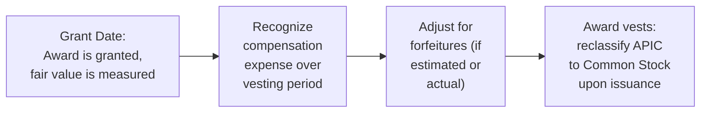

## 13.4 Illustrations and Journal Entries

This section builds on the foundations introduced in 13.1 (Equity vs. Liability Awards), 13.2 (Measurement at Grant Date and Subsequent Changes), and 13.3 (Vesting Conditions, Performance Features, and Forfeitures). The purpose here is to present concrete numerical examples of stock-based compensation—primarily focusing on equity-classified awards (e.g., employee stock options, restricted stock, or restricted stock units) under U.S. GAAP (ASC 718). The illustrations will help you navigate the complexities of year-by-year compensation expense recognition and the associated journal entries.

These examples reflect common stock-based compensation arrangements you may encounter in practice, including cliff vesting (all shares vest on a single date) and graded schedules (a portion of shares vest each year). We will also address situations where forfeitures occur and demonstrate how to apply either the “forfeiture estimate” approach or the “account for forfeitures as they occur” approach (as further guided by ASC 718). 

By the end of this section, you should be able to:
• Calculate total compensation expense, allocated over the requisite service period.  
• Prepare journal entries for each year of the vesting period.  
• Understand the impact of forfeitures or performance conditions on stock-based compensation costs.  
• Recognize the interplay between fair value measurement, vesting schedules, and potential modifications or adjustments over time.

---

## Conceptual Overview

Before delving into numeric illustrations, recall these key points:

• Stock-based compensation expense is measured at the fair value of the award at the grant date for equity-classified awards.  
• Expense is recognized over the service (vesting) period, either on a straight-line basis or reflecting the specific vesting conditions of the award (e.g., graded vesting).  
• If the award is liability-classified (e.g., certain cash-settled share-based payments), the measurement occurs at each reporting date, and the recognized expense is remeasured until settlement.  
• For equity awards that contain performance conditions, expense recognition only takes place if it is probable that the condition(s) will be met over the specified period.  
• Forfeitures may be estimated upfront or recognized as they occur, adjusting cumulative compensation expense accordingly.  

To illustrate these principles, we will walk through two primary scenarios: a simple cliff vesting arrangement and a graded vesting arrangement.  

---

## Cliff Vesting Example

### Example Scenario

• On January 1, Year 1 (the grant date), AlphaCorp grants 10,000 restricted shares to key employees.  
• The fair value of each share on the grant date is $20, resulting in a total fair value of $200,000 (10,000 shares × $20).  
• All 10,000 shares vest in full on December 31, Year 3, on a single “cliff” vesting date.  
• The requisite service period is three years (Years 1, 2, and 3).  
• We will assume that no shares are forfeited.  

### Measurement of Compensation Expense

Under ASC 718, the total compensation expense for an equity-classified award is determined at grant date. Here, that is:

Total Compensation Expense = $200,000

Since the award vests over three years, the compensation expense is recognized ratably from January 1, Year 1, to December 31, Year 3, unless another allocation method is more reflective of the benefits received. For simple cliff vesting, straight-line recognition is common.

Annual Compensation Expense = Total Fair Value ÷ Service Period = $200,000 ÷ 3 = $66,666.67 per year (rounded)

### Journal Entries by Year

Below are the entries to record compensation expense and the corresponding increase in Additional Paid-in Capital (APIC) for each year.

Year 1 (December 31, Year 1):

Dr. Compensation Expense ……………………………….. $66,666.67  
Cr. APIC – Stock-Based Compensation …………….... $66,666.67  

Year 2 (December 31, Year 2):

Dr. Compensation Expense ……………………………….. $66,666.67  
Cr. APIC – Stock-Based Compensation …………….... $66,666.67  

Year 3 (December 31, Year 3):

Dr. Compensation Expense ……………………………….. $66,666.66  
Cr. APIC – Stock-Based Compensation …………….... $66,666.66  

Note: In practice, slight rounding differences may occur. The total recognized from Year 1 to Year 3 must equal $200,000.

When the shares officially vest on December 31, Year 3, no further compensation expense is recognized (beyond what was accrued). The award is reclassified from APIC – Stock-Based Compensation to Common Stock and APIC – Common Stock once the underlying shares are issued:

Dr. APIC – Stock-Based Compensation ………………… $200,000  
Cr. Common Stock …………………………………………(Par Value)  
Cr. APIC – Common Stock …………………………(Remainder)  

Often, the par value portion is minimal, and the bulk of the credit goes to APIC – Common Stock.

---

## Graded Vesting Example

### Example Scenario

• On January 1, Year 1, BetaCorp grants 6,000 stock options to a group of employees.  
• Each option has a fair value of $15, for a total grant-date fair value of $90,000 (6,000 × $15).  
• The award vests in equal annual tranches over three years: 2,000 options vest on December 31, Year 1, 2,000 vest on December 31, Year 2, and 2,000 vest on December 31, Year 3.  
• Total requisite service period spans three years, but each tranche’s service obligation is effectively one year, two years, and three years, respectively.  
• Assume no forfeitures occur.  

### Vesting Schedules and Expense Allocation

Under graded vesting, each “portion” or tranche can be accounted for separately by attributing expense to the period each tranche vests.

Tranche 1  
• Number of options: 2,000  
• Service period: 1 year (Year 1)  
• Fair value allocated to Tranche 1: $30,000 (2,000 × $15)  

Tranche 2  
• Number of options: 2,000  
• Service period: 2 years (Years 1 and 2)  
• Fair value allocated to Tranche 2: $30,000  

Tranche 3  
• Number of options: 2,000  
• Service period: 3 years (Years 1, 2, and 3)  
• Fair value allocated to Tranche 3: $30,000  

The total fair value of $90,000 is allocated over the relevant service periods:

• Tranche 1 recognized fully in Year 1.  
• Tranche 2 recognized over Years 1 and 2.  
• Tranche 3 recognized over Years 1, 2, and 3.  

#### Calculation of Annual Expense

Year 1:  
- Tranche 1: $30,000 (entire portion recognized in Year 1)  
- Tranche 2: Half of $30,000 (Year 1 portion) = $15,000  
- Tranche 3: One-third of $30,000 = $10,000  

Total Year 1 = $30,000 + $15,000 + $10,000 = $55,000  

Year 2:  
- Tranche 1: Fully vested in Year 1, so $0 in Year 2  
- Tranche 2: Remaining half of $30,000 = $15,000  
- Tranche 3: Another one-third of $30,000 = $10,000  

Total Year 2 = $15,000 + $10,000 = $25,000  

Year 3:  
- Tranche 1: Already fully vested, $0  
- Tranche 2: Fully vested by the end of Year 2, $0  
- Tranche 3: Final one-third of $30,000 = $10,000  

Total Year 3 = $10,000  

### Journal Entries by Year

Year 1 (December 31, Year 1):

Dr. Compensation Expense ……………………………….. $55,000  
Cr. APIC – Stock-Based Compensation ……………….. $55,000  

Year 2 (December 31, Year 2):

Dr. Compensation Expense ……………………………….. $25,000  
Cr. APIC – Stock-Based Compensation ……………….. $25,000  

Year 3 (December 31, Year 3):

Dr. Compensation Expense ……………………………….. $10,000  
Cr. APIC – Stock-Based Compensation ……………….. $10,000  

By the end of Year 3, the total compensation expense recognized is $90,000, matching the total grant-date fair value of the awards. When employees exercise the options, BetaCorp will reclassify the amounts from APIC – Stock-Based Compensation to Common Stock and APIC – Common Stock, similar to the earlier example.

---

## Forfeitures and Adjustments

If forfeitures occur (employees leaving or not meeting performance conditions), ASC 718 offers two approaches:  

• Estimate the likelihood of forfeitures at the grant date and adjust compensation expense accordingly.  
• Recognize forfeitures as they occur, reversing previously recorded expense when forfeitures actually happen.  

### Forfeiture Example

Suppose in the Graded Vesting Example (6,000 options at $15 fair value each = $90,000 total), BetaCorp anticipates (or experiences) a 10% forfeiture rate in Year 2. The unvested portion is forfeited. Assuming employees forfeit their remaining unvested awards halfway through Year 2:

1) If accounting for forfeitures as they occur:  
   • Reverse the portion of compensation expense previously recognized pertaining to the forfeited shares.  
   • Record no further expense for those shares going forward.  

2) If applying an estimated forfeiture rate upfront (commonly used in practice prior to ASU 2016-09 changes):  
   • Record expense based on an expected total of 90% of the original award, reducing the total recognized from $90,000 to $81,000.  
   • Adjust at each reporting date as new forfeiture forecasts become available.  

Regardless of the chosen method, the final recognized expense must reflect actual outcomes of vesting or forfeiture at the end of the award’s life.

---

## Illustrative Mermaid Diagram

Below is a flowchart summarizing the lifecycle of many equity awards under ASC 718:

This illustration highlights the key landmarks: (1) measuring fair value at the grant date, (2) recording expense over time, (3) adjusting for forfeitures, and (4) final classification when shares vest or options are exercised.

---

## Common Pitfalls and Best Practices

• Failing to Properly Identify the Grant Date: The official grant date requires mutual understanding of the key terms and acceptance by the employee. Delays in finalizing these documents sometimes mean the actual grant date is later than initially assumed.  
• Overlooking Performance or Market Conditions: If awards contain performance metrics or market conditions (like total shareholder return targets), additional complexities arise. Ensure you apply probability assessments for performance-based vesting, and fair value modeling for market-based conditions.  
• Inaccurate Forfeiture Estimates: Overestimating or underestimating forfeitures can significantly distort recognized expense. Consistent reevaluation and data-driven estimates are crucial, or companies can choose to recognize forfeitures as they occur.  
• Misclassification Between Equity and Liability: Certain conditions (e.g., awards that must be settled in cash) trigger liability accounting. Regularly confirm that awards continue to meet equity-classification criteria under ASC 718.  
• Not Reassessing the Remaining Service Period After Modifications: If awards are modified or if employees switch roles, unvested awards may require reevaluation of the service condition's timeline.  

---

## Insights for Exam Preparation

• Understand the difference between cliff vesting and graded vesting, and how each affects the pattern of expense recognition.  
• Be prepared to calculate year-by-year expense, especially for long vesting periods. Practice pencil-and-paper calculations for various vesting schedules.  
• Familiarize yourself with the basic journal entries at each stage, from initial expense recognition to final settlement.  
• Maintain a clear perspective on the interplay between US GAAP (ASC 718) and IFRS (IFRS 2), especially regarding differences in forfeiture approaches or certain performance conditions.  
• Most exam questions on stock-based compensation feature either a straightforward approach to forfeitures or a simple grant-date fair value scenario. However, be ready to demonstrate the effect of partial forfeitures.  

---

## Additional References

• FASB Accounting Standards Codification (ASC) 718 – Stock Compensation  
• AICPA Accounting and Valuation Guide: Valuation of Privately-Held-Company Equity Securities Issued as Compensation  
• IFRS 2 – Share-based Payment (for multinational comparison)  
• Chapter 13.1 (Equity vs. Liability Awards), 13.2 (Measurement at Grant Date and Subsequent Changes), and 13.3 (Vesting Conditions, Performance Features, and Forfeitures) from this same guide  

---

## Quiz: Stock-Based Compensation Entries  



### When stock awards have a three-year cliff vesting period, how is compensation expense typically allocated?

- [x] Evenly over the three-year vesting period
- [ ] Recognized entirely in the first year
- [ ] Deferred until the shares fully vest
- [ ] Recognized only when the employee exercises the options

> **Explanation:** In most cases, for a cliff vesting arrangement, total compensation expense is allocated on a straight-line basis over the entire vesting period (unless another attribution method is more appropriate under ASC 718).

### Which of the following is true regarding graded vesting?

- [x] Each “tranche” is accounted for separately over its distinct vesting schedule
- [ ] Compensation expense is recognized evenly across all vesting tranches
- [x] Fair value of each tranche is recognized over the period from grant date to vesting date
- [ ] Vesting is never affected by employee turnover

> **Explanation:** Under graded vesting, each portion (tranche) is treated as a separate award with its own service period. Recognizing each tranche’s expense proportionally often results in accelerated attribution of costs in the earlier years.

### Why might stock-based compensation expense need to be reversed in a subsequent period?

- [x] The employee forfeits shares before vesting
- [ ] The fair value changes during the vesting period for an equity award
- [ ] More shares are added to the plan
- [ ] The company’s stock price decreases

> **Explanation:** If an employee forfeits unvested shares, any previously recorded compensation expense related to those shares must be reversed. For equity-classified awards, changes in stock price after the grant date do not affect the recognized expense.

### For an equity-classified award with a market condition (e.g., total shareholder return compared to an index), how is grant-date fair value determined?

- [x] Using an option-pricing model that incorporates the market condition
- [ ] By taking the average stock price over the past 12 months
- [ ] Only by the intrinsic value at grant date
- [ ] By waiting until the market condition is definitively met

> **Explanation:** Under ASC 718, a market condition is included in the grant-date fair value estimate (often with a Monte Carlo model). Intrinsic value alone is insufficient for measuring complex market conditions.

### Which of the following is likely a liability-classified award?

- [x] A right to receive cash equal to the value of the company’s shares in the future
- [ ] Standard employee stock options subject only to service vesting
- [x] A share appreciation right payable in cash
- [ ] Restricted stock units that must be settled in shares

> **Explanation:** When the award can or must be settled in cash, it generally triggers liability accounting under ASC 718. Stock units or options settled in shares remain equity-classified under most conditions.

### If an initial forfeiture estimate changes significantly mid-year, what is the proper accounting treatment?

- [x] Recalculate cumulative expense with the new estimate and adjust in the current period
- [ ] Continue recognizing the old estimate, ignoring new data
- [ ] Wait until the vest date to adjust
- [ ] Reverse all prior expenses and start fresh

> **Explanation:** ASC 718 requires updating forfeiture estimates as new data becomes available. The adjustment is recognized through a cumulative catch-up in the period of change.

### Which statement best describes the concept of the “requisite service period”?

- [x] The period over which an employee must remain employed to earn the award
- [ ] The length of time it takes to calculate the fair value
- [x] The maximum term of the option (e.g., 10 years)
- [ ] The period from grant date until the award is paid out in cash

> **Explanation:** The requisite service period is typically the vesting period over which the employee must render services for the award to vest. This is the time span used to allocate the compensation cost.

### When options are exercised for an equity-classified award, what happens to the APIC – Stock-Based Compensation account?

- [x] It is reduced, and the corresponding amount is recorded in the Common Stock and APIC – Common Stock accounts
- [ ] It is cash settled
- [ ] It is reversed through Compensation Expense
- [ ] It increases the liability section of the balance sheet

> **Explanation:** Upon exercise, the amounts in APIC – Stock-Based Compensation that relate to the vested awards are transferred to the regular Common Stock and APIC – Common Stock accounts, reflecting the issuance of shares.

### A company chooses to recognize forfeitures as they occur rather than estimate forfeitures at grant date. How does this affect compensation expense?

- [x] No adjustments are made until an actual forfeiture event happens
- [ ] More expense is recognized initially under all scenarios
- [ ] A separate accrued liability must be created
- [ ] Yearly expense must reflect the “highest possible shares” scenario

> **Explanation:** If a company opts to account for forfeitures when they occur, it recognizes the full compensation cost initially and reverses it if and when employees forfeit their unvested awards.

### True or False: Under ASC 718, changes in the market value of an equity-classified award after the grant date do not affect the amount of compensation expense recognized.

- [x] True
- [ ] False

> **Explanation:** For equity-classified awards, the fair value is locked in at the grant date. Subsequent changes in stock price (market value) do not alter the total grant-date compensation cost to be recognized over the vesting period.



---

## For Additional Practice and Deeper Preparation

### [Business Analysis and Reporting (BAR) CPA Mock Exams](https://www.udemy.com/course/bar-cpa-mock-exams/?referralCode=ADBE2E84BEE9CB6243CA)  

**Business Analysis and Reporting (BAR) CPA Mocks:** 6 Full (1,500 Qs), Harder Than Real! In-Depth & Clear. Crush With Confidence!  

- Tackle full-length mock exams designed to mirror real BAR questions.  
- Refine your exam-day strategies with detailed, step-by-step solutions for every scenario.  
- Explore in-depth rationales that reinforce higher-level concepts, giving you an edge on test day.  
- Boost confidence and minimize anxiety by mastering every corner of the BAR blueprint.  
- Perfect for those seeking exceptionally hard mocks and real-world readiness.  

_Disclaimer: This course is not endorsed by or affiliated with the AICPA, NASBA, or any official CPA Examination authority. All content is for educational and preparatory purposes only._
