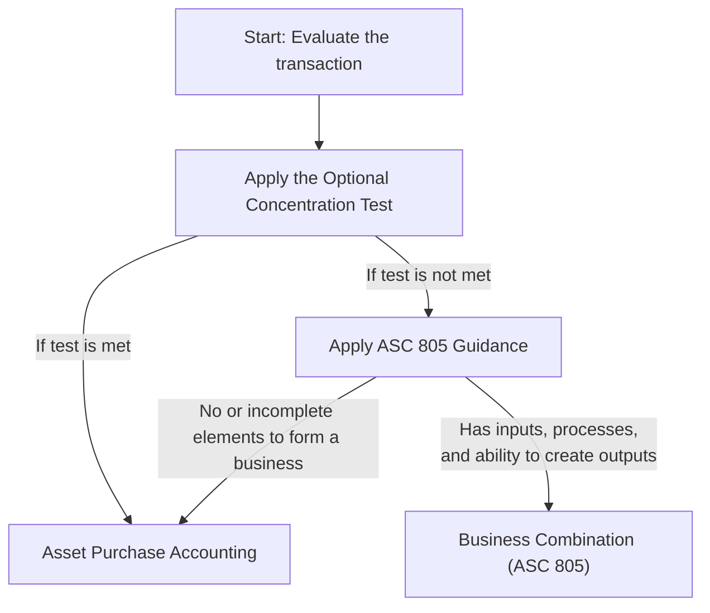

## 14.1 Acquisition vs. Asset Purchase Accounting

Effective from an accounting standpoint, not every transaction involving the purchase of a group of assets automatically qualifies as a business combination. Determining whether a particular transaction meets the definition of a “business” is a critical step because it triggers distinctive accounting and reporting requirements per FASB Accounting Standards Codification (ASC) 805, Business Combinations, and IFRS 3, Business Combinations. This decision point impacts the recognition and measurement of assets, liabilities, goodwill, and the initial and subsequent accounting treatment.

This section explains key criteria for evaluating whether a transaction is a business combination or simply an asset purchase. We will explore the definition of a business, the optional concentration test under ASC 805, subsequent measurement implications, relevant differences under IFRS, and common practical challenges. References to other chapters—such as Chapter 10 (Intangible Assets and Goodwill), Chapter 9 (Valuation Techniques), and Chapter 23 (Emerging Issues and IFRS vs. U.S. GAAP)—will guide you to additional resources for specialized topics.

---

### Identifying a Business Under ASC 805

ASC 805 defines a business as an integrated set of activities and assets that is capable of being conducted and managed for the purpose of providing a return to investors or other owners. In simpler terms, a business generally comprises inputs, processes applied to those inputs, and the ability to create outputs (products or services generating revenue). The presence of outputs is not strictly necessary if the set of inputs and processes can be applied to create or contribute to future economic benefits (e.g., in a start-up scenario without revenue).

Key elements:
• Inputs: Resources that can generate outputs when processes are applied (e.g., raw materials, workforce, technology).  
• Processes: Systems, protocols, or standards that apply to inputs (e.g., an organized workforce with expertise, standard operating procedures, or intellectual property).  
• Outputs: The final goods or services that can be sold to generate revenue (or potential future economic benefits).

Under both U.S. GAAP and IFRS, the focus is on whether the acquired set of inputs and processes is more than a mere collection of assets: it should be self-sustaining or have the potential to be self-sustaining.

---

### The Optional Concentration Test

Following updates to ASC 805, an acquirer can elect an optional “concentration test” to streamline the evaluation. The concentration test asks whether substantially all the fair value of the gross assets acquired is concentrated in a single asset (or group of similar identifiable assets). If yes, the acquired set is not a business—hence, asset purchase accounting applies. If the test is not met, or if the acquirer elects not to apply it, the buyer then goes through the formal framework to determine if a business has been acquired.

Key highlights of the concentration test:
• The test is optional. Entities can skip the test and directly evaluate ASC 805’s business definition if they wish.  
• “Substantially all” is generally interpreted as around 90% or more. However, professional judgment and specific guidance from ASC 805 should be considered.  
• If intangible assets are not “similar,” the concentration test may not be met.  

Applying the concentration test often reduces complexity for real estate or single-asset acquisitions (e.g., acquiring one manufacturing plant, or a single intangible asset).

Below is a simplified flowchart illustrating how the concentration test and business definition analysis integrate:

The result of this assessment has far-reaching implications for tax positions, goodwill recognition, intangible asset measurement, and various reporting disclosures.

---

### Consequences of Being Classified as a Business Combination

If the acquired set qualifies as a business under ASC 805, business combination accounting applies:

1. Fair Value Measurement of Net Assets  
   • All acquired assets and assumed liabilities must be recognized at fair value on the acquisition date, except for a few specific exceptions (e.g., deferred tax assets/liabilities).  
   • Fair value measurement may involve level 1, 2, or 3 inputs under ASC 820.  

2. Goodwill or Bargain Purchase Gain  
   • Any excess purchase consideration over the fair value of the net identifiable assets acquired is recognized as goodwill, subject to annual or event-driven impairment testing in accordance with ASC 350 (see Chapter 10 for more details).  
   • Conversely, if the fair value of the net assets acquired exceeds the consideration transferred, this results in a bargain purchase gain (unusual in practice and heavily scrutinized by auditors).  

3. Transaction Costs Expensed  
   • In a business combination, transaction costs (e.g., legal and accounting fees) are expensed as incurred rather than capitalized.  

4. Recognition of Certain Intangible Assets  
   • If the acquisition forms a business, intangible assets such as customer relationships, trademarks, noncompetition agreements, and other identifiable intangibles must be recognized at fair value separately from goodwill if they meet the separability or contractual/ legal criterion.  

5. Deferred Taxes  
   • Business combination accounting often triggers complex deferred tax calculations. Differences between fair values and tax bases must be recognized as deferred tax assets or liabilities (ASC 740).  

6. Noncontrolling Interests  
   • If the acquired business is partially owned by other shareholders, a noncontrolling interest must be recognized at fair value.  

For additional clarity on intangible assets acquired in a business combination, refer to Chapter 10 (Indefinite-Lived Intangible Assets and Goodwill) and Chapter 12 (Revenue Recognition for software or licensing intangibles). Also, Chapter 14.4 addresses complexities around foreign currency and multi-entity structures.

---

### Consequences of Being Classified as an Asset Purchase

If the acquirer determines that the acquired set does not constitute a business, asset purchase accounting applies. Though the transaction generally still involves careful valuation, it is subject to a different set of rules:

1. Allocation of the Purchase Price  
   • The total cost (purchase price plus certain transaction costs) is allocated to the assets acquired on a relative fair value basis.  
   • All assets are recorded at their relative fair values, but crucially, no goodwill is recognized in an asset purchase.  

2. Capitalization of Transaction Costs  
   • Unlike a business combination, in an asset purchase, transaction costs directly attributable to the acquisition are capitalized as part of the asset’s cost.  

3. Potential Impact on Future Depreciation or Amortization  
   • Because the assets are recognized individually (with no goodwill), the carrying amounts of acquired tangible or intangible assets may be higher or lower than in a business combination, depending on their relative fair values. This directly affects future depreciation and amortization.  

4. No Recognition of a Bargain Purchase Gain  
   • If the total purchase price is less than the fair value of the asset group, the carrying values of the assets must be reduced proportionately. In practice, bargains are unusual in asset purchases, but any leftover difference does not become an immediate “gain” recognized in the income statement.  

5. Fewer Ongoing Disclosure Requirements  
   • Asset purchases typically impose fewer disclosure requirements compared to a business combination, though standard disclosures for intangible assets or property, plant, and equipment (PPE) still apply (see Chapter 10 for intangible disclosures).

---

### IFRS vs. U.S. GAAP Considerations

Both U.S. GAAP (ASC 805) and IFRS (IFRS 3) feature similar guidelines for identifying a business and require comprehensive fair value measurements. However, there are subtle differences:

• Definition of a Business: IFRS 3 generally aligns with ASC 805 but sometimes interprets “capable of producing outputs” more broadly. IFRS includes guidance on how to evaluate substantive processes when no revenues exist.  
• Bargain Purchases: IFRS requires immediate recognition of a bargain purchase gain in profit or loss, similar to U.S. GAAP, but IFRS 3 mandates extra scrutiny and remeasurement steps to confirm the fair values are accurate.  
• Transaction Costs: Under IFRS 3, transaction costs are similarly expensed in a business combination—mirroring U.S. GAAP.  
• Optional Concentration Test: The concept of a concentration test is not explicitly an IFRS 3 concept in the same manner as ASC 805’s elective test. Nonetheless, IFRS has some practical shortcuts, often hooking into guidance on “substantially all” transactions.  

Entities operating globally may need to reconcile these differences, especially in cross-border transactions. See also Chapter 23 (Emerging Issues in Accounting and Analysis) for a deeper focus on IFRS vs. U.S. GAAP differences.

---

### Real-World Examples

1. Acquisition of a Single-Manufacturing Facility  
   • Facts: A large beverage company acquires one stand-alone plant, which includes the building, equipment, and land. There is no transfer of workforce or operational processes.  
   • Outcome: Likely an asset purchase. If the optional concentration test indicates that the fair value is substantially all in a single asset group, classification is straightforward. Even if the test is not applied, the lack of a workforce or established processes likely prevents classification as a business.  

2. Acquisition of a Pharmaceutical Start-Up  
   • Facts: A large pharmaceutical company buys 100% of a biotech start-up that does not yet have commercialized products but does have R&D in progress, intangible technology, and a small, specialized research team.  
   • Outcome: This might still qualify as a business if the set of processes (the biotech’s specialized research protocols, workforce expertise, IP) can be directed toward gaining future economic benefits. Even without revenue, the existence of key processes and the potential to generate future cash flows leads to classification as a business combination.  

3. Real Estate Portfolio with In-Place Leases  
   • Facts: A real estate investment trust (REIT) acquires multiple commercial buildings with in-place leases and some property management staff who oversee day-to-day operations and service tenants.  
   • Outcome: If the optional concentration test is bypassed or not met, the presence of processes (property management, leasing, revenue collection) and inputs (the buildings, staff, tenant base) can indicate a business combination—particularly if the staff’s operational processes significantly enhance the investment return. If the REIT is simply acquiring multiple passive buildings without property management or other integrated processes, it may be more aligned with an asset purchase.  

---

### Common Pitfalls and Best Practices

• Overlooking the Optional Concentration Test: Entities sometimes forget to apply the test, missing a simpler route to classification. If the test is clearly met, significant time and cost can be saved.  
• Inconsistent Fair Value Measurements: Determining fair values for intangible assets or for specialized real estate can be subjective. Engage qualified valuation experts to mitigate the risk of misstating intangible values or goodwill.  
• Misclassification of Transaction Costs: For a business combination, avoid capitalizing transaction costs. This remains a frequent error with significant financial statement implications.  
• Inadequate Documentation: Regulators and auditors often confirm the depth of analysis. Thorough documentation of the business or asset purchase conclusion is essential to defend your process and assumptions.  
• IFRS vs. U.S. GAAP Nuances: Global organizations must pay attention to subtle differences, particularly with intangible assets recognition and the application of the “substantive process” concept under IFRS 3.  

A robust internal control environment (see COSO ERM in Chapter 8.3) can guard against the risk of misclassification and ensure coordinated collaboration among accounting, finance, legal, and operational teams.

---

### Expanded Illustrative Case Study

Imagine a technology conglomerate acquiring a small software development startup. This startup has an established development team, proprietary codes, an impressive set of AI-based prototypes (still under Beta testing), a small customer base for pilot programs, and some intangible brand recognition. The intangible assets (proprietary code) plus the specialized workforce’s processes form a coherent system capable of generating outputs.

1. Defining a Business  
   • Inputs: Skilled workforce, source code, intangible brand.  
   • Processes: The existing development and continuous integration processes, agile methodology, user testing framework.  
   • Outputs: Potential large-scale commercial software that can be sold or licensed.  

2. Applying the Concentration Test  
   • If the fair value is substantially concentrated in intangible code alone, it might be considered a single asset. However, the presence of a specialized workforce, brand name, and partial revenue stream suggests the fair value is distributed. Likely does not pass the test, thus proceed to the next analysis step.  

3. Business Combination Consequence  
   • On concluding the set is a business, the acquirer must perform a fair value allocation of intangible assets, potential goodwill, and record transaction costs as expenses.  

This underscores how intangible assets, specialized processes, and future economic benefit prospects factor heavily into business classification.

---

### Practical Tips for Successful Implementation

• Build Cross-Functional Teams: Accounting, finance, legal, operations, HR, and valuation experts can offer multiple perspectives on determining whether a set of assets and processes is a business.  
• Revisit Chapter 24 for Multinational Transactions: Complex cross-border acquisitions can involve foreign currency remeasurement (see Chapter 14.3) and additional IFRS nuances.  
• Consult Valuation Specialists Early: Identifying intangible assets and fair values is intricate. Engaging specialists up front often saves time and prevents rework.  
• Document Your Judgment Steps: Prove each element of inputs, processes, and outputs (or potential for outputs). Keep records of every step, including the optional test if utilized.  
• Look to Chapter 10 for Goodwill Implications: Goodwill recognized in business combinations is tested for impairment, not amortized. However, intangible assets with definite lives are amortized.  

---

### References for Further Exploration

• FASB ASC 805: “Business Combinations”  
• IFRS 3: “Business Combinations”  
• Chapter 10: “Indefinite-Lived Intangible Assets and Goodwill”  
• Chapter 23: “IFRS vs. U.S. GAAP Key Differences”  
• AICPA resources on fair value measurements  
• PCAOB guidance on auditing business combinations  
• Online Valuation Courses specializing in intangible assets  

---

## Test Your Knowledge: Business Combinations vs. Asset Purchases Quiz



### Which of the following best describes a “business” under ASC 805?

- [ ] A group of assets that merely share the same owner.
- [x] An integrated set of inputs and processes capable of creating outputs.
- [ ] A single, intangible asset that can be used by multiple parties.
- [ ] A sum of intangible assets without supporting processes.

> **Explanation:** Under ASC 805, a business consists of inputs, processes, and the ability to create outputs. Simply grouping assets under the same ownership does not necessarily form a business.

### What is the primary purpose of the optional concentration test in ASC 805?

- [ ] To determine the tax consequences of an acquisition.
- [x] To simplify the evaluation of whether an acquired set qualifies as a business.
- [ ] To calculate goodwill for a business combination.
- [ ] To allocate acquisition costs among assets.

> **Explanation:** The optional concentration test can shortcut the analysis if substantially all of the fair value is concentrated in one asset (or similar assets), indicating an asset purchase rather than a business combination.

### Which of the following is recognized only in a business combination and not in an asset purchase?

- [x] Goodwill.
- [ ] Additional depreciation expense.
- [ ] Intangible assets.
- [ ] Cash outflows associated with purchasing tangible assets.

> **Explanation:** Goodwill is recognized in a business combination when the purchase price exceeds the fair value of the identified net assets. In an asset purchase, there is no goodwill recognized.

### In an asset purchase example, how are transaction costs generally treated?

- [ ] They are recognized immediately in expense.
- [x] They are capitalized as part of the asset’s cost.
- [ ] They are deferred until the asset is sold.
- [ ] They are netted against any potential goodwill.

> **Explanation:** In an asset purchase, certain transaction costs directly attributable to the acquisition are capitalized. In a business combination, those costs are expensed.

### How is a bargain purchase gain treated under U.S. GAAP?

- [x] It is recorded in the income statement after re-verifying fair value calculations.
- [ ] It is deferred and amortized over the life of the acquired assets.
- [ ] It is recognized as a direct credit to equity.
- [ ] It is allocated to intangible assets.

> **Explanation:** In U.S. GAAP, if the fair value of net assets exceeds the purchase price, it results in a bargain purchase gain, which is recognized in the income statement (after carefully verifying that all fair values are accurate).

### If a set of acquired assets consists mainly of real estate properties with in-place leases and substantial management processes, which classification is more likely?

- [x] Business combination, if the processes and workforce are substantive.
- [ ] Always an asset purchase due to the real estate component.
- [ ] Asset purchase because real estate is exempt from ASC 805.
- [ ] Bargain purchase scenario by default.

> **Explanation:** Real estate deals can qualify as a business combination if the property management processes, staff, and systems are substantive. Merely owning properties without a significant process might indicate an asset purchase.

### Under IFRS 3, how does the recognition of transaction costs in a business combination differ from ASC 805?

- [x] It does not; under both IFRS 3 and ASC 805, transaction costs are expensed.
- [ ] They are capitalized under IFRS 3.
- [ ] They are included as a component of goodwill under IFRS 3.
- [ ] They are recognized as a liability on acquisition date.

> **Explanation:** Both ASC 805 and IFRS 3 require that transaction costs in a business combination be expensed as incurred.

### What happens if an acquisition passes the optional concentration test under ASC 805?

- [x] The acquisition is classified as an asset purchase.
- [ ] The entity must proceed with the full business definition assessment.
- [ ] The acquisition is automatically deemed a business combination.
- [ ] The transaction costs must be expensed immediately.

> **Explanation:** Passing the test means that substantially all the fair value is concentrated in a single identifiable asset or group of similar assets, and hence the purchase is treated as an asset purchase.

### Which statement is accurate about goodwill and intangible assets in a business combination?

- [x] Goodwill is recognized if the purchase price exceeds the fair value of acquired net assets, whereas identifiable intangible assets are recognized separately at fair value.
- [ ] Goodwill and intangible assets are amortized simultaneously.
- [ ] Identifiable intangible assets are recognized only if there is no goodwill.
- [ ] Goodwill includes any intangible assets not otherwise capitalized.

> **Explanation:** Business combination accounting requires separately identifying and valuing intangible assets. Any excess consideration over net asset fair value is recognized as goodwill.

### Is it possible to have a bargain purchase gain under U.S. GAAP when buying a business?

- [x] True
- [ ] False

> **Explanation:** While rare in practice, if the fair value of net identifiable assets exceeds the purchase consideration, it results in a bargain purchase gain, recognized in earnings.



---

## For Additional Practice and Deeper Preparation

### [Business Analysis and Reporting (BAR) CPA Mock Exams](https://www.udemy.com/course/bar-cpa-mock-exams/?referralCode=ADBE2E84BEE9CB6243CA)  

**Business Analysis and Reporting (BAR) CPA Mocks:** 6 Full (1,500 Qs), Harder Than Real! In-Depth & Clear. Crush With Confidence!

- Tackle full-length mock exams designed to mirror real BAR questions.  
- Refine your exam-day strategies with detailed, step-by-step solutions for every scenario.  
- Explore in-depth rationales that reinforce higher-level concepts, giving you an edge on test day.  
- Boost confidence and minimize anxiety by mastering every corner of the BAR blueprint.  
- Perfect for those seeking exceptionally hard mocks and real-world readiness.  

_Disclaimer: This course is not endorsed by or affiliated with the AICPA, NASBA, or any official CPA Examination authority. All content is for educational and preparatory purposes only._
