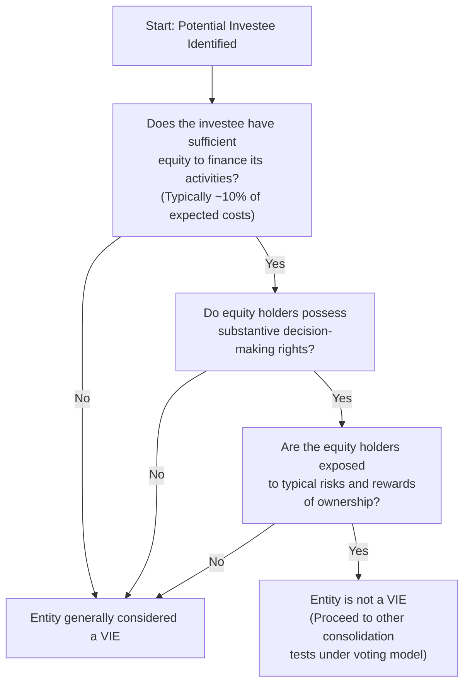
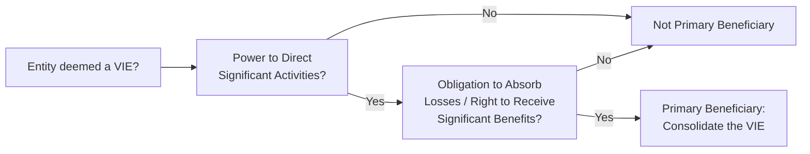
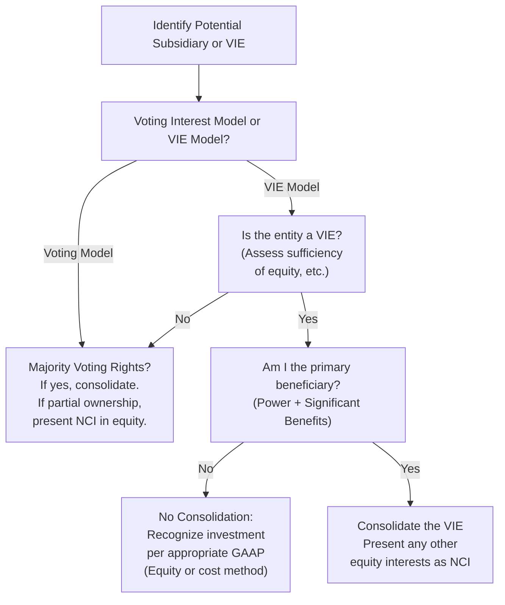

## 14.2 Variable Interest Entities and Noncontrolling Interests

Variable Interest Entities (VIEs) and noncontrolling interests are two key considerations in consolidated financial reporting and analysis. Understanding how to evaluate and consolidate entities in which a reporting entity holds a variable interest—and how to account for minority stakes—is essential for accurate financial statements. This section delves into the concepts, requirements, and practical application of these topics under U.S. Generally Accepted Accounting Principles (GAAP), referencing ASC 810 (Consolidation), while also touching on key differences under IFRS.

Throughout this discussion, we will explore fundamental VIE criteria, primary beneficiary identification, and ongoing reassessment. We will also discuss how—and why—noncontrolling interests (sometimes referred to as minority interests) are presented and measured in consolidated financial statements. To bring these abstract theories to life, we include illustrative flowcharts, real-world scenarios, and best practices that can help you recognize and record VIE relationships accurately.  

---

### Overview of Variable Interest Entities

A Variable Interest Entity (VIE) is a legal structure in which an investor holds a controlling interest—based on contractual or other nontraditional mechanisms—rather than through the typical majority voting rights. The concept of a VIE arises particularly in cases where the structure might be crafted to shift risks and rewards to certain equity holders or to another beneficiary without transferring standard equity ownership and voting rights.

Under ASC 810, an entity must consolidate a VIE if it has both:  
• A variable interest in the entity.  
• A controlling financial interest in the entity, typically achieved by being the VIE’s “primary beneficiary.”  

When a VIE is present, understanding how risks and rewards or losses and returns are allocated is critical to determining the proper consolidation treatment.

---

### Determining Whether an Entity Is a VIE

An entity is considered a VIE if it meets specified criteria, which typically focus on whether:  
• The total equity investment at risk is insufficient to sustain its operations.  
• The equity holders, as a group, lack the power to direct significant activities.  
• The equity holders are not exposed to typical ownership risks and rewards.  

The flow of determining whether to classify an entity as a VIE can be visualized as follows:

In practice, the 10% benchmark is not always definitive. Management must analyze whether the at-risk equity can truly absorb the entity’s anticipated losses or return variability. If an entity is deemed a VIE, a more thorough evaluation of which party is the primary beneficiary follows.

---

### Identifying the Primary Beneficiary

If an entity qualifies as a VIE, the next step is to determine which party (if any) must consolidate the VIE as its primary beneficiary. The primary beneficiary is the party that:

• Has the power to direct the activities that most significantly affect the VIE’s economic performance.  
• Has the obligation to absorb losses or the right to receive benefits from the VIE that could be significant to the VIE.

Practitioners often assess these conditions together, considering both the power and benefits criteria. If any single party meets both elements, that party reports the VIE on its consolidated financial statements. In some cases, multiple variable interest holders share in the VIE’s losses or returns, though only one entity typically wields the decision-making power that yields the most meaningful impact on the VIE’s performance.

The primary beneficiary determination can be summarized through the following flowchart:

---

### Reassessment of the VIE and Primary Beneficiary Status

Entities must continually reassess whether an investee remains a VIE and whether the primary beneficiary relationship changes. Significant contractual modifications, changes in ownership or voting rights, and evolving economic relationships can all affect control. If changes occur that alter the power or benefits distribution among the investors, it may trigger deconsolidation or re-consolidation events.

---

### Noncontrolling Interests (Minority Interests)

When an entity consolidates a subsidiary—or in the case of a VIE, determines itself to be the primary beneficiary—it may not always own 100% of the equity. Any equity interests in the subsidiary held by shareholders other than the parent (or by other parties in a VIE) are known as “noncontrolling interests.” Under U.S. GAAP, noncontrolling interests are presented as a separate component of equity in the consolidated financial statements.

#### Presentation and Measurement

• Presentation in the Balance Sheet: Noncontrolling interests are presented in the consolidated balance sheet under the equity section, separate from the parent’s equity.  

• Allocation of Net Income in the Income Statement: The consolidated statement of income attributes net income (or loss) to both the controlling interest (parent) and the noncontrolling interests.  

• Statement of Changes in Equity: Changes in the noncontrolling interests during the period are shown in a separate column or section, reflecting contributions, distributions, or changes in ownership percentage.

#### Initial Recognition

When a parent obtains control over a subsidiary (or becomes the primary beneficiary of a VIE), the parent measures the noncontrolling interests at either:  
• Fair value (the “full goodwill” method), or  
• The noncontrolling interest’s proportionate share of the acquiree’s identifiable net assets (the “partial goodwill” method).

Under U.S. GAAP, fair value measurement of noncontrolling interests is more common. IFRS 3 (Business Combinations) allows a choice between a fair value measurement or a proportionate share measurement for each business combination.

#### Subsequent Changes in Ownership

If the parent acquires additional ownership interest from a noncontrolling interest holder without losing control, this is treated as an equity transaction for consolidated reporting purposes. The carrying amount of the noncontrolling interest is adjusted to reflect the new ownership level, and the difference between purchase price and book value is recognized in the equity attributable to the parent.

---

### Consolidation Flow: VIEs and Noncontrolling Interests

Bringing the VIE determination and noncontrolling interests together in an integrated perspective, the following flowchart outlines how to determine whether, and how, to consolidate an entity—including the presentation of a noncontrolling interest:

---

### IFRS Considerations

Under IFRS, entities apply IFRS 10 (Consolidated Financial Statements) and IFRS 12 (Disclosure of Interests in Other Entities) to assess consolidation. The IFRS approach centers on control, which involves power over the investee, exposure to variable returns, and ability to use power to affect investee returns. Although conceptually similar to the VIE primary beneficiary approach, IFRS does not use the same “VIE” terminology. Instead, an entity with decision-making power and the right to variable returns typically consolidates.  

For noncontrolling interests, IFRS 3 (Business Combinations) permits a choice, on a combination-by-combination basis, to measure NCI at either:  
• Fair value (“full goodwill” approach), or  
• Proportionate share of net identifiable assets (“partial goodwill” approach).  

Once the measurement basis is selected for a specific business combination, it cannot be changed subsequently for that same combination.

---

### Practical Examples and Case Studies

Strong theoretical grounding is crucial, but case studies and hands-on examples can clarify how to apply these concepts in real-world scenarios. Below are two brief examples:

• Technology Startup with Outside Investors: A startup, TechNow Inc., establishes an off-balance-sheet entity (TechNow R&D LLC) to develop cutting-edge prototypes. Outside investors provide most of the funding, but TechNow Inc. manages key operational and strategic decisions. Even though TechNow Inc. only contributes 5% of initial equity, it retains full control of the development’s direction and absorbs a majority of potential losses if research fails. This arrangement meets VIE criteria for TechNow R&D LLC, and TechNow Inc. is the primary beneficiary, so TechNow Inc. consolidates TechNow R&D LLC. The other investors’ stakes appear as noncontrolling interests.

• Real Estate Partnership: Real Estate Partners (REP) invests in a series of property-holding entities with different partners. REP invests 40% in one entity, Hamilton Property LLC, while another partner invests 60%. Although REP holds a minority interest, rep has the sole power to direct property acquisition, financing, and rent-related decisions. If those decisions significantly affect returns, REP is the VIE’s primary beneficiary, thus must consolidate Hamilton Property LLC. The 60% ownership stake is presented as a noncontrolling interest in REP’s consolidated financial statements.

In these illustrative cases, the essence lies in understanding who wields decision-making power and who truly bears the most risk and reward.  

---

### Best Practices and Common Pitfalls

Best Practices:  
• Thoroughly document qualitative and quantitative analyses, including the potential for functional control despite small equity ownership.  
• Continuously monitor changes in contractual arrangements or business operations that may alter VIE status or primary beneficiary status.  
• Engage multi-disciplinary teams—legal, accounting, tax, and operations—to ensure alignment on risk and reward allocation.  

Common Pitfalls:  
• Failing to reassess VIE parameters periodically, especially when economic mechanisms or ownership structures change.  
• Overlooking contractual provisions (e.g., management fees, guarantees, or put/call options) that imply the reporting entity absorbs or benefits from significant variability.  
• Misclassifying noncontrolling interests in either equity or liabilities, especially if redemption features grant a minority shareholder the ability to force the entity to repurchase its stake.  

---

### Disclosure Requirements

Entities with a VIE or potential VIE must provide robust disclosures under ASC 810, including:  
• The nature of variable interests and relationships with the VIE.  
• Explicit and implicit financial support provided.  
• Significant judgments or assumptions made.  
Similarly, IFRS 12 requires disclosure of significant judgments in determining control, any structured entities not consolidated, and risk exposures from these interests.

For noncontrolling interests, disclosures often address the nature and extent of ownership rights, the specific line item in which noncontrolling interests are recorded, and any significant transactions between the parent and noncontrolling interest holders.

---

### Implementation Tips

• Track Consolidation Events via Checklists: Because many business transactions can trigger a re-assessment of VIE status or changes in ownership, keeping a robust checklist can help you catch any red flags in real time.  
• Flexible Modeling: Develop spreadsheet models flexible enough to reflect changes in distribution waterfalls, equity contributions, or guarantee agreements.  
• Consider Intersection with Other ASC Topics: VIE conclusions can be affected by other guidance, such as lease arrangements (ASC 842), revenue recognition (ASC 606), or financial instruments (ASC 815).  

---

### Additional References

• ASC 810, Consolidation  
• IFRS 10, Consolidated Financial Statements; IFRS 12, Disclosure of Interests in Other Entities  
• Chapter 14.1 (Acquisition vs. Asset Purchase Accounting), for initial recognition of intangible assets and consolidation triggers.  
• Chapter 14.4 (Complex Consolidation Eliminations and Disclosures) for advanced consolidation scenarios—especially relevant when multiple levels of subsidiaries or cross-holdings exist.  

---

## Quiz: Variable Interest Entities and Noncontrolling Interests



### Which statement best describes a Variable Interest Entity (VIE)?  
- [x] An entity whose equity investors lack the usual characteristics of ownership.  
- [ ] A regular corporation with a majority of voting rights held by the parent.  
- [ ] A publicly traded entity easily valued on a stock exchange.  
- [ ] A special category of subsidiary formed only for tax purposes.  

> **Explanation:** A VIE focuses on conditions where equity investors do not have sufficient at-risk capital or do not have substantive control, distinguishing it from a typical corporation with majority voting rights.

### Which of the following are the two key characteristics that determine the primary beneficiary of a VIE?  
- [x] Power over significant activities and obligation to absorb losses/receive benefits.  
- [ ] Majority ownership and explicit contractual protections.  
- [ ] Common stock voting percentage and operating cash flow dominance.  
- [ ] Market capitalization and intangible asset control.  

> **Explanation:** ASC 810 requires both power (substantive decision-making) and significant economic exposure (absorbing losses or receiving benefits) for primary beneficiary determination.

### When calculating whether an entity has sufficient equity to avoid being classified as a VIE, what benchmark do practitioners often consider?  
- [x] Approximately 10% of the entity’s expected costs.  
- [ ] 60% of the overall voting rights.  
- [ ] 75% of the projected net income.  
- [ ] 5% of the capital expenditure.  

> **Explanation:** Although not strictly definitive, a benchmark of around 10% of expected costs is commonly referenced to gauge whether the at-risk equity is sufficient.

### A parent entity consolidates a 70%-owned subsidiary. The other 30% belongs to outside investors. How should the parent present the outside investors’ equity stake?  
- [x] As a noncontrolling interest within the equity section.  
- [ ] As a liability on the balance sheet.  
- [ ] As an extraordinary item in stockholders’ equity.  
- [ ] As a gain or loss in other comprehensive income.  

> **Explanation:** Under ASC 810, noncontrolling interests are a separate component within the equity section, ensuring clear distinction from the parent’s ownership stake.

### Under IFRS 3, which two approaches can be used to measure noncontrolling interests at the time of acquisition?  
- [x] Fair value “full goodwill” and proportionate share of net identifiable assets “partial goodwill.”  
- [ ] Historical cost and future cost.  
- [x] Full consolidation or pro forma consolidation.  
- [ ] Voting interest basis and intangible interest basis.  

> **Explanation:** IFRS 3 allows a choice: either the full goodwill method (noncontrolling interest at fair value) or the partial goodwill method (NCI at the proportionate share of net assets).

### What should management do if a restructured VIE’s primary beneficiary status changes?  
- [x] Reassess consolidation status and possibly deconsolidate or re-consolidate the entity.  
- [ ] Preserve the existing consolidation treatment indefinitely.  
- [ ] Immediately recognize the entity as an investment held for sale.  
- [ ] Treat the changes as an immaterial prior-period adjustment.  

> **Explanation:** Changes in the key factors (e.g., power to direct significant activities or exposure to losses/benefits) require management to update consolidation conclusions and adjust reporting accordingly.

### If an entity is deemed not to be a VIE under U.S. GAAP, which consolidation model should be applied next?  
- [x] The voting interest model.  
- [ ] The purchase method of accounting.  
- [x] The equity-based reserves method.  
- [ ] The liquidation approach.  

> **Explanation:** If an entity is not a VIE, the traditional voting interest model is used to determine whether consolidation is appropriate (i.e., does the investor hold a majority of voting rights?).

### In a VIE structure, what is the core principle guiding consolidation requirements?  
- [x] Identifying the entity that bears the majority of risk and reward due to its decision-making authority.  
- [ ] Determining which party can liquidate the entity first.  
- [ ] Matching the reported entity’s net assets to the largest creditor.  
- [ ] Focusing on nominal voting shares in the hands of various investors.  

> **Explanation:** The fundamental VIE principle is that the party with decision-making power and significant economic exposure (risk or reward) must consolidate.

### Which of the following statements about noncontrolling interests is correct?  
- [x] Noncontrolling interests must be reported separately within consolidated equity.  
- [ ] Noncontrolling interests are aggregated with the parent’s equity by default.  
- [ ] Noncontrolling interests may not receive dividends or other distributions.  
- [ ] Noncontrolling interests do not appear in consolidated financial statements.  

> **Explanation:** ASC 810 requires a distinct presentation of noncontrolling interests within equity to reflect ownership that is not attributable to the parent entity.

### True or False: Under U.S. GAAP, noncontrolling interests are initially measured only at fair value, with no option for partial goodwill.  
- [x] True  
- [ ] False  

> **Explanation:** U.S. GAAP generally requires the noncontrolling interest to be recorded at fair value. In IFRS 3, an entity can elect, on a combination-by-combination basis, to measure noncontrolling interest at either fair value or the proportionate share of net identifiable assets.



---

## For Additional Practice and Deeper Preparation

### [Business Analysis and Reporting (BAR) CPA Mock Exams](https://www.udemy.com/course/bar-cpa-mock-exams/?referralCode=ADBE2E84BEE9CB6243CA)  

**Business Analysis and Reporting (BAR) CPA Mocks:** 6 Full (1,500 Qs), Harder Than Real! In-Depth & Clear. Crush With Confidence!

- Tackle full-length mock exams designed to mirror real BAR questions.  
- Refine your exam-day strategies with detailed, step-by-step solutions for every scenario.  
- Explore in-depth rationales that reinforce higher-level concepts, giving you an edge on test day.  
- Boost confidence and minimize anxiety by mastering every corner of the BAR blueprint.  
- Perfect for those seeking exceptionally hard mocks and real-world readiness.  

_Disclaimer: This course is not endorsed by or affiliated with the AICPA, NASBA, or any official CPA Examination authority. All content is for educational and preparatory purposes only._
