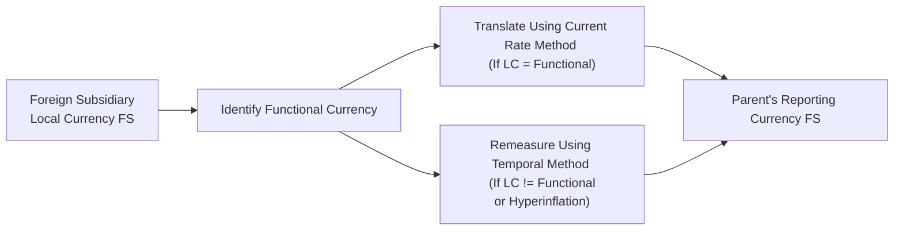

## 14.3 Foreign Currency Translation and Remeasurement

Foreign currency translation and remeasurement ensure a parent organization’s consolidated financial statements accurately reflect the economic reality of foreign subsidiaries. Understanding how currency movements affect financial statements is a vital part of being a CPA, especially in a globalized marketplace. This section breaks down the conceptual framework, provides step-by-step procedures, explores the relevant accounting standards (primarily ASC 830 for U.S. GAAP and IAS 21 for IFRS), and includes real-world examples to help you master these processes.

### Overview and Key Terminology

When a parent company operates through subsidiaries in foreign countries, those subsidiaries often maintain their books in a currency different from the parent’s reporting currency. The question then becomes: “How do we properly bring these foreign statements into the consolidated financials so that stakeholders get a faithful representation of financial performance and position?”

Two main processes exist:
• Translation, also known as the “current rate method” under U.S. GAAP.  
• Remeasurement, often referred to as the “temporal method.”

One of the most critical decisions is identifying the functional currency of the foreign entity. Let’s define some common terminology:

• Local Currency (LC): The currency in which the subsidiary keeps its books on a daily basis.  
• Functional Currency (FC): The currency of the primary economic environment in which the foreign entity operates.  
• Presentation/Reporting Currency (RC): The currency of the parent company’s consolidated financial statements.  

### Determining the Functional Currency

The functional currency should reflect the currency in which the subsidiary primarily generates and expends cash. Under U.S. GAAP (ASC 830) and IFRS (IAS 21), management must consider factors such as:

• Currency that primarily influences sales prices.  
• Currency of the country whose competitive forces and regulations determine sales prices.  
• Currency that mainly influences labor, material, and other costs.  
• Currency from which the subsidiary’s financing is derived.  
• Currency in which cash receipts are retained.  

If the local currency = functional currency, the subsidiary is generally “self-contained,” and the currency in which it transacts is stable relative to day-to-day operations. In this case, the financials are “translated” into the parent’s reporting currency.  

If the local currency ≠ functional currency (or in hyperinflationary economies), the foreign subsidiary’s financials are “remeasured” into the subsidiary’s functional currency first, then “translated” into the parent’s reporting currency.

### Translation vs. Remeasurement

• Translation (Current Rate Method):  
  – Used when the local currency is the functional currency.  
  – Most balance sheet items are translated using the current exchange rate as of the balance sheet date.  
  – Equity accounts (common stock, additional paid-in capital, retained earnings at beginning of year) use historical rates.  
  – Income statement items usually use a weighted-average rate for the period.  
  – Translation adjustments are recognized in other comprehensive income (OCI) rather than net income, until realized via sale or liquidation of the foreign entity.

• Remeasurement (Temporal Method):  
  – Used when the local currency is not the functional currency.  
  – Monetary accounts (cash, accounts receivable, accounts payable, interest-bearing debt) are remeasured at the current exchange rate.  
  – Nonmonetary accounts (inventory measured at cost, fixed assets, intangibles) are remeasured at historical rates.  
  – Income statement items tied to monetary items (such as interest income/expense) use the average rate, while those related to nonmonetary items generally use the historical rate.  
  – Remeasurement gains or losses go directly to net income (rather than OCI), impacting earnings.

### Visualizing the Translation and Remeasurement Process

Below is a Mermaid.js diagram illustrating the steps from foreign subsidiary local currency financial statements to parent’s consolidated currency:

This diagram summarizes the choice between translating or remeasuring a foreign entity’s accounts before consolidation.

---

### Step-by-Step Translation Example

Consider a hypothetical U.S.-based parent that has a Japanese subsidiary. The parent’s reporting currency is USD (U.S. Dollars), while the subsidiary keeps its books in JPY (Japanese Yen), which also happens to be its functional currency. The subsidiary’s summarized financials (in millions of JPY) are as follows:

• Balance Sheet at Year-End:
  – Cash: ¥10,000  
  – Accounts Receivable: ¥20,000  
  – Inventory: ¥30,000  
  – Fixed Assets: ¥40,000  
  – Total Assets: ¥100,000  

  – Accounts Payable: ¥15,000  
  – Long-Term Debt: ¥25,000  
  – Common Stock: ¥30,000  
  – Retained Earnings (beginning of period): ¥20,000  
  – Total Liabilities & Equity: ¥100,000  

• Income Statement for the Year:
  – Sales: ¥120,000  
  – Cost of Goods Sold (COGS): ¥70,000  
  – Operating Expenses (excluding Depreciation): ¥20,000  
  – Depreciation Expense: ¥5,000  
  – Net Income: ¥25,000  

Assume:  
• The beginning-of-year spot rate was 1 USD = ¥100.  
• The end-of-year spot rate is 1 USD = ¥110.  
• The average rate for the year is 1 USD = ¥105.  
• Common stock was issued at inception when the rate was 1 USD = ¥90.  

#### Translation Steps (Local Currency = Functional Currency)

1. Translate Balance Sheet:  
   – Assets and Liabilities at the current year-end rate (¥110 per USD).  
   – Common Stock at the historical rate (¥90 per USD).  
   – Beginning Retained Earnings at the historical or cumulative rate.  
   – Ending Retained Earnings is a plug adjusted for net income (translated at average rate) and dividends (if any).

   Translating each account:  
   – Cash (¥10,000 ÷ ¥110) = $90.91  
   – Accounts Receivable (¥20,000 ÷ ¥110) = $181.82  
   – Inventory (¥30,000 ÷ ¥110) = $272.73  
   – Fixed Assets (¥40,000 ÷ ¥110) = $363.64  

   – Accounts Payable (¥15,000 ÷ ¥110) = $136.36  
   – Long-Term Debt (¥25,000 ÷ ¥110) = $227.27  
   – Common Stock (¥30,000 ÷ ¥90 at issuance) = $333.33  (Note the historical rate)  

2. Translate Income Statement:  
   – Revenues and expenses typically at the average rate (¥105 per USD).  
   – Net income thus becomes: Net Income in JPY ÷ average rate.  
   – ¥25,000 ÷ 105 = approximately $238.10.  

3. Derive Translation Adjustment:  
   – The difference between the translated debits and credits does not go to net income but to other comprehensive income (OCI).  
   – This cumulative translation adjustment shows up on the equity section of the consolidated balance sheet in the parent’s financial statements.

Because the subsidiary’s local currency is also its functional currency, the translation adjustment is deferred in equity as part of Accumulated Other Comprehensive Income (AOCI).

---

### Step-by-Step Remeasurement Example

Now assume the same subsidiary’s functional currency is actually USD, meaning the subsidiary’s local currency (JPY) is not the functional currency. We must remeasure the subsidiary’s books into USD before consolidating. The same trial balances apply, but the method changes:

1. Remeasurement of Balance Sheet:  
   – Monetary items (Cash, Accounts Receivable, Accounts Payable, and Long-Term Debt) at the current year-end rate (1 USD = ¥110).  
   – Nonmonetary items (Inventory, Fixed Assets) at historical rates (suppose they were acquired when 1 USD = ¥100).  
   – Common stock at its historical rate (1 USD = ¥90).  

2. Remeasurement of Income Statement:  
   – Revenues and most expenses at average rate (1 USD = ¥105), unless closely related to a nonmonetary item measured at a historical rate. For instance, depreciation expense on fixed assets acquired at a historical rate of ¥100 per USD is remeasured at the same historical rate.  
   – The net effect of remeasurement differences flows into net income (rather than OCI).

In this scenario, any gain or loss from remeasurement goes directly to the parent’s net income. This could introduce more volatility in reported earnings, as exchange rate fluctuations directly impact the income statement.

---

### Hyperinflationary Economies

When a foreign entity operates in a hyperinflationary environment (e.g., defined under U.S. GAAP as inflation of approximately 100% over a three-year period), the local currency is subject to severe purchasing power fluctuations. In such cases:

• Under U.S. GAAP, the subsidiary’s functional currency is defined as the parent’s reporting currency (i.e., local currency is not considered stable enough to be its functional currency). Consequently, you must remeasure the foreign financial statements using the temporal method.  
• IFRS (IAS 29) requires restating the financial statements for inflation prior to translation to the parent’s reporting currency.  

---

### Illustrative Case Study: Foreign Subsidiary with Local Currency Financials

Imagine a Canadian subsidiary of a U.S. parent. The Canadian entity uses CAD as its local and functional currency. The U.S. parent’s functional currency is USD. The subsidiary does a full set of financial statements in CAD:

Balance Sheet (end of the year, in thousands of CAD):  
• Cash: C$400  
• Accounts Receivable: C$600  
• Inventory: C$900 (carried at C$1,000 historical cost, but with write-down recognized during the year)  
• Property, Plant & Equipment: C$2,000  
• Accounts Payable: C$800  
• Long-Term Debt: C$1,000  
• Common Stock: C$800 (issued years ago)  
• Retained Earnings: C$1,300 (includes current year net income)  

Income Statement (for the current year, in thousands of CAD):  
• Net Sales: C$4,000  
• COGS: C$2,500  
• Operating Expenses: C$1,000  
• Depreciation Expense: C$200  
• Net Income: C$300  

Exchange Rates:  
• January 1: 1 USD = C$1.25  
• December 31: 1 USD = C$1.27  
• Year Average: 1 USD = C$1.26  
• Historical Rate for Common Stock issuance (several years ago): 1 USD = C$1.20  

Since CAD = functional currency for the Canadian subsidiary, we use the current rate method (translation). Let’s summarize:

1. **Balance Sheet**:  
   – Monetary and nonmonetary items use the period-end rate (C$1.27 per USD).  
   – Common Stock is translated at the historical rate (C$1.20).  
   – Retained Earnings at the beginning of the year is rolled forward by adding the translated net income and subtracting any translated dividends.  

2. **Income Statement**:  
   – All revenue and expenses are generally translated at the average rate of C$1.26.  

3. **Resulting Translation Adjustment**:  
   – Captured in OCI.  

Since our example is simplified, let’s highlight just a few specific translations:
  
• Cash: C$400 ÷ 1.27 ≈ US$315  
• AR: C$600 ÷ 1.27 ≈ US$472  
• Inventory: C$900 ÷ 1.27 ≈ US$709  
• PPE: C$2,000 ÷ 1.27 ≈ US$1,575  
• AP: C$800 ÷ 1.27 ≈ US$630  
• Common Stock: C$800 ÷ 1.20 ≈ US$667  (historical rate)  

Everything else uses the year-end rate. Discrepancies that result from using average rates for income statement items and end-of-period/ historical rates for balance sheet items arise in the translation adjustment, reported as a component of OCI.

---

### Practical Implementation Considerations

• **System Configuration**: Many Enterprise Resource Planning (ERP) systems enable multi-currency tracking. Configuring your ERP or consolidation tool to automatically calculate foreign currency translation adjustments can reduce manual errors.  
• **Internal Controls**: Ensure robust review and approval processes are in place for exchange rates used in translation. Scrutinize differences between actual currency fluctuations and recorded gains/losses.  
• **Data Integrity**: Maintain clear documentation for historical exchange rates and reasonings, especially for intangible assets, equity transactions, and business combinations.  
• **Disclosures**: U.S. GAAP requires comprehensive disclosures about foreign currency matters (e.g., ASC 830) including sensitivity to currency rate changes, location of translation adjustments, and potential risks.  

---

### Common Pitfalls and Best Practices

• **Incorrect Functional Currency Determination**: Misclassifying the functional currency leads to significant errors in the financial statements. Always revisit the primary indicators.  
• **Mixing Translation vs. Remeasurement**: Some mistakenly apply the current rate method to an entity that should be remeasured via the temporal method, or vice versa.  
• **Historical Exchange Rate Challenges**: Failing to keep accurate records of historical rates for assets, liabilities, or equity can result in distorted remeasurements or translation adjustments.  
• **Forgetting Proper Presentation**: Under U.S. GAAP, translation adjustments go into OCI. Under IFRS, the concept is similar (OCI as “Exchange Differences on Translation of Foreign Operations”), but small differences in IFRS vs. GAAP can arise, so be vigilant.  
• **Hyperinflation Accounting**: This is often overlooked or mishandled. If you suspect a subsidiary operates in a hyperinflationary environment, carefully consult guidance like ASC 830-10-45-11 or IAS 29.  

Best practices include:  
• Maintaining a log of historical rates for nonmonetary items.  
• Continuously monitoring exchange rate changes and analyzing corresponding impacts on reported results.  
• Training internal staff to understand the differences between translation and remeasurement processes.  

---

### IFRS vs. U.S. GAAP

• **IAS 21** and **ASC 830**: Both define how to translate financial statements of a foreign operation from its functional currency into a presentation currency. In principle, both standards are similar, emphasizing the functional currency concept, current rate for assets/liabilities, and average rate for income statement items.  
• **Hyperinflation**: IFRS has a specific standard (IAS 29) requiring restatement of the financial statements for the effects of inflation before applying IAS 21. Under U.S. GAAP, there is no direct standard parallel to IAS 29; instead, the local currency is frequently deemed non-functional, leading to remeasurement.  
• **Disclosure Requirements**: IFRS can have more nuanced disclosures in some areas, but generally, IFRS and U.S. GAAP share comparable frameworks for presenting cumulative translation adjustments in equity or OCI.

---

### References for Further Exploration

• ASC 830, “Foreign Currency Matters” (U.S. GAAP)  
• IAS 21, “The Effects of Changes in Foreign Exchange Rates” (IFRS)  
• IAS 29, “Financial Reporting in Hyperinflationary Economies” (IFRS)  
• SEC regulations for foreign private issuers and presentations of multi-currency financials  
• Various public company annual reports (Form 10-K) which often detail foreign currency translation adjustments in footnotes  

---

## Master Your Foreign Currency Translation and Remeasurement Knowledge: A Comprehensive Quiz



### Which currency typically prompts the use of the current rate method for foreign currency translation?

- [ ] The parent’s currency
- [ ] Hyperinflationary currency
- [x] The local currency when it is the functional currency
- [ ] The most stable currency within global markets

> **Explanation:** Under both U.S. GAAP and IFRS, the current rate method (translation) is used when the subsidiary’s local currency is deemed to be the entity’s functional currency.

### Under the remeasurement (temporal) method, which types of accounts are generally measured at historical exchange rates?

- [ ] All assets and liabilities
- [ ] Monetary assets and liabilities only
- [x] Nonmonetary assets and liabilities
- [ ] No assets or liabilities

> **Explanation:** In remeasurement, nonmonetary items (inventory at cost, PP&E, certain intangibles) use historical rates, while monetary items (cash, receivables, payables) use the current exchange rate.

### Where is an unrealized foreign currency translation adjustment generally reported when using the current rate method?

- [ ] Net Income
- [x] Other Comprehensive Income (OCI)
- [ ] Retained Earnings
- [ ] Deferred Revenue

> **Explanation:** Translation adjustments using the current rate method go to OCI under U.S. GAAP (ASC 830-30), staying out of net income until liquidation or sale of the subsidiary.

### For a foreign subsidiary operating in a hyperinflationary economy under U.S. GAAP, which currency is typically considered the functional currency?

- [ ] The local hyperinflationary currency
- [x] The parent’s reporting currency
- [ ] The currency of largest trading partner
- [ ] The Euro

> **Explanation:** Under U.S. GAAP, if the local currency is deemed hyperinflationary, it is not recognized as the functional currency. The parent’s reporting currency is treated as the functional currency, so the subsidiary is remeasured, not translated.

### Which of the following is a common pitfall when applying foreign currency translation?

- [x] Mixing rates for translation and remeasurement incorrectly
- [ ] Using average rates for income statement items with the current rate method
- [x] Failing to maintain accurate historical rates for equity items
- [ ] Applying current rates to monetary items under the temporal method

> **Explanation:** Practitioners often confuse the translation method (where everything except equity uses current or average rates) with the remeasurement method (where historical rates apply to nonmonetary items). Accurate historical data is also frequently overlooked.

### In a translation scenario, how are retained earnings typically derived?

- [ ] Using the current exchange rate for all components
- [ ] Carrying forward the prior year’s retained earnings at the new rate
- [ ] A direct translation of total net assets
- [x] A plug number after translating all other balance sheet and income statement components

> **Explanation:** Retained earnings in a translation scenario are partly historical and partly updated by current year translated net income and dividends. It often acts as a “plug” to balance out the accounts, reflecting correct net income, dividends, and previous retained earnings.

### Under IFRS, which standard primarily governs foreign currency translation?

- [ ] IFRS 7
- [ ] IAS 29
- [x] IAS 21
- [ ] IAS 16

> **Explanation:** IAS 21, “The Effects of Changes in Foreign Exchange Rates,” addresses how to translate foreign currency transactions and how to consolidate foreign subsidiaries with different functional currencies.

### In remeasurement, where does the remeasurement gain or loss typically appear on the financial statements?

- [ ] Other Comprehensive Income (OCI)
- [ ] Equity section as an adjustment
- [ ] Disclosed only in the footnotes
- [x] Net Income (Income Statement)

> **Explanation:** Under the temporal method, gains or losses from remeasurement are included in net income because the local currency is not the functional currency, and any fluctuations directly affect the actual monetary position of the entity.

### When would the “current rate method” not be applied under U.S. GAAP?

- [ ] When the local currency is the functional currency
- [x] When the local currency is not the functional currency
- [ ] When exchange rates have been stable
- [ ] When the parent has no foreign subsidiaries

> **Explanation:** If the local currency is not the functional currency, a remeasurement (temporal) method applies instead of the current rate method.

### A subsidiary’s functional currency is different from its local currency. True or False: This situation always necessitates foreign currency remeasurement before consolidation?

- [x] True
- [ ] False

> **Explanation:** When the local currency is not the functional currency, remeasurement into the functional currency is required to accurately reflect the financials prior to translation into the parent’s reporting currency.



---

## For Additional Practice and Deeper Preparation

### [Business Analysis and Reporting (BAR) CPA Mock Exams](https://www.udemy.com/course/bar-cpa-mock-exams/?referralCode=ADBE2E84BEE9CB6243CA)

**Business Analysis and Reporting (BAR) CPA Mocks:** 6 Full (1,500 Qs), Harder Than Real! In-Depth & Clear. Crush With Confidence! 

- Tackle full-length mock exams designed to mirror real BAR questions.  
- Refine your exam-day strategies with detailed, step-by-step solutions for every scenario.  
- Explore in-depth rationales that reinforce higher-level concepts, giving you an edge on test day.  
- Boost confidence and minimize anxiety by mastering every corner of the BAR blueprint.  
- Perfect for those seeking exceptionally hard mocks and real-world readiness.  

_Disclaimer: This course is not endorsed by or affiliated with the AICPA, NASBA, or any official CPA Examination authority. All content is for educational and preparatory purposes only._
