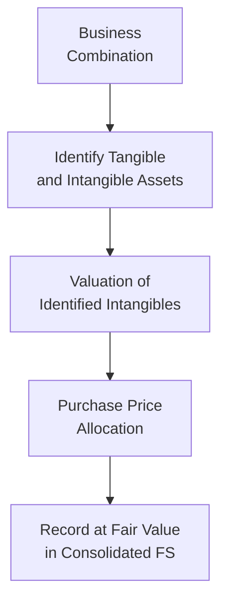

## 14.4 Complex Consolidation Eliminations and Disclosures

Complex business structures often involve multiple subsidiaries, intercompany transactions, intricate intangible allocations, and subsequent measurement considerations that can make the consolidation process challenging. As highlighted in earlier discussions of business combinations and related topics (see Chapter 10 for intangible assets and goodwill, and Section 14.1 for acquisition basics), proper eliminations and disclosures are required to ensure transparency and consistency in financial statements. This section addresses the nuanced steps involved in eliminating intercompany balances, recognizing and valuing intangibles, and undertaking subsequent measurement—all while meeting rigorous disclosure obligations.

### Overview of Consolidation Complexities

In a perfect world, a consolidated set of financial statements would seamlessly reflect the economic reality of a parent and all its subsidiaries as if they were one single entity. However, in practice, these financial statements can become cluttered with intercompany transactions that artificially inflate revenues, expenses, assets, or liabilities. Additionally, intangible assets acquired in business combinations—such as customer relationships, trademarks, and proprietary technology—require initial recognition, subsequent valuation, and possible impairment testing. The process is further complicated by the potential for partial ownership, noncontrolling interests, and layered acquisition structures.

Effective consolidation requires a thorough, step-by-step approach designed to ensure that:

• All intercompany transactions, balances, sales, and expenses are eliminated so that consolidated financial statements are free of duplication.  
• Intangible assets, goodwill, and other acquired balances are properly recognized and measured according to U.S. GAAP (ASC 805, ASC 810) or IFRS (IFRS 3, IFRS 10).  
• Post-acquisition events (e.g., impairment, amortization) are accurately reflected.  
• All stakeholders understand the financial impact of the consolidation through robust disclosures.

### Handling Intercompany Transactions

Intercompany transactions can take many forms, including intercompany sales of inventory or property, loans, management fees, and intercompany leasing arrangements. Each type of transaction can trigger the need for specific elimination entries. In complicated consolidation scenarios—particularly when multiple subsidiaries or operating segments engage in widespread intercompany activities—maintaining clarity on these eliminations is essential.

#### Common Intercompany Transactions

• Intercompany sales of inventory: Profit on unsold inventory must be eliminated from the consolidated financial statements.  
• Intercompany loans and interest: Often, parent or subsidiary entities charge each other interest. Both the interest expense on one side and interest income on the other are eliminated.  
• Intercompany dividends: Dividends distributed by a subsidiary to its parent or fellow subsidiaries are eliminated.  
• Management and service fees: These often arise when a parent provides administrative or other services to subsidiaries; all associated revenues and expenses must be eliminated.  

#### Typical Elimination Entries

At the end of each reporting period, the parent company typically processes elimination entries. While the exact journal entries vary based on the nature of the intercompany transaction, the principle is the same: eliminate artificial gains or losses and balance out any intercompany asset/liability accounts. Below is a simplified illustration showing how consolidating entries remove the effects of intercompany equipment sales and receivables:

In this example:  
1. The parent company records a receivable from the subsidiary.  
2. The subsidiary corresponds with a payable to the parent.  
3. Any gain or profit from the intercompany equipment sale must be eliminated.  

In more complex situations, especially when there are multiple layers of ownership (e.g., the parent owns one subsidiary, which in turn owns a second subsidiary), a structured approach and well-prepared workpapers are instrumental in ensuring all intercompany balances and unrealized profits are identified and removed.

### Intangible Allocations

When a parent company acquires a controlling stake in a subsidiary, it must perform a fair value assessment of the acquired entity’s assets and liabilities, including intangible assets (refer to Chapter 10 for a detailed discussion on goodwill and intangible lived assets). These intangible allocations can include:

• Customer or supplier relationships  
• Patents, trademarks, and proprietary technology  
• Noncompete agreements  
• Brand names and trade names  
• In-process research and development (IPR&D)  

Allocating the purchase price to these intangible assets is rarely straightforward. It requires valuation expertise, and often third-party specialists, to determine fair values. The allocation process itself may be iterative—initial provisional amounts sometimes get revised within the allowable measurement period (generally one year from the acquisition date).

Below is a conceptual diagram illustrating how intangible assets are identified and allocated during consolidation:

#### Measurement Period Adjustments

In the first twelve months following the acquisition, the acquirer may revise its initial valuations as new information becomes available. If intangible assets require adjustments, these revisions are generally accounted for as retrospective adjustments to the acquisition date fair values. Disclosures must be updated accordingly, indicating the nature and amount of the changes.

#### Common Pitfalls in Intangible Allocations

• Overlooking intangible assets—especially those that do not generate direct revenue streams (e.g., certain intellectual property or brand assets).  
• Double-counting intangible assets, leading to inflated purchase price allocations.  
• Failing to reevaluate intangible assets within the measurement period when new valuation information emerges.  
• Not reflecting subsequent impairment or adjustments in the consolidated financials accurately.

### Subsequent Measurement Considerations

Once intangible assets have been recognized, subsequent accounting includes amortization (for finite-lived intangibles) and recurring impairment tests for indefinite-lived or goodwill-related assets. Additionally, adjustments for any further changes in ownership interests, step acquisitions, or partial disposals of subsidiaries must be addressed.

#### Noncontrolling Interests (NCI)

In many complex structures, a parent does not own 100% of a subsidiary. ASC 810 (for GAAP) or IFRS 10 (for IFRS) requires the recognition of a noncontrolling interest in the subsidiary’s net assets. Noncontrolling interests must be adjusted for:

• Share of subsidiary net income or loss each reporting period.  
• Dividends or distributions made by the subsidiary.  
• Changes in ownership share (e.g., if the parent acquires an additional ownership stake, or if a part of the subsidiary is sold to outside investors).

#### Impairment Testing for Acquired Intangibles

Finite-lived intangible assets are amortized over their estimated useful lives and tested for impairment only if indicators of impairment arise. Indefinite-lived intangibles and goodwill, by contrast, are typically tested annually for impairment (or more frequently if events or circumstances warrant). For goodwill, the impairment is assessed at the reporting unit level, considering both qualitative and quantitative factors (see Chapter 10 for deeper guidance on goodwill impairment).

#### Intercompany Profits on Downstream or Upstream Transactions

Even after the initial consolidation, new intercompany transactions may involve intangible assets. For example, if a subsidiary licenses technology to the parent or another subsidiary, revenue recognized by the licensor and the amortization recorded by the licensee must be evaluated for elimination in the consolidated financial statements if the license is effectively an internal arrangement with no third-party beneficiary. The same logic applies to intangible transfers or cost-sharing agreements.

### Disclosures in Complex Consolidations

In addition to the elimination entries themselves, entities must provide disclosures that help financial statement users understand the nature and impact of the consolidation. These disclosures often include:

• Detailed information about the scope of consolidation, including which entities are consolidated and why.  
• Summary of significant accounting policies around consolidation, intercompany eliminations, and intangible valuation.  
• Nature and amounts of noncontrolling interests, including the proportion of ownership of subsidiaries that are not wholly owned.  
• The valuation methods and significant assumptions used to assign fair values to acquired intangibles, particularly if these valuations are material or involve significant management judgment.  
• The amount and nature of any measurement period adjustments, if applicable, along with a discussion of why these adjustments were made.  
• Goodwill and intangible asset rollforwards, including additions, subtractions, impairment losses, or other changes throughout the period.  
• Related party transactions and their effect on the consolidated financial statements, if the intercompany transactions are with entities owned or controlled by related parties.

#### Regulatory and Standards-Based Guidance

In the U.S., the principal guidance on consolidation can be found primarily in ASC 805 (Business Combinations) and ASC 810 (Consolidation), with parallels in IFRS 3 (Business Combinations) and IFRS 10 (Consolidated Financial Statements). Additionally, SEC registrants must comply with Regulation S-X, which sets forth requirements for consolidated financial statements filed with the SEC. Disclosures for intangible assets, goodwill, and subsequent impairments are often scrutinized under Regulation S-K (as detailed in Chapter 17).

### Real-World Scenario: Multi-Tier Ownership

Consider a situation in which Company A acquires a 70% interest in Company B, which itself owns 55% of Company C. While preparing consolidated financial statements, Company A must:

• Eliminate intercompany sales or services between A and B, B and C, and potentially A and C if there are direct transactions.  
• Recognize intangible assets acquired through the acquisition of B if B had intangible assets from a prior acquisition of C.  
• Perform subsequent measurement for intangible assets recognized in B’s consolidation of C, and for intangible assets recognized in A’s consolidation of B.  
• Calculate noncontrolling interests at each level, reflecting the share of net income or loss attributable to external owners of B and C.  
• Provide robust disclosures describing these ownership layers, the intangible assets recognized, any measurement period adjustments, and the methods used to determine fair values.

Using a robust, centralized consolidation system and consistent chart of accounts can greatly simplify complexities, reduce errors, and ensure that elimination entries and intangible asset valuations are consistently applied.  

### Best Practices and Practical Strategies

• Maintain detailed workpapers that track all intercompany balances on a monthly or quarterly basis. This helps ensure no intercompany transaction is overlooked during the consolidation process.  
• Use cross-functional teams, including financial accountants, analysts, valuation experts, and tax professionals, when performing intangible valuations and subsequent impairment testing. This prevents oversight or double counting.  
• Consider employing specialized consolidation software that automatically flags intercompany inconsistencies or helps with partial ownership calculations.  
• Stay updated on changes in accounting standards (see Chapter 23 for emerging issues), especially when they affect consolidation thresholds or intangible asset treatment.  
• Present clear, transparent disclosures. Even if the complexity is formidable, clarity in explaining how intangible assets are valued, how goodwill is tested, and how intercompany transactions have been eliminated, fosters trust in the financial statements.

### Illustrative Practical Example

Imagine a global technology group, TechFusion, which acquires a 75% equity stake in a smaller competitor, SoftCore, for $10 million. During the acquisition due diligence, TechFusion identifies valuable intangible assets in SoftCore, such as a proprietary machine learning algorithm and established customer relationships. The initial valuations record:

• Goodwill: $2 million  
• Value of proprietary technology: $3 million (finite-lived, amortizable over 5 years)  
• Value of customer relationships: $1 million (finite-lived, amortizable over 10 years)

Six months into the measurement period, TechFusion uncovers additional intangible assets—a valuable data analytics platform—that was understated. Revised fair valuation for this intangible is $2 million instead of $1 million. Consequently, goodwill is reduced by $1 million. TechFusion discloses this adjustment in its next set of consolidated financial statements, explaining in the footnotes:

• The nature of the discovered intangible asset.  
• The period in which the revision was made.  
• The resulting impact on intangible assets and goodwill.  

Moreover, TechFusion eliminates any intercompany transactions post-acquisition, which might include software licensing fees that SoftCore charges to TechFusion’s subsidiaries. In the consolidated statements, the licensing revenue and corresponding licensing expense are netted off.

### References and Continuing Education

For detailed guidance on business combination accounting, see ASC 805 and IFRS 3. For consolidation procedures and noncontrolling interests, review ASC 810 and IFRS 10/12. Additionally, review chapter 10 for an in-depth exploration of indefinite-lived intangible assets and goodwill testing, and Chapter 23 for emerging trends in IFRS vs. U.S. GAAP.  

Professional organizations like the AICPA and the National Association of Certified Valuators and Analysts (NACVA) frequently provide continuing education courses on valuation and intangible asset measurement. Online resources and authoritative literature (e.g., FASB’s Accounting Standards Codification) offer ample opportunities to deepen your expertise.

---

## Complex Consolidation Eliminations and Disclosures Quiz



### In a complex consolidation, why are intercompany transactions eliminated?

- [x] To avoid double counting revenues and expenses in consolidated financial statements
- [ ] To increase the parent's consolidated net income
- [ ] To inflate asset values and create reserves
- [ ] Because all related-party transactions are illegal under GAAP

> **Explanation:** Intercompany transactions are eliminated because consolidated statements present the group as a single economic entity. Any profit or loss from intercompany transactions does not represent a “true” transaction with an external party, so it must be removed.

### Which statement best describes the measurement period adjustments under ASC 805?

- [x] They allow the acquirer to retrospectively adjust initially recorded fair values within one year of acquisition
- [ ] They are only allowed for intangible assets that have indefinite lives
- [x] They require changes to be reported prospectively for each quarter only
- [ ] They never affect goodwill

> **Explanation:** Under ASC 805, the acquirer may adjust initial provisional amounts retrospectively within a year of the acquisition if new information changes the original valuation assumptions. Although intangible assets are common sources of measurement period adjustments, goodwill can also be impacted.

### What is the primary purpose of recognizing noncontrolling interests (NCI)?

- [x] To represent the ownership interest in consolidated subsidiaries not held by the parent
- [ ] To eliminate intercompany transactions
- [ ] To depreciate intangible assets acquired in a business combination
- [ ] To record accumulated other comprehensive income

> **Explanation:** NCI represents the portion of equity (net assets) in a subsidiary not owned by the parent entity. This ensures that the consolidated statements reflect the economic interest of outside shareholders.

### Why must intangible assets be carefully evaluated during the consolidation process?

- [x] To ensure they are properly identified, valued, and subsequently measured
- [ ] To classify them uniformly as goodwill
- [ ] To make all intangible assets indefinite-lived by default
- [ ] To adjust them to zero before consolidation disclosures

> **Explanation:** In a business combination, intangible assets must be identified, recognized at fair value, and then assessed for their useful life (finite or indefinite) to determine appropriate amortization or impairment testing.

### Which of the following events typically triggers an elimination entry?

- [x] A subsidiary providing services to the parent, resulting in intercompany revenue
- [ ] A downstream sale from the parent to an external customer
- [x] Goodwill impairment in a consolidated subsidiary
- [ ] Loss on the parent’s sale of inventory to a third party

> **Explanation:** Elimination entries remove the effect of intercompany revenues, expenses, gains, or losses so that they are not overstated in consolidated financial statements. Goodwill impairment alone is recorded at the consolidated level but does not cause an intercompany elimination; however, certain intercompany intangible transactions can trigger elimination entries.

### How does partial ownership in a subsidiary affect consolidation?

- [x] It requires recognizing and measuring noncontrolling interests
- [ ] All of the subsidiary’s assets and liabilities are excluded
- [ ] No elimination entries are required
- [ ] It invalidates the need for a consolidated financial statement

> **Explanation:** When the parent does not own 100% of a subsidiary, the parent must recognize and measure the share of subsidiary net assets that belong to other investors as noncontrolling interests, adjusting consolidation entries accordingly.

### What happens if new information emerges that changes the valuation of an intangible asset after the measurement period has ended?

- [x] The change is accounted for prospectively, impacting the financial statements in the period of the discovery
- [ ] The allocation is retroactively adjusted to the acquisition date
- [x] Goodwill must be automatically written off
- [ ] The intangible asset is reclassified as goodwill indefinitely

> **Explanation:** Once the measurement period closes, any new information that would have changed past valuations is recognized prospectively, unless a restatement or correction of an error is required.

### Which item is most crucial for accurate intercompany profit elimination?

- [x] Proper identification of unrealized profit in ending inventory or transferred assets
- [ ] Classifying intangible assets as indefinite-lived
- [ ] Immediately expensing all intangible-related costs
- [ ] Arbitrarily deferring parent investment gains

> **Explanation:** To eliminate intercompany profit accurately, unrealized profit embedded in ending inventory or other transferred assets must be carefully identified and adjusted so as not to inflate consolidated net income.

### Why are disclosures particularly important in complex consolidations?

- [x] They provide transparency about the nature and amount of significant judgments made, particularly around valuation and intercompany transactions
- [ ] They replace the need to follow GAAP or IFRS
- [ ] They ensure intangible assets are never shown on the balance sheet
- [ ] They eliminate the requirement for an external audit

> **Explanation:** In complex consolidations, disclosures give users essential insight into how acquisitions, intangible allocations, noncontrolling interests, and intercompany transactions have been managed and reported, thus promoting transparency and comparability.

### True or False: Intercompany eliminations are only necessary when subsidiaries are wholly owned by the parent.

- [x] True
- [ ] False

> **Explanation:** Intercompany eliminations are required for all transactions among entities within the consolidated group, regardless of whether the ownership interest is 100% or partial.



---

## For Additional Practice and Deeper Preparation

### [Business Analysis and Reporting (BAR) CPA Mock Exams](https://www.udemy.com/course/bar-cpa-mock-exams/?referralCode=ADBE2E84BEE9CB6243CA)  

**Business Analysis and Reporting (BAR) CPA Mocks:** 6 Full (1,500 Qs), Harder Than Real! In-Depth & Clear. Crush With Confidence! 

- Tackle full-length mock exams designed to mirror real BAR questions.  
- Refine your exam-day strategies with detailed, step-by-step solutions for every scenario.  
- Explore in-depth rationales that reinforce higher-level concepts, giving you an edge on test day.  
- Boost confidence and minimize anxiety by mastering every corner of the BAR blueprint.  
- Perfect for those seeking exceptionally hard mocks and real-world readiness.  

_Disclaimer: This course is not endorsed by or affiliated with the AICPA, NASBA, or any official CPA Examination authority. All content is for educational and preparatory purposes only._
