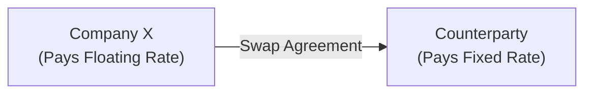

## 15.1 Types of Derivatives (Swaps, Options, Futures)

Derivatives are financial instruments whose value is derived from an underlying asset, index, or reference rate. They are integral to modern financial markets, allowing organizations to manage or speculate on market movements, hedge risk exposures, and optimize capital structure. Derivatives’ underlying items can include interest rates, currencies, commodities, equity securities, credit risk, or even intangible benchmarks such as weather indexes. This section explores three of the most common derivative contracts—swaps, options, and futures—highlighting why institutions use them, how they function, and their typical accounting approach under U.S. GAAP and IFRS standards.

-------------------------------------------------------------------------------
### Overview of Derivatives
Derivatives are typically used for one or more of the following purposes:

• Hedging: Companies often hedge specific exposures (e.g., interest rate risk, foreign currency risk, commodity price risk) to stabilize future cash flows and lower the variability of earnings.  
• Speculation: Traders and investors sometimes use derivatives to profit from market fluctuations without holding the underlying asset directly.  
• Arbitrage: Market participants exploit price differentials of the same security or commodity in different markets to realize risk-free or low-risk profits.  
• Access and Efficiency: Derivatives can offer exposure to certain markets more cost-effectively than trading in the underlying asset itself.

Regardless of the motivator, accounting rules (primarily in ASC 815, “Derivatives and Hedging,” and IFRS 9, “Financial Instruments”) require that all derivatives be recorded at fair value on the balance sheet. The nature of the gain or loss recognition depends on whether the derivative is designated in a hedging relationship and the specific type (fair value, cash flow, or net investment hedge).

-------------------------------------------------------------------------------
### Swaps
Swaps are private agreements between counterparties to exchange or “swap” different cash flow streams over time. Common types of swaps include interest rate swaps, currency swaps, and commodity swaps. Because swaps are over-the-counter (OTC) instruments, they can be customized to fit a company’s specific risk profile.

#### Key Characteristics of Swaps
1. Negotiated Terms: Swaps are generally tailor-made contracts, enabling parties to specify notional amounts, payment schedules, and underlying indices.  
2. No Principal Exchange in Most Cases: In an interest rate swap, the notional principal is not typically exchanged; rather, exchange is limited to periodic interest payments.  
3. Long-Term Orientation: Swaps often span multiple years, making them suitable for businesses seeking stable, longer-term hedges.  

#### Common Use Cases
• Interest Rate Risk Management: A company with floating-rate debt that desires fixed interest payments can enter into a pay-fixed, receive-floating interest rate swap. Conversely, a company with fixed-rate debt seeking to benefit from falling interest rates can enter a pay-floating, receive-fixed structure.  
• Currency Exposure: Multinational companies often use currency swaps to reduce exposure to foreign exchange rate fluctuations when repatriating profits or servicing debt in multiple currencies.  
• Commodity Price Stability: Entities exposed to volatile commodity prices (e.g., a large airline concerned about rising fuel prices) may structure swap contracts to effectively lock in a fixed cost.  

#### Typical Accounting Approach
Under U.S. GAAP (ASC 815) and IFRS (IFRS 9), swaps are recognized at fair value on the balance sheet. If the swap is designated as a hedging instrument:  
• Fair Value Hedge: Changes in the derivative’s fair value and the hedged item’s fair value typically offset in earnings, reducing net income volatility.  
• Cash Flow Hedge: Effective derivatives’ gains or losses are recorded in Other Comprehensive Income (OCI) until the hedged transaction affects earnings.  
• Non-Designated Swap: Gains and losses flow directly to net income (or profit or loss under IFRS) as they arise.  

Accurate documentation of the hedging relationship, hedge objectives, and testing hedge effectiveness are critical components for qualifying under hedge accounting. If hedge accounting rules are not met, the entire change in the derivative’s fair value flows directly through earnings each period.

#### Diagram: Conceptual View of an Interest Rate Swap

In this simplified illustration, Company X enters into a swap with a counterparty. Company X makes floating-rate payments (e.g., tied to a benchmark like SOFR or LIBOR) to the counterparty while receiving fixed-rate payments in return. If designated as a cash flow hedge, the swap’s gains or losses mitigate variability in Company X’s interest payments on floating-rate debt.

-------------------------------------------------------------------------------
### Options
An option is a contract granting the holder the right, but not the obligation, to buy or sell an underlying asset at a specified price (the “strike price”) on or before a certain date. Options typically trade on organized exchanges (e.g., the Chicago Board Options Exchange) when linked to stocks or certain indexes, but they can also be customized OTC contracts, particularly for currency and commodity transactions.

#### Types of Options
• Call Option: Gives the holder the right to buy an underlying asset at or below the strike price. A call buyer benefits from asset price increases above the strike.  
• Put Option: Gives the holder the right to sell an underlying asset at or above the strike price. A put buyer profits from price decreases below the strike.  

Unlike swaps, options require an upfront premium payment from buyer to seller. This premium compensates the option writer for transferring risk. If the market moves favorably for the option holder, they can exercise the option to realize a profit (or hedge outcome). If the market moves unfavorably, the holder can simply allow the option to expire, limiting the holder’s loss to the premium paid.

#### Payoff Formula for a Call Option
Using KaTeX, the payoff for a call option at maturity (time T) can be expressed as:

 \text{Payoff}_{\text{Call}} = \max\,(S_T - K, 0) 

where:  
• \\( S_T \\) = the underlying asset’s price at maturity  
• \\( K \\)   = the option’s strike price  

When \\( S_T > K \\), the call option finishes “in the money” and has intrinsic value of \\( S_T - K \\). When \\( S_T \leq K \\), the option is “out of the money,” and the holder typically allows it to expire worthless (if no other externalities, such as time premium, exist).

#### Common Use Cases
• Hedging Downside Risk: A put option protects holders from falling asset prices (e.g., a commodity producer can lock in a minimum selling price).  
• Income Generation: Writing covered calls allows equity holders to earn premium income while capping upside potential.  
• Strategic Buildup of Positions: A company can use call options to gradually enter or build up a position in a commodity or currency while limiting downside exposure.  

#### Typical Accounting Approach
Both the premium paid and the subsequent changes in fair value are recognized on the balance sheet. Under ASC 815 and IFRS 9, the fair value changes go through either net income or OCI, depending on hedge designation:  
• For a cash flow hedge (e.g., purchasing a put option to hedge forecasted cash flows), the effective portion of the option’s changes in fair value is deferred in OCI until the hedged transaction impacts earnings.  
• If the derivative is not designated as a hedge, changes in the option’s fair value are recorded in current earnings.  

The option buyer records the asset at cost (the premium) initially. Over time, this asset is remeasured at fair value, which can be higher or lower than the premium depending on market conditions. Option writers (sellers) generally record a liability, representing their obligation should the buyer exercise the option.

-------------------------------------------------------------------------------
### Futures
Futures are standardized contracts obligating the buyer to purchase (or the seller to deliver) a specific quantity of an asset at a predetermined price at a set future date. Unlike swaps (which are OTC) and some custom options, futures contracts trade on recognized exchanges such as the Chicago Mercantile Exchange (CME). The exchange clearinghouse acts as an intermediary, ensuring performance by both contract parties through margin requirements and daily cash settlements (mark to market).

#### Key Differences: Futures vs. Forwards
• Standardization: Futures are highly standardized, unlike forward contracts negotiated bilaterally.  
• Exchange Trading: Futures are traded on regulated exchanges, providing transparency in pricing and liquidity.  
• Daily Settlement: Futures positions are marked to market daily, whereas forwards typically settle only at the contract’s end date.  

#### Common Use Cases
• Commodity Price Risk: Companies heavily reliant on a commodity (e.g., agricultural producers, mining companies, etc.) can lock in future prices to reduce profit margin volatility.  
• Interest Rate Management: Traders speculating on changes in interest rate levels can use Treasury futures.  
• Foreign Exchange: Entities with currency exposure can hedge future FX requirements using currency futures.  
• Portfolio Management: Institutions use stock index futures to quickly adjust equity exposure or hedge existing equity portfolios.

#### Typical Accounting Approach
Similar to other derivatives, futures are recorded at fair value:

• Daily Margin Adjustments: Gains or losses from daily settlement flows typically appear in net income unless designated in a qualifying hedging relationship.  
• Hedge Accounting Eligibility: A futures contract can be designated as a fair value or cash flow hedge if it meets hedge accounting requirements (e.g., hedging a forecasted transaction’s commodity price risk).  
• Non-Designated Futures: All fair value changes impact net income immediately.  

-------------------------------------------------------------------------------
### Comparative Summary: Swaps, Options, and Futures

| Feature              | Swaps                                  | Options                                            | Futures                                          |
|----------------------|----------------------------------------|----------------------------------------------------|--------------------------------------------------|
| Market Type          | OTC, customized                        | Exchange-traded (standardized) or OTC (customized) | Exchange-traded, standardized                   |
| Cash Flows           | Periodic exchange of interest or other | One-time premium, payoff only if exercised         | Daily mark-to-market adjustments                |
| Upfront Costs        | Often none (except for credit support) | Buyer pays premium; seller receives premium        | Generally minimal (margin requirements)         |
| Risks                | Counterparty risk; market rates        | Time decay for buyer; unlimited risk for writer    | Basis risk against underlying and margin calls  |
| Accounting Treatment | Fair value on balance sheet; potential hedge accounting | Fair value on balance sheet; potential hedge accounting | Fair value on balance sheet; potential hedge accounting |

-------------------------------------------------------------------------------
### Practical Illustration: Hedging with Derivatives
Suppose a manufacturing firm, XYZ Corp., operates with a significant portion of floating-rate debt. They anticipate that interest rates will rise and want to prevent increased interest expense. They enter into a pay-fixed, receive-floating interest rate swap (a standard cash flow hedge). Over the next five years:

• XYZ Corp. pays a fixed 5% on the notional to the counterparty.  
• XYZ Corp. receives a floating rate (e.g., SOFR + 2%).  
• The net effect is that XYZ Corp. effectively “locks in” a fixed interest expense, avoiding significant variability in its cash flows.  
• If interest rates rise, the swap gains in fair value; if interest rates fall, the swap’s fair value decreases. However, the net interest expense remains relatively stable in the short run compared to having entirely floating-rate debt.

Accounting wise, XYZ Corp. records the derivative at fair value on its balance sheet every reporting period. The effective portion of change in the swap’s value goes into OCI (cash flow hedge accounting), offsetting the variability in the floating rate debt payments once realized.

-------------------------------------------------------------------------------
### Best Practices and Pitfalls
1. **Documentation**: Proper and timely hedge documentation is crucial to benefit from hedge accounting. Ensure all IFRS 9 or ASC 815 requirements, including risk management objectives, are properly outlined at inception.  
2. **Effectiveness Testing**: Continual assessments ensure that changes in the derivative’s fair value effectively offset changes in the hedged risk. Inadequate testing can result in disqualification or partial hedge accounting treatment.  
3. **Valuation Complexity**: Valuing OTC derivatives—for example, long-dated swaps or exotic options—can require sophisticated models and assumptions about interest rates, volatility, or correlations.  
4. **Credit Risk and Collateral**: When dealing OTC, creditworthiness of the counterparty is key. Entities often post collateral (e.g., via margin accounts) to mitigate credit exposure.  
5. **Regulatory Changes**: Post-financial crisis regulations increased clearing requirements, margin mandates, and transparency for OTC derivatives, especially in interest rate swaps and certain foreign exchange derivatives. Companies seeking derivatives must keep abreast of compliance mandates in their jurisdictions.

-------------------------------------------------------------------------------
### Additional References
• ASC 815 – Derivatives and Hedging (U.S. GAAP)  
• IFRS 9 – Financial Instruments (IFRS)  
• “Risk Management and Financial Institutions” by John C. Hull  
• Commodity Futures Trading Commission (CFTC): www.cftc.gov  
• International Swaps and Derivatives Association (ISDA): www.isda.org  

-------------------------------------------------------------------------------
## Derivatives Mastery Quiz



### Which of the following is a primary reason corporations might enter into an interest rate swap?

- [ ] To eliminate all debt on the balance sheet
- [x] To protect against rising interest rates in floating-rate debt
- [ ] To speculate on currency price movements
- [ ] To completely avoid recording fair value gains or losses

> **Explanation:** Corporations often use interest rate swaps to convert floating-rate debt into fixed-rate obligations, reducing the risk of rising rates and stabilizing cash outflows.

### A key distinction between futures and swaps is:

- [ ] Both are highly customized, OTC contracts
- [ ] Only futures are subject to fair value accounting
- [x] Futures are exchange-traded and standardized, whereas swaps are typically OTC and customizable
- [ ] Swaps are settled daily via margin calls, while futures are settled at contract maturity

> **Explanation:** Futures contracts are exchange-traded, subject to daily margin calls, and standardized in terms of quantity and settlement dates. Swaps, on the other hand, are tailor-made OTC products often used for longer-term hedging.

### What is the intrinsic value of a put option at maturity if the strike price is $100 and the underlying asset’s price is $80?

- [x] $20
- [ ] $0
- [ ] –$20
- [ ] The entire original premium

> **Explanation:** The intrinsic value of a put option is max(K – S_T, 0). Here, max(100 – 80, 0) = $20 at maturity.

### Which of the following best describes the accounting treatment for derivatives not designated in a hedge relationship?

- [ ] Their fair value changes are deferred in Other Comprehensive Income
- [ ] They are excluded from the balance sheet until realized
- [ ] Gains or losses are recognized in comprehensive income only at maturity
- [x] Their fair value changes usually flow through net income immediately

> **Explanation:** Under ASC 815 / IFRS 9, if you do not apply hedge accounting, you generally record changes in a derivative’s fair value in net income (or profit or loss) each reporting period.

### Which statement accurately outlines daily settlement in futures contracts?

- [ ] The net gains or losses are ignored until final delivery
- [x] The futures position is marked to market each day, requiring cash margin adjustments
- [ ] Futures are settled only if the buyer exercises the option
- [ ] This process applies only to currency swaps

> **Explanation:** Futures exchanges use a mechanism called daily mark to market. Any gains or losses are credited or debited to the participants’ margin accounts daily.

### How does a receive-fixed, pay-floating interest rate swap hedge floating-rate debt exposure?

- [ ] It eliminates the debt from the balance sheet
- [x] It offsets the variability in interest payments by receiving a fixed rate and paying a floating rate
- [ ] It turns fixed-rate debt into floating-rate debt
- [ ] It is recorded at historical cost and left unadjusted

> **Explanation:** In such a swap, the firm pays floating and receives fixed, offsetting its original floating element. Thus, the firm’s effective interest rate exposure becomes more fixed over that period.

### What is the main difference between a call option and a put option?

- [x] A call gives the holder the right to buy, and a put gives the holder the right to sell
- [ ] A call option has no premium requirement
- [x] Both can be used to hedge or speculate, but they perform opposite functions
- [ ] A put option must always be exercised if in the money

> **Explanation:** Call options allow buying the underlying at the strike, while put options allow selling at the strike. Both serve various strategic and hedging purposes in risk management.

### When a company writes an option, it initially:

- [x] Records a liability at the option’s fair value (premium)
- [ ] Recognizes an asset at zero
- [ ] Immediately records gain in net income
- [ ] Defers recognition until the option is exercised

> **Explanation:** Writing (selling) an option creates an obligation to perform if exercised, so the company generally recognizes a liability at the fair value of the premium received.

### In a cash flow hedge, how are changes in the value of the hedging instrument recognized?

- [x] In Other Comprehensive Income until the hedged transaction affects earnings
- [ ] Entirely in current net income every period
- [ ] Not recognized until the derivative is settled
- [ ] Outside of the financial statements altogether

> **Explanation:** For a qualifying cash flow hedge, the effective portion of the hedge’s gains or losses is deferred in OCI. Once the hedged item impacts earnings, the deferred gains or losses are recycled through net income.

### A derivative is considered “in the money” when:

- [x] It has a positive intrinsic value based on the relationship between the underlying price and the strike price
- [ ] The premium is fully recouped by the writer
- [ ] There is still time value left
- [ ] It has not reached maturity

> **Explanation:** “In the money” denotes that an option has real, or intrinsic, value. For a call, this occurs when the underlying asset price is above the strike price; for a put, it occurs when the underlying price is below the strike price.



-------------------------------------------------------------------------------

## For Additional Practice and Deeper Preparation

### [Business Analysis and Reporting (BAR) CPA Mock Exams](https://www.udemy.com/course/bar-cpa-mock-exams/?referralCode=ADBE2E84BEE9CB6243CA)

**Business Analysis and Reporting (BAR) CPA Mocks:** 6 Full (1,500 Qs), Harder Than Real! In-Depth & Clear. Crush With Confidence!

- Tackle full-length mock exams designed to mirror real BAR questions.  
- Refine your exam-day strategies with detailed, step-by-step solutions for every scenario.  
- Explore in-depth rationales that reinforce higher-level concepts, giving you an edge on test day.  
- Boost confidence and minimize anxiety by mastering every corner of the BAR blueprint.  
- Perfect for those seeking exceptionally hard mocks and real-world readiness.  

_Disclaimer: This course is not endorsed by or affiliated with the AICPA, NASBA, or any official CPA Examination authority. All content is for educational and preparatory purposes only._
