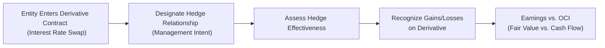

## 15.2 Fair Value vs. Cash Flow Hedges

Hedging strategies play a central role in risk management, helping organizations mitigate uncertainties in interest rates, foreign exchange, commodity prices, and more. When companies designate a derivative as a hedge for accounting purposes, it can qualify as either a fair value hedge or a cash flow hedge under U.S. GAAP (primarily governed by ASC 815). The distinction between these two categories significantly affects where gains and losses on the hedging instrument are reported—either through earnings or Other Comprehensive Income (OCI). This section takes a deep dive into the key concepts, documentation requirements, measurement intricacies, journal entries, and best practices for each type of hedge. Readers should find value in this discussion as a reference for advanced managerial decision-making, financial reporting, and exam preparation.

### Introduction to Hedge Accounting

Hedge accounting aims to align the gains and losses from a hedging instrument (often a derivative) with the underlying risk exposure it is meant to offset. By doing so, net income or comprehensive income is more representative of the underlying economic reality. However, achieving hedge accounting treatment is subject to specific rules and documentation. In practice, hedge accounting serves to:

• Mitigate volatility in earnings or cash flows caused by market, credit, or operational exposures.  
• Match hedging gains and losses with those from the items being hedged.  
• Provide more transparent financial statements that reflect risk management activities.

#### Requirements for Hedge Accounting

In Section 15.1, we discussed the types of derivatives (e.g., swaps, options, futures). Before a derivative can be accounted for as a hedge, companies must meet requirements such as:

• Formal Documentation: At inception, management must document the hedging relationship, the item or transaction being hedged, and the risk management objective.  
• Hedge Effectiveness: The hedge must be highly effective in achieving offsetting changes in fair value or cash flows attributable to the hedged risk. Periodic assessments of effectiveness are also required.  
• Designated Risk: The hedged risk must be clearly identified. For instance, a fair value hedge might focus on changes in interest rates, while a cash flow hedge might target changes in future variable interest payments.  

If the hedge fails effectiveness testing, or if the company does not maintain the required documentation, hedge accounting is disallowed. In such cases, all changes in the derivative’s fair value will flow directly through earnings, potentially causing unintended volatility.

### Defining Fair Value Hedges

A fair value hedge is used to mitigate the risk of changes in the fair value of an existing recognized asset or liability (or an unrecognized firm commitment) due to a specific risk, such as interest rate risk. Examples include hedging:
• A fixed-rate debt instrument.  
• A portfolio of bonds exposed to interest rate fluctuations.  
• An unrecognized firm commitment to purchase or sell a commodity at a fixed price.  

Under a fair value hedge, both the hedged item and the hedging instrument’s gains and losses are recognized in current earnings. Consequently, the primary effect of a fair value hedge is to neutralize or offset fair value fluctuations in the hedged item with the derivative’s fair value changes.

#### Mechanics of Fair Value Hedge Accounting

• The derivative (hedging instrument) is recorded at fair value on the balance sheet each reporting period.  
• The hedged item’s carrying amount is adjusted for changes in the hedged risk.  
• Gains and losses on the derivative, as well as the corresponding gains and losses on the hedged item, both flow directly through earnings.  
• Ineffective portions of the hedge relationship (if any) also go through earnings.

In a perfect hedge, the gain or loss on the derivative fully offsets the loss or gain on the hedged item, resulting in minimal net impact on the income statement.

#### Example of a Fair Value Hedge

Suppose a company issues a fixed-rate bond (5% coupon) with a principal of $1 million and a 5-year maturity. The company is concerned that interest rates may fall, pushing up the fair value of the debt, resulting in an economic disadvantage if it wants to repurchase and refinance later. To hedge against changes in the bond’s fair value, the company enters into a pay-fixed, receive-variable interest rate swap.

• The swap is designated as a fair value hedge of the bond.  
• The bond’s carrying value is adjusted for changes in fair value attributable to interest rate risk.  
• The swap is recognized at fair value on the balance sheet.  
• Gains or losses on both the bond’s fair value adjustment and the swap are reported in current earnings.  

If the swap is highly effective, significant volatility in net income is minimized because the gain or loss on the swap offsets the loss or gain on the bond’s fair value.

#### Journal Entry Illustration

Below is a simplified illustration showing the recognition of a change in the fair value of the derivative and the corresponding adjustment to the hedged item (the bond):

• At period-end, assume the bond’s fair value increases by $8,000 due to interest rate changes (i.e., rates decreased), and the derivative’s fair value decreases by $8,000.

  Debit Derivative Loss ………… $8,000  
  Credit Income Statement ……… $8,000  
  
  Debit Income Statement ……… $8,000  
  Credit Bond (Hedged Item) ……. $8,000  

The above effectively offsets in the income statement. The bond’s carrying amount is increased by $8,000, and the derivative shows a $8,000 loss. Net income remains largely unaffected, except for any hedge ineffectiveness that might arise.

### Defining Cash Flow Hedges

A cash flow hedge is designated to protect against variability in future cash flows related to a forecasted transaction, an existing recognized asset or liability with variable rates, or an anticipated transaction that meets specific criteria. Common scenarios for cash flow hedges include:

• Hedging future variable-rate interest payments.  
• Hedging forecasted purchases or sales in foreign currency.  
• Hedging anticipated commodity purchases or sales.  

Under a cash flow hedge, changes in the fair value of the effective portion of the hedging instrument are initially recorded in Other Comprehensive Income (OCI). Over time, these amounts are reclassified (released) from Accumulated Other Comprehensive Income (AOCI) to earnings in the same periods during which the hedged item’s cash flows affect earnings. Any ineffective portion is recognized immediately in the income statement.

#### Mechanics of Cash Flow Hedge Accounting

• The hedging instrument is carried at fair value on the balance sheet.  
• The effective portion of the gain or loss on the derivative is deferred in OCI.  
• The deferred gain or loss is reclassified from OCI to earnings in the period(s) when the hedged transaction is recognized in earnings.  
• Ineffective portions of the hedge are recognized in current earnings immediately.  

By deferring the gains or losses in OCI, the cash flow hedge approach reduces earnings volatility during the hedge period, matching the timing of derivative gains/losses with the hedged item’s cash flow impacts.

#### Example of a Cash Flow Hedge

Imagine a company with floating-rate debt that resets each quarter. The company wants to lock in its interest payments by hedging against potential interest rate increases. To do so, it enters into a receive-variable, pay-fixed interest rate swap, designating the swap as a cash flow hedge of interest payments on the existing debt.

• If interest rates rise, the company pays a higher interest rate on the debt but receives a higher variable rate on the swap. Concurrently, it pays a fixed rate on the swap.  
• The net effect is to stabilize total interest expense.  
• Gains and losses on the swap’s effective portion are recorded in OCI.  
• Over time, these gains and losses are reclassified to earnings as the company recognizes interest expense on the debt.

The result is a smoothing effect in interest expense, rather than large swings due to changes in prevailing market rates.

#### Journal Entry Illustration

Assume that in a period, a company recognized a $12,000 increase in fair value on a pay-fixed, receive-variable interest rate swap designated as a cash flow hedge for floating-rate debt payments. If the entire gain is considered effective:

• Record the effective portion of the gain in OCI:  

  Debit Derivative (Asset) ……… $12,000  
  Credit OCI ………………………… $12,000  

• When the actual interest payment occurs and affects earnings, the previously recognized $12,000 in OCI will be reclassified to interest expense (or an offset in interest expense), thereby aligning the derivative’s gain or loss with the underlying hedged cash flows.

### Economic Rationale for Choosing Fair Value vs. Cash Flow Hedging

Organizations must decide between a fair value or cash flow hedge based on the nature of the risk and the item being hedged:

• Fair Value Hedge: Typically used when a company is exposed to market-driven price or rate changes that affect the fair value of an existing asset or liability. A common example is hedging fixed-rate debt.  
• Cash Flow Hedge: Typically used when a company faces variability in future cash flows, such as variable interest payments or forecasted transactions.  

Both hedge types reduce overall volatility, but they accomplish it in different ways and with different impacts on financial statements. Fair value hedges directly affect the income statement each period, while cash flow hedges initially affect OCI.

### Diagram of the Hedge Accounting Process

Below is a simplified Mermaid diagram illustrating the overall process for designating and measuring a hedge relationship under either fair value or cash flow designation:

• Step A: The company identifies a risk exposure, such as interest rate fluctuations, and decides to enter a derivative contract.  
• Step B: Management documents how the derivative will hedge the exposure, which type of hedge it constitutes, and how effectiveness will be tested.  
• Step C: On an ongoing basis, test whether changes in the derivative value offset changes in the hedged item’s fair value or forecasted cash flows.  
• Step D and Step E: For a fair value hedge, gains/losses on both the derivative and the hedged item flow through earnings. For a cash flow hedge, effective gains/losses go to OCI first, then reclassify into earnings when the hedged item actually affects earnings.

### Comparison of Recognition in Earnings vs. OCI

The single biggest difference between fair value hedges and cash flow hedges is the timing and location of gains and losses recognized:

• Fair Value Hedges:  
  – All gains or losses on the hedged item (due to the hedged risk) and the derivative go through earnings in the current period.  
  – The carrying value of the hedged item is adjusted accordingly.  

• Cash Flow Hedges:  
  – Gains or losses on the effective portion of the derivative go into OCI.  
  – These amounts are reclassified to earnings in the same period(s) that the hedged transaction affects earnings.  
  – The hedged item is not marked to fair value (beyond normal accounting treatment) unless the derivative is determined to be ineffective, in which case the ineffective portion impacts earnings immediately.

### Hedge Ineffectiveness

Even if a hedge is designated as fair value or cash flow, some level of “ineffectiveness” can arise. Hedge ineffectiveness means that the changes in the derivative’s fair value or cash flows do not perfectly offset the changes in the hedged item’s fair value or variable cash flows. For example, differences in contract maturities, basis differences, or notional amounts might create partial mismatch. Under ASC 815:

• Fair Value Hedge Ineffectiveness: Recognized in current earnings.  
• Cash Flow Hedge Ineffectiveness: Also recognized in current earnings, separate from the OCI amounts for the effective portion.  

An effective hedge must still meet a threshold of effectiveness (highly effective). If ineffectiveness becomes too large, or if the hedge fails the continued effectiveness tests, the hedge designation may need to be discontinued.

### IFRS Considerations

International Financial Reporting Standards (IFRS 9) use similar logic for fair value and cash flow hedges, though the specific requirements and terminology may differ slightly. In IFRS 9, the same principle applies:  
• Fair value hedges mark both the hedged item and the derivative to fair value through profit or loss.  
• Cash flow hedges record the effective portion of the gain or loss in OCI and reclassify to profit or loss when the hedged item affects profit or loss.

Notably, IFRS 9 also emphasizes a more principles-based approach, allowing for certain hedge relationships that might not clearly meet the U.S. GAAP rules-based approach. For exam purposes, candidates should focus on the detailed ASC 815 framework.

### Practical Best Practices and Pitfalls

When implementing hedge accounting, companies should heed the following recommendations:

• Robust Documentation: A thorough description of the hedged item, the risk management objective, the methodology for assessing effectiveness, and periodic testing procedures must be in place from the beginning.  
• Consistent Monitoring: Even after inception, hedge effectiveness should be regularly assessed to ensure that the hedge continues to qualify for hedge accounting.  
• Understanding Potential Causes of Ineffectiveness: Small mismatches in notional amounts, durations, or credit risk can cause unexpected ineffectiveness.  
• Appropriate Designation: Selecting the correct hedge type (fair value vs. cash flow) is crucial. Misalignment could lead to accounting complications or disqualification from hedge treatment.  
• Timely Reclassifications for Cash Flow Hedges: When the hedged transaction occurs or impacts earnings, properly reclassify deferred gains or losses from OCI to earnings. Delays or mistakes in reclassification are common errors.  

Common pitfalls include incomplete or late documentation and failing to comprehensively test hedge effectiveness, which can result in losing hedge accounting status and booking the entire derivative gains/losses through earnings.

### Real-World Illustrations

• A Manufacturing Company with Commodity Exposure: Suppose the company expects to purchase raw materials (e.g., copper) in six months. It locks in prices via forward contracts designated as cash flow hedges. Gains or losses on the forward contract end up in OCI, then reclassify to cost of goods sold when the actual copper purchase is recognized in the financial statements.  
• A Global Retailer with Foreign Currency Risk: The retailer might have a firm commitment in a foreign currency but designates a forward exchange contract as a fair value hedge of that commitment. The forward contract and the commitment are both marked to market, with gains or losses flowing through earnings.  
• A Technology Company with Fixed Interest Debt: The entity issues fixed-rate debt but wants to benefit from lower market interest rates or protect itself from rising market values of its own debt. It designates an interest rate swap as a fair value hedge of that debt’s interest rate risk, offsetting fair value changes in the debt with changes in the swap’s fair value in earnings.

### Conclusion

Fair value hedges and cash flow hedges are integral tools for aligning the accounting treatment of a company’s derivative instruments with their underlying economic or operational exposures. By understanding the reporting differences—earnings vs. OCI—readers can deepen their insight into not only how hedge accounting reduces financial statement volatility but also the complexities of documentation, measurement, and potential ineffectiveness. Mastering these details ensures more accurate financial reporting, robust risk management, and a stronger preparedness for the CPA Examination’s Business Analysis and Reporting (BAR) section.  

Staying updated on new guidance from the FASB and IFRS standards is crucial, as hedge accounting continues to evolve with changing market practices and regulatory developments. Whether you are an aspiring CPA or a seasoned professional, understanding these hedging designations—and applying them effectively—remains fundamental to high-quality financial reporting and decision-making.

---

## Test Your Knowledge: Fair Value vs. Cash Flow Hedges Quiz



### In a fair value hedge, where are the gains and losses on the hedging instrument recognized?

- [x] In current earnings alongside the hedged item's fair value adjustments.  
- [ ] Deferred in OCI until the hedged transaction occurs.  
- [ ] Recognized in retained earnings directly.  
- [ ] Always offset by inventory valuation adjustments.  

> **Explanation:** For a fair value hedge, both the hedging instrument and the hedged item’s fair value changes go directly through earnings in the same reporting period.

### Which accounting standard primarily governs hedge accounting under U.S. GAAP?

- [x] ASC 815  
- [ ] ASC 825  
- [ ] ASC 605  
- [ ] IFRS 9  

> **Explanation:** ASC 815 outlines the rules for derivatives and hedge accounting under U.S. GAAP, including requirements for documentation, effectiveness testing, and recognition of gains/losses.

### In a cash flow hedge, the effective portion of the gain or loss on the hedging instrument is initially recorded in:

- [x] Other Comprehensive Income (OCI)  
- [ ] Retained earnings  
- [ ] Current earnings  
- [ ] A contra-asset account  

> **Explanation:** Cash flow hedge accounting directs the effective portion of the derivative’s gains or losses into OCI, which is later reclassified to earnings when the hedged item impacts earnings.

### What is typically hedged with a fair value hedge?

- [x] The fair value of a recognized fixed-rate asset or liability  
- [ ] The future cash flows of a variable-rate instrument  
- [ ] A future dividend payment on common stock  
- [ ] Any intangible asset, irrespective of accounting requirements  

> **Explanation:** Fair value hedges mitigate changes in the fair value of an existing recognized asset or liability (often fixed-rate debt, for instance).

### What happens to the hedged item's carrying amount under a fair value hedge?

- [x] It is adjusted for changes in fair value attributable to the hedged risk.  
- [ ] It remains at historical cost.  
- [x] It is eventually returned to its original basis if the hedge is discontinued.  
- [ ] It is recognized only when sold or disposed of.  

> **Explanation:** Under a fair value hedge, the hedged item is marked up or down to reflect changes in fair value due to the hedged risk. If the hedge is later discontinued, those cumulative adjustments typically roll back to the item’s original basis.

### What is the fundamental objective of hedge accounting?

- [x] To match gains and losses on hedging instruments with the underlying hedged item  
- [ ] To report derivatives at historical cost  
- [ ] To eliminate all risk in financial statements  
- [ ] To simplify financial reporting  

> **Explanation:** Hedge accounting aims to align the timing and recognition of gains/losses on the hedging instrument with the hedged exposure’s gains/losses, offering a clearer economic picture.

### In a cash flow hedge of forecasted transactions, when are deferred gains and losses reclassified from OCI to earnings?

- [x] When the forecasted transaction affects earnings  
- [ ] Immediately, in the period the hedge is designated  
- [x] Only if the effectiveness test fails  
- [ ] They are never reclassified; they remain in OCI  

> **Explanation:** Gains and losses are only reclassified during the period(s) in which the hedged forecasted transaction actually impacts earnings.

### For an entity using hedge accounting, which of the following might cause a hedge to lose its designation?

- [x] The hedge fails periodic effectiveness testing.  
- [ ] The hedge results in consistent gains each period.  
- [ ] The derivative was in a net gain position at quarter-end.  
- [ ] The company merges with another firm.  

> **Explanation:** If the hedge fails to be “highly effective,” it typically loses hedge accounting designation, forcing the company to recognize all derivative gains/losses directly in current earnings.

### For a fair value hedge of a fixed-rate bond with an interest rate swap, which statement is correct?

- [x] Both the bond’s carrying value and the swap are marked to fair value through earnings.  
- [ ] Only the swap is valued at fair value but recorded directly in equity.  
- [ ] The bond’s carrying value is unaffected by market interest rates once issued.  
- [ ] The swap gains/losses are recorded in retained earnings.  

> **Explanation:** Under a fair value hedge, the bond’s carrying value is adjusted for the hedged risk; any changes flow through earnings together with the derivative’s gain or loss.

### A cash flow hedge is generally best used:

- [x] When the primary risk is future variability in cash flows rather than changes in an existing item’s fair value.  
- [ ] For recognized fixed-rate debt only.  
- [ ] When a company wants to realize immediate gains in the current period’s income.  
- [ ] If the derivative reduces the cost of capital based on internal modeling.  

> **Explanation:** Cash flow hedges are intended to stabilize future cash flows by deferring the derivative’s gains or losses to OCI until the forecasted transaction or variable exposure hits the income statement.



---

## For Additional Practice and Deeper Preparation

### [Business Analysis and Reporting (BAR) CPA Mock Exams](https://www.udemy.com/course/bar-cpa-mock-exams/?referralCode=ADBE2E84BEE9CB6243CA)  

**Business Analysis and Reporting (BAR) CPA Mocks:** 6 Full (1,500 Qs), Harder Than Real! In-Depth & Clear. Crush With Confidence!

- Tackle full-length mock exams designed to mirror real BAR questions.  
- Refine your exam-day strategies with detailed, step-by-step solutions for every scenario.  
- Explore in-depth rationales that reinforce higher-level concepts, giving you an edge on test day.  
- Boost confidence and minimize anxiety by mastering every corner of the BAR blueprint.  
- Perfect for those seeking exceptionally hard mocks and real-world readiness.  

_Disclaimer: This course is not endorsed by or affiliated with the AICPA, NASBA, or any official CPA Examination authority. All content is for educational and preparatory purposes only._
