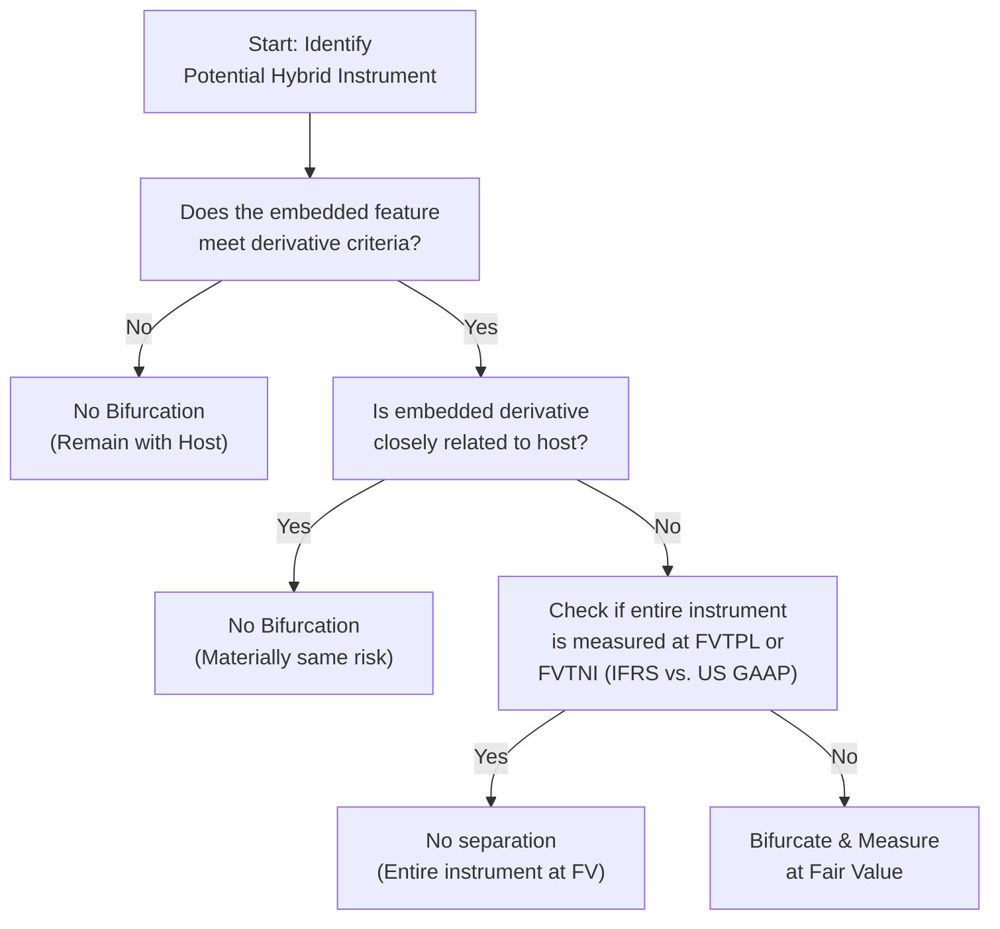

## 15.3 Embedded Derivatives and IFRS Comparisons

Embedded derivatives often arise in contractual arrangements that combine derivative features with a non-derivative “host” contract. Typical examples include convertibility features in debt instruments (e.g., convertible bonds), call or put options embedded in debt, or commodity-linked interest rates in loan agreements. While these instruments can be highly advantageous from a market perspective, they also introduce a layer of accounting complexity. Accountants often face challenges determining whether (and when) to separate these embedded derivatives from the host contract and how to measure them at fair value. This section delves into embedded derivatives under U.S. GAAP, specifically ASC 815 (Derivatives and Hedging), highlights the IFRS perspective primarily rooted in IFRS 9 (Financial Instruments), and compares the two frameworks to guide you in your exam preparation and everyday practice.

Accounting for embedded derivatives is a critical topic for the CPA Business Analysis and Reporting (BAR) section because it bridges technical accounting rules with real-world business transactions, enterprise risk management, and financial statement analysis. Misapplication of embedded derivative guidance can lead to inaccurate financial reporting and restatements, as well as misinterpretations of risk exposures. Familiarity with how to identify, measure, and disclose embedded derivatives will not only boost your exam performance but also sharpen your professional acumen.

Use this chapter in conjunction with the broader guidance on derivatives and hedging in Chapter 15.1 and 15.2. Here, we focus on the specific issues and subtlety of embedded derivatives, providing examples, diagrams, comparative analyses, and best practices to help you master this topic.

## Why Embedded Derivatives Matter

Accounting for embedded derivatives affects multiple facets of financial reporting:

• Income Statement Volatility: If an embedded derivative must be bifurcated and separately measured at fair value, changes in that fair value may create significant volatility in the income statement unless designated for hedge accounting (subject to strict criteria).  
• Balance Sheet Classification: Separating an embedded derivative from its host instrument may change the classification of certain line items between liabilities and equity or impact the measurement attributes (amortized cost vs. fair value).  
• Disclosure Requirements: Companies must disclose specific information about embedded derivatives to ensure transparency regarding risk exposure and valuation.  

An incorrect assessment of whether an embedded derivative requires bifurcation can result in material misstatements, restatement of prior periods, or compliance and regulatory issues.

## Understanding Embedded Derivatives

An embedded derivative is a component of a hybrid (combined) instrument that, if it were standalone, would meet the definition of a derivative. Under both U.S. GAAP and IFRS, a derivative typically has:

• An underlying and a notional amount (or payment provision).  
• No initial net investment or a smaller-than-expected net investment relative to other types of contracts.  
• The ability to be net-settled.  

In a hybrid contract, the host instrument may be a debt instrument, an equity instrument, a lease contract, an insurance contract, or various other forms of agreements. The embedded derivative feature (e.g., an option, a guarantee, or a swap-like feature) coexists with the host.  

For accounting purposes, the first key question is whether the embedded feature meets the definition of a derivative on its own. If yes, the second question is whether the embedded derivative is “clearly and closely related” to the host contract. If it is not clearly and closely related, and if specific exceptions do not apply, the embedded derivative must be separated (or “bifurcated”) and measured at fair value on an ongoing basis.

## U.S. GAAP Perspective (ASC 815)

Under ASC 815 (Derivatives and Hedging), the general steps to determine whether an embedded derivative must be bifurcated are:

• Identify the Hybrid Instrument: The company evaluates each contractual agreement to identify potential embedded derivative features (e.g., embedded calls, caps, floors, equity-linked features, or commodity exposures).  
• Determine if the Embedded Feature Meets the Definition of a Derivative: This entails assessing whether it has an underlying, a notional, or payment provisions and can be net-settled.  
• Apply the “Clearly and Closely Related” Criterion: If the economic characteristics and risks of the embedded derivative are not clearly and closely related to the economic characteristics and risks of the host, the embedded derivative must generally be bifurcated.  
• Check for Scope Exceptions: Certain embedded derivatives are exempt from bifurcation, such as those in contracts that are measured at Fair Value Through Net Income (FVTNI) under U.S. GAAP or executory contracts that are not in the scope of ASC 815.  
• Measure and Report: If all conditions are met, separate the embedded derivative from the host contract, measure it at fair value, and recognize changes in fair value in earnings each reporting period (unless designated and qualified for hedge accounting).  

### Key U.S. GAAP Concepts

• Double-Trigger Approach for Contingent Features: Sometimes, the embedded derivative might be contingent upon multiple factors (e.g., interest rate plus a commodity price). Under U.S. GAAP, accountants often think about whether each factor meets the derivative criteria.  
• Host Contract Classification: Determining whether the host is more akin to equity or debt can significantly impact the “clearly and closely related” analysis.  
• Measurement at Fair Value: Once separated, the embedded derivative is measured at fair value under ASC 820 (Fair Value Measurement).  

## IFRS Perspective (IFRS 9)

Under IFRS 9 (Financial Instruments), the approach to embedded derivatives has evolved compared to older standards (e.g., IAS 39). IFRS 9 introduced a more streamlined classification and measurement model, meaning embedded derivatives within certain instruments might not always require bifurcation if the entire contract is measured at fair value through profit or loss (FVTPL).

### Determining Bifurcation Under IFRS

1. Identify the Contract and Embedded Feature: As under U.S. GAAP, you must first identify any embedded derivative-like features within the host contract.  
2. Evaluate Classification of Entire Instrument: IFRS 9 primarily requires you to classify the entire financial instrument. If the entire hybrid contract is measured at FVTPL, you generally do not separate the embedded derivative because the entire instrument is already carried at fair value.  
3. Consider “Closely Related” Tests: If the instrument is not measured at FVTPL (e.g., measured at amortized cost or FVOCI), you need an analysis similar to U.S. GAAP regarding whether the embedded derivative’s risks are “closely related” to the host. If not closely related, the embedded derivative should be separated and measured at fair value through profit or loss.  
4. Review Special Rules for Non-Financial Hosts: IFRS 9 retains certain guidance for embedded derivatives in non-financial host contracts (e.g., a commodity purchase contract). You must analyze whether the embedded derivative’s risks and cash flows are closely related to the host. If not, separate measurement at FVTPL is required, absent any exceptions.  

### Key IFRS Concepts

• IFRS 9 over IAS 39: IFRS 9 simplified the approach by allowing the entire contract to be measured at FVTPL, thus obviating the need for an embedded derivative test in many scenarios.  
• Effective or Non-Separable Embedded Derivatives: If the embedded derivative cannot be measured separately either at acquisition or at a subsequent financial reporting date, IFRS 9 requires that the entire hybrid contract be classified at fair value through profit or loss.  
• Additional IFRS 7 Disclosures: IFRS 7 addresses the disclosures for financial instruments, requiring robust risk disclosures for embedded derivatives, including sensitivity analysis for changes in underlying variables.

## Comparing U.S. GAAP vs. IFRS

In practice, U.S. GAAP and IFRS share overarching similarities: they both require identifying potential embedded derivatives and using “clearly and closely related” tests. However, the differences manifest primarily in how the entire instrument is classified and measured.  

Below is a concise comparison:

| Aspect                                       | U.S. GAAP (ASC 815)                                                                           | IFRS 9 (and IFRS 7 for disclosure)                                                               |
|---------------------------------------------|------------------------------------------------------------------------------------------------|-------------------------------------------------------------------------------------------------|
| Classification Approach                      | Often requires bifurcation if embedded derivative is not clearly and closely related to host.  | If the hybrid instrument is measured at FVTPL, no bifurcation. Otherwise, similar test applies. |
| Primary Framework                            | ASC 815 for derivatives and ASC 820 for fair value measurement.                                | IFRS 9 for classification & measurement, IFRS 13 for fair value measurement, IFRS 7 for disclosures. |
| Scope Exceptions                             | Several exceptions exist (e.g., certain insurance contracts, normal purchases, normal sales).   | Similar but not always identical. IFRS 9 also introduced some simpler classification options.    |
| Measurement of Bifurcated Portion           | Fair value at each reporting date (changes in earnings unless hedging).                         | Fair value at each reporting date, recognized in profit or loss.                                  |
| Impact of Host Contract Classification       | Host is typically considered debt or equity. The analysis relies on whether feature is clearly and closely related. | IFRS 9 classification (amortized cost, FVOCI, or FVTPL) usually determines if separation is necessary. |
| Reassessment                                 | Must reassess embedded derivative status if modification or terms significantly change.         | Similar approach, but IFRS 9 might classify or reclassify entire instrument at FVTPL if separation isn’t feasible. |

In essence, IFRS 9 often alleviates the complexity by pushing the entire hybrid instrument into fair value accounting, whereas U.S. GAAP might continue to require a distinct bifurcation approach in many circumstances.

## Common Pitfalls

• Failing to Identify an Embedded Feature: Some derivatives are deeply buried in complex legal language, leading to oversight.  
• Misapplication of the “Clearly and Closely Related” Test: This can be subjective, especially in unique or customized instruments.  
• Incorrect Host Analysis: Misclassifying the host contract (e.g., treating a debt host as an equity host) can change the outcome entirely.  
• Overlooking Scope Exceptions: Accountants sometimes apply derivatives guidance to contracts that fall under different standards (e.g., insurance contracts, lease contracts).  
• Fair Value Measurement Complexities: Even if properly identified and bifurcated, measuring an embedded derivative at fair value requires robust valuation techniques, possibly with Level 3 inputs. Inadequate or flawed valuation models can lead to significant misstatements.  

## Practical Example: Convertible Debt Instrument

Imagine a company issues a convertible bond. The bond has a stated coupon (interest) and maturity, but also provides the holder the right to convert the bond into a predetermined number of the issuer’s common shares at any time before maturity.

• Under U.S. GAAP:  
  – If the conversion feature qualifies as an embedded derivative (e.g., it is not clearly and closely related to a debt host), the company might need to bifurcate the conversion option and record it at fair value, with changes flowing through earnings.  
  – Alternatively, if the embedded feature meets equity classification based on ASC 470-20 criteria (i.e., “beneficial conversion feature” guidance), the arrangement might fall under different rules, resulting in a different accounting approach.  

• Under IFRS:  
  – IFRS 9 typically looks at whether the entire instrument should be measured at FVTPL. If the instrument is not at FVTPL, the accountant assesses if the conversion feature is closely related to the debt host.  
  – If not closely related, the conversion feature is separated as a derivative liability or derivative asset (depending on the arrangement) and measured at fair value.  

In many real-world convertible bond arrangements, IFRS classification might differ significantly from U.S. GAAP classification due to specific criteria in IFRS 9 vs. ASC 470-20 and ASC 815. This can lead to different profit or loss volatility and balance sheet presentations.

## Real-World Scenario: Commodity-Linked Note

Corporation A issues a note payable with interest tied to the future price of gold. If gold prices surpass a certain threshold, the coupon payment increases accordingly.

• Under U.S. GAAP, the gold-linked coupon is likely an embedded derivative that is not clearly and closely related to a debt host, so it must be bifurcated and recorded at fair value.  
• Under IFRS, if the entire note is classified at FVTPL, no bifurcation is needed. Otherwise, if the host is measured at amortized cost, IFRS 9 requires separating the derivative and accounting for it at fair value with changes in profit or loss.  

Such commodity-linked notes illustrate how IFRS can sometimes be more straightforward if the entity chooses or is required to classify the entire hybrid instrument at fair value.

## Diagram: Identifying an Embedded Derivative

Below is a Mermaid diagram demonstrating a simplified decision process for identifying and bifurcating embedded derivatives under both frameworks.

Explanation:
• Identify the potential hybrid contract.  
• Confirm if the embedded feature meets the derivative definition.  
• Evaluate whether the economic risks of the embedded derivative are clearly and closely related to those of the host.  
• Assess if the entire instrument is subject to fair value measurement—if so, separation is not necessary under IFRS. Otherwise, separate it and account for it at fair value.

## Measurement and Disclosure

Once an embedded derivative is separated, it is subject to fair value measurement at each reporting date. Any changes in fair value flow through the income statement in most cases, unless designated and qualifying for hedge accounting (see Chapter 15.2 for more on hedge accounting).

### Valuation Methods

• Market Approach: If there is an active market for the embedded derivative (uncommon except for highly standardized features).  
• Income Approach: Using discounted cash flow (DCF) models, binomial or Black-Scholes option pricing models, or Monte Carlo simulations.  
• Cost Approach: Rarely applied to derivatives, since they typically require fair value measurements reflecting market participant assumptions.  

Disclosures should detail the nature of the embedded derivative, valuation methodology, assumptions used (e.g., volatility, discount rate), and any significant unobservable inputs (Level 3 under ASC 820/IFRS 13). IFRS 7 also requires discussing how financial risk is managed.

## Best Practices for Embedded Derivatives

• Thorough Contract Review: Collaboration between accounting, treasury, and legal teams can identify unusual terms.  
• Periodic Reassessment: Amendments or modifications to contracts may trigger re-evaluation.  
• Consistent Application of Valuation Techniques: Use well-documented and consistent models and assumptions.  
• Maintain Strong Internal Controls: Adequate processes reduce the risk of oversight and errors in fair value calculations.  
• Stay Updated on Standards: IFRS and U.S. GAAP guidance continues to evolve. Embrace the latest interpretations, especially around complex, hybrid instruments.  

## Case Study: Embedded Conversion Feature in Foreign Currency Debt

Company XYZ, a U.S. multinational, issues debt denominated in a foreign currency, convertible into Company XYZ common stock. Under U.S. GAAP, the foreign currency aspect introduces additional complexity because the conversion feature is not denominated in the entity’s functional currency, which can lead to classification as a derivative liability. IFRS 9 may classify the entire instrument at FVTPL if the embedded conversion feature is material and not closely related. Here:

1. Identify the embedded conversion option and foreign currency exposure.  
2. Determine if it meets derivative criteria (likely yes).  
3. Evaluate whether IFRS 9’s classification at FVTPL is triggered. If so, no bifurcation is needed—everything goes to fair value. Under U.S. GAAP, the company might need to bifurcate and measure the derivative at fair value separately, recognized in earnings.  

Such complexities demonstrate how IFRS can yield a more unified measurement outcome while U.S. GAAP might maintain separate accounting for the host and derivative. Despite IFRS potentially being “simpler” in certain respects, it also requires close scrutiny of the reality that the entire instrument is measured at fair value, creating additional volatility in reported results.

## Conclusion

Embedded derivatives lie at the intersection of creativity in financial instrument design and complexity in accounting standards. Understanding the differences between U.S. GAAP (ASC 815) and IFRS (IFRS 9) is essential for accurate reporting and fruitful risk mitigation. Although the conceptual foundations—identifying a derivative, determining whether it is clearly and closely related to the host, and measuring it at fair value—remain similar, variations in classification and measurement can produce vastly different outcomes in financial statements. By applying robust contract review, consistent valuation methods, and a solid understanding of each framework’s nuances, you can better navigate embedded derivatives. The result is more transparent information for management, auditors, and stakeholders, as well as enhanced confidence in your CPA BAR exam preparation.

Below is a quiz to test your understanding, followed by references and additional resources to support your further exploration.

## Master Embedded Derivatives and IFRS Quiz



### An embedded derivative typically needs to be separated from its host contract when:
- [x] The embedded derivative is not clearly and closely related to the host.
- [ ] The entire contract is always settled net.
- [ ] The host contract is within the scope of operating leases.
- [ ] The premium for the embedded derivative is paid upfront.

> **Explanation:** Separation is generally required if the economic characteristics of the embedded derivative are not clearly and closely related to those of the host and specific exceptions do not apply.

### Under IFRS 9, an embedded derivative in a financial liability must be bifurcated:
- [x] Only if the entire instrument is not measured at FVTPL.
- [ ] Whenever there is a derivative-like feature.
- [ ] Only if the embedded derivative is an equity instrument.
- [ ] If the host contract is an insurance contract.

> **Explanation:** IFRS 9 typically does not require bifurcation for embedded derivatives if the entire contract is measured at fair value through profit or loss. Otherwise, embedded derivatives are bifurcated and measured separately.

### One common pitfall in embedded derivative accounting is:
- [x] Failing to identify hidden or complex derivative features.
- [ ] Separating the derivative whenever the debt host has a floating interest rate.
- [ ] Treating every conversion option as equity-classified.
- [ ] Automatically assigning zero fair value to the embedded derivative.

> **Explanation:** Missed or overlooked features are a frequent cause of restatements. Hidden clauses tied to market indices or commodity prices may not be initially recognized as embedded derivatives.

### Under ASC 815, when assessing if an embedded derivative is clearly and closely related to a debt host, which factor is crucial?
- [x] Whether the embedded derivative’s economic risks match those of a typical debt instrument.
- [ ] Whether the embedded derivative is linked to interest rates alone.
- [ ] Whether initial issuance fees were paid in cash.
- [ ] Whether the embedded feature expires in less than 90 days.

> **Explanation:** ASC 815 requires determining if the economic characteristics of the embedded derivative are aligned with the risks typically associated with the host. If not, bifurcation is needed.

### Which statement best describes measurement of bifurcated embedded derivatives under U.S. GAAP?
- [x] They are measured at fair value at each reporting date, with changes recognized in earnings.
- [ ] They are measured at amortized cost unless designated as a fair value hedge.
- [ ] They remain at the historical issue price until settlement.
- [ ] They are recognized only upon exercise or expiration.

> **Explanation:** Separated embedded derivatives are accounted for at fair value through earnings under U.S. GAAP, consistent with derivative accounting principles.

### A commodity-linked note paying interest based on a gold price index is typically:
- [x] An embedded derivative not clearly and closely related to a debt host, requiring bifurcation under ASC 815 if not measured at FVTNI.
- [ ] Exempt because the note is considered a “normal purchase, normal sale” arrangement.
- [ ] Automatically measured at historical cost if the issuer so elects.
- [ ] Treated identically under all frameworks, negating the need for analysis.

> **Explanation:** A commodity-based coupon often introduces risks not consistent with a standard debt instrument. Bifurcation is generally required unless an exception applies.

### If a convertible bond in IFRS is measured entirely at FVTPL:
- [x] The embedded conversion feature does not need to be separated.
- [ ] The embedded conversion feature must still be measured separately at fair value.
- [x] The issuer is spared any earnings volatility.
- [ ] The conversion feature is automatically classified as equity.

> **Explanation:** Under IFRS 9, measuring the entire instrument at fair value simplifies accounting, negating the requirement to separately account for the embedded derivative. However, measuring the entire bond at fair value still results in earnings volatility from changes in fair value.

### One key difference between IFRS 9 and U.S. GAAP for embedded derivatives is that:
- [x] IFRS 9 typically does not require separation if the entire instrument is carried at fair value through profit or loss.
- [ ] U.S. GAAP and IFRS share no conceptual similarities for embedded derivatives.
- [ ] IFRS 9 always mandates bifurcation regardless of measurement classification.
- [ ] ASC 815 has no concept of “clearly and closely related.”

> **Explanation:** IFRS 9 offers an option or requirement to measure the entire hybrid instrument at fair value, preventing the need to split out the embedded derivative. U.S. GAAP commonly requires a separate test and potential separation.

### Which scenario often leads to re-evaluation of an embedded derivative’s classification?
- [x] Significant modification of the contract terms.
- [ ] Quarterly updates of interest rates in line with LIBOR.
- [ ] No change in contract terms but a shift in the company’s functional currency.
- [ ] Renewal of an insurance policy covering the issuer’s property.

> **Explanation:** Material modifications or events changing the economics of the contract can trigger a re-assessment, as the embedded derivative may change in nature due to revised risks, notional amounts, or underlyings.

### True or False: Under IFRS 9, if an embedded derivative cannot be measured separately from the host contract upon initial recognition, the entire contract should be measured at fair value through profit or loss.
- [x] True
- [ ] False

> **Explanation:** IFRS 9 stipulates that if a separate measurement for an embedded derivative is not feasible, the entire contract must be measured at FVTPL to ensure an appropriate reflection of its underlying risks.



## For Additional Practice and Deeper Preparation

### [Business Analysis and Reporting (BAR) CPA Mock Exams](https://www.udemy.com/course/bar-cpa-mock-exams/?referralCode=ADBE2E84BEE9CB6243CA)

**Business Analysis and Reporting (BAR) CPA Mocks:** 6 Full (1,500 Qs), Harder Than Real! In-Depth & Clear. Crush With Confidence! 

- Tackle full-length mock exams designed to mirror real BAR questions.  
- Refine your exam-day strategies with detailed, step-by-step solutions for every scenario.  
- Explore in-depth rationales that reinforce higher-level concepts, giving you an edge on test day.  
- Boost confidence and minimize anxiety by mastering every corner of the BAR blueprint.  
- Perfect for those seeking exceptionally hard mocks and real-world readiness.  

_Disclaimer: This course is not endorsed by or affiliated with the AICPA, NASBA, or any official CPA Examination authority. All content is for educational and preparatory purposes only._
