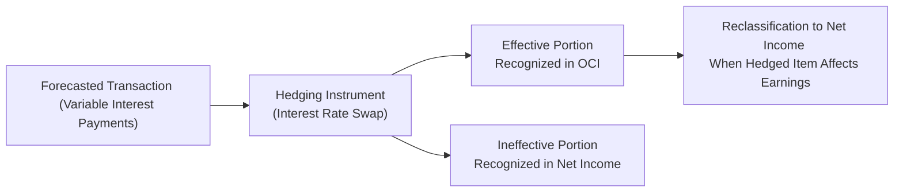

## 15.4 Presentation in Financial Statements

Effective presentation of derivatives in financial statements ensures that stakeholders understand the nature, extent, and financial impact of an entity’s risk management activities. This section focuses on how derivative gains and losses, including hedging ineffectiveness, are presented in a company’s primary financial statements (balance sheet, income statement, and statement of comprehensive income). We also discuss the required disclosures meant to provide transparency, consistency, and comparability across financial reporting.

This discussion builds upon earlier sections in this chapter, where the fundamentals of derivatives (15.1), hedge accounting models (15.2), and embedded derivatives (15.3) were detailed. Readers should keep in mind that financial reporting standards for derivatives continue to evolve. While the guidance in this chapter is grounded primarily in U.S. Generally Accepted Accounting Principles (GAAP), it also references International Financial Reporting Standards (IFRS) to acknowledge the global context within which many entities operate.

---

### The Importance of Proper Derivative Presentation

Companies utilize derivatives for various strategic purposes—hedging foreign currency risks, interest rate exposures, commodity price fluctuations, or even speculation. The correct presentation of these instruments and their gains or losses underscores critical insights for investors, auditors, regulators, and other stakeholders:

• Financial Risk Management: Presentation clarifies how entities manage market exposures, providing a window into hedging strategies and associated outcomes.  
• Profit or Loss Volatility: Investors might be concerned if derivative gains or losses create large swings in the income statement.  
• Compliance and Transparency: Regulators and auditors require visibility into how these instruments affect an entity’s accounting and statutory reports.  

Classifying derivative-related gains and losses in the right financial statement line items is vital. It helps the reader understand how and why certain fluctuations appear in net income or in other comprehensive income, especially when hedge accounting is applied.

---

### Overview of US GAAP and IFRS Requirements

Under U.S. GAAP (ASC 815, “Derivatives and Hedging”), the general rule is that all derivative instruments must be recognized on the balance sheet as either assets or liabilities measured at fair value. The subsequent recognition of gains or losses often pivots on whether the derivative is:

• A non-hedging instrument (speculative or trading).  
• A fair value hedge.  
• A cash flow hedge.  
• A hedge of a net investment in a foreign operation.  

IFRS (IFRS 9, “Financial Instruments”) is broadly convergent with the principle that derivatives are recognized at fair value. However, certain scope exceptions and transitional provisions may differ, so entities should be aware of specific IFRS guidance if they operate internationally.

In both GAAP and IFRS frameworks, disclosures should describe the entity’s objectives in using derivatives, detail how those objectives are being met, and highlight the associated risks and outcomes (e.g., gains, losses, hedge effectiveness).

---

### Classifying Derivatives on the Balance Sheet

All derivatives—whether used for hedging or not—are reported at fair value as either current or noncurrent assets or liabilities. The classification (current vs. noncurrent) typically aligns with the timing of the derivative’s underlying cash flows:

• **Asset or Liability**: A derivative in a gain position is reported as an asset; one in a loss position is reported as a liability.  
• **Current vs. Noncurrent**: If a derivative settles within one year (or one operating cycle, if longer), it is usually classified as current. Longer-term instruments or situations in which settlement surpasses the one-year threshold might be classified as noncurrent.  

Balancing these disclosures is critical because the classification can affect key financial ratios (e.g., current ratio) and might shape user perception of liquidity and solvency.

---

### Recognizing and Presenting Derivative Gains and Losses

The key point for distinguishing derivative presentation in the primary statements is whether the instrument qualifies for hedge accounting under GAAP or IFRS. Below, we delve into each hedge type’s impact on presentation.

#### Fair Value Hedges

In a fair value hedge, the derivative is used to hedge exposure to changes in the fair value of an existing asset or liability—or an unrecognized firm commitment. Under U.S. GAAP:

• Changes in the fair value of the hedging instrument (the derivative) are recognized immediately in net income.  
• The hedged item’s carrying amount is also adjusted through net income for the changes in the hedged risk.  
• These two adjustments generally offset each other in the income statement, reducing earning volatility if the hedge is effective.

Fair value hedge presentation effectively matches changes in the derivative’s fair value with changes in the hedged item’s fair value, placing both gains and losses in the same line item in net income (e.g., “Cost of Goods Sold,” “Interest Expense,” or “Other Income/Expense,” depending on what is being hedged). This line item should correspond to where the hedged transaction’s gains and losses would normally be recognized.

#### Cash Flow Hedges

A cash flow hedge aims to mitigate variability in cash flows from a forecasted transaction or existing asset or liability. Under U.S. GAAP:

• The effective portion of the gain or loss on the derivative is reported as a component of other comprehensive income (OCI); it remains in accumulated other comprehensive income (AOCI) until the hedged cash flows affect earnings.  
• Any ineffective portion of the hedge is recognized immediately in net income.  

When the hedged item affects earnings (for instance, when a forecasted transaction occurs and is recognized in the income statement), the accumulated gains or losses in AOCI related to the effective portion are reclassified into net income, usually in the same income statement line item as the hedged transaction.

#### Net Investment Hedges

Certain entities hedge the currency exposure of a net investment in a foreign operation. Under U.S. GAAP:

• Gains or losses on the effective portion of the hedge instrument are reported in OCI (within the cumulative translation adjustment—CTA).  
• The ineffective portion, if any, is recognized in net income.  

This treatment aligns with the understanding that foreign currency translation adjustments themselves reside in OCI.

#### Non-Hedging Derivatives

If a derivative is not designated or does not qualify for hedge accounting, all changes in fair value are recognized in net income (often in “Other Income/Expense” or a similar line) in the period of change. Such instruments can increase earnings volatility quite significantly because their gains or losses run directly through the income statement.

---

### Statement of Comprehensive Income Considerations

For cash flow hedges and net investment hedges, one of the most critical presentation points is the inclusion of gains or losses in other comprehensive income. Regulators and standard setters recognize that changes in the fair value of certain hedging instruments do not reflect the underlying operative economics in the immediate period—thus allowing these gains or losses to be deferred in OCI. Over time, entities must reclassify these amounts from AOCI to earnings when the hedged item or transaction affects net income.

Users of financial statements should pay particular attention to the statement of comprehensive income and the accumulated OCI section within shareholders’ equity. This section acts as a holding place, capturing the cumulative net effect of all effective hedge activities. Disclosures in the notes to the financial statements typically explain the timing and magnitude of reclassifications out of AOCI.

---

### Disclosure Requirements to Emphasize Location of Gains/Losses

Regulations require specific disclosures that help readers understand the nature and magnitude of derivative risks. Common disclosures for derivatives and hedging activities include:

• A listing of the fair values of derivative instruments, disaggregated by asset classification vs. liability classification.  
• The location in the income statement (or statement of comprehensive income) where derivative gains and losses are recorded.  
• Separate tabular presentations for fair value hedges, cash flow hedges, net investment hedges, and non-hedging derivatives.  
• Amounts recognized in OCI during the reporting period, including any reclassifications from AOCI to net income.  
• A narrative description of the entity’s risk management policy, hedge objectives, and strategies.  
• Qualitative and quantitative assessments of hedge effectiveness.  

Firms usually provide these disclosures in the “Notes to Consolidated Financial Statements,” often grouped under a section titled “Financial Instruments and Hedging Activities” or “Derivative Instruments and Hedging Activities.” In IFRS reporting, an entity may combine these in a single note or distribute them across multiple notes, but the principle of transparency remains paramount.

---

### Common Pitfalls and Challenges

Despite robust guidance, entities still face challenges related to derivative presentation:

• **Incorrect Classification**: Misinterpreting whether a hedge is fair value or cash flow can lead to misplacement of gains or losses in net income or OCI.  
• **Ineffectiveness Calculations**: Failing to properly measure and record hedge ineffectiveness may distort reported net income.  
• **Complex Instruments**: Embedded derivatives, exotic options, or multi-legged strategies can complicate classification and require sophisticated valuations.  
• **Disclosure Overload vs. Omission**: Balancing the required level of detail against potential user confusion can be difficult. Insufficient detail can undermine transparency, while excessive detail may overwhelm users.  

Staying aligned with the relevant accounting standard, performing periodic training, and using robust systems for hedge documentation and accounting can help mitigate these pitfalls.

---

### Best Practices for Clear Presentation

• **Consistent Terminology**: Use uniform labels for “derivative assets/liabilities,” “hedging gains/losses,” and “reclassifications” across primary statements and footnotes.  
• **Tabular Footnote Disclosure**: Summarize derivative activity in well-designed tables—showing gains/losses, effective vs. ineffective components, and line item references.  
• **Timing Clarification**: Explain when and how amounts in AOCI will flow into net income or be recognized in the balance sheet.  
• **Cross-Referencing**: Link related footnote disclosures—e.g., cross-reference derivative disclosures with the risk management section in Management’s Discussion and Analysis (MD&A), if applicable, for a more holistic view.  
• **Policy Transparency**: Offer a clear policy statement about how management enforces hedge accounting guidelines, including how prospective and retrospective effectiveness tests are performed.  

These actions help ensure that external users can trace movements of derivative gains and losses from the balance sheet to the income statement or statement of comprehensive income.

---

### Practical Example: Interest Rate Swap

Imagine an entity using an interest rate swap to convert variable-rate debt to fixed-rate debt (a classic cash flow hedge):

• Initially, the swap is at fair value = $0 (no net gain or loss at inception).  
• Market rates change, and the swap is now in a loss position of $1 million.  
• The entity asserts the hedge is highly effective.  

Recording the entry:  
• The $1 million loss on the effective portion of the swap is recorded in OCI.  
• The swap is a liability on the balance sheet at $1 million.  
• Footnotes disclose the potential future impact on net income if interest rates maintain current levels.  

When the interest payments on the underlying variable-rate debt occur, offsetting amounts from AOCI will be reclassified to “Interest Expense” in net income, matching the timing of the hedged cash flows. Any ineffectiveness discovered (say, $50,000) would immediately appear in “Interest Expense” in the income statement, ensuring that only the effective portion remains in OCI.

---

### Diagram: Tracking Derivative Gains/Losses

Below is a simple Mermaid diagram illustrating how derivative gains and losses flow through financial statements in a cash flow hedge scenario:

• Node A represents the underlying exposure creating cash flow variability (e.g., variable rate debt).  
• Node B shows the derivative used to hedge.  
• The effective portion of gains/losses (C) is initially captured in OCI, while the ineffective portion (D) goes straight to net income.  
• When the interest payment on the debt occurs, the cumulative gains or losses in OCI are reclassified to net income (E) in the same line item as the hedged expense or revenue.

---

### Real-World Scenario: Commodity Price Hedges

A food manufacturing company hedges the cost of key ingredients (e.g., wheat) using commodity futures. Suppose the company designates these futures as cash flow hedges. Significant swings in commodity prices can lead to large derivative gains and losses. Stakeholders will be particularly interested in:

• **OCI vs. Net Income**: Are the hedge gains or losses reflected in OCI until the purchased wheat is used in production?  
• **Impact on Cost of Goods Sold**: If robust hedge documentation exists, once the wheat is procured and enters production, the previously deferred losses or gains move from AOCI into COGS.  
• **Disclosure on Hedge Effectiveness**: How well does the futures contract track local wheat prices vs. benchmark exchange prices?

By carefully illustrating this process in financial statements and the accompanying notes, the entity helps investors see whether hedging strategies are successful in stabilizing cost structures, and how this might affect margins in future quarters.

---

### IFRS Considerations

Although large parts of IFRS 9 overlap with ASC 815, IFRS reporting might differ in terminology or hedge documentation criteria. For example:

• IFRS 9 streamlines hedge effectiveness testing to a more principles-based approach, focusing on an economic relationship and the impact of credit risk.  
• IFRS may allow a broader range of exposures to qualify for hedge accounting.  
• Disclosure requirements under IFRS 7 (“Financial Instruments: Disclosures”) and IFRS 9 revolve around the risk management strategy, how risk management is reflected in the entity’s financial statements, and a breakdown of the associated effects.  

Nevertheless, the concept remains that successful cash flow hedges result in deferring gains and losses in OCI, while fair value hedge gains and losses appear in net income.

---

### Conclusion

Appropriate presentation of derivative instruments in financial statements is fundamental to clear, transparent, and decision-useful reporting. By classifying derivative assets and liabilities at fair value on the balance sheet, and by directing the resulting gains or losses to either net income or other comprehensive income (depending on hedge designation and effectiveness), entities provide stakeholders with a faithful depiction of performance and risk tolerance. Disclosures revealing the “where” and “why” of these gains and losses reinforce confidence among users and align with regulatory requirements.

Thorough documentation, robust internal controls, and consistent application of accounting standards can mitigate the risk of errors or confusion in reporting. The ultimate goal is to provide a coherent narrative of how derivatives fit into an entity’s broader financial strategy—so that shareholders, creditors, and analysts can clearly see how risk is being identified, mitigated, and disclosed.

---

## Test Your Understanding: Derivative Gains & Losses Presentation



### Which statement best describes the general requirement for derivative instruments under both U.S. GAAP and IFRS?

- [x] They must be recorded on the balance sheet at fair value.
- [ ] They can be recorded off balance sheet if the notional amount is below certain thresholds.
- [ ] Profits should only be recognized in other comprehensive income until realized.
- [ ] They should be disclosed only in the notes, not in the primary statements.

> **Explanation:** Both U.S. GAAP (ASC 815) and IFRS (IFRS 9) require that derivative instruments be recognized on the balance sheet as assets or liabilities at fair value.

### In a fair value hedge of a recognized asset, where are changes in the fair value of the hedging instrument recorded under U.S. GAAP?

- [x] In net income, typically within the same income statement line item as the hedged item.
- [ ] Directly in accumulated other comprehensive income (AOCI) and reclassified later.
- [ ] Only in the notes to the financial statements.
- [ ] Deferred until settlement date.

> **Explanation:** In a fair value hedge, both the hedged item’s gain or loss due to the hedged risk and the derivative’s gain or loss are recorded in net income.

### What is the typical accounting treatment for the effective portion of a cash flow hedge?

- [x] It is recognized in OCI until the forecasted transaction affects earnings.
- [ ] It is recognized immediately in net income.
- [ ] It reduces the carrying value of the hedged item on the balance sheet.
- [ ] It is recognized in retained earnings at the time of settlement.

> **Explanation:** For cash flow hedges, the effective portion of the derivative gain or loss is deferred in OCI and only reclassified to net income once the hedged item impacts earnings.

### In a net investment hedge in a foreign subsidiary, where are the effective hedge gains and losses recognized?

- [x] In other comprehensive income, often within the cumulative translation adjustment (CTA).
- [ ] In net income immediately.
- [ ] Deferred as a contra-asset on the balance sheet.
- [ ] Written off against retained earnings.

> **Explanation:** For a net investment hedge, effective hedge gains and losses are recognized in OCI (CTA) until the entity sells or otherwise disposes of the foreign operation.

### Which of the following would likely lead to immediate recognition of derivative losses in net income?

- [x] The derivative does not qualify for hedge accounting or is designated as a trading instrument.
- [ ] The derivative is designated as a cash flow hedge and is fully effective.
- [x] The portion of a hedge deemed ineffective.
- [ ] Changes in the credit risk of the counterparty only.

> **Explanation:** Non-hedge (trading) gains/losses and any ineffective hedge portion are recognized directly in net income.

### Which statement about the impact of derivatives on an entity’s financial ratios is correct?

- [x] Classification of derivative gains/losses as current or noncurrent can affect liquidity ratios.
- [ ] Derivatives never impact coverage ratios.
- [ ] Derivatives are excluded from financial covenant calculations by default.
- [ ] Gains and losses from derivatives cannot be included in net income for ratio purposes.

> **Explanation:** Setting derivatives as current or noncurrent assets/liabilities can affect liquidity ratios. Additionally, changes in net income from derivatives can impact other coverage ratios, depending on covenant definitions.

### Under GAAP, when reclassifying the effective portion of a cash flow hedge from AOCI to net income, in which line item is it usually recorded?

- [x] In the same income statement line item as the hedged transaction.
- [ ] Under “Extraordinary items.”
- [x] A separate line item titled “Unrealized Hedging Gains/Losses.”
- [ ] As a deduction to retained earnings.

> **Explanation:** Amounts in AOCI relating to the effective portion of a cash flow hedge are reclassified into the same income statement line item where the hedged item’s gains/losses are recognized, such as Cost of Goods Sold or Interest Expense.

### A company enters into a forward contract to purchase raw materials. If this forward is designated as a cash flow hedge, at which point do gains or losses from this forward affect net income?

- [x] When the raw materials are acquired and used in production, aligning with the hedged item’s income statement recognition.
- [ ] Immediately when the forward contract is signed.
- [ ] Only when the forward contract expires or is canceled.
- [ ] Never, as these gains or losses remain in OCI indefinitely.

> **Explanation:** In a cash flow hedge, gains or losses are deferred in OCI until the forecasted transaction occurs and then recognized in net income in tandem with the hedged item.

### IFRS 9 uses which type of approach to assess hedge effectiveness?

- [x] A more principles-based approach that focuses on an economic relationship.
- [ ] A strict quantitative threshold of 80% to 125% correlation.
- [ ] Reliance solely on forward-looking prospective tests.
- [ ] A purely retrospective approach with monthly correlation calculations.

> **Explanation:** IFRS 9 embraces a principles-based model, looking for an economic relationship between the hedged item and the hedging instrument rather than prescribing strict numerical thresholds.

### Hedge accounting allows companies to:

- [x] Reduce income statement volatility by deferring gains/losses in OCI when hedging future cash flows.
- [ ] Eliminate all risk from currency or price fluctuations.
- [ ] Guarantee a profit on derivative transactions.
- [ ] Report derivatives off the balance sheet.

> **Explanation:** Hedge accounting reduces short-term volatility by deferring effective hedge gains/losses in OCI until the hedged item impacts earnings, but it does not eliminate actual economic risks or guarantee profits.



---

## For Additional Practice and Deeper Preparation

### [Business Analysis and Reporting (BAR) CPA Mock Exams](https://www.udemy.com/course/bar-cpa-mock-exams/?referralCode=ADBE2E84BEE9CB6243CA)  

**Business Analysis and Reporting (BAR) CPA Mocks:** 6 Full (1,500 Qs), Harder Than Real! In-Depth & Clear. Crush With Confidence!  

- Tackle full-length mock exams designed to mirror real BAR questions.  
- Refine your exam-day strategies with detailed, step-by-step solutions for every scenario.  
- Explore in-depth rationales that reinforce higher-level concepts, giving you an edge on test day.  
- Boost confidence and minimize anxiety by mastering every corner of the BAR blueprint.  
- Perfect for those seeking exceptionally hard mocks and real-world readiness.  

_Disclaimer: This course is not endorsed by or affiliated with the AICPA, NASBA, or any official CPA Examination authority. All content is for educational and preparatory purposes only._
