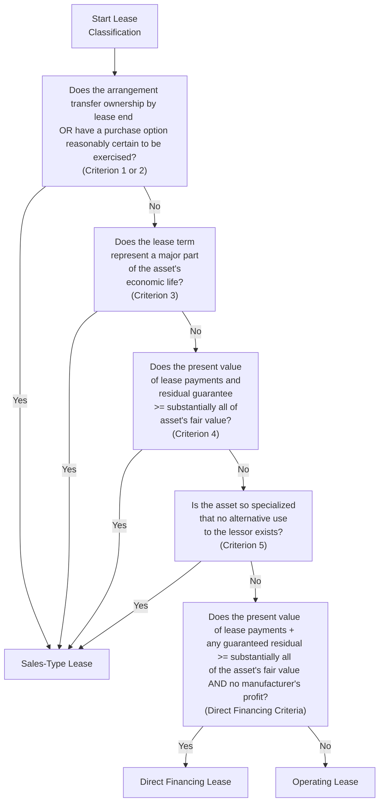

## 16.1 Lessor’s Classification Criteria

Lessor accounting under ASC 842 requires a careful and systematic approach to classifying leases as either operating, sales-type, or direct financing. This classification determines how revenue is recognized, how assets are presented, and how residual values are treated. Understanding these details is critical for accurate financial reporting and for passing the Business Analysis and Reporting (BAR) section of the CPA Examination.

This section explores the core principles and mechanics of lessor lease classification. It covers the classification criteria, the importance of distinguishing between lease types, common real-world scenarios, best practices, and pitfalls to avoid. By the time you finish this section, you should have a well-rounded grasp of the concepts, ready to apply them both on exam day and in professional practice.

  
### Introduction

Leases play a central role in how businesses acquire and finance assets. Lessors, or the asset owners, face different accounting treatments depending on the lease structure. The key question for lessors is: does the lease substantially transfer the risks and benefits of ownership to the lessee, or does the lessor retain a significant interest in the asset?

ASC 842 provides the lens through which lessors must view their lease arrangements. Lessors are required to classify each lease at its commencement date and then continue to account for it accordingly throughout the lease term. This classification process revolves around a set of criteria designed to capture the true economic substance of the transaction. While these criteria build off the conceptual framework from previous accounting standards, ASC 842 introduces clarifications designed to improve consistency in practice.

  
### Overview of Key Lease Types for Lessors

ASC 842 identifies three classification types for lessors:

• Sales-Type Lease  
• Direct Financing Lease  
• Operating Lease  

Each drives a unique pattern of revenue recognition, asset derecognition, and expense measurement. Additionally, lessors sometimes face complexities such as residual value guarantees, third-party participants, and uncertain collectibility. The classification criteria aim to ensure that the lessor’s accounting reflects economic reality:

• If the lease effectively transfers control of the underlying asset to the lessee, it is generally a sales-type lease.  
• If the lease does not transfer control but meets certain conditions relating to probable collections and substantial completion of payment, it may be classified as a direct financing lease.  
• If neither of the above conditions are satisfied, the lease defaults to an operating lease.  

  
### Sales-Type Leases

#### Defining a Sales-Type Lease

A sales-type lease arises when control of the underlying asset passes to the lessee, effectively mirroring a sale of that asset. Under ASC 842, if any one of the following five criteria is met at lease commencement, the lessor must classify the arrangement as a sales-type lease:

• The lease transfers ownership of the underlying asset to the lessee by the end of the lease term.  
• The lease grants the lessee an option to purchase the underlying asset that the lessee is reasonably certain to exercise.  
• The lease term is for the major part of the remaining economic life of the underlying asset.  
• The present value of the sum of the lease payments and any residual value guaranteed by the lessee (and/or any other third party not already included in the lease payments) equals or exceeds substantially all of the fair value of the underlying asset.  
• The underlying asset is so specialized that it is not expected to have an alternative use to the lessor at the end of the lease term.  

If any one of these indicators is present, it suggests that the lessee is effectively purchasing the asset rather than merely leasing it. In such cases, the lessor removes the underlying asset from its books and recognizes a net investment in the lease, along with any selling profit or loss.  

#### Accounting for Sales-Type Leases

Typically, the lessor recognizes:

• A net investment in the lease (equal to the present value of lease payments plus residual value guarantees).  
• Selling profit or loss, if the fair value of the underlying asset differs from its carrying amount.  
• Interest income over time, using the effective interest rate method on the net investment in the lease.  

Residual assets may still be relevant if there is a portion of the asset’s value not covered by lease payments or residual guarantees. However, for most sales-type leases, the lessor’s net investment fully replaces the leased asset on the balance sheet at commencement.

#### Example of a Sales-Type Lease Scenario

Company A (lessor) manufactures heavy construction equipment. It leases a specialized crane to Company B (lessee) for seven years. The economic life of the crane is eight years, and the lease includes a bargain purchase option at the end of the lease term that Company B is reasonably certain to exercise. The fair value of the crane on the lease commencement date is $800,000, and the lessor’s carrying amount is $600,000. The present value of total lease payments equals $780,000.

Because Company B is expected to exercise the purchase option, the transaction meets one of the sales-type criteria. The lessor derecognizes the crane’s carrying amount ($600,000) and recognizes a net investment in the lease of $780,000. The $180,000 difference is accounted for as profit on sale at lease commencement, and subsequent lease accounting would recognize interest income using the effective interest method.

  
### Direct Financing Leases

#### Defining a Direct Financing Lease

A direct financing lease arises if none of the sales-type criteria are met but the lease meets both of these conditions:

• The present value of the lease payments and any residual value guaranteed by the lessee (plus potentially other third-party participants) is equal to or exceeds substantially all of the underlying asset’s fair value.  
• Collectibility of the lease payments is probable, and there is no dealer’s or manufacturer’s profit or loss embedded in the arrangement (or such profit is deemed immaterial).  

Essentially, a direct financing lease is often encountered when a financial institution or financing arm of a manufacturer arranges a lease that secures an economic return without recognizing an immediate profit from transferring control. There is no significant immediate margin recognized because the fair value and carrying value of the underlying asset are aligned or nearly so.

#### Accounting for Direct Financing Leases

Under a direct financing lease:

• The lessor recognizes a net investment on its balance sheet, equal to the present value of lease payments plus any guaranteed residual value.  
• The underlying asset is derecognized and replaced with a net investment in the lease.  
• The difference between the asset’s carrying amount and the net investment is recognized as a deferred profit, which will be recognized as interest income over the lease term.  

In many cases, the lessor’s net investment reflects the principal portion to be recovered and an interest component to be recognized over time, similar to a long-term receivable.  

#### Example of a Direct Financing Lease

Bank XYZ provides leasing solutions for transportation equipment. It acquires trucks at cost (equal to fair value) of $900,000 and immediately leases them to Company Z for five years. The present value of the lease payments and a third-party guaranteed residual value sums to $900,000, indicating no upfront profit. Because the arrangement does not meet any of the sales-type criteria, but “substantially all” of the fair value will be recovered and collection is probable, it is classified as a direct financing lease. Bank XYZ derecognizes the trucks and recognizes a net investment in the lease of $900,000. The deferred profit is zero or immaterial, so interest income is recognized over the five-year lease term.

  
### Operating Leases

When a lease fails to meet the criteria of either a sales-type or a direct financing lease, the lessor classifies it as an operating lease. In an operating lease, the lessor retains the underlying asset on its balance sheet, continues to depreciate it, and recognizes lease income on a straight-line or other systematic basis. This classification generally indicates that the lessor is effectively renting the asset to the lessee while retaining the significant risks and rewards of ownership.

#### Key Characteristics of Operating Leases

• No transfer of control: The lessee does not acquire substantially all the underlying asset’s economic benefits and obligations.  
• The lessor retains the asset: Depreciation continues to be recognized by the lessor in accordance with its usual depreciation policies.  
• Rental revenue recognition over time: The lessor recognizes lease income on a time-based systematic method (often straight-line), unless another pattern reflects usage of the asset more accurately.  

#### Example of an Operating Lease

A real estate company owns a commercial property and leases floor space to several smaller businesses under annual renewable agreements. None of the sales-type or direct financing criteria are satisfied because the right to use the property remains with the lessor, and the lease payments likely do not cover substantially all of the property’s fair value. As a result, the real estate company classifies each arrangement as an operating lease. The building appears on the real estate company’s balance sheet, and the lease revenue is recognized over time, typically on a straight-line basis.

  
### Decision Tree for Classification

A decision tree is helpful for visualizing the classification process under ASC 842. Below is a simplified Mermaid diagram outlining the high-level classification logic in an easy-to-follow flow.

  
### Case Studies and Complex Scenarios

Real-world transactions rarely line up neatly with textbook-style examples. Some complexities include:

• Third-Party Guarantees: If a third-party guarantees a significant portion of residual value, the lessor might meet direct financing classification if the present value of lease payments plus the guaranteed residual equals or exceeds the fair value.  
• Collectibility Uncertainty: If the lessor cannot conclude that lease payments are probable of collection, the arrangement cannot be classified as direct financing or sales-type. It might revert to an operating lease with additional disclosures.  
• Embedded Lease Components: Contracts with multiple components or embedded leases (see Chapter 12: Revenue Recognition) could complicate the classification decision if certain performance obligations are bundled.  
• Manufacturer or Dealer Lessor: If identification of significant selling profit or loss occurs, a sales-type lease classification is more likely. If no such profit or loss exists, it may qualify as direct financing.  

These nuances require careful analysis and documentation. Lessors must ensure their classification decisions align with both the letter and the spirit of ASC 842.

  
### Common Pitfalls and Challenges

• Overlooking Probable Collectibility: Lenders and lessors must assess credit risk carefully. If collectibility cannot be established as probable, it forces an operating lease classification.  
• Misapplying the “Substantially All” Threshold: While ASC 842 does not define a hard numerical percentage, practice has often treated 90% as a benchmark. However, professional judgment should factor in additional qualitative aspects.  
• Improper Residual Value Guarantees: Failing to include third-party residual guarantees in the present value calculation can lead to improper classification and misstated net investment in the lease.  
• Inconsistent Depreciation Methods: Under operating lease classification, the lessor must apply depreciation consistent with its normal policy. In practice, some lessors inadvertently attempt to “match” depreciation to the lease term, which may violate GAAP if the underlying asset has a longer useful life.  

  
### Best Practices in Lessor Lease Classification

• Thorough Documentation: Always maintain clear and contemporaneous workpapers analyzing lease payments, residual values, credit risk, and classification criteria.  
• Collaboration Between Teams: Lease classification often involves Finance, Legal, and Operations teams. Cross-functional collaboration helps identify key terms and ensures consistent application of ASC 842.  
• Periodic Reassessments: While the initial classification is “locked” at lease commencement, changes in collectibility or lease modifications can trigger remeasurements. Keep an eye on evolving lease terms or external factors.  
• Training and Education: Stay updated with ongoing guidance from the FASB, SEC, and industry groups. Participate in continuing professional education (CPE) programs to maintain current knowledge, which is also critical for CPA exam success.  

  
### Conclusion

Lessor accounting for leases under ASC 842 rests on a solid understanding of whether the arrangement transfers control of the underlying asset to the lessee. The classification elements—sales-type, direct financing, or operating lease—depend on carefully assessed quantitative and qualitative factors. From identifying whether ownership effectively transfers to evaluating the lease term’s length relative to the asset’s economic life, each question forms a building block in your final classification decision.

Mastering these nuances is essential for:

• Accurate and compliant financial statements  
• Informed decision-making on lease investments and offerings  
• Success on the CPA Examination, especially in the Business Analysis and Reporting (BAR) section  

Carry this knowledge forward as you tackle lease modifications, evaluate sale-leaseback transactions (discussed further in [16.3 Sale-Leaseback Arrangements](#)), and navigate broader financial reporting issues across your professional career.

  
## Test Your Mastery of Lessor Lease Classification under ASC 842



### Which of the following lease scenarios is most likely to be classified as a sales-type lease under ASC 842?

- [x] The lessee is reasonably certain to exercise a bargain purchase option at the end of the lease term.  
- [ ] The lessee is expected to rent the equipment for a short period with no purchase option.  
- [ ] The lease payments do not cover substantially all of the fair value of the underlying asset.  
- [ ] The asset is easily substitutable for another.  

> **Explanation:** Sales-type classification arises if the lessee gains control of the asset. A bargain purchase option that the lessee is reasonably certain to exercise signals that control is likely transferred.

### A lessor must classify a lease as operating when:

- [x] None of the sales-type or direct financing criteria are met.  
- [ ] The fair value of the underlying asset differs from its carrying amount.  
- [ ] The collectibility of the lease payments is assured.  
- [ ] The residual value guarantee is supplied by a third party.  

> **Explanation:** If neither a sales-type nor a direct financing classification is appropriate, the default classification under ASC 842 is an operating lease.

### One key difference between a direct financing lease and a sales-type lease is:

- [x] A sales-type lease includes a selling profit or loss recognized at lease commencement, while a direct financing lease defers any profit.  
- [ ] Direct financing leases require immediate derecognition of the underlying asset, whereas sales-type leases do not.  
- [ ] Sales-type leases never involve residual value guarantees.  
- [ ] Direct financing leases do not require recognizing interest income.  

> **Explanation:** Sales-type leases reflect a sale, potentially creating a selling profit or loss. Direct financing leases usually do not present a material difference between cost and fair value, so any profit is deferred and recognized over time as interest income.

### In a direct financing lease, the lessor:

- [x] Recognizes a net investment in the leased asset.  
- [ ] Retains the underlying asset on its books without any derecognition.  
- [ ] Immediately recognizes the asset as sold.  
- [ ] Records the lease payments on a straight-line basis as rental income.  

> **Explanation:** For a direct financing lease, the lessor removes the underlying asset and replaces it with a net investment in the lease on its balance sheet, recognizing interest income over the lease term.

### An asset is “so specialized” for sales-type lease criteria when:

- [x] It has no expected alternate use to the lessor at the end of the lease term.  
- [ ] It is part of a common product line.  
- [x] The equipment cannot be repurposed without significant cost or modification.  
- [ ] The residual value is automatically guaranteed by the lessee.  

> **Explanation:** When the asset is so unique that it cannot be re-leased or repurposed economically, the arrangement is likely a sales-type lease if other conditions align.

### Under ASC 842, the presence of a significant third-party residual value guarantee can:

- [x] Convert the lease from an operating lease to a direct financing lease if certain criteria are met.  
- [ ] Always force the lease into sales-type classification.  
- [ ] Append an extra liability to the balance sheet of the lessor.  
- [ ] Have no effect on classification decisions.  

> **Explanation:** A residual value guarantee from a third party can count toward the “substantially all” threshold, potentially meeting the criteria for a direct financing lease.

### When evaluating probable collectibility for direct financing lease classification:

- [x] Lenders must demonstrate a reasonable expectation that the lessee will make the payments as scheduled.  
- [ ] It only matters if the lessor has recognized a manufacturer’s profit.  
- [x] Lenders disregard the lessee’s creditworthiness.  
- [ ] Collectibility is irrelevant if the asset is specialized.  

> **Explanation:** Collectibility must be probable (i.e., reasonably assured) for a lessor to classify a lease as direct financing. Lender or lessor must consider the lessee’s credit profile.

### The fair value of an asset when determining sales-type vs. operating lease classification often requires:

- [x] A documented and supportable valuation.  
- [ ] Merely an internal cost figure without market corroboration.  
- [ ] Exclusion of any third-party guarantees.  
- [ ] Ignoring any profit margin.  

> **Explanation:** Lessors need a credible valuation method, typically from an appraisal or a verifiable market source, to confirm the proportion of the asset’s value recovered through lease payments and guarantees.

### If total lease payments do not meet the “substantially all” threshold, and no other sales-type criteria are met, the lease becomes:

- [x] An operating lease by default.  
- [ ] A direct financing lease.  
- [ ] A sales-type lease.  
- [ ] An executory service contract.  

> **Explanation:** Under ASC 842, if none of the five criteria for sales-type is met and the lease payments do not substantially cover the fair value of the asset, the arrangement defaults to an operating lease.

### The lessor’s key asset in a direct financing lease is recognized as:

- [x] A net investment in the lease.  
- [ ] A fixed asset plus accumulated depreciation.  
- [ ] Income from a manufacturing profit.  
- [ ] Deferred revenue liability.  

> **Explanation:** In direct financing leases, the lessor derecognizes the underlying asset and records a net investment in the lease, which is the sum of the present value of lease payments and any guaranteed residual.



## For Additional Practice and Deeper Preparation

### [Business Analysis and Reporting (BAR) CPA Mock Exams](https://www.udemy.com/course/bar-cpa-mock-exams/?referralCode=ADBE2E84BEE9CB6243CA)

**Business Analysis and Reporting (BAR) CPA Mocks:** 6 Full (1,500 Qs), Harder Than Real! In-Depth & Clear. Crush With Confidence!

- Tackle full-length mock exams designed to mirror real BAR questions.  
- Refine your exam-day strategies with detailed, step-by-step solutions for every scenario.  
- Explore in-depth rationales that reinforce higher-level concepts, giving you an edge on test day.  
- Boost confidence and minimize anxiety by mastering every corner of the BAR blueprint.  
- Perfect for those seeking exceptionally hard mocks and real-world readiness.

_Disclaimer: This course is not endorsed by or affiliated with the AICPA, NASBA, or any official CPA Examination authority. All content is for educational and preparatory purposes only._
