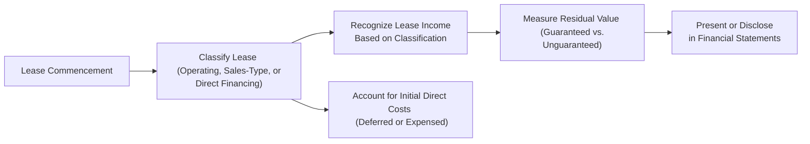

## 16.2 Lease Income, Initial Direct Costs, and Residual Value

This section discusses how lessors recognize and measure lease income, account for initial direct costs, and handle residual values under lease agreements. These concepts are crucial for understanding how to present leasing transactions in the financial statements. Whether you are preparing for the CPA exam, or want a deeper grasp of lease accounting best practices, this section provides essential guidance, practical examples, and case-based illustrations.

-------------------------------------------------------------------------------

### Understanding the Role of the Lessor in Lease Accounting

Lessor accounting involves recording a leased asset, identifying the type of lease, recognizing lease income over the lease term, and accounting for the costs incurred in negotiating and executing the lease. Lessors generally apply the following frameworks in U.S. GAAP (ASC 842) or IFRS (IFRS 16), which each classify leases from the lessor’s perspective:

• Operating Lease  
• Sales-Type Lease  
• Direct Financing Lease  

Depending on the classification, the accounting treatment differs in how lease income is recognized, how initial direct costs are deferred or expensed, and how the residual value is measured.

-------------------------------------------------------------------------------

### Lease Income Overview

Lease income (or lease revenue) represents the amount earned by the lessor from leasing out an asset to the lessee. The manner in which lease income is recognized depends on the lease classification:

• Operating Lease Income:  
  - The lessor keeps the asset on its balance sheet, recognizes depreciation, and records lease income on a systematic basis, typically straight-line, over the lease term.  
  - Any initial direct costs are usually deferred and expensed over the lease term if certain criteria are met.  

• Sales-Type Lease Income:  
  - Treated similarly to a sale of an asset, where the lessor derecognizes the underlying asset, recognizes a net investment in the lease, and records any profit or loss at lease commencement if collectability is probable.  
  - Interest income on the net investment is recognized over time, and any initially capitalized direct costs are often expensed immediately if the lease meets the threshold for sales-type treatment, or are included in the measurement of profit or loss if a profit is recognized at lease inception.  

• Direct Financing Lease Income:  
  - The lessor removes the asset from its balance sheet and recognizes a net investment in the lease.  
  - Any profit at lease inception is deferred (i.e., no immediate gain is recognized). Instead, income is recognized over time through the accretion of the net investment in the lease using the interest method.  
  - Initial direct costs are included in the calculation of the net investment in the lease and recognized as a reduction of income over the lease term.

-------------------------------------------------------------------------------

### Initial Direct Costs

Initial direct costs are incremental costs of a lease that would not have been incurred if the lease had not been obtained. Common examples include commissions paid to brokers, legal fees that are directly attributable to negotiating and executing the lease, and certain external diligence costs.

Key considerations:

• Operating Leases:  
  - The lessor defers initial direct costs and systematically recognizes them as an expense over the lease term, generally on the same basis as lease income.  

• Sales-Type Leases:  
  - If the lease results in selling profit or loss recognized at inception, initial direct costs are typically expensed upon commencement of the lease.  
  - If no selling profit or loss is recognized (e.g., the fair value equals the carrying amount of the leased asset), the initial direct costs are deferred and included in the net investment in the lease.  

• Direct Financing Leases:  
  - The lessor defers initial direct costs by adding them to the net investment in the lease. They reduce the amount of unearned income recognized over the lease term, effectively being recognized as part of the interest income spread over the life of the lease.

-------------------------------------------------------------------------------

### Residual Value Considerations

Residual value represents the value an asset is estimated to have at the end of a lease term. Lessors generally consider two types of residual value:

1. Guaranteed Residual Value:  
   - The lessee, or a third party, guarantees to pay the lessor a certain amount if the asset’s fair market value falls below a specified level at the end of the lease.  
   - This guaranteed portion reduces the lessor’s risk and becomes part of the net investment in the lease for direct financing or sales-type leases.

2. Unguaranteed Residual Value:  
   - The portion of the residual value that is not guaranteed by the lessee or any third party.  
   - Lessors still expect to recover some of this value from selling or re-leasing the asset at lease termination, but it is subject to greater uncertainty.

Under sales-type and direct financing leases, the lessor recognizes a net investment in the lease that includes the present value of future lease payments plus any guaranteed residual value, but only the present value of the guaranteed portion. Unguaranteed residual value is recorded separately and is not discounted in the same manner, though it influences the total net investment if all residual is considered in the arrangement. In operating leases, the lessor continues to carry the entire asset on its balance sheet (net of depreciation), expecting a certain salvage or resale value at the end of the lease term.

-------------------------------------------------------------------------------

### Short Examples

Below are concise illustrations demonstrating common computations for unearned income, direct cost amortization, and adjustments for residual value.

#### Example 1: Unearned Income in a Direct Financing Lease

Assume a lessor leases equipment with:
• Fair value (and carrying amount) of $50,000.  
• Lease payments of $12,000 annually for five years, paid at year-end.  
• Implicit rate of 6%.  
• No guaranteed residual value.  

Step 1: Compute the present value (PV) of annual payments.  
PV of Lease Payments = $12,000 × PVIFA(6%, 5)  
Where PVIFA(6%, 5) ≈ 4.2124  
So, PV = $12,000 × 4.2124 = $50,549  

Step 2: Identify the net investment.  
Because the carrying value = $50,000, and the PV of payments = $50,549, the difference $549 is unearned income. However, under direct financing leases where there is no profit at inception, the net investment is simply $50,000, and $549 is recognized as unearned income to be amortized over the lease term as interest income.

#### Example 2: Direct Cost Amortization in an Operating Lease

Suppose a lessor incurred $2,000 of initial direct costs related to a 4-year operating lease. The annual fixed payment by the lessee is $5,000, recognized on a straight-line basis. For operating leases, initial direct costs are generally deferred and recognized over the lease term.  

Each year, the lessor will recognize:  
• Lease Income: $5,000  
• Amortization of Deferred Initial Direct Costs: $2,000 ÷ 4 = $500  

Hence, $500 of direct costs are recognized as an expense each year, typically in the same income statement line or classification as the lease income or depreciation expense for the leased asset.

#### Example 3: Residual Value Adjustment in a Sales-Type Lease

A lessor leases out a vehicle with a fair value of $40,000 and a carrying amount of $30,000. The lease is classified as a sales-type lease, with lease payments that result in a present value of $35,000. The difference between the carrying amount ($30,000) and the PV of payments ($35,000) indicates a $5,000 selling profit. Additionally, the unguaranteed residual value is estimated at $5,000 at the end of the lease term.  

At inception, the lessor:  
• Derecognizes the asset at its carrying amount of $30,000.  
• Recognizes Revenue of $35,000 + $5,000 (Unguaranteed Residual) = $40,000 (the fair value).  
• Recognizes Cost of Goods Sold at $30,000.  
• Recognizes a Profit on Sale of $10,000 (difference between $40,000 fair value and $30,000 cost includes both the selling profit from the lease payments and the unguaranteed residual).  
• Initializes a Net Investment in the Lease at $40,000, which includes the present value of the lease payments ($35,000) plus the present value of the unguaranteed residual ($5,000). Realistically, the unguaranteed portion is recognized but not discounted if recognized as part of net investment for GAAP, depending on the standard’s specific requirements and the classification’s guaranteed vs. unguaranteed portion. If partial discounting is required for IFRS 16, the approach might differ slightly.

-------------------------------------------------------------------------------

### Diagram: Lessor Accounting Workflow

Below is a simplified mermaid diagram illustrating the broad steps a lessor follows to account for a lease:

• A["Lease Commencement"]: The date the lessor makes the asset available to the lessee.  
• B["Classify Lease"]: Decide if the lease is operating, sales-type, or direct financing according to ASC 842 or IFRS 16 criteria.  
• C["Recognize Lease Income"]: Operating leases use straight-line or a systematic method over the lease term. Sales-type and direct financing leases recognize interest income or an immediate profit if certain conditions are met.  
• D["Account for Initial Direct Costs"]: Defer and amortize for operating leases, or expense immediately/offset net investment for sales-type or direct financing.  
• E["Measure Residual Value"]: Evaluate and separate guaranteed vs. unguaranteed residual value.  
• F["Present or Disclose"]: Provide appropriate note disclosures and present the lease asset or net investment on the balance sheet.

-------------------------------------------------------------------------------

### Best Practices and Common Pitfalls

• Proper Classification: Misclassifying a lease can lead to incorrect revenue recognition and misstated financial statements. Always carefully assess the lease terms (e.g., transfer of ownership, present value of lease payments compared to fair value, specialized nature of the asset, etc.).  

• Handling Rate Calculations: In direct financing or sales-type leases, errors often arise in calculating the implicit interest rate or the present value of lease payments. Double-check discount factors and ensure consistency throughout.  

• Initial Direct Costs Criteria: Not all costs qualify as initial direct costs. For example, fixed overhead or general administrative costs are expensed as incurred. Make sure to capture only truly incremental costs that arise because of obtaining the lease.  

• Residual Value Risk: Overestimating residual value can inflate net investment. Regularly test residual assumptions and maintain conservative estimates based on historical data, asset condition, and third-party valuations.  

• Ongoing Disclosures: ASC 842 and IFRS 16 require robust qualitative and quantitative disclosures regarding lease income, credit risk, and residual value risk. Inadequate disclosures can lead to compliance issues.

-------------------------------------------------------------------------------

### Additional Real-World Considerations

• Technological Shifts: In fast-changing industries (e.g., IT equipment leasing), residual values can drop quickly. Lessors must anticipate market changes and incorporate them into lease structuring.  
• Lease Modifications: Changes to lease terms (e.g., extension, early termination, or adjustments to payment amounts) can trigger a reclassification or remeasurement.  
• Credit Risk Management: Lessors manage delinquency and default risk through credit checks, requiring guarantees, or heavily discounting lease payments for uncertain customers.  
• Global Subsidiaries: Multinational corporations with cross-border leasing transactions must reconcile local GAAP with IFRS or U.S. GAAP, leading to multiple sets of books or consolidation complexities.

-------------------------------------------------------------------------------

### Practical Implementation Tips

1. Implement Thorough Lease Management Systems: Automating calculations for present value, interest components, and direct cost amortization helps avoid manual errors.  
2. Stay Updated with Amendments: Follow proposed or recently enacted accounting standards on leasing. Minor changes in rules or interpretations can significantly affect lease classification or income recognition.  
3. Collaborate with Internal Teams:Accounting, legal, and operations teams must coordinate to correctly classify leases and gather cost data.  
4. Revisit Residual Value Estimates: At each reporting date, or at least annually, validate that residual value assumptions still hold.

-------------------------------------------------------------------------------

### References for Further Exploration

• FASB ASC 842 – Leases (U.S. GAAP)  
• IFRS 16 – Leases (IFRS)  
• AICPA Guidance on Leases – Comprehensive discussion of practical scenarios  
• [SEC Filings & Interpretations on Lease Accounting](https://www.sec.gov/) – Insight into common disclosure issues and best practice financial statement presentations  

For an expanded discussion, review Chapter 16.1 for lessor classification criteria and Chapter 16.3 for sale-leaseback arrangements. Students planning for the CPA exam should cross-reference with Part IV: State and Local Government Accounting to see how these principles translate into governmental fund statements.

-------------------------------------------------------------------------------

## Mastering Lessor Accounting for Leases: Comprehensive Quiz



### Under U.S. GAAP, how are initial direct costs accounted for in an operating lease?
- [x] They are deferred and amortized over the lease term.
- [ ] They are expensed immediately at lease commencement.
- [ ] They are included in the carrying amount of the underlying asset and not amortized.
- [ ] They are reported as a prepaid expense and never capitalized.

> **Explanation:** For operating leases under ASC 842, the lessor typically defers initial direct costs and matches their amortization with the pattern of recognizing lease income over the lease term.

### Which statement best describes how unearned income is recognized in a direct financing lease?
- [x] It is recognized as interest income using the effective interest rate over the lease term.
- [ ] It is recognized in full at the lease commencement date.
- [ ] It is credited to revenue only once the lessee pays the entire lease balance.
- [ ] It is reclassified to deferred revenue until the end of the lease.

> **Explanation:** In a direct financing lease, the lessor recognizes unearned income as interest income over time based on the effective interest method. There is no upfront recognition of profit at lease inception.

### What generally happens to the carrying amount of the asset in a sales-type lease upon lease commencement?
- [x] The carrying amount is removed from the books, and a net investment in the lease is recorded.
- [ ] The carrying amount remains on the lessor’s books and is depreciated.
- [ ] The carrying amount is reclassified to a receivable for the present value of lease payments only.
- [ ] The carrying amount is taken directly to retained earnings without recognizing income.

> **Explanation:** Under a sales-type lease, the lessor derecognizes the underlying asset and records a net investment in the lease equal to the present value of the lease payments plus any guaranteed or unguaranteed residual value (subject to specific measurement rules).

### How are guaranteed and unguaranteed residual values treated in a lessor’s net investment in a direct financing lease?
- [x] The guaranteed portion is included at its present value, while unguaranteed residual may be partially discounted based on expected recoverability.
- [ ] Both guaranteed and unguaranteed amounts are excluded from the net investment.
- [ ] Guaranteed and unguaranteed amounts are treated the same, with no discounting required.
- [ ] The guaranteed portion is excluded, and only the unguaranteed portion is recorded.

> **Explanation:** In a direct financing lease, the lessor’s net investment includes the present value of the lease payments plus the present value of the guaranteed residual value. Unguaranteed residual value is sometimes included as a separate component of the net investment, potentially discounted if required by specific standards.

### Which of the following costs is most likely to be classified as an initial direct cost?
- [x] Commission paid to a broker for arranging the lease agreement.
- [ ] Fixed overhead for the lessor’s leasing department.
- [x] Legal fee directly related to negotiating the lease terms.
- [ ] General marketing and administrative costs supporting lease activities.

> **Explanation:** Initial direct costs are incremental costs directly attributable to the lease. Commissions and direct legal fees qualify, whereas overhead and general marketing costs are typically expensed as incurred.

### In an operating lease, how does the lessor typically account for depreciation of the leased asset?
- [x] The lessor continues to depreciate the asset on its own books over its useful life.
- [ ] No depreciation is recorded by the lessor once the lease starts.
- [ ] Depreciation is capitalized into a Lease Liabilities account.
- [ ] Depreciation is expensed immediately in full at lease commencement.

> **Explanation:** In an operating lease, the leased asset remains on the lessor’s balance sheet, and the lessor continues to depreciate it over its useful life, consistent with the lessor’s accounting policies.

### When might a lessor recognize an immediate profit on a lease?
- [x] When a lease is classified as a sales-type lease with a fair value in excess of the carrying amount.
- [ ] Whenever Interest income is recognized in a direct financing lease.
- [x] Under an operating lease that meets the sales threshold.
- [ ] When a lease is classified as a direct financing lease and total payments exceed the asset’s original cost.

> **Explanation:** An immediate profit can be recognized if the lease is sales-type and the fair value of the asset exceeds its carrying cost. In direct financing leases, any profit is typically deferred over time.

### Which of the following is a common pitfall when estimating residual value?
- [x] Overestimating the asset’s end-of-lease market value due to lack of market research.
- [ ] Recording the asset’s residual value at zero if there is no guarantee.
- [ ] Recognizing the asset’s entire residual value as guaranteed.
- [ ] Reporting no residual value disclosure in the financial statements.

> **Explanation:** A frequent error is setting an unrealistically high residual value, leading to an overstated net investment in the lease. Proper market studies or third-party appraisals help mitigate this risk.

### Under ASC 842, what must lessors disclose regarding lease income?
- [x] The type of lease income recognized (e.g., operating, sales-type), significant assumptions, and how residual values are determined.
- [ ] Only sales-type lease income if the lease has a guaranteed residual.
- [ ] No disclosures are required for lease income under ASC 842.
- [ ] Full details of every calculation for each lease in a footnote.

> **Explanation:** ASC 842 mandates comprehensive yet aggregated disclosures about lease income, including the classification, valuation techniques, and significant assumptions behind residual values.

### True or False: Lessors always discount both guaranteed and unguaranteed residual values to present value.
- [x] True
- [ ] False

> **Explanation:** Under U.S. GAAP (ASC 842), guaranteed residual value is discounted and included in the net investment. Unguaranteed residual value may also be discounted; the specific treatment can vary depending on standard interpretation and the substance of the lease agreement.



-------------------------------------------------------------------------------

## For Additional Practice and Deeper Preparation

### [Business Analysis and Reporting (BAR) CPA Mock Exams](https://www.udemy.com/course/bar-cpa-mock-exams/?referralCode=ADBE2E84BEE9CB6243CA)

**Business Analysis and Reporting (BAR) CPA Mocks:** 6 Full (1,500 Qs), Harder Than Real! In-Depth & Clear. Crush With Confidence!

- Tackle full-length mock exams designed to mirror real BAR questions.  
- Refine your exam-day strategies with detailed, step-by-step solutions for every scenario.  
- Explore in-depth rationales that reinforce higher-level concepts, giving you an edge on test day.  
- Boost confidence and minimize anxiety by mastering every corner of the BAR blueprint.  
- Perfect for those seeking exceptionally hard mocks and real-world readiness.

_Disclaimer: This course is not endorsed by or affiliated with the AICPA, NASBA, or any official CPA Examination authority. All content is for educational and preparatory purposes only._
