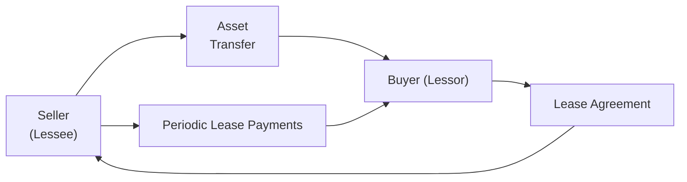

## 16.3 Sale-Leaseback Arrangements

Sale-leaseback transactions have long been a strategic option for businesses seeking to unlock value from owned assets while retaining the right to use those assets. In essence, a company (the “Seller-Lessee”) sells an asset to another party (the “Buyer-Lessor”) and simultaneously leases it back. This structure can free up cash for the Seller-Lessee, provide the Buyer-Lessor a steady lease income, and introduce various accounting considerations that require careful navigation. Under U.S. GAAP (ASC 842) and IFRS (IFRS 16), there are specific criteria to determine when a sale truly occurs and how to measure any resulting gains or losses, as well as how to account for the leaseback portion.

This section explores the fundamental principles behind sale-leaseback arrangements, clarifying:  
• When a sale is valid under current standards.  
• How to recognize gains (or losses) resulting from the sale component of the transaction.  
• Treatment of the leaseback arrangement in the Seller-Lessee’s books.  
• Common pitfalls and best practices.

--------------------------------------------------------------------------------
### Overview and Key Concepts

A sale-leaseback transaction has two major components:

1. The Sale Component  
   The Seller-Lessee transfers an asset’s ownership to the Buyer-Lessor in exchange for consideration (usually cash). 

2. The Leaseback Component  
   Immediately thereafter, the Seller-Lessee leases the same asset from the Buyer-Lessor. The lease may be classified as an operating lease or a finance lease (ASC 842 terminology) or operating vs. finance under IFRS 16.  

However, it is crucial to assess whether the initial transfer of the asset qualifies as an actual sale. If the transaction does not meet the criteria of a sale, the arrangement is effectively treated as a financing transaction rather than a sale-leaseback.  

--------------------------------------------------------------------------------
### Criteria for Determining if a Sale Has Occurred

Under ASC 842 and IFRS 16, a sale has occurred if two broad conditions are satisfied:

1. Transfer of Control  
   The Buyer-Lessor obtains control of the asset, meaning there is a transfer of the risks and rewards of ownership. Indicators include the Buyer-Lessor’s right to direct the use of and obtain substantially all the remaining benefits from the asset.  

2. No Repurchase/Call Options That Prevent Transfer  
   If the Seller-Lessee retains a substantive repurchase right or call option at a fixed price or a price that is favorable, it may indicate that control of the asset has not effectively transferred.  

Realizing a sale also depends on ensuring that the arrangement would not be classified as a failed sale under the standard. Typically, arrangements containing explicit or implicit repurchase agreements or obligations that significantly restrict the Buyer-Lessor’s control can taint the transaction, reclassifying it as a financing arrangement.

--------------------------------------------------------------------------------
### Understanding Failed Sales

A “failed sale” occurs when the contract provisions effectively cancel out the sale aspect. For instance, if the Seller-Lessee can or must repurchase the asset in the near term at a predetermined price that preserves most of the ownership risks, the Buyer-Lessor has not gained control. In that case:

• The Seller-Lessee keeps the asset on its balance sheet.  
• The “purchase” price from the Buyer-Lessor is recognized as a borrowing (liability).  
• Lease payments to the Buyer-Lessor are recognized as interest and principal repayment on that liability.  

Hence, it is critical to conduct a robust analysis of the transaction’s legal form and substance to confirm if control has been transferred and if the terms do not create a disguised financing arrangement.

--------------------------------------------------------------------------------
### Recognition of Gains and Losses

Once the transaction qualifies as a sale, the Seller-Lessee derecognizes the asset from its balance sheet and recognizes a gain or loss. The determination of the gain or loss hinges on comparing the asset’s carrying amount to the sale proceeds (net of any fees or direct costs).  

However, ASC 842 and IFRS 16 restrict the amount of gain recognized immediately if the Seller-Lessee retains a portion of the asset’s rights of use. Specifically:

• Step 1: Identify the portion of the asset that has been “sold.”  
• Step 2: Identify the portion that has effectively been “retained” through the leaseback right-of-use.  
• Step 3: Recognize a gain or loss on only the portion of the asset that was truly sold, deferring or reducing the gain for the portion of rights retained under the lease.  

Under ASC 842, the Seller-Lessee measures the right-of-use asset at the proportionate carrying amount of the transferred asset, ensuring that any resulting gain on the sale portion is recognized upfront.

--------------------------------------------------------------------------------
### Accounting for the Leaseback Portion

Once a sale is established, the leaseback arrangement is documented as a new lease, with classification depending on factors such as:

• The extent to which the Buyer-Lessor retains residual risk in the asset.  
• The nature of the asset and the terms of lease payments (fixed vs. variable).  
• The economic life of the asset and the lease term.  

For the Seller-Lessee:  
• If the leaseback is classified as an operating lease:  
  – The Seller-Lessee will recognize rent expense on a straight-line basis (or another systematic approach) over the lease term.  
  – A portion of any gain may be recognized immediately, while the remainder may be deferred in line with the rights retained.  

• If the leaseback is classified as a finance lease (or IFRS finance lease):  
  – The Seller-Lessee recognizes a right-of-use (ROU) asset and lease liability.  
  – Any gain is recognized consistent with the partial sale approach, though classification as a finance lease may limit the immediate recognition of gains if the lease effectively transfers many of the underlying asset’s risks and rewards back to the Seller-Lessee.  

--------------------------------------------------------------------------------
### Practical Example

Consider a trucking company, RoadRunners Inc., that owns a fleet of trucks with a carrying value of $1,000,000 (fair value $1,200,000). RoadRunners needs cash to upgrade older machinery, so it enters into a sale-leaseback deal:

• Sells the trucks to an investment company for $1,180,000.  
• Immediately leases the trucks back for four years, with no repurchase option and no renewal option.  

Assuming control transfers to the investment company (Buyer-Lessor) and there is no embedded repurchase feature, the transaction is likely a valid sale.  

The carrying amount is $1,000,000. The sale price is $1,180,000. The fair value is $1,200,000, indicating the sale is near fair value and does not suggest any embedded financing arrangement.  

Gain = Sale Price – Carrying Amount = $1,180,000 – $1,000,000 = $180,000  

Because RoadRunners retains a right of use for the four-year term, it must recognize a portion of the $180,000 gain immediately, and potentially defer the remainder over the lease term. If the arrangement is an operating lease, the calculation might factor in a ratio of the asset’s retained use. Let’s assume RoadRunners has retained 40% of the asset’s life-value via the lease. The immediate gain recognized could be 60% of $180,000 = $108,000, with $72,000 deferred.  

Ultimately, RoadRunners will show an ROU asset and a lease liability on its books (under an operating lease, this is recognized differently under IFRS 16 vs. ASC 842, but the principle of expensing lease payments over time remains).

--------------------------------------------------------------------------------
### Flow of a Sale-Leaseback Arrangement

The following Mermaid diagram illustrates the sequence of a typical sale-leaseback transaction:

Explanation of the visual flow:  
• The Seller transfers the asset (livestock, equipment, real estate, etc.) to the Buyer, receiving a purchase price.  
• Immediately, the Buyer (as Lessor) returns the right to use that asset by leasing it back to the original Seller (who becomes the Lessee).  
• The Lessee pays lease payments according to the lease contract.

--------------------------------------------------------------------------------
### Key Judgment Areas

1. Determining Fair Value  
   The sale price should approximate the fair value of the asset. A significantly higher or lower consideration signals possible embedded financing or pricing of lease terms into the asset sale.

2. Lease Term and Economic Life  
   If the leaseback is for a major portion of the asset’s remaining economic life, it might indicate the Seller-Lessee retains most of the risks and rewards. The classification could shift to a failed sale or a finance lease.

3. Variable Lease Payments  
   Payments tied to usage or performance clauses can complicate the measurement of the ROU asset. The analysis must isolate fixed (or in-substance fixed) payments from variable ones.

4. Potential Embedded Options  
   Renewal options, purchase options, or provisions allowing the Seller-Lessee to reacquire the asset can taint the sale if they pass too much control back to the original owner.

5. Partial Sale Situations  
   Sometimes, the Seller-Lessee sells only a portion of the asset’s ownership rights. The guidelines call for proportionate recognition of the gain.

--------------------------------------------------------------------------------
### Differences Between U.S. GAAP (ASC 842) and IFRS (IFRS 16)
Although they converge on many sale-leaseback principles, there are nuances:

• **Residual Approach**: Under IFRS 16, the way partial sales are treated may differ slightly in how the gain is apportioned.  
• **Recognizing Gains**: There is convergence around limiting the gain to the portion of rights that transfer to the buyer. However, some measurement details might vary between IFRS 16 and ASC 842.  
• **Lease Classification**: IFRS 16 has a single classification model for lessees. U.S. GAAP differentiates between operating and finance leases under ASC 842.  

Ultimately, the two frameworks are conceptually consistent, yet an entity’s results could differ slightly based on the precise guidance and the presence of any additional IFRS or GAAP-specific nuances.

--------------------------------------------------------------------------------
### Best Practices and Avoiding Common Pitfalls

• **Document Control Transfer**  
  Provide clear evidence that the Buyer-Lessor can direct the future use of the asset. Substantive repurchase or call options are transparent red flags.  

• **Watch Out for Embedded Financing**  
  When the lease payments are artificially high or low relative to market rates, this could suggest that part of the “sale price” is effectively a prepayment or a financing arrangement.  

• **Consider the Entire Arrangement**  
  Evaluate side agreements, vendor financing arrangements, or contingent obligations that might affect the sale assessment.  

• **Perform Robust Disclosures**  
  Financial statements should reflect the nature of sale-leaseback transactions, highlighting the accounting treatment of the gain or loss, how lease terms were determined, and any judgments that significantly affect amounts recognized.  

--------------------------------------------------------------------------------
### Real-World Example & Potential Complexity

In property transactions, real estate sale-leasebacks can involve large-dollar amounts with long lease terms that might exceed a significant portion of the asset’s remaining economic life. For instance, a company sells its headquarters building and leases it back for 30 years, with renewal options that effectively keep the property under the same occupant for four or five decades. Even if the immediate terms meet the sale recognition criteria, the presence of multiple renewal options at below-market rates could indicate, upon deeper analysis, a retention of control by the Seller-Lessee. Such transactions require deep scrutiny of all contract features, side arrangements, and cost-of-capital considerations.

--------------------------------------------------------------------------------
### Conclusion and Further Considerations

Sale-leaseback arrangements remain a compelling strategy to monetize assets while retaining operational usage. However, these transactions require precise application of accounting standards to confirm that a legitimate sale has taken place and measure the resulting gains or losses accurately. Failure to meet the sale conditions can alter the transaction’s presentation from a straightforward sale-leaseback to a financing on the Seller-Lessee’s balance sheet.  

Practitioners are encouraged to consult ASC 842, IFRS 16, or equivalent authoritative guidance, and to perform a robust analysis of contractual terms—particularly focusing on repurchase options, control transfer, and lease term—before concluding on the arrangement’s accounting treatment.

--------------------------------------------------------------------------------
### References and Further Exploration

• Financial Accounting Standards Board (FASB) Accounting Standards Codification (ASC) 842 – Leases.  
• International Financial Reporting Standard (IFRS) 16 – Leases.  
• KPMG, “Lease accounting guide” – Overview of ASC 842 and IFRS 16.  
• Journal of Accountancy articles on sale-leaseback best practices and pitfalls.  

--------------------------------------------------------------------------------

## Test Your Knowledge: Sale-Leaseback Arrangements Quiz



### In a sale-leaseback arrangement under ASC 842, which factor primarily indicates that a true sale has occurred?

- [x] The Buyer-Lessor obtains control of the asset, free of substantial repurchase rights.  
- [ ] The Seller-Lessee receives cash equal to or greater than the asset’s net book value.  
- [ ] The Seller-Lessee retains a purchase option in the contract.  
- [ ] The lease term covers at least 75% of the asset’s remaining economic life.  

> **Explanation:** Under ASC 842 and IFRS 16, the essence of a “sale” is the transfer of control. If the Seller-Lessee retains substantive repurchase rights or disproportionate influence, the transaction may fail to qualify as a sale.

### Once it is determined that a sale has occurred in a sale-leaseback, how is the gain on the sale typically recognized?

- [x] A portion of the gain is recognized immediately, and any gain related to the retained use is deferred.  
- [ ] The entire gain is recognized immediately.  
- [ ] The entire gain is deferred until the lease term ends.  
- [ ] No gain is recognized until the lease is terminated.  

> **Explanation:** Under both ASC 842 and IFRS 16, the portion of the gain related to the rights transferred is recognized immediately, while the portion of rights retained through the leaseback is deferred or amortized over the lease term.

### What happens if a sale-leaseback transaction fails to meet the criteria for a sale?

- [x] The transaction is accounted for as a financing arrangement.  
- [ ] The arrangement is void and must be restated.  
- [ ] Both parties reverse the transaction entirely.  
- [ ] All gains are fully recognized immediately.  

> **Explanation:** When a sale is not deemed to have occurred, the Seller-Lessee maintains the asset on its books and recognizes a liability for the proceeds received.

### Which of the following is a strong indicator that a sale may not have occurred in a sale-leaseback arrangement?

- [x] The Seller-Lessee has a substantive repurchase option for the asset at a fixed price.  
- [ ] The asset is sold at its market value.  
- [ ] The lease term is short relative to the asset’s useful life.  
- [ ] The Buyer-Lessor obtains legal title but has no restrictions on usage.  

> **Explanation:** If the Seller-Lessee holds a substantive repurchase option, the Buyer-Lessor does not truly gain control, causing a failed sale.

### When accounting for sale-leaseback under an operating lease, which of the following is correct?

- [x] The leaseback is recognized as an operating lease by the Seller-Lessee, resulting in straight-line expense recognition.  
- [ ] The leaseback is never classified as an operating lease.  
- [x] A portion of the gain is often recognized immediately, with the remainder deferred.  
- [ ] No liability is recorded on the Seller-Lessee’s balance sheet under any circumstances.  

> **Explanation:** In an operating lease scenario, the Seller-Lessee typically uses straight-line expense recognition, and any gain on sale is recognized partially upfront and partially deferred.

### If the sale price in a sale-leaseback transaction significantly exceeds the asset’s fair value, what is the most likely accounting implication?

- [x] Part of the sale price is considered additional financing.  
- [ ] All the gain is recognized immediately due to higher proceeds.  
- [ ] The sale is automatically disqualified.  
- [ ] The lease payments are ignored in the computation of the leaseback.  

> **Explanation:** If the sale price is significantly above fair value, it suggests that some of the excess price may be a financing element embedded in the transaction.

### Under IFRS 16, how is the gain recognized when a sale-leaseback is concluded to be valid, but the Seller-Lessee retains a portion of the asset?

- [x] Only the proportionate share of the gain corresponding to the rights transferred is recognized immediately.  
- [ ] All the gain is recognized immediately.  
- [x] The remainder of the gain is deferred over the lease term.  
- [ ] The entire gain remains deferred until the lease terminates.  

> **Explanation:** IFRS 16, like ASC 842, restricts gain recognition to the portion of rights transferred. The portion of the gain related to retained use is deferred.

### Which of the following best describes a failed-sale scenario according to ASC 842?

- [x] The Seller-Lessee continues to reflect the asset on its balance sheet and recognizes a liability for the proceeds.  
- [ ] The Seller-Lessee derecognizes the asset but recognizes a deferred gain.  
- [ ] The Buyer-Lessor recognizes a receivable for the purchase price.  
- [ ] The Seller-Lessee lists it as an operating lease with the entire gain recognized immediately.  

> **Explanation:** In a failed-sale scenario, the Seller-Lessee has not transferred control, so the asset remains on the Seller-Lessee’s books, and the proceeds are treated as a financing liability.

### If the leaseback covers substantially all of the remaining economic life of the asset, how might this affect sale-leaseback accounting?

- [x] It may suggest that most risks and rewards remain with the Seller-Lessee, possibly invalidating the sale.  
- [ ] It automatically qualifies as an operating lease.  
- [ ] It forces a “direct financing lease” classification for the Buyer-Lessor.  
- [ ] It always leads to immediate recognition of all gains.  

> **Explanation:** When the lease term is nearly the entire economic life of the asset, it can indicate that control never truly transferred, increasing the potential for a failed sale classification or finance lease classification under U.S. GAAP.

### Which statement is TRUE regarding the treatment of the gain in a valid sale-leaseback transaction?

- [x] True  
- [ ] False  

> **Explanation:** In a valid sale-leaseback transaction, the Seller-Lessee recognizes gains only to the extent control has transferred and a proportion of rights are relinquished. Any retained usage rights reduce the gain recognized upfront.



--------------------------------------------------------------------------------

## For Additional Practice and Deeper Preparation

### [Business Analysis and Reporting (BAR) CPA Mock Exams](https://www.udemy.com/course/bar-cpa-mock-exams/?referralCode=ADBE2E84BEE9CB6243CA)

**Business Analysis and Reporting (BAR) CPA Mocks:** 6 Full (1,500 Qs), Harder Than Real! In-Depth & Clear. Crush With Confidence!

- Tackle full-length mock exams designed to mirror real BAR questions.  
- Refine your exam-day strategies with detailed, step-by-step solutions for every scenario.  
- Explore in-depth rationales that reinforce higher-level concepts, giving you an edge on test day.  
- Boost confidence and minimize anxiety by mastering every corner of the BAR blueprint.  
- Perfect for those seeking exceptionally hard mocks and real-world readiness.  

_Disclaimer: This course is not endorsed by or affiliated with the AICPA, NASBA, or any official CPA Examination authority. All content is for educational and preparatory purposes only._
