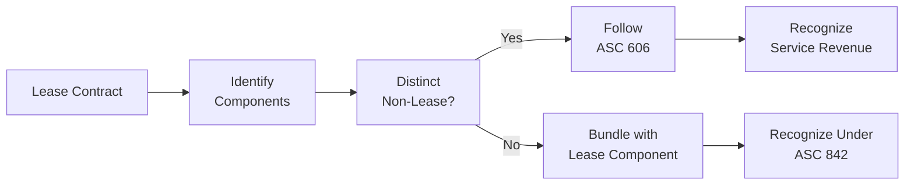
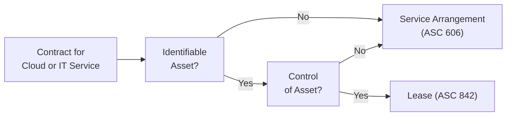

## 16.4 Common Complexities and Illustrative Cases

This section delves into some of the most frequently encountered complexities in lessor accounting and sale-leaseback transactions. While prior sections (16.1 Lessor’s Classification Criteria, 16.2 Lease Income, Initial Direct Costs, and Residual Value, and 16.3 Sale-Leaseback Arrangements) laid the groundwork for conceptual understanding, here we tackle the messy real-world challenges that professionals often confront. We will also demonstrate common mistakes, followed by step-by-step corrections, to reinforce proper application of the leasing standards. Each illustrative case highlights pitfalls and best practices that can prepare you for both practical on-the-job issues and potential exam scenarios.

-------------------------------------------------------------------------------

Key concepts from Chapters 16.1 – 16.3 to keep in mind as you read:  
• Classification Criteria (Finance vs. Operating Leases)  
• Lease Income and Measurement (Discount Rate, Gross vs. Net Investment)  
• Residual Value Estimation and Impairment  
• Sale-Leaseback Recognition vs. Financing Arrangement Criteria  

-------------------------------------------------------------------------------

Building on these foundations, let us explore real-life complexities that practitioners, students, and exam candidates alike often face.

-------------------------------------------------------------------------------

Common pitfalls and complexities covered:  
• Allocating Payments Between Lease and Non-Lease Components  
• Residual Value Guarantees and Variable Lease Payments  
• Leveraged Leases and Sale-Leaseback with Continuing Involvement  
• Application of Modern Cloud and IT Leases  
• Mistakes in Journal Entries and Disclosure Requirements  

-------------------------------------------------------------------------------

Use the following subtopics to guide your study and practice:

-------------------------------------------------------------------------------

Challenges in Allocating Lease and Non-Lease Components  
-------------------------------------------------------

Many lease contracts (e.g., commercial real estate leases, equipment leases) include both lease components (the right to use an asset) and non-lease components (maintenance, cleaning, service agreements). Under U.S. GAAP (ASC 842) and IFRS 16, lessors generally account for non-lease components separately if they are distinct. Failing to correctly bifurcate lease and non-lease elements can lead to inaccurate revenue recognition.

1. Common Mistake:  
   A lessor includes maintenance fees together with rental income in its lease receivable, overestimating the lease component’s carrying amount. This inflated lease receivable can distort reported leasing assets and recognized income.

2. Step-by-Step Correction:  
   - Step 1: Identify each component in the contract (lease vs. non-lease).  
   - Step 2: Allocate consideration to each component based on their standalone selling prices or a reasonable approximation.  
   - Step 3: Recognize revenue for the service (non-lease) component using appropriate revenue recognition guidance, typically ASC 606 (Revenue from Contracts with Customers).  
   - Step 4: Account for the lease component using lease guidance under ASC 842, ensuring that the lease receivable only includes amounts relating to the right to use the asset.  

Diagram: High-Level Allocation of Lease and Non-Lease Components  
---------------------------------------------------------------

-------------------------------------------------------------------------------

Residual Value Guarantees and Variable Lease Payments  
-----------------------------------------------------

Residual value guarantees (RVGs) and variable lease payments can significantly affect a lessor’s net investment in a lease (particularly for sales-type and direct financing leases). Misinterpreting these items may lead to incorrect recognition of interest income or lease asset balances.

1. Common Mistake – Overstating Variable Lease Income:  
   The lessor counts variable lease payments (e.g., usage-based or performance-based) as guaranteed future income. This overstates the gross investment in the lease and inflates interest income.  

2. Step-by-Step Correction:  
   - Step 1: Determine whether variable payments are in-substance fixed or contingent. Only in-substance fixed payments can be capitalized in the lease receivable.  
   - Step 2: Exclude true variable payments from the lease receivable, but consistently monitor for any changes to estimates.  
   - Step 3: For residual value guarantees, recognize and measure only the guaranteed portion expected to be owed by the lessee (or third party) at the end of the lease.  
   - Step 4: Reassess guaranteed residual values at each reporting date, reflecting changes in market conditions. If the asset value declines significantly, recalculate impairment or adjust investment values as needed.  

Practical Example: Residual Value Guarantee  
------------------------------------------

Let’s suppose a commercial equipment lease has a residual value guarantee from the lessee. The equipment’s estimated residual value after five years is $50,000, and the lessee guarantees $30,000 of that amount. The lessor should include only $30,000 in its net investment calculation. If the guarantee is deemed probable of collection, interest income calculations will reflect the guaranteed portion. If the equipment experiences a significant drop in expected salvage value, the lessor might need to record impairment or recalculate future yields.

-------------------------------------------------------------------------------

Leveraged Leases and Sale-Leaseback with Continuing Involvement  
---------------------------------------------------------------

Leveraged leases and sale-leaseback transactions often present layered complexities, particularly when the selling entity retains continuing involvement in the asset. For instance, if the seller-lessee provides additional guarantees or indemnifications after the sale, full derecognition of the asset may not be appropriate. Instead, the arrangement could be accounted for as a financing transaction rather than a sale.

1. Common Mistake – Misclassifying Sale-Leaseback as a Sale:  
   Companies often assume that transferring title to a third-party finance company or special purpose entity (SPE) immediately qualifies as a sale. However, if there is continuing involvement (e.g., repurchase options or residual value guarantees that substantially preserve the seller’s interest in the asset), the transaction might fail sale accounting under ASC 842-40.  

2. Step-by-Step Correction:  
   - Step 1: Evaluate whether control of the asset has truly transferred to the buyer-lessor, considering repurchase rights, future purchase obligations, or continuing involvement.  
   - Step 2: If control is not transferred, treat the arrangement as a financing. The asset remains on the seller’s balance sheet, and proceeds received are booked as a liability.  
   - Step 3: If control is deemed to transfer, measure any gain on sale at the portion not subject to continuing involvement. Interest or lease expense is recognized over the lease term.  

Illustrative Case: Sale-Leaseback with Partial Repurchase Right  
---------------------------------------------------------------

A biotech company sells its specialized lab equipment to a lessor for $5 million, then immediately leases it back for five years. As part of the agreement, the biotech firm retains an option to repurchase the equipment at $4.8 million at the end of the lease term, if certain technological upgrades are successful.

• Case Analysis:  
  - The repurchase option’s strike price is significantly close to the original selling price, which might indicate that the biotech firm retains substantial risks and rewards.  
  - If the option is reasonably expected to be exercised, the sale-leaseback may fail sales treatment under ASC 842 because the lessor does not obtain full control of the asset.  
  - Instead, the biotech firm recognizes a financing arrangement: the $5 million proceeds as a loan payable, and the lab equipment stays on its books (with depreciation continuing as normal).  

-------------------------------------------------------------------------------

Application of Modern Cloud and IT Leases  
-----------------------------------------

Many companies lease data centers, software infrastructure, or other IT-related services. Distinguishing between a lease of physical property (e.g., a specific rack in a data center) versus a service arrangement (e.g., a cloud computing service that does not convey a specific identifiable asset) can be challenging.

1. Common Mistake – Capitalizing a Service Arrangement:  
   A lessor counts an IT service contract as a lease, incorrectly recognizing a fixed asset and a lease receivable.  

2. Step-by-Step Correction:  
   - Step 1: Identify if the customer has the right to control the use of a specifically identifiable asset. Many cloud arrangements do not allow the customer to control a readily identifiable piece of hardware or underlying asset.  
   - Step 2: If no identified asset or no right to direct its use exists, account for it as a service arrangement, not a lease.  
   - Step 3: If it qualifies as a lease, follow ASC 842 or IFRS 16 guidelines, classifying the arrangement as operating or finance based on the lessor’s perspective.  

Diagram: Decision Tree – Is It a Lease or a Service?  
---------------------------------------------------

-------------------------------------------------------------------------------

Mistakes in Journal Entries and Required Disclosures  
----------------------------------------------------

Even after correctly identifying lease classification and revenue recognition, many complexities remain in accurately recording journal entries and preparing comprehensive footnote disclosures. From incorrectly netting lease revenue with service fees to overlooking discount rate changes, the margin for error is high.  

Common Mistake: Mixing Up Recognition of Initial Direct Costs and Lease Income  
------------------------------------------------------------------------------
• A lessor might offset initial direct costs entirely against lease income in the first period, rather than capitalizing them and recognizing them over the lease term (in a direct financing or sales-type lease).  

Step-by-Step Correction:  
------------------------
1. Identify the portion of costs that qualify as initial direct costs (those that would not have been incurred but for the execution of the lease).  
2. Under a sales-type lease, expense the costs upfront if they do not meet the criteria for deferral. If they are deferrable, include them in the net investment in the lease (affecting the calculation of interest income recognition over time).  
3. Under a direct financing lease, add initial direct costs to the net investment in the lease, recognizing the cost over the lease term through the yield.  
4. Disclose in the notes to the financial statements how initial direct costs have been treated, especially if they have a material impact on recognized income.  

-------------------------------------------------------------------------------

Illustrative Case: Common Pitfalls and Step-by-Step Corrections  
---------------------------------------------------------------

Case Background:  
----------------
A manufacturing company (the “lessor”) enters into a five-year agreement with a long-time customer to lease specialized equipment. The lease agreement also provides for ongoing maintenance handled by the lessor, as well as usage-based variable payments if the lessee’s production volume exceeds a specified threshold.  

Case Breakdown of Mistakes:  
----------------------------
• Mistake 1: The lessor records the entire contract as a single lease receivable, ignoring the non-lease maintenance component.  
• Mistake 2: The lessor includes usage-based variable lease payments within the net investment in the lease, inflating total lease income.  
• Mistake 3: The lessor recognizes initial direct costs (commission fees) as a lump-sum expense in the first period, inadvertently understating net income for subsequent periods.  

Step-by-Step Corrections:  
-------------------------
1. Bifurcate Maintenance Service:  
   - Identify that the ongoing maintenance is distinct, and allocate consideration to the maintenance fee separately from the core lease component.  
   - Recognize maintenance revenue over time (e.g., monthly) as the services are performed, in line with ASC 606 guidance.  

2. Exclude Usage-Based Variable Payments from Initial Net Investment:  
   - The variable fees tied to production volume should be excluded from the initial net investment in the lease unless they are in-substance fixed.  
   - Record these fees as variable lease income only when the contingency is resolved (i.e., the production volume is known).  

3. Proper Treatment of Initial Direct Costs:  
   - Determine if the costs meet the criteria for direct financing or sales-type classification.  
   - For a direct financing lease, add the direct costs to the net investment in the lease and recognize them over the lease term through the amortization of the net investment.  
   - Adjust journal entries so that the lease income reflects the periodic yield calculation based on the net investment inclusive of capitalized costs.  

Result:  
-------
• More accurate financial statements that properly depict lease income, non-lease service revenue, and the net investment in the lease.  
• Reduced risk of material misstatement or potential restatement.  
• Compliance with lessor-specific guidance of ASC 842 and cross-reference to revenue recognition guidelines when needed.  

-------------------------------------------------------------------------------

Best Practices and Recommendations  
----------------------------------

1. Establish Clear Contract Review Routines:  
   - Collaborate early with legal and commercial teams to identify all potential lease components, especially if the contract is complex with multiple deliverables.  

2. Monitor Changes in Estimated Residual Values:  
   - Market conditions can shift quickly, affecting the lessor’s expected residual asset value. Set up a documented process for periodic re-evaluation of asset values, especially for specialized equipment, real estate, or technology with rapid obsolescence rates.  

3. Employ Checklists for Journal Entries:  
   - Implement a standardized checklist or flowchart within the accounting function. This helps ensure correct classification, accurate measurement of lease income, and appropriate deferral or immediate recognition of initial direct costs.  

4. Stay Updated on New FASB and IASB Pronouncements:  
   - Lessor accounting standards can evolve. Monitor changes through official publications or professional development courses.  

-------------------------------------------------------------------------------

References for Further Learning  
-------------------------------

• FASB ASC 842, “Leases,” for specific text on lessor accounting requirements.  
• AICPA’s Audit and Accounting Guide: Revenue Recognition for deeper insights on bifurcation of non-lease components.  
• IFRS 16 guidance on lessor accounting for global coverage and comparison.  

-------------------------------------------------------------------------------

## Quiz: Common Complexities in Lessor Accounting and Sale-Leaseback



### Under ASC 842, which of the following best describes how non-lease components should be handled in a lessor arrangement?
- [ ] They should always be bundled into a single lease payment.  
- [ ] They are recognized as part of the lease income if immaterial.  
- [x] They should generally be accounted for under ASC 606 if they are distinct.  
- [ ] They must always be separated into at least three distinct components.  

> **Explanation:** Non-lease components (e.g., maintenance or service elements) that are distinct should be accounted for under revenue recognition guidance rather than being combined with lease income.

### Which of the following is most indicative of a sale-leaseback failing sales recognition?
- [x] The seller retains a substantial repurchase option that is likely to be exercised.  
- [ ] The asset is legally transferred to the lessor entity.  
- [ ] The seller plans to record any gain from the sale up front.  
- [ ] The buyer accepts part of the residual risk of the asset.  

> **Explanation:** If the seller’s repurchase option is likely to be exercised, true control of the asset has not transferred. Consequently, the arrangement is more akin to secured financing rather than a sale.

### What is the primary reason a lessor should revisit the estimated residual value throughout the lease term?
- [ ] To write off the asset if the lessee fails to make payments.  
- [ ] To remove the obligation from the books.  
- [x] To recognize impairment or adjustments if market conditions indicate a drop in residual value.  
- [ ] To convert the lease from an operating to a finance lease.  

> **Explanation:** Shifts in market value or asset condition may necessitate adjustments to the residual value, potentially requiring an impairment assessment or recalculation of future yields.

### In a direct financing lease, how should initial direct costs generally be handled if they qualify for deferral?
- [ ] Expensed immediately in the period incurred.  
- [x] Capitalized and included in the net investment in the lease.  
- [ ] Recognized ratably alongside lease revenue.  
- [ ] Classified as maintenance costs unrelated to the lease.  

> **Explanation:** For a direct financing lease, qualified initial direct costs are usually included in the net investment and recognized over the lease term through the lease’s implicit interest rate.

### Which of the following statements is true regarding variable lease payments?
- [ ] All variable payments should always be included in the initial measurement of the lease receivable.  
- [x] In-substance fixed payments are included, while usage-based or performance-based payments are recognized only when incurred.  
- [ ] None of the payments can ever be capitalized.  
- [ ] Variable payments are irrelevant to lessor accounting.  

> **Explanation:** In-substance fixed payments must be incorporated into the lease receivable, while future usage-based or performance-based payments do not meet the criteria for initial capitalization.

### If a lessor fails to identify non-lease components in a lump-sum contract, what is the most likely accounting error?
- [x] Overstating lease income and the lease receivable.  
- [ ] Understating the cash flow from operations.  
- [ ] Overstating the net investment in a direct financing lease by excluding residual value.  
- [ ] Recognizing the lease arrangement under IFRS 16 in error.  

> **Explanation:** By not bifurcating the non-lease service elements, the lessor overstates the lease component, leading to incorrect accounting for both the lease receivable and recognized revenue.

### Which of the following conditions could necessitate reclassification of a sale-leaseback as a financing arrangement after initial recognition?
- [x] Discovery of a significant continuing involvement or repurchase right that was not initially identified.  
- [ ] A minor typographical error in the contract.  
- [x] A revision to the lease’s classification due to changes in discount rates.  
- [ ] Absence of a separate contract for the non-lease components in the arrangement.  

> **Explanation:** If the seller retains substantial involvement in the asset (e.g., a repurchase right) or fails to transfer control in full, the arrangement is properly classified as financing, not a sale.

### When determining whether an IT arrangement is a lease or a service, which question should be asked first?
- [ ] Is there any variable payment clause?  
- [x] Does the contract identify a specific asset?  
- [ ] Can the lessor modify the arrangement at any time?  
- [ ] Does the lessee have a guaranteed residual value clause?  

> **Explanation:** The initial step is to determine whether there is a specifically identifiable asset. If there is no specific asset (e.g., a common server pool in a cloud environment), it may not qualify as a lease.

### What is a best practice to avoid misclassification of sale-leaseback transactions?
- [ ] Rely solely on the wording of the contract to make the determination.  
- [x] Establish a thorough internal review process that evaluates control transfer and continuing involvement.  
- [ ] Automatically classify all sale-leaseback transactions as financing if they involve real estate.  
- [ ] Assume that the absence of side agreements confirms sale treatment.  

> **Explanation:** A robust internal review process helps ensure all aspects of control transfer and potential continuing involvement are carefully analyzed.

### True or False: Under ASC 842, a lessee’s guarantee of a third party’s residual value must always be recognized as a liability by the lessor.
- [x] True  
- [ ] False  

> **Explanation:** If the third party’s residual value guarantee is effectively borne by the lessee, the lessor may record that portion of guaranteed value in its net investment, provided the guarantee is probable of being realized. The recognition from a lessor’s standpoint requires careful evaluation based on the lessee’s or third party’s credit risk and the structure of the guarantee.



-------------------------------------------------------------------------------

## For Additional Practice and Deeper Preparation

### [Business Analysis and Reporting (BAR) CPA Mock Exams](https://www.udemy.com/course/bar-cpa-mock-exams/?referralCode=ADBE2E84BEE9CB6243CA)

Business Analysis and Reporting (BAR) CPA Mocks: 6 Full (1,500 Qs), Harder Than Real! In-Depth & Clear. Crush With Confidence!

• Tackle full-length mock exams designed to mirror real BAR questions.  
• Refine your exam-day strategies with detailed, step-by-step solutions for every scenario.  
• Explore in-depth rationales that reinforce higher-level concepts, giving you an edge on test day.  
• Boost confidence and minimize anxiety by mastering every corner of the BAR blueprint.  
• Perfect for those seeking exceptionally hard mocks and real-world readiness.  

_Disclaimer: This course is not endorsed by or affiliated with the AICPA, NASBA, or any official CPA Examination authority. All content is for educational and preparatory purposes only._
