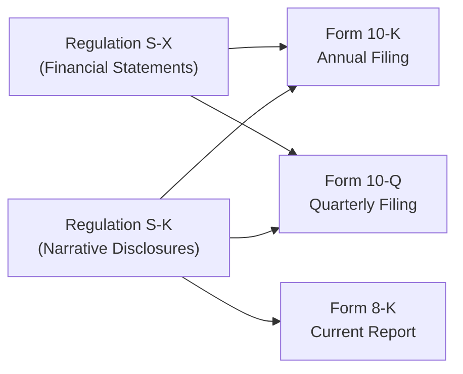

## 17.1 SEC Regulations S-X and S-K

Public companies subject to U.S. Securities and Exchange Commission (SEC) reporting requirements must comply with comprehensive rules and regulations when preparing their periodic and annual filings. Two central pillars of these rules are Regulation S-X and Regulation S-K. Both address the information a registrant must disclose; however, they do so from distinct angles. Regulation S-X primarily governs the form, content, and requirements for financial statements and their notes, while Regulation S-K prescribes non-financial statement disclosures, including management’s discussion and analysis (MD&A), risk factors, and other narrative materials. This section explains these two regulations, highlights key forms and disclosures, and offers practical insights on how to navigate the differences between financial and narrative reporting.

--------------------------------------------------------------------------------

### Purpose and Scope of SEC Regulations

The SEC’s disclosure system aims to protect investors by requiring the provision of reliable and adequate information about publicly traded companies. By maintaining transparent financial reporting and robust disclosures, the SEC helps ensure an efficient marketplace where investors can make informed decisions.

• Regulation S-X establishes the accounting-related rules for financial statements.  
• Regulation S-K focuses on supplementary information—including MD&A, description of business operations, executive compensation, and other qualitative and quantitative disclosures beyond the basic financial statements.

Understanding the regulatory requirements for public companies is essential for any emerging accountant or analyst, especially those preparing for the CPA exam. In the Business Analysis and Reporting (BAR) discipline, you will often work with both sets of regulations, cross-referencing them to create consistent, comprehensive filings.

--------------------------------------------------------------------------------

### Key Differences Between Regulation S-X and S-K

Regulation S-X focuses on how financial statements must be presented, ensuring uniformity in accounting policies and disclosure practices. By comparison, Regulation S-K addresses the narratives, tables, risk factors, and textual descriptions that accompany or supplement the financial statements.

• Regulation S-X:  
  – Dictates the line items, schedules, and notes needed in annual and interim financial statements.  
  – Details the inclusion of pro forma financial information for certain transactions (e.g., business combinations).  
  – Covers auditor’s reports, footnotes, consolidation rules, and form/content directives.

• Regulation S-K:  
  – Governs MD&A, risk factors, descriptions of the registered entity's business, legal proceedings, and more.  
  – Specifies requirements for executive compensation disclosure and corporate governance items.  
  – Guides how and when to disclose quantitative and qualitative market risk information, as well as forward-looking statements.

Both regulations ensure that investors receive a detailed yet cohesive picture of the registrant’s performance—financial and otherwise. Filers must comply with both sets of rules for full transparency. While Regulation S-X covers numerical and accounting standards, Regulation S-K enhances the narrative context around those numbers.

--------------------------------------------------------------------------------

### Forms That Require S-X and S-K Disclosures

Various forms and filings submitted to the SEC require compliance with both S-X and S-K requirements. Each form has unique purposes, timelines, and regulatory expectations. Below are some of the most common:

• Form 10-K (Annual Report):  
  – Financial statements (audited) must comply with Regulation S-X.  
  – Narrative disclosures such as MD&A and risk factors must comply with Regulation S-K.  
  – Provides a comprehensive, annual snapshot of the company’s financial health, operational performance, and strategic directions.

• Form 10-Q (Quarterly Report):  
  – Unlike Form 10-K, financial statements in a 10-Q are unaudited; however, they still must align with Regulation S-X guidelines for interim reporting.  
  – MD&A is shorter but again must satisfy Regulation S-K.  
  – Discloses financial and operational updates for the quarter.

• Form 8-K (Current Report):  
  – Used to inform investors of significant events, such as mergers, asset acquisitions, or leadership changes.  
  – Narrative or financial requirements in 8-Ks are typically anchored by relevant S-K or S-X sections, depending on the nature of the event.  
  – Timely disclosures related to significant events ensure the market stays informed about material developments.

• Registration Statements (e.g., S-1, S-3):  
  – Serve as the vehicle for companies to go public or register additional securities.  
  – Must include audited financial statements that follow Regulation S-X.  
  – Must incorporate the various narrative disclosures governed by Regulation S-K (e.g., risk factors, business overview).

• Proxy Statements (Schedule 14A):  
  – While primarily governed by Regulation 14A, many items require S-K disclosures (e.g., executive compensation).  
  – May cross-reference financial data presented under Regulation S-X for annual meetings or special shareholder meetings.

--------------------------------------------------------------------------------

### Navigating Financial Statements Under Regulation S-X

Regulation S-X structures the presentation of financial statements and ensures that information is standardized, comparable, and transparent. Major areas covered:

• Articles and Rules:  
  – Article 3 sets forth general requirements, including form, content, and additional schedules.  
  – Rule 3-05 addresses financial statements of businesses acquired or to be acquired, requiring historical statements of a target if it meets certain significance thresholds.  
  – Rule 3-09 concerns separate financial statements for unconsolidated subsidiaries or investees under certain conditions.

• Inclusion of Auditor Reports:  
  – Filers must provide audit reports in compliance with PCAOB standards.  
  – Auditors are responsible for certifying that financial statements conform with either U.S. GAAP or IFRS (if eligible as a foreign private issuer).

• Interim Financial Statements:  
  – For quarterly reporting (e.g., Form 10-Q), filers must provide condensed or full interim statements.  
  – Must adhere to the same standards of disclosure but can be condensed compared to annual reports.

• Schedules and Supplemental Information:  
  – Certain items like inventories, valuation accounts, or property schedules might require separate line-by-line details.  
  – Provides deeper granularity so investors can more thoroughly assess specific line items.

Compliance with Regulation S-X demands rigorous internal controls, as any omission or misclassification can lead to significant scrutiny or regulatory action. It is crucial to tie the final financial statements to underlying accounting records while aligning with recognized accounting standard-setters.

--------------------------------------------------------------------------------

### Mastering Narrative Disclosures Under Regulation S-K

Regulation S-K shapes how companies communicate operational results, financial conditions, and foreseeable risks. The textual disclosures are critical to understanding a company’s future outlook and strategic position. Core sections include:

• Management’s Discussion and Analysis (MD&A):  
  – Provides insights into the financial statements by explaining trends, events, and uncertainties.  
  – Addresses liquidity, capital resources, results of operations, and off-balance sheet arrangements.  
  – Emphasizes the company’s judgment areas, such as critical accounting policies and estimates.

• Risk Factors:  
  – Discusses the primary risks that could adversely affect the company’s financial results or future performance.  
  – Must be written with clarity and grouped logically, empowering investors to evaluate potential exposures.

• Description of Business and Legal Proceedings:  
  – Similar to a corporate profile, this subsection discusses an entity’s products, services, and competitive environment.  
  – Legal proceedings, environmental regulations, or compliance matters that could affect operations must all be disclosed.

• Executive Compensation and Interrelated Items:  
  – Requires tabular and narrative disclosures on executive pay, stock awards, and other compensation elements.  
  – Details the structure of management incentives, equity compensation plans, and related party transactions.

The narrative portion is sometimes perceived as more subjective because it allows management to explain the numbers through a forward-looking lens. Nonetheless, this forward-looking angle also triggers the potential for legal liability if statements are found to be misleading or contradictory.

--------------------------------------------------------------------------------

### Case Study: Linking S-X and S-K Disclosures in a Form 10-K

Assume a mid-sized technology manufacturer, TechForward Inc., experiences a 40% spike in material costs due to sudden global supply chain constraints. Under Regulation S-X, TechForward’s Form 10-K must show the effect on:

1. Cost of Goods Sold (COGS)  
2. Gross Margin  
3. Inventory Valuation in the Balance Sheet  
4. Related Footnotes explaining any revaluation or supply chain impact

Under Regulation S-K, the same event necessitates expanded MD&A commentary, such as:

1. Detailed explanations of how supply constraints impacted margins.  
2. Forward-looking statements on strategies to mitigate future supply chain disruptions.  
3. Adjusted risk factors addressing new supplier relationships or raw material volatility.

A consistent set of disclosures supported by robust data analytics can convey both the quantitative and qualitative aspects of the business’s recent performance. Investors can then integrate these data points into their valuation models and risk assessments, making more informed decisions regarding TechForward’s outlook.

--------------------------------------------------------------------------------

### Visual Overview: How S-X and S-K Flow into Key SEC Filings

Below is a Mermaid diagram illustrating how Regulation S-X and Regulation S-K feed into different sections of common SEC forms (e.g., 10-K, 10-Q, 8-K).

Explanation of diagram:  
• Regulation S-X focuses on financial statements and related notes that appear in annual and quarterly reports.  
• Regulation S-K sets the guidelines for supplementary disclosures, including MD&A, risk factors, and more.  
• Both regulations drive the content of major SEC forms (e.g., 10-K, 10-Q, 8-K), ensuring that investors receive complete and consistent information.

--------------------------------------------------------------------------------

### Best Practices and Common Pitfalls

When dealing with SEC submissions, certain best practices can help filers remain compliant and transparent:

• Align S-X and S-K Disclosures:  
  – Ensure financial data in the MD&A ties directly to the numbers in the financial statements.  
  – Provide consistent references or cross-links where appropriate, reducing confusion for investors.

• Maintain Clear and Accurate Internal Records:  
  – Implement robust financial close processes so that disclosures under S-X and S-K remain accurate.  
  – Use checklists and standardized workpapers for consistent, repeatable compliance.

• Emphasize Plain English for Narrative Disclosures:  
  – Technical jargon should be used sparingly. If complex terms are essential, define them thoroughly.  
  – A straightforward approach makes it simpler for a broad audience, including regulators, investors, and analysts, to comprehend the message.

• Watch Out for “Disclosure Overload”:  
  – Excessive or repetitive information can bury important content.  
  – Summaries, bullet points, or tables may help highlight critical information more effectively.

• Stay Alert to Evolving Requirements:  
  – The SEC frequently updates and refines rules, especially concerning emerging risks or new technologies.  
  – Keep pace with pronouncements, staff guidance, and interpretive releases to ensure compliance.

Common pitfalls often involve:  
1. Inadequate risk factor disclosures or failing to update risk factors as business circumstances change.  
2. Omitting or improperly categorizing related party transactions.  
3. Using boilerplate language in MD&A that doesn’t specifically illustrate how financial data is impacted by internal decisions or market conditions.  
4. Misalignment between narrative claims (S-K) and reported data (S-X), leading to potential enforcement actions.

--------------------------------------------------------------------------------

### Incorporating Internal Controls and Technology

Public registrants must not only meet the content requirements but also demonstrate strong internal controls over financial reporting (ICFR) and disclosure controls. Sarbanes-Oxley Act (SOX) requirements dovetail with regulations S-X and S-K, ensuring integrity of financial and non-financial reporting.

• Automations, RPA, and AI:  
  – Companies increasingly leverage automation to streamline data gathering, shift to real-time analytics, and support comprehensive disclosures.  
  – Automated workflows reduce opportunities for error while accelerating the submission process for periodic reporting.

• Role of Data Governance:  
  – Effective data governance policies ensure the completeness and accuracy of data feeding both financial statements (S-X) and narrative reporting (S-K).  
  – A robust data infrastructure helps maintain consistency in numeric and descriptive elements across all SEC filings.

--------------------------------------------------------------------------------

### Sample Disclosures and Illustrations

To illustrate the wide applicability of Regulations S-X and S-K, consider the following examples:

1. Revenue Recognition Footnote (Regulation S-X):  
   – A coffee chain must disclose revenue recognition policies for new loyalty programs or coupon codes.  
   – Explains how breakage (unredeemed points) is recognized as revenue and includes relevant judgments.

2. MD&A Revenue Narrative (Regulation S-K):  
   – Management discusses how recent marketing initiatives increased sales, focusing on stable growth in loyalty memberships and the expected future impact.  
   – Potential risks and uncertainties regarding supply chain constraints for coffee beans.

3. Business Combination Reporting (Regulation S-X):  
   – A company’s acquisition triggers Rule 3-05, requiring the acquiree’s audited financial statements if significance thresholds are met.  
   – Possible pro forma financial statements showing the effect of the acquisition on historical performance.

4. Risk Factor Expansion (Regulation S-K):  
   – Enhanced detail on how the coffee chain’s reliance on specific suppliers or climatic changes in coffee-producing regions could affect future operations.  
   – Revisions to reflect recent environmental or regulatory developments.

--------------------------------------------------------------------------------

### Practical Implementation Strategies

• Develop a Master Checklist:  
  – Outline S-X and S-K requirements relevant to your specific entity and reporting cycle.  
  – Update checklists periodically to incorporate any new rules or interpretative guidance.

• Conduct Cross-Functional Reviews:  
  – Involve departments beyond accounting—legal, investor relations, operations—to gather data for MD&A, risk factors, and business narratives.  
  – Promote consistency and accuracy by reviewing final disclosures in a “single voice.”

• Leverage Technology for Change Management:  
  – Use specialized software that automates the population of financial data into MD&A tables.  
  – Track changes systematically and store version histories for compliance audits.

• Integrate Management Commentary Early:  
  – Start drafting your MD&A while financial statements are still being finalized.  
  – Gather initial impressions about the business environment to shape a more meaningful narrative.

--------------------------------------------------------------------------------

### References for Further Exploration

For deeper insights into SEC compliance and best practices, consider exploring the following resources:

• SEC Website:  
  – Primary source for regulation texts, forms, and instructive guidance.  
  – https://www.sec.gov

• Division of Corporation Finance:  
  – Regularly issues Compliance and Disclosure Interpretations (C&DIs) clarifying aspects of S-X and S-K.  
  – https://www.sec.gov/divisions/corpfin.shtml

• AICPA Publications on SEC Reporting:  
  – Offers auditing and accounting guides tailored to public companies.

• PCAOB Guidance:  
  – Addresses auditor responsibilities and procedures around financial statements under Regulation S-X.

• Professional Networks and Journals:  
  – Engage with forums or networking groups (e.g., FEI, IIA) for peer perspectives on advanced or emerging disclosure requirements.

By committing to continuous learning and staying informed on evolving SEC regulations, accounting professionals can help ensure both the quantitative and qualitative disclosures meet the high standards expected by today’s markets.

--------------------------------------------------------------------------------

## SEC Compliance Mastery Quiz: Key Insights on Regulations S-X and S-K



### Which phrase best describes the primary difference between Regulations S-X and S-K?  
- [x] Regulation S-X governs financial statement disclosures, while Regulation S-K governs narrative disclosures.  
- [ ] Regulation S-X ensures compliance with internal controls, while Regulation S-K only covers external audits.  
- [ ] Regulation S-X pertains to foreign private issuers, while Regulation S-K pertains to domestic issuers.  
- [ ] Only Regulation S-X addresses investor relations policies.  

> **Explanation:** Regulation S-X sets the rules for the presentation and content of financial statements. Regulation S-K outlines narrative disclosures like MD&A and risk factors.

### In what type of SEC filing would you likely find both annual audited financial statements under Regulation S-X and MD&A under Regulation S-K?  
- [x] Form 10-K  
- [ ] Form 8-K  
- [ ] Schedule 13D  
- [ ] Form 3  

> **Explanation:** A Form 10-K (annual report) requires audited financials (Reg S-X) and MD&A (Reg S-K). Forms 8-K and 3 do not typically provide full annual financial statements or full MD&A.

### Which is a key area of focus under Regulation S-K but not typically detailed under Regulation S-X?  
- [x] Risk factors.  
- [ ] Inventory classification.  
- [ ] Revenue recognition policy.  
- [ ] Capital lease disclosure requirements.  

> **Explanation:** While S-X outlines how to present financial statements, S-K mandates additional narratives like risk factors, business overviews, and MD&A sections.

### Under Regulation S-X, a company that acquires a significant business must provide:  
- [x] Historical financial statements of the acquired business if certain thresholds are met.  
- [ ] Only the parent’s financial statements reflecting the acquired business prospectively.  
- [ ] Unaudited pro forma financial statements, but no historical financials.  
- [ ] A summary of the acquisition in MD&A, without separate financial statements.  

> **Explanation:** Rule 3-05 of Regulation S-X may require audited financial statements of the acquired company if it meets specified significance thresholds.

### Which of the following items is specifically covered under Regulation S-X rather than Regulation S-K?  
- [x] Financial statement footnote disclosures.  
- [ ] Executive compensation tables.  
- [x] Auditor’s report and opinion.  
- [ ] Description of the company’s business strategy.  

> **Explanation:** Regulation S-X sets the standards for footnotes and the auditor’s report, while S-K covers broader non-financial disclosures like executive compensation, strategy, and risk narratives.

### Which filing typically includes unaudited interim financial statements following Regulation S-X guidance?  
- [x] Form 10-Q  
- [ ] Form S-3  
- [ ] Proxy Statement  
- [ ] Annual Report (Form 10-K)  

> **Explanation:** Form 10-Q contains quarterly unaudited statements following relevant Regulation S-X requirements. 10-K is the annual report with audited statements.

### Which section of a Form 10-K is governed by Regulation S-K and provides contextual analysis of operations and financial results?  
- [x] MD&A  
- [ ] Footnotes  
- [x] Risk Factors  
- [ ] Auditor’s Opinion  

> **Explanation:** MD&A (Management’s Discussion and Analysis) and Risk Factors are governed by S-K, providing context and forward-looking insights, whereas footnotes and the auditor’s opinion follow S-X.

### A company is considering focusing more on plain English in its MD&A. Which best practice does this reflect?  
- [x] Making disclosures readable and comprehensible.  
- [ ] Minimizing detail in all sections.  
- [ ] Using more rigid boilerplate language to reduce confusion.  
- [ ] Substituting footnotes with narrative generalizations.  

> **Explanation:** The SEC encourages plain-English disclosures to improve readability, thereby enhancing investor understanding.

### Which statement best illustrates a common pitfall in Regulation S-K reporting?  
- [x] Using boilerplate text in risk factors, making them too generic.  
- [ ] Providing detailed scenario-based analyses in MD&A.  
- [ ] Linking the operational discussion to the numbers in the income statement.  
- [ ] Highlighting major uncertainties in forward-looking statements.  

> **Explanation:** Regulators often criticize boilerplate or vague disclosures. Effective S-K compliance demands specificity tailored to the registrant’s unique risks and environment.

### When a material corporate event occurs, which filing is typically used to inform the SEC and investors promptly?  
- [x] Form 8-K  
- [ ] Form 10-K  
- [ ] Form 13F  
- [ ] Form 10-Q  

> **Explanation:** Form 8-K is a current report used to disclose major events—such as mergers, acquisitions, or leadership changes—to the SEC and the investing public on a timely basis.



--------------------------------------------------------------------------------

## For Additional Practice and Deeper Preparation

### [Business Analysis and Reporting (BAR) CPA Mock Exams](https://www.udemy.com/course/bar-cpa-mock-exams/?referralCode=ADBE2E84BEE9CB6243CA)

**Business Analysis and Reporting (BAR) CPA Mocks:** 6 Full (1,500 Qs), Harder Than Real! In-Depth & Clear. Crush With Confidence!

• Tackle full-length mock exams designed to mirror real BAR questions.  
• Refine your exam-day strategies with detailed, step-by-step solutions for every scenario.  
• Explore in-depth rationales that reinforce higher-level concepts, giving you an edge on test day.  
• Boost confidence and minimize anxiety by mastering every corner of the BAR blueprint.  
• Perfect for those seeking exceptionally hard mocks and real-world readiness.

_Disclaimer: This course is not endorsed by or affiliated with the AICPA, NASBA, or any official CPA Examination authority. All content is for educational and preparatory purposes only._
