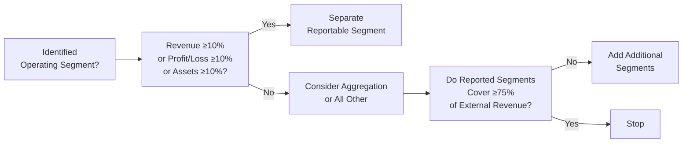

## 17.2 Segment Reporting (ASC 280)

Segment reporting under Financial Accounting Standards Board (FASB) Accounting Standards Codification (ASC) 280 is vital for providing investors, regulators, and other stakeholders with insights into the different business activities that make up a public entity’s operations. Disaggregating financial information by segments helps stakeholders evaluate performance, identify growth areas, and understand business risks more clearly. 

The fundamental concept underpinning segment reporting is the “management approach,” meaning that the way an entity’s chief operating decision maker (CODM) organizes and evaluates performance becomes the framework for defining reportable segments. This section explains the crucial quantitative thresholds for determining whether an operating segment should be presented separately, offers best practices, includes illustrative scenarios, and highlights relevant IFRS differences. By mastering these concepts, you will be able to produce accurate segment-related disclosures and avoid common pitfalls in financial reporting.

---

### Overview of the Management Approach

Before focusing on the quantitative thresholds, it is essential to understand the broader concept that drives segment reporting. Under ASC 280, the management approach requires that reportable segments mirror how senior management (i.e., the CODM) views and analyzes the business. 

• The CODM is the person (or group) responsible for assessing the operating results of the entity’s various segments and allocating resources.  
• Information used for internal decision-making (often referred to as “segment management information”) might stem from dashboards, performance reports, or internal profit statements.  
• The structure and organization of these internal reports provide strong indicators of how segments should be defined in external financial statements.

### Defining Operating Segments

An operating segment has three main characteristics under ASC 280:

• It engages in business activities from which it may earn revenues and incur expenses (including intercompany transactions).  
• Its operating results are regularly reviewed by the CODM to make resource-allocation decisions and assess overall performance.  
• It has discrete financial information available.

Any component of an entity that meets these criteria is considered an “operating segment.” However, whether that component becomes a “reportable segment” often hinges on quantitative thresholds explained below.

---

### Quantitative Thresholds

ASC 280 prescribes specific quantitative thresholds that an operating segment must meet to warrant separate disclosure as a reportable segment. These thresholds help ensure that significant business activities are presented in enough detail to forecast future performance and assess risks, while prohibiting excessive fragmentation of financial statement information.

The three core thresholds are summarized as follows:

1) Revenue Test (≥ 10%)  
2) Profit or Loss Test (≥ 10%)  
3) Asset Test (≥ 10%)

#### Revenue Test

An operating segment’s reported revenue (both external and intersegment) must be 10% or more of the combined revenue of all the entity’s operating segments. If so, that operating segment passes the revenue test.

• Combined revenue includes total sales to outside parties plus intersegment revenues to other components of the same entity.  
• If an operating segment’s revenue meets or exceeds 10% of the total, the segment should be reported separately, unless other considerations override this classification.

#### Profit or Loss Test

Any operating segment’s reported profit or loss that is 10% or more of the larger (in absolute magnitude) of:  
• The combined reported profit of all operating segments that did not report a loss, and  
• The combined reported loss of all operating segments that reported a loss,  

should also be reported as a separate segment. This test ensures that segments with notably high profits (or losses) are individually disclosed.

• When assessing profitability, be mindful that the measure used must be consistent with how the CODM evaluates the segments.  
• Both extremes—significantly profitable or significantly loss-making—trigger the profit or loss threshold.

#### Asset Test

An operating segment’s assets must be 10% or more of the combined assets of all operating segments. For the asset test:

• Only those operating segments that are part of the enterprise’s overall resource allocation strategy are included in the total.  
• If the segment’s carrying amount of identifiable assets is at least 10% of the combined total, the segment qualifies as a reportable segment based on the asset test.

---

### 75% Consolidated Revenue Threshold

Even if individual operating segments do not meet any of the 10% criteria noted above, ASC 280 includes an additional requirement to ensure at least 75% of the entity’s consolidated external revenue is captured through its reportable segments. This benchmark is known as the “75% test.” 

• After identifying reportable segments based on the 10% thresholds, add up the external (third-party) revenue for those segments.  
• If that total is less than 75% of the entity’s consolidated external revenue, additional segments need to be reported (even if they do not meet the 10% tests) until at least 75% of external revenue is included in disclosed segments.

This requirement ensures that the combined reported segments offer a comprehensive view of the major revenue drivers for the entity, preventing undue aggregation of smaller but collectively significant components.

---

### Aggregation Criteria and Immaterial Segments

Sometimes, distinct operating segments that fail to meet the separate-reporting thresholds individually may have similar economic characteristics and long-term financial dynamics. In such cases, they may be aggregated into a single reportable segment if they meet all the criteria in ASC 280-10-50-11, which typically revolve around:

• The nature and type of products and services.  
• The nature of production processes.  
• The type or class of customer for the products or services.  
• The methods used to distribute the products or provide services.  
• The nature of the regulatory environment, if any.

Aggregation must not obscure relevant information. Preparers should ensure that aggregated segments remain coherent to financial statement users, consistent with the management approach.

Meanwhile, operating segments not meeting any threshold (or that are immaterial by any measure) generally need not be disclosed separately, as they do not provide substantial insight for decision-making or risk assessment. However, in practice, many companies still provide relevant disclosures if they believe them to be useful to investors or if required by other regulations.

---

### Illustrative Example

XYZ Corporation has five operating segments. The CODM reviews each segment’s performance monthly. Below is the summary of key financial data (in millions of dollars):

| Operating Segment | Revenue (External + Interco) | Profit/(Loss) | Assets  |
|-------------------|------------------------------:|--------------:|--------:|
| Segment A         | 320                           | 45            | 500     |
| Segment B         | 200                           | (10) (loss)   | 450     |
| Segment C         | 80                            | 5             | 100     |
| Segment D         | 110                           | 3             | 150     |
| Segment E         | 10                            | (12) (loss)   | 20      |

Total combined revenue for all five segments = 320 + 200 + 80 + 110 + 10 = 720  
Combined profit of profitable segments: (45 + 5 + 3) = 53   
Combined loss of loss-making segments: (10 + 12) = 22  

Total combined assets = 500 + 450 + 100 + 150 + 20 = 1,220  

1) Revenue Test (≥ 10% of 720 = ≥ 72):  
   • Segment A has 320 (≥ 72) → passes  
   • Segment B has 200 (≥ 72) → passes  
   • Segment C has 80 (≥ 72) → passes  
   • Segment D has 110 (≥ 72) → passes  
   • Segment E has 10 (< 72) → fails  

2) Profit or Loss Test:  
   • Greater absolute magnitude is max(53, 22) = 53. 10% of 53 = 5.3.  
   • Segment A’s profit = 45 (≥ 5.3) → passes  
   • Segment B’s loss = 10 (in absolute value, 10 < 5.3? Actually 10 is > 5.3) → passes  
   • Segment C’s profit = 5 (< 5.3) → fails by profit/loss threshold  
   • Segment D’s profit = 3 (< 5.3) → fails by profit/loss threshold  
   • Segment E’s loss = 12 (in absolute value: 12 > 5.3) → passes  

3) Asset Test (≥ 10% of 1,220 = ≥ 122):  
   • Segment A’s 500 (≥ 122) → passes  
   • Segment B’s 450 (≥ 122) → passes  
   • Segment C’s 100 (< 122) → fails  
   • Segment D’s 150 (≥ 122) → passes  
   • Segment E’s 20 (< 122) → fails  

Based on the three tests, the segments that meet at least one threshold are A, B, D, and E. Segment C fails all three 10% tests. When we check the 75% external revenue test:

- Total external revenue from segments A, B, D, and E = 320 + 200 + 110 + 10 = 640.  
- 640 is 88.9% of 720, which exceeds 75%.  

Because 640 > (75% of 720), the entity need not report Segment C separately. However, the company could consider aggregating Segment C with D if they have similar economic characteristics. If they do not, Segment C remains immaterial and can be included in the “All Other” category.

---

### Diagram: Identifying Reportable Segments

Below is a simple flowchart illustrating the decision process for determining whether an operating segment is reportable. It highlights the 10% revenue, profit/loss, and asset thresholds, as well as the subsequent 75% test.

In practice, each step overlaps with management judgment regarding operational structure, discrete financial information, and the economic characteristics of each segment.

---

### IFRS Comparison (IFRS 8)

Segment reporting in IFRS 8, Operating Segments, parallels the management approach and broad structure of ASC 280. However, there are some subtle differences:

• IFRS 8 references “operating segments” similarly, and the CODM concept is essentially the same.  
• Thresholds: IFRS 8 generally uses the same 10% thresholds for revenue, profit or loss, and assets.  
• Additional differences in disclosure requirements can arise, especially related to entity-wide disclosures about products, services, major customers, and geographic areas.

When working in a multinational environment or preparing financial statements under both GAAP and IFRS, understanding these similarities and small differences can help maintain consistent reporting.

---

### Best Practices and Common Pitfalls

• Stay Aligned with Internal Reporting: If your internal reports use a specific profitability measure (e.g., EBITDA or net operating income), ensure segment disclosures follow that same measure consistently.  
• Document Judgment: Management and auditors often review judgments about aggregation or disaggregation. Keep robust documentation explaining why certain segments are combined or treated separately.  
• Monitor Organizational Changes: A reorganization can alter how the CODM views operations. As a result, previous segments may be combined, or new ones may surface.  
• Remember the 75% Rule: Even if no other threshold is met, you may still need to present an immaterial segment if the major revenue drivers are insufficiently captured.  
• Watch Out for Intersegment Eliminations: Revenues used in the 10% threshold reflect revenue before elimination of intersegment transactions.  
• Update Disclosures: Segment footnote disclosures must accurately reflect the current organizational structure, metrics used to measure performance, and how the CODM allocates resources.

---

### Case Study: A Hypothetical Technology Company

Imagine a large technology company, TechOne Corp., with four key segments:

• Software Licensing  
• Cloud Services  
• Consulting & Implementation  
• Hardware Sales

The CODM tracks each segment’s book of business separately. Over time, TechOne decides to spin off its hardware division. Once that spin-off is complete, the CODM modifies its internal performance reviews to focus on three segments—now the hardware operations that remain are small and integrated into the software group. Because of this organizational shift:

• The prior hardware segment may merge with the software segment if it no longer has discrete financials and is no longer tracked separately by the CODM.  
• Funding moves from the hardware efforts into new research initiatives in the software and cloud segments, impacting the internal resource-allocation approach.  
• The segment footnote disclosures must be updated in the period of change to reflect the new segment structure, and prior-period data may need to be recast to match the updated structure for comparability.

This process highlights how segment reporting is dynamic and evolves with the business. The main purpose is to reflect consistent, meaningful data for users of financial statements while adhering to the guidance in ASC 280.

---

### Practical Advice

• Engage in Ongoing Collaboration: The finance team preparing external disclosures and the operational teams who track internal performance need to coordinate frequently. A sudden reclassification or new business line may trigger the need to re-test for separate segment reporting.  
• Enhance Data Analytics: Tools that integrate real-time financial and operational metrics (for instance, dashboards or enterprise resource planning (ERP) systems) can streamline the identification and monitoring of potential new segments.  
• Perform Regular Threshold Tests: While typically assessed at year-end, some companies also look at thresholds mid-year to avoid year-end surprises.  
• Communicate with Auditors Early: Any changes in how the CODM or management is measuring segments should be escalated to audit teams quickly to ensure alignment with reporting requirements.

---

### References and Further Exploration

• FASB ASC 280, Segment Reporting  
• Public Company Accounting Oversight Board (PCAOB) guidance on disclosures  
• IFRS 8, Operating Segments (for an international comparison)  
• Association of International Certified Professional Accountants (AICPA) resources on advanced segment disclosures  

For additional insights, consider reviewing relevant SEC comment letters to see common pitfalls cited by regulators regarding segment disclosures.

---

## Segment Reporting Quiz



### Which of the following metrics, according to ASC 280, serves as a threshold for determining a reportable segment based on revenue?

- [ ] 5% of total revenue
- [x] 10% of the entity's combined operating segment revenue
- [ ] 20% of total revenue
- [ ] 25% of total revenue

> **Explanation:** Under ASC 280, an operating segment must be reported separately if its revenue (external plus intersegment) accounts for 10% or more of the total combined revenue of all operating segments.

### In ASC 280, what is the chief reason for applying the “management approach” to define operating segments?

- [ ] To promote entity-wide uniformity in profit distribution
- [x] To ensure external reporting reflects how the CODM organizes and evaluates internal performance
- [ ] To reduce the volume of disclosures
- [ ] To follow international guidelines set by IFRS 9

> **Explanation:** The “management approach” in ASC 280 aligns reportable segments with how the CODM allocates resources and evaluates performance, ensuring that external disclosures mirror internal decision-making processes.

### Which is true about the profit or loss threshold under ASC 280?

- [x] A segment must be disclosed if its reported profit or loss is 10% or more of the larger (absolute) total of all profitable or loss-making segments.
- [ ] A segment must be disclosed if its reported profit or loss is 5% or more of the larger (absolute) total of all profitable or loss-making segments.
- [ ] A segment must be disclosed if its reported profit or loss is billed directly to external customers.
- [ ] A segment is not required to be disclosed at all if it has a loss.

> **Explanation:** The 10% profit or loss threshold hinges on the absolute magnitude of reported profits or losses across all operating segments that meet the definition in ASC 280.

### When do you use the 75% threshold in segment reporting?

- [ ] When fewer than two segments meet the 10% test
- [ ] When the CODM prefers a single-segment presentation
- [x] When disclosed segments do not collectively meet at least 75% of the entity’s external revenue
- [ ] When the entity’s combined revenue is below $75 million

> **Explanation:** The 75% threshold ensures that the segments identified for separate disclosure account for at least 75% of an entity’s external revenue.

### Which item below is typically a function of whether you can aggregate two operating segments into one reportable segment?

- [x] They exhibit similar economic characteristics and share production processes, customer types, and distribution methods.
- [ ] They operate in completely different industries.
- [x] They meet both the revenue and profit/loss thresholds individually.
- [ ] Their combined assets exceed $1 billion.

> **Explanation:** ASC 280 allows aggregation of operating segments only when they have similar products, processes, customers, and regulatory environments. Thresholds alone cannot justify aggregation—economic similarity is critical.

### Segment A has revenue of $80 million and Segment B has revenue of $95 million; total combined operating segment revenue is $800 million. Which statement is correct regarding the revenue threshold?

- [x] Both segments fall below the 10% threshold individually.
- [ ] Segment A meets the threshold but Segment B does not.
- [ ] Segment B meets the threshold but Segment A does not.
- [ ] Both segments meet the threshold.

> **Explanation:** Each segment would need revenue of at least $80 million (i.e., 10% of $800 million) to meet the threshold. Here, Segment A has exact 10% (80 is 10% of 800) and is right on the boundary; Segment B at 95 also meets 10%. However, if we strictly interpret 10% as ≥ 80, then Segment A and Segment B both meet or exceed 10%. A tricky scenario is if management interprets $80 million as exactly the threshold. Segment A is at the threshold, and so does meet. Segment B is above. (Note: If the question meant strictly "above 10%" then Segment A would not. But in standard practice, “10% or more” includes 10%.)

### How does ASC 280 define an operating segment?

- [x] As a component of an enterprise that engages in revenue-generating activities, has discrete financial information, and whose results are reviewed by the CODM
- [ ] As any business unit that produces revenue exceeding 1% of total revenue
- [x] As a legal entity within the group structure
- [ ] As a geographic region with local managerial oversight

> **Explanation:** Under ASC 280, an operating segment must have associated revenues and expenses, discrete financial information, and undergo regular performance evaluation by the CODM.

### If a company reorganizes its business lines and the CODM begins assessing performance based on new segments, when should the company’s segment disclosures reflect this change?

- [ ] Only at year-end
- [x] In the interim and annual statements of the period when the reorganization occurred, with prior periods recast if practicable
- [ ] Never, because historical segments must be maintained for consistency
- [ ] Only after the change has been in place for two full reporting periods

> **Explanation:** ASC 280 requires that changes in segment structure be reflected in the first financial statements issued after the change is implemented. Prior periods should be recast for comparability if feasible.

### Under ASC 280, which of the following statements is TRUE regarding immaterial segments?

- [x] Immaterial segments not meeting any threshold can be aggregated together and disclosed as “All Other” if appropriate.
- [ ] Immaterial segments must always be reported separately if they have any external revenue.
- [ ] Immaterial segments can never be aggregated together.
- [ ] Immaterial segments must only be disclosed if the CODM decides to track them separately.

> **Explanation:** ASC 280 allows combining of segments that do not exceed any 10% threshold, provided their aggregation does not obscure significant information.

### Segment reporting in IFRS 8 differs from ASC 280 primarily in:

- [x] Certain detailed disclosure requirements and entity-wide disclosures, despite the shared management approach and similar thresholds.
- [ ] Prohibiting the use of the management approach altogether.
- [ ] Requiring a 20% threshold for revenue, profit, or loss.
- [ ] Eliminating the concept of a chief operating decision maker.

> **Explanation:** IFRS 8 adopts a similar management-based approach and 10% thresholds but may require additional or slightly different disclosures, especially around products, services, geographic areas, and major customers.



---

## For Additional Practice and Deeper Preparation

### [Business Analysis and Reporting (BAR) CPA Mock Exams](https://www.udemy.com/course/bar-cpa-mock-exams/?referralCode=ADBE2E84BEE9CB6243CA)

**Business Analysis and Reporting (BAR) CPA Mocks:** 6 Full (1,500 Qs), Harder Than Real! In-Depth & Clear. Crush With Confidence!

- Tackle full-length mock exams designed to mirror real BAR questions.  
- Refine your exam-day strategies with detailed, step-by-step solutions for every scenario.  
- Explore in-depth rationales that reinforce higher-level concepts, giving you an edge on test day.  
- Boost confidence and minimize anxiety by mastering every corner of the BAR blueprint.  
- Perfect for those seeking exceptionally hard mocks and real-world readiness.  

_Disclaimer: This course is not endorsed by or affiliated with the AICPA, NASBA, or any official CPA Examination authority. All content is for educational and preparatory purposes only._
