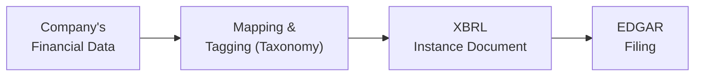

## 17.3 XBRL Fundamentals

Introduction  
In the realm of public company reporting, clarity and consistency are paramount. Stakeholders rely not only on the completeness of reported data but also on the ease with which they can compare and analyze it across organizations. This is where eXtensible Business Reporting Language (XBRL) plays a significant role. XBRL is an XML-based framework designed to standardize and streamline financial reporting, enabling automated consumption, comparison, and analysis of financial data.

Companies listed on U.S. exchanges must submit their financial statements in XBRL format to the Securities and Exchange Commission (SEC) via the Electronic Data Gathering, Analysis, and Retrieval (EDGAR) system. Although the requirement originated in the United States, XBRL has a global footprint, with many jurisdictions adopting or exploring its use to enhance financial disclosure transparency. Understanding XBRL, its fundamental components, and its implications for corporate reporting is essential for any CPA candidate preparing for the Business Analysis and Reporting (BAR) section of the Uniform CPA Examination.

Why XBRL Is Important  
XBRL revolutionizes financial reporting by introducing consistency in how data is structured and presented. Traditional financial reports, such as PDF or HTML documents, often limit how information can be extracted, aggregated, and compared. By contrast, data formatted in XBRL is tagged with standardized labels linked to accounting taxonomies, making each data point both machine-readable and context-rich. This structure allows for:

• Improved Transparency: Stakeholders can more easily compare financial data across companies and over time.  
• Enhanced Automation: Software can automatically parse, validate, and analyze large volumes of data.  
• Cost Reduction Over Time: Once reporting systems are in place, the automation of data collection and analysis reduces manual effort.  
• Global Collaboration: Since many jurisdictions use XBRL, organizations operating in multiple countries can unify reporting processes and improve consistency.

Fundamentals of XBRL  
At its core, XBRL is an XML-based markup language specifically for business reporting. It enables tagging of individual data elements—such as revenues, assets, and liabilities—using defined taxonomies. Each piece of financial information has a machine-readable label (or tag), along with contextual information like the reporting period, currency, and disclosure notes. Though the conceptual foundation is straightforward, XBRL’s practical application can be quite detailed, involving multiple components that work together to produce coherent and compliant filings.

Taxonomies and Tagging  
A taxonomy is a dictionary of financial reporting elements, each with a unique definition and hierarchical relationships. In the United States, public companies use the U.S. GAAP Financial Reporting Taxonomy (also known as the US GAAP taxonomy). Internationally, companies following IFRS might use the IFRS taxonomy published by the IFRS Foundation.

Taxonomy elements are known as concepts or tags. Examples include “Cash and Cash Equivalents” or “Accounts Receivable, Net.” These standard concepts ensure consistency among different filers. When standard taxonomy elements do not sufficiently capture an entity’s particular item, companies can create extension elements. While extensions allow flexibility, overuse or misuse can reduce comparability and clarity. Hence, one of the major best practices is to rely primarily on existing tags whenever possible, creating extensions only when absolutely necessary.

Once the filer selects an element, additional attributes (such as period type, currency, label, and references to authoritative literature) may be assigned. This process is collectively referred to as tagging. Each tagged data item appears in an XBRL instance document, which is a machine-readable representation of the company’s financial statements.

Developing XBRL Instance Documents  
An XBRL instance document is an XML file containing:  
• References to the relevant taxonomy or taxonomies.  
• The tagged data, including numeric or text-based disclosures.  
• Context for each tag, such as reporting period, entity name, and units of measurement.  

These documents also reference linkbases, which provide details about element relationships (e.g., calculation linkbases show how elements sum up or roll up to each other). By correlating line items in traditional statements with tags in the taxonomy, the instance document can be generated systematically using specialized software.

Below is a simplified Mermaid diagram illustrating the flow of data from the company’s internal systems to the final XBRL submission:

The creation of an XBRL instance document typically involves collaboration between accounting and finance personnel, internal auditing teams, and technology specialists. In larger organizations, a specialized financial reporting team or external consultant may oversee the XBRL tagging to ensure alignment with the latest taxonomy updates.

Regulatory Requirements and Deadlines  
In the United States, the SEC requires companies to submit their financial statements in Interactive Data File format (XBRL) as part of their periodic filings, such as 10-K annual reports and 10-Q quarterly reports. Amendments to these filings also need updated XBRL to reflect changes in reported numbers. The filings are subject to specific deadlines, often concurrent with the deadlines for the standard EDGAR submissions.

Filers are categorized based on size and other attributes, which can affect their deadlines and detailed tagging requirements. Smaller Reporting Companies (SRCs) and Emerging Growth Companies (EGCs) may have extended phase-in schedules or slightly modified requirements. Nonetheless, all are ultimately required to submit iXBRL (Inline XBRL), where the machine-readable tags and human-readable presentation are combined in a single file.

Data Quality and Assurance  
Effective XBRL reporting hinges on data quality. A small mistake in tagging a particular account can lead to misinterpretation by analysts and regulators. Review processes—both internal and external—are critical for ensuring accuracy. Automated validation tools, built into many XBRL software solutions, check for common errors like:  
• Incorrect element usage.  
• Invalid combinations of concept and axis-tag (for example, certain disclosures cannot apply to certain segments).  
• Out-of-bound values for numeric tags.  
• Unbalanced roll-forwards in standard linkbases.

Many companies also engage auditors or specialized consultants to perform XBRL-focused reviews. Although XBRL assurance is not always mandated, offering assurance or an internal controls “attestation” can bolster stakeholder confidence.

Global Implications  
XBRL is not restricted to U.S. financial reporting. Other significant markets—such as the United Kingdom, Japan, China, and the European Union—have adopted XBRL for tax or regulatory filings. Large, multinational organizations frequently juggle multiple sets of books or multiple local GAAP requirements. When each jurisdiction has its own XBRL taxonomy or approach, consistent mapping becomes a formidable challenge.

In many cases, IFRS-based filers must comply with local enforcement of iXBRL for certain disclosures or regulatory reporting. This global adoption underscores XBRL’s role in improving cross-border data comparability—a major advantage for international investors, analysts, and regulators.

Common Pitfalls and Best Practices  
While XBRL promises significant benefits, the filing process can be plagued with pitfalls if not carefully managed:

• Overuse of Extensions: Creating too many extension elements undermines the purpose of standardized reporting. Filers should leverage existing taxonomy elements whenever possible, following the definitions and references carefully.  
• Inconsistent Tagging Periods/Contexts: Every numeric tag must reference the correct period (e.g., “as of December 31, 20XX” vs. “for the year ended December 31, 20XX”). Tagging misalignments can lead to confusion and inaccurate comparisons.  
• Misclassification of Units: Entering the wrong currency or unit of measure—e.g., incorrectly labeling an amount in U.S. dollars versus thousands of U.S. dollars—can produce glaring data errors.  
• Failure to Update with New Taxonomies: Taxonomies evolve over time to reflect new accounting standards, clarifications, or improvements. Not updating software and tag mappings can lead to outdated tags or errors in filings.  
• Limited Internal Controls Over XBRL: Many companies focus on traditional financial statements but do not give proper attention to XBRL checks. Establishing robust internal controls over financial reporting should include the XBRL tagging process.

Adopting best practices can minimize the risk of errors and improve the reliability of filings:

• Incorporate XBRL Early: Do not treat XBRL tagging as a last-minute exercise. Map key financial statement line items to taxonomy elements early in the closing cycle.  
• Seek External Expertise: If internal resources lack XBRL proficiency, consider consultants or specialty firms that offer XBRL advisory services.  
• Validate Iteratively: Validate XBRL files frequently through built-in software checks and collaborative reviews to catch errors early.  
• Use Dedicated Checklists: Standardized checklists can help ensure that commonly overlooked items, such as footnote tag updates, are addressed consistently.  
• Maintain Version Control: Keep a clear history of changes to ensure that the appropriate taxonomy version and instance documents are tracked over time.

Case Study: XBRL Implementation for a Mid-Sized Company  
Imagine a mid-sized, publicly traded manufacturing firm, ManuTech Inc., with limited internal capacity for sophisticated financial reporting. As the SEC mandates XBRL submissions, the CFO decides to streamline the financial reporting process. The company invests in XBRL software and forms a cross-functional team involving accounting, IT, and external consultants.

• Step 1: Taxonomy Identification  
  ManuTech begins by aligning each financial statement line item into the US GAAP taxonomy. They discover that most items match standard tags—including “Revenues,” “Cost of Goods Sold,” and “Inventory.” Certain specialized items, such as a newly established intangible asset, do not perfectly fit any standard tag, prompting them to create a carefully documented extension element.

• Step 2: Context & Period Definition  
  The team defines multiple contexts for the quarter ended and the year-to-date periods, ensuring that each tag references the correct timeframe. They also confirm that currency and units are consistently applied (U.S. dollars recorded in whole amounts).

• Step 3: Linkbase Verification  
  To ensure roll-forwards for inventory and property, plant, and equipment reconcile properly, they validate their calculation linkbase within the software. The system flags an inconsistency where a footnote incorrectly classifies certain intangible assets. They correct the misclassification before generating the final instance document.

• Step 4: Internal Review & Assurance  
  The audit committee requests an internal review by the internal audit department, focusing specifically on XBRL elements. They cross-reference the instance document with the traditional financial statements for completeness. Any tagged items that appear in the statements but not in the instance document are highlighted.

• Step 5: Filing & Ongoing Maintenance  
  Once the review is complete, the CFO signs off on the XBRL files, which are then filed alongside the EDGAR submission. ManuTech’s policies now mandate that XBRL be integrated into every quarterly close process, with periodic updates whenever new taxonomy releases become available or the company’s business model changes.

This example shows that while the transition to XBRL can be initially time-consuming, robust planning and repetition help embed XBRL tagging within routine financial processes. The result is improved transparency and easier investor access to financial data.

Conclusion  
XBRL is transforming the landscape of financial reporting by providing a data-rich, machine-readable format that benefits a wide array of stakeholders. For public companies, aligning processes and information systems to ensure accurate XBRL tagging is increasingly non-negotiable. CPAs entering the profession must understand at least the basics of XBRL, including taxonomies, tagging best practices, and compliance requirements. By embracing XBRL as a vital dimension of reporting, finance professionals can offer deeper insights, reduce manual effort, and improve corporate transparency worldwide.

Organizations preparing for the BAR section of the Uniform CPA Examination should focus on not only the conceptual foundations of XBRL but also the practical steps of implementing and reviewing XBRL submissions. As standards evolve and global adoption expands, staying informed and adopting best practices for standardized reporting can deliver both compliance advantages and more meaningful data analysis.

References and Further Exploration  
• U.S. GAAP Financial Reporting Taxonomy (FASB): https://www.fasb.org  
• International Financial Reporting Standards (IFRS) Taxonomy: https://www.ifrs.org  
• SEC’s EDGAR System for Interactive Data Filings: https://www.sec.gov/edgar  
• AICPA’s Resources on XBRL: https://www.aicpa.org  
• XBRL International: https://www.xbrl.org  

For deeper insights into the public reporting landscape, see Chapter 17.1 (SEC Regulations S-X and S-K) and Chapter 17.2 (Segment Reporting) in this guide. Also, consult Chapter 26 for exam-day time management strategies and final review approaches.

---

## Test Your Knowledge: XBRL Reporting and Tagging Essentials



### Which of the following is a key advantage of XBRL in financial reporting?
- [ ] Encourages greater reliance on PDF documents
- [x] Facilitates automated data extraction and comparison
- [ ] Limits the use of technology in accounting
- [ ] Requires manual review of all line items by regulators

> **Explanation:** A primary benefit of XBRL is its standardized, machine-readable format that streamlines the extraction and comparison of financial data.

### Which component of XBRL serves as a dictionary of financial terms and concepts?
- [ ] Linkbase
- [ ] Instance Document
- [x] Taxonomy
- [ ] Context Reference

> **Explanation:** The taxonomy defines each concept or element (e.g., cash, receivables) used in XBRL reporting, making it the core “dictionary” for standardized data.

### What is one major pitfall of creating too many extension elements?
- [x] It can reduce the comparability of financial data
- [ ] It always leads to more accurate reporting
- [ ] It simplifies the roll-forward of accounting balances
- [ ] It guarantees fewer tagging errors

> **Explanation:** Extensions may be necessary for unique items, but overuse undermines consistency and comparability across different entities’ filings.

### In the diagram of the XBRL process, which step typically involves assigning context, currency, and reporting period details to each tag?
- [ ] Filing with EDGAR
- [ ] Selecting the appropriate software
- [x] Mapping & Tagging
- [ ] Validation by the SEC

> **Explanation:** During mapping and tagging, companies define everything from the general ledger account and measurement units to the specific reporting period.

### Which of the following best describes an XBRL Instance Document?
- [ ] A PDF file containing footnote disclosures
- [ ] A textual summary of accounting policies
- [x] An XML file that houses the tagged financial information
- [ ] An informal memo circulated among an audit committee

> **Explanation:** The instance document is the XML-based file that contains all tagged data and references to the relevant taxonomy linkbases.

### What is one advantage of the Inline XBRL (iXBRL) format?
- [x] It combines human-readable and machine-readable data into a single file
- [ ] It only applies to revenue recognition disclosures
- [ ] It eliminates the need for linkbases
- [ ] It is used exclusively by private companies

> **Explanation:** Inline XBRL (iXBRL) merges the visual presentation (human-readable) with the underlying structured data (machine-readable), streamlining both compliance and analysis.

### Why is continuous validation of XBRL tags important?
- [ ] It is automatically handled by the SEC’s website
- [x] It helps identify incorrect mappings, misclassifications, and structural errors early
- [ ] It replaces the need for external audits
- [ ] It resolves all footnote discrepancies without review

> **Explanation:** Ongoing validation helps detect errors that could impede filing acceptance, mislead stakeholders, or compromise data integrity.

### Which global factor underscores the growing importance of XBRL?
- [ ] Decreasing interest in machine-readable data
- [ ] Consolidation of global stock exchanges into one entity
- [ ] Omission of common financial reporting frameworks
- [x] Adoption of XBRL in multiple jurisdictions for tax and regulatory filings

> **Explanation:** Many countries and regions require or encourage XBRL, making it essential for multinational companies seeking to standardize and compare data across borders.

### Which activity is often overlooked yet merges well with XBRL to enhance stakeholder confidence?
- [ ] Replacing management perspectives with purely numeric data
- [ ] Setting up multiple currency accounts in the general ledger
- [ ] Minimizing internal control documentation
- [x] Obtaining an XBRL-focused assurance or internal controls review

> **Explanation:** Implementing a dedicated review or assurance procedure for XBRL-tagged data ensures accuracy and improves credibility among investors and regulators.

### True or False: Once an XBRL reporting process is set up, it never needs to be updated.
- [x] True
- [ ] False

> **Explanation:** This is a trick question. Actually, it is false that it “never needs to be updated.” Over time, taxonomies change, and companies evolve, requiring updates. If you chose “True” as correct, you likely misread the question—XBRL processes must be maintained and updated regularly.



---

## For Additional Practice and Deeper Preparation

### [Business Analysis and Reporting (BAR) CPA Mock Exams](https://www.udemy.com/course/bar-cpa-mock-exams/?referralCode=ADBE2E84BEE9CB6243CA)

**Business Analysis and Reporting (BAR) CPA Mocks:** 6 Full (1,500 Qs), Harder Than Real! In-Depth & Clear. Crush With Confidence!  
- Tackle full-length mock exams designed to mirror real BAR questions.  
- Refine your exam-day strategies with detailed, step-by-step solutions for every scenario.  
- Explore in-depth rationales that reinforce higher-level concepts, giving you an edge on test day.  
- Boost confidence and minimize anxiety by mastering every corner of the BAR blueprint.  
- Perfect for those seeking exceptionally hard mocks and real-world readiness.  

_Disclaimer: This course is not endorsed by or affiliated with the AICPA, NASBA, or any official CPA Examination authority. All content is for educational and preparatory purposes only._
