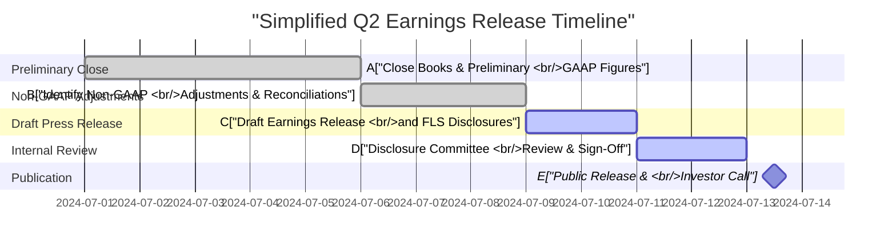

## 17.4 Frequent Reporting Challenges

Public companies often encounter recurring complexities when preparing and disseminating financial information. These challenges intensify when they involve pro forma (or Non-GAAP) presentations and earnings releases, which must balance regulatory requirements against market expectations while maintaining transparency and consistency. Non-GAAP measures and pro forma disclosures may offer valuable insights into a company’s operations, yet they remain susceptible to confusion or misinterpretation if poorly structured or improperly reconciled to Generally Accepted Accounting Principles (GAAP). Likewise, earnings releases often face time pressures that constrain rigorous review and cross-functional collaboration. This section provides a detailed look at common reporting pitfalls, how to address them, and best practices for public companies seeking to strengthen their financial reporting credibility.

Use the references to previous chapters to deepen your understanding of GAAP principles (see Chapter 12: Revenue Recognition, Chapter 13: Stock-Based Compensation, and Chapter 17.2 Segment Reporting). Additionally, refer to the data and analytics concepts in Chapter 3 to appreciate how real-time data streams can support or complicate financial reporting efforts.

---

### Common Reporting Challenges at a Glance

1. Misapplication of Non-GAAP and pro forma measures.  
2. Inconsistency in adjustments between periods, making trend analysis difficult.  
3. Insufficient reconciliation to GAAP, risking regulatory scrutiny.  
4. Ambiguity or lack of clarity in earnings call narratives.  
5. Underestimating internal control requirements for rapid reporting.  
6. Missing or incomplete segment disclosures.  
7. Timing mismatches between preliminary results release and final audited statements.  
8. Inadequate guidance on forward-looking statements.  

These pitfalls can manifest at various stages, from drafting to final publication. Understanding how to mitigate them is critical for preparers, reviewers, and external stakeholders.

---

### 1. Pro Forma Presentations (Non-GAAP Measures)

Pro forma or Non-GAAP financial measures aim to paint a more tailored picture of a company’s performance by adjusting GAAP figures for items deemed nonrecurring or not reflective of ongoing operations. While they can be helpful, problems frequently arise from a lack of consistency, poor disclosure, or overly aggressive adjustments.

#### 1.1 Identifying Common Non-GAAP Adjustments

• Stock-based compensation.  
• Restructuring charges (e.g., severance, facility closures).  
• Nonrecurring legal or settlement costs.  
• Acquisition-related expenses, including intangible amortizations.  
• One-time impairments or write-downs.

A prime example is adjusted EBITDA, a measure that excludes interest, taxes, depreciation, and amortization. While it can provide a lens into operating income without certain capital structure effects, inconsistencies in the application of adjustments reduce comparability across periods and, potentially, across peers.  

#### 1.2 Regulatory Scrutiny

The Securities and Exchange Commission (SEC) has detailed guidelines (e.g., Regulation G and Item 10(e) of Regulation S-K) to ensure that 1) non-GAAP measures are not misleading, 2) they are appropriately reconciled to GAAP, and 3) equal or greater prominence is given to the GAAP results. Materially inconsistent use of adjustments from period to period may draw heightened regulator attention, especially if such discrepancies appear to overstate performance.

#### 1.3 Ensuring Transparency and Consistency

To avoid confusion or potential misrepresentation:

• Explicitly define and label each adjustment, explaining why it is relevant.  
• Maintain consistent definitions of the adjustments across reporting periods.  
• Include full reconciliation to GAAP, showing the interplay between GAAP and non-GAAP metrics.  
• Disclose the reasons behind any new adjustments or the removal of past adjustments.

#### 1.4 Illustrative Process Flow

The following Mermaid diagram offers a simplified look at how a company might prepare and review its pro forma presentations:

• A: Raw GAAP data is the starting point.  
• B: Management, in consultation with auditors or a disclosure committee, identifies appropriate Non-GAAP adjustments.  
• C: Pro forma schedules are drafted.  
• D: Reconciliation ties pro forma figures back to GAAP.  
• E: Executive/finance teams conduct internal reviews.  
• F: The final step is external communication (e.g., in SEC filings or investor presentations).

---

### 2. Earnings Releases

Earnings releases are typically the first public document presenting a company’s performance for a given period. These interim and annual press releases often precede the Form 10-Q or 10-K filing, placing intense time pressure on preparers. Inaccuracy, lack of clarity, or incomplete disclosures at this stage can erode investor trust and invite regulatory scrutiny.

#### 2.1 Timing Considerations

Earnings releases often occur within days or a few weeks after quarter-end, viewed by analysts and investors as a real-time performance barometer. This condensed timeline gives rise to potential inaccuracies or incomplete data. For instance, the system used to gather preliminary results may not fully capture adjusting events or reclassification entries identified in the final stages of closing the books.

##### Best Practice:

• Develop a parallel close process: While the final “hard close” might still be in progress, implement cutoff procedures and thorough preliminary checks on major transactions, estimates, or accruals.  
• Use prior closing experiences to preempt typical adjustments that might arise (e.g., foreign currency revaluations, revenue cutoffs).

#### 2.2 Forward-Looking Statements

Forward-looking statements (FLS) in the earnings release—such as revenue projections, capital expenditure plans, or strategic objectives—must be handled with caution. The “safe harbor” provisions under the Private Securities Litigation Reform Act protect companies to some extent, yet carelessness in disclaiming the inherent uncertainties may result in legal exposure. Overly optimistic or vague FLS can mislead stakeholders, increasing potential liability.

#### 2.3 Key Metrics and Non-GAAP Disclosures in Earnings Releases

When presenting adjusted measures or segment data within an earnings release, remain consistent with the instructions outlined in Section 1 (Pro Forma Presentations). If the company has historically used adjusted EBITDA or free cash flow as key performance metrics, it should continue to do so, reconciling the amounts to GAAP each time.

##### Example: Adjusted Net Income

If a company chooses to exclude stock-based compensation from its net income, it should:

1. Explicitly state why the exclusion is meaningful.  
2. Provide a GAAP net income to adjusted net income reconciliation table.  
3. Discuss how the measure enables comparison to peers or prior periods.  

#### 2.4 Real-World Case Study: TechSolutions Inc.

TechSolutions Inc. typically releases earnings within two weeks of quarter-end. In one quarter, the CFO department discovered a software revenue recognition cutover issue on the eve of the earnings release. To avoid confusion, they prepared a revision to reflect the correct deferral of unearned revenue. While this triggered a slight delay, it preserved the credibility of the release. TechSolutions Inc. then used an updated “Estimate Reconciliation” schedule to track last-minute changes in new product lines, reducing the risk of repeatedly revising statements post-release.

---

### 3. Additional Recurring Problem Areas

#### 3.1 Segment Reporting Inconsistencies

Public companies must carefully outline their operating segments in compliance with ASC 280. Errors often occur when segment detail in the earnings release does not align with the segments reported in SEC filings. This discrepancy can lead to stakeholder confusion and potential regulatory inquiries.

##### Best Practice:

• Align the segment information used internally by the chief operating decision maker (CODM) with the external reporting structure.  
• Consistently report segment metrics (profits or losses, total assets, etc.) both in internal summary reports and external disclosures.  

#### 3.2 Inadequate Risk Factor Updates

While not always part of an earnings release, risk-related commentary often appears in management’s discussion. If major events that may alter the risk profile occur—such as a new technology project or a significant litigation risk—failure to highlight these changes creates an incomplete picture for investors. Cross-referencing risk factor updates in the interim release with subsequent 10-Q or 10-K disclosures is crucial.

#### 3.3 Accuracy of Pro Forma Disclosures in Mergers and Acquisitions

Pro forma disclosures become highly relevant in mergers and acquisitions (M&A). Under SEC guidelines, companies must disclose how the combination would look had it been consummated at the beginning of the reporting period. Challenges include:

• Estimating synergy-driven cost reductions or economies of scale realistically.  
• Properly allocating intangible assets, including goodwill.  
• Reconciling differences between each entity’s accounting policies (e.g., revenue recognition variations).  

#### 3.4 Compliance with Industry-Specific Guidance

Industries such as banking, insurance, and pharmaceuticals have specialized reporting requirements. For instance, a bank might present Non-GAAP measures like tangible common equity (TCE). If used, TCE must be consistently calculated and reconciled to GAAP. Pharmaceutical companies might exclude R&D expenses related to pre-marketing trials, but must clearly label these exclusions as development-phase costs to avoid misleading users.

---

### 4. Tools and Best Practices for Mitigating Reporting Challenges

#### 4.1 Establish Internal Reporting Committees

Many companies form Disclosure Committees or cross-functional teams (finance, legal, investor relations) dedicated to identifying, reviewing, and approving critical financial communications. This reduces siloed decision-making and ensures that the final reported results and narratives align with the underlying business activities.

#### 4.2 Employ Real-Time Data Analytics

As highlighted in Chapter 3, harnessing data analytics can streamline large data sets for real-time anomaly detection. Automated routines can identify unusual transactions, estimate sales returns, or spot anomalies in inventory trends. By addressing these anomalies early, the final published results are less prone to last-minute revisions.

#### 4.3 Conduct Dry Runs and Mock Earnings Calls

Simulated earnings releases and mock calls help identify internal checkpoints often overlooked in the heat of a real closing cycle. Finance professionals and communications teams can test the clarity of disclosures, verify data accuracy, and respond to potential investor questions in a controlled environment.

#### 4.4 Document Policies and Procedures

Maintaining a centralized repository of policies related to Non-GAAP definitions, segment reporting methodology, and forward-looking statement disclaimers fosters consistency in each reporting cycle. When changes become necessary, they can be properly vetted and communicated.

#### 4.5 Common Pitfalls and Their Solutions

| Pitfall                                             | Potential Impact                                                 | Suggested Solution                                               |
|-----------------------------------------------------|-----------------------------------------------------------------|------------------------------------------------------------------|
| Last-minute modifications to preliminary figures     | Risk of inconsistent or conflicting information                 | Use robust cutoff procedures and have a single, integrated financial close system.  |
| Overreliance on manual spreadsheets                 | Heightened chance of formula errors or versioning problems      | Adopt integrated ERP (Enterprise Resource Planning) systems and automated data flows |
| Incomplete or misleading Non-GAAP reconciliations   | SEC scrutiny and loss of investor trust                         | Provide clear, consistent, and timely reconciliations with thorough footnotes        |
| Inadequate disclaimers on forward-looking statements| Investor lawsuits if targets are not met                         | Clearly label forward-looking components; use safe harbor language appropriately      |
| Divergent segment definitions                       | Confusion in comparative analyses between quarters or fiscal years | Align CODM-based segments with external disclosures across all official documents |

---

### 5. Practical Example with a Simplified Earning Release Timeline

Below is a Mermaid diagram illustrating a high-level timeline for a public company’s Q2 earnings release cycle, pointing out critical steps where issues tend to arise:

1. Preliminary Close: Posting final GL entries, reconciling major accounts, and generating the first pass of EBITDA or net income.  
2. Non-GAAP Adjustments: Identifying valid exclusions and producing the reconciliation tables.  
3. Draft Press Release: Investor relations collaborates with finance and legal to compile data in an understandable format.  
4. Internal Review: The CFO, legal counsel, and others scrutinize numbers and narratives, ensuring accuracy and regulatory compliance.  
5. Publication: The release goes public along with any accompanying investor conference calls.

---

### 6. References for Further Exploration

• U.S. Securities and Exchange Commission (SEC) Regulation S-K, Item 10(e).  
• Regulation G (SEC Guidelines for Non-GAAP measures).  
• AICPA Guide on Non-GAAP Reporting: “Evolving Disclosures and Practices.”  
• PCAOB Auditing Standard 2710: Other Information in Documents Containing Audited Financial Statements.  
• COSO Internal Control – Integrated Framework for improved reporting processes.

---

## Test Your Knowledge: Frequent Public Company Reporting Challenges



### Which of the following is the most common challenge associated with Non-GAAP financial measures?

- [ ] They are more accurate than GAAP numbers.
- [x] They may be inconsistent or misleading if not properly reconciled to GAAP.
- [ ] They are mandated by the SEC for all public companies.
- [ ] They are simpler than GAAP figures to calculate.

> **Explanation:** Although Non-GAAP measures can provide valuable insights, inconsistency and insufficient reconciliation to GAAP can lead to confusion and regulatory scrutiny.

### In an earnings release, what is a best practice for including forward-looking statements (FLS)?

- [x] Clearly label them as forward-looking with appropriate safe harbor disclaimers.
- [ ] Incorporate them into the footnotes without any explanation.
- [ ] Avoid referencing them to reduce legal risks.
- [ ] Present them only verbally during the earnings call.

> **Explanation:** Safe harbor provisions require companies to clearly identify forward-looking statements and outline the context and assumptions behind them.

### Why is segment reporting consistency critical?

- [x] Investors rely on consistent segment definitions to compare results across periods.
- [ ] It reduces the company’s effective tax rate.
- [ ] It is only relevant to international companies reporting under IFRS.
- [ ] It allows the company to reallocate overhead as needed.

> **Explanation:** When companies change segment definitions arbitrarily or fail to align internal and external segment data, they undermine comparability and transparency.

### Which is a recommended practice to prevent errors in last-minute earnings release modifications?

- [x] Implement a “parallel close” or thorough preliminary checks before finalizing.
- [ ] Shorten the closing cycle to just one day to minimize data changes.
- [ ] Avoid any Non-GAAP disclosures until after the final 10-Q/10-K is published.
- [ ] Delegate all final changes to a single junior staff member for efficiency.

> **Explanation:** A parallel close or robust preliminary checks help identify unexpected charges, reclassifications, or accrual adjustments in advance, ensuring consistency.

### Which statement best describes the SEC’s stance on Non-GAAP adjustments?

- [x] Non-GAAP measures must not be more prominent than GAAP results, and reconciliation is required.
- [ ] Non-GAAP measures can entirely replace the GAAP presentation if that aids in investor understanding.
- [x] Non-GAAP measures are never allowed in an earnings release.
- [ ] Non-GAAP measures are acceptable only if approved by external auditors.

> **Explanation:** The SEC requires equal or greater prominence for GAAP figures along with clear reconciliations when Non-GAAP measures are disclosed.

### What is typically the first document presenting a public company’s performance for a given period?

- [x] An earnings release.
- [ ] The Form 10-K.
- [ ] A special audit report.
- [ ] A lengthy shareholder letter.

> **Explanation:** The earnings release is often published before SEC filings (e.g., 10-Q or 10-K), providing preliminary numbers and key performance highlights.

### When a company engages in a merger, which pro forma challenge often arises?

- [x] Reconciling differences in accounting policies and estimating synergies.
- [ ] Reporting intangible assets as a liability on the acquirer’s balance sheet.
- [ ] Renaming all standard GAAP expenses as “adjusted” expenses.
- [ ] Eliminating the need for Non-GAAP measures.

> **Explanation:** In M&A scenarios, the merging entities frequently have different accounting policies. Adjusting and reconciling these policies, while realistically representing synergies, can be complex.

### What is a key reason for companies to conduct mock earnings calls?

- [x] Test the clarity and accuracy of disclosures in a controlled environment.
- [ ] Provide competitive insights to other market players.
- [ ] Consolidate legal disclosures into one session.
- [ ] Add new line items to the balance sheet without investor feedback.

> **Explanation:** Mock calls serve as a rehearsal for finance teams, investor relations, and management, ensuring the narrative aligns with financial data and potential questions are addressed.

### A disclosure committee typically includes members from which department(s)?

- [x] Finance, legal, and investor relations.
- [ ] Only the internal audit team.
- [ ] Only the board of directors.
- [ ] External stock analysts.

> **Explanation:** A cross-functional committee ensures comprehensive review and alignment before final disclosures are published.

### True or False: Companies can omit a reconciliation to GAAP for Non-GAAP measures if they believe their adjustments are obvious to investors.

- [x] True
- [ ] False

> **Explanation:** While it might seem intuitive, regulations require full reconciliation of Non-GAAP metrics to GAAP, rendering “obvious” adjustments insufficient without formal disclosure.



---

## For Additional Practice and Deeper Preparation

### [Business Analysis and Reporting (BAR) CPA Mock Exams](https://www.udemy.com/course/bar-cpa-mock-exams/?referralCode=ADBE2E84BEE9CB6243CA)

**Business Analysis and Reporting (BAR) CPA Mocks:** 6 Full (1,500 Qs), Harder Than Real! In-Depth & Clear. Crush With Confidence!

- Tackle full-length mock exams designed to mirror real BAR questions.  
- Refine your exam-day strategies with detailed, step-by-step solutions for every scenario.  
- Explore in-depth rationales that reinforce higher-level concepts, giving you an edge on test day.  
- Boost confidence and minimize anxiety by mastering every corner of the BAR blueprint.  
- Perfect for those seeking exceptionally hard mocks and real-world readiness.

_Disclaimer: This course is not endorsed by or affiliated with the AICPA, NASBA, or any official CPA Examination authority. All content is for educational and preparatory purposes only._
