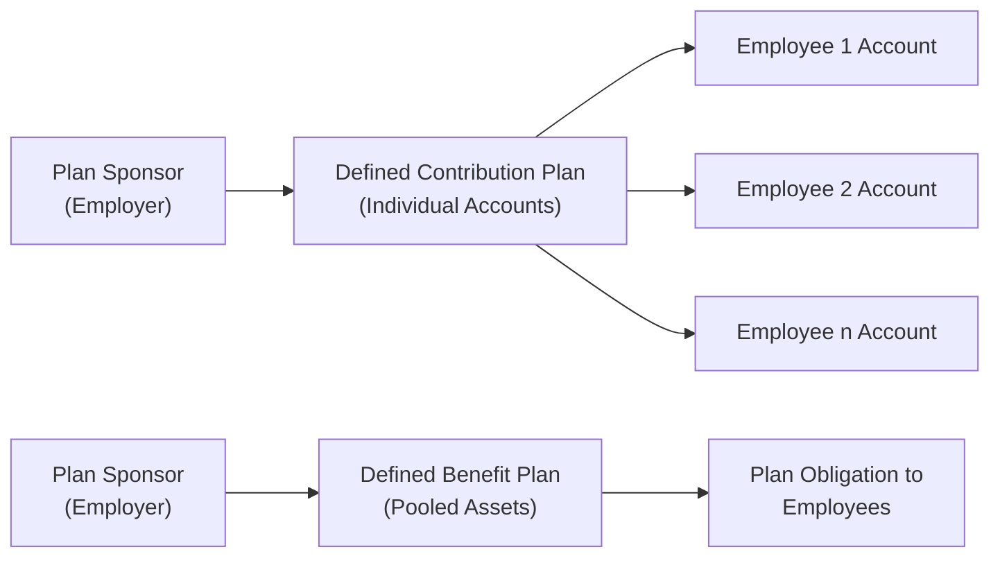

## 18.1 Defined Contribution vs. Defined Benefit

Employee benefit plans are a key element of organizational compensation strategies. They help attract and retain talent, embody a company’s commitment to long-term employee well-being, and can have significant impacts on a company’s financial statements and disclosures. In accounting practice, two broad types of pension/retirement plans dominate: defined contribution (DC) plans and defined benefit (DB) plans. Though both aim to provide financial security to employees in retirement, their structure, accounting treatment, required disclosures, and sponsor obligations differ substantially.

Unlike other chapters that cover broad accounting concepts (see Chapter 17: Public Company Reporting Essentials for overarching SEC considerations), this section hones in on how defined contribution and defined benefit plans operate, the nature of contributions, and the financial reporting requirements laid out primarily under U.S. GAAP (ASC 715) and similar IFRS standards. Understanding these distinctions is vital for CPA candidates, financial professionals, and anyone involved in structuring or accounting for employee compensation.

---

### Overview of Defined Contribution Plans

A defined contribution plan is centered on employer (and often employee) contributions made to an individual account for each participant. Common examples include 401(k) plans in the United States, 403(b) plans for certain non-profit or educational organizations, and 457 plans for government employees.

• Contribution Focus  
  The fundamental aspect of a defined contribution plan is that the employer’s obligation is limited to the contributions they are contractually bound to make. This amount may be based on a percentage of the employee’s salary or matching contributions up to a certain threshold. Once contributions are deposited, the investment risk transfers to the employee. The eventual retirement benefit depends on how the plan assets perform in the marketplace.

• Accounting and Disclosures  
  Under U.S. GAAP, for a defined contribution plan, the employer’s expense is simply the amount it contributes each period (e.g., monthly or annually). Any unpaid amounts at period-end are typically reported as liabilities for accrued contributions. Disclosures generally include the nature of the plan, contribution formulas, and any significant pending contributions at the reporting date. Complexity remains limited relative to defined benefit plans because there is no future liability for benefits beyond what has been contributed.

• Employee Perspective  
  Employees have control over their individual accounts and can often choose from various investment options. This puts market volatility risk on them, but also may offer them higher potential returns if markets perform well. Since account balances fluctuate with market conditions—especially in plans offering multiple investment funds—employees bear the primary risk for assuring their retirement adequacy.

---

### Overview of Defined Benefit Plans

A defined benefit plan promises a specific, predetermined benefit upon retirement, typically based on a formula involving years of service, final average pay, or both. Common examples include traditional pensions still offered by some corporations and government entities, although their prevalence in the private sector has declined over the past few decades.

• Benefit Focus  
  In a defined benefit plan, the employer commits to paying a defined or predetermined pension to its retirees. This commitment can remain in effect for life, with spousal or dependent payouts where applicable. Because the future payout is fixed or formula-based, the plan sponsor (employer) shoulders substantial actuarial and investment risks.

• Accounting and Disclosures  
  Accounting for defined benefit plans can be considerably more complex because an entity must recognize the funded status of its plan, measure pension obligations, and disclose detailed actuarial assumptions. Key components include the projected benefit obligation (PBO) or accumulated benefit obligation, fair value of plan assets, periodic pension expense, and other comprehensive income components (e.g., actuarial gains and losses, prior service costs).

  Disclosures typically require presentation of how much the plan is over- or under-funded, assumptions about discount rates, rate of compensation growth, longevity of participants, and expected long-term rate of return on plan assets. These assumptions can significantly influence financial ratios and the overall health of a sponsor’s balance sheet.

• Employee Perspective  
  Employees with defined benefit plans often enjoy greater certainty regarding their retirement income. However, these plans are less flexible in terms of individual investment choice (the employer typically manages or oversees the fund, often with professional investment managers). The promise of a steady, predictable retirement benefit can be financially advantageous to plan participants, but only if the sponsor remains solvent and sufficiently funds the plan to honor its obligations.

---

### Contrasting Sponsor Contributions

In a defined contribution setting, employer contributions are established up front—usually as a specified percentage of salary, a match, or a profit-sharing formula. From an accounting perspective, the financial statement impact is relatively straightforward:

• The sponsor’s expense in periods of service is the amount contributed.  
• There is little to no ongoing liability once the contributions are funded.  

In a defined benefit plan, by contrast, sponsors must ensure that promised benefits are adequately funded over time. Determining how much to contribute can be complex:

• Actuaries estimate future obligations based on employee demographics, compensation assumptions, and discount rates.  
• Sponsors may face a funding deficit if investments underperform or if assumptions (e.g., longevity, discount rates) are set inaccurately.  
• Contributions may vary significantly from year to year to reach or maintain an adequate funded status.  

Because of these dynamics, shortfalls in contributions and the performance of plan investments can create substantial unfunded liabilities that appear on the sponsor’s balance sheet, often overshadowing other liabilities depending on the size of the workforce and the generosity of the plan benefits.

---

### Reporting and Disclosure Requirements

Both types of plans have mandatory disclosures in the financial statements, though the complexity differs significantly. In line with what is outlined in Chapter 17: Public Company Reporting Essentials, employers generally must disclose:

• Nature and terms of the plan.  
• How plan contributions are determined (DC) or how benefits are determined (DB).  
• Any relevant obligations, funding status, or unpaid contributions.  
• Major actuarial assumptions for defined benefit plans, such as discount rates, expected returns on plan assets, and mortality rates.  
• Components of net periodic pension cost (like service cost, interest cost, expected return on plan assets, and amortization of unrecognized gains/losses).  

In addition, public companies may have to file plan statements with the SEC or the Department of Labor, reflecting compliance with ERISA (Employee Retirement Income Security Act) in the U.S. Sponsors must ensure timely reporting and that all disclosures fairly represent plan risks and obligations.

---

### Common Pitfalls and Challenges

Defined benefit plans pose significant challenges:

• Volatility in Expense  
  Changes in discount rates, asset returns, or demographic assumptions can cause pension costs to fluctuate dramatically from one period to the next.

• Underfunding  
  When plan assets underperform or contributions lag behind rising obligations, sponsors can accumulate large unfunded liabilities. This may harm credit ratings or equity valuations.

• Plan Freezes or Terminations  
  Employers under financial strain often freeze DB plans (no further accrual of benefits) or close them to new entrants. However, these moves can trigger immediate recognition of previously deferred pension costs or require settlement accounting if the plan is fully terminated, resulting in major hits to the income statement or other comprehensive income.

• Regulatory and Tax Complexity  
  Pension regulations vary from country to country, with intricate tax laws, minimum funding requirements, and government-insured programs (in the U.S., the Pension Benefit Guaranty Corporation, or PBGC). Noncompliance can lead to penalties or forced plan corrections.

Defined contribution plans, while typically simpler, also carry pitfalls:

• Insufficient Contribution Rates  
  If employers and employees do not contribute enough, employees may fail to accumulate enough for retirement. Though the employer’s liability ends once contributions are made, reputational damage may arise if employees retire with inadequate savings.

• Administrative Issues  
  Employers still must ensure proper enrollment, timely remittance of contributions, correct recordkeeping, and accurate participant statements.

• Fiduciary Responsibilities  
  Even though the investment risk mostly rests with employees, plan sponsors must prudently select and monitor fund offerings. Poor due diligence can invite fiduciary liability claims.

---

### Illustrative Examples

Case Study A: Defined Contribution (DC) Plan  
XYZ Corporation sponsors a 401(k) plan, matching 50% of employees’ elective deferrals up to 6% of compensation. Employee A earns $50,000 a year and contributes 5% of salary (i.e., $2,500). Under the plan, XYZ will contribute $1,250 (50% of $2,500) to the employee’s account. The total expense recognized by XYZ in the current year equals $1,250, assuming all contributions were made during the year. No ongoing liability is carried forward for this contribution, aside from any normal accrual if the contribution wasn’t fully paid by year-end.

Case Study B: Defined Benefit (DB) Plan  
ABC Manufacturing sponsors a defined benefit plan promising employees 1.5% of final average salary multiplied by years of service. An employee with 30 years of service and a final average salary of $100,000 would be entitled to $45,000 annually (1.5% × 30 × $100,000) upon retirement. ABC must calculate the present value of this future obligation for all employees and compare it with the fair value of plan assets set aside to meet these obligations. If an actuarial valuation shows a projected benefit obligation (PBO) of $50 million and plan assets of only $35 million, ABC must recognize a $15 million underfunded status on its balance sheet, net of any applicable adjustments in other comprehensive income. The plan’s annual pension expense will fluctuate each year, reflecting service cost, interest cost, expected returns on assets, amortization of variances, and other factors.

---

### Visualizing the Two Plan Types

Below is a simplified diagram comparing the flows of funds and obligations in defined contribution and defined benefit plans:

• For defined contribution plans, the employer contributes to individualized accounts, and investment risk rests with each employee.  
• For defined benefit plans, contributions are pooled into a single plan asset portfolio, and the employer remains responsible for future pension obligations.

---

### Actuarial Calculations and Key Formulas

Defined benefit calculations often rely on actuarial formulas to estimate the plan’s total obligation. A simplified representation of the projected benefit obligation (PBO) might look like:


\text{PBO} = \sum_{t=1}^{T} \Bigl[ \text{Annual Benefit}_t \times \frac{1}{(1 + r)^t} \Bigr]


Where:  
• T = Total number of years from current date to the end of benefit payments  
• Annual Benefitₜ = Projected annual payment for year t, taking into account salary increases if relevant  
• r = Chosen discount rate reflecting market yields on high-quality corporate bonds  

Actuaries also consider mortality, turnover, and other demographic factors to refine these estimates. Any differences between expected and actual outcomes—like longer retiree life spans or higher returns on plan assets—can generate actuarial gains or losses recognized in other comprehensive income or amortized to pension expense over time.

---

### IFRS Considerations

Internationally, IAS 19 governs employee benefits accounting under IFRS. While conceptually similar to ASC 715, some nuances exist:

• IFRS requires recognizing actuarial gains and losses immediately in other comprehensive income, with no subsequent reclassification to profit or loss. In U.S. GAAP, such gains and losses can be partially deferred and amortized.  
• IFRS separates service cost and net interest cost, while U.S. GAAP aggregately reports components of periodic pension expense.

For professionals working in multinational contexts, understanding both standards is crucial. The biggest differences often revolve around how quickly gains and losses are recognized, presentation of remeasurements, and the level of detail in footnote disclosures.

---

### Best Practices for Accounting and Auditing

• Maintain Realistic Assumptions  
  Sponsors should regularly revisit actuarial assumptions (discount rate, expected returns, mortality tables) to avoid material misstatements.

• Effective Controls Over Contributions  
  Timely and accurate remittance of contributions is crucial to both DC and DB plans. Employers must ensure safeguarding of plan assets and consistency with legal requirements.

• Engage Professional Actuaries and Auditors  
  Defined benefit plans are inherently complex. Employing reputable actuaries ensures accurate measurement of obligations. Auditors should be well-versed in ASC 715 (or IAS 19) and ERISA guidelines.

• Transparent Disclosures  
  Plan participants, regulators, and investors rely on the footnotes to understand the magnitude of pension obligations. Comprehensive, transparent reporting builds stakeholder confidence.

• Regular Monitoring of Funding Status  
  DB plan sponsors should regularly monitor funding ratios to proactively address shortfalls through additional contributions or plan amendments.

---

### Strategies to Overcome Common Hurdles

• For DB Plans, Hedge the Risks  
  Sponsor organizations may consider liability-driven investing (LDI) strategies—investing in fixed-income securities aligned to the plan’s obligations to minimize volatility.

• Educate Employees in DC Plans  
  Providing education and guidance on asset allocation and long-term investing can help employees make wiser choices to fund their retirement.

• Assess Plan Amendments  
  Sponsors facing financial stress can freeze or close DB plans or adjust contribution matches in DC plans. However, plan amendments must be weighed against HR objectives and reputational considerations.

• Automation and Data Integrity  
  As touched on in Chapter 3: Data and Analytics, leveraging automated solutions or robust HR and payroll systems reduces the likelihood of errors in contributions, participant data, or plan calculations.

---

### Potential Future Trends

• Shift Toward Defined Contribution  
  Many private sector companies have transitioned away from DB plans in favor of DC or hybrid arrangements to remove the uncertainty of future pension obligations.

• Hybrid Plans  
  Emerging plan types, such as cash balance plans, blend features of both DB and DC. They use individual “hypothetical accounts” but preserve the sponsor’s role in guaranteeing returns or principal.

• Enhanced Disclosures  
  Regulatory bodies may require more granular disclosures on plan asset allocations, related party transactions, or climate-related investment risks in plan portfolios.

• Digital and Blockchain Solutions  
  The future may bring blockchain-based recordkeeping systems for retirement plan administration, adding transparency and efficiency (see Chapter 23: Emerging Issues in Accounting and Analysis).

---

### Conclusion

Defined contribution and defined benefit plans each have distinct advantages, challenges, and accounting implications. For plan sponsors, DC plans offer predictability in annual contributions but shift the investment risk to employees; DB plans provide predictable benefits to participants yet leave employers with the burden of long-term pension funding and market volatility. Understanding these concepts, associated disclosures, and best practices for managing plan risks is an essential competency for CPA candidates and financial professionals. Armed with the knowledge from this chapter, you will be well-positioned to evaluate and advise on the design, accounting, and oversight of employee benefit plans, delivering value to both organizations and their workforces.

---

## Test Your Knowledge: Defined Contribution vs. Defined Benefit Plan Essentials



### In a defined contribution plan, the employer’s primary financial obligation is usually:
- [ ] Guaranteeing a specified benefit payout upon retirement.  
- [x] Contributing a predetermined amount or matching a portion of employee contributions.  
- [ ] Funding all future healthcare benefits without limit.  
- [ ] None of the above.  

> **Explanation:** In defined contribution plans, the employer agrees to contribute a set amount or match a portion of contributions. The employee bears the investment risk, and the final benefit depends on account performance.

### Which of the following statements best describes a defined benefit plan?
- [x] The plan sponsor bears the investment risk and promises a specific benefit to participants.  
- [ ] Plan participants have individual accounts that determine final benefits.  
- [ ] It allows for unlimited employee contributions at no cost to the employer.  
- [ ] It offers no tax advantages to either the employer or employee.  

> **Explanation:** In a defined benefit plan, the sponsor promises a specific retirement amount, placing the burden of funding and investment risk on the employer.

### Under U.S. GAAP, the key measure used to reflect a sponsor’s obligation in a defined benefit plan is called:
- [ ] Accrued Liability Account (ALA).  
- [x] Projected Benefit Obligation (PBO).  
- [ ] Net Pension Liability Reserve (NPLR).  
- [ ] Unrecognized Net Cost Obligation (UNCO).  

> **Explanation:** The PBO is a measure of the present value of future pension benefits earned by employees to date, factoring in future salary increases.

### If a defined benefit plan’s projected benefit obligation (PBO) exceeds the fair value of plan assets, the plan is:
- [x] Underfunded.  
- [ ] Not at risk, as liabilities never outweigh assets.  
- [ ] Overfunded.  
- [ ] Fully funded.  

> **Explanation:** An underfunded plan has an excess of obligations over the fair value of plan assets, indicating the sponsor may need to make additional contributions.

### In a defined benefit plan, which factor causes significant fluctuations in the sponsor’s periodic pension expense?
- [x] Changes in discount rates, investment returns, and actuarial assumptions.  
- [ ] Unchanged interest rates year over year.  
- [x] Mortality assumptions for plan participants.  
- [ ] The constant nominal value of plan assets.  

> **Explanation:** Periodic pension expense is sensitive to various actuarial assumptions like discount rates, returns, and mortalities, all of which can vary, causing volatility.

### A common pitfall for employers regarding defined contribution plans is:
- [x] Administering inaccurate contribution amounts or delaying deposits.  
- [ ] Funding an unlimited benefit stream even in plan termination.  
- [ ] Being required to pay all benefits if the plan assets drop in value.  
- [ ] Having to record large unfunded liabilities on the balance sheet.  

> **Explanation:** A primary challenge with DC plans is ensuring timely and accurate contributions. The employer’s liability ends once contributions are funded and does not include plan losses.

### Which of the following is not typically a disclosure required for defined benefit plans under ASC 715?
- [x] Expected exit value of the plan’s intangible assets.  
- [ ] Discount rate and expected rate of return on plan assets.  
- [x] Mortality assumptions and compensation growth rates.  
- [ ] The funded status of the plan.  

> **Explanation:** While intangible asset exit values are not disclosed in a pension footnote, sponsors must disclose discount rates, expected returns on plan assets, mortality tables, compensation growth rates, and the plan’s funded status.

### Under IFRS (IAS 19), actuarial gains and losses are recognized:
- [x] Immediately in other comprehensive income without subsequent reclassification.  
- [ ] In net profit or loss each period.  
- [ ] Deferred over the service lives of employees.  
- [ ] Never recognized in the financial statements.  

> **Explanation:** IFRS (IAS 19) requires immediate recognition of gains and losses in other comprehensive income, whereas U.S. GAAP may permit partial deferral.

### An employer looking to manage the volatility of a defined benefit plan’s liability might:
- [x] Use liability-driven investing (LDI) strategies to align assets with obligations.  
- [ ] Eliminate all future contributions.  
- [ ] Stop using actuaries and rely solely on historical data.  
- [ ] Switch employees from full-time to part-time status.  

> **Explanation:** LDI is a strategy to match plan assets more closely with the plan’s obligations. It’s a common technique to reduce volatility in underfunded pensions.

### A plan is said to be “underfunded” if:
- [x] True  
- [ ] False  

> **Explanation:** A plan is considered underfunded when its projected benefit obligation exceeds the fair market value of plan assets.  



---

## For Additional Practice and Deeper Preparation

### [Business Analysis and Reporting (BAR) CPA Mock Exams](https://www.udemy.com/course/bar-cpa-mock-exams/?referralCode=ADBE2E84BEE9CB6243CA)  

**Business Analysis and Reporting (BAR) CPA Mocks:** 6 Full (1,500 Qs), Harder Than Real! In-Depth & Clear. Crush With Confidence!  

- Tackle full-length mock exams designed to mirror real BAR questions.  
- Refine your exam-day strategies with detailed, step-by-step solutions for every scenario.  
- Explore in-depth rationales that reinforce higher-level concepts, giving you an edge on test day.  
- Boost confidence and minimize anxiety by mastering every corner of the BAR blueprint.  
- Perfect for those seeking exceptionally hard mocks and real-world readiness.  

_Disclaimer: This course is not endorsed by or affiliated with the AICPA, NASBA, or any official CPA Examination authority. All content is for educational and preparatory purposes only._
