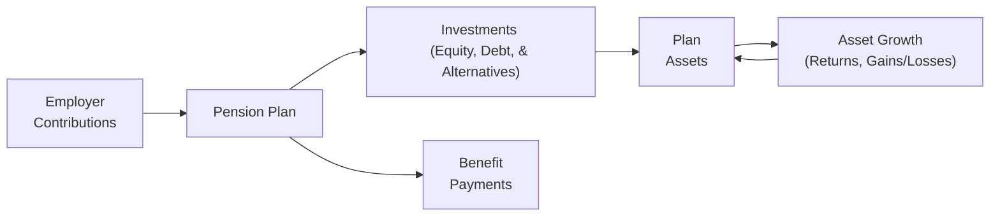

## 18.2 Plan Investments and Funding Status

Effective pension and other employee benefit plan management requires a thorough understanding of both plan investments and a plan’s funded status. These two areas determine not only the financial viability of the plan itself but also significantly impact an employer’s financial statements. This section delves into how employee benefit plans invest their assets, the factors that affect investment decisions, and the mechanics of calculating a plan’s funded status using the projected benefit obligation (PBO) and plan assets. In addition, we highlight best practices, common pitfalls, and professional standards that guide accountants and auditors in managing and reporting plan investments and funding statuses.

--------------------------------------------------------------------------------
### Overview of Plan Investments

Employee benefit plans—particularly defined benefit (DB) pension plans—pool contributions from employers (and sometimes employees) and invest them in various asset classes to meet future obligations. Plan fiduciaries aim to match the plan’s assets to its expected future liabilities, balancing risk and return over a long-term horizon.

#### Common Investment Vehicles

1. Equities (Stocks):  
   • Potential for higher returns over the long run.  
   • Subject to higher price volatility and market risk.  

2. Fixed Income (Bonds):  
   • Provide regular interest income and come with comparatively lower volatility.  
   • Prices fluctuate with changes in interest rates; credit risk can also be a factor.  

3. Cash and Cash Equivalents (Money Market Instruments):  
   • Offer liquidity and stability of principal.  
   • Generally, yield lower returns compared to equities and bonds.

4. Alternative Investments (Private Equity, Hedge Funds, Real Estate, Commodities):  
   • Aim to capture returns uncorrelated to public markets.  
   • Often illiquid, may have higher fees and complexity.  

5. Derivatives:  
   • Used for hedging interest rate, currency, or other market risks.  
   • Require thorough understanding of underlying exposures and accounting complexities.

#### Strategic Asset Allocation

Strategic asset allocation is integral to plan management. Fiduciaries align the plan’s long-term goals and risk tolerance with an appropriate mix of equity, fixed income, and alternative investments. This asset mix is typically revisited periodically to maintain target allocations (rebalancing) as market values shift.

Below is a conceptual flowchart showing the process of managing plan investments, from employer contributions to the eventual disbursement of benefits:

#### Valuation and Financial Reporting

• Plan assets are generally measured at fair value.  
• Gains or losses are recognized in a manner prescribed by relevant accounting standards (e.g., ASC 715 under U.S. GAAP, IAS 19 under IFRS).  
• Disclosures typically include the categories of invested assets, fair value hierarchy levels, and methods and assumptions used to estimate fair value.

--------------------------------------------------------------------------------
### Understanding the Funded Status of Defined Benefit Plans

The funded status of a defined benefit plan is a measure of whether the plan’s assets are sufficient to cover the present value of its future obligations. Under U.S. GAAP (ASC 715), companies must report a net pension asset (overfunded plan) or a net pension liability (underfunded plan) on the statement of financial position. A similar framework exists under IFRS (IAS 19), although presentation and classification can differ slightly.

#### Projected Benefit Obligation (PBO)

The projected benefit obligation (PBO) represents the actuarially determined present value of estimated future pension benefits that employees have earned to date, taking into account future salary increases. Key components of the PBO include:

1. Service Cost: The present value of new benefits earned by employees due to service in the current year.  
2. Interest Cost: The increase in the PBO due to the passage of time, measured by applying the discount rate to the prior period PBO.  
3. Actuarial Gains or Losses: Changes in assumptions (e.g., discount rates, pensionable salary growth, mortality rates) or differences between expected and actual experience can lead to adjustments.  
4. Benefits Paid: Payment of benefits to retirees reduces the PBO.  

#### Types of Benefit Obligations

While PBO is the most common measure for funding decisions, accounting standards also discuss:  
• Accumulated Benefit Obligation (ABO): Does not consider future salary increases.  
• Vested Benefit Obligation (VBO): Includes only the portion of the ABO where employees have a nonforfeitable right to benefits.

The PBO is generally the largest of these metrics, reflecting the ultimate plan obligation.

#### Calculating Funded Status

The net funded status is calculated as:

(Plan Assets at Fair Value) – (Pension Benefit Obligation (PBO)) = Funded Status  

An overfunded plan has a positive funded status (plan assets exceed the PBO), recorded as a net pension asset. An underfunded plan has a negative funded status (plan assets are less than the PBO), recorded as a net pension liability.

--------------------------------------------------------------------------------
### Illustration of Plan Asset, PBO, and Net Funded Status Calculations

To illustrate these concepts, consider the fictional Redwood Company, which sponsors a single-employer defined benefit pension plan.

#### Example: Plan Assets Rollforward

• Beginning fair value of plan assets (January 1): $1,000,000  
• Employer contributions during the year: $100,000  
• Actual return on plan assets: $70,000  
• Benefits paid to retirees: $60,000  

Computing the ending plan assets:

1) Start with beginning fair value of plan assets = $1,000,000  
2) Add employer contributions                =     100,000  
3) Add actual investment return              =      70,000  
4) Subtotal                                  =  1,170,000  
5) Less benefits paid                        =      60,000  
6) Ending fair value of plan assets          =  1,110,000  

#### Example: PBO Rollforward

• Beginning PBO (January 1): $1,200,000  
• Service cost: $80,000  
• Interest cost (assume a 5% discount rate): $60,000 (computed as 5% × $1,200,000)  
• Actuarial loss: $15,000 (due to revised mortality assumptions)  
• Benefits paid: $60,000  

Computing the ending PBO:

1) Start with beginning PBO        = $1,200,000  
2) Add service cost                =     80,000  
3) Add interest cost               =     60,000  
4) Add actuarial loss              =     15,000  
5) Subtotal                        =  1,355,000  
6) Less benefits paid              =     60,000  
7) Ending PBO                      =  1,295,000  

#### Example: Net Funded Status

Ending Plan Assets   = $1,110,000  
Ending PBO           = $1,295,000  

Net Funded Status = Plan Assets – PBO = $1,110,000 – $1,295,000 = –$185,000  

Because the plan’s funded status is negative (–$185,000), Redwood Company reports a net pension liability of $185,000 on its balance sheet (assuming no other reconciling items).

--------------------------------------------------------------------------------
### Impact on Financial Statements

#### Statement of Financial Position (Balance Sheet)

• Overfunded Plans: Report a net pension asset, limited to the realizable value per accounting standards (asset ceiling rules can apply under IFRS).  
• Underfunded Plans: Report a net pension liability.

#### Statement of Comprehensive Income (Income Statement)

• Service Cost: Reported in compensation expense.  
• Interest Cost: Reported in net periodic pension cost (although presentation can vary under IFRS vs. U.S. GAAP).  
• Actual vs. Expected Return on Plan Assets: Under U.S. GAAP, expected returns are recognized in net periodic pension cost; the difference between expected and actual returns contributes to actuarial gains/losses, part of other comprehensive income.  
• Actuarial Gains and Losses: Typically recognized through other comprehensive income (OCI), then amortized to pension expense in subsequent periods under U.S. GAAP. IFRS allows immediate recognition in OCI without subsequent reclassification (the “Remeasurements” approach).

#### Disclosures

• The basis of valuation of plan assets (fair value hierarchy).  
• Key assumptions (discount rates, expected return on plan assets, salary growth, mortality rates).  
• Breakdown of net periodic pension cost components (service cost, interest cost, etc.).  
• Sensitivity analysis for changes in assumptions (e.g., discount rate +/– 1%).

--------------------------------------------------------------------------------
### Best Practices and Common Pitfalls

• Engage Competent Actuaries and Investment Advisors: It is crucial for plan management to consult experts to determine assumptions and allocate investments efficiently.  
• Regularly Rebalance Investments: Market fluctuations can cause the plan’s portfolio to drift from target, increasing risk or reducing potential returns.  
• Thoroughly Document Assumptions: Changes in discount rates or mortality tables can have a material impact on PBO. Regulators and auditors often scrutinize these assumptions.  
• Monitor Liquidity Needs: Plans with an aging workforce and near-term benefits must ensure that sufficient liquid assets are available to meet obligations.  
• Beware of Inadequate Funding: Chronic underfunding risks the plan’s sustainability and may impair the sponsor’s financial flexibility.

--------------------------------------------------------------------------------
### Reconciling to Governmental and Nonprofit Plans
(Refer to Chapter 19 and Chapter 20 for Governmental Accounting)

Although the concepts behind funding status and investments are similar in governmental and certain nonprofit plans, GASB standards can differ from FASB ASC. Governmental plans often use different discount rates and incorporate specific reporting requirements in the Comprehensive Annual Financial Report (CAFR/ACFR). Individuals preparing or auditing government plans should carefully consult:

• GASB 67: Financial Reporting for Pension Plans  
• GASB 68: Accounting and Financial Reporting for Pensions (for employers)

--------------------------------------------------------------------------------
### Real-World Considerations

• Market Disruptions and Interest Rate Changes: Sudden changes can significantly alter both asset values and PBO.  
• Longevity Risk: Increased life expectancy leads to longer benefit payment durations.  
• Regulatory Changes: Legislative reforms may steer funding levels (e.g., minimum required contributions), asset allocations, or plan structure.

--------------------------------------------------------------------------------
### Additional References

• U.S. GAAP: ASC 715 Compensation—Retirement Benefits  
• IFRS: IAS 19 Employee Benefits  
• FASB Concepts Statement No. 8 for financial reporting objectives  
• GASB 67 & 68 for government pension standards  
• IASB Exposure Drafts for current developments

--------------------------------------------------------------------------------
### Conclusion

Plan investments and funding status together form a core foundation of pension and other employee benefit plan reporting. Understanding how to calculate plan assets, the PBO (or similar measures), and net funded status is crucial for making well-informed financial, strategic, and compliance-related decisions. By coupling robust measurement techniques with vigilant oversight of plan investments, accountants and auditors can help ensure that organizations maintain fiscally sound benefit arrangements for their employees.

By exploring the calculation examples and best practices outlined here, accounting and finance professionals will be well-equipped to manage and report on complex pension obligations. Familiarity with authoritative standards (ASC 715, IAS 19), a systematic approach to plan asset valuations, and careful monitoring of actuarial assumptions—especially discount rates—all play a vital role in achieving accurate and meaningful financial statements.

--------------------------------------------------------------------------------

## Test Your Knowledge: Plan Investments and Funding Status Exam Prep



### Which of the following statements best describes the projected benefit obligation (PBO)?

- [ ] It is the present value of benefits for only vested employees.  
- [x] It is the present value of future benefits, including projected salary increases.  
- [ ] It excludes actuarial gains or losses.  
- [ ] It only considers accumulated benefits without salary progression.  

> **Explanation:** The PBO includes the present value of all benefits earned to date, factoring in future salary increases and relevant actuarial assumptions, making it more comprehensive than the ABO or VBO.

### What happens when the plan’s fair value of assets exceeds the projected benefit obligation?

- [x] The plan is considered overfunded, and the employer reports a net pension asset.  
- [ ] The plan is underfunded, and the employer reports a net pension liability.  
- [ ] There is no need for any reporting.  
- [ ] The plan sponsor must immediately fund the excess amount.  

> **Explanation:** If fair value of plan assets > PBO, the plan is overfunded, typically resulting in a net pension asset on the employer’s balance sheet.

### How is the net funded status of a defined benefit pension plan determined?

- [ ] PBO minus total employer contributions since inception.  
- [x] Fair value of plan assets minus PBO.  
- [ ] Total benefit payments minus service cost.  
- [ ] Fair value of plan assets plus ABO.  

> **Explanation:** Net funded status = Plan assets at fair value – PBO (under U.S. GAAP). A positive outcome (assets > PBO) means overfunded, while a negative result indicates underfunded.

### Which of the following is a key component in the annual change of the PBO?

- [ ] Dividends on common stock held by the plan.  
- [x] Interest cost based on the discount rate and prior period PBO.  
- [ ] Plan administrative fees.  
- [ ] Amortization of transition assets.  

> **Explanation:** Each year, the PBO increases by an interest component, calculated by multiplying the discount rate by the beginning balance of the PBO.

### In a plan assets rollforward, which item reduces the ending balance of plan assets?

- [ ] Employer contributions.  
- [x] Benefits paid.  
- [ ] Investment return.  
- [x] Actuarial assumptions on investment returns.  

> **Explanation:** Benefits paid decrease plan assets, while contributions and investment returns increase plan assets. Although “actuarial assumptions on investment returns” do not directly reduce plan assets, the difference between expected and actual investment return can affect recognized pension costs or recordable remeasurements.

### From an accounting perspective, how are plan assets generally measured?

- [x] At fair value, subject to certain disclosure requirements.  
- [ ] At historical cost, including accumulated depreciation.  
- [ ] At amortized cost, net of anticipated inflation.  
- [ ] At the average cost for the fiscal year.  

> **Explanation:** Plan assets are typically reported at fair value, with disclosures detailing methodologies, assumptions, and levels of the fair value hierarchy.

### Which statement about actuarial assumptions is correct?

- [x] They significantly impact the PBO and should be periodically reviewed.  
- [ ] They have no effect on pension liability.  
- [ ] Discount rates must remain constant each year.  
- [x] Mortality assumptions can alter projected benefit payouts.  

> **Explanation:** Because PBO depends on factors like discount rates, mortality tables, and projected salaries, changes to any of these assumptions can meaningfully shift a plan’s obligations.

### What is one common pitfall related to pension plan asset allocation?

- [x] Failing to rebalance when market values shift significantly.  
- [ ] Overcommunicating performance to plan participants.  
- [ ] Maintaining too high a stake in government bonds.  
- [ ] Using professional fund managers.  

> **Explanation:** A major pitfall is allowing the plan’s asset mix to drift from targets for prolonged periods, exposing the plan to mismatched risk or reduced returns.

### Under U.S. GAAP, where are actuarial gains and losses generally recognized?

- [x] In other comprehensive income, subject to amortization.  
- [ ] Fully expensed immediately in net income.  
- [ ] Recorded as a reduction of retained earnings.  
- [ ] In a contra-asset account on the balance sheet.  

> **Explanation:** Actuarial gains and losses typically flow through other comprehensive income under ASC 715, with subsequent amortization to net periodic pension cost.

### A plan’s funded status is positive. True or False: This guarantees that the plan has no future need for employer contributions.

- [x] True  
- [ ] False  

> **Explanation:** A positive funded status may reduce future contributions, but shifting economic conditions, changes in assumptions, and regulatory requirements can still necessitate ongoing funding.



--------------------------------------------------------------------------------

## For Additional Practice and Deeper Preparation

### [Business Analysis and Reporting (BAR) CPA Mock Exams](https://www.udemy.com/course/bar-cpa-mock-exams/?referralCode=ADBE2E84BEE9CB6243CA)  

**Business Analysis and Reporting (BAR) CPA Mocks:** 6 Full (1,500 Qs), Harder Than Real! In-Depth & Clear. Crush With Confidence!

- Tackle full-length mock exams designed to mirror real BAR questions.  
- Refine your exam-day strategies with detailed, step-by-step solutions for every scenario.  
- Explore in-depth rationales that reinforce higher-level concepts, giving you an edge on test day.  
- Boost confidence and minimize anxiety by mastering every corner of the BAR blueprint.  
- Perfect for those seeking exceptionally hard mocks and real-world readiness.  

_Disclaimer: This course is not endorsed by or affiliated with the AICPA, NASBA, or any official CPA Examination authority. All content is for educational and preparatory purposes only._
