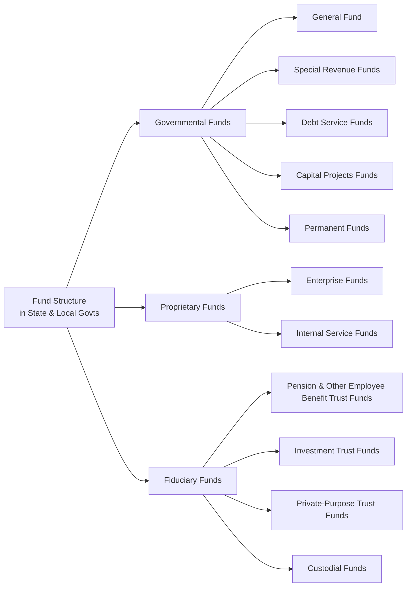

## 19.1 Fund Structures and Purposes

In state and local government accounting, “funds” serve as critical building blocks that uphold financial accountability, resource tracking, and compliance with laws and regulations. A fund is essentially a self-balancing set of accounts segregated for a particular purpose. By classifying transactions and resources into distinct funds, governments can demonstrate how money is collected, spent, and managed for specific public functions.

This section explores the three major categories of funds—Governmental, Proprietary, and Fiduciary—and illustrates how each type meets overarching accountability objectives. You will also learn about the unique measurement focus and basis of accounting used for each fund, practical insights for exam success, and case study examples.

--------------------------------------------------------------------------------

### Defining a Fund

A fund is more than just a budget line-item or an account. It is an accounting and fiscal entity that maintains a set of records reflecting cash and other financial resources, related liabilities, and changes therein. Governments create multiple funds to demonstrate accountability for various public services, restricted resources, and legal or contractual obligations.

Key reasons to establish separate funds include:
• Legal mandates, where statutes or grantors require special tracking.  
• Operational or managerial needs, where distinct activities such as utilities must be financially self-sufficient.  
• Enhanced transparency, which enables users of financial statements to see how specific resources are obtained and used.  

--------------------------------------------------------------------------------

### Overview of Major Fund Categories

Funds in state and local government accounting can be broadly separated into three categories:

• Governmental Funds  
• Proprietary Funds  
• Fiduciary Funds  

While the next chapters (especially Chapters 20, 21, and 22) will address detailed reporting aspects, it is essential to fully understand each fund’s structure and purpose before diving into conversion, reconciliation, and special transactions. Below is an illustrative diagram highlighting how these three primary fund types relate within a government’s overall accounting framework.

Each fund category uses specific accounting approaches and measurement focuses designed to convey the most relevant financial information for its purpose.

--------------------------------------------------------------------------------

### Governmental Funds

Governmental funds account for the core public services that a government provides, typically financed by taxes, fees, intergovernmental revenues (such as grants), and other general receipts. They emphasize **accountability for current financial resources**, focusing on how resources flow in and out within a short-term fiscal period.

#### Types of Governmental Funds

• General Fund:  
  The main operating fund of the government, covering basic services like public safety, administration, and parks. It accounts for unrestricted resources and finances day-to-day operations not required to be reported in another fund.

• Special Revenue Funds:  
  Used to account for proceeds of specific revenue sources that are legally restricted or committed for particular purposes. Examples include dedicated sales tax funds allocated to road repairs or a fund that tracks revenues and expenditures for a municipal library.

• Debt Service Funds:  
  Account for the accumulation of resources used to repay principal and interest on general long-term debt. By concentrating debt payments in a single fund, the government can clearly demonstrate compliance with debt covenants and ensure timely servicing of obligations.

• Capital Projects Funds:  
  Track financial resources earmarked for the construction or acquisition of major capital assets—bridges, schools, parks, or other infrastructure. These funds allow stakeholders to follow large-scale project spending through specific phases or budgets.

• Permanent Funds:  
  Used to report resources legally restricted such that only earnings (not principal) can be utilized for programs. For instance, a public cemetery maintenance trust might be classified as a permanent fund when only investment income may be spent.

#### Measurement Focus and Basis of Accounting

Most governmental funds use a **current financial resources measurement focus** and the **modified accrual basis** of accounting. Under this method, revenues are recognized when they become both measurable and available, and expenditures are recorded when the related liability is incurred (with some exceptions).

#### Accountability Objectives

• Budgetary Compliance: Governmental funds often incorporate legally adopted budgets, ensuring that expenditures do not exceed appropriations.  
• Transparency: By segregating resources for specific public programs, governments provide clarity on how taxpayer dollars are allocated and used.  
• Stakeholder Confidence: Citizens, legislative bodies, and oversight agencies rely on properly reported governmental fund information to assess the performance and financial standing of public services.

--------------------------------------------------------------------------------

### Proprietary Funds

Proprietary funds account for government operations that operate similarly to private businesses. They typically generate revenues through user charges and fees, supporting services such as utilities, public transportation, airports, or water treatment.

Two primary proprietary fund types exist:

• Enterprise Funds:  
  Used for activities in which the public is the primary user (e.g., water, sewer, electricity, or a municipal golf course). Enterprise funds aim to be self-sustaining. They often charge user fees sufficient to cover operating, capital, and debt-related costs.

• Internal Service Funds:  
  Account for services provided primarily to other departments or agencies of the same government or occasionally other governments, on a cost-reimbursement basis. Examples include a central motor pool or a self-insurance program for employee health benefits. By centralizing certain services, governments eliminate redundancies, reduce costs, and improve oversight.

#### Measurement Focus and Basis of Accounting

Proprietary funds apply a **full accrual** basis of accounting and an **economic resources measurement focus**, recording transactions like a for-profit organization would. This means:

• Revenues are recognized when earned.  
• Expenses are recognized when incurred.  
• Long-term assets and liabilities are tracked on the balance sheet.  

A proprietary fund’s financial statements typically include a statement of net position, statement of revenues, expenses, and changes in net position, and a statement of cash flows—mirroring private-sector financial reporting.

#### Accountability Objectives

• Operational Efficiency: By recording depreciation and other long-term items, proprietary funds reflect the full cost of production, providing insight for rate-setting and cost control.  
• Self-Sustainability: Enterprise funds, in particular, should demonstrate that user fees support operations without undue reliance on taxpayer subsidies.  
• Intra-Governmental Transparency: Internal service funds highlight internal costs between government departments, ensuring equitable resource allocation and identifying cost-saving opportunities.

--------------------------------------------------------------------------------

### Fiduciary Funds

Fiduciary funds account for resources a government holds in a trustee or custodial capacity for external parties—individuals, organizations, or other governments. Although reported in separate fund financial statements, these resources are beneficial to external entities, not the government’s own use.

Fiduciary funds include:

• Pension (and Other Employee Benefit) Trust Funds:  
  Track resources used to pay pension or OPEB (Other Post-Employment Benefits) obligations to government employees. The government acts as a fiduciary by managing these assets and disclosing the plan’s financial position.

• Investment Trust Funds:  
  Manage pooled investments for multiple government entities, such as counties pooling municipal cash. Each participating government’s share in the investment is tracked to ensure equitable returns and accountability.

• Private-Purpose Trust Funds:  
  Assets held in trust for individuals, private organizations, or other governments that do not meet the criteria of pension or investment trust funds. A scholarship fund for students may be a private-purpose trust if the government invests or administers the funds but does not benefit from them.

• Custodial Funds (formerly Agency Funds):  
  Primarily used for resources held temporarily. For instance, a county government may collect property taxes on behalf of local school districts and hold the funds before remitting them. Custodial funds do not typically involve complex trust arrangements; they simply pass resources along.

#### Measurement Focus and Basis of Accounting

Fiduciary funds use the full accrual basis of accounting and economic resources measurement focus, much like proprietary funds. However, fiduciary fund revenues, expenses, and net position belong to external entities (beneficiaries), so governments must disclose these activities separately.

#### Accountability Objectives

• Stewardship of Assets: Governments must show they are safeguarding and managing fiduciary resources for other parties effectively.  
• Compliance with Legal & Contractual Obligations: Pension trust administration, for example, demands strict fiduciary oversight, adherence to investment guidelines, and timely benefit payments.  
• Transparent Reporting: Fiduciary fund statements enable external stakeholders (retirees, investors, beneficiaries) to monitor financial health and governance integrity.

--------------------------------------------------------------------------------

### Comparing Fund Types and Their Purposes

Although all funds serve accountability objectives, each fund category implements distinct measurement focuses and bases of accounting. The table below highlights fundamental differences:

| Fund Type    | Measurement Focus                   | Basis of Accounting | Purpose & Activities                                                                  |
|--------------|-------------------------------------|---------------------|---------------------------------------------------------------------------------------|
| Governmental | Current Financial Resources         | Modified Accrual    | Accounts for core public services and daily operations financed predominantly by taxes|
| Proprietary  | Economic Resources                  | Accrual             | Captures business-like activities financed by user fees                               |
| Fiduciary    | Economic Resources                  | Accrual             | Manages resources held for others in a trust or custodial capacity                   |

By allocating transactions to the correct fund, governments produce financial reports that illuminate compliance, performance, and fiscal health across multiple dimensions.

--------------------------------------------------------------------------------

### Practical and Real-World Examples

1. City Operating and Capital Activities (Governmental Funds)  
   A mid-sized city obtains revenues through property taxes and state-shared revenues. Its General Fund covers police patrols, fire protection, and administrative services. The city also uses a Capital Projects Fund to finance construction of a new city hall. Stakeholders can see exactly how tax dollars are reallocated from general uses to a capital project over time.

2. Water Utility Operations (Proprietary Funds)  
   A county water utility, structured as an Enterprise Fund, charges residents based on water usage. Over time, the county accumulates sufficient net position to finance system upgrades. Because the fund operates on full accrual accounting, it reports depreciation of water distribution equipment, providing important data for future rate-setting and capital planning.

3. Retirement Benefits (Fiduciary Funds)  
   A school district administers a pension trust for its teaching staff. Although the district is legally responsible for pension oversight, these assets do not appear in the district’s governmental activities. Instead, they appear in separate fiduciary statements, allowing plan beneficiaries and oversight bodies to assess how well the district is safeguarding and investing retirement assets.

--------------------------------------------------------------------------------

### Importance of Fund Structures for Accountability

Fund structures spotlight the government’s stewardship responsibilities by:

• Demonstrating Legal Compliance: Segregating resources in distinct funds ensures that restricted monies are not spent on unrelated projects.  
• Facilitating Budget Control: By comparing budgeted versus actual expenditures in separate funds, governments can more easily identify overages or inefficiencies.  
• Reinforcing Trust: When citizens, regulators, and creditors see precise reporting across specific funds, they gain confidence that public funds are spent responsibly.

--------------------------------------------------------------------------------

### Best Practices and Common Pitfalls

Below are guidelines and cautionary notes for CPAs, accountants, and students:

• Ensure Proper Fund Classification: A frequent error is classifying activities in the General Fund when a specific Special Revenue Fund or Debt Service Fund is required by law or policy.  
• Integrate Budgets Properly: Governmental funds often connect closely with annual budgets. Keep track of encumbrances and appropriations to maintain budgetary compliance.  
• Avoid Overfragmentation: Too many funds may reduce clarity. Funds should be established only when legally or operationally necessary to maintain accountability.  
• Consolidate Internal Service Funds with Government-Wide Statements: When performing government-wide reporting, remember that most internal service fund activity is reported with governmental activities, based on the nature of customers.  
• Fiduciary Fund Footnotes: Fiduciary activities can be overlooked or underreported, resulting in confusion for pension beneficiaries or regulatory bodies. Clear, consistent disclosures are paramount.

--------------------------------------------------------------------------------

### Strategies for Exam Readiness

• Focus on the Measurement Focus & Basis of Accounting: Understand what “current financial resources” (modified accrual) vs. “economic resources” (accrual) truly represent.  
• Memorize Key Fund Types and Their Purposes: The CPA Exam often tests the basic definitions and best-fit fund classifications.  
• Practice Fund Accounting Scenarios: Work through exercises that classify transactions—e.g., taxes for general use, operating a public utility, or managing a pension.  
• Integrate with Budgetary Concepts: Expect exam questions linking budgeting and fund structures, especially for Governmental Funds.  

--------------------------------------------------------------------------------

### Quick Case Study: Town of Pine Creek

Scenario: The Town of Pine Creek, a small municipality, has an upcoming budget cycle. Town officials need to construct a new library wing, maintain utilities (water and sewer), and ensure teachers’ pension assets remain stable.

• The new library wing is financed by a dedicated sales tax that must be used for this purpose. Hence, the town sets up a thorough Capital Projects Fund to show the inflow (sales tax) and outflows (construction expenditures).  
• Pine Creek’s Natural Resources Department charges fees for water usage, marking it as an Enterprise Fund (Proprietary). Depreciation of utility facilities is tracked to highlight future upgrade needs.  
• The local teachers’ pension assets, although administered by the town, are recorded in a separate Pension Trust Fund (Fiduciary). Pine Creek reports net position, additions, and deductions related to the pension trust in separate fiduciary statements.  

At year-end, Pine Creek’s financial statements no longer lump all transactions together; each fund stands on its own, clarifying accountability and aligning with legal and regulatory standards.

--------------------------------------------------------------------------------

### References and Further Reading

• Governmental Accounting Standards Board (GASB) Statements, especially GASB 34 and GASB 54.  
• “Governmental Accounting, Auditing, and Financial Reporting” (GFOA’s Blue Book).  
• AICPA Governmental Audit Quality Center resources (member-only).  
• [Government Finance Officers Association](https://www.gfoa.org/) (GFOA) best practices papers.  
• State-level Department of Finance or Treasury publications, offering single-state implementation guides.

--------------------------------------------------------------------------------

## Mastering Governmental Fund Structures: 10-Point Quiz on Accountability



### Which of the following fund categories typically uses the modified accrual basis of accounting?

- [ ] Proprietary
- [x] Governmental
- [ ] Fiduciary
- [ ] None of the above

> **Explanation:** Governmental funds follow the modified accrual basis, focusing on current financial resources. Proprietary and Fiduciary funds use accrual accounting.

### Which type of governmental fund is primarily used to account for major construction or acquisition of capital facilities?

- [ ] General Fund
- [x] Capital Projects Fund
- [ ] Special Revenue Fund
- [ ] Debt Service Fund

> **Explanation:** Capital Projects Funds track the financial resources designated for significant capital projects such as building roads, schools, or public buildings.

### The government operates a central garage for vehicle maintenance, charging other government departments based on usage. Which fund should be used to account for these activities?

- [ ] General Fund
- [ ] Special Revenue Fund
- [x] Internal Service Fund
- [ ] Private-Purpose Trust Fund

> **Explanation:** Since the service is provided primarily to other government units and reimbursed via service charges, an Internal Service Fund (a Proprietary fund) applies.

### Fiduciary funds:

- [x] Account for resources a government holds in trust or as a custodian for external parties
- [ ] Are consolidated with government-wide statements as part of governmental activities
- [ ] Operate under the modified accrual basis of accounting
- [ ] Must always generate profits for the benefiting parties

> **Explanation:** Fiduciary funds hold assets on behalf of others and use the accrual basis. They are not consolidated within the entity’s government-wide financial activities because the resources do not belong to the government.

### In which scenario would an Investment Trust Fund be most appropriate?

- [x] When the government pools and invests the resources of multiple external entities
- [ ] When the government invests only its General Fund surplus
- [ ] When it accounts for pension obligations
- [ ] When it runs business-like services like a public utility

> **Explanation:** Investment Trust Funds are used for pooled investments of external participants. Pension obligations are handled by Pension (and Other Employee Benefit) Trust Funds, and utilities are usually enterprise funds.

### Governmental funds emphasize:

- [x] Current financial resources
- [ ] Economic resources
- [ ] Internal rate of return
- [ ] Proprietary constraints

> **Explanation:** Governmental funds use the current financial resources measurement focus, concentrating on near-term inflows and outflows of resources.

### Which statement is true about Enterprise Funds?

- [x] They are intended to be self-supporting through user charges.
- [ ] They always require tax subsidies to function.
- [x] They record depreciation and report net position on the balance sheet.
- [ ] They use modified accrual basis only during budget cycles.

> **Explanation:** Enterprise Funds handle full accrual accounting, similar to private-sector businesses, with the goal of self-sustainability through user charges.

### The basis of accounting used by fiduciary funds is:

- [x] Accrual
- [ ] Modified accrual
- [ ] Cash basis
- [ ] Special-purpose basis

> **Explanation:** Fiduciary funds use the accrual basis, focusing on the economic resources measurement approach.

### Which best describes the General Fund?

- [x] The primary operating fund that accounts for all financial resources not required to be reported in other funds
- [ ] A fund set up for a specific revenue source restricted by law
- [ ] A fund dedicated to building or acquiring major capital assets
- [ ] A fund used to plan for and accumulate resources for paying interest and principal on long-term general obligations

> **Explanation:** The General Fund captures unrestricted governmental activities that do not logically or legally fit under other specific funds.

### Governmental fund accounting helps ensure that revenues earmarked for specific purposes, like road repairs, are used only for those specific purposes.

- [x] True
- [ ] False

> **Explanation:** The use of Special Revenue and other dedicated funds ensures that legally restricted revenue streams are spent in compliance with the limitations imposed by law or donor requirements.



--------------------------------------------------------------------------------

## For Additional Practice and Deeper Preparation

### [Business Analysis and Reporting (BAR) CPA Mock Exams](https://www.udemy.com/course/bar-cpa-mock-exams/?referralCode=ADBE2E84BEE9CB6243CA)  

**Business Analysis and Reporting (BAR) CPA Mocks:** 6 Full (1,500 Qs), Harder Than Real! In-Depth & Clear. Crush With Confidence!

- Tackle full-length mock exams designed to mirror real BAR questions.  
- Refine your exam-day strategies with detailed, step-by-step solutions for every scenario.  
- Explore in-depth rationales that reinforce higher-level concepts, giving you an edge on test day.  
- Boost confidence and minimize anxiety by mastering every corner of the BAR blueprint.  
- Perfect for those seeking exceptionally hard mocks and real-world readiness.  

_Disclaimer: This course is not endorsed by or affiliated with the AICPA, NASBA, or any official CPA Examination authority. All content is for educational and preparatory purposes only._
