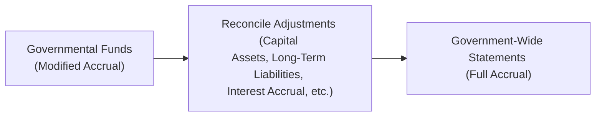
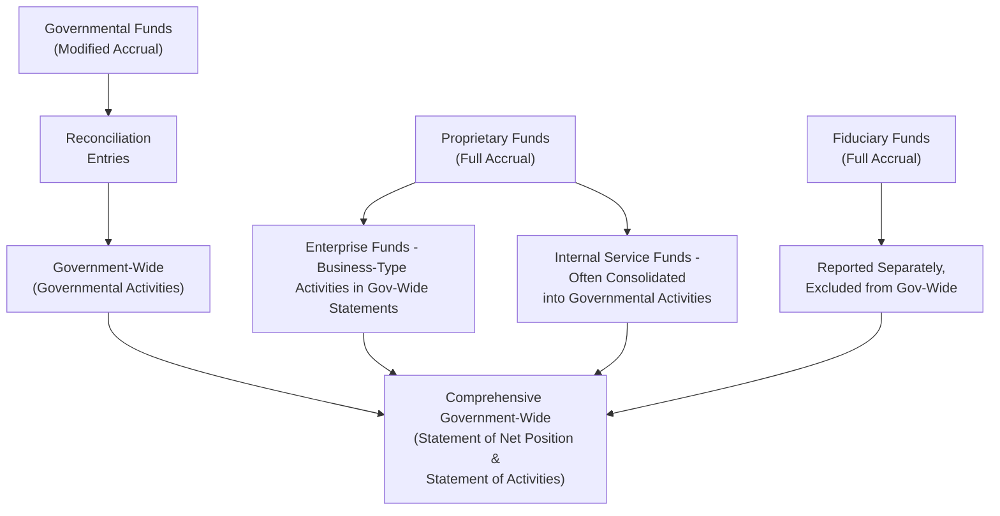

## 19.2 Government-Wide Statements vs. Governmental Funds

The Governmental Accounting Standards Board (GASB) recognizes that governments require financial statements that meet the needs of a variety of users, including taxpayers, creditors, and oversight bodies. As a result, state and local governments use two broad categories of financial statements:

• Government-Wide Financial Statements (Full Accrual)  
• Fund Financial Statements (Often Modified Accrual for Governmental Funds)

Government-wide statements give a consolidated view of the entire government’s financial position and operational results, much like a private-sector or not-for-profit entity’s financial statements. Fund statements provide a more granular and detailed perspective, focusing on specific activities or purposes, such as operating expenditures of schools or police departments. This section explains the core distinctions between government-wide and fund-level statements, focusing on how the basis of accounting and measurement focus differ, and how these differences affect the presentation of government finances.

--------------------------------------------------------------------------------
  
### Understanding the Dual Reporting Model

The dual reporting model introduced by GASB Statement No. 34 created two distinct but interrelated sets of financial statements for governments:

1. Government-Wide Financial Statements  
2. Fund Financial Statements  

Although both sets present information about the same underlying activities, they do so from different perspectives. This dual perspective is critical for users of governmental financial statements, because it paints a more complete picture of a government’s finances than a single viewpoint could.

--------------------------------------------------------------------------------

### Government-Wide Statements: Full Accrual Basis and Economic Resources Focus

The government-wide statements mirror the style of private-sector financial reporting. They capture all assets, liabilities, revenues, and expenses using a full accrual basis of accounting. Two primary financial statements fall under this umbrella:

• Statement of Net Position  
• Statement of Activities  

#### Statement of Net Position

The Statement of Net Position reports a government’s total assets (including capital assets), liabilities (including long-term debts), deferred inflows and outflows of resources, and the resulting net position. Unlike governmental fund statements, which typically do not record long-term assets (like infrastructure) and long-term liabilities (like general obligation bonds) within the same fund, the government-wide level includes these items.

Net position is typically broken into three components:

1. Net Investment in Capital Assets  
2. Restricted Net Position  
3. Unrestricted Net Position  

This approach provides a broad measure of accountability, revealing the overall financial health of the government in terms of net resources.

#### Statement of Activities

The Statement of Activities shows how the government’s net position changes over time. Instead of focusing on revenues and expenditures as fund statements do, the Statement of Activities classifies revenues and expenses by function (e.g., public safety, education). It follows the net cost format: program revenues (like fees, grants, and charges for services) are offset against the expenses of each function to arrive at a net cost or net benefit. General revenues such as property taxes are then added or subtracted, resulting in the overall change in net position.

In essence, the government-wide statements adhere to full accrual accounting and the economic resources measurement focus, thus closely paralleling corporate financial accounting. All transactions—both current and long-term—are included.

--------------------------------------------------------------------------------

### Governmental Funds: Modified Accrual Basis and Current Financial Resources Focus

Governmental fund statements show a different perspective. These statements primarily measure the flow of current financial resources, focusing on short-term inflows and outflows (e.g., cash and near-cash resources). Common examples of governmental funds include:

• General Fund (main operating fund)  
• Special Revenue Funds (dedicated revenues for specific purposes, such as road maintenance)  
• Capital Projects Funds (used for large infrastructure projects)  
• Debt Service Funds (used to account for the repayment of long-term debt)  
• Permanent Funds (resources restricted to the extent that only earnings, not the principal, can be used)  

#### Basis of Accounting: Modified Accrual

Under the modified accrual basis, revenues are recognized only when they are both measurable and available, generally meaning collectible within the current period or soon enough thereafter to be used to pay liabilities of the current period. Expenditures are typically recognized when the related liability is incurred. Long-term obligations are not recognized as liabilities in the governmental funds; rather, they are recognized only when they become due. Similarly, long-term assets like buildings and infrastructure are not capitalized in governmental funds; they are treated as expenditures when purchased or constructed.

As a result, fund statements do not reflect the government’s total economic resources. Instead, they focus primarily on a near-term flow of resources, showing whether the government has enough resources in each fund to cover current obligations.

--------------------------------------------------------------------------------

### Key Differences at a Glance

Below is a simplified comparison illustrating the main differences between government-wide statements and governmental fund statements:

1. **Basis of Accounting**  
   • Government-Wide: Full Accrual.  
   • Governmental Funds: Modified Accrual.  

2. **Measurement Focus**  
   • Government-Wide: Economic Resources (all transactions, long-term perspective).  
   • Governmental Funds: Current Financial Resources (short-term perspective).  

3. **Capital Assets and Long-Term Liabilities**  
   • Government-Wide: Recognized in the Statement of Net Position; depreciation is recorded.  
   • Governmental Funds: Not recognized on the balance sheet; expenditures are recorded when fund resources are used to purchase capital items.  

4. **Revenue Recognition**  
   • Government-Wide: Revenue recognized when earned (similar to private-sector).  
   • Governmental Funds: Revenue recognized when measurable and available to finance current expenditures.  

5. **Expenditure vs. Expense**  
   • Government-Wide: Expenses recognized over the period when incurred (including depreciation, interest accrual on long-term debt).  
   • Governmental Funds: Expenditures recognized primarily when current financial resources are used (no depreciation is recognized in these statements).

--------------------------------------------------------------------------------

### Reconciliation Between Governmental Funds and Government-Wide Statements

To satisfy both perspectives, GASB 34 requires a reconciliation between the totals in the governmental fund statements and the corresponding totals in the government-wide statements. This reconciliation shows how amounts reported on the modified accrual basis transition to those reported on the full accrual basis for items such as:

• Capital outlays and depreciation  
• Issuance of and repayments on long-term debt  
• Disposal or sale of assets  
• Recognition of certain revenues  
• Accrual of interest payable  

The purpose of these reconciliation schedules is to ensure transparency, demonstrating exactly how local government transforms fund-level reporting to the consolidated view necessary under full accrual.

Below is a simplified Mermaid diagram illustrating this reconciliation:

- A[“Governmental Funds (Modified Accrual)”]: Reflects short-term, near-term focus with current resources.  
- B[“Reconcile Adjustments”]: Adds or removes elements like capital assets, long-term debt, and accrued interest.  
- C[“Government-Wide Statements (Full Accrual)”]: Reports comprehensive, long-term perspective.

--------------------------------------------------------------------------------

### Practical Example: Purchase of a Fire Truck

Suppose a city purchases a new fire truck for its Fire Department. This transaction exemplifies how reporting differs in governmental funds versus government-wide statements.

• **In the Governmental Fund Statements:**  
  - The fire truck purchase appears as an expenditure in the Capital Projects Fund at the date of acquisition.  
  - There is no recognition of a capital asset on the fund’s balance sheet since the fund only tracks current financial resources.  
  - The cost of the truck reduces the fund balance.

• **In the Government-Wide Statements:**  
  - The purchase is recognized as a capital asset in the Statement of Net Position.  
  - The cost appears on the Statement of Net Position under “Capital Assets,” and the city begins to record depreciation expense for the fire truck over its useful life.  
  - The city’s net position changes by the difference between the cost of the truck and any related financing arrangements.

--------------------------------------------------------------------------------

### Practical Example: Long-Term Debt Issuance

Issuing general obligation bonds for building a new city hall further illustrates the difference:

• **In the Governmental Fund Statements:**  
  - Proceeds from the bond issuance appear as “Other Financing Sources,” increasing the revenue side in the fund’s Statement of Revenues, Expenditures, and Changes in Fund Balance.  
  - Repayment of the principal reduces current financial resources when a payment is made.  
  - The entire bond principal outstanding is generally not shown as a liability in the fund’s balance sheet.

• **In the Government-Wide Statements:**  
  - The bond proceeds show up as a long-term liability on the Statement of Net Position.  
  - A portion of the interest expense and principal repayment is recorded each year to match the accrual concept.  
  - The underlying asset constructed with the bond proceeds is recorded as a capital asset, and interest costs during construction may be capitalized if appropriate, depending on applicable GASB guidance.

--------------------------------------------------------------------------------

### Reconciling Budgets and Actuals

An additional consideration is that governmental fund statements often present budget-to-actual comparisons, offering insights into whether the government adhered to the authorized spending plan. These comparisons highlight short-term budgetary control, aligning closely (though not always perfectly) with the modified accrual basis. Meanwhile, government-wide statements do not present budget-to-actual comparisons; instead, they reflect the government’s overall operational results from a long-term perspective.

--------------------------------------------------------------------------------

### The Role of Proprietary and Fiduciary Funds

Beyond governmental funds, local governments can also have proprietary and fiduciary fund statements:

• **Proprietary Funds (Enterprise and Internal Service Funds)**: These typically use the full accrual basis of accounting, mirroring business-like operations. Enterprise funds account for services funded primarily through user charges (e.g., water utility). Internal service funds account for goods or services provided internally (e.g., centralized printing). In the government-wide statements, enterprise funds' activities are presented in the “Business-Type Activities” column.

• **Fiduciary Funds (Pension Funds, Custodial Funds, and Others)**: Fiduciary funds account for resources the government holds for external parties (e.g., employee pension plans). Fiduciary funds are not consolidated into the government-wide statements because the resources within these funds are not available to finance the government’s operations.

While the primary focus in this section remains on the interplay between governmental funds and government-wide statements, it is important to recognize that the overall financial picture includes other fund types. Nonetheless, the core philosophical differences between the full accrual perspective and the modified accrual perspective are typically best illustrated through governmental funds.

--------------------------------------------------------------------------------

### Common Pitfalls and Best Practices

1. **Not Reconciling Correctly**  
   Many preparers struggle with the reconciliation process—forgetting to add back capital assets or neglecting to account for bond proceeds and long-term debt. Consistently referencing detailed worksheets can alleviate errors.

2. **Overlooking Depreciation**  
   Governmental funds do not record depreciation, but government-wide statements do. Governments sometimes fail to track capital assets properly, resulting in incomplete depreciation schedules. A robust capital asset registry with depreciation methods and schedules is essential.

3. **Misclassifying Revenues**  
   Since governmental funds recognize revenue only when it is measurable and available, governments must carefully track property taxes, grants, and other revenue sources. Incorrectly recognizing these items can lead to material misstatements in the fund statements.

4. **Ignoring Internal Service Funds**  
   Internal service funds often primarily serve governmental functions, so their net balances get consolidated with the governmental activities in government-wide statements. Not consolidating them properly can skew the financial picture.

5. **Failing to Update Policies**  
   GASB updates and clarifications (e.g., related to intangible assets, leases, or pension obligations) can affect both fund-level and government-wide reporting. Staying current with guidance is essential for accurate reporting.

--------------------------------------------------------------------------------

### Diagram of Overall Government Financial Reporting Flow

Below is a more comprehensive Mermaid diagram demonstrating how various funds contribute to the government-wide statements. Note that Fiduciary Funds are excluded from government-wide consolidation because those resources cannot be used for governmental programs.

- A[“Governmental Funds (Modified Accrual)”]: Main operating funds, capital projects, special revenue, etc.  
- B[“Reconciliation Entries”]: Adjusting short-term focus to full accrual.  
- C[“Government-Wide (Governmental Activities)”]: Consolidated governmental-financial view.  
- D[“Proprietary Funds (Full Accrual)”]: Business-like activities (enterprise funds) and internal service funds.  
- E[“Enterprise Funds - Business-Type Activities in Gov-Wide Statements”]: Shown in a separate column at the government-wide level.  
- F[“Internal Service Funds - Often Consolidated into Governmental Activities”]: If predominantly serving the general government.  
- G[“Fiduciary Funds (Full Accrual)”]: Pension or custodial resources, not available for government’s own use.  
- H[“Reported Separately, Excluded from Gov-Wide”]: Fiduciary funds do not merge into government-wide net position.  
- I[“Comprehensive Government-Wide (Statement of Net Position & Statement of Activities)”]: Final consolidated statements for both governmental and business-type activities.

--------------------------------------------------------------------------------

### Real-World Scenario: City of Sunnyside

To solidify these concepts, consider the hypothetical City of Sunnyside:

• The City’s General Fund records day-to-day transactions like paying firefighters, police officers, and other operating costs. At the modified accrual (fund) level, each payroll run is booked as an expenditure. In the government-wide statements, these same payroll costs are considered expenses in the Statement of Activities. There is rarely a difference for salaries, except for timing of payroll accruals—still, the theoretical difference can appear if wages are due but not paid within the fund’s “availability period.”

• The City issues general obligation bonds to construct a new municipal library. The capital project fund records bond proceeds as “Other Financing Sources,” while government-wide sees it as an increase in long-term debt and eventually a capital asset (the library building). Over time, the building’s depreciation accumulates in the government-wide statements, but the capital project fund’s perspective only captures expenditures when project costs are paid.

• The City’s Water and Sewer operations are accounted for in an Enterprise Fund (a proprietary fund). On the government-wide statements, these appear under the “Business-Type Activities” column, using the full accrual basis of accounting.  

By combining these perspectives, stakeholders—like bondholders evaluating loan capacity, regulators checking compliance, or citizens gauging how effectively tax dollars are being spent—can make more informed decisions.

--------------------------------------------------------------------------------

### References for Further Study

• Governmental Accounting Standards Board (GASB) Pronouncements – https://www.gasb.org  
• Government Finance Officers Association (GFOA) – https://www.gfoa.org  
• Gauthier, S.J., Governmental Accounting, Auditing, and Financial Reporting (the “Blue Book”)  
• National Advisory Council on State and Local Budgeting (NACSLB) – Best Practices in budgeting

These resources provide deeper insight into the reasoning and methods behind the government-wide and fund-level financial reporting structures, guiding both practitioners and students of governmental accounting.

--------------------------------------------------------------------------------

### Conclusion

Understanding the relationship between government-wide statements and governmental fund statements lies at the heart of state and local government accounting. The balancing act between full accrual measurements (to gauge the long-term financial position) and modified accrual analyses (to monitor current financial resources) ensures that policymakers, creditors, citizens, and other stakeholders receive information relevant to their decision-making needs. By reconciling and interpreting both sets of data, CPAs and financial professionals deliver vital transparency into a government’s fiscal health over short and long horizons.

Armed with this knowledge—what each basis of accounting captures, how capital assets and long-term obligations are reported, and the need for reconciliations—professionals are better equipped to prepare, analyze, and audit public sector financial statements. This skillset is crucial for the CPA exam’s Business Analysis and Reporting (BAR) discipline and, equally important, for practitioners striving to maintain public trust in government financial management.

--------------------------------------------------------------------------------

## Governmental Accounting Mastery Quiz: Full Accrual vs. Modified Accrual



### Government-wide statements primarily use which basis of accounting?

- [ ] Modified accrual basis
- [x] Full accrual basis
- [ ] Cash basis
- [ ] Regulatory basis

> **Explanation:** Government-wide statements use the full accrual basis of accounting, mirroring private-sector financial reporting conventions and including all economic resources in their measurement focus.

### In governmental fund statements, when are revenues generally recognized?

- [ ] Always upon receipt of cash
- [x] When they are measurable and available
- [ ] Only when they are earned under full accrual
- [ ] In the period they are budgeted

> **Explanation:** Under the modified accrual basis used by most governmental funds, revenues are recognized when they are measurable and available to finance current expenditures.

### Which of the following is typically not recorded in governmental fund financial statements?

- [x] Long-term liabilities
- [ ] Current liabilities
- [ ] Property tax revenue
- [ ] Interfund transfers

> **Explanation:** Because governmental funds use the modified accrual basis and a current financial resources measurement focus, long-term liabilities are not recorded in the funds; they are disclosed at the government-wide level.

### Which component is found in the Statement of Net Position but not in a governmental fund balance sheet?

- [ ] Fund balance
- [ ] Vouchers payable
- [x] Net investment in capital assets
- [ ] Deferred inflows of resources

> **Explanation:** Governmental fund balance sheets do not present capital assets and long-term debt; hence, “net investment in capital assets” is a government-wide element, related to the full accrual perspective.

### In the Statement of Activities, how are revenues for each function presented?

- [ ] Combined with enterprise funds
- [x] Program revenues offset related expenses
- [ ] As a separate column for proprietary fund activities
- [ ] Excluded from presentation

> **Explanation:** The government-wide Statement of Activities follows a net cost (or net benefit) approach, offsetting program revenues (e.g., charges for services, grants) against the distinct function or program expenses.

### What primary reconciliation step is required when converting governmental fund statements to government-wide statements?

- [ ] Translating from cash basis to modified accrual
- [ ] Aggregating revenues between internal service funds and enterprise funds
- [x] Including capital assets and long-term liability adjustments
- [ ] Excluding any interfund transactions

> **Explanation:** The key transition from modified accrual (fund statements) to full accrual (government-wide) involves adding back capital assets, subtracting related depreciation, and recording long-term liabilities.

### Which of the following results from the use of the economic resources measurement focus?

- [ ] Excluding capital assets from financial statements
- [ ] Recording only current assets and current liabilities
- [ ] Omitting depreciation expense
- [x] Recording all assets, liabilities, and related depreciation

> **Explanation:** The economic resources measurement focus encompasses both current and long-term elements of a government's financial position. This involves recognizing depreciation of capital assets.

### When a government issues general obligation bonds in a governmental fund, how are the proceeds classified?

- [ ] Revenue
- [x] Other financing sources
- [ ] Capital asset obligation
- [ ] Offset to expenditures

> **Explanation:** In governmental fund accounting (modified accrual), bond proceeds are treated as “Other financing sources” rather than revenue, reflecting the increase in current financial resources.

### Which of the following statements is correct regarding fiduciary funds?

- [x] They are excluded from government-wide statements
- [ ] They are consolidated into governmental activities
- [ ] They appear in a separate column in the government-wide Statement of Net Position
- [ ] They are integrated with enterprise funds

> **Explanation:** Fiduciary funds report resources held by the government in a trustee or custodial capacity for external parties. These resources are not available for the government’s own use and therefore are excluded from the government-wide statements.

### Under modified accrual basis, fund revenues are considered available if they are collectible within the current period or soon enough thereafter to pay:

- [x] The liabilities of the current period
- [ ] Future capital asset purchases
- [ ] Pension obligations
- [ ] Depreciation expenses

> **Explanation:** Under modified accrual, “available” means receivable within the current period or soon enough after year-end (often 60 days) to cover current objectives or liabilities.



--------------------------------------------------------------------------------

## For Additional Practice and Deeper Preparation

### [Business Analysis and Reporting (BAR) CPA Mock Exams](https://www.udemy.com/course/bar-cpa-mock-exams/?referralCode=ADBE2E84BEE9CB6243CA)

**Business Analysis and Reporting (BAR) CPA Mocks:** 6 Full (1,500 Qs), Harder Than Real! In-Depth & Clear. Crush With Confidence!

- Tackle full-length mock exams designed to mirror real BAR questions.  
- Refine your exam-day strategies with detailed, step-by-step solutions for every scenario.  
- Explore in-depth rationales that reinforce higher-level concepts, giving you an edge on test day.  
- Boost confidence and minimize anxiety by mastering every corner of the BAR blueprint.  
- Perfect for those seeking exceptionally hard mocks and real-world readiness.  

_Disclaimer: This course is not endorsed by or affiliated with the AICPA, NASBA, or any official CPA Examination authority. All content is for educational and preparatory purposes only._
