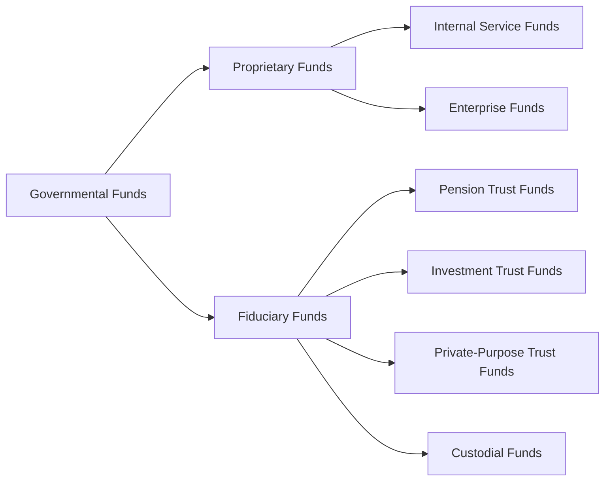

## 19.3 Proprietary and Fiduciary Funds

This section delves into two key categories of funds in governmental accounting: Proprietary Funds and Fiduciary Funds. Building upon the foundational concepts introduced in previous subchapters (see Section 19.1 for Fund Structures and Purposes), here we differentiate between Internal Service Funds and Enterprise Funds (the two types of Proprietary Funds) and examine the various fiduciary funds, from Pension Trust Funds to Custodial Funds. Understanding these fund types is essential in preparing accurate and transparent financial statements in state and local governmental environments.

-------------------------------------------------------------------------------

### Overview of Fund Types in Governmental Accounting

In governmental accounting, the primary purpose of funds is to ensure that finances related to various activities are segregated, tracked, and reported distinctly. From a high-level perspective, fund accounting is divided into three major categories:

• Governmental Funds – These focus on activities primarily financed through taxes and intergovernmental revenues, emphasizing the flow of current financial resources.  
• Proprietary Funds – These resemble private sector businesses where user fees and charges finance operations, emphasizing operational accountability.  
• Fiduciary Funds – These funds hold and manage assets on behalf of others, without the government taking on ownership.  

The relationship among these fund types can be visualized using a simple flowchart:

In this diagram, Governmental Funds (left) are shown as distinct from Proprietary and Fiduciary Funds, highlighting the different goals, measurement focus, and basis of accounting they employ. Let’s explore Proprietary Funds first, then move on to Fiduciary Funds.

-------------------------------------------------------------------------------

### Proprietary Funds

Proprietary Funds are used to account for a government’s ongoing operations that are financed and operated in a manner similar to private businesses. GASB (Governmental Accounting Standards Board) standards require the use of the accrual basis of accounting for Proprietary Funds, meaning revenues are recognized when earned and expenses are recognized when incurred. Proprietary Funds emphasize measuring economic resources (long-term resources and obligations), and their financial statements aim to assess financial position, changes in financial position, and cash flows.

#### Internal Service Funds

Internal Service Funds (ISFs) account for services provided by one governmental department to other departments or agencies on a cost-reimbursement basis. Common examples include:

• A centralized printing or copying service center that charges user departments based on the number of pages printed.  
• A central motor pool that maintains and rents vehicles to various city departments.  
• An information technology (IT) department that manages data storage, network security, and software licenses for multiple other government sectors.

Internal Service Funds can greatly enhance efficiency and cost-effectiveness by centralizing resources and standardizing practices. Because these funds exist primarily to serve the governmental entity itself (rather than external customers), the net position of Internal Service Funds is usually reported within governmental activities in the government-wide statements, rather than business-type activities.

Key Points:

- Accrual Basis & Economic Resources Measurement Focus: As part of the Proprietary Fund family, ISFs recognize long-term assets and liabilities.  
- Revenue Recognition: Revenues in Internal Service Funds typically stem from charges for goods and services provided to other governmental units.  
- Pricing Mechanism: Rates are often set so that revenues closely match expenses over the long term. Variances in any given period can cause over- or under-recovery of costs.  
- Common Pitfalls:  
  1. Not tracking the true cost of service, leading to distorted pricing.  
  2. Improper allocation of overhead or depreciation.  
  3. Confusion regarding how net deficits or surpluses should be treated under governmental activities in the annual financial statements.

#### Enterprise Funds

Enterprise Funds are used when the government provides goods or services to the public (external customers) on a user-charge basis, similar to a private sector enterprise. Common examples include:

• Utilities (e.g., water, sewer, garbage collection).  
• Transportation services (e.g., toll roads, public bus systems).  
• Recreational facilities (e.g., government-run golf courses or swimming pools).  
• Airports and port authorities owned or operated by state or local governments.

Enterprise Funds operate with an emphasis on self-sufficiency. The goal is often to ensure that user charges cover the cost of providing these services, including depreciation and long-term capital needs.

Key Points:

- Accrual Basis & Economic Resources Measurement Focus: Like Internal Service Funds, Enterprise Funds use the accrual basis, capturing all assets and liabilities.  
- Revenue and Expense Recognition: Revenues come largely from charges to external users, and expenses include operating costs (e.g., salaries, materials) plus non-operating items (e.g., interest on debt).  
- Statements Required:  
  1. Statement of Net Position  
  2. Statement of Revenues, Expenses, and Changes in Net Position  
  3. Statement of Cash Flows (using the direct method for operating cash flows, although GASB allows certain flexibility)  
- Common Pitfalls:  
  1. Misclassification of capital contributions vs. operating revenues.  
  2. Improperly capitalizing costs that do not meet capitalization criteria.  
  3. Overlooking regulatory compliance requirements for rate structures (particularly in utility funds).

-------------------------------------------------------------------------------

### Fiduciary Funds

Fiduciary Funds are used to account for resources the government holds in trust or as an agent for external parties that are not part of the government’s own activities. GASB’s guidance (e.g., GASB Statement No. 84, “Fiduciary Activities”) provides insight into what constitutes a fiduciary activity and how to properly classify such activities.

Fiduciary Funds are not consolidated into the government-wide financial statements in the same way Governmental and Proprietary Funds are, because they do not represent resources that belong to the government. Instead, they are reported in separate statements of Fiduciary Net Position and Changes in Fiduciary Net Position.

There are four primary types of Fiduciary Funds:

1. Pension (and Other Employee Benefit) Trust Funds  
2. Investment Trust Funds  
3. Private-Purpose Trust Funds  
4. Custodial Funds  

#### Pension and Other Employee Benefit Trust Funds

Pension Trust Funds hold assets set aside to pay pension benefits to retired government employees. Other post-employment benefits (OPEB), such as retiree health care, may also be accounted for in a similar trust arrangement if they meet relevant trust criteria. Activities in these funds involve:

• Contributions from employees and/or employers.  
• Investments to grow the fund’s assets over time.  
• Payment of retirement benefits and administrative expenses.  

These funds follow the accrual basis. Actuarial assumptions, discount rates, and funding statuses are significant considerations. Pension Trust Funds typically have large pools of investments, requiring sound investment policies and strong governance. GASB standards demand specific footnote disclosures and Required Supplementary Information (RSI) to indicate the long-term health of these pension obligations.

#### Investment Trust Funds

Investment Trust Funds account for the external portion of investment pools operated by a government. For instance, a county may invest funds on behalf of multiple local governments and school districts (participants). Any portion of the pool owned by the hosting government itself is accounted for within its own funds, while the external, non-government portion is reported within an Investment Trust Fund.

Key Points:

- The hosting government acts purely as an investment agent or manager.  
- Participants often pool resources to achieve economies of scale and professional management.  
- Investment earnings and changes in asset valuations are allocated among participants based on their proportionate shares.  

#### Private-Purpose Trust Funds

Private-Purpose Trust Funds are held for the benefit of individuals, private organizations, or other governments that are not part of the reporting government. Examples include:

• Endowments designated for scholarships where the principal must be maintained in perpetuity and only the investment income can be used for recipients outside the government.  
• A trust established to fund specific societal benefits (e.g., a philanthropic trust for local arts organizations).  

While these trust funds operate under similar accounting principles to Pension Trust Funds—using accrual accounting and focusing on net position—they differ significantly in purpose and beneficiaries.

#### Custodial Funds

Custodial Funds (previously known as Agency Funds) are used to account for assets that the government holds temporarily in a custodial role, such as collecting and remitting taxes or fees to other government units (e.g., state-collected local taxes passed through to municipalities). Custodial Funds do not generally include long-term or discretionary management because the government only functions as a conduit.

Key Points:

- No net position is typically reported for Custodial Funds if assets equal liabilities consistently. However, under GASB 84, some custodial activities may recognize net position depending on timing differences.  
- The government’s role is purely administrative—no substantial financial benefit or burden for the host government.  
- Examples include:  
   1. Collection and distribution of property taxes for school districts and other local taxing bodies within a county.  
   2. Holding bail monies temporarily for defendants until court cases are settled.

-------------------------------------------------------------------------------

### Measurement Focus and Basis of Accounting

Proprietary Funds (Internal Service and Enterprise) employ the economic resources measurement focus and accrual basis of accounting. All fixed assets, long-term debt, and depreciation are recognized. Meanwhile, Fiduciary Funds (Pension, Investment, Private-Purpose, Custodial) also use the economic resources measurement focus and accrual basis, but they are kept separate from the government-wide financial statements except for note disclosures and the Fiduciary Fund statements.

-------------------------------------------------------------------------------

### Statement Presentation

Just as with private sector entities, Proprietary Fund statements typically include:

1. Statement of Net Position  
2. Statement of Revenues, Expenses, and Changes in Net Position  
3. Statement of Cash Flows  

Fiduciary Funds include:

1. Statement of Fiduciary Net Position  
2. Statement of Changes in Fiduciary Net Position  

Governmental entities must ensure that the net position, revenues, expenses, contributed capital, and other changes are accurately reflected in both the basic statements and the notes to the financial statements. Additionally, compliance with GASB pronouncements requires proper classification and disclosure of fiduciary activities.

-------------------------------------------------------------------------------

### Practical Financial Examples

1. Internal Service Fund – IT Services Example  
   • A county’s IT department administers servers, provides helpdesk support, and manages application licenses for all other departments. Costs are aggregated in the Internal Service Fund. At the end of each month, the county bills the user departments for their share of the IT expenses based on usage metrics (e.g., number of employees supported, storage used, hours of helpdesk support).  

2. Enterprise Fund – Water Utility  
   • A city operates a water treatment and distribution system, charging residents on a metered basis. The fund collects enough revenue to maintain the distribution infrastructure, pay for water treatment chemicals, cover operating labor, and fund long-term capital improvements.  

3. Pension Trust Funds – Municipal Pension  
   • A municipality sets aside a portion of each employee’s paycheck and funding from the city’s general revenues into a pension trust. Investments are diversified across stocks, bonds, and real estate, managed by professional fund managers. Benefit payments and pension-related administrative expenses are processed through this Pension Trust Fund.  

4. Custodial Fund – Sales Tax Collection  
   • A state collects sales taxes on behalf of a county and local districts. Once collected, the state remits each segment to the appropriate local taxing jurisdiction. The state recognizes these resources in a Custodial Fund until they are disbursed.  

-------------------------------------------------------------------------------

### Common Pitfalls and Challenges

• Mixing Fund Categories: Governments must carefully classify funds according to the activity’s purpose, funding source, and reporting criteria.  
• Poor Cost Allocation in ISFs: Incorrect overhead allocations can lead to cross-subsidization among departments.  
• Revenue vs. Capital Contributions in Enterprise Funds: Distinguishing normal operating revenue from long-term capital grants or special assessments can be tricky.  
• Pension Fund Complexity: Actuarial assumptions, new GASB pension pronouncements (e.g., GASB 68, 75), and frequent valuation changes pose comprehension and reporting challenges.  
• Custodial Fund Timing Differences: Determining when assets or liabilities belong in a Custodial Fund can be confusing if distributions lag behind collections.

-------------------------------------------------------------------------------

### Best Practices and Strategies for Success

• Develop Clear Policies: Written internal policies regarding cost allocation, fund management, and fiduciary responsibilities help maintain compliance.  
• Train Personnel: Ensure accounting staff and department heads are familiar with the purpose and reporting requirements of Proprietary and Fiduciary Funds.  
• Establish Detailed Procedures for ISFs: Proper overhead rate calculations, cost tracking, and periodic reviews of internal service pricing.  
• Keep Actuarial Estimates Updated: For Pension Funds, work closely with actuaries to obtain timely, accurate data, especially for discount rates and mortality assumptions.  
• Maintain Transparent Disclosures: Provide comprehensive footnotes on fiduciary activities to give readers a clear picture of asset management responsibilities and obligations.  
• Review GASB Pronouncements: Stay current with the latest guidance (e.g., GASB 84 on fiduciary activities) to ensure proper identification and reporting of fiduciary funds.

-------------------------------------------------------------------------------

### Real-World Insights and Example Case Study

Consider a mid-sized city transitioning its water utility fund from Governmental to Enterprise classification after deciding to run it more like a self-supporting business. The city must:

1. Move from modified accrual to full accrual for the new Enterprise Fund.  
2. Recognize fixed assets and accumulated depreciation that were previously off the Governmental Funds balance sheets.  
3. Develop user rates reflective of full cost recovery, including replacement of aging water mains.  
4. Educate stakeholders on the shift to enterprise financing, highlighting improvements in transparency and accountability for ratepayers.

Simultaneously, the city’s newly formed consolidated pension system merges multiple small pension plans into a single Pension Trust Fund. Finance staff must ensure:

1. Timely actuarial valuations of projected pension obligations.  
2. Consolidated investments of the distinct pension groups into a unified strategy, under a new board of trustees.  
3. Adequate communication with retirees and employees about benefit calculations.  
4. Full compliance with GASB pension disclosure requirements in the city’s CAFR (Comprehensive Annual Financial Report), referencing changes in net pension liability, discount rates, and schedules of required supplementary information.

-------------------------------------------------------------------------------

### References for Further Exploration

• Governmental Accounting Standards Board (GASB) – Official pronouncements and implementation guides.  
• Government Finance Officers Association (GFOA) – Recommended best practices and advisories on fund accounting.  
• GASB Statement No. 84, “Fiduciary Activities” – Guidance on identifying fiduciary responsibilities and reporting them accurately.  
• AICPA Audit & Accounting Guide: State and Local Governments – Comprehensive overview of accounting principles, illustrations, and clarifications.

-------------------------------------------------------------------------------

### Conclusion

Proprietary and Fiduciary Funds each serve distinct roles in capturing and reporting a government’s financial activities, ensuring stakeholders have transparent, relevant, and accurate insights. Internal Service Funds and Enterprise Funds emphasize user fees, cost recovery, and, in many cases, self-sustainability. Fiduciary Funds track resources managed on behalf of external parties, highlighting the government’s responsibility to act prudently as a trustee or agent. Mastering these funds’ nuances is critical for practitioners aspiring to excel in governmental accounting, as the correct reporting and handling of these activities directly impact the reliability and clarity of a government’s overall financial statements.

-------------------------------------------------------------------------------

## Test Your Knowledge of Proprietary and Fiduciary Funds



### Which basis of accounting do Proprietary Funds use?

- [ ] Modified accrual basis  
- [x] Accrual basis  
- [ ] Cash basis  
- [ ] Obligation basis  

> **Explanation:** Proprietary Funds (including Internal Service and Enterprise Funds) use the accrual basis of accounting, mirroring private sector business practices.

### Which of the following is NOT a type of Fiduciary Fund?

- [ ] Investment Trust Fund  
- [ ] Private-Purpose Trust Fund  
- [x] Internal Service Fund  
- [ ] Custodial Fund  

> **Explanation:** Internal Service Funds are Proprietary Funds, not Fiduciary Funds.

### An Internal Service Fund typically provides services to:

- [x] Other departments within the same government  
- [ ] The general public  
- [ ] Federal agencies only  
- [ ] Non-governmental entities  

> **Explanation:** Internal Service Funds deliver services mainly to other governmental departments on a cost-reimbursement basis.

### Enterprise Funds are commonly used when:

- [x] Government sells goods or provides services to external users  
- [ ] Government collects revenues exclusively from property taxes  
- [ ] Government manages pension plans  
- [ ] Government acts as a pass-through agent  

> **Explanation:** Enterprise Funds handle activities funded primarily by external user fees, similar to a private business model.

### Which statement is typically prepared for both Internal Service Funds and Enterprise Funds?

- [x] Statement of Cash Flows  
- [ ] Budgetary Comparison Statement  
- [ ] Statement of Changes in Fiduciary Net Position  
- [ ] Statement of Revenues, Expenditures, and Changes in Fund Balance  

> **Explanation:** Proprietary Funds (both Internal Service and Enterprise) require a Statement of Cash Flows under GASB standards, highlighting operating, non-capital financing, capital and related financing, and investing activities.

### Pension Trust Funds are reported in:

- [x] Fiduciary Funds  
- [ ] Governmental Funds  
- [ ] Proprietary Funds  
- [ ] Special Revenue Funds  

> **Explanation:** Pension Trust Funds belong to Fiduciary Funds, specifically used to manage and track pension-related resources.

### Within a Pension Trust Fund, resources are owned by:

- [ ] The reporting government’s general fund  
- [x] The pension plan participants or beneficiaries  
- [ ] Creditors with claims to municipal resources  
- [ ] External grantors  

> **Explanation:** In a Pension Trust Fund, contributed resources are set aside for the beneficiaries (i.e., employees and retirees), not for government use.

### Custodial Funds typically involve:

- [x] Pass-through activities where the government holds amounts temporarily  
- [ ] Grants solely for government-funded programs  
- [ ] Public infrastructure financing  
- [ ] Internal cost allocations  

> **Explanation:** Custodial Funds collect resources to redistribute them to external individuals or organizations, with the government acting mainly as an agent.

### In an Internal Service Fund, what usually happens if there is a surplus?

- [x] It may reduce future charges to departments  
- [ ] It must always be transferred to the General Fund  
- [ ] It is automatically distributed to taxpayers  
- [ ] Surpluses are not allowed under GASB standards  

> **Explanation:** Surpluses in Internal Service Funds are often allocated to reduce subsequent billing rates. The government aims for cost recovery over time, not a profit motive.

### True or False: Fiduciary Funds are included in the primary government-wide financial statements.

- [x] True  
- [ ] False  

> **Explanation:** Under GASB standards, Fiduciary Funds are reported in separate statements of Fiduciary Net Position and Changes in Fiduciary Net Position. They are not combined into the government-wide statements of net position and activities, but they do appear in the overall financial report in designated fiduciary statements.



-------------------------------------------------------------------------------

## For Additional Practice and Deeper Preparation

### [Business Analysis and Reporting (BAR) CPA Mock Exams](https://www.udemy.com/course/bar-cpa-mock-exams/?referralCode=ADBE2E84BEE9CB6243CA)

**Business Analysis and Reporting (BAR) CPA Mocks:** 6 Full (1,500 Qs), Harder Than Real! In-Depth & Clear. Crush With Confidence!

- Tackle full-length mock exams designed to mirror real BAR questions.  
- Refine your exam-day strategies with detailed, step-by-step solutions for every scenario.  
- Explore in-depth rationales that reinforce higher-level concepts, giving you an edge on test day.  
- Boost confidence and minimize anxiety by mastering every corner of the BAR blueprint.  
- Perfect for those seeking exceptionally hard mocks and real-world readiness.

_Disclaimer: This course is not endorsed by or affiliated with the AICPA, NASBA, or any official CPA Examination authority. All content is for educational and preparatory purposes only._
