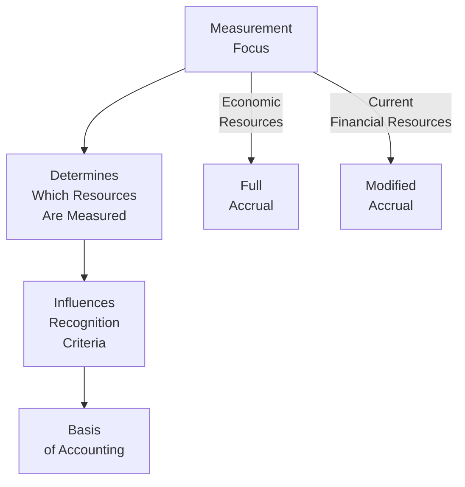

## 19.4 Measurement Focus and Basis of Accounting

In the world of governmental accounting—where budget control, accountability, and transparency are paramount—understanding measurement focus and basis of accounting is essential. These two concepts together guide state and local governments in how they record and report financial transactions within their diverse range of funds. This section explores the contrasts between the economic resources measurement focus (often associated with the full accrual basis) and the current financial resources measurement focus (often associated with the modified accrual basis), along with critical insights, examples, and best practices for successful application.

Measurement focus addresses what transactions and events governments measure to reflect their financial position and results. Meanwhile, the basis of accounting defines when these transactions and events are recognized. This distinction is a foundational element of governmental accounting, shaping everything from revenue recognition to budgeting and financial statement preparation. By mastering these concepts, CPAs gain the ability to interpret and prepare governmental financial statements accurately—an indispensable skill when analyzing state and local government finances for the BAR (Business Analysis and Reporting) discipline of the CPA Exam.

---

Measurement Focus and Basis of Accounting in Governmental Accounting
--------------------------------------------------------------------

While commercial enterprises typically use a full accrual framework to capture the complete economic picture of an entity, governments employ different measurement focuses and bases of accounting across various fund types. This approach helps them fulfill legal requirements, achieve budgetary control, and demonstrate accountability to citizens and other stakeholders.

Economic Resources Measurement Focus  
-----------------------------------

Under the economic resources measurement focus, all economic resources—both current and long term—are measured and included in the financial statements. This broad scope accounts for capital assets, long-term debt, deferred inflows, and deferred outflows of resources. The goal is to capture the full financial strength and obligations of the entity at a single point in time.

• Government-Wide Statements and Proprietary Funds  
  Government-wide financial statements typically adopt the economic resources measurement focus. This focus parallels what private-sector entities use, making it easier for external users (e.g., investors, creditors) to compare government activities with corporate activities. Proprietary funds, which behave similarly to for-profit entities (like enterprise funds and internal service funds), also use the economic resources measurement focus.

• Full Accrual Basis  
  When the economic resources measurement focus is used, the basis of accounting is generally full accrual. Revenues are recognized when they are earned and measurable, regardless of when the cash is received. Expenses are recognized when incurred, regardless of cash outflows. Capital assets and long-term liabilities are reflected on the balance sheet, and depreciation is recorded on capital assets.

• Example  
  Consider a city’s water utility fund, organized as an enterprise fund. Because it uses the economic resources measurement focus and the accrual basis of accounting, the water utility records all of its capital infrastructure (water mains, pumps, plant buildings) as capital assets. It depreciates these assets over their useful lives. Likewise, any issued bonds or long-term loans used to finance expansions appear on the balance sheet. The revenues are recognized when the city bills its customers for water usage, not necessarily when the city collects payment.

Current Financial Resources Measurement Focus  
--------------------------------------------

Under the current financial resources measurement focus, governments measure primarily the current resources (e.g., cash and other assets that can be converted to cash within the fiscal year or soon thereafter) available to pay current obligations. This narrower focus emphasizes spendable resources and underscores legal compliance within fiscal constraints. Long-term assets and liabilities are generally not captured under this focus.

• Governmental Funds  
  Governmental funds (e.g., general funds, special revenue funds, capital projects funds, debt service funds, and permanent funds) typically use the current financial resources measurement focus. These funds are designed to demonstrate accountability for resources that may be restricted, committed, or assigned for specific public purposes. Government officials and financial statement users want to see the near-term inflows and outflows, ensuring that funds are sufficient to meet current obligations.

• Modified Accrual Basis  
  When an entity uses the current financial resources measurement focus, the basis of accounting employed is the modified accrual basis. Revenues are recognized as soon as they are both measurable and available to finance current expenditures. Expenditures are recorded generally when the related liability is incurred. This approach simplifies a government’s ability to track and compare budgeted inflows and outflows, aligning with the public sector’s focus on immediate fiscal responsibility.

• Example  
  Suppose a local government’s General Fund levies property taxes. Under the modified accrual basis, property tax revenue is recognized in the period when property taxes are both measurable and available—often interpreted as collected within 60 days after year-end. Similarly, long-term debt is not recognized in the General Fund’s balance sheet; instead, only the current portion due for payment is recorded as an expenditure.

Comparing Full Accrual vs. Modified Accrual
------------------------------------------

The difference between accrual and modified accrual accounting is a cornerstone of governmental accounting. Understanding it clarifies how transactions are recorded and reported:

• Revenue Recognition  
  – Full Accrual: Revenues are recognized when earned, irrespective of receipt of payment.  
  – Modified Accrual: Revenues are recognized only when they are measurable and available to finance current obligations (commonly within 60 days after the year-end).  

• Expenses vs. Expenditures  
  – Full Accrual: Recognizes expenses when the economic event occurs (matching principle).  
  – Modified Accrual: Recognizes expenditures when the liability is incurred and payable from current financial resources.  

• Treatment of Capital Assets and Long-Term Obligations  
  – Full Accrual: Presents capital assets on the statement of net position. Depreciation is systematically recognized. Long-term obligations appear as liabilities.  
  – Modified Accrual: Does not capitalize capital assets on the balance sheet. Instead, the acquisition or construction of capital assets is treated as an expenditure. Long-term liabilities are not reported in the fund-level statements; only the current portion coming due is generally recognized.  

• Overall Purpose  
  – Full Accrual: Provides a wide-lens, economic view of the entity’s net position, facilitating analysis of operational efficiency and financial condition.  
  – Modified Accrual: Focuses on short-term inflows and outflows of financial resources, emphasizing budgetary compliance and accountability in raising and using public funds.  

Diagram: Understanding Measurement Focus and Basis of Accounting
----------------------------------------------------------------

Below is a simple Mermaid diagram illustrating how measurement focus leads to the choice of basis of accounting:

In this diagram, the measurement focus (economic resources vs. current financial resources) dictates whether the entity uses full accrual or modified accrual. Each approach determines which transactions are recognized, when they’re recognized, and how they’re reported.

Real-World Case Study
---------------------

A city named Ashton operates multiple funds:

• General Fund (Governmental Fund)  
• Debt Service Fund (Governmental Fund)  
• Water Utility Fund (Proprietary Fund)  
• Internal Service Fund for IT Services (Proprietary Fund)

To meet reporting requirements, Ashton’s finance department prepares government-wide statements and fund-level statements.

• Government-Wide Statements (Economic Resources / Full Accrual)  
  Ashton consolidates the governmental and business-type activities to present a comprehensive financial picture. All long-term assets (e.g., government buildings, roads) and liabilities (e.g., bonds, loans) are reported.

• Governmental Fund Statements (Current Financial Resources / Modified Accrual)  
  Each of Ashton’s governmental funds, including the General Fund and the Debt Service Fund, focuses on near-term inflows and outflows. Property tax revenue is recognized when available (collected within the next fiscal period), while the construction of a new municipal building is recorded as an expenditure in the Capital Projects Fund rather than as a capital asset.

• Proprietary Fund Statements (Economic Resources / Full Accrual)  
  The Water Utility Fund and the Internal Service Fund use full accrual accounting. The Water Utility recognizes infrastructure as capital assets, depreciates them over their useful lives, and reports any outstanding utility bonds as liabilities on its statement of net position.

Key Takeaways from Ashton  
– The same city can use both measurement focuses and bases of accounting within a single comprehensive annual financial report (CAFR).  
– Government-wide statements present a long-term, fully accrued view, while governmental fund statements present a short-term, spendable resources view.  
– Users looking for budget compliance or near-term liquidity often focus on governmental fund statements, whereas users seeking the economic picture look to government-wide statements.

Best Practices for Implementing Measurement Focus and Basis of Accounting
-------------------------------------------------------------------------

In practice, the simultaneous use of different measurement focuses and bases of accounting can create confusion. The following best practices help ensure clarity and compliance:

• Identify Fund Purpose Timeframes  
  Carefully define the purpose and objectives of each fund. Determine whether the fund’s activities are short-term in nature (aligning with the current financial resources measurement focus) or long-term in nature (aligning with the economic resources measurement focus).

• Reconcile Fund Statements to Government-Wide Statements  
  Recognize that differences naturally arise between fund-level and government-wide statements due to reconciliation items like capital outlays, debt service principal payments, and depreciation. Prepare reconciliation schedules as required by GASB standards; they not only help external users understanding but also reinforce the internal consistency of your reporting.

• Provide Detailed Disclosures  
  Ensure your notes to the financial statements thoroughly explain the government’s measurement focus, basis of accounting, and any reconciliation entries. Clear disclosures guide users in interpreting the financial statements correctly.

• Consistent Policies Across Funds  
  Within the confines of measurement focus and basis of accounting, maintain consistent accounting policies to the greatest extent possible. This consistency helps avoid confusion, improves comparability, and strengthens internal controls.

• Train Personnel and Stakeholders  
  Because government employees and stakeholders may come from diverse backgrounds, invest in regular training on the differences between full accrual and modified accrual. This not only reduces errors but also enhances awareness about how these differences influence decisions like budget allocations and capital purchasing.

Common Pitfalls and Challenges
------------------------------

The use of different measurement focuses frequently leads to misunderstandings. Here are some pitfalls to avoid:

• Mixing Accrual Concepts in Modified Accrual Funds  
  Recent hires familiar with private-sector accrual accounting might inadvertently try to record depreciation or long-term liabilities in governmental funds. Always reinforce that these items are accounted for differently under modified accrual.

• Overlooking “Availability” Criterion for Revenues  
  Government accountants must carefully assess whether revenues are actually “available” for current spending if they are to be recognized under modified accrual. Failing to do so can result in overstated revenue and misrepresented fund balances.

• Inconsistencies in Accounting for Capital Assets  
  When preparing reconciliations, some governments struggle to capture capital asset-related transactions correctly, particularly if the same asset is being tracked differently across funds. Effective, centralized capital asset management systems help avoid such confusion.

• Non-Standard Local Definitions of “Available”  
  While 60 days is a generally accepted guideline, some states and local governments define different durations in their policies. It is crucial to establish a consistent definition and apply it uniformly.

Strategies to Overcome Measurement Focus and Accounting Basis Issues
--------------------------------------------------------------------

• Use Standardized Checklists  
  Develop internal checklists, templated workpapers, or software checklists that walk accounting staff through each step of revenue and expenditure recognition, ensuring compliance with GASB standards.

• Schedule Regular Internal Audits  
  Internal audit reviews of governmental funds can spot errors early and identify implementation challenges in how staff members interpret the “measurable and available” criterion.

• Maintain Open Communication Channels  
  Work closely with departmental managers, budget officers, grant administrators, IT, and external auditors. Detailing the significance of measurement focus and basis of accounting can help these stakeholders understand the rationale behind accounting treatments and data requests.

• Reference Authoritative Literature  
  GASB Statements and Interpretations provide the official guidelines on measurement focus and basis of accounting. Regular consultation of authoritative sources fosters consistent application and clarifies ambiguous scenarios.

Further Reading and Resources
-----------------------------

• GASB Codification Section 1600: Outlines the measurement focus and basis of accounting for governmental funds.  
• GASB Concepts Statement No. 1: Discusses the objectives of financial reporting, including measurement focus and basis of accounting considerations.  
• AICPA Audit and Accounting Guide – State and Local Governments: Offers detailed guidance and illustrations.  
• Government Finance Officers Association (GFOA) Publications: Provide best practices, case studies, and recommended procedures for governmental accounting.

---

## Test Your Knowledge: Measurement Focus and Basis of Accounting Quiz



### Governmental accounting uses different measurement focuses primarily to:

- [ ] Increase profits by manipulating financial information.  
- [ ] Confuse taxpayers about the government’s financial position.  
- [ ] Switch randomly between accounting methods each year.  
- [x] Provide information tailored to both short-term fiscal accountability and long-term operational accountability.  

> **Explanation:** Governments need to address both near-term and long-term perspectives. The current financial resources measurement focus informs short-term fiscal accountability, while the economic resources measurement focus informs a broad, long-term view.

### Under the economic resources measurement focus, which basis of accounting is generally used?

- [ ] Cash basis.  
- [x] Full accrual basis.  
- [ ] Modified accrual basis.  
- [ ] Tax basis only.  

> **Explanation:** The economic resources measurement focus measures all resources, both current and noncurrent, aligning with the full accrual basis of accounting.

### Which measurement focus is typically used in governmental funds such as the General Fund?

- [ ] Long-term financial resources.  
- [ ] Economic resources.  
- [x] Current financial resources.  
- [ ] None; governmental funds do not require a measurement focus.  

> **Explanation:** Governmental funds emphasize short-term spending and budgetary control. They adopt the current financial resources measurement focus, aligning with the modified accrual basis of accounting.

### In modified accrual accounting, a revenue generally must be both measurable and __________ before it can be recognized in a governmental fund.

- [ ] Documented.  
- [x] Available.  
- [ ] Classified.  
- [ ] Restricted.  

> **Explanation:** Modified accrual accounting requires revenues to be measurable and available (often within 60 days after year-end) before they are recognized.

### When preparing government-wide financial statements, a local government will most likely use:

- [x] The economic resources measurement focus and full accrual basis.  
- [ ] The current financial resources measurement focus and modified accrual basis.  
- [x] Consolidated results from multiple funds, including proprietary operations.  
- [ ] Cash basis of accounting for all statements.  

> **Explanation:** Government-wide statements take a broader view, adopting the economic resources measurement focus and full accrual basis, consolidating both governmental and business-type activities.

### What is the key difference between an “expense” reported under full accrual and an “expenditure” under modified accrual?

- [x] An expense reflects a cost recognized when incurred; an expenditure reflects a use of current financial resources.  
- [ ] There is no difference; both terms are interchangeable in governmental accounting.  
- [ ] An expense is used in governmental funds; an expenditure is only used in proprietary funds.  
- [ ] Expenses are for capital costs, while expenditures are for operating costs.  

> **Explanation:** Under full accrual, expenses are recognized in the period they are incurred. Under modified accrual, expenditures are recognized when they involve current financial resources.

### Which of the following is a common pitfall when accounting for governmental funds?

- [x] Recording depreciation in a fund that uses modified accrual.  
- [ ] Recognizing revenue after cash collection.  
- [x] Accidentally mixing long-term liabilities into the fund-level statements.  
- [ ] Avoiding reconciliations to government-wide statements.  

> **Explanation:** Governmental funds do not record depreciation or show long-term liabilities on the balance sheet. Mixing these elements is a frequent source of errors that must be remedied via reconciliation.

### Why do governments often maintain detailed reconciliations between fund-level statements and government-wide statements?

- [x] To explain differences resulting from different measurement focuses and bases of accounting.  
- [ ] To avoid using both the economic resources and current financial resources measurements.  
- [ ] To synchronize budgets between federal and state governments.  
- [ ] Only to correct internal control weaknesses.  

> **Explanation:** Fund-level and government-wide statements follow different measurement focuses and bases of accounting, producing differences that must be reconciled for clarity and transparency.

### Under the modified accrual basis, which transaction would be recorded as an expenditure of a governmental fund?

- [x] The purchase of a new fire truck.  
- [ ] The entire outstanding principal on a bond issued three years ago.  
- [ ] The recognition of annual depreciation on buildings.  
- [ ] Accrued interest expected to be paid in five years.  

> **Explanation:** Under modified accrual, the purchase of a capital asset constitutes a current expenditure. Long-term assets or liabilities are not reported in governmental funds.

### True or False: When a governmental entity uses the economic resources measurement focus, it does not include depreciation of its capital assets.

- [ ] True  
- [x] False  

> **Explanation:** Under the economic resources measurement focus and full accrual basis of accounting, capital assets are recorded, and depreciation is recognized over their useful lives.



---

## For Additional Practice and Deeper Preparation

### [Business Analysis and Reporting (BAR) CPA Mock Exams](https://www.udemy.com/course/bar-cpa-mock-exams/?referralCode=ADBE2E84BEE9CB6243CA)

**Business Analysis and Reporting (BAR) CPA Mocks:** 6 Full (1,500 Qs), Harder Than Real! In-Depth & Clear. Crush With Confidence!

- Tackle full-length mock exams designed to mirror real BAR questions.  
- Refine your exam-day strategies with detailed, step-by-step solutions for every scenario.  
- Explore in-depth rationales that reinforce higher-level concepts, giving you an edge on test day.  
- Boost confidence and minimize anxiety by mastering every corner of the BAR blueprint.  
- Perfect for those seeking exceptionally hard mocks and real-world readiness.

_Disclaimer: This course is not endorsed by or affiliated with the AICPA, NASBA, or any official CPA Examination authority. All content is for educational and preparatory purposes only._
