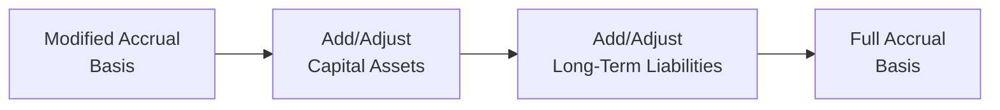

## 20.1 Modified Accrual vs. Full Accrual Conversions

Governmental accounting often requires the preparation of two main types of financial statements: fund financial statements (using the modified accrual basis of accounting) and government-wide statements (using the full accrual basis). While fund statements focus on current financial resources and short-term liquidity, the government-wide statements are designed to present a broader view of a government’s financial position by incorporating long-term assets and liabilities. This section explores the conceptual differences between modified accrual and full accrual, then provides a detailed discussion on how to convert from one basis to the other, with special attention to typical conversion entries for capital assets and long-term liabilities.

A proper understanding of these conversions is critical for governmental accountants, auditors, and CPA exam candidates. Conversions reflect the adjustments and reconciliations needed to present a holistic view of government finances. In conjunction with Chapter 19 (Governmental Accounting Fundamentals) and Chapter 21 (Reconciliations and Government-Wide Reporting), these insights will strengthen your knowledge of how governmental activities are measured and reported.

  
Introduction

Governmental funds traditionally use the modified accrual basis of accounting and the current financial resources measurement focus. This approach emphasizes expenditures and revenues that are measurable and available to finance current operations. However, the Governmental Accounting Standards Board (GASB) requires that government-wide statements be prepared using the full accrual basis of accounting and the economic resources measurement focus, similar to the basis of accounting used in private-sector or commercial entities. That means activities reported in the fund statements often need to be adjusted to align with long-term resource flows and positions.

  
Key Distinctions Between Modified Accrual and Full Accrual

Modified Accrual Basis:
• Focuses on current financial resources.  
• Recognizes revenues when they are measurable and available.  
• Recognizes expenditures primarily when liabilities are incurred, only if they are normally expected to be liquidated with current financial resources.  
• Capital outlays and debt service payments are recognized as expenditures.  
• Long-term liabilities and assets are generally not displayed on the face of governmental fund balance sheets.

Full Accrual Basis:
• Emphasizes economic resources.  
• Recognizes revenues when they are earned and available for use, regardless of the timing of related cash flows.  
• Recognizes expenses when they are incurred, not merely when resources are expended.  
• Requires capital assets and long-term liabilities to be recorded in the statement of net position.  
• Depreciation expense is recognized for capital assets over their useful lives.

  
Why Conversion Entries Are Needed

While the modified accrual basis provides financial information useful for budgetary control and short-term decision making, it does not capture the comprehensive economic resources of the government. This is why government-wide statements (Statement of Net Position and Statement of Activities) must be presented using full accrual accounting. The conversion process involves eliminating or reclassifying certain accounts and events, giving users a more complete picture of the government’s long-term financial health.

In particular, two high-impact areas in these conversions are capital assets and long-term liabilities. Under modified accrual, capital asset purchases are reported as expenditures, and bond proceeds are reported as other financing sources. However, neither the asset itself nor the outstanding bond principal is typically recorded long-term on governmental fund balance sheets. Conversion entries are necessary to bring these long-term items onto the government-wide statement of net position and properly reflect their associated expenses or revenues in the statement of activities.

  
Typical Conversion Entries

The process of converting from modified accrual to full accrual can be approached systematically. Many governments maintain a reconciliation schedule at year-end showing how each fund’s balance is adjusted to arrive at net position under full accrual. Each typical conversion entry has the general goal of either (1) recognizing long-term items omitted in modified accrual or (2) eliminating or reclassifying transactions that were treated differently under the current financial resources measurement focus.

Below is a summary of common conversion adjustments:

• Capital Assets:
  – Recording the historical cost and accumulated depreciation of government-owned assets.  
  – Converting capital outlay expenditures to capital assets.  
  – Recording depreciation expense for the period.  
  – Recording gains or losses on disposals of capital assets, if any.  

• Long-Term Debt and Other Long-Term Liabilities:
  – Reclassifying proceeds of long-term debt from “Other Financing Sources” to a liability.  
  – Recording long-term liabilities (bonds payable, notes payable, etc.) instead of showing them only as an expenditure when paid.  
  – Recognizing accrued interest payable that extends beyond the current period.  
  – Eliminating certain expenditures (e.g., bond principal repayment) and instead recording a reduction of the liability.  

• Revenues and Other Adjustments:
  – Reclassifying revenue recognition timing if earned but not “available.”  
  – Removing deferred inflows of resources that do not meet the standard for deferral under full accrual.  
  – Consolidating internal service fund activities, if any, into governmental activities.  

Each government’s particular conversion journal entries will vary depending on the nature, materiality, and complexity of transactions. However, the underlying objective remains consistent: to portray the government’s resources and obligations within an accrual framework.

  
Step-by-Step Conversion for Capital Assets

1) Identify Expenditure-Related Capital Assets  
   During the year, the governmental fund statements report “capital outlay” expenditures for purchases of equipment, infrastructure, land, buildings, and related improvements. Under the full accrual basis, these outlays must be capitalized to reflect the acquisition of long-term assets rather than simply written off as current expenditures.

2) Record or Adjust Capital Assets  
   A simple approach for conversion is to debit the capital asset account and credit an account within “Net Position” (or in an intermediate step, use a “Conversion/Adjustment” account) to properly reflect the historical cost of the asset:
   • Debit Capital Assets  
   • Credit Net Position (or Conversion Entries Account)  

   The offset to Net Position is commonly used when there is no preexisting “Capital Outlay” account on the full accrual books. If a government uses a conversion worksheet, this entry may simply appear in the reconciliation schedule, not in the general ledger itself.

3) Record Depreciation Expense  
   Full accrual accounting requires depreciation of capital assets over their useful lives (except for inexhaustible assets such as land). Under modified accrual, no depreciation is recognized in the governmental funds. A typical entry for depreciation might be:
   • Debit Depreciation Expense  
   • Credit Accumulated Depreciation  

   Over time, the total net book value of each asset class will align with the portion of economic benefits that remain and the portion that has been consumed.

4) Eliminate Capital Outlay Expenditures  
   Because capital outlay expenditures (in the fund statements) do not represent a reduction in net position under full accrual, they are reclassified:
   • Debit Net Position (or an “Expenditures—Capital Outlay” reclassification line on the conversion schedule)  
   • Credit Expenditures—Capital Outlay  

5) Recognize Gains/Losses on Disposal  
   If the government disposes of a long-term asset, a gain or loss on disposal would be recognized under the full accrual basis. Under modified accrual, the proceeds from the sale of an asset are reported typically as other financing sources, and the asset’s removal from the books is not recorded. Upon conversion:
   • Debit Proceeds—Sale of Asset (to eliminate from the fund perspective)  
   • Debit Accumulated Depreciation (full amount)  
   • Credit Capital Asset (historical cost)  
   • Credit Gain on Disposal of Capital Asset (if applicable)  

  
Step-by-Step Conversion for Long-Term Liabilities

1) Recognize Long-Term Debt Issued  
   Governments typically report the proceeds from issuing long-term debt as an “Other Financing Source” in fund statements. In full accrual statements, these proceeds must appear as a liability on the Statement of Net Position. The conversion entry might be:
   • Debit Other Financing Sources—Bond Proceeds  
   • Credit Bonds Payable  

2) Recognize Principal Payments as a Reduction of Liabilities  
   Under modified accrual, principal payments on bonds or notes are recognized as expenditures. However, in accrual-based statements, payment of principal decreases the liability rather than reducing net position (as an expense). The conversion entry might be:
   • Debit Bonds Payable  
   • Credit Expenditures—Bond Principal  

3) Accrued Interest Payable  
   Under modified accrual, interest usually is recognized only when due and payable within the current period. Accrual accounting requires any unpaid, earned interest to be recorded:
   • Debit Interest Expense  
   • Credit Interest Payable  

4) Other Long-Term Liabilities  
   Governments may have pension obligations, OPEB (Other Postemployment Benefits), and other long-term liabilities recorded under full accrual. These are typically omitted (or underreported) in the fund statements. Part of the conversion might be:
   • Debit Net Position (or a relevant expense line item)  
   • Credit OPEB Liability (for instance)  

These journal entries provide a simplified illustration. Actual practice often involves more detailed and nuanced entries depending on the government’s policy choices, bond structures, and the presence of other deferrals or categories such as premiums, discounts, or refunds related to debt.

  
Real-World Conversion Example

Imagine a local municipality, Greatville, that purchases a new fire truck for $500,000 and finances it by issuing general obligation bonds. Under the governmental fund perspective:

• The purchase of the fire truck is recorded as an expenditure—capital outlay of $500,000 in the General Fund.  
• Proceeds from bonds of $500,000 are recognized as other financing sources in the General Fund.  

When preparing government-wide statements:

• Greatville records the fire truck in capital assets at $500,000.  
• Greatville eliminates the capital outlay expenditure (since it is not an expense in full accrual).  
• Greatville credits bonds payable for $500,000, converting the other financing source in the funds to a liability.  
• As time passes, the municipality will record depreciation on the fire truck.  
• Any principal repayments reduce the Bonds Payable balance instead of recording an “Expenditure—Bond Principal.”

  
Visualizing the Conversion Flow

Below is a simple diagram illustrating how a government moves from the modified accrual (fund-level) perspective to the full accrual (government-wide) perspective. While the actual process involves multiple lines on a reconciliation worksheet, this figure aims to show the conceptual flow.

• Starting from the modified accrual basis, the government identifies expenditures related to capital assets and reclassifies them as assets.  
• It similarly identifies other financing sources for debt proceeds and reclassifies them as liabilities.  
• Additional adjustments for depreciation, accrued interest, and other items finalize the transition to the full accrual basis.

  
Best Practices

• Maintain a Year-End Conversion Schedule: Track each fund’s year-end balances and systematically apply each conversion adjustment. This process often involves a spreadsheet listing all capital assets, debt issuance, and other items that need to be added or removed.  
• Use Detailed Capital Asset Records: Keep robust capital asset ledgers detailing acquisition date, cost, salvage value, and depreciation method. Thorough documentation facilitates accurate conversion.  
• Reconcile and Verify Data: Cross-check converted amounts against prior-year closing balances, budgetary records, bond statements, and other supporting documentation.  
• Stay Current with GASB Pronouncements: Standards evolve, particularly for pensions (GASB 68), OPEB (GASB 75), and other obligations. Keep up-to-date to ensure accurate conversions.  
• Engage in Continuous Communication: Work closely with other departments, such as public works or IT, to ensure all capital asset acquisitions, dispositions, and impairments are tracked throughout the year.

  
Common Pitfalls and Challenges

• Omitting Depreciation: Failing to record depreciation leads to overstated net position and understates the total expense in government-wide statements.  
• Incorrectly Handling Bond Premiums or Discounts: Not all debt proceeds translate directly into face-value bond liabilities. Premiums or discounts must be amortized over the life of the bond in accrual statements.  
• Overlooking Infrastructure Assets: Particularly for large local governments, massive infrastructure assets (bridges, roads) might not be tracked efficiently. This can lead to incomplete or inaccurate capital asset disclosures.  
• Confusion Over Fund Types: Some governments operate internal service funds, enterprise funds, or special revenue funds. Each might already use a different basis of accounting, requiring additional care in consolidation and conversion.  
• Fragmented Recordkeeping: Conversions become infinitely more complex when capital asset data is scattered across multiple spreadsheets or departments.  

  
References and Further Reading

• GASB Statement No. 34: “Basic Financial Statements—and Management’s Discussion and Analysis—for State and Local Governments.”  
• GASB Codification Section 2200: Comprehensive Annual Financial Report (now known as ACFR) format and guidelines.  
• Chapter 19: Governmental Accounting Fundamentals, for an overview of government fund structures.  
• Chapter 21: Reconciliations and Government-Wide Reporting, for detailed steps in preparing the government-wide statements.  
• Government Finance Officers Association (GFOA) publications and best practices on governmental budgetary and accounting matters.  

  
Quiz: Mastering Modified Accrual vs. Full Accrual Conversions



### Which basis of accounting focuses on current financial resources in governmental accounting?

- [ ] Full accrual
- [ ] Cash basis
- [x] Modified accrual
- [ ] Adjusted accrual

> **Explanation:** Modified accrual is used in governmental fund statements and focuses on current financial resources, emphasizing short-term inflows and outflows.

### What is a key reason capital assets are not fully reflected under modified accrual?

- [ ] They are considered intangible property only.
- [x] They are treated as expenditures rather than long-term assets.
- [ ] They have no useful life.
- [ ] They are fully depreciated at purchase.

> **Explanation:** In the modified accrual basis, capital outlays are recognized as expendable resources, rather than being capitalized as long-term assets.

### Under full accrual accounting, what is the correct treatment for bond principal payments?

- [ ] They are recognized as expenditures when incurred.
- [ ] They reduce an Other Financing Source account.
- [ ] They increase the fund balance.
- [x] They reduce the Bonds Payable balance.

> **Explanation:** Principal payments reduce the outstanding liability (Bonds Payable) under the full accrual basis, rather than being recorded as expenditures.

### When converting from fund statements to government-wide statements, how is depreciation typically recognized?

- [ ] It is not recognized under government-wide statements.
- [ ] It is recognized only if the assets were purchased by proprietary funds.
- [x] It is recorded as an expense with a corresponding credit to Accumulated Depreciation.
- [ ] It is recorded as a capital outlay expenditure.

> **Explanation:** Under full accrual, capital assets must be depreciated, thus recording depreciation expense and a corresponding credit to accumulated depreciation.

### Which of the following best describes the focus of the full accrual basis of accounting?

- [x] Economic resources focus
- [ ] Budgetary control
- [ ] Expendable financial resources focus
- [x] Long-term financial position

> **Explanation:** Full accrual accounting emphasizes long-term economic resources, measuring all assets, liabilities, and changes in net position.

### How are long-term liabilities reported in governmental fund statements using modified accrual?

- [ ] They are fully recognized upon issuance.
- [ ] They appear on the balance sheet as a liability.
- [x] They typically do not appear on fund balance sheets unless currently due.
- [ ] They are recognized only if backed by the enterprise fund.

> **Explanation:** Under modified accrual, only liabilities expected to require current financial resources are recognized; long-term obligations are generally not shown on the face of the fund statements.

### What is the typical entry to record the issuance of general obligation bonds in a conversion to full accrual?

- [x] Debit Other Financing Sources—Bond Proceeds; Credit Bonds Payable
- [ ] Debit Bonds Payable; Credit Capital Projects Fund
- [x] Debit Other Financing Sources—Bond Proceeds; Credit Net Position
- [ ] Debit Expenditures—Bond Principal; Credit Bonds Payable

> **Explanation:** In a government-wide statement, proceeds from bond issuances (which appear as other financing sources in fund statements) are reclassified as a liability (Bonds Payable).

### In a government-wide presentation, how is a gain on the sale of capital assets typically recorded?

- [ ] It is recorded as other financing sources.
- [x] It is reflected in the statement of activities as a revenue or gain.
- [ ] It offsets depreciation expense directly.
- [ ] It is not recognized unless the assets were purchased with restricted funds.

> **Explanation:** Under the full accrual approach, proceeds from the sale of fixed assets and their respective net book values must be recognized, resulting in any gain or loss in the statement of activities.

### Why might a government unintentionally overstate its net position when converting to full accrual?

- [x] It fails to record accumulated depreciation.
- [ ] It records intangible assets as liabilities.
- [ ] It accrues more revenue than is earned.
- [ ] It capitalizes all credit card fees.

> **Explanation:** If depreciation is omitted or understated, the asset values remain high while expenses are understated, thus net position is overstated.

### True or False: Under the modified accrual basis, only interest payable that is due and payable shortly after year-end is typically recognized as an expenditure.

- [x] True
- [ ] False

> **Explanation:** Interest expenditures are usually recognized in the period when funds are available and due under modified accrual, whereas full accrual recognizes interest when incurred.



  
## For Additional Practice and Deeper Preparation

### [Business Analysis and Reporting (BAR) CPA Mock Exams](https://www.udemy.com/course/bar-cpa-mock-exams/?referralCode=ADBE2E84BEE9CB6243CA)

**Business Analysis and Reporting (BAR) CPA Mocks:** 6 Full (1,500 Qs), Harder Than Real! In-Depth & Clear. Crush With Confidence!

- Tackle full-length mock exams designed to mirror real BAR questions.  
- Refine your exam-day strategies with detailed, step-by-step solutions for every scenario.  
- Explore in-depth rationales that reinforce higher-level concepts, giving you an edge on test day.  
- Boost confidence and minimize anxiety by mastering every corner of the BAR blueprint.  
- Perfect for those seeking exceptionally hard mocks and real-world readiness.  

_Disclaimer: This course is not endorsed by or affiliated with the AICPA, NASBA, or any official CPA Examination authority. All content is for educational and preparatory purposes only._
