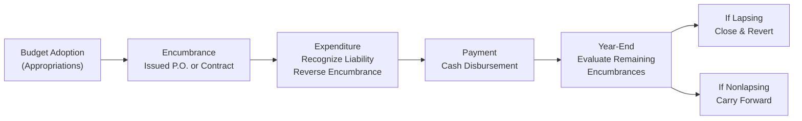

## 20.2 Budgetary Accounting, Encumbrances, and Lapsing

Budgetary accounting is a cornerstone of governmental financial management, ensuring that public funds are spent according to legally adopted budgets. Unlike in for-profit entities, where budgetary oversight is chiefly an internal control mechanism, governmental entities must comply with statutory budget requirements. This compliance framework is central to transparency, accountability, and stewardship of taxpayer resources. In this section, we will explore how budgets are recorded in state and local government accounting systems, emphasize the importance of encumbrances, and discuss the difference between lapsing and nonlapsing appropriations.

------------------------------------------------------------------------------------------------------
  
## Overview of Budgetary Accounting

Budgetary accounting in government organizations aims to:

• Respect legally adopted spending limitations known as appropriations.  
• Provide a control mechanism so that expenditures do not exceed authorized levels.  
• Record and track encumbrances—commitments to spend—that help in preventing overspending.  
• Reflect the practical reality of how government entities plan, authorize, and manage public funds.  

Whereas private entities typically do not incorporate budgets directly into their formal accounting records, governmental funds often include “self-balancing” budgetary accounts to monitor compliance. This approach supports the information needs of citizens, legislators, and oversight bodies.

### Key Budgetary Accounts

Governmental funds commonly track budgets using a set of accounts separate from the conventional asset, liability, revenue, and expenditure accounts. These budgetary accounts include:

• Estimated Revenues: The projected income, typically from taxes, grants, licenses, and fees, that the government anticipates collecting during the forthcoming fiscal period.  
• Appropriations: The authorized expenditure limits established by a legislative body (e.g., city council, state legislature).  
• Estimated Other Financing Sources/Uses: Anticipated inflows (sources) or outflows (uses) not classified strictly as revenues or expenditures, such as interfund transfers and bond proceeds.  
• Budgetary Fund Balance: The difference between estimated revenues (plus other financing sources) and appropriations (plus other financing uses).  

By recording these amounts at the inception of the budget year, governments can track the remaining unspent and unencumbered balance throughout the fiscal period.

------------------------------------------------------------------------------------------------------

## Encumbrances: A Closer Look

An encumbrance, in governmental accounting, represents a commitment to purchase goods or services. It is set aside (or “encumbered”) to ensure that appropriated funds are designated for a specific purpose and will not be inadvertently spent elsewhere. Encumbrances are commonly recorded when a purchase order is issued or a contract is signed.

### Importance of Encumbrances

1. Budgetary Control: Encumbrances help ensure that the government does not overspend its appropriation authority. For instance, once a purchase order is issued, those funds are considered “committed” and cannot be used for any other purpose.  
2. Transparency: Officials and citizens can easily see not only actual expenditures but also anticipated spending, thus offering a more comprehensive view of resource utilization.  
3. Planning and Forecasting: Tracking encumbrances allows government managers to anticipate future cash needs and adjust their activities accordingly.  

### Recording and Clearing Encumbrances

Encumbrances are typically recorded in the governmental fund at the issuance of a purchase order or the signing of a contract. Note that this action merely reserves the budgetary authority; it does not reflect a liability on a Generally Accepted Accounting Principles (GAAP) basis.

When the goods or services are received and the actual expenditure (or accounts payable) is recognized, the related encumbrance is reversed. Thus, the transaction consists of two separate steps:

1. Recording the Encumbrance  
2. Recognizing the Expenditure (and reversing or clearing the Encumbrance)

### Example of an Encumbrance

Suppose a municipal department issues a purchase order for $10,000 of office supplies. At the time of purchase order issuance:

• Debit Encumbrances – Supplies ……… $10,000  
• Credit Budgetary Fund Balance – Reserve for Encumbrances ……… $10,000  

Upon receipt of the supplies, assume the supplier invoice also amounts to $10,000:

• Debit Budgetary Fund Balance – Reserve for Encumbrances ……… $10,000  
• Credit Encumbrances – Supplies ……… $10,000  

Simultaneously, an expenditure entry is made:

• Debit Expenditures – Supplies ……… $10,000  
• Credit Accounts Payable ……… $10,000  

Because government funds use a modified accrual basis for accounting, the expenditure is recognized at the time the liability is incurred (receipt of goods), not at the time of actual cash disbursement.

------------------------------------------------------------------------------------------------------

## Lapsing vs. Nonlapsing Appropriations

Appropriations often carry a specified term, usually the government’s fiscal year. Depending on whether unspent funds can carry over to the next fiscal period, appropriations are categorized as either lapsing or nonlapsing:

### Lapsing Appropriations

“Lapsing” means that any unused appropriation authority (including remaining encumbrances) expires at the end of the fiscal year. These funds revert to the fund balance, and if the agency still requires the goods or services, it must request a new appropriation in the next cycle. Lapsing appropriations reinforce the principle that budgeted funds are to be used within the authorized timeframe.

### Nonlapsing Appropriations

“Nonlapsing” means the budgetary authority extends beyond the current fiscal period, allowing the government unit to carry over unspent funds to subsequent periods. Legislatures or governing bodies may authorize nonlapsing appropriations for certain long-term projects, capital improvement initiatives, or specific mandates that span multiple fiscal years.

### Impact on Encumbrances

Under lapsing appropriations, outstanding encumbrances typically must be closed (or “lapse”) at year-end. If a new appropriation is granted in the subsequent year, previously lapsed encumbrances may be re-established. For a nonlapsing appropriation, however, encumbrances can remain open beyond the fiscal year-end, eliminating the need to liquidate and re-encumber existing purchase orders or contracts.

------------------------------------------------------------------------------------------------------

## Budgetary Accounting and Modified Accrual

Budgetary accounting is an internal control mechanism used in governmental fund-level accounting (e.g., General Fund, Special Revenue Funds). However, Government-Wide Financial Statements (as presented under GASB standards) are prepared using accrual accounting, and the concept of encumbrances is not recognized on the face of those statements. Instead, encumbrances appear as a budgetary control tool within the fund accounting framework.

### Reconciling GAAP and Budgetary Basis

Many governments prepare two sets of reports: one showing data on a budgetary (or "cash + encumbrances") basis, and the other on a GAAP basis. Differences often arise when:

• Certain revenues recognized on a GAAP basis may not be recognized on a budgetary basis (e.g., accrual vs. cash).  
• Encumbrances, recognized for budgetary control, are not recognized as expenditures on a GAAP basis until goods are received and a liability is incurred.  
• Depreciation and certain other GAAP adjustments do not typically appear in budgetary reports.  

In Chapter 21 (Reconciliations and Government-Wide Reporting), we address how governments reconcile net changes in fund balances on a budgetary basis to net changes in fund balances on a GAAP basis.

------------------------------------------------------------------------------------------------------

## Practical Diagram: Budgetary Lifecycle

Below is a simple visual representation of the flow of budgetary authority, encumbrances, expenditures, and the lapsing or carryover decision:

• Budget Adoption: Legislative body approves budget, establishing “Appropriations.”  
• Encumbrance: Once a purchase order (P.O.) is issued or a contract is signed, funds are set aside.  
• Expenditure: Upon receiving the good or service, the government recognizes an actual expenditure and a liability. The encumbrance is reversed.  
• Payment: Settlement of the liability through cash disbursement or another form of payment (often recorded under modified accrual as a separate step).  
• Year-End Evaluation: Determines the status of outstanding encumbrances. If the appropriation is lapsing, the balance reverts to the fund balance. If nonlapsing, the appropriation (and encumbrances) may carry forward.

------------------------------------------------------------------------------------------------------

## Practical Case Study

### City of Pineville’s Office Equipment Purchase

1. The City Council authorizes a $100,000 appropriation for Pineville’s IT department to update office equipment.  
2. In July, the department issues a purchase order to a vendor for $60,000 worth of computer systems. Pineville’s accounting staff records an encumbrance.  
3. In August, the vendor delivers the systems. Pineville recognizes an expenditure, reverses the encumbrance, and books the liability for $60,000. After acceptance, Pineville disburses payment.  
4. As of the fiscal year-end, $40,000 in authorized budget remains unspent. If the city’s appropriation is lapsing, the $40,000 reverts to the fund balance. If it is nonlapsing, the IT department can use the remaining $40,000 during the next fiscal year without additional legislative approval.  

This basic scenario shows how budgetary accounting and encumbrances allow jurisdictions to track committed, spent, and remaining budgetary authority at every step.

------------------------------------------------------------------------------------------------------

## Common Pitfalls and Best Practices

### Pitfall 1: Misunderstanding Encumbrances vs. Expenditures
An encumbrance is not an actual expenditure. It is a reservation of funds. Expenditures should only be recognized when goods or services are received (under modified accrual, when a liability is incurred).

### Pitfall 2: Overlooking the Budgetary vs. GAAP Basis
Certain line items appearing in budget-to-actual reports (i.e., encumbrances) do not match GAAP-based financial statements. Always ensure that the financial statement presentation reconciles any differences.

### Pitfall 3: Failing to Close Encumbrances in a Lapsing Environment
Governments must clear open encumbrances at year-end if the appropriation lapses. Failure to do so can lead to reporting errors and budgetary overstating.

### Pitfall 4: Misclassifying Nonlapsing Appropriations
Some appropriation statutes may carry ambiguous language, making it unclear whether funds truly are nonlapsing. Finance teams should confirm with legal counsel or legislative directives.

### Best Practices
• Maintain updated policies outlining the process for recording and clearing encumbrances.  
• Conduct periodic reviews of open encumbrances to ensure accuracy.  
• Reconcile budgetary reports to GAAP-based financial statements to preserve clarity and transparency.  
• Communicate the lapsing vs. nonlapsing status of appropriations to all relevant departments to prevent confusion or unintentional overspending.

------------------------------------------------------------------------------------------------------

## Additional Resources

For more details on budgetary accounting and encumbrances, consider exploring:

• Government Finance Officers Association (GFOA) publications on best practices for fund accounting.  
• GASB Codification Sections 1700 (The Financial Reporting Entity) and 2200 (Comprehensive Annual Financial Report).  
• Chapter 21: Reconciliations and Government-Wide Reporting, which further discusses year-end adjustments and reconciliations.

------------------------------------------------------------------------------------------------------

## Quiz: Master Budgetary Accounting, Encumbrances, and Lapsing



### Encumbrances in state and local governmental accounting represent:
- [x] Commitments recorded when purchase orders or contracts are issued.
- [ ] Actual expenses recognized upon receipt of goods.
- [ ] Long-term liabilities reported on the government-wide statements.
- [ ] Miscellaneous financing sources within proprietary funds.

> **Explanation:** Encumbrances are a budgetary tool to reflect commitments when purchase orders or contracts are issued, not actual expenditures.

### Which of the following best describes a lapsing appropriation?
- [x] Unused budget authority that expires at the end of the fiscal year and reverts to fund balance.
- [ ] Unlimited budget authority that never reverts.
- [ ] Multiyear authorization that rolls forward automatically.
- [ ] Funds that must be used exclusively for debt service.

> **Explanation:** Lapsing appropriations end at fiscal year-end, and any unspent or unencumbered balance reverts to the fund balance.

### In governmental accounting, which of the following steps occurs first for a purchase?
- [x] Record an encumbrance.
- [ ] Record an expenditure.
- [ ] Close a liability.
- [ ] Pay the vendor.

> **Explanation:** When a purchase order is issued, the government sets aside funds by recording an encumbrance before an expenditure is recognized.

### When an expenditure is recognized (under modified accrual) for goods received, the appropriate journal entry includes:
- [x] Debit Expenditures and Credit Accounts Payable.
- [ ] Debit Encumbrances and Credit Cash.
- [ ] Debit Budgetary Fund Balance – Reserve for Encumbrances and Credit Accounts Payable.
- [ ] Debit Appropriations and Credit Estimated Revenues.

> **Explanation:** Under modified accrual, an expenditure is recorded with a debit to Expenditures and a credit to Accounts Payable upon receipt of goods or services.

### Select all that apply: Nonlapsing appropriations are typically used for:
- [x] Capital projects spanning multiple years.
- [ ] Routine annual operations that must end each year.
- [x] Legislatively mandated programs with multi-year timelines.
- [ ] Daily petty cash expenditures.

> **Explanation:** Nonlapsing appropriations often cover projects or programs that exceed a single fiscal year, such as large capital projects.

### One significant difference between budgetary basis and GAAP basis accounting in governmental financial statements is:
- [x] Encumbrances are recorded under budgetary basis but not recognized as expenditures under GAAP.
- [ ] Capital assets are fully expensed in the year of purchase under GAAP.
- [ ] Revenues are never accrued on a GAAP basis.
- [ ] Fund balances are identical for both bases of accounting.

> **Explanation:** Budgetary accounting recognizes encumbrances, whereas GAAP does not recognize them as expenditures until goods or services are received.

### If an appropriation is about to lapse at year-end and open encumbrances exist, governments usually:
- [x] Close the encumbrances and revert the funds to the fund balance, unless otherwise allowed.
- [ ] Keep the encumbrances open indefinitely.
- [x] Request re-appropriation in the next fiscal year if the expenditures are still necessary.
- [ ] Automatically convert encumbrances to debt.

> **Explanation:** For lapsing appropriations, unspent amounts typically revert, and the government may need to re-establish those encumbrances in the new budget year.

### True or False: In fund-level financial statements, governments typically recognize encumbrances as liabilities.
- [x] False
- [ ] True

> **Explanation:** Encumbrances are not liabilities; they are budgetary reservations of funds. Liabilities arise when goods or services are received, and the expenditure and payable are recorded.

### What is the primary objective of budgetary control in governmental accounting?
- [x] Ensuring compliance with legally adopted spending limits.
- [ ] Maximizing profit and shareholder value.
- [ ] Reporting essentials for multinational corporations.
- [ ] Guaranteeing zero budget variance across all funds.

> **Explanation:** Budgetary control ensures that the government adheres to legislated spending limits and avoids exceeding its authorized budget.

### Which journal entry is used to reverse an encumbrance when goods arrive?
- [x] Debit Budgetary Fund Balance – Reserve for Encumbrances and Credit Encumbrances.
- [ ] Debit Expenditures and Credit Accounts Payable.
- [ ] Debit Encumbrances and Credit Expenditures.
- [ ] Debit Appropriations and Credit Encumbrances.

> **Explanation:** The entry to clear an encumbrance reverses the earlier debit to Encumbrances and credit to Budgetary Fund Balance – Reserve for Encumbrances.



------------------------------------------------------------------------------------------------------

## For Additional Practice and Deeper Preparation

### [Business Analysis and Reporting (BAR) CPA Mock Exams](https://www.udemy.com/course/bar-cpa-mock-exams/?referralCode=ADBE2E84BEE9CB6243CA)  

**Business Analysis and Reporting (BAR) CPA Mocks:** 6 Full (1,500 Qs), Harder Than Real! In-Depth & Clear. Crush With Confidence!

- Tackle full-length mock exams designed to mirror real BAR questions.  
- Refine your exam-day strategies with detailed, step-by-step solutions for every scenario.  
- Explore in-depth rationales that reinforce higher-level concepts, giving you an edge on test day.  
- Boost confidence and minimize anxiety by mastering every corner of the BAR blueprint.  
- Perfect for those seeking exceptionally hard mocks and real-world readiness.  

_Disclaimer: This course is not endorsed by or affiliated with the AICPA, NASBA, or any official CPA Examination authority. All content is for educational and preparatory purposes only._
