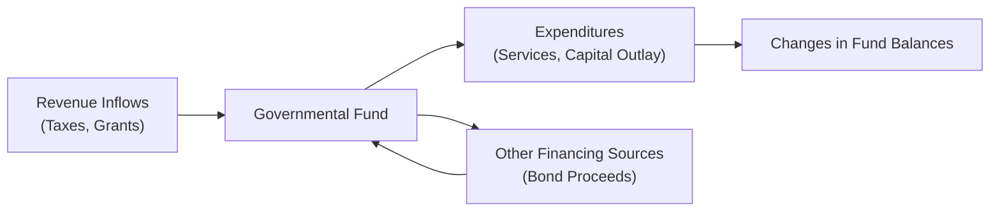

## 20.3 Governmental Fund Statements

Governmental fund statements are central to state and local government financial reporting, providing users with insights into the financial position and operating results of governmental activities. Unlike private-sector organizations, governmental entities must adhere to specialized reporting frameworks under the Governmental Accounting Standards Board (GASB). This section discusses in detail how to prepare the two primary governmental fund statements:
• The Governmental Funds Balance Sheet
• The Statement of Revenues, Expenditures, and Changes in Fund Balances

Through these statements, stakeholders can monitor budgetary compliance, understand the short-term inflows and outflows of economic resources, and assess the effectiveness of government operations.

---

## Overview of Governmental Fund Reporting

State and local governments often rely on multiple funds, each with distinct purposes and legal requirements. Under GASB standards, governments must prepare fund-level financial statements to reflect activities overseen by the modified accrual basis of accounting and the current financial resources measurement focus. This approach distinguishes governmental fund reporting from that of proprietary (business-like) funds or fiduciary funds, which use different sets of measurement focus and basis of accounting.

### Key Governmental Funds

Governments may maintain several types of governmental funds, the most common of which include the following:

• General Fund: The primary operating fund for all financial resources not accounted for in another fund.  
• Special Revenue Funds: Used to track revenues that are legally restricted or committed to specific purposes (e.g., dedicated sales tax for road maintenance).  
• Capital Projects Funds: Account for financial resources restricted, committed, or assigned to the acquisition or construction of major capital assets.  
• Debt Service Funds: Accumulate resources to pay principal and interest on long-term debt.  
• Permanent Funds: Restricted resources that can only be used to support governmental programs and whose principal must remain intact.

These funds capture the most significant parts of governmental operations—particularly functions financed by tax collections. Ultimately, the goal of governmental fund statements is to demonstrate accountability for public resources.

---

## Measurement Focus and Basis of Accounting

### Current Financial Resources Measurement Focus
Governmental fund statements emphasize current financial resources (e.g., cash, receivables, and near-term obligations). This focus centers on the short-term inflows and outflows of funds, excluding long-term assets such as infrastructure or long-term liabilities like general obligation bonds from the balance sheet.

### Modified Accrual Basis of Accounting
Under the modified accrual basis, revenues are recognized only when they are both measurable and available to finance current period expenditures. Similarly, expenditures are recorded when the related fund liability is incurred. However, expenditures for principal and interest on long-term debt are recognized when they become due and payable (rather than over the life of the debt, as under accrual accounting). This approach aims to capture the government’s ability to finance current services and obligations.

---

## Format and Components of the Governmental Funds Balance Sheet

The first of the two required governmental fund financial statements is the Governmental Funds Balance Sheet. This statement provides a snapshot of the government’s near-term resources and obligations.

### Typical Line Items

A Governmental Funds Balance Sheet generally includes:

• Assets  
  – Cash and cash equivalents  
  – Investments  
  – Receivables (e.g., property taxes, grants, interest)  
  – Due from other funds  
  – Inventories and prepaids (nonspendable components of fund balance)

• Liabilities and Deferred Inflows of Resources  
  – Accounts payable  
  – Accrued liabilities (e.g., salaries, benefits)  
  – Unearned revenues  
  – Due to other funds  
  – Deferred inflows of resources (e.g., property taxes receivable not yet available)

• Fund Balances  
  – Nonspendable (e.g., inventories, permanent fund principal)  
  – Restricted (e.g., externally imposed restrictions by creditors, grantors, or legislation)  
  – Committed (e.g., constraints imposed by formal action of the government’s highest level of decision-making authority)  
  – Assigned (e.g., funds constrained by the intent to be used for a specific purpose)  
  – Unassigned (e.g., residual funds available for any purpose, typically in the general fund)

### Presentation Example

Below is a simplified illustrative structure for a Governmental Funds Balance Sheet:

┌────────────────────────────┬─────────────────────────────┬─────────────────────────────┐
│                            │  General Fund              │  Special Revenue Fund       │
├────────────────────────────┼─────────────────────────────┼─────────────────────────────┤
│                           Assets                                                    │
├────────────────────────────┼─────────────────────────────┼─────────────────────────────┤
│ Cash & Cash Equivalents   │ $1,000,000                  │ $200,000                    │
│ Receivables (Net)         │ 300,000                     │ 100,000                     │
│ Prepaid Items             │ 20,000                      │ 5,000                       │
│ Total Assets              │ $1,320,000                  │ $305,000                    │
├────────────────────────────┼─────────────────────────────┼─────────────────────────────┤
│            Liabilities & Deferred Inflows of Resources                               │
├────────────────────────────┼─────────────────────────────┼─────────────────────────────┤
│ Accounts Payable          │ $150,000                    │ $20,000                     │
│ Accrued Liabilities       │ 50,000                      │ 10,000                      │
│ Deferred Inflows of Res.  │ 40,000                      │ 5,000                       │
│ Total Liabilities &       │ $240,000                    │ $35,000                     │
│ Deferred Inflows          │                             │                             │
├────────────────────────────┼─────────────────────────────┼─────────────────────────────┤
│                           Fund Balances                                              │
├────────────────────────────┼─────────────────────────────┼─────────────────────────────┤
│ Nonspendable              │ $20,000 (Prepaids)          │ $5,000 (Prepaids)           │
│ Restricted                │ -                           │ 100,000 (Grant)             │
│ Committed                 │ 280,000 (Capital Outlays)   │ -                           │
│ Assigned                  │ 100,000 (Encumbrances)      │ 20,000 (Encumbrances)       │
│ Unassigned                │ 680,000                     │ 145,000                     │
│ Total Fund Balances       │ $1,080,000                  │ $270,000                    │
└────────────────────────────┴─────────────────────────────┴─────────────────────────────┘

In practice, you may see separate columns for each major fund and a single aggregate column for nonmajor funds. A total column consolidates all governmental funds. Key footnotes provide details on significant line items such as deferred inflows of resources and major revenue sources.

### Balancing to Government-Wide Statements

GASB requires an accompanying reconciliation from the total governmental fund balances (per the Governmental Funds Balance Sheet) to the net position reported in the government-wide statement of net position. This reconciliation outlines the adjustments related to capital assets, long-term liabilities, and internal service funds that operate under an accrual concept. Though important, that reconciliation is typically separate from the basic Governmental Funds Balance Sheet itself.

---

## Format and Components of the Statement of Revenues, Expenditures, and Changes in Fund Balances

The second primary statement focuses on revenues, expenditures, and changes in fund balances within the reporting period. This statement highlights a government’s operating results and how they affect its fund balances.

### Key Differences from Full Accrual Statements

Under modified accrual accounting, revenue is recognized only when measurable and available. Expenditures are recognized when related liabilities are incurred, typically excluding non-current debt and capital outlays in the same manner as accrual reporting. Thus:

• Long-term debt proceeds are recognized as “Other Financing Sources” (OFS).  
• Capital outlays are recognized as expenditures, rather than capitalizing assets.  
• Principal repayments on debt are expenditures, not reductions of long-term liabilities.  

### Typical Line Items

A typical presentation includes:

• Revenues  
  – Taxes (property, sales, income)  
  – Licenses and permits  
  – Intergovernmental revenues (state/federal grants)  
  – Charges for services (fines, user fees)  
  – Special assessments  

• Expenditures  
  – Current (general government, public safety, transportation, health, welfare)  
  – Capital outlay (capital projects fund)  
  – Debt service (principal and interest)

• Other Financing Sources (Uses)  
  – Issuance of bonds and notes  
  – Transfers in/out from other funds  

• Net Change in Fund Balances  
  – Beginning fund balance  
  – Ending fund balance  

The net change in fund balances directly reflects how well actual revenues covered short-term expenditures, plus the effects of financing operations through bond proceeds, grants, and transfers.

### Illustrative Governmental Fund Statement of Revenues, Expenditures, and Changes in Fund Balances

Below is a simplified view:

┌───────────────────────────────────┬─────────────────────────────┬──────────────────────────────┐
│                                   │ General Fund               │ Special Revenue Fund         │
├───────────────────────────────────┼─────────────────────────────┼──────────────────────────────┤
│ Revenues                                                                                      │
├───────────────────────────────────┼─────────────────────────────┼──────────────────────────────┤
│ Taxes (Property, Sales, etc.)    │ $2,000,000                 │ $300,000                     │
│ Intergovernmental                │ 500,000                     │ 200,000                      │
│ Charges for Services             │ 250,000                     │ 50,000                       │
│ Miscellaneous                    │ 30,000                      │ 5,000                        │
│ Total Revenues                   │ $2,780,000                 │ $555,000                     │
├───────────────────────────────────┼─────────────────────────────┼──────────────────────────────┤
│ Expenditures                                                                                    │
├───────────────────────────────────┼─────────────────────────────┼──────────────────────────────┤
│ Current–Public Safety            │ $800,000                    │ $120,000                     │
│ Current–General Government       │ 400,000                     │ 80,000                       │
│ Capital Outlay                   │ 300,000                     │ -                            │
│ Debt Service: Principal          │ 50,000                      │ 10,000                       │
│ Debt Service: Interest           │ 10,000                      │ 2,000                        │
│ Total Expenditures               │ $1,560,000                  │ $212,000                     │
├───────────────────────────────────┼─────────────────────────────┼──────────────────────────────┤
│ Other Financing Sources (Uses)                                                                │
├───────────────────────────────────┼─────────────────────────────┼──────────────────────────────┤
│ Proceeds from Bonds              │ $200,000                    │ -                            │
│ Transfers in                     │ 50,000                      │ 25,000                       │
│ Transfers out                    │ (80,000)                    │ (10,000)                     │
│ Total Other Financing Sources    │ $170,000                    │ $15,000                      │
├───────────────────────────────────┼─────────────────────────────┼──────────────────────────────┤
│ Net Change in Fund Balances      │ $1,390,000                  │ $358,000                     │
│ Beginning Fund Balances          │ 1,080,000                   │ 270,000                      │
│ Ending Fund Balances             │ $2,470,000                  │ $628,000                     │
└───────────────────────────────────┴─────────────────────────────┴──────────────────────────────┘

---

## Interpreting Governmental Fund Results

### Fund Balance Analysis

Changes in fund balances signal how a government’s current period resources were deployed. A large increase in a fund’s balance might reflect higher-than-expected tax revenues or delayed spending. Conversely, a decrease could indicate that expenditures outpaced operating revenues and available resources. Monitoring changes in restricted, committed, assigned, and unassigned fund balances offers insights into the government’s fiscal health and ability to deliver public services.

### Other Financing Sources (Uses)

In governmental funds, the proceeds of debt issuance appear as Other Financing Sources. While this inflow increases the fund balance, it does not represent revenue in the economic sense. Professional skepticism is advised to distinguish proceeds from recurring revenue and to evaluate ongoing repayment obligations—debt that will eventually appear on the government-wide statement of net position.

### Annual Budget and Actual Comparisons

Many governments present Budget-to-Actual comparisons in Required Supplementary Information (RSI) or separate schedules. This comparison is critical for evaluating fiscal discipline and compliance with legally adopted budgets, but it is not typically part of the basic financial statements.

---

## Best Practices, Pitfalls, and Common Challenges

### Best Practices
• Maintain a robust chart of accounts that identifies unique revenue and expenditure streams quickly.  
• Develop clear policies for classifying fund balance components, especially for restricted, committed, assigned, and unassigned categories.  
• Reconcile subsidiary accrual records for government-wide reporting with modified accrual amounts in the fund statements.

### Pitfalls and Challenges
• Misidentifying the period in which revenues become “available” under modified accrual can lead to material misstatements in revenue.  
• Incorrectly recording long-term debt proceeds or capital outlays can distort the operating picture if not properly accounted for as Other Financing Sources or Expenditures.  
• Handling large interfund transactions without consistent policies can result in balancing issues or duplicate entries.

### Strategies to Overcome Pitfalls
• Employ robust cutoff procedures for revenue recognition, especially near year-end.  
• Adhere to standardized procedures for classifying and reporting capital outlays and debt proceeds.  
• Use regular internal audits or periodic external reviews to ensure compliance with GASB standards.

---

## Practical Example: City of Greenfield

City of Greenfield faces an influx of new grants for environmental projects. The city sets up a special revenue fund to record revenues and expenditures for these grants:

• The City receives $500,000 in federal grant funding for stream restoration, recognized when available.  
• It uses $100,000 for capital outlay in the special revenue fund. Under modified accrual, this is recorded as an expenditure rather than an asset.  
• The City issues $1,000,000 in bonds to finance a major building upgrade. Proceeds are recorded as an Other Financing Source in the Capital Projects Fund’s Statement of Revenues, Expenditures, and Changes in Fund Balances. This spikes the year-end fund balance, even though the money is earmarked for construction.  
• The City must carefully analyze deferred inflows for property taxes that are collected within 60 days of year-end, ensuring they are recognized as revenue in the current period rather than deferred.

By employing the modified accrual basis, City of Greenfield focuses on its current financial resource flows, highlighting near-term obligations and liquidity needs.

---

## Visualizing Fund Activity with Mermaid.js

Diagramming can help illustrate how various types of transactions flow through governmental funds. Below is a Mermaid.js diagram depicting the lifecycle of resources in a governmental fund—from revenue recognition to expenditures and other financing sources.

In this simplified viewpoint:
• Revenues flow into the fund (A → B).  
• The fund disburses resources for expenditures (B → C).  
• The fund may receive proceeds from debt (B → D → B).  
• Ending balances reflect net changes over the period (C → E).

---

## Steps to Preparing Governmental Fund Statements

1. Identify and Classify Transactions.  
   – Determine which funds record which transactions.  
   – Decide whether revenues meet “measurable and available” criteria.

2. Record Revenues and Expenditures.  
   – Follow modified accrual rules.  
   – Recognize expenditures when incurred for operating items and when payable for debt service.

3. Post Other Financing Sources/Uses.  
   – Bond proceeds or transfers in are considered inflows, while transfers out or bond refundings are outflows.

4. Aggregate Data by Major Fund.  
   – Determine major funds according to quantitative thresholds and qualitative factors.  
   – Group nonmajor funds in a single aggregate column.

5. Prepare the Governmental Funds Balance Sheet.  
   – Provide columns for each major fund and one for the aggregate of nonmajor funds.  
   – Classify fund balances properly.

6. Prepare the Statement of Revenues, Expenditures, and Changes in Fund Balances.  
   – Present main revenue sources and expenditure functions.  
   – Include Other Financing Sources and Uses.  
   – Calculate net change in fund balances, then show the beginning and ending balances.

7. Reconcile to Government-Wide Statements.  
   – Account for capital assets, long-term liabilities, and internal service funds under the accrual basis.  
   – Provide a separate schedule or footnote explaining differences.

---

## Additional References

• GASB Codification of Governmental Accounting and Financial Reporting Standards  
• Government Finance Officers Association (GFOA) Best Practices  
• AICPA “Audit and Accounting Guide: State and Local Governments”  
• State-Specific Governmental Accounting Manuals (e.g., California State Controller’s Office guidelines)  

These resources offer deeper insight into nuances such as approach to deferred inflows/outflows, specific capital outlay projects, and recommended footnote disclosures.

---

## Quiz: Governmental Fund Statements



### Under the modified accrual basis, when are revenues typically recognized?

- [x] When they are both measurable and available to finance current expenditures
- [ ] When earned, regardless of availability
- [ ] When cash is received
- [ ] Only after the fiscal year ends

> **Explanation:** Governmental funds use the modified accrual basis of accounting, recognizing revenues when they are measurable and available to cover current period liabilities, usually within 60 days after year-end.

### Which of the following is most likely reported as other financing sources in the Statement of Revenues, Expenditures, and Changes in Fund Balances?

- [x] Proceeds from issuing general obligation bonds
- [ ] Property tax revenues
- [ ] Fines and forfeitures
- [ ] Intergovernmental grants

> **Explanation:** In governmental funds, issuing debt is classified as other financing sources. Revenues like property taxes or fines appear under “Revenues.”

### Which category of fund balance would a revenue stream restricted by law for a specific purpose typically fall under?

- [x] Restricted
- [ ] Committed
- [ ] Assigned
- [ ] Unassigned

> **Explanation:** When an external authority (such as legislation or grant stipulations) imposes constraints on how funds must be used, the fund balance is “Restricted.”

### In a Governmental Funds Balance Sheet, what is the primary measurement focus?

- [x] Current financial resources
- [ ] Economic resources
- [ ] All assets and liabilities, including capital assets
- [ ] Cash flows over the life of the fund

> **Explanation:** Governmental funds use the current financial resources measurement focus, concentrating on short-term financial resources rather than long-term assets or liabilities.

### How would a capital outlay for new municipal vehicles be treated under modified accrual accounting in the general fund?

- [x] As an expenditure
- [ ] As an intangible asset
- [ ] As a reduction of fund balance only
- [ ] It is capitalized and depreciated

> **Explanation:** Under modified accrual, capital expenditures are recognized as expenditures in the period incurred, rather than as capital assets.

### What is the typical purpose of a debt service fund?

- [x] To accumulate resources for paying principal and interest on long-term debts
- [ ] To finance general administrative expenditures
- [ ] To administer special revenue projects
- [ ] To record permanent endowments

> **Explanation:** A debt service fund is specifically designed to gather resources to service the principal and interest of governmental long-term debt.

### Which statement best describes the basis of accounting used by governmental funds?

- [x] Modified accrual basis
- [ ] Full accrual basis
- [x] Focused on current financial resources
- [ ] Cash basis only

> **Explanation:** Governmental funds use a modified accrual basis, emphasizing short-term (current) financial resources, not full accrual.

### How are taxes collected in the next fiscal year but intended for the current fiscal year typically treated?

- [x] As deferred inflows of resources if not collected within the period of availability
- [ ] As revenue in the current period under full accrual
- [ ] As incidentally receivable and never recognized
- [ ] As other financing sources

> **Explanation:** Under modified accrual, taxes not collected within the “availability period” are recorded as deferred inflows, reflecting that they are not available to finance current expenditures.

### Which of the following would normally increase a governmental fund’s fund balance?

- [x] A surplus of revenues over expenditures
- [ ] Issuance of interfund payables
- [ ] Incurring a new long-term debt under the accrual basis
- [ ] Depreciation expense

> **Explanation:** Governmental fund balance typically increases when current period revenues exceed current period expenditures.

### Governmental funds primarily focus on short-term financing. True or False?

- [x] True
- [ ] False

> **Explanation:** Governmental funds concentrate on current financial resources and near-term inflows and outflows, as opposed to long-term economic resources.



---

## For Additional Practice and Deeper Preparation

### [Business Analysis and Reporting (BAR) CPA Mock Exams](https://www.udemy.com/course/bar-cpa-mock-exams/?referralCode=ADBE2E84BEE9CB6243CA)

**Business Analysis and Reporting (BAR) CPA Mocks:** 6 Full (1,500 Qs), Harder Than Real! In-Depth & Clear. Crush With Confidence!

- Tackle full-length mock exams designed to mirror real BAR questions.  
- Refine your exam-day strategies with detailed, step-by-step solutions for every scenario.  
- Explore in-depth rationales that reinforce higher-level concepts, giving you an edge on test day.  
- Boost confidence and minimize anxiety by mastering every corner of the BAR blueprint.  
- Perfect for those seeking exceptionally hard mocks and real-world readiness.

_Disclaimer: This course is not endorsed by or affiliated with the AICPA, NASBA, or any official CPA Examination authority. All content is for educational and preparatory purposes only._
