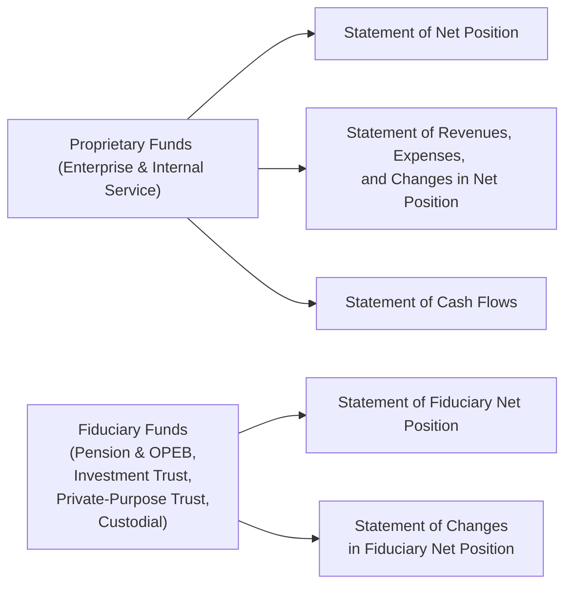
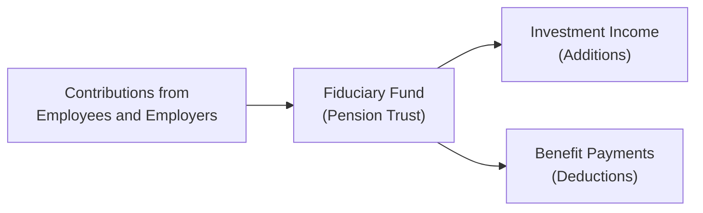

## 20.4 Proprietary and Fiduciary Fund Statements

Proprietary and Fiduciary funds make up two distinct categories in state and local governmental accounting, each with its own measurement focus and financial reporting requirements. Proprietary funds operate much like for-profit entities, emphasizing user charges and self-sustainability, while Fiduciary funds hold resources in trust or custodial capacity for external entities or individuals. Understanding how to prepare and present the financial statements for these funds is crucial for accuracy, transparency, and compliance with generally accepted accounting principles (GAAP) for government entities—particularly those set forth by the Governmental Accounting Standards Board (GASB).

This section examines the key statements for Proprietary and Fiduciary funds, explains the basis of accounting used, highlights common challenges, and includes practical illustrations to enhance mastery of these essential financial statements.

---

### Overview and Key Characteristics

Proprietary funds and Fiduciary funds differ significantly from Governmental funds (explored in detail in Chapter 20.3). Whereas Governmental funds use the modified accrual basis and focus on current resources for budgeting, Proprietary and Fiduciary funds generally follow the accrual basis of accounting, capturing both current and long-term aspects of transactions. This accrual orientation aligns with an economic resources measurement focus that tracks the overall financial position—akin to private-sector accounting. Below is a quick comparison:

• Proprietary Funds  
  – Types: Enterprise Funds (public services funded primarily by user fees) and Internal Service Funds (providing services to other governmental entities).  
  – Accounting Basis: Accrual.  
  – Measurement Focus: Economic resources.  
  – Statements: (1) Statement of Net Position, (2) Statement of Revenues, Expenses, and Changes in Net Position, and (3) Statement of Cash Flows.

• Fiduciary Funds  
  – Types: Pension (and other employee benefit) Trust, Investment Trust, Private-Purpose Trust, and Custodial Funds.  
  – Accounting Basis: Accrual.  
  – Measurement Focus: Economic resources (but resources are held for others and not used to support the government’s own programs).  
  – Statements: (1) Statement of Fiduciary Net Position, and (2) Statement of Changes in Fiduciary Net Position.

The following Mermaid diagram visually summarizes the hierarchy of different fund types and their corresponding statements:

---

### Proprietary Fund Financial Statements

Proprietary funds operate similarly to commercial activities because they aim to recover costs primarily through user charges. Governments often establish Proprietary funds for services such as water utilities, electric utilities, airports, and transit systems. Internal Service Funds are used when a government provides services (e.g., printing, fleet management) to other departments on a cost-reimbursement basis.

#### Statement of Net Position

The Statement of Net Position for Proprietary funds resembles a traditional private-sector balance sheet. It reports all assets, deferred outflows of resources, liabilities, deferred inflows of resources, and net position. Key sections often include:

• Current Assets: Such as cash and cash equivalents, short-term investments, receivables, inventory, and prepaid items.  
• Noncurrent Assets: Capital assets (including infrastructure, machinery, buildings), intangible assets, and long-term receivables.  
• Deferred Outflows of Resources: Consumption of net assets that applies to a future period. Examples often include pension- or OPEB-related items.  
• Current Liabilities: Accounts payable, accrued salaries, current portion of bonds payable, and other obligations due within one year.  
• Noncurrent Liabilities: Bonds payable, long-term loans, and net pension liabilities.  
• Deferred Inflows of Resources: An acquisition of net assets applicable to a future reporting period.  
• Net Position: Commonly divided into three categories:
  – Net Investment in Capital Assets  
  – Restricted Net Position  
  – Unrestricted Net Position  

This structure underscores the economic resources focus, capturing all resources and obligations, current and long-term.

#### Statement of Revenues, Expenses, and Changes in Net Position

Similar to an income statement in private-sector accounting, this statement tracks operating and non-operating revenues and expenses and ties them to changes in net position over the reporting period. Typical line items include:

• Operating Revenues: User charges, fees for services, and other exchange-based revenues.  
• Operating Expenses: Cost of goods sold, payroll, depreciation, materials, and maintenance costs.  
• Non-Operating Revenues (Expenses): Investment income, interest expenses, grants, and other items not directly related to primary operations.  
• Capital Contributions or Transfers: Includes capital grants or contributions from other funds, as well as interfund transfers.  
• Net Position at Beginning and End of Period: Summarizes how the net position changes due to revenues, expenses, and other transactions.

Examples of proprietary fund transactions might include water utility fee collections, which appear as operating revenue, and the associated expenses for maintenance, purification, and distribution infrastructure.

#### Statement of Cash Flows

The Statement of Cash Flows for Proprietary funds follows the accrual basis but is unique in governmental accounting. GASB standards require four broad classifications of cash flows:

1. Operating Activities: Cash receipts and payments directly related to delivering services.  
2. Noncapital Financing Activities: Cash flows from financing not related to capital. For example, receipt of certain operating grants or transfers to/from other funds.  
3. Capital and Related Financing Activities: Acquisition or disposition of capital assets, issuance of bonds or debt for capital purchases, and payment of related interest.  
4. Investing Activities: Purchase or sale of investments, earnings on investments, and other returns on investment-type activities.

Governments frequently use the direct method for presenting Operating Activities, providing detail on actual cash receipts from customers and cash paid to employees and vendors. A reconciliation of operating income (loss) to net cash provided by (used in) operating activities often follows.

---

### Fiduciary Fund Financial Statements

Fiduciary funds are used when a government oversees resources on behalf of external parties, like employees, other governments, or private organizations. While the government is responsible for ensuring these resources are properly administered, these funds do not benefit the government’s own programs or operations. Under GASB standards, Fiduciary funds are not included in the government-wide financial statements (see Chapter 19.2 for an overview of Government-Wide vs. Governmental Funds), although they still have distinct financial statements.

#### Statement of Fiduciary Net Position

Like a balance sheet, the Statement of Fiduciary Net Position reports assets, deferred outflows of resources, liabilities, deferred inflows of resources, and net position for each Fiduciary fund type. However, the primary objective is to show resources held in a trust or custodial capacity. Common Fiduciary fund types include:

• Pension (and Other Employee Benefit) Trust Funds: For accruing resources intended for pensions and other post-employment benefits (OPEB).  
• Investment Trust Funds: For external investment pools managed by the government.  
• Private-Purpose Trust Funds: For trust arrangements benefiting private individuals, organizations, or other governments.  
• Custodial Funds (formerly known as Agency Funds): For resources collected on behalf of, and transferred to, other governmental units or external parties.

A typical Statement of Fiduciary Net Position shows restricted assets, short-term and long-term investments, and liabilities for benefits due to beneficiaries. Pension funds, for instance, would disclose the net pension liability, reflecting any unfunded obligations.

#### Statement of Changes in Fiduciary Net Position

This statement explains how funds have been added to and deducted from Fiduciary fund balances over the reporting period. Typical line items include:

• Additions: Contributions from employees, contributions from governmental employers, investment income, and any other amounts due to the fund.  
• Deductions: Benefit payments (pensions, OPEB, scholarships for private-purpose trusts), administrative expenses, and any other costs.  
• Changes in Net Position: The resulting increase or decrease in resources held in trust or custodial capacity.

It is pivotal to understand that these resources do not belong to the reporting entity itself. Consequently, any net position in fiduciary funds remains unavailable for governmental use.

---

### Practical Illustrations and Cases

To bring these concepts to life, consider the following real-world scenarios:

• A city’s Water and Sewer Fund (an Enterprise fund) charges customers for water usage. Its Statement of Net Position reflects pipelines, reservoirs, pumping stations, net of accumulated depreciation, and any outstanding bonds used to finance system expansions. Operating revenues stem from water billing, while operating expenses include treatment costs, repairs, and depreciation of water infrastructure. The Statement of Cash Flows segregates the city’s inflow from utility billing (Operating Activities), the bond issuance for improvements (Capital and Related Financing), and short-term investments (Investing Activities).

• An Internal Service Fund for Fleet Management provides vehicle maintenance to city departments on a fee-for-service basis. It separately reports net position used to purchase and maintain the city’s fleet. The fees it charges other departments appear as operating revenues, and the repair shop staff wages and parts costs appear as operating expenses. If the Fleet Management fund has significant capital outlays for new vehicles, those transactions appear under Capital and Related Financing on the Statement of Cash Flows.

• A County Pension Fund (a Pension (and OPEB) Trust Fund) holds and invests assets contributed by employees and the county government to fund future retiree benefits. Its Statement of Fiduciary Net Position discloses investment holdings, net pension liability, and restricted net position. The Statement of Changes in Fiduciary Net Position highlights the annual additions (employee and employer contributions, plus investment gains) and deductions (benefit payments and administrative expenses).

---

### Common Pitfalls and Challenges

While preparing Proprietary and Fiduciary fund statements, finance professionals frequently encounter the following issues:

• Correct Classification of Transactions: Determining whether certain fees or grants are operating or non-operating revenues can be tricky, impacting the Statement of Revenues, Expenses, and Changes in Net Position.  
• Proper Net Position Categorization: Distinguishing between restricted, unrestricted, and net investment in capital assets is critical. Errors here can misstate the financial position.  
• Pension and OPEB Complexity: Measuring pension and OPEB obligations involves complex actuarial estimates and the recognition of deferred inflows/outflows. Misapplication leads to erroneous net position amounts.  
• Intra-Governmental Transactions: Internal Service funds charge other departments, creating potential duplications or errors when rolling up to governmental activities in the government-wide statements.  
• Reporting Requirements for Custodial Funds: Governments must ensure that custodial funds capture the flow of resources accurately, as they neither recognize revenue nor expenses except for administrative or other direct costs.

---

### Best Practices for Accurate Reporting

Governments striving for excellence in financial reporting frequently adopt these best practices:

• Applying Proper Segregation of Funds: Establish a clear distinction between Enterprise, Internal Service, and Fiduciary uses to avoid intermingling resources or obscuring accountability.  
• Thorough Documentation of Estimates: Pension and OPEB valuations rely heavily on actuarial methods. Document assumptions, discount rates, and mortality tables to facilitate audits and transparent disclosure.  
• Regular Reconciliation: Continuously reconcile operating revenues, expenses, and interfund transfers. This helps detect misclassifications early.  
• Leveraging Technology: As discussed in Chapter 3 (Data and Analytics), robust software tools can automate allocations of costs, track capital assets, and streamline the consolidation of multiple fund statements.  
• Reviewing GASB Updates: GASB periodically issues pronouncements clarifying Fiduciary fund definitions, pension accounting updates, and other refinements. Staying current prevents noncompliance.

---

### Additional Diagrams and Tools

Below is a simplified diagram focusing on the flow of resources in Fiduciary funds, illustrating the cycle of contributions (additions) and benefit payments (deductions):

Explanation:  
• Contributions arrive into the trust (pension fund).  
• The fund invests these contributions, generating returns (investment income).  
• Ultimately, the fund pays out benefits and associated costs.

---

### References and Further Exploration

• GASB Statement No. 34, “Basic Financial Statements—and Management’s Discussion and Analysis—for State and Local Governments.”  
• GASB Statement No. 84, “Fiduciary Activities.”  
• GASB Statement No. 87, “Leases,” with some applicability to Proprietary funds.  
• Chapter 19 of this guide for general Governmental Accounting Fundamentals.  
• Chapter 21 for Reconciliations and Government-Wide Reporting, providing insights into how Proprietary and Fiduciary activities integrate with the overall financial picture of governmental reporting.  
• (Optional) Online resources, such as the Government Finance Officers Association (GFOA) website, for best practices in governmental accounting and reporting.  

---

## Test Your Knowledge: Mastering Proprietary and Fiduciary Fund Statements



### Which of the following is a correct statement about Proprietary funds?
- [x] Proprietary funds follow an accrual basis of accounting and an economic resources measurement focus.
- [ ] Proprietary funds use the modified accrual basis of accounting.
- [ ] Proprietary funds do not account for long-term liabilities.
- [ ] Proprietary funds are the only fund type included in government-wide financial statements.

> **Explanation:** Proprietary funds use accrual accounting and the economic resources measurement focus. They do report long-term assets and liabilities similar to for-profit entities.

### In a Statement of Net Position for an Enterprise Fund, which of the following items is typically listed under Noncurrent Assets?
- [x] Capital assets, such as buildings, equipment, and infrastructure.
- [ ] Overnight money market investments.
- [ ] Accounts payable to vendors.
- [ ] Unearned revenue from annual subscription fees.

> **Explanation:** Noncurrent assets generally include long-lived assets like buildings, equipment, and intangible assets. The other choices are current items or liabilities.

### Which of the following statements is NOT typically prepared for Fiduciary Funds?
- [x] Statement of Cash Flows.
- [ ] Statement of Fiduciary Net Position.
- [ ] Statement of Changes in Fiduciary Net Position.
- [ ] Both are prepared, but not included in government-wide statements.

> **Explanation:** Fiduciary funds are not required to present a Statement of Cash Flows. Instead, they have the Statement of Fiduciary Net Position and the Statement of Changes in Fiduciary Net Position.

### What are the four categories of cash flows reported in the Statement of Cash Flows for a Proprietary fund?
- [x] Operating; Noncapital Financing; Capital and Related Financing; and Investing.
- [ ] Operating; Capital; Operating Financing; and Miscellaneous.
- [ ] Operating; Investing; Financing; and Investing again.
- [ ] Capital and Related Financing; Organizational; Transactional; and Other.

> **Explanation:** GASB requires these specific four categories to provide transparency around the source and use of cash in Proprietary funds.

### In a Pension Trust Fund, which of the following would most likely appear under “Additions” on the Statement of Changes in Fiduciary Net Position?
- [x] Contributions from employees and the sponsoring government.
- [ ] Interfund transfers to a Capital Projects Fund.
- [x] Investment income earned by the trust’s assets.
- [ ] Depreciation expense on pension buildings.

> **Explanation:** Primary additions to a pension trust typically include contributions and investment income. Depreciation expense is not added; it’s considered part of the trust’s overhead or reductions to net position if applicable.

### Why are Fiduciary funds not included in the government-wide financial statements?
- [x] Because these resources are not available for use by the government itself.
- [ ] Because the government chooses not to report them.
- [ ] They never have any operational impact.
- [ ] They are reported with Enterprise funds in the same statements.

> **Explanation:** By definition, fiduciary funds hold resources for external parties; the government does not own these resources, hence they are excluded from government-wide financial statements.

### Where would you most likely find the fleet maintenance operations if it primarily serves other governmental units?
- [x] Internal Service Fund, reported as a Proprietary fund.
- [ ] Enterprise Fund, reported as a Proprietary fund.
- [x] Special Revenue Fund, reported as a Governmental fund.
- [ ] Fiduciary Fund, because it manages resources on behalf of external parties.

> **Explanation:** Fleet maintenance that provides services to the government’s own departments is usually set up as an Internal Service Fund, a subcategory of Proprietary funds.

### Which statement accurately describes the significance of Net Investment in Capital Assets?
- [x] It represents the portion of net position tied up in capital assets, net of related debt.
- [ ] It represents the portion of capital assets that are fully depreciated and thus have no impact on net position.
- [ ] It represents restricted funds designated for future capital improvements.
- [ ] It is an optional category determined by management discretion.

> **Explanation:** Net Investment in Capital Assets is a standard classification showing the government’s investment in capital assets net of any related outstanding debt used to acquire those assets.

### For an Enterprise Fund, which transaction would appear under “Capital and Related Financing Activities” in the Statement of Cash Flows?
- [x] Cash inflows from issuing bonds to finance new utility infrastructure.
- [ ] Cash paid to employees for salaries.
- [ ] Cash received from customers for monthly service charges.
- [ ] Cash receipts from interest earned on short-term investments.

> **Explanation:** Issuing bonds for capital assets is included in the “Capital and Related Financing Activities” section. Salaries and customer payments fall under Operating Activities; interest earned on short-term investments is typically an Investing Activity.

### Fiduciary funds are required to use accrual accounting. True or False?
- [x] True
- [ ] False

> **Explanation:** All Fiduciary funds use the economic resources measurement focus and accrual basis of accounting, consistent with private-sector accounting principles.



---

## For Additional Practice and Deeper Preparation

### [Business Analysis and Reporting (BAR) CPA Mock Exams](https://www.udemy.com/course/bar-cpa-mock-exams/?referralCode=ADBE2E84BEE9CB6243CA)  

**Business Analysis and Reporting (BAR) CPA Mocks:** 6 Full (1,500 Qs), Harder Than Real! In-Depth & Clear. Crush With Confidence!  

- Tackle full-length mock exams designed to mirror real BAR questions.  
- Refine your exam-day strategies with detailed, step-by-step solutions for every scenario.  
- Explore in-depth rationales that reinforce higher-level concepts, giving you an edge on test day.  
- Boost confidence and minimize anxiety by mastering every corner of the BAR blueprint.  
- Perfect for those seeking exceptionally hard mocks and real-world readiness.  

_Disclaimer: This course is not endorsed by or affiliated with the AICPA, NASBA, or any official CPA Examination authority. All content is for educational and preparatory purposes only._
