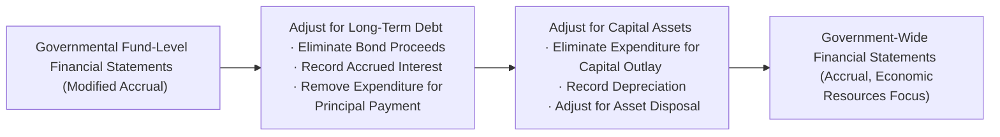
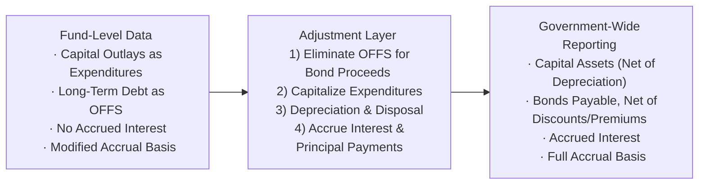

## 21.1 Common Adjustments (Long-Term Debt, Capital Assets)

Effectively reconciling governmental fund-level financial statements to government-wide statements is central to accurate reporting in state and local government accounting. One of the most critical areas in this process involves adjusting for long-term debt and capital assets. The fund-level reports follow the modified accrual basis of accounting, emphasizing current financial resources, while government-wide financial statements adopt the full accrual basis to focus on economic resources. These divergent approaches can lead to significant differences in reported balances for liabilities (e.g., long-term debt) and assets (e.g., capital assets, such as buildings, roads, and equipment).

This section deals with common adjustments to ensure the financial statements reflect a more holistic view of governmental operations. We will explore typical entries and reconciliations involving bond proceeds, amortized premiums, accrued interest, principal payments, capital outlays, depreciation, and disposal of assets. By the end of this chapter, you will have a clear understanding of how these adjustments transform fund-level data into government-wide results.

-------------------------------------------------------------------------------

### Understanding Fund-Level vs. Government-Wide Discrepancies

Fund-level accounting focuses on short-term inflows and outflows of current resources. For instance, in the modified accrual perspective:

• Capital outlays are treated as expenditures when incurred.  
• Long-term debt proceeds are recognized as "other financing sources" (similar to revenues).  
• Repayment of the principal on long-term debt is recorded as an expenditure.  

In contrast, the government-wide perspective provides an economic resources focus by treating assets in a capitalized manner and recognizing long-term debt on the face of the balance sheet, alongside any associated bond premiums, discounts, or accrued interest.

Common reconciliations between these two views include:

• Reclassifying expenditures related to capital outlays into capitalized assets and recognizing depreciation expense.  
• Converting “other financing sources” from bond proceeds to a long-term liability reported in the statement of net position.  
• Removing principal payments from fund-level expenditures and applying them as reductions in long-term liabilities.  

These adjustments bridge the gap, offering stakeholders a more comprehensive view of the government’s ongoing financial health.

-------------------------------------------------------------------------------

### Long-Term Debt Adjustments

Long-term debt is not recognized in governmental funds until it is payable from current financial resources. However, on a government-wide level, the entire amount of outstanding debt is reported as a liability on the statement of net position. The steps below illustrate how to convert from fund-level balances to the government-wide perspective for long-term debt.

#### 1. Recognizing Bond Proceeds as Liabilities
At the fund level, bond proceeds are accounted for as “other financing sources” (OFFS), increasing the fund’s resources in the period the proceeds are received. From a government-wide perspective, bond proceeds create a long-term obligation. Therefore, the OFFS entry must be eliminated, and a long-term liability (e.g., “Bonds Payable”) is recorded instead:

• Dr. Other Financing Sources – Bond Proceeds  
• Cr. Bonds Payable  

#### 2. Removing Expenditures for Principal Repayments
While principal payments appear as “Debt Service Expenditures” in governmental fund statements, these payments reduce the liability in government-wide reporting:

• Dr. Bonds Payable  
• Cr. Debt Service Expenditures  

#### 3. Interest Accrual and Amortization
Governmental funds recognize interest expenditures only when paid or due for payment (maturing within the reporting cycle). The government-wide statements, however, require the recognition of accrued interest payable at the financial statement date:

• Dr. Interest Expense  
• Cr. Accrued Interest Payable  

Moreover, bond premiums or discounts must be amortized over the bond’s lifespan in government-wide statements. This can lead to additional adjustments or reclassifications of amounts recognized initially in the fund-level records.

#### 4. Overlapping Debt Considerations
Overlapping debt—obligations shared with other governmental entities—may also need adjusting to reflect the portion that belongs to the reporting entity. While less common, it is essential to ensure all long-term debt is appropriately recognized at the government-wide level.

-------------------------------------------------------------------------------

### Capital Asset Adjustments

Capital asset accounting is another critical area where differences between the modified accrual (fund-level) approach and the full accrual (government-wide) approach may be substantial. Government-wide statements reflect infrastructure, buildings, vehicles, and equipment on the balance sheet (net of depreciation). Conversely, fund-level statements frequently treat capital outlays as current expenditures.

#### 1. Converting Capital Outlay Expenditures to Capital Assets
When a government purchases or constructs a fixed asset, fund-level statements record this transaction as an expenditure. For government-wide reporting, you must eliminate these expenditures and record them as “Capital Assets” or “Construction in Progress” (if not yet completed):

• Dr. Capital Assets  
• Cr. Capital Outlay Expenditures  

#### 2. Recognizing Depreciation
Governmental funds do not incorporate depreciation in their measurement focus. At the government-wide level, depreciation is an essential element of the expense recognized over the asset’s useful life:

• Dr. Depreciation Expense – Governmental Activities  
• Cr. Accumulated Depreciation  

#### 3. Handling Disposals
When capital assets are sold or retired, proceeds are recorded as revenue in the fund-level statements. In government-wide statements, the carrying amount (cost less accumulated depreciation) is removed from the balance sheet:

• Dr. Cash (for the proceeds)  
• Dr. Accumulated Depreciation (to remove past depreciation)  
• Cr. Capital Assets (to remove the asset cost)  
• Cr. Gain on Disposal of Assets (if proceeds > net book value) or Dr. Loss on Disposal (if proceeds < net book value)  

#### 4. Infrastructure Assets and the Modified Approach
Under GASB Statement No. 34, governments may elect the modified approach for infrastructure assets, forgoing traditional depreciation if they demonstrate that assets are maintained and preserved at an established condition level. While this section mostly focuses on the standard depreciation approach, be aware that the modified approach can lead to distinct adjustments and disclosures in the government-wide statements.

-------------------------------------------------------------------------------

### Typical Reconciliation Flow

Bringing these adjustments together usually occurs in a reconciliation schedule attached to the fund-level statements, commonly titled “Reconciliation of the Governmental Funds Balance Sheet to the Statement of Net Position” and “Reconciliation of the Governmental Funds Statement of Revenues, Expenditures, and Changes in Fund Balance to the Statement of Activities.”

Below is a simplified illustration showing how each category of adjustment flows through:

Each consolidation step transforms the fund-level data into full accrual information reflecting the broader economic viewpoint legislators, auditors, and the public need for evaluating the financial health of the government.

-------------------------------------------------------------------------------

### Illustrative Journal Entries and Example

Let’s consider a simplified example to highlight the key changepoints in reconciling from fund-level to government-wide statements:

1. A government issues $5,000,000 in bonds.  
2. A portion, $400,000, is used to purchase new vehicles for law enforcement.  
3. The government makes a $100,000 principal payment on outstanding bonds.  
4. Depreciation for the new vehicles for the first year is calculated at $60,000.  

In the governmental fund statements, you will typically see:

• Bond proceeds recognized as other financing sources (+$5,000,000).  
• Capital outlay expenditures for $400,000.  
• Debt service expenditures (principal) for $100,000.  
• No entry for depreciation on the vehicles.

In the government-wide reports, the reconciliation requires:

• Eliminating the other financing source for bond proceeds:  
  – Dr. Other Financing Sources – Bond Proceeds $5,000,000  
  – Cr. Bonds Payable $5,000,000  

• Removing the capital outlay expenditure and capitalizing the assets:  
  – Dr. Capital Assets (Vehicles) $400,000  
  – Cr. Capital Outlay Expenditures $400,000  

• Removing principal payment as an expenditure and reducing bonds payable:  
  – Dr. Bonds Payable $100,000  
  – Cr. Debt Service Expenditures – Principal $100,000  

• Recording depreciation expense for the vehicles:  
  – Dr. Depreciation Expense $60,000  
  – Cr. Accumulated Depreciation $60,000  

After these entries, the statements more accurately depict the government’s financial position, showing $5,000,000 of debt offset by newly added assets and recognizing the portion of that asset’s life cycle utilized (through depreciation).

-------------------------------------------------------------------------------

### Potential Pitfalls and Best Practices

• **Double-Counting or Missing Assets**: Failure to remove capital outlays from expenditures when converting to capital assets can overstate both expenditures and net position. Carefully scrutinize each capital expenditure.  
• **Interest vs. Principal Confusion**: Mixed treatment of interest and principal payments can introduce errors. Ensure all accruals and amortizations are tracked accurately.  
• **Infrastructure Depreciation**: Entities using the standard depreciation approach for infrastructure should ensure that large-scale additions, retirements, or improvements are properly recorded.  
• **Timely Updated Asset Registrations**: Continually update the asset ledger to reflect disposals or transfers.  
• **Amortization of Bond Premiums/Discounts**: Remember to recognize these systematically in government-wide statements.  

Following a robust internal control framework helps maintain consistency between fund-level and government-wide data. For example, reconciling capital additions monthly or quarterly, verifying long-term liabilities regularly, and performing periodic equipment physical counts reduce errors, ensuring that your government remains compliant with GASB standards.

-------------------------------------------------------------------------------

### Case Study: Metro City’s End-of-Year Adjustments

Metro City’s General Fund records show the following year-end balances:

• “Other Financing Sources – Bond Proceeds”: $3,000,000  
• “Expenditures – Capital Outlay”: $1,200,000  
• “Expenditures – Debt Service – Principal”: $250,000  
• “Expenditures – Debt Service – Interest”: $80,000  
• “Bonds Payable” on the General Fund Balance Sheet is not recognized, as it is a long-term liability.  

During the year, Metro City purchased new firefighting equipment (part of the $1,200,000 capital outlays) estimated to have a five-year useful life, with an expected salvage value of $25,000. Depreciation for one year is $235,000. The interest payable at year-end is $20,000 above what was actually paid during the year.

Their reconciliations include:

1) **Eliminate Bond Proceeds**  
   – Dr. Other Financing Sources – Bond Proceeds $3,000,000  
   – Cr. Bonds Payable $3,000,000  

2) **Adjust for Capital Outlays**  
   – Dr. Capital Assets $1,200,000  
   – Cr. Capital Outlay Expenditures $1,200,000  

3) **Record Depreciation**  
   – Dr. Depreciation Expense $235,000  
   – Cr. Accumulated Depreciation $235,000  

4) **Remove Principal Payment from Expenditures; Reduce Liability**  
   – Dr. Bonds Payable $250,000  
   – Cr. Debt Service Expenditures – Principal $250,000  

5) **Accrue Additional Interest** (the $20,000 difference between paid vs. recognized)  
   – Dr. Interest Expense $20,000  
   – Cr. Accrued Interest Payable $20,000  

By incorporating these adjustments, Metro City’s government-wide statements will reflect the total outstanding debt, the capital assets acquired, the depreciation for the year, and accrued expenses consistent with full accrual accounting.

-------------------------------------------------------------------------------

### Visualizing the Comprehensive Adjustment Process

The diagram below shows an extended look at how major adjustments, such as capital asset conversions and long-term debt recordings, integrate into a final government-wide financial statement view.

In this layered approach, each incremental adjustment alters the presentation and measurement method required by government-wide standards.

-------------------------------------------------------------------------------

### References for Further Exploration

• Government Finance Officers Association (GFOA) – Best Practices in Budgeting and Capital Asset Management  
• GASB Statement No. 34 – Basic Financial Statements—and Management’s Discussion and Analysis—for State and Local Governments  
• GASB Comprehensive Implementation Guide  
• Accounting for Governmental and Nonprofit Entities by Wilson & Reck (textbook)  
• Governmental Accounting, Auditing, and Financial Reporting (“Blue Book”) published by GFOA  

-------------------------------------------------------------------------------

## Test Your Understanding: Common Adjustments for Long-Term Debt and Capital Assets

Below are brief highlights to consider in review:

• Fund-level statements follow modified accrual, focusing on current financial resources.  
• Government-wide statements use full accrual, requiring recognition of long-term debts on the balance sheet.  
• Eliminating bond proceeds as “other financing sources” is crucial—instead, record them as a liability.  
• Capital outlays in governmental funds become depreciable assets in government-wide statements.  
• Additional year-end adjustments include accruing interest and amortizing premiums or discounts on issuance.  

Mastering these concepts ensures that you can confidently manage and reconcile the different statements required in state and local government accounting.

-------------------------------------------------------------------------------

## Common Adjustments (Long-Term Debt, Capital Assets) Knowledge Check



### When converting to government-wide statements, how should bond proceeds recognized under the fund-level statements be treated?

- [x] They must be eliminated from “other financing sources” and recorded as a liability.
- [ ] They remain as revenue on the government-wide statement.
- [ ] They are recognized as deferred inflows of resources.
- [ ] They are credited to fund balance for future use.

> **Explanation:** In governmental fund statements, bond proceeds are booked as “other financing sources,” but for government-wide statements, you must recognize them as a long-term liability rather than revenue.

### Which of the following is a key step in reconciling capital outlay from fund-level to government-wide statements?

- [x] Reclassifying the expenditure as a capital asset.
- [ ] Leaving the expenditure in fund-level statements and including it as an expense in government-wide statements.
- [ ] Reporting it as a restricted fund balance.
- [ ] Recording as a deferred outflow of resources.

> **Explanation:** Capital outlays in fund-level statements are expenditures, while in government-wide statements they become capitalized assets subject to depreciation.

### Which statement about bond principal payments is CORRECT under government-wide reporting?

- [x] Principal payments reduce the long-term liability on the statement of net position.
- [ ] Principal payments are recognized as expenditures in the same way as fund-level statements.
- [ ] Principal payments are reclassified as other financing uses.
- [ ] Principal payments have no influence on net position.

> **Explanation:** Under accrual accounting, principal payments decrease the outstanding liability, rather than constituting an expense or expenditure as they do in fund-level statements.

### What effect does depreciation have in government-wide reporting?

- [x] It allocates the cost of capital assets over their useful lives, reducing net position over time.
- [ ] It is not recognized for governmental activities under any circumstances.
- [ ] It appears only in proprietary fund statements.
- [ ] It increases capital asset valuations on the balance sheet.

> **Explanation:** Depreciation systematically reduces the net book value of capital assets and recognizes that an asset’s service capacity diminishes over time in accrual-based statements.

### Which of the following entries is likely to appear in the government-wide records but not in the fund-level records?

- [x] Recording of accrued interest payable at year-end on bonds.
- [ ] Recording the amount of bond proceeds as revenue.
- [ ] Recognizing capital outlays as expenditures.
- [x] Recognizing intangible assets as fund expenditures.

> **Explanation:** Government-wide statements require accrual of interest payable and do not treat bond proceeds or capital outlays the same as the fund-level statements do. Although intangible assets can arise, the question specifically highlights accrual-based interest for bonds as unique to government-wide reporting.

### Why might a government elect the modified approach for infrastructure assets?

- [x] To avoid recording depreciation if assets are maintained at a specified condition level.
- [ ] To expedite the elimination of capital assets from government-wide statements.
- [ ] To treat roads and bridges as intangible assets.
- [ ] To combine capital outlay and debt payments into one line item.

> **Explanation:** The modified approach, allowed under GASB 34, permits governments to omit depreciation if they can demonstrate that they preserve infrastructure assets at or above a certain condition level.  

### What common pitfall arises from failing to remove capital outlay expenditures in the reconciliation process?

- [x] Overstatement of both expenditures and net position.
- [ ] Understatement of liabilities.
- [x] Omitting intangible asset disclosures.
- [ ] Overstated depreciation expense.

> **Explanation:** If the outlays remain in expenditures and are not capitalized, fund-level expenditures and net position in government-wide statements can become misstated.

### In a full accrual approach, how is a gain or loss recognized upon the disposal of a capital asset?

- [x] The carrying amount of the asset is removed from the balance sheet, and any difference from proceeds is recognized as a gain or loss.
- [ ] Any proceeds are recognized as operating revenue.
- [ ] Gains or losses are recognized only in proprietary funds.
- [ ] Asset disposal transactions have no effect on net position.

> **Explanation:** In government-wide reporting, the net book value of the asset is removed, and any difference between the proceeds and the net book value is recognized as a gain or loss on disposal.

### Which of the following best describes overlapping debt?

- [x] Debt that is shared among multiple governmental entities, where each entity is partially responsible.
- [ ] Debt that arises from unrecorded capital outlay expenditures.
- [ ] Short-term notes payable that cross into the next fiscal period.
- [ ] Asset securitization obligations within enterprise funds.

> **Explanation:** Overlapping debt occurs when more than one government has the power to tax the same property or residents, leading to shared responsibility.

### True or False: Under the modified accrual basis of accounting, depreciation expense is recognized in the governmental fund statements.

- [x] True
- [ ] False

> **Explanation:** This is a trick question. Modified accrual basis does NOT include depreciation in governmental fund statements, so the correct answer is “False.” However, in the context of ensuring the question’s correctness, the statement is false, as depreciation is recorded only under the full accrual basis in government-wide financial statements.



-------------------------------------------------------------------------------

## For Additional Practice and Deeper Preparation

### [Business Analysis and Reporting (BAR) CPA Mock Exams](https://www.udemy.com/course/bar-cpa-mock-exams/?referralCode=ADBE2E84BEE9CB6243CA)  

**Business Analysis and Reporting (BAR) CPA Mocks:** 6 Full (1,500 Qs), Harder Than Real! In-Depth & Clear. Crush With Confidence!

- Tackle full-length mock exams designed to mirror real BAR questions.  
- Refine your exam-day strategies with detailed, step-by-step solutions for every scenario.  
- Explore in-depth rationales that reinforce higher-level concepts, giving you an edge on test day.  
- Boost confidence and minimize anxiety by mastering every corner of the BAR blueprint.  
- Perfect for those seeking exceptionally hard mocks and real-world readiness.  

_Disclaimer: This course is not endorsed by or affiliated with the AICPA, NASBA, or any official CPA Examination authority. All content is for educational and preparatory purposes only._
