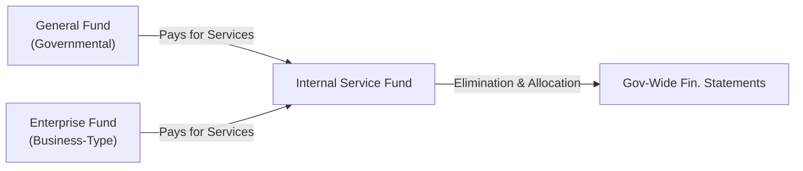

## 21.2 Internal Service Funds and Transfers

Internal Service Funds (ISFs) are a critical component in state and local government accounting, often serving as the operational backbone for other funds by providing centralized functions such as printing services, fleet management, or risk management. Although these funds can be recorded separately for accountability and cost allocation purposes, their transactions with other governmental funds and enterprise funds necessitate careful elimination or reclassification in government-wide financial statements to avoid double counting and present a holistic view of the government’s finances.

This section explores:  
• The unique role of Internal Service Funds and their typical activities.  
• Why transactions among funds must be reclassified or eliminated in consolidation.  
• Key considerations for reconciling ISF balances in government-wide statements.  
• Common pitfalls, best practices, and illustrative examples.  

Throughout this chapter, references will be made to prior discussions on governmental accounting fundamentals (see Chapter 19), preparing governmental financial statements (see Chapter 20), and other sections of Chapter 21 addressing reconciliations and adjustments (see Section 21.1). By understanding the accounting mechanics behind ISFs, accounting professionals can ensure faithful representation of government-wide financials and a transparent view of the cost of government operations.

--------------------------------------------------------------------------------
### Purpose of Internal Service Funds

Internal Service Funds exist to provide goods or services to other governmental funds, departments, or agencies on a cost-reimbursement basis. Common examples include:

• Fleet Management (vehicles, maintenance, fuel)  
• Printing and Copy Services  
• Information Technology (IT) Support  
• Risk Management or Self-Insurance Activities  
• Centralized Purchasing and Warehousing  

ISFs typically operate like a business within government, tracking revenues (internal charges and billings) and expenses on a full accrual basis—similar to enterprise funds. However, unlike enterprise funds, the primary “customers” are other funds of the same government rather than the general public.

#### Advantages of ISFs
• Promotes efficiency and cost control by consolidating resources.  
• Helps track and allocate service costs accurately among user funds.  
• Encourages consistent policies and procedures across various departments.  

#### Key Accounting Characteristics
• ISFs are grouped under proprietary funds, meaning they follow accrual-based accounting.  
• They frequently require budgeting and performance monitoring similar to a private enterprise.  
• Any year-end surpluses or deficits are generally either carried forward or allocated among user funds depending on the government’s policy.

--------------------------------------------------------------------------------
### Transfers Among Funds and the Need for Elimination

When two funds operated by the same government exchange goods or services, one fund’s expenditure (or expense) becomes another fund’s revenue. For example, the General Fund might pay an Internal Service Fund for printing services; this transaction appears as an expenditure in the General Fund and revenue in the Internal Service Fund. However, from the perspective of the entire government, no external monetary transaction has occurred. As a result, the government-wide financial statements (which aggregate activity across all funds under the government’s purview) must eliminate or reclassify these interfund revenues and expenses to avoid overstating the government’s financial position.

#### Double Counting Risk  
If interfund revenue and expense are not eliminated at the government-wide level, total government-wide revenues and expenses would be artificially inflated. This skew could mislead users about the actual scale of the government’s operations and costs.

#### Transfers vs. Reimbursements  
In many cases, amounts reported in the Internal Service Fund are reimbursements for services rendered. These are distinct from purely internal “transfers” that move resources from one fund to another without expectation of direct services in return. Both reimbursements and transfers generally require elimination or reclassification in government-wide statements.

--------------------------------------------------------------------------------
### Government-Wide Reporting Requirements

GASB Statement No. 34 provides the foundation for how state and local governments present their financial statements. Government-wide statements separate activities into:

• **Governmental Activities** – Typically financed through taxes, intergovernmental revenues, and other non-exchange transactions.  
• **Business-Type Activities** – Typically financed through charges for services (e.g., utilities, airports, transit services that rely on user fees).  

#### Positioning Internal Service Funds in the Government-Wide Statements
Internal Service Funds are usually included in the **Governmental Activities** column if their predominant customers are governmental funds, or in **Business-Type Activities** if they primarily serve enterprise funds. If the ISFs serve both governmental and business-type activities, most governments allocate or split the net position proportionally based on actual usage or a reasonable cost allocation methodology.

--------------------------------------------------------------------------------
### Elimination and Reclassification Process

To reconcile Internal Service Funds in government-wide statements, governments typically follow a systematic approach. This process ensures that the net effect of interfund transactions is accurately reflected without double counting revenues or expenses. Below is a generalized sequence of steps:

1. **Identify Interfund Revenue and Expense**  
   Determine the total revenues recognized by the Internal Service Fund from other governmental or enterprise funds. Likewise, identify the corresponding expenditures or expenses in the user funds.

2. **Eliminate Mutual Amounts**  
   In the consolidation process, offset the Internal Service Fund’s interfund revenue against the associated expense recorded in the user fund to remove the internal transaction. This step eliminates duplication of revenue and expense and provides a clearer picture of external revenue only.

3. **Allocate Net Balance to Appropriate Activities**  
   If the Internal Service Fund’s net income or loss remains after these eliminations (e.g., from over- or under-charging user funds), that net effect is typically reclassified. ISFs with governmental customers generally have their excess or deficit included under **Governmental Activities** in government-wide statements. ISFs supporting business-type activities are consolidated with **Business-Type Activities**.

4. **Eliminate Interfund Receivables and Payables**  
   Interfund loans or balances due among ISFs and other funds must also be eliminated in the government-wide Statement of Net Position, unless they reflect amounts due to or from external entities.

5. **Reclassify Transfers, if Necessary**  
   Transfers that represent one-time movements of resources (e.g., start-up capital or continuing subsidies) are permanently eliminated from total government-wide figures to avoid duplications. However, if direct subsidies are intended to shift resources to a specific activity, they might appear as transfers among the columns (Governmental vs. Business-Type), but not in the total.

The following Mermaid diagram illustrates a simplified flow of elimination and reclassification:

In this chart, both the General Fund (a Governmental Activity) and an Enterprise Fund (a Business-Type Activity) purchase services from the Internal Service Fund. The government-wide reporting eliminates these internal sales to avoid double counting and consolidates any residual net position into either Governmental or Business-Type Activities based on usage.

--------------------------------------------------------------------------------
### Practical Example: Printing Services ISF

Consider a city that has an Internal Service Fund for printing and copying services. During a fiscal year:

• The General Fund (governmental activity) purchases printing services worth $200,000.  
• The city’s utilities enterprise fund (business-type activity) purchases printing services worth $70,000.  
• The Internal Service Fund recognizes total revenue of $270,000 ($200,000 + $70,000).  
• The Internal Service Fund’s total operating expenses for the year amount to $250,000.  

In the city’s fund-based financial statements:  
• The General Fund reports an expenditure of $200,000.  
• The Utilities Fund reports an expense of $70,000.  
• The Printing ISF reports $270,000 in revenue and $250,000 in expenses (and thus $20,000 net income).

#### Government-Wide Elimination  
To avoid double counting in the government-wide statements:

1. **Eliminate the $200,000** recognized by the ISF as revenue from the General Fund and the $70,000 from the Utilities Fund. These amounts are netted against the expenses recorded in those funds.  
2. The $20,000 net income derived within the ISF is reallocated. Because the Printing ISF primarily serves governmental activities (over 70% usage was governmental), the net income is consolidated under Governmental Activities in the government-wide statement.  
3. Interfund receivables or payables, if any, related to these transactions are removed.  

In effect, the government-wide statements show that internal costs are netted out, leaving no external revenue or expense from these transactions when looking at the government as a whole.

--------------------------------------------------------------------------------
### Accounting Entries and Schedules

Most governments use worksheets or reconciliations to systematically track adjustments from fund statements to government-wide statements. Common line items in these reconciliation schedules include:

• **Interfund Revenue** from ISFs to be eliminated.  
• **Interfund Expenses/Expenditures** in the user funds to be eliminated.  
• **Capital Asset Adjustments** for capital assets recorded in ISFs.  
• **Debt Balances** if the ISF has borrowed or financed major acquisitions.  
• **Net Position Reclassification** to Governmental or Business-Type Activities.  

By maintaining clear supporting schedules, finance teams and auditors can trace the flow of transactions, confirm the validity of eliminations, and ensure consistent application of cost allocations.

--------------------------------------------------------------------------------
### Complexities with Cost Allocation

Although straightforward in concept, cost allocation in an Internal Service Fund can become complex in practice:

• **Fluctuating Usage** – The ratio of services provided to governmental vs. business-type funds can vary year to year, affecting whether the ISF belongs in Governmental Activities or Business-Type Activities.  
• **Under- or Over-Recovery of Costs** – Governments may choose to set billing rates that do not fully recover costs, leading to operational deficits, or may slightly exceed costs, producing surpluses.  
• **Multiple Service Functions** – One ISF may house different services (e.g., printing, IT, fleet). Each service may have different user bases, complicating how net income or losses are allocated in government-wide statements.  

#### Best Practice: Monitor Rates  
Governments often adopt an annual review of ISF billing rates to ensure that user fees approximate the actual cost of services. Any deficits or surpluses can be addressed through changes in next year’s rates, additional subsidies from other funds, or adjustments to cost classification methods.

--------------------------------------------------------------------------------
### Interfund Transfers: Distinctions and Reporting

Beyond straightforward cost reimbursements, local governments may make interfund transfers to provide operating or capital subsidies to various funds, including ISFs. These transfers are typically reported as **“transfers in”** and **“transfers out”** on the fund statements. At the government-wide level, these transfers:

1. **Are Eliminated in Total** to avoid duplicating resources within the same government.  
2. **May Appear as a Transfer Between Governmental and Business-Type Activities** in the government-wide statement of activities—useful to highlight the flows of resources between such functions.  

However, from a total perspective, they do not affect the “government as a whole” net position, as one portion of government finances is simply donating or allocating resources to another.

--------------------------------------------------------------------------------
### Common Pitfalls and Potential Challenges

1. **Failure to Eliminate Internal Billings** – Overlooking interfund transactions can inflate revenues and expenditures in government-wide statements.  
2. **Improper Allocation** – Incorrectly assigning the net gain/loss of the Internal Service Fund to the wrong activity group (e.g., fully to Governmental Activities when a significant portion of ISF transactions serve enterprise funds).  
3. **Errors in Capital Assets** – Neglecting to consolidate capital assets appropriately can lead to misstatements of the government-wide net position.  
4. **Misclassification of Transfers** – Confusing transfers intended for operating subsidies with reimbursements for services rendered can distort the sense of cost recovery.  

--------------------------------------------------------------------------------
### Strategies to Overcome Common Issues

• **Establish Clear Policies** – Adopt formal policies that distinguish reimbursements, direct transfers, and user charges to ensure consistent accounting treatment.  
• **Use Accrual-Basis Internal Reporting** – Because the ISF is a proprietary fund, all transactions need to be on full accrual basis, and reconciliations to modified accrual statements (in governmental funds) must be systematic.  
• **Develop Well-Structured Cost Allocation Plans** – For governments with multiple ISFs serving various user groups, well-documented cost allocation plans reduce confusion and promote fairness.  
• **Regular Training** – Government finance staff should receive ongoing training on GASB standards for eliminating interfund transactions in government-wide reporting.  
• **Reconciliation Worksheets** – Maintain up-to-date reconciliation schedules that track all interfund transactions, allowing for transparent government-wide roll-up.

--------------------------------------------------------------------------------
### Real-World Scenarios and Case Studies

1. **Self-Insurance ISF** – A county establishes a self-insurance fund handling workers’ compensation, general liability, and health benefits. Premiums are charged to the General Fund, multiple Special Revenue Funds, and an Enterprise Fund (airport). At year-end, staff must systematically eliminate interfund revenues and expenses. The portion of net income from the ISF is aggregated mostly into Governmental Activities (since the General Fund and Special Revenue Funds are the primary participants), with a lesser share allocated to Business-Type Activities.  

2. **IT Services ISF** – A large city’s Information Technology fund primarily services city departments (General Fund, Public Safety Special Revenue Fund) but also manages a public-facing e-commerce platform accounted for in an Enterprise Fund. Determining which portion of net income belongs to Governmental Activities vs. Business-Type Activities involves careful analysis of usage metrics, transaction volumes, and proportionate cost drivers (like CPU usage, staff time, data storage).  

3. **Capital Financing Within an ISF** – An ISF funds capital projects (e.g., a consolidated vehicle fleet facility) through debt issuance. Reconciliation requires rolling the capital assets and related debt into government-wide statements without duplicating interest and depreciation. Interfund transfers from the General Fund to repay the ISF’s debt must be eliminated to avoid inflating total debt service costs.

--------------------------------------------------------------------------------
### Embracing Technology and Data Analytics

As discussed in Chapter 3 on Data and Analytics, robust information systems can help governments manage and automate interfund transactions. This trending shift includes:

• **Cloud-Based ERP Systems** – Streamline the capture of interfund billings, ensuring each invoice is recorded in both the Internal Service Fund and the user fund.  
• **Automated Allocation Engines** – Dynamically update cost allocation measures (e.g., hours worked, consumption metrics).  
• **Dashboards and Real-Time Tracking** – Provide continuous oversight of net positions and highlight anomalies (e.g., an ISF significantly overbilling a particular fund).  

When properly implemented, these technologies reduce reconciliation errors, produce faster closes, and improve transparency.

--------------------------------------------------------------------------------
### References and Further Exploration

• **GASB Statement No. 34** on Basic Financial Statements and Management’s Discussion and Analysis.  
• **GASB Statement No. 10 and 30** for risk financing and insurance-related activities in ISFs.  
• **Chapter 19** (Governmental Accounting Fundamentals) and **Chapter 20** (Preparing Governmental Financial Statements) for foundation.  
• **Chapter 21.1** for additional insights into common reconciliations and adjustment processes.  
• **AICPA Audit Guide** for State and Local Governments, offering practical solutions and examples.  

For a deeper exploration of cost allocation, budgeting best practices, and advanced reconciliation techniques, consider specialized courses from recognized training providers or reference your state’s Government Finance Officers Association (GFOA) guidance.

--------------------------------------------------------------------------------
### Concluding Thoughts

Internal Service Funds deepen the complexity of governmental accounting, but they also enhance cost transparency, resource efficiency, and operational consistency across a government. When carefully managed, the elimination of interfund transactions in government-wide statements provides stakeholders with an accurate perspective of the government’s financial position and operational results. By consistently applying the processes and best practices highlighted here—developing sound cost allocation methods, maintaining precise records, and conducting thorough reconciliations—finance professionals can mitigate common pitfalls and ensure that government-wide results truly represent the entity’s overall economic resources and obligations.

In the next sections, we will continue to explore specialized transactions and events (see Chapter 22), and complete our discussion of reconciliations and reporting for government-wide statements. Accurate recognition and reporting of Internal Service Funds and transfers form a cornerstone for clarity in public sector financial disclosures, reinforcing accountability at every level of government operations.

--------------------------------------------------------------------------------

## Master Your Knowledge of Internal Service Funds and Transfers



### Which statement best describes why Internal Service Fund transactions are eliminated in the government-wide financial statements?

- [x] To avoid double counting revenues and expenses within the same government.
- [ ] To increase the total net position reflected in government-wide statements.
- [ ] To recognize external transactions as internal.
- [ ] To show the ISF operations as a separate business entity.

> **Explanation:** Internal Service Funds, by definition, serve only internal government operations. Eliminating these transactions prevents overstating total revenues and expenses.

### In government-wide statements, where is an Internal Service Fund typically reported if it predominantly serves governmental funds?

- [x] Under Governmental Activities.
- [ ] Under Business-Type Activities.
- [ ] Excluded from the financial statements entirely.
- [ ] Shown as a special component unit.

> **Explanation:** When the majority of an ISF’s services are for governmental activities, its net position and operations are consolidated with Governmental Activities in the government-wide financial statements.

### What is the primary rationale for reclassifying an Internal Service Fund’s net income or loss into Governmental or Business-Type Activities?

- [x] Most of the fund’s transactions and services relate to either governmental or enterprise operations.
- [ ] There is no need to reclassify because ISF financials are kept separate.
- [ ] GASB requires reporting it as an adjustment to general revenue.
- [ ] It simplifies budget reconciliation with the General Fund.

> **Explanation:** The Internal Service Fund’s operating results are attributed to the government-wide function they predominantly serve. This ensures accurate financial reporting for each activity type.

### A motor pool Internal Service Fund bills multiple city departments for vehicle maintenance. In the government-wide statements, what happens to the revenue recognized in the ISF?

- [x] It is eliminated against the expenses of the city departments that used the services.
- [ ] It appears as external revenue in the government’s Statement of Activities.
- [ ] It is converted to a special item reported separately.
- [ ] It is recognized as an ongoing liability to the General Fund.

> **Explanation:** Interfund revenue is eliminated in the consolidation process because the government is effectively providing services to itself.

### Which of the following best reflects a common pitfall in handling Internal Service Fund balances?

- [x] Failing to eliminate interfund charges in the government-wide financial statements.
- [ ] Tracking costs on a proprietary fund basis.
- [x] Improperly allocating the ISF’s net position to Business-Type Activities.
- [ ] Setting up separate enterprise funds for internal activities.

> **Explanation:** One frequent error is not eliminating interfund revenues and expenses, thus overstating the government-wide totals. Another is misallocating net position to the wrong activity column.

### Why might a government choose to set billing rates in an Internal Service Fund below actual cost?

- [x] They want to subsidize the service for operational or policy reasons.
- [ ] They misapplied the accrual basis of accounting.
- [ ] They are mandated by GASB to keep the rates below cost.
- [ ] They intend to remove the need for interfund transfers.

> **Explanation:** Governments sometimes deliberately subsidize internal services to manage departmental budgets or achieve policy goals, leading to under-recovery of costs.

### When an ISF provides services to both Governmental Activities and Business-Type Activities, how is the ISF’s net position typically allocated?

- [x] Allocated between Governmental and Business-Type Activities on a proportionate basis.
- [ ] Placed entirely under Governmental Activities.
- [x] Placed entirely under Business-Type Activities.
- [ ] Eliminated in its entirety.

> **Explanation:** If both types of funds use the ISF, net position is split according to usage or another reasonable cost allocation method.

### How are interfund payables and receivables related to the Internal Service Fund handled at the government-wide level?

- [x] They are eliminated to avoid duplication, except for amounts due to or from external entities.
- [ ] They are reclassified as deferred inflows or outflows of resources.
- [ ] They remain intact to reflect the full extent of the government’s liabilities.
- [ ] They are automatically converted to short-term investments.

> **Explanation:** Since the government primarily owes money to itself in these instances, these internal payables and receivables are eliminated in the government-wide statements.

### If an ISF shows a surplus at year-end and the government decides to transfer the excess funds to a specific capital project in the General Fund, how is this transfer treated in the government-wide statements?

- [x] It is eliminated from total government-wide revenues and expenses.
- [ ] It is recognized as external revenue to inflate the capital project balances.
- [ ] It is converted into a liability on the ISF’s balance sheet.
- [ ] It is recorded as an addition to Business-Type Activities only.

> **Explanation:** Transfers within the same governmental entity do not constitute external revenue or expenses. They are eliminated at the total government-wide level, though they may appear as a transfer between activity columns.

### True or False: An Internal Service Fund can never be reported as part of Business-Type Activities in the government-wide financial statements.

- [x] True
- [ ] False

> **Explanation:** It is actually possible for an ISF to appear under Business-Type Activities if it predominantly serves enterprise funds. However, the question’s statement is “An Internal Service Fund can NEVER be reported as part of Business-Type Activities,” which is incorrect, so the correct answer to that statement is False. 



--------------------------------------------------------------------------------

## For Additional Practice and Deeper Preparation

### [Business Analysis and Reporting (BAR) CPA Mock Exams](https://www.udemy.com/course/bar-cpa-mock-exams/?referralCode=ADBE2E84BEE9CB6243CA)

**Business Analysis and Reporting (BAR) CPA Mocks:** 6 Full (1,500 Qs), Harder Than Real! In-Depth & Clear. Crush With Confidence!

- Tackle full-length mock exams designed to mirror real BAR questions.  
- Refine your exam-day strategies with detailed, step-by-step solutions for every scenario.  
- Explore in-depth rationales that reinforce higher-level concepts, giving you an edge on test day.  
- Boost confidence and minimize anxiety by mastering every corner of the BAR blueprint.  
- Perfect for those seeking exceptionally hard mocks and real-world readiness.  

_Disclaimer: This course is not endorsed by or affiliated with the AICPA, NASBA, or any official CPA Examination authority. All content is for educational and preparatory purposes only._
